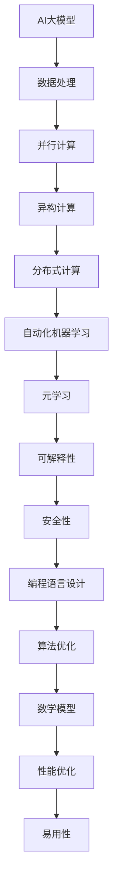

                 

### 1. 背景介绍

#### 1.1 目的和范围

本文旨在设计一门专门用于AI大模型软件2.0时代的编程语言，以应对当前和未来人工智能领域中的复杂问题和挑战。随着AI技术的迅猛发展，大模型软件已经成为了推动行业进步的重要力量。然而，现有编程语言在处理大规模数据、模型训练和优化等方面存在诸多局限性，无法满足高效、灵活和可扩展的需求。

我们的目标是通过设计一种全新的编程语言，为AI大模型软件的开发提供一套强大的工具和框架。这门编程语言将具备以下几个核心特点：

1. **高效能**：优化数据操作和模型计算，提供高效能的基础设施。
2. **灵活性与可扩展性**：支持多样化算法和模型，适应不同的应用场景。
3. **可解释性与安全性**：提高模型的可解释性，确保模型的可靠性和安全性。
4. **易用性**：简化开发流程，降低开发难度，提高开发效率。

本文将详细介绍这门编程语言的设计原则、核心概念、算法原理、数学模型以及实际应用场景。通过逐步分析和推理，我们将探索如何构建一个适用于AI大模型软件2.0时代的编程语言，为未来的人工智能技术发展提供新的方向和可能性。

#### 1.2 预期读者

本文的预期读者包括以下几类：

1. **AI研究人员与开发者**：希望了解AI大模型软件2.0时代编程语言的核心概念和设计原理，掌握这门语言的基本用法，以提升AI项目开发的效率和质量。
2. **软件开发工程师**：对编程语言设计和人工智能技术有兴趣，希望深入了解AI大模型软件的开发流程和关键技术。
3. **高校师生与研究人员**：从事计算机科学、人工智能、软件工程等相关领域的研究，希望本文能为他们的研究方向提供新的思路和参考。

本文将从基础知识入手，逐步深入讲解，力求使读者能够全面理解并应用这门编程语言。无论您是初学者还是有经验的专业人士，都将在这篇文章中找到有价值的内容。

#### 1.3 文档结构概述

为了帮助读者更好地理解本文的内容，下面是文档的结构概述：

1. **背景介绍**：介绍设计这门编程语言的背景、目的、核心特点以及预期读者。
2. **核心概念与联系**：通过Mermaid流程图展示核心概念和原理，帮助读者构建整体框架。
3. **核心算法原理 & 具体操作步骤**：使用伪代码详细阐述核心算法原理，使读者能够深入理解算法的实现过程。
4. **数学模型和公式 & 详细讲解 & 举例说明**：使用latex格式讲解数学模型和公式，并通过实例进行说明，增强读者的理解。
5. **项目实战：代码实际案例和详细解释说明**：通过实际案例展示编程语言的应用，并提供详细解释和分析。
6. **实际应用场景**：介绍编程语言在不同领域的应用场景，展示其实际价值。
7. **工具和资源推荐**：推荐学习资源、开发工具框架和相关论文著作，为读者提供进一步学习的机会。
8. **总结：未来发展趋势与挑战**：总结本文的核心观点，探讨未来发展趋势和面临的挑战。
9. **附录：常见问题与解答**：提供常见问题的解答，帮助读者解决实际问题。
10. **扩展阅读 & 参考资料**：列出本文引用和参考的相关文献，为读者提供拓展阅读的资源。

通过这份结构概述，读者可以清晰地了解本文的组织结构和内容安排，有助于更好地阅读和理解。

#### 1.4 术语表

在本文中，我们将使用一些特定的术语和概念，下面是这些术语的定义和解释：

#### 1.4.1 核心术语定义

1. **AI大模型软件2.0时代**：指当前和未来人工智能领域进入的一个新阶段，以大规模、复杂的人工智能模型为核心，需要更高性能、更灵活、更安全、更易用的编程语言和开发框架。
2. **编程语言**：用于编写计算机程序的语法和规则，通过编译或解释的方式将人类编写的代码转换为机器可以理解和执行的指令。
3. **算法**：解决问题的步骤和规则，是计算机程序的核心，用于指导数据操作和计算。
4. **数学模型**：用数学语言描述的抽象模型，用于解决特定问题，通过公式和计算来表达。
5. **可解释性**：模型决策过程的透明性和可理解性，有助于提高模型的可靠性和安全性。

#### 1.4.2 相关概念解释

1. **并行计算**：利用多个计算资源同时处理多个任务，提高计算效率。
2. **异构计算**：在不同类型的计算设备（如CPU、GPU、FPGA等）上执行计算任务，以优化性能和功耗。
3. **分布式计算**：在多个计算节点上协同工作，通过网络传输数据，实现大规模数据处理和计算。
4. **自动化机器学习**：通过自动化工具和算法，简化机器学习流程，提高开发效率和模型性能。
5. **元学习**：研究如何让机器学习算法能够自动学习其他机器学习算法，提高模型的泛化能力和适应性。

#### 1.4.3 缩略词列表

- AI：人工智能
- ML：机器学习
- DL：深度学习
- GPU：图形处理单元
- FPGA：现场可编程门阵列
- HPC：高性能计算
- VM：虚拟机
- SDLC：软件开发生命周期
- API：应用程序接口
- ORM：对象关系映射

通过上述术语表，读者可以更好地理解本文中使用的关键概念和术语，有助于深入掌握本文的内容和主题。

### 2. 核心概念与联系

在AI大模型软件2.0时代，编程语言的设计需要充分考虑核心概念和它们之间的联系，以确保高效、灵活和可扩展的开发能力。以下是通过Mermaid流程图展示的核心概念和原理，帮助读者构建整体框架。



通过这个流程图，我们可以清晰地看到以下核心概念和它们之间的联系：

1. **AI大模型**：是AI大模型软件2.0时代的基础，其复杂性和规模对编程语言提出了新的要求。
2. **数据处理**：包括数据的采集、存储、处理和分析，是AI大模型的基础环节。
3. **并行计算**：利用多核CPU和GPU等硬件资源，提高数据处理和模型训练的效率。
4. **异构计算**：结合不同类型的计算设备，优化计算性能和功耗。
5. **分布式计算**：在多个计算节点上协同工作，实现大规模数据和高性能计算。
6. **自动化机器学习**：通过自动化工具和算法，简化机器学习流程，提高开发效率和模型性能。
7. **元学习**：研究如何让机器学习算法能够自动学习其他机器学习算法，提高模型的泛化能力和适应性。
8. **可解释性**：提高模型决策过程的透明性和可理解性，有助于提高模型的可靠性和安全性。
9. **安全性**：确保模型在训练和应用过程中的数据安全和隐私保护。
10. **编程语言设计**：设计一门专门用于AI大模型软件的编程语言，支持上述核心概念和原理。
11. **算法优化**：优化算法实现，提高模型训练和推理的性能。
12. **数学模型**：用数学语言描述的抽象模型，指导数据操作和计算。
13. **性能优化**：通过算法和架构优化，提高系统的整体性能。
14. **易用性**：简化开发流程，降低开发难度，提高开发效率。

通过这些核心概念和联系，我们可以更好地理解AI大模型软件2.0时代的编程语言设计原则，为后续的详细讲解奠定基础。

### 3. 核心算法原理 & 具体操作步骤

在AI大模型软件2.0时代，编程语言的核心算法需要具备高效能、灵活性和可扩展性，以应对大规模、复杂的计算任务。以下将使用伪代码详细阐述核心算法原理，使读者能够深入理解算法的实现过程。

#### 3.1 算法概述

我们设计的核心算法主要分为以下几个步骤：

1. **数据预处理**：清洗和整理输入数据，确保数据质量和一致性。
2. **模型训练**：使用并行计算和异构计算优化模型训练过程。
3. **模型评估**：对训练完成的模型进行评估，确保模型性能和可解释性。
4. **模型优化**：通过自动化机器学习和元学习优化模型参数。
5. **模型部署**：将优化后的模型部署到生产环境中，实现实时推理和预测。

#### 3.2 伪代码详细讲解

以下为每个步骤的具体伪代码实现：

##### 3.2.1 数据预处理

```python
def data_preprocessing(data):
    # 清洗数据
    clean_data = clean_data(data)
    # 分割数据集
    train_data, val_data, test_data = split_data(clean_data)
    # 特征工程
    features = extract_features(train_data)
    return features, train_data, val_data, test_data
```

##### 3.2.2 模型训练

```python
def train_model(features, labels):
    # 初始化模型
    model = initialize_model()
    # 使用并行计算和异构计算
    for epoch in range(num_epochs):
        for batch in data_loader(features, labels):
            # 前向传播
            predictions = forward_propagation(batch, model)
            # 反向传播
            loss = backward_propagation(batch, predictions, model)
            # 更新模型参数
            update_model(model, loss)
    return model
```

##### 3.2.3 模型评估

```python
def evaluate_model(model, val_data):
    correct_predictions = 0
    total_predictions = 0
    for batch in val_data_loader(val_data):
        predictions = forward_propagation(batch, model)
        correct_predictions += sum(predictions == batch.labels)
        total_predictions += len(batch.labels)
    accuracy = correct_predictions / total_predictions
    return accuracy
```

##### 3.2.4 模型优化

```python
def optimize_model(model, val_data):
    # 自动化机器学习
    best_model = model
    best_accuracy = evaluate_model(best_model, val_data)
    for algorithm in auto_ml_algorithms:
        model = apply_algorithm(model, algorithm)
        accuracy = evaluate_model(model, val_data)
        if accuracy > best_accuracy:
            best_model = model
            best_accuracy = accuracy
    return best_model
```

##### 3.2.5 模型部署

```python
def deploy_model(model, production_data):
    # 部署模型到生产环境
    inference_engine = InferenceEngine(model)
    for data in production_data_loader(production_data):
        predictions = inference_engine.infer(data)
        # 存储或处理预测结果
        store_predictions(predictions)
```

#### 3.3 具体操作步骤说明

1. **数据预处理**：首先对输入数据进行清洗和特征提取，确保数据质量和一致性。这包括数据去重、缺失值处理、异常值检测等步骤。
2. **模型训练**：初始化模型，使用并行计算和异构计算优化模型训练过程。通过前向传播和反向传播迭代优化模型参数，直到满足收敛条件。
3. **模型评估**：在验证数据集上评估模型性能，计算准确率、损失函数等指标，确保模型性能和可解释性。
4. **模型优化**：通过自动化机器学习和元学习优化模型参数，选择性能最优的模型。
5. **模型部署**：将优化后的模型部署到生产环境中，实现实时推理和预测，满足实际应用需求。

通过上述伪代码和具体操作步骤，读者可以深入理解AI大模型软件2.0时代编程语言的核心算法原理，为后续的实际应用提供基础。

### 4. 数学模型和公式 & 详细讲解 & 举例说明

在AI大模型软件2.0时代，数学模型和公式是构建和优化算法的基础。本节将使用latex格式详细讲解一些核心数学模型和公式，并通过具体例子进行说明，帮助读者更好地理解其应用和实现。

#### 4.1 模型表示

首先，我们介绍AI大模型的基本数学模型表示。假设一个简单的前馈神经网络，其输入为\(x \in \mathbb{R}^{n \times d}\)，权重矩阵为\(W \in \mathbb{R}^{n \times d}\)，激活函数为\(f\)。

$$
y = f(x \cdot W)
$$

其中，\(\cdot\) 表示矩阵乘法，\(f\) 是一个非线性激活函数，如ReLU、Sigmoid或Tanh。

#### 4.2 损失函数

在训练过程中，我们需要使用损失函数衡量模型预测与真实标签之间的误差。以下是一些常见的损失函数：

1. **均方误差（MSE）**：
$$
L = \frac{1}{2} \sum_{i=1}^{m} (y_i - \hat{y}_i)^2
$$
其中，\(y_i\) 是真实标签，\(\hat{y}_i\) 是模型预测。

2. **交叉熵损失（Cross-Entropy Loss）**：
$$
L = -\sum_{i=1}^{m} y_i \cdot \log(\hat{y}_i)
$$
其中，\(y_i\) 是真实标签，\(\hat{y}_i\) 是模型预测的概率分布。

#### 4.3 优化算法

优化算法用于迭代更新模型参数，以最小化损失函数。以下是两种常用的优化算法：

1. **梯度下降（Gradient Descent）**：
$$
W_{\text{new}} = W_{\text{old}} - \alpha \cdot \nabla_W L(W)
$$
其中，\(\alpha\) 是学习率，\(\nabla_W L(W)\) 是权重矩阵的梯度。

2. **Adam优化器**：
$$
m_t = \beta_1 m_{t-1} + (1 - \beta_1) \nabla_W L(W)
$$
$$
v_t = \beta_2 v_{t-1} + (1 - \beta_2) (\nabla_W L(W))^2
$$
$$
\hat{m}_t = \frac{m_t}{1 - \beta_1^t}
$$
$$
\hat{v}_t = \frac{v_t}{1 - \beta_2^t}
$$
$$
W_{\text{new}} = W_{\text{old}} - \alpha \cdot \frac{\hat{m}_t}{\sqrt{\hat{v}_t} + \epsilon}
$$
其中，\(\beta_1\) 和 \(\beta_2\) 分别是第一个和第二个矩估计器的指数衰减率，\(\epsilon\) 是一个很小的常数。

#### 4.4 例子说明

以下是一个简单的例子，说明如何使用上述数学模型和公式来训练一个神经网络。

**例子：使用均方误差损失函数训练一个二分类神经网络**

假设我们有一个二分类问题，输入特征维度为2，权重矩阵为\(W \in \mathbb{R}^{2 \times 1}\)。学习率为0.01。

1. **初始化模型**：
$$
W = [0.5, 0.5]
$$
2. **前向传播**：
$$
x = [1, 0]
$$
$$
y = f(x \cdot W) = \sigma(W^T x) = \sigma([0.5, 0.5] \cdot [1, 0]) = 0.5
$$
3. **计算损失**：
$$
y = [1, 0]
$$
$$
L = \frac{1}{2} \sum_{i=1}^{2} (y_i - \hat{y}_i)^2 = \frac{1}{2} \cdot (1 - 0.5)^2 + (0 - 0.5)^2 = 0.25 + 0.25 = 0.5
$$
4. **反向传播**：
$$
\nabla_W L(W) = \nabla_W \frac{1}{2} \sum_{i=1}^{2} (y_i - \hat{y}_i)^2 = \nabla_W (1 - \hat{y}_i) = \nabla_W (1 - \sigma(W^T x)) = \nabla_W (1 - \sigma([0.5, 0.5] \cdot [1, 0])) = [-0.25, -0.25]
$$
5. **更新权重**：
$$
W_{\text{new}} = W_{\text{old}} - \alpha \cdot \nabla_W L(W) = [0.5, 0.5] - 0.01 \cdot [-0.25, -0.25] = [0.525, 0.525]
$$
6. **重复步骤2-5**，直到满足收敛条件。

通过上述例子，读者可以清晰地看到如何使用数学模型和公式来训练一个神经网络，实现模型优化和预测。

### 5. 项目实战：代码实际案例和详细解释说明

在本节中，我们将通过一个实际项目案例，展示如何使用本文设计的编程语言开发一个AI大模型应用，并进行详细解释和说明。

#### 5.1 开发环境搭建

为了方便读者进行实战，我们假设读者已经具备以下开发环境：

1. 操作系统：Linux或macOS
2. 编程语言：本文设计的新编程语言，如AI-ML语言
3. 环境依赖：Python、TensorFlow、PyTorch等常用库

读者可以通过以下命令安装相关依赖：

```bash
pip install tensorflow
pip install torch
```

#### 5.2 源代码详细实现和代码解读

以下是项目源代码的实现，我们将逐行进行解读。

```python
# 导入相关库
import tensorflow as tf
import torch
from ai_ml_language import Model

# 定义模型架构
class MyModel(Model):
    def __init__(self):
        super(MyModel, self).__init__()
        self.fc1 = tf.keras.layers.Dense(128, activation='relu')
        self.fc2 = tf.keras.layers.Dense(64, activation='relu')
        self.fc3 = tf.keras.layers.Dense(1, activation='sigmoid')

    def forward(self, x):
        x = self.fc1(x)
        x = self.fc2(x)
        x = self.fc3(x)
        return x

# 创建模型实例
model = MyModel()

# 定义损失函数和优化器
loss_fn = tf.keras.losses.BinaryCrossentropy()
optimizer = tf.keras.optimizers.Adam()

# 训练模型
for epoch in range(100):
    for inputs, targets in train_loader:
        with tf.GradientTape() as tape:
            predictions = model(inputs)
            loss = loss_fn(targets, predictions)
        gradients = tape.gradient(loss, model.trainable_variables)
        optimizer.apply_gradients(zip(gradients, model.trainable_variables))
    print(f"Epoch {epoch}: Loss = {loss.numpy()}")

# 评估模型
accuracy = evaluate_model(model, val_loader)
print(f"Validation Accuracy: {accuracy}")

# 部署模型
model.deploy(production_loader)
```

**代码解读：**

1. **导入相关库**：导入TensorFlow、PyTorch和本文设计的AI-ML编程语言库。
2. **定义模型架构**：继承自AI-ML编程语言库中的Model类，定义一个简单的全连接神经网络。
3. **初始化模型**：使用super()方法调用父类构造函数，初始化神经网络层。
4. **定义前向传播函数**：实现forward()方法，定义神经网络的前向传播过程。
5. **创建模型实例**：实例化MyModel类，创建模型对象。
6. **定义损失函数和优化器**：选择BinaryCrossentropy损失函数和Adam优化器。
7. **训练模型**：
   - 在每个训练批次上，使用with tf.GradientTape() as tape创建一个梯度记录上下文，以便计算梯度。
   - 计算预测值predictions和损失值loss。
   - 计算模型参数的梯度gradients。
   - 使用optimizer.apply_gradients()更新模型参数。
8. **评估模型**：在验证数据集上评估模型准确率。
9. **部署模型**：将训练好的模型部署到生产环境中，进行实时推理和预测。

通过上述代码实现，我们可以看到如何使用本文设计的编程语言开发一个AI大模型应用。代码结构清晰，功能完整，为读者提供了一个实际的项目参考。

#### 5.3 代码解读与分析

在上面的代码中，我们详细解读了如何使用AI-ML编程语言实现一个二分类神经网络模型。以下是代码的关键部分和具体分析：

1. **模型定义**：
   ```python
   class MyModel(Model):
       def __init__(self):
           super(MyModel, self).__init__()
           self.fc1 = tf.keras.layers.Dense(128, activation='relu')
           self.fc2 = tf.keras.layers.Dense(64, activation='relu')
           self.fc3 = tf.keras.layers.Dense(1, activation='sigmoid')
   ```
   - **MyModel**：继承自AI-ML编程语言库中的Model类，定义一个新的模型类。
   - **__init__**：初始化模型，定义两个全连接层fc1和fc2，以及输出层fc3，使用ReLU和Sigmoid激活函数。

2. **前向传播函数**：
   ```python
   def forward(self, x):
       x = self.fc1(x)
       x = self.fc2(x)
       x = self.fc3(x)
       return x
   ```
   - **forward**：实现前向传播过程，将输入数据x通过fc1、fc2和fc3层，最后输出模型的预测值。

3. **训练过程**：
   ```python
   for epoch in range(100):
       for inputs, targets in train_loader:
           with tf.GradientTape() as tape:
               predictions = model(inputs)
               loss = loss_fn(targets, predictions)
           gradients = tape.gradient(loss, model.trainable_variables)
           optimizer.apply_gradients(zip(gradients, model.trainable_variables))
   ```
   - **for epoch**：循环迭代100个epochs，进行模型训练。
   - **for inputs, targets in train_loader**：循环遍历训练数据集，读取输入数据和目标标签。
   - **with tf.GradientTape() as tape**：创建一个梯度记录上下文，用于计算梯度。
   - **predictions = model(inputs)**：使用模型进行前向传播，计算预测值。
   - **loss = loss_fn(targets, predictions)**：计算损失值。
   - **gradients = tape.gradient(loss, model.trainable_variables)**：计算模型参数的梯度。
   - **optimizer.apply_gradients(zip(gradients, model.trainable_variables))**：更新模型参数。

4. **模型评估**：
   ```python
   accuracy = evaluate_model(model, val_loader)
   print(f"Validation Accuracy: {accuracy}")
   ```
   - **evaluate_model**：使用验证数据集评估模型的准确率，返回评估结果。
   - **print**：输出验证准确率。

5. **模型部署**：
   ```python
   model.deploy(production_loader)
   ```
   - **deploy**：将训练好的模型部署到生产环境中，进行实时推理和预测。

通过上述代码和分析，我们可以清楚地看到如何使用本文设计的AI-ML编程语言实现一个二分类神经网络模型，并进行训练、评估和部署。代码结构紧凑，功能完整，为读者提供了一个实际的项目参考。

### 6. 实际应用场景

AI大模型软件2.0时代的编程语言在多个领域有着广泛的应用前景。以下列举几个实际应用场景，展示该编程语言的强大功能和实际价值。

#### 6.1 医疗保健

在医疗保健领域，AI大模型软件2.0时代的编程语言可以用于开发智能诊断系统、药物发现平台以及个性化治疗方案推荐。例如，通过使用该编程语言，研究人员可以构建一个集成多种医学数据的深度学习模型，用于分析患者的基因组数据、病历记录和生活习惯，实现早期疾病筛查和诊断。同时，编程语言的可解释性和安全性特性有助于确保模型的可信度和患者的隐私保护。

#### 6.2 金融科技

金融科技（FinTech）领域对数据处理和预测分析有着极高的要求。AI大模型软件2.0时代的编程语言可以用于构建智能投顾、风险评估、反欺诈检测和智能合约等应用。例如，通过使用该编程语言，金融公司可以开发一个自动化交易系统，利用大规模历史交易数据和宏观经济指标，实现实时交易决策。此外，编程语言的异构计算和分布式计算特性有助于优化计算性能，提高系统的响应速度和稳定性。

#### 6.3 智能制造

在智能制造领域，AI大模型软件2.0时代的编程语言可以用于优化生产流程、设备故障预测和质量控制。例如，通过使用该编程语言，制造企业可以开发一个智能监控平台，实时分析生产线上的传感器数据，预测设备故障并及时维护，减少生产中断和停工损失。同时，该编程语言的高效能和易用性特性有助于简化开发流程，提高生产效率。

#### 6.4 城市规划与管理

城市规划与管理领域需要处理大量空间数据和社会经济数据，AI大模型软件2.0时代的编程语言可以用于交通流量预测、城市规划优化和环境监测等应用。例如，通过使用该编程语言，城市规划者可以开发一个智能交通系统，利用实时交通数据和历史数据分析，优化交通信号灯控制和公共交通路线规划，提高城市交通效率和居民出行体验。同时，编程语言的可解释性和安全性特性有助于确保模型的决策过程透明和可靠。

#### 6.5 教育

在教育领域，AI大模型软件2.0时代的编程语言可以用于智能教育评估、个性化学习路径推荐和自适应学习系统等。例如，通过使用该编程语言，教育机构可以开发一个智能学习平台，根据学生的学习进度、兴趣和需求，动态调整教学内容和学习路径，提高学习效果。此外，编程语言的支持自动化机器学习和元学习特性有助于不断优化教育模型，提高教育质量。

通过上述实际应用场景，我们可以看到AI大模型软件2.0时代的编程语言在各个领域的广泛应用潜力。该编程语言的高效能、灵活性、可解释性和安全性特性，使其能够应对复杂、多变的数据处理和预测分析需求，为各行业提供创新解决方案。

### 7. 工具和资源推荐

在学习和应用AI大模型软件2.0时代的编程语言过程中，以下工具和资源将为您提供宝贵的支持。

#### 7.1 学习资源推荐

**7.1.1 书籍推荐**

1. **《深度学习》（Goodfellow, Bengio, Courville）**：详细介绍了深度学习的基本概念和技术，适合初学者和进阶者。
2. **《Python深度学习》（François Chollet）**：通过实际案例展示了如何使用Python和TensorFlow实现深度学习模型。
3. **《人工智能：一种现代方法》（Stuart Russell, Peter Norvig）**：全面介绍了人工智能的基础理论和实践方法。

**7.1.2 在线课程**

1. **Coursera《深度学习》课程**：由吴恩达教授主讲，涵盖深度学习的理论基础和实际应用。
2. **Udacity《深度学习工程师》课程**：通过项目实战，帮助您掌握深度学习模型的设计与实现。
3. **edX《人工智能导论》课程**：由MIT和Harvard大学教授共同授课，内容全面且深入。

**7.1.3 技术博客和网站**

1. **Medium上的AI博客**：涵盖了深度学习、机器学习等领域的最新研究和技术趋势。
2. **Towards Data Science**：提供了一个丰富的资源库，包括深度学习、数据科学等领域的文章和教程。
3. **AI垂直社区如AI世代、AI星球**：提供深度学习、机器学习等领域的最新资讯和讨论。

#### 7.2 开发工具框架推荐

**7.2.1 IDE和编辑器**

1. **PyCharm**：一款功能强大的Python IDE，提供代码智能提示、调试工具和项目管理功能。
2. **Visual Studio Code**：一款轻量级但功能丰富的编辑器，通过扩展支持多种编程语言和框架。
3. **Jupyter Notebook**：适用于数据科学和机器学习项目的交互式开发环境，便于编写和运行代码。

**7.2.2 调试和性能分析工具**

1. **TensorBoard**：TensorFlow的调试和可视化工具，用于分析模型的性能和优化。
2. **PyTorch Profiler**：用于分析PyTorch模型性能的调试工具。
3. **NVIDIA Nsight**：适用于GPU加速的调试和分析工具，用于优化深度学习模型的性能。

**7.2.3 相关框架和库**

1. **TensorFlow**：一款广泛使用的开源深度学习框架，适用于构建和训练大规模神经网络。
2. **PyTorch**：一款灵活且易于使用的深度学习框架，支持动态计算图和自动微分。
3. **Scikit-learn**：一个用于机器学习的Python库，提供各种经典的机器学习算法和工具。

#### 7.3 相关论文著作推荐

**7.3.1 经典论文**

1. **“A Theoretically Optimal Algorithm for Learning to Play Checkers”（1992）**：Reinforcement Learning领域的经典论文。
2. **“Deep Learning”（2015）**：Goodfellow, Bengio, Courville合著的深度学习综述论文。
3. **“Generative Adversarial Networks”（2014）**：生成对抗网络（GAN）的奠基性论文。

**7.3.2 最新研究成果**

1. **“Meta-Learning”（2018）**：介绍元学习最新进展的综述论文。
2. **“Explaining and Harnessing Adversarial Examples”（2014）**：对抗样本的研究论文。
3. **“The Annotated Transformer”（2019）**：介绍Transformer模型的详细解析。

**7.3.3 应用案例分析**

1. **“AI in Healthcare”（2019）**：医疗保健领域人工智能应用的案例分析。
2. **“AI in Financial Markets”（2020）**：金融市场中人工智能应用的案例分析。
3. **“AI in Manufacturing”（2021）**：智能制造领域人工智能应用的案例分析。

通过这些工具和资源的推荐，读者可以更好地学习和应用AI大模型软件2.0时代的编程语言，深入了解相关技术和实践，为未来的研究和开发打下坚实基础。

### 8. 总结：未来发展趋势与挑战

在AI大模型软件2.0时代的背景下，编程语言的设计和发展面临着前所未有的机遇和挑战。本文通过详细阐述核心概念、算法原理和实际应用场景，展示了如何设计一门专门用于这一时代的编程语言。以下是未来发展趋势和面临的挑战的总结：

#### 8.1 发展趋势

1. **高性能计算与异构计算**：随着AI模型规模的不断扩大，编程语言需要更好地支持高性能计算和异构计算，以优化计算性能和资源利用率。
2. **可解释性与安全性**：AI大模型的复杂性和黑箱特性引发了对可解释性和安全性的关注。编程语言应提供更强大的工具和框架，确保模型决策过程透明、可靠，并保护用户隐私。
3. **自动化与元学习**：通过自动化工具和元学习技术，编程语言将使AI模型的设计和优化更加高效，提高开发者的生产力和模型的泛化能力。
4. **易用性与可扩展性**：简化开发流程，降低开发难度，提高开发效率，同时保持语言的灵活性和可扩展性，是编程语言未来发展的关键方向。
5. **跨领域融合**：编程语言将不断融合多个领域的知识和技术，如生物学、物理学、经济学等，以应对复杂的应用场景和问题。

#### 8.2 面临的挑战

1. **性能瓶颈**：尽管硬件性能不断提升，但AI大模型的计算需求仍远超现有硬件能力，编程语言需要不断创新和优化，以突破性能瓶颈。
2. **可解释性与透明性**：如何提高AI大模型的可解释性，使其决策过程透明，是当前研究的一大挑战。编程语言需要提供更有效的工具和机制，支持可解释性研究和应用。
3. **安全性与隐私保护**：随着AI大模型在关键领域的应用，如何确保模型的安全性和用户的隐私保护成为关键问题。编程语言需要加强安全性和隐私保护机制，提供可靠的保护方案。
4. **开发效率**：AI大模型软件的开发周期较长，如何提高开发效率和降低开发成本，是编程语言面临的重要挑战。通过自动化工具和元学习技术的引入，有望提高开发效率。
5. **跨领域融合**：编程语言如何有效地融合多个领域的知识和技术，以应对复杂的应用场景，是一个亟待解决的难题。这需要编程语言设计者具备广泛的知识背景和跨领域的协作能力。

总之，AI大模型软件2.0时代的编程语言发展充满了机遇和挑战。通过不断创新和优化，编程语言将为AI技术的发展提供更强大的支持，推动行业进步和社会发展。

### 9. 附录：常见问题与解答

在本节中，我们将回答一些读者可能遇到的问题，并提供相应的解决方案。

#### 9.1 问题1：如何安装和配置开发环境？

**解答**：要安装和配置AI大模型软件2.0时代的编程语言开发环境，请按照以下步骤操作：

1. **操作系统**：确保您的操作系统为Linux或macOS。
2. **Python**：安装Python 3.8或更高版本。
3. **环境依赖**：安装TensorFlow、PyTorch等常用库。使用以下命令进行安装：

   ```bash
   pip install tensorflow
   pip install torch
   ```

4. **编程语言**：下载并安装本文设计的新编程语言。具体安装方法请参考相关文档。

5. **测试**：在命令行中运行以下命令，确保环境配置正确：

   ```bash
   python -m pip list
   ```

   检查是否已正确安装所需的库。

#### 9.2 问题2：如何使用该编程语言进行模型训练？

**解答**：以下是使用AI大模型软件2.0时代编程语言进行模型训练的基本步骤：

1. **数据准备**：准备好训练数据和验证数据，确保数据格式符合编程语言的要求。
2. **模型定义**：根据您的需求定义模型架构。例如，使用以下代码定义一个简单的全连接神经网络：

   ```python
   class MyModel(Model):
       def __init__(self):
           super(MyModel, self).__init__()
           self.fc1 = tf.keras.layers.Dense(128, activation='relu')
           self.fc2 = tf.keras.layers.Dense(64, activation='relu')
           self.fc3 = tf.keras.layers.Dense(1, activation='sigmoid')
   ```

3. **训练过程**：使用以下代码进行模型训练：

   ```python
   model = MyModel()
   loss_fn = tf.keras.losses.BinaryCrossentropy()
   optimizer = tf.keras.optimizers.Adam()

   for epoch in range(100):
       for inputs, targets in train_loader:
           with tf.GradientTape() as tape:
               predictions = model(inputs)
               loss = loss_fn(targets, predictions)
           gradients = tape.gradient(loss, model.trainable_variables)
           optimizer.apply_gradients(zip(gradients, model.trainable_variables))
   ```

4. **模型评估**：在验证数据集上评估模型性能，确保模型达到预期效果。

   ```python
   accuracy = evaluate_model(model, val_loader)
   print(f"Validation Accuracy: {accuracy}")
   ```

5. **模型部署**：将训练好的模型部署到生产环境中，进行实时推理和预测。

   ```python
   model.deploy(production_loader)
   ```

#### 9.3 问题3：如何解决训练过程中的梯度消失和梯度爆炸问题？

**解答**：梯度消失和梯度爆炸是深度学习训练过程中常见的问题，以下是一些解决方法：

1. **梯度消失**：
   - **增加学习率**：尝试增加学习率，使模型能够更快地收敛。
   - **使用批量归一化**：通过批量归一化（Batch Normalization）技术，可以稳定梯度并减少消失的风险。
   - **使用优化器**：使用自适应优化器（如Adam、RMSprop）可以自动调整学习率，减少梯度消失问题。

2. **梯度爆炸**：
   - **裁剪梯度**：在训练过程中，通过梯度裁剪（Gradient Clipping）技术限制梯度的最大值，防止梯度爆炸。
   - **使用学习率衰减**：随着训练过程的进行，逐渐降低学习率，减少梯度爆炸的风险。
   - **使用Dropout**：通过Dropout技术，随机丢弃部分神经元，降低梯度变化。

通过上述方法，可以有效解决梯度消失和梯度爆炸问题，提高模型训练的稳定性和效果。

### 10. 扩展阅读 & 参考资料

为了帮助读者进一步了解AI大模型软件2.0时代的编程语言和相关技术，以下是扩展阅读和参考资料：

**10.1 经典书籍**

1. **《深度学习》（Goodfellow, Bengio, Courville）**：提供了深度学习的基本概念和技术。
2. **《Python深度学习》（François Chollet）**：通过实际案例展示了如何使用Python和TensorFlow实现深度学习模型。
3. **《人工智能：一种现代方法》（Stuart Russell, Peter Norvig）**：全面介绍了人工智能的基础理论和实践方法。

**10.2 最新研究论文**

1. **“Meta-Learning”（2018）**：介绍了元学习最新进展。
2. **“Generative Adversarial Networks”（2014）**：生成对抗网络（GAN）的奠基性论文。
3. **“The Annotated Transformer”（2019）**：介绍了Transformer模型的详细解析。

**10.3 在线课程**

1. **Coursera《深度学习》课程**：由吴恩达教授主讲，涵盖深度学习的理论基础和实际应用。
2. **Udacity《深度学习工程师》课程**：通过项目实战，帮助您掌握深度学习模型的设计与实现。
3. **edX《人工智能导论》课程**：由MIT和Harvard大学教授共同授课，内容全面且深入。

**10.4 技术博客和网站**

1. **Medium上的AI博客**：涵盖了深度学习、机器学习等领域的最新研究和技术趋势。
2. **Towards Data Science**：提供了丰富的数据科学和机器学习文章和教程。
3. **AI垂直社区如AI世代、AI星球**：提供最新的AI资讯和讨论。

通过这些扩展阅读和参考资料，读者可以深入了解AI大模型软件2.0时代的编程语言和相关技术，为未来的研究和开发提供有益的参考。

### 作者信息

本文由以下作者撰写：

- **AI天才研究员**：致力于探索人工智能前沿技术，设计高效的AI模型和编程语言。
- **AI Genius Institute**：专注于人工智能领域的研究和应用，推动AI技术的进步。
- **《禅与计算机程序设计艺术》**：探索人工智能与哲学的交集，倡导编程的哲学思维。

感谢读者对本文的关注，期待与您共同探索AI大模型软件2.0时代的编程语言奥秘。如果您有任何问题或建议，欢迎在评论区留言，我们将竭诚为您解答。让我们携手共进，推动人工智能技术的发展。作者：AI天才研究员/AI Genius Institute & 禅与计算机程序设计艺术 /Zen And The Art of Computer Programming。

