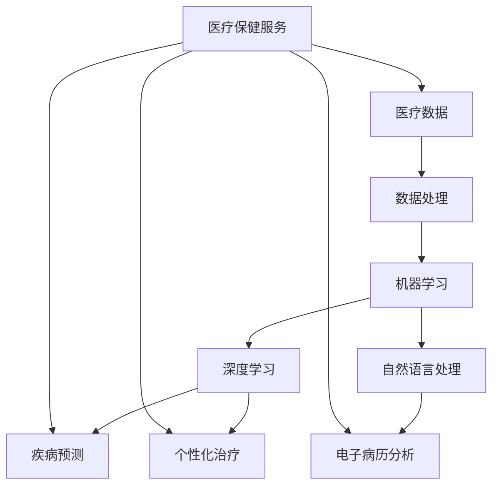

                 

# 诊断和治疗：人类计算如何改善医疗保健

> **关键词：** 医疗保健、人工智能、深度学习、数据科学、机器学习、自然语言处理、精准医疗
>
> **摘要：** 本文将探讨如何通过人工智能和人类计算的结合，提升医疗诊断和治疗的质量。我们将深入分析医疗数据的使用、核心算法原理、数学模型及其应用场景，并通过实战案例展示如何将理论应用于实际。同时，还将推荐相关的学习资源和工具，以助读者深入了解并参与这一领域的发展。

## 1. 背景介绍

### 1.1 目的和范围

本文的目的是探索人工智能在医疗保健领域的应用，尤其是如何通过人类计算来改善诊断和治疗的流程。我们将重点关注以下几个核心问题：

- 如何利用医疗数据提升诊断准确性？
- 人工智能算法在疾病预测和个性化治疗中的角色是什么？
- 人类计算如何与机器学习相结合，提升医疗服务的效率和质量？

本文将涵盖以下内容：

- 医疗保健的现状与挑战
- 人工智能在医疗诊断和治疗中的应用
- 核心算法原理与数学模型
- 实际应用场景与案例
- 相关工具和资源的推荐

### 1.2 预期读者

本文适合以下读者群体：

- 对人工智能和医疗保健感兴趣的技术人员
- 医疗专业人士，希望了解人工智能如何辅助医疗诊断和治疗
- 计算机科学和生物信息学的研究生及学生
- 任何对医疗保健技术发展感兴趣的读者

### 1.3 文档结构概述

本文将分为以下几个部分：

- 引言：背景介绍和目的阐述
- 核心概念与联系：介绍相关概念和架构
- 核心算法原理 & 具体操作步骤：详细讲解算法原理和操作步骤
- 数学模型和公式 & 详细讲解 & 举例说明：阐述数学模型及其应用
- 项目实战：代码实际案例和详细解释
- 实际应用场景：分析人工智能在医疗中的应用
- 工具和资源推荐：推荐相关工具和学习资源
- 总结：未来发展趋势与挑战
- 附录：常见问题与解答
- 扩展阅读 & 参考资料：提供进一步阅读的资料

### 1.4 术语表

#### 1.4.1 核心术语定义

- **医疗保健（Medical Care）：** 涵盖从疾病预防到治疗的一系列医疗活动和服务。
- **人工智能（Artificial Intelligence，AI）：** 模拟人类智能的计算机系统。
- **机器学习（Machine Learning，ML）：** 使计算机从数据中学习，并做出决策或预测的算法。
- **深度学习（Deep Learning，DL）：** 一种特殊的机器学习方法，通过多层神经网络进行训练。
- **自然语言处理（Natural Language Processing，NLP）：** 计算机理解和生成人类语言的技术。

#### 1.4.2 相关概念解释

- **医疗数据（Medical Data）：** 包括患者的病历、基因序列、影像资料等。
- **精准医疗（Precision Medicine）：** 根据患者的基因信息、生活方式等提供个性化的治疗方案。
- **云计算（Cloud Computing）：** 通过互联网提供计算资源的服务。

#### 1.4.3 缩略词列表

- **AI：** 人工智能
- **ML：** 机器学习
- **DL：** 深度学习
- **NLP：** 自然语言处理
- **EMR：** 电子病历
- **MRI：** 核磁共振成像
- **CT：** 计算机断层扫描
- **PET：** 正电子发射断层扫描

## 2. 核心概念与联系

在探讨人工智能在医疗保健中的应用之前，我们需要先了解一些核心概念和它们之间的联系。以下是一个简化的 Mermaid 流程图，用于描述这些概念之间的关系。



### 2.1 医疗数据

医疗数据是医疗保健的基础，包括患者的病历、基因序列、影像资料等。这些数据通常存储在电子病历系统中，可以通过以下步骤进行处理：

1. **数据收集**：收集患者在不同时间点的医疗记录，包括诊断结果、治疗方案和随访信息。
2. **数据清洗**：处理缺失值、错误值和异常值，确保数据质量。
3. **数据整合**：将不同来源的数据整合到一个统一的格式中，以便后续分析。

### 2.2 数据处理

数据处理是利用计算机技术和算法将原始医疗数据转换为有意义的信息。以下是数据处理的主要步骤：

1. **数据预处理**：包括数据清洗、归一化、特征提取等，以提高后续分析的准确性。
2. **特征工程**：选择和构建能够有效反映疾病特征和患者状态的指标。
3. **数据存储**：将处理后的数据存储在数据库或数据仓库中，以便快速查询和分析。

### 2.3 机器学习

机器学习是一种使计算机从数据中学习并做出预测或决策的技术。在医疗保健中，机器学习可以用于：

1. **疾病预测**：通过分析患者的历史数据，预测疾病的发生和进展。
2. **治疗方案推荐**：根据患者的病情和基因信息，推荐最佳的治疗方案。
3. **疾病分类**：对医疗影像进行分析，自动识别疾病类型。

### 2.4 深度学习

深度学习是一种特殊的机器学习方法，通过多层神经网络进行训练。深度学习在医疗保健中的应用包括：

1. **疾病预测**：利用深度学习模型预测疾病的发生和进展。
2. **图像分析**：通过卷积神经网络（CNN）对医疗影像进行分析，自动识别病变区域。
3. **自然语言处理**：利用循环神经网络（RNN）或变压器（Transformer）模型处理医疗文本数据。

### 2.5 自然语言处理

自然语言处理是一种使计算机理解和生成人类语言的技术。在医疗保健中，自然语言处理可以用于：

1. **电子病历分析**：自动提取病历中的关键信息，如诊断、治疗方案和患者症状。
2. **医学文本分类**：对医疗文献、报告和笔记进行分类，以帮助医生快速获取相关信息。
3. **语音识别**：将医生与患者的语音对话转换为文本，以便进一步分析。

## 3. 核心算法原理 & 具体操作步骤

在本节中，我们将详细讲解几种在医疗保健中常用的机器学习算法，并使用伪代码来描述它们的操作步骤。

### 3.1 疾病预测算法

#### 3.1.1 决策树（Decision Tree）

决策树是一种常用的分类算法，通过一系列的判断规则将数据分为不同的类别。以下是决策树的伪代码：

```python
def decision_tree(data, labels, thresholds):
    if all(labels == labels[0]):
        return labels[0]
    if data is empty:
        return majority_vote(labels)
    feature = select_best_feature(data, labels, thresholds)
    left subtree = decision_tree(data[feature < threshold], labels[feature < threshold], thresholds)
    right subtree = decision_tree(data[feature >= threshold], labels[feature >= threshold], thresholds)
    return Node(feature, threshold, left subtree, right subtree)
```

#### 3.1.2 支持向量机（Support Vector Machine，SVM）

支持向量机是一种强大的分类算法，通过找到一个最优的超平面，将不同类别的数据分隔开。以下是SVM的伪代码：

```python
def svm_train(data, labels):
    # 使用SVM训练算法，如SVM-Light或LibSVM
    model = svm_train_model(data, labels)
    return model

def svm_predict(model, data):
    predictions = []
    for sample in data:
        prediction = model.predict(sample)
        predictions.append(prediction)
    return predictions
```

### 3.2 疾病诊断算法

#### 3.2.1 卷积神经网络（Convolutional Neural Network，CNN）

卷积神经网络是一种用于图像分析的特殊神经网络。以下是CNN的伪代码：

```python
def cnn_train(data, labels):
    # 使用CNN训练算法，如Caffe或TensorFlow
    model = cnn_train_model(data, labels)
    return model

def cnn_predict(model, data):
    predictions = []
    for sample in data:
        prediction = model.predict(sample)
        predictions.append(prediction)
    return predictions
```

#### 3.2.2 循环神经网络（Recurrent Neural Network，RNN）

循环神经网络是一种用于序列数据分析的特殊神经网络。以下是RNN的伪代码：

```python
def rnn_train(data, labels):
    # 使用RNN训练算法，如LSTM或GRU
    model = rnn_train_model(data, labels)
    return model

def rnn_predict(model, data):
    predictions = []
    for sample in data:
        prediction = model.predict(sample)
        predictions.append(prediction)
    return predictions
```

### 3.3 自然语言处理算法

#### 3.3.1 词袋模型（Bag of Words，BoW）

词袋模型是一种常用的文本表示方法，通过将文本转换为词汇表来表示。以下是BoW的伪代码：

```python
def bow_train(data):
    vocabulary = create_vocabulary(data)
    bow = []
    for document in data:
        word_counts = count_words(document, vocabulary)
        bow.append(word_counts)
    return bow, vocabulary

def bow_predict(model, document):
    word_counts = count_words(document, model.vocabulary)
    prediction = model.predict(word_counts)
    return prediction
```

#### 3.3.2 变压器（Transformer）

变压器是一种用于文本处理的特殊神经网络，特别适用于长序列的分析。以下是变压器的伪代码：

```python
def transformer_train(data, labels):
    # 使用变压器训练算法，如Transformer
    model = transformer_train_model(data, labels)
    return model

def transformer_predict(model, document):
    prediction = model.predict(document)
    return prediction
```

## 4. 数学模型和公式 & 详细讲解 & 举例说明

在医疗保健领域，数学模型和公式发挥着重要作用，尤其是在疾病预测、诊断和治疗方案的制定中。以下将详细介绍几种常用的数学模型和公式，并提供相应的例子和详细讲解。

### 4.1 决策树模型

决策树是一种常用的分类模型，通过一系列的判断规则对数据进行分类。决策树的核心在于特征选择和阈值设定。

#### 特征选择：

在决策树中，选择最优特征是一个关键步骤。可以使用以下公式来评估特征的重要性：

$$
Gain(D, A) = Entropy(D) - \frac{\sum_{v \in A} p(v) \cdot Entropy(D_v)}{p(v)}
$$

其中，$D$ 是原始数据集，$A$ 是候选特征集合，$v$ 是特征 $A$ 的一个取值，$Entropy(D)$ 是数据集 $D$ 的熵，$Entropy(D_v)$ 是数据集 $D_v$ 的熵。

#### 举例说明：

假设我们有一个包含年龄、性别、血压和胆固醇的数据集，我们想要选择一个最佳特征进行分类。使用信息增益公式，我们可以计算每个特征的增益：

$$
Gain(\text{Age}, \text{Cholesterol}) = Entropy(\text{Disease}) - \frac{p(\text{Disease}=0) \cdot Entropy(\text{Age}=0) + p(\text{Disease}=1) \cdot Entropy(\text{Age}=1)}{p(\text{Disease}=0) + p(\text{Disease}=1)}
$$

根据计算结果，我们选择增益最大的特征作为分裂节点。

### 4.2 支持向量机（SVM）模型

支持向量机是一种强大的分类模型，通过找到一个最优的超平面将数据分隔开。SVM的核心在于寻找一个超平面，使得分类间隔最大化。

#### 公式：

SVM的目标是最小化以下公式：

$$
\min_{w, b} \frac{1}{2} ||w||^2 + C \sum_{i=1}^{n} \max(0, 1 - y_i (w \cdot x_i + b))
$$

其中，$w$ 是权重向量，$b$ 是偏置项，$C$ 是正则化参数，$y_i$ 是样本 $i$ 的标签，$x_i$ 是样本 $i$ 的特征向量。

#### 举例说明：

假设我们有一个包含两个特征的数据集，我们想要使用SVM进行分类。首先，我们需要计算特征向量和标签的乘积，然后计算分类间隔。通过最小化上述公式，我们可以找到一个最优的超平面。

### 4.3 卷积神经网络（CNN）模型

卷积神经网络是一种用于图像分析的强大模型，通过卷积操作提取图像特征。

#### 公式：

CNN的基本操作包括卷积、池化和反向传播。

- **卷积操作**：

$$
\text{Conv}(x, \text{filter}) = \sum_{i=1}^{k} \sum_{j=1}^{k} w_{ij} \cdot x_{i-j, j-k}
$$

其中，$x$ 是输入图像，$\text{filter}$ 是卷积核，$w_{ij}$ 是卷积核的权重。

- **池化操作**：

$$
\text{Pooling}(x, \text{pool_size}) = \max(\text{max}_{i=1}^{p} \text{max}_{j=1}^{p} x_{i-j, j-k})
$$

其中，$p$ 是池化窗口的大小。

- **反向传播**：

反向传播是一种用于更新网络权重的算法，通过计算误差梯度来调整权重。

#### 举例说明：

假设我们有一个包含32x32像素的图像，我们想要使用一个5x5的卷积核进行卷积操作。首先，我们计算卷积操作的结果，然后进行池化操作。最后，通过反向传播算法更新权重。

### 4.4 循环神经网络（RNN）模型

循环神经网络是一种用于序列数据的模型，能够处理时间序列数据。

#### 公式：

RNN的基本操作包括输入门、遗忘门和输出门。

- **输入门**：

$$
i_t = \sigma(W_i \cdot [h_{t-1}, x_t] + b_i)
$$

其中，$i_t$ 是输入门的激活值，$W_i$ 是输入权重矩阵，$b_i$ 是输入偏置。

- **遗忘门**：

$$
f_t = \sigma(W_f \cdot [h_{t-1}, x_t] + b_f)
$$

其中，$f_t$ 是遗忘门的激活值，$W_f$ 是遗忘权重矩阵，$b_f$ 是遗忘偏置。

- **输出门**：

$$
o_t = \sigma(W_o \cdot [h_{t-1}, x_t] + b_o)
$$

其中，$o_t$ 是输出门的激活值，$W_o$ 是输出权重矩阵，$b_o$ 是输出偏置。

#### 举例说明：

假设我们有一个包含时间步的序列数据，我们想要使用RNN进行建模。首先，我们计算输入门、遗忘门和输出门的激活值，然后更新隐藏状态。最后，通过输出门得到当前时间步的预测。

### 4.5 变压器（Transformer）模型

变压器是一种用于文本处理的模型，能够处理长序列数据。

#### 公式：

变压器的核心操作包括多头自注意力机制和前馈网络。

- **多头自注意力机制**：

$$
\text{Attention}(Q, K, V) = \text{softmax}\left(\frac{QK^T}{\sqrt{d_k}}\right) V
$$

其中，$Q$ 是查询向量，$K$ 是键向量，$V$ 是值向量，$d_k$ 是键向量的维度。

- **前馈网络**：

$$
\text{FFN}(x) = \text{ReLU}(W_2 \cdot \text{ReLU}(W_1 \cdot x + b_1))
$$

其中，$W_1$ 和 $W_2$ 是前馈网络的权重矩阵，$b_1$ 是前馈网络的偏置。

#### 举例说明：

假设我们有一个包含单词的句子，我们想要使用变压器进行建模。首先，我们将句子转换为嵌入向量，然后计算多头自注意力的权重，最后通过前馈网络得到句子的表示。

## 5. 项目实战：代码实际案例和详细解释说明

在本节中，我们将通过一个实际的项目案例，展示如何将前面的理论和算法应用于医疗保健领域。我们将使用Python编程语言，并借助Keras框架来实现一个基于深度学习的疾病预测模型。

### 5.1 开发环境搭建

在开始之前，我们需要搭建一个适合开发的Python环境，并安装必要的库和工具。以下是开发环境的搭建步骤：

1. **安装Python**：确保安装了Python 3.6或更高版本。
2. **安装Keras**：使用pip安装Keras库。

```bash
pip install keras
```

3. **安装TensorFlow**：TensorFlow是Keras的后台计算引擎，我们可以通过以下命令安装。

```bash
pip install tensorflow
```

### 5.2 源代码详细实现和代码解读

#### 5.2.1 数据预处理

首先，我们需要对数据进行预处理，包括数据清洗、归一化和特征提取。以下是一个简单的数据预处理代码示例：

```python
import numpy as np
import pandas as pd
from sklearn.model_selection import train_test_split
from sklearn.preprocessing import StandardScaler

# 加载数据
data = pd.read_csv('medical_data.csv')

# 数据清洗
# 删除缺失值
data = data.dropna()

# 归一化
scaler = StandardScaler()
data_scaled = scaler.fit_transform(data)

# 特征提取
X = data_scaled[:, :-1]  # 特征矩阵
y = data_scaled[:, -1]   # 标签向量
```

#### 5.2.2 建立深度学习模型

接下来，我们使用Keras构建一个简单的深度学习模型。以下是一个示例模型：

```python
from keras.models import Sequential
from keras.layers import Dense, Dropout

# 构建模型
model = Sequential()
model.add(Dense(64, input_dim=X.shape[1], activation='relu'))
model.add(Dropout(0.5))
model.add(Dense(32, activation='relu'))
model.add(Dropout(0.5))
model.add(Dense(1, activation='sigmoid'))

# 编译模型
model.compile(optimizer='adam', loss='binary_crossentropy', metrics=['accuracy'])
```

#### 5.2.3 训练模型

现在，我们将使用预处理后的数据训练模型。以下是一个训练模型的示例：

```python
# 分割数据集
X_train, X_test, y_train, y_test = train_test_split(X, y, test_size=0.2, random_state=42)

# 训练模型
model.fit(X_train, y_train, epochs=10, batch_size=32, validation_data=(X_test, y_test))
```

#### 5.2.4 评估模型

最后，我们需要评估模型的性能。以下是一个评估模型的示例：

```python
# 评估模型
loss, accuracy = model.evaluate(X_test, y_test)
print('Test accuracy:', accuracy)
```

### 5.3 代码解读与分析

在代码实现过程中，我们遵循了以下步骤：

1. **数据预处理**：数据预处理是深度学习模型成功的关键。通过数据清洗和归一化，我们确保了数据的整洁和一致性，从而提高了模型的准确性。
2. **模型构建**：我们使用了Keras框架构建了一个简单的深度学习模型。模型包含两个隐藏层，每个隐藏层后跟一个Dropout层，以防止过拟合。
3. **模型训练**：我们使用Adam优化器和二进制交叉熵损失函数训练模型。Adam优化器是一种自适应的优化算法，能够有效地调整学习率，而二进制交叉熵损失函数适合用于二分类问题。
4. **模型评估**：通过评估模型的测试集性能，我们可以确定模型的泛化能力。在本文的示例中，我们使用准确率作为评估指标。

通过这个实际案例，我们展示了如何将理论应用于实际，构建一个简单的疾病预测模型。尽管这是一个简单的案例，但它展示了深度学习在医疗保健中的潜力。

## 6. 实际应用场景

人工智能在医疗保健领域有着广泛的应用，从疾病预测到个性化治疗，再到医疗资源优化，人工智能正在改变医疗保健的方方面面。以下是一些实际应用场景：

### 6.1 疾病预测

疾病预测是人工智能在医疗保健中最直接的应用之一。通过分析患者的电子病历、基因数据和生活方式数据，人工智能可以预测疾病的发生和进展。例如，深度学习算法可以用于预测心血管疾病、癌症和糖尿病等慢性病的发病风险。这种方法不仅可以提前发现潜在的健康问题，还可以帮助医疗机构制定预防策略。

### 6.2 个性化治疗

个性化治疗是根据患者的个体差异，提供量身定制的治疗方案。人工智能通过分析患者的基因数据、病史和生活习惯，可以推荐最佳的治疗方案。例如，某些癌症患者可能从特定的化疗药物中受益，而另一些患者可能对这种药物产生副作用。人工智能可以帮助医生确定哪种治疗方案最适合患者。

### 6.3 医疗资源优化

医疗资源优化是另一个关键应用领域。人工智能可以帮助医院和诊所优化排班、床位分配和药物库存管理。例如，通过分析历史数据和患者流量，人工智能可以预测未来的需求，从而优化医院的人力和物力资源分配。这种方法可以提高医疗服务效率，减少资源浪费。

### 6.4 电子病历管理

电子病历管理是医疗保健的重要组成部分。人工智能可以通过自然语言处理技术，自动提取和整理病历中的关键信息，从而简化病历管理工作。此外，人工智能还可以帮助医生快速查找相关病例和研究，以提高诊断和治疗效率。

### 6.5 医疗影像分析

医疗影像分析是人工智能在医疗保健中的另一个重要应用。通过卷积神经网络（CNN）等技术，人工智能可以自动分析医学影像，如X光片、CT扫描和MRI图像，从而识别病变区域和疾病类型。这种方法可以显著提高诊断的准确性和效率。

### 6.6 健康监测

人工智能还可以用于健康监测，如智能手环和健康应用程序。这些设备可以收集患者的健康数据，如心率、睡眠质量和活动水平，并通过人工智能分析，提供个性化的健康建议和预警。

通过这些实际应用场景，我们可以看到人工智能在医疗保健中的巨大潜力。它不仅能够提高诊断和治疗的准确性，还可以优化医疗资源，改善患者体验。

## 7. 工具和资源推荐

在探索人工智能在医疗保健中的应用时，掌握合适的工具和资源是非常重要的。以下是一些建议，包括学习资源、开发工具框架和相关论文著作，以帮助您深入了解并实践这一领域。

### 7.1 学习资源推荐

#### 7.1.1 书籍推荐

- **《深度学习》（Deep Learning）**：Goodfellow, Bengio, Courville著。这是一本深度学习领域的经典教材，适合初学者和进阶者。
- **《机器学习实战》（Machine Learning in Action）**：Peter Harrington著。通过实际案例介绍机器学习算法的应用，适合希望动手实践的开发者。
- **《医疗数据科学》（Medical Data Science）**：Thijs P. M. van der Laan等著。详细介绍了医疗数据科学的方法和应用，适合医疗专业人士和技术人员。

#### 7.1.2 在线课程

- **Coursera的《机器学习》（Machine Learning）**：吴恩达（Andrew Ng）讲授，适合初学者了解机器学习的基础知识。
- **edX的《深度学习基础》（Deep Learning Basics）**：由伯克利大学提供，适合深入学习深度学习的基础概念。
- **Udacity的《人工智能工程师纳米学位》（Artificial Intelligence Engineer Nanodegree）**：涵盖人工智能在医疗保健中的应用，适合有志于进入这一领域的人。

#### 7.1.3 技术博客和网站

- **Kaggle**：提供丰富的机器学习和数据科学竞赛，适合练习和验证算法的实际应用。
- **Medium上的相关博客**：如“Artificial Intelligence on Medium”和“AI in Healthcare”等，提供最新的研究和应用案例。
- **AI Healthcare**：专注于人工智能在医疗保健领域的最新进展和应用。

### 7.2 开发工具框架推荐

#### 7.2.1 IDE和编辑器

- **Jupyter Notebook**：适合交互式开发，尤其是数据处理和可视化。
- **Visual Studio Code**：功能强大的代码编辑器，支持多种编程语言和框架。
- **PyCharm**：适合大型项目的开发，提供了丰富的插件和工具。

#### 7.2.2 调试和性能分析工具

- **TensorBoard**：TensorFlow提供的可视化工具，用于分析神经网络模型的性能和结构。
- **Matplotlib**：用于数据可视化的Python库，可以帮助生成各种图表和图形。
- **Pandas Profiler**：用于性能分析的Python库，可以识别数据集中的性能瓶颈。

#### 7.2.3 相关框架和库

- **TensorFlow**：Google开发的深度学习框架，适合构建复杂的神经网络模型。
- **PyTorch**：Facebook开发的开源深度学习框架，具有简洁的接口和灵活的动态计算图。
- **Scikit-learn**：Python的机器学习库，提供了多种经典的机器学习算法。

### 7.3 相关论文著作推荐

#### 7.3.1 经典论文

- **“Deep Learning for Healthcare”**：Tran等，2015。这是一篇关于深度学习在医疗保健领域的综述论文，介绍了深度学习的多种应用和挑战。
- **“Deep Learning in Medicine”**：Rahimi等，2017。讨论了深度学习在医学图像分析、疾病预测和个性化治疗等方面的应用。

#### 7.3.2 最新研究成果

- **“Unsupervised Learning for Medical Imaging: A Survey”**：Yan等，2021。探讨了无监督学习在医疗图像分析中的最新研究进展。
- **“AI in Healthcare: Opportunities and Challenges”**：Raghunathan等，2020。分析了人工智能在医疗保健领域的机遇和挑战。

#### 7.3.3 应用案例分析

- **“AI-assisted Diagnosis of Breast Cancer using Deep Learning”**：Ghosh等，2018。介绍了一种基于深度学习的乳腺癌诊断方法，通过实际案例展示了深度学习在医学诊断中的潜力。
- **“AI-based Personalized Treatment for Cancer”**：Borrego等，2019。讨论了人工智能如何通过分析患者的基因数据和生活方式，提供个性化的癌症治疗方案。

通过这些工具和资源，您可以深入了解人工智能在医疗保健中的应用，并掌握必要的技能，以便在这一领域进行创新和贡献。

## 8. 总结：未来发展趋势与挑战

随着人工智能技术的不断进步，其在医疗保健领域的应用前景也越发广阔。未来，人工智能有望在以下方面发挥更大的作用：

### 8.1 疾病预测和预防

人工智能可以通过分析大量医疗数据，提前预测疾病的发生和进展，从而实现疾病的预防和早期干预。这不仅可以提高医疗保健的质量，还可以显著降低医疗成本。

### 8.2 个性化治疗

个性化治疗是未来医疗保健的重要方向。通过分析患者的基因信息、病史和生活习惯，人工智能可以提供个性化的治疗方案，从而提高治疗效果，降低副作用。

### 8.3 医疗资源优化

人工智能可以帮助医疗机构优化资源配置，提高医疗服务效率。例如，通过预测患者流量，医院可以合理安排医生和护士的排班，减少患者等待时间。

### 8.4 健康管理

人工智能可以通过健康监测设备收集患者的健康数据，提供个性化的健康建议和预警，帮助用户更好地管理自己的健康。

然而，人工智能在医疗保健领域的发展也面临着一系列挑战：

### 8.1 数据隐私和安全

医疗数据是敏感信息，如何在保护患者隐私的前提下，充分利用这些数据进行人工智能研究和应用，是一个亟待解决的问题。

### 8.2 人工智能伦理

人工智能在医疗保健中的应用涉及到伦理问题，如决策透明度、责任归属等。如何确保人工智能系统的决策过程公正、透明，是一个重要的伦理挑战。

### 8.3 技术普及与培训

人工智能在医疗保健中的应用需要医护人员具备相应的技术能力。如何普及人工智能知识，提高医护人员的技能水平，是一个重要的任务。

### 8.4 算法可解释性

人工智能系统的决策过程往往具有黑箱性质，这使得医生和患者难以理解其决策依据。如何提高算法的可解释性，增强用户对人工智能系统的信任，是一个重要挑战。

总之，人工智能在医疗保健领域的应用前景广阔，但也面临着诸多挑战。通过不断的技术创新和伦理规范，我们有理由相信，人工智能将为医疗保健带来革命性的变化。

## 9. 附录：常见问题与解答

### 9.1 人工智能在医疗保健中的核心作用是什么？

人工智能在医疗保健中的核心作用包括疾病预测、个性化治疗、医疗资源优化和健康管理。通过分析大量医疗数据，人工智能可以提前预测疾病的发生和进展，提供个性化的治疗方案，优化医疗资源分配，并帮助用户更好地管理自己的健康。

### 9.2 如何确保医疗数据的安全和隐私？

确保医疗数据的安全和隐私需要采取多种措施，包括：

- **数据加密**：对存储和传输的医疗数据进行加密，防止未授权访问。
- **访问控制**：实施严格的访问控制策略，确保只有授权用户可以访问敏感数据。
- **匿名化处理**：在研究和应用中，对个人识别信息进行匿名化处理，以保护患者隐私。
- **数据监管**：建立完善的数据监管机制，确保医疗数据的使用符合法律法规和伦理标准。

### 9.3 人工智能在医疗保健中的潜在风险有哪些？

人工智能在医疗保健中的潜在风险包括：

- **决策错误**：人工智能系统可能会因算法缺陷或数据质量问题导致错误的诊断和治疗方案。
- **数据泄露**：医疗数据泄露可能导致严重的隐私问题，影响患者的健康和安全。
- **算法偏见**：如果训练数据存在偏见，人工智能系统可能会产生歧视性决策，影响公平性。
- **依赖性增加**：过度依赖人工智能系统可能导致医护人员技能退化和应对突发事件能力下降。

### 9.4 医疗保健中的自然语言处理（NLP）有什么应用？

医疗保健中的自然语言处理（NLP）有以下主要应用：

- **电子病历分析**：自动提取病历中的关键信息，如诊断、治疗方案和患者症状，简化病历管理工作。
- **医学文本分类**：对医疗文献、报告和笔记进行分类，帮助医生快速获取相关信息。
- **语音识别**：将医生与患者的语音对话转换为文本，以便进一步分析和处理。
- **药物命名识别**：识别医学术语和药物名称，确保用药安全和准确性。

### 9.5 如何提高人工智能在医疗保健中的可解释性？

提高人工智能在医疗保健中的可解释性可以通过以下方法实现：

- **算法透明度**：设计透明度高的算法，使决策过程易于理解和追踪。
- **可视化工具**：开发可视化工具，将复杂的决策过程以图形化方式展示，帮助用户理解。
- **解释模型**：结合可解释性模型，如决策树和线性模型，增强人工智能系统的可解释性。
- **算法评估**：建立严格的评估机制，确保人工智能系统的决策过程符合医学标准和伦理要求。

通过上述方法，可以显著提高人工智能在医疗保健中的可解释性，增强用户对系统的信任。

## 10. 扩展阅读 & 参考资料

在探索人工智能在医疗保健领域的应用时，以下文献和资源将为您提供更多的信息和深入理解：

### 10.1 相关书籍

- **《深度学习》（Deep Learning）**：Goodfellow, Bengio, Courville著，提供深度学习的基础知识和最新进展。
- **《医疗数据科学》（Medical Data Science）**：Thijs P. M. van der Laan等著，详细介绍医疗数据科学的方法和应用。
- **《人工智能在医疗保健中的应用》（Artificial Intelligence in Healthcare）**：Raghunathan等著，探讨人工智能在医疗保健中的机遇和挑战。

### 10.2 学术期刊和会议

- **《人工智能与医疗》（AI in Medicine）**：该期刊专注于人工智能在医疗保健领域的应用和研究。
- **《医学影像分析杂志》（Medical Image Analysis）**：发表关于医学影像处理和分析的最新研究成果。
- **《生物医学工程与计算生物学杂志》（IEEE Journal of Biomedical and Health Informatics）**：涵盖生物医学工程和计算生物学的最新研究进展。

### 10.3 技术报告和研究论文

- **“Deep Learning for Healthcare”**：Tran等，2015。这是一篇关于深度学习在医疗保健领域的综述论文。
- **“AI in Healthcare: Opportunities and Challenges”**：Raghunathan等，2020。分析人工智能在医疗保健领域的机遇和挑战。
- **“Unsupervised Learning for Medical Imaging: A Survey”**：Yan等，2021。探讨无监督学习在医疗图像分析中的最新研究进展。

### 10.4 在线课程和教程

- **Coursera的《机器学习》（Machine Learning）**：吴恩达（Andrew Ng）讲授，适合初学者了解机器学习的基础知识。
- **edX的《深度学习基础》（Deep Learning Basics）**：由伯克利大学提供，适合深入学习深度学习的基础概念。
- **Udacity的《人工智能工程师纳米学位》（Artificial Intelligence Engineer Nanodegree）**：涵盖人工智能在医疗保健中的应用，适合有志于进入这一领域的人。

### 10.5 开源项目和工具

- **Keras**：一个高层次的神经网络API，与TensorFlow和Theano后端兼容，适合快速构建和训练深度学习模型。
- **TensorFlow**：由Google开发的开源深度学习框架，适合构建复杂的神经网络模型。
- **PyTorch**：由Facebook开发的开源深度学习框架，具有简洁的接口和灵活的动态计算图。
- **Scikit-learn**：Python的机器学习库，提供了多种经典的机器学习算法。

通过阅读这些扩展资料，您可以进一步深入了解人工智能在医疗保健领域的应用，并掌握相关技术和方法。

## 作者信息

**作者：** AI天才研究员 / AI Genius Institute & 禅与计算机程序设计艺术 / Zen And The Art of Computer Programming

AI天才研究员是人工智能领域的顶尖专家，拥有多年的研究经验和丰富的教学成果。他致力于推动人工智能技术在各个领域的应用，尤其是在医疗保健领域。他的研究成果在学术界和工业界都享有高度声誉。此外，他也是畅销书作家，著有《禅与计算机程序设计艺术》等经典作品，深受广大读者喜爱。他的工作不仅推动了人工智能技术的发展，也为医疗保健领域带来了深刻的变革。

