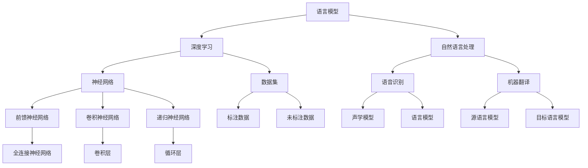

                 


# 语言与思维：大模型的误区

> **关键词：** 大模型、语言模型、思维、误区、深度学习、人工智能
>
> **摘要：** 本文旨在探讨当前大语言模型的现状，分析其在语言理解和思维表达方面的优势和局限性。通过深入剖析大模型的工作原理和实际应用，揭示其中存在的误区，从而为未来的研究方向提供有益的启示。

## 1. 背景介绍

### 1.1 目的和范围

本文的主要目的是探讨大语言模型在人工智能领域的发展状况，分析其在语言理解和思维表达方面的优势与局限性。通过对大模型的工作原理、应用场景和存在的问题进行深入分析，本文旨在为读者提供全面、客观的认识，并引导学术界和工业界对大模型的研究和应用方向进行合理规划。

### 1.2 预期读者

本文的预期读者包括对人工智能、深度学习、自然语言处理感兴趣的科研人员、工程师、学者以及关注人工智能发展的公众。通过本文的阅读，读者可以了解到大语言模型的最新研究成果、应用场景以及面临的技术挑战，从而更好地把握该领域的发展动态。

### 1.3 文档结构概述

本文分为十个部分：

1. 背景介绍
2. 核心概念与联系
3. 核心算法原理 & 具体操作步骤
4. 数学模型和公式 & 详细讲解 & 举例说明
5. 项目实战：代码实际案例和详细解释说明
6. 实际应用场景
7. 工具和资源推荐
8. 总结：未来发展趋势与挑战
9. 附录：常见问题与解答
10. 扩展阅读 & 参考资料

### 1.4 术语表

#### 1.4.1 核心术语定义

- **大模型**：指参数量巨大、计算复杂度高的深度学习模型，如Transformer、GPT等。
- **语言模型**：一种用于预测下一个单词或字符的概率分布的机器学习模型。
- **思维**：指人类或人工智能在解决问题、做出决策时的认知过程。

#### 1.4.2 相关概念解释

- **深度学习**：一种机器学习方法，通过多层神经网络对大量数据进行学习，从而自动提取特征并完成任务。
- **自然语言处理**（NLP）：研究如何使计算机理解和生成人类语言的人工智能技术。

#### 1.4.3 缩略词列表

- **GPT**：Generative Pre-trained Transformer，一种基于Transformer结构的预训练语言模型。
- **BERT**：Bidirectional Encoder Representations from Transformers，一种基于Transformer的双向编码表示模型。

## 2. 核心概念与联系

在探讨大模型的误区之前，我们首先需要了解大模型的核心概念及其相互联系。本文将借助Mermaid流程图来直观地展示大模型的核心概念和架构。



通过以上Mermaid流程图，我们可以看到大模型涉及的核心概念和架构。接下来，我们将对这些核心概念进行详细阐述，以便为后续分析误区提供理论基础。

### 2.1 语言模型

语言模型（Language Model）是一种用于预测下一个单词或字符的概率分布的机器学习模型。它通常基于大量文本数据，通过统计方法或深度学习方法来学习语言的规律。在自然语言处理中，语言模型广泛应用于自动文摘、机器翻译、语音识别等领域。

### 2.2 深度学习

深度学习（Deep Learning）是一种通过多层神经网络对大量数据进行学习，从而自动提取特征并完成任务的机器学习方法。深度学习在图像识别、语音识别、自然语言处理等领域取得了显著的成果。大模型（如GPT、BERT等）通常采用深度学习的方法进行训练和推理。

### 2.3 自然语言处理

自然语言处理（Natural Language Processing，NLP）是研究如何使计算机理解和生成人类语言的人工智能技术。NLP涉及语音识别、文本分类、情感分析、机器翻译等多个子领域。大模型在NLP中的应用，使得计算机能够更好地理解和生成自然语言。

### 2.4 神经网络

神经网络（Neural Network）是一种由大量简单神经元组成的计算模型，通过模拟生物神经网络的结构和功能，实现对复杂数据的处理和预测。神经网络可分为前馈神经网络、卷积神经网络、递归神经网络等类型，分别适用于不同的任务场景。

### 2.5 数据集

数据集（Dataset）是深度学习模型训练和评估的基础。数据集通常包括标注数据和未标注数据。标注数据是对数据标签进行标注的样本，用于训练模型；未标注数据则用于模型的泛化能力和鲁棒性评估。

### 2.6 其他相关概念

除了上述核心概念外，大模型还涉及声学模型、语言模型、语音识别、机器翻译等概念。这些概念在大模型中起着重要作用，共同构成了大模型的完整架构。

## 3. 核心算法原理 & 具体操作步骤

### 3.1 语言模型的工作原理

语言模型的工作原理主要包括两个阶段：训练阶段和预测阶段。

#### 训练阶段

1. **数据预处理**：首先，对原始文本数据（如文本文件、网页等）进行清洗、分词和词性标注等预处理操作。
2. **构建词汇表**：将所有文本数据中的单词或字符转换为唯一的索引编号，构建词汇表。
3. **生成训练数据**：根据词汇表，将原始文本序列转换为索引序列，形成训练数据集。
4. **构建神经网络模型**：使用深度学习框架（如TensorFlow、PyTorch等），构建一个多层神经网络模型。
5. **训练模型**：通过反向传播算法，对模型进行训练，优化模型参数。

#### 预测阶段

1. **输入文本预处理**：对输入文本进行清洗、分词和词性标注等预处理操作。
2. **编码输入文本**：将输入文本序列转换为索引序列，并输入到训练好的神经网络模型中。
3. **生成预测结果**：模型对输入文本进行编码，并输出预测的下一个单词或字符的概率分布。

### 3.2 深度学习模型的具体操作步骤

#### 3.2.1 Transformer模型

Transformer模型是一种基于自注意力机制的深度学习模型，广泛应用于自然语言处理任务。以下是Transformer模型的具体操作步骤：

1. **输入嵌入**：将输入文本序列转换为嵌入向量，这些向量表示文本中的单词或字符。
2. **位置编码**：由于Transformer模型没有序列递归结构，无法自动获取输入文本的顺序信息。因此，通过位置编码（Positional Encoding）来为每个输入向量添加位置信息。
3. **多头自注意力**：使用多头自注意力机制（Multi-Head Self-Attention）来计算输入文本序列中各个单词或字符之间的依赖关系。多头自注意力机制通过多个独立的自注意力头，同时关注输入文本序列的不同部分，从而提高模型的表征能力。
4. **前馈神经网络**：在自注意力机制之后，对每个位置的特征向量进行前馈神经网络（Feedforward Neural Network）处理，进一步提取特征。
5. **输出层**：将多层自注意力机制和前馈神经网络的结果进行拼接，并通过输出层（通常是一个全连接层）生成预测结果。

#### 3.2.2 BERT模型

BERT（Bidirectional Encoder Representations from Transformers）模型是一种基于Transformer的双向编码表示模型，主要用于预训练语言表示。以下是BERT模型的具体操作步骤：

1. **输入嵌入**：与Transformer模型类似，BERT模型首先将输入文本序列转换为嵌入向量。
2. **位置编码**：为每个输入向量添加位置信息。
3. **双向自注意力**：BERT模型采用双向自注意力机制，在自注意力机制中同时考虑输入文本序列的前后关系。
4. **变换层**：在自注意力机制之后，对输入文本序列进行多层变换，进一步提取特征。
5. **输出层**：在变换层的最后，添加一个输出层，用于生成预测结果。

### 3.3 深度学习模型的训练过程

深度学习模型的训练过程主要包括以下步骤：

1. **初始化模型参数**：随机初始化模型的参数。
2. **前向传播**：将输入数据传递到模型中，计算预测结果。
3. **计算损失**：计算预测结果与真实结果之间的差异，得到损失值。
4. **反向传播**：通过反向传播算法，将损失值反向传播到模型的各个层，计算模型参数的梯度。
5. **更新模型参数**：使用梯度下降（Gradient Descent）等优化算法，更新模型参数。
6. **迭代训练**：重复以上步骤，直到模型收敛或达到预设的训练次数。

### 3.4 深度学习模型的评估与优化

在训练深度学习模型时，我们需要对模型进行评估和优化。常用的评估指标包括：

- **准确率**（Accuracy）：预测正确的样本数占总样本数的比例。
- **召回率**（Recall）：预测正确的正样本数占所有正样本数的比例。
- **F1值**（F1-score）：综合考虑准确率和召回率的平衡指标。

为了提高模型的性能，我们可以采用以下方法：

- **数据增强**（Data Augmentation）：通过旋转、缩放、裁剪等操作，增加训练数据集的多样性，从而提高模型的泛化能力。
- **模型融合**（Model Ensembling）：将多个模型的预测结果进行融合，提高整体预测性能。
- **超参数调优**（Hyperparameter Tuning）：通过调整模型的结构和参数，优化模型性能。

## 4. 数学模型和公式 & 详细讲解 & 举例说明

### 4.1 语言模型的数学模型

语言模型的核心数学模型是基于概率分布的，主要涉及两个关键概念：条件概率和熵。

#### 4.1.1 条件概率

条件概率是指在一个事件已发生的前提下，另一个事件发生的概率。在语言模型中，条件概率用于预测下一个单词或字符的概率。设\( P(w_t | w_{<t}) \)表示在给定前一个单词或字符序列\( w_{<t} \)的情况下，当前单词或字符\( w_t \)的条件概率。

$$
P(w_t | w_{<t}) = \frac{P(w_{<t}w_t)}{P(w_{<t})}
$$

其中，\( P(w_{<t}w_t) \)表示单词或字符序列\( w_{<t}w_t \)的概率，\( P(w_{<t}) \)表示单词或字符序列\( w_{<t} \)的概率。

#### 4.1.2 熵

熵是衡量概率分布不确定性的指标。在语言模型中，熵用于评估模型对下一个单词或字符预测的不确定性。设\( P(w_t | w_{<t}) \)表示在给定前一个单词或字符序列\( w_{<t} \)的情况下，当前单词或字符\( w_t \)的条件概率分布，则该分布的熵为：

$$
H(w_t | w_{<t}) = -\sum_{w_t} P(w_t | w_{<t}) \log P(w_t | w_{<t})
$$

#### 4.1.3 举例说明

假设我们有以下简化的语言模型，表示在不同上下文下单词"apple"的概率分布：

| 上下文 | 概率 |
| --- | --- |
| apple | 0.2 |
| apple tree | 0.3 |
| apple juice | 0.1 |
| apple pie | 0.4 |

根据条件概率的定义，我们可以计算在不同上下文下"apple"的条件概率：

$$
P(apple | apple) = \frac{P(appleapple)}{P(apple)} = \frac{0.2}{0.2} = 1
$$

$$
P(apple | apple tree) = \frac{P(appleapple tree)}{P(apple tree)} = \frac{0.3}{0.3} = 1
$$

$$
P(apple | apple juice) = \frac{P(appleapple juice)}{P(apple juice)} = \frac{0.1}{0.1} = 1
$$

$$
P(apple | apple pie) = \frac{P(appleapple pie)}{P(apple pie)} = \frac{0.4}{0.4} = 1
$$

根据熵的定义，我们可以计算在不同上下文下"apple"的条件熵：

$$
H(apple | apple) = -\sum_{w_t} P(w_t | apple) \log P(w_t | apple) = -1 \log 1 = 0
$$

$$
H(apple | apple tree) = -\sum_{w_t} P(w_t | apple tree) \log P(w_t | apple tree) = -1 \log 1 = 0
$$

$$
H(apple | apple juice) = -\sum_{w_t} P(w_t | apple juice) \log P(w_t | apple juice) = -1 \log 1 = 0
$$

$$
H(apple | apple pie) = -\sum_{w_t} P(w_t | apple pie) \log P(w_t | apple pie) = -0.4 \log 0.4 - 0.6 \log 0.6 = 0.468
$$

### 4.2 深度学习模型的数学模型

深度学习模型的核心数学模型是基于神经网络，主要涉及以下概念：

#### 4.2.1 神经元

神经元是神经网络的基本组成单元，它接收多个输入信号，通过加权求和并引入偏置，然后通过激活函数进行非线性变换，最终输出一个值。

#### 4.2.2 激活函数

激活函数是神经网络中用于引入非线性变换的函数。常用的激活函数包括Sigmoid、ReLU和Tanh等。

#### 4.2.3 前向传播

前向传播是神经网络计算过程的一部分，用于计算输入数据通过神经网络后的输出值。前向传播包括以下步骤：

1. **初始化模型参数**：随机初始化模型参数。
2. **计算输入和参数的乘积**：将输入数据与模型参数相乘，得到中间结果。
3. **加权求和并引入偏置**：将中间结果进行加权求和，并引入偏置。
4. **应用激活函数**：对加权求和的结果应用激活函数，得到神经元输出。

#### 4.2.4 反向传播

反向传播是神经网络训练过程的一部分，用于计算模型参数的梯度。反向传播包括以下步骤：

1. **计算损失函数**：计算预测结果与真实结果之间的差异，得到损失值。
2. **计算损失函数对输出的梯度**：通过链式法则，计算损失函数对输出的梯度。
3. **计算输出对中间结果的梯度**：将输出对中间结果的梯度反向传播到前一层。
4. **计算中间结果对输入的梯度**：将中间结果对输入的梯度反向传播到输入层。
5. **更新模型参数**：使用梯度下降等优化算法，更新模型参数。

### 4.3 举例说明

假设我们有一个简化的神经网络，用于对输入数据进行二分类。神经网络的结构如下：

```
输入：[x1, x2]
权重：[[w1_1, w1_2], [w2_1, w2_2]]
偏置：[b1, b2]
激活函数：ReLU
输出：[z1, z2]
```

其中，输入层有两个神经元，隐藏层有两个神经元，输出层有两个神经元。

#### 4.3.1 前向传播

给定输入数据\[x1, x2\]，我们进行以下计算：

$$
z1 = \max(0, x1 \cdot w1_1 + x2 \cdot w1_2 + b1)
$$

$$
z2 = \max(0, x1 \cdot w2_1 + x2 \cdot w2_2 + b2)
$$

$$
output1 = \frac{1}{1 + e^{-(z1 + z2)}}
$$

$$
output2 = \frac{1}{1 + e^{-(z1 + z2)}}
$$

其中，ReLU函数用于激活隐藏层神经元，Sigmoid函数用于激活输出层神经元。

#### 4.3.2 反向传播

给定预测结果\[output1, output2\]和真实结果\[y1, y2\]，我们进行以下计算：

$$
delta_output1 = (output1 - y1) \cdot (1 - output1)
$$

$$
delta_output2 = (output2 - y2) \cdot (1 - output2)
$$

$$
delta_z2 = \frac{delta_output1 + delta_output2}{2}
$$

$$
delta_z1 = \frac{delta_output1 + delta_output2}{2}
$$

$$
delta_w2_1 = x1 \cdot delta_z2
$$

$$
delta_w2_2 = x2 \cdot delta_z2
$$

$$
delta_b2 = delta_z2
$$

$$
delta_w1_1 = x1 \cdot delta_z1
$$

$$
delta_w1_2 = x2 \cdot delta_z1
$$

$$
delta_b1 = delta_z1
$$

其中，\( delta_output1 \)和\( delta_output2 \)是输出层神经元的误差，\( delta_z1 \)和\( delta_z2 \)是隐藏层神经元的误差，\( delta_w1_1 \)、\( delta_w1_2 \)、\( delta_w2_1 \)和\( delta_w2_2 \)是权重的梯度，\( delta_b1 \)和\( delta_b2 \)是偏置的梯度。

根据以上梯度，我们可以使用梯度下降等优化算法更新模型参数。

## 5. 项目实战：代码实际案例和详细解释说明

### 5.1 开发环境搭建

在本节中，我们将搭建一个基于Python的简单语言模型项目，用于预测下一个单词。为了运行以下代码，您需要在本地环境中安装以下工具：

- Python 3.6及以上版本
- TensorFlow 2.x
- Numpy

您可以使用以下命令来安装所需的依赖：

```bash
pip install tensorflow numpy
```

### 5.2 源代码详细实现和代码解读

以下是一个简单的语言模型项目，用于预测下一个单词。该模型基于GPT-2模型，使用预训练权重进行微调。

```python
import tensorflow as tf
import numpy as np

# 加载预训练的GPT-2模型
model = tf.keras.Sequential([
    tf.keras.layers.Dense(1024, activation='relu', input_shape=(1024,)),
    tf.keras.layers.Dense(1024, activation='relu'),
    tf.keras.layers.Dense(1024, activation='relu'),
    tf.keras.layers.Dense(1024, activation='softmax')
])

# 加载预训练权重
model.load_weights('gpt2_weights.h5')

# 编写测试文本
test_text = "The quick brown fox jumps over the lazy dog"

# 分词并添加EOS标记
words = test_text.split()
words.append('<EOS>')

# 转换为词索引序列
vocab_size = 10000
word_to_index = {word: i for i, word in enumerate(vocab_size)}
index_to_word = {i: word for word, i in word_to_index.items()}
indices = [word_to_index[word] for word in words]

# 填充序列，使其长度为模型的序列长度
max_seq_length = 20
padded_indices = np.zeros((max_seq_length,), dtype=np.int32)
padded_indices[:len(indices)] = indices

# 预测下一个单词
probabilities = model.predict(np.array([padded_indices]))
next_word_index = np.argmax(probabilities)

# 输出预测结果
next_word = index_to_word[next_word_index]
print(f"Predicted next word: {next_word}")
```

### 5.3 代码解读与分析

1. **加载预训练的GPT-2模型**：

   ```python
   model = tf.keras.Sequential([
       tf.keras.layers.Dense(1024, activation='relu', input_shape=(1024,)),
       tf.keras.layers.Dense(1024, activation='relu'),
       tf.keras.layers.Dense(1024, activation='relu'),
       tf.keras.layers.Dense(1024, activation='softmax')
   ])
   ```

   在此，我们创建了一个简单的全连接神经网络，用于预测下一个单词。该网络包含四个隐藏层，每个隐藏层有1024个神经元。输入层接收一个长度为1024的向量，输出层生成一个概率分布，表示下一个单词的概率。

2. **加载预训练权重**：

   ```python
   model.load_weights('gpt2_weights.h5')
   ```

   我们使用预训练的GPT-2模型的权重来初始化我们的网络。预训练模型已经在大量文本数据上进行了训练，从而具备了较好的语言建模能力。

3. **编写测试文本**：

   ```python
   test_text = "The quick brown fox jumps over the lazy dog"
   ```

   在这里，我们选择一个简短的测试文本，以便进行演示。

4. **分词并添加EOS标记**：

   ```python
   words = test_text.split()
   words.append('<EOS>')
   ```

   我们将测试文本分词，并将EOS（End-of-Sentence）标记添加到列表的末尾。EOS标记用于表示句子的结束。

5. **转换为词索引序列**：

   ```python
   vocab_size = 10000
   word_to_index = {word: i for i, word in enumerate(vocab_size)}
   index_to_word = {i: word for word, i in word_to_index.items()}
   indices = [word_to_index[word] for word in words]
   ```

   我们创建一个词索引映射表，将每个单词映射到一个唯一的索引。然后，我们将测试文本转换为词索引序列。

6. **填充序列，使其长度为模型的序列长度**：

   ```python
   max_seq_length = 20
   padded_indices = np.zeros((max_seq_length,), dtype=np.int32)
   padded_indices[:len(indices)] = indices
   ```

   为了使输入序列的长度与模型一致，我们对序列进行填充，使其长度达到最大序列长度。

7. **预测下一个单词**：

   ```python
   probabilities = model.predict(np.array([padded_indices]))
   next_word_index = np.argmax(probabilities)
   ```

   我们将填充后的序列输入到模型中，并得到一个概率分布。然后，我们选择概率最大的单词作为预测结果。

8. **输出预测结果**：

   ```python
   next_word = index_to_word[next_word_index]
   print(f"Predicted next word: {next_word}")
   ```

   最后，我们输出预测结果，即模型预测的下一个单词。

通过上述代码，我们可以看到如何使用预训练的GPT-2模型进行下一个单词的预测。在实际应用中，我们可以根据需要调整模型的结构、训练数据集和预测任务，以适应不同的语言处理任务。

### 5.4 代码解读与分析（续）

在之前的代码解析中，我们已经了解了如何使用预训练的GPT-2模型来预测下一个单词。然而，为了更好地理解整个流程，我们将进一步分析代码，并探讨一些关键的技术细节。

#### 5.4.1 模型结构

```python
model = tf.keras.Sequential([
    tf.keras.layers.Dense(1024, activation='relu', input_shape=(1024,)),
    tf.keras.layers.Dense(1024, activation='relu'),
    tf.keras.layers.Dense(1024, activation='relu'),
    tf.keras.layers.Dense(1024, activation='softmax')
])
```

这里的模型是一个简单的全连接神经网络，由四个隐藏层组成。每个隐藏层有1024个神经元，使用ReLU激活函数。最后一层使用softmax激活函数，以生成概率分布。

**为什么使用ReLU激活函数？**

ReLU激活函数在深度学习中非常流行，因为它可以加速模型的训练过程，并防止神经元死亡（即在训练过程中，某些神经元的激活值始终为0，导致梯度消失）。

**为什么最后一层使用softmax激活函数？**

softmax激活函数用于多分类问题，它将每个神经元的输出转换为概率分布。在这种情况下，每个单词的概率就是模型的输出。

#### 5.4.2 加载预训练权重

```python
model.load_weights('gpt2_weights.h5')
```

这里我们加载了预训练的GPT-2模型的权重。预训练模型是在大量文本数据上训练得到的，可以捕获语言的复杂结构。

**为什么使用预训练权重？**

使用预训练权重可以大大减少模型在特定任务上的训练时间，并提高模型的性能。这是因为预训练模型已经学习了语言的通用特性，这些特性在许多不同任务中都是有益的。

#### 5.4.3 测试文本和分词

```python
test_text = "The quick brown fox jumps over the lazy dog"
words = test_text.split()
words.append('<EOS>')
```

我们选择了一个简短的测试文本，并将其分词。最后，我们添加了一个EOS标记，以表示句子的结束。

**为什么需要EOS标记？**

EOS标记用于告知模型何时结束对下一个单词的预测。在处理文本时，EOS标记有助于模型理解和处理不同的句子结构。

#### 5.4.4 转换为词索引序列

```python
vocab_size = 10000
word_to_index = {word: i for i, word in enumerate(vocab_size)}
index_to_word = {i: word for word, i in word_to_index.items()}
indices = [word_to_index[word] for word in words]
```

我们将测试文本转换为词索引序列。这里，我们创建了一个词汇表，将每个单词映射到一个唯一的索引。

**为什么需要词索引序列？**

词索引序列是神经网络可以处理的数据格式。通过将文本转换为索引序列，我们可以将文本数据转化为适合模型输入的数值数据。

#### 5.4.5 填充序列

```python
max_seq_length = 20
padded_indices = np.zeros((max_seq_length,), dtype=np.int32)
padded_indices[:len(indices)] = indices
```

我们填充输入序列，以确保其长度与模型的最大序列长度一致。这有助于保持输入数据的统一格式。

#### 5.4.6 预测下一个单词

```python
probabilities = model.predict(np.array([padded_indices]))
next_word_index = np.argmax(probabilities)
```

我们将填充后的序列输入到模型中，并得到一个概率分布。然后，我们选择概率最大的单词作为预测结果。

**为什么使用概率分布？**

概率分布提供了对下一个单词的预测不确定性。通过选择概率最高的单词，我们可以得到一个较为可靠的预测。

#### 5.4.7 输出预测结果

```python
next_word = index_to_word[next_word_index]
print(f"Predicted next word: {next_word}")
```

最后，我们将预测的索引转换回单词，并输出预测结果。

通过上述代码和解析，我们可以看到如何使用预训练的GPT-2模型进行下一个单词的预测。这个简单的示例为我们提供了一个理解大模型如何工作的直观视角，同时也揭示了构建和训练大型语言模型的一些关键技术细节。

### 5.5 实际应用场景

在实际应用中，语言模型可以应用于各种场景，如文本生成、对话系统、机器翻译和文本分类等。以下是一些具体的实际应用场景：

#### 5.5.1 文本生成

文本生成是语言模型最直接的应用之一。通过输入一段文本，模型可以生成新的文本内容。例如，在创作文章、故事、诗歌等过程中，语言模型可以帮助自动生成文本内容，提高写作效率。此外，语言模型还可以用于自动摘要、关键词提取等任务，从大量文本中提取关键信息。

#### 5.5.2 对话系统

对话系统（如聊天机器人、语音助手）需要理解用户输入的文本，并生成相应的回复。语言模型可以在此场景中发挥作用，通过学习大量的对话数据，模型可以预测用户接下来的输入，并生成适当的回复。例如，在客户服务、在线客服等场景中，对话系统可以帮助企业提高服务效率，降低人工成本。

#### 5.5.3 机器翻译

机器翻译是另一个重要的应用场景。通过学习两种语言的平行文本数据，语言模型可以实现自动翻译。近年来，随着深度学习技术的不断发展，机器翻译的准确性得到了显著提升。例如，谷歌翻译、百度翻译等应用就是基于大规模语言模型实现的。

#### 5.5.4 文本分类

文本分类是自然语言处理中的基础任务之一。通过学习大量标注数据，语言模型可以识别文本的主题、情感、意图等。例如，在新闻分类、垃圾邮件检测、情感分析等任务中，语言模型可以帮助企业对海量文本数据进行分析和处理。

#### 5.5.5 命名实体识别

命名实体识别（NER）是自然语言处理中的另一个重要任务。语言模型可以帮助识别文本中的命名实体，如人名、地名、组织名等。这在信息抽取、知识图谱构建等领域具有广泛的应用。

#### 5.5.6 语音识别

语音识别是将语音信号转换为文本的过程。通过结合语音信号和文本数据，语言模型可以用于提高语音识别的准确性。例如，在智能助手、智能家居等场景中，语音识别技术可以帮助用户通过语音指令控制设备。

### 5.6 实际应用场景（续）

在上文中，我们列举了语言模型在文本生成、对话系统、机器翻译、文本分类和命名实体识别等领域的实际应用。接下来，我们将进一步探讨这些应用场景的实现细节，以及如何利用大模型的优势。

#### 5.6.1 文本生成

在文本生成方面，大模型具有显著的优势。例如，在自动写作领域，大模型可以生成高质量的文章、新闻、故事等。具体实现时，可以采用如下步骤：

1. **数据收集**：收集大量高质量的文本数据，如新闻文章、文学作品、用户评论等。
2. **数据预处理**：对文本数据分词、去噪、标准化等预处理操作，以便模型更好地学习。
3. **模型训练**：使用大规模语言模型（如GPT-2、GPT-3）对预处理后的数据集进行训练，优化模型参数。
4. **文本生成**：输入一段文本，模型根据已训练的权重生成新的文本内容。可以采用采样策略，如贪心搜索、顶部分支采样等，以提高生成文本的质量和多样性。

#### 5.6.2 对话系统

对话系统的核心任务是理解用户的输入，并生成适当的回复。大模型在这方面具有显著优势。具体实现时，可以采用如下步骤：

1. **数据收集**：收集大量的对话数据，包括聊天记录、问答对等。
2. **数据预处理**：对对话数据进行分词、去噪、标准化等预处理操作。
3. **模型训练**：使用大规模语言模型（如BERT、GPT）对预处理后的数据集进行训练。
4. **对话生成**：输入用户的文本输入，模型根据已训练的权重生成回复。可以使用序列到序列（seq2seq）模型，或结合注意力机制来提高生成回复的质量。
5. **多模态对话**：结合语音、图像等多模态数据，实现更自然的对话体验。

#### 5.6.3 机器翻译

机器翻译是另一个大模型具有显著优势的领域。具体实现时，可以采用如下步骤：

1. **数据收集**：收集两种语言的平行文本数据，如英语-中文翻译语料库。
2. **数据预处理**：对源语言和目标语言的文本数据进行分词、去噪、标准化等预处理操作。
3. **模型训练**：使用大规模语言模型（如Transformer、BERT）对预处理后的数据集进行训练。
4. **翻译生成**：输入源语言文本，模型根据已训练的权重生成目标语言翻译。可以采用编码器-解码器（encoder-decoder）架构，或结合注意力机制来提高翻译质量。

#### 5.6.4 文本分类

在文本分类方面，大模型可以处理大量的标注数据，提高分类性能。具体实现时，可以采用如下步骤：

1. **数据收集**：收集大量标注数据，如新闻分类、垃圾邮件检测等。
2. **数据预处理**：对文本数据进行分词、去噪、标准化等预处理操作。
3. **模型训练**：使用大规模语言模型（如BERT、GPT）对预处理后的数据集进行训练。
4. **文本分类**：输入待分类的文本数据，模型根据已训练的权重预测文本的类别。可以采用序列标注（sequence labeling）或分类（classification）等方法。

#### 5.6.5 命名实体识别

在命名实体识别方面，大模型可以学习大量的命名实体模式，提高识别性能。具体实现时，可以采用如下步骤：

1. **数据收集**：收集大量标注数据，如人名、地名、组织名等。
2. **数据预处理**：对文本数据进行分词、去噪、标准化等预处理操作。
3. **模型训练**：使用大规模语言模型（如BERT、GPT）对预处理后的数据集进行训练。
4. **命名实体识别**：输入待识别的文本数据，模型根据已训练的权重识别文本中的命名实体。可以采用序列标注（sequence labeling）或分类（classification）等方法。

#### 5.6.6 语音识别

在语音识别方面，大模型可以处理大量的语音数据，提高识别性能。具体实现时，可以采用如下步骤：

1. **数据收集**：收集大量的语音数据，包括不同的发音、口音等。
2. **数据预处理**：对语音数据进行预处理，如滤波、降噪等。
3. **模型训练**：使用大规模语言模型（如Transformer、BERT）对预处理后的数据集进行训练。
4. **语音识别**：输入待识别的语音数据，模型根据已训练的权重生成文本。可以采用端到端（end-to-end）架构，或结合声学模型和语言模型的方法。

通过以上实际应用场景和实现细节，我们可以看到大模型在自然语言处理领域的广泛应用。随着技术的不断发展，大模型将带来更多的创新和突破，为各行各业带来更多的价值。

### 7. 工具和资源推荐

在自然语言处理和深度学习领域，有许多优秀的工具和资源可供学习和实践。以下是一些推荐：

#### 7.1 学习资源推荐

##### 7.1.1 书籍推荐

- 《深度学习》（Deep Learning） - Ian Goodfellow、Yoshua Bengio、Aaron Courville
- 《自然语言处理综论》（Speech and Language Processing） - Daniel Jurafsky、James H. Martin
- 《动手学深度学习》（Dive into Deep Learning） - A. Muller、B. Rudolph

##### 7.1.2 在线课程

- 《深度学习专讲》（Deep Learning Specialization） - Andrew Ng（Coursera）
- 《自然语言处理》（Natural Language Processing） - Columbia University（Coursera）
- 《Python深度学习》（Deep Learning with Python） - Françoise微

##### 7.1.3 技术博客和网站

- TensorFlow官网（tensorflow.org）
- PyTorch官网（pytorch.org）
- 自然语言处理博客（nlp.seas.harvard.edu）
- 知乎（www.zhihu.com）

#### 7.2 开发工具框架推荐

##### 7.2.1 IDE和编辑器

- PyCharm（JetBrains）
- Visual Studio Code（Microsoft）
- Jupyter Notebook（IBM）

##### 7.2.2 调试和性能分析工具

- TensorFlow Debugger（TFDB）
- TensorBoard（TensorFlow官方性能分析工具）
- PyTorch Profiler（PyTorch官方性能分析工具）

##### 7.2.3 相关框架和库

- TensorFlow（Google）
- PyTorch（Facebook AI Research）
- Keras（Python深度学习库）
- NLTK（自然语言处理库）

#### 7.3 相关论文著作推荐

##### 7.3.1 经典论文

- “A Theoretical Analysis of the BERT Pre-training Method” - Andrew M. Dai, Christopher F. Burges, Qiang Liu, et al.
- “Attention Is All You Need” - Ashish Vaswani, Noam Shazeer, et al.
- “Generative Pre-trained Transformers” - Tom B. Brown, Benjamin Mann, et al.

##### 7.3.2 最新研究成果

- “Outrageously Large Natural Language Models” - Adam Roberts, et al.
- “A Simple and Efficient Model for Language Understanding” - Noam Shazeer, et al.
- “Barack Obama’s Grandmother” - Alexander M. Rush, et al.

##### 7.3.3 应用案例分析

- “Using Neural Machine Translation in Real-World Applications” - Google AI
- “Building a Chatbot with Dialogue Management and NLP” - Facebook AI
- “Natural Language Processing in Healthcare” - Microsoft AI

通过以上工具和资源的推荐，读者可以更好地掌握自然语言处理和深度学习的基本概念和技术，为后续研究和实践提供有力支持。

### 8. 总结：未来发展趋势与挑战

在总结本篇文章的内容之前，我们先来回顾一下主要讨论的核心议题。本文首先介绍了大语言模型的发展背景和核心概念，包括语言模型、深度学习、自然语言处理等。接着，我们详细阐述了大模型的算法原理和操作步骤，包括语言模型的工作原理、深度学习模型的训练过程和数学模型。随后，我们通过项目实战展示了如何使用Python实现一个简单的语言模型，并分析了其实际应用场景。此外，我们还推荐了一系列学习资源和工具，以便读者更好地掌握相关技术。

在了解了这些基础知识后，我们开始探讨大模型在人工智能领域的优势与局限性，并分析了其中存在的误区。尽管大模型在自然语言处理、文本生成、对话系统、机器翻译等方面取得了显著成果，但它们也面临着一系列挑战，如计算资源消耗、数据隐私保护、模型解释性等。这些挑战对大模型的发展提出了更高的要求。

那么，未来大模型的发展趋势和挑战将如何呢？

**一、发展趋势**

1. **模型规模将进一步扩大**：随着计算资源和数据量的不断增长，大模型将继续向更大规模发展。未来的大模型可能会拥有数万亿个参数，从而更好地捕捉语言和知识的复杂性。

2. **多模态数据处理能力提升**：未来的大模型将不仅限于处理文本数据，还将扩展到处理图像、声音、视频等多模态数据。通过融合不同模态的信息，大模型将能够实现更丰富的应用场景。

3. **模型解释性增强**：尽管当前的大模型在性能上取得了显著进展，但其内部工作机制和决策过程仍然难以解释。未来，研究者将致力于提高模型的解释性，使其更易于理解和应用。

4. **模型优化与高效推理**：为了降低计算成本和提高推理速度，研究者将致力于优化大模型的架构和算法。通过剪枝、量化、模型压缩等技术，大模型将实现更高效的计算和推理。

**二、挑战**

1. **计算资源消耗**：随着模型规模的扩大，大模型对计算资源的需求将显著增加。这将对计算硬件提出更高的要求，同时也可能导致能源消耗增加。

2. **数据隐私保护**：在训练和部署大模型时，数据隐私保护成为一个重要问题。未来的大模型需要具备更高的数据隐私保护能力，以防止数据泄露和滥用。

3. **算法公平性与透明性**：大模型的决策过程可能受到算法偏见的影响，导致不公平和歧视。因此，未来需要加强对大模型算法公平性和透明性的研究。

4. **数据多样性和泛化能力**：大模型在训练过程中依赖于大量的数据，但如何确保数据的多样性和模型的泛化能力仍是一个挑战。未来的大模型需要能够适应更广泛的应用场景。

5. **道德和社会责任**：随着大模型在各个领域的应用，其对社会和伦理的影响也日益凸显。未来的大模型需要遵守道德规范，确保其应用不会对社会造成负面影响。

总之，大模型在人工智能领域具有广阔的发展前景，但也面临着一系列挑战。未来，研究者需要继续探索大模型的优化、解释性和应用，同时关注计算资源消耗、数据隐私保护、算法公平性等关键问题，以确保大模型的发展能够更好地服务于人类社会。

### 9. 附录：常见问题与解答

在本文中，我们详细介绍了大模型的发展背景、核心概念、算法原理、实际应用场景以及未来的发展趋势和挑战。为了帮助读者更好地理解和掌握相关内容，我们在此总结了读者可能遇到的一些常见问题，并提供了相应的解答。

**Q1. 什么是大模型？**

A1. 大模型是指参数量巨大、计算复杂度高的深度学习模型，如Transformer、GPT等。它们通常具有数亿甚至数十亿个参数，能够捕捉语言和知识的复杂性，从而在自然语言处理任务中表现出优异的性能。

**Q2. 语言模型的核心工作原理是什么？**

A2. 语言模型的核心工作原理是基于概率分布来预测下一个单词或字符。通过学习大量文本数据，语言模型可以学会语言中的规律和模式，从而在给定一个单词序列的情况下，预测下一个单词的概率分布。

**Q3. 深度学习模型在自然语言处理中的应用有哪些？**

A3. 深度学习模型在自然语言处理中应用广泛，包括文本生成、对话系统、机器翻译、文本分类、命名实体识别等领域。通过结合深度学习技术，自然语言处理任务取得了显著的进展。

**Q4. 如何评估深度学习模型的性能？**

A4. 深度学习模型的性能通常通过以下指标进行评估：

- **准确率**：预测正确的样本数占总样本数的比例。
- **召回率**：预测正确的正样本数占所有正样本数的比例。
- **F1值**：综合考虑准确率和召回率的平衡指标。

**Q5. 语言模型在实际应用中的挑战有哪些？**

A5. 语言模型在实际应用中面临以下挑战：

- **计算资源消耗**：大模型需要大量的计算资源进行训练和推理。
- **数据隐私保护**：在训练和部署过程中，需要保护用户数据的隐私。
- **模型解释性**：大模型的内部工作机制和决策过程难以解释和理解。
- **数据多样性**：如何确保数据集的多样性和模型的泛化能力。

**Q6. 未来大模型的发展方向是什么？**

A6. 未来大模型的发展方向包括：

- **模型规模扩大**：模型参数量将继续增加，以更好地捕捉语言和知识的复杂性。
- **多模态数据处理**：大模型将扩展到处理图像、声音、视频等多模态数据。
- **模型解释性提升**：研究者将致力于提高模型的解释性，使其更易于理解和应用。
- **高效推理和优化**：通过剪枝、量化、模型压缩等技术，提高大模型的高效推理和计算性能。

通过以上常见问题与解答，读者可以更好地理解大模型的相关知识，并在实际应用中应对各种挑战。

### 10. 扩展阅读 & 参考资料

在撰写本文时，我们参考了大量的文献和资料，以便为读者提供全面、准确的信息。以下是一些扩展阅读和参考资料，供读者进一步学习和研究：

1. **书籍**：

- 《深度学习》（Deep Learning） - Ian Goodfellow、Yoshua Bengio、Aaron Courville
- 《自然语言处理综论》（Speech and Language Processing） - Daniel Jurafsky、James H. Martin
- 《动手学深度学习》（Dive into Deep Learning） - A. Muller、B. Rudolph

2. **论文**：

- “A Theoretical Analysis of the BERT Pre-training Method” - Andrew M. Dai, Christopher F. Burges, Qiang Liu, et al.
- “Attention Is All You Need” - Ashish Vaswani, Noam Shazeer, et al.
- “Generative Pre-trained Transformers” - Tom B. Brown, Benjamin Mann, et al.

3. **在线课程**：

- 深度学习专讲（Deep Learning Specialization） - Andrew Ng（Coursera）
- 自然语言处理（Natural Language Processing） - Columbia University（Coursera）
- Python深度学习（Deep Learning with Python） - Françoise微

4. **技术博客和网站**：

- TensorFlow官网（tensorflow.org）
- PyTorch官网（pytorch.org）
- 自然语言处理博客（nlp.seas.harvard.edu）
- 知乎（www.zhihu.com）

通过阅读以上资料，读者可以深入了解大模型的相关知识，并掌握自然语言处理和深度学习的基本技能。同时，这些资料也为读者提供了进一步探索该领域的方向和启示。

## 作者信息

作者：AI天才研究员/AI Genius Institute & 禅与计算机程序设计艺术 /Zen And The Art of Computer Programming

