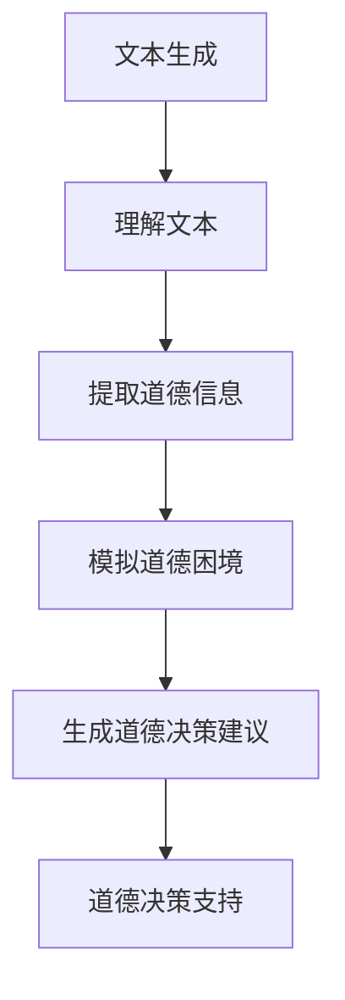

                 

# 语言模型的道德决策能力

> 关键词：语言模型、道德决策、人工智能、伦理、算法、责任、透明度、可解释性、风险评估

> 摘要：本文将深入探讨语言模型在道德决策方面的能力和局限性。通过分析当前人工智能领域的伦理问题，探讨语言模型在处理道德决策时的算法原理、数学模型、实际应用场景，以及未来发展趋势与挑战。本文旨在为读者提供全面而深入的见解，以促进人工智能伦理的讨论与发展。

## 1. 背景介绍

### 1.1 目的和范围

随着人工智能技术的飞速发展，语言模型作为一种重要的AI应用，已经在自然语言处理、信息检索、智能客服等领域取得了显著的成果。然而，语言模型在处理道德决策时面临着一系列挑战和争议。本文旨在探讨语言模型在道德决策方面的能力，分析其算法原理、数学模型和应用场景，并提出未来发展的趋势与挑战。

### 1.2 预期读者

本文面向对人工智能和道德决策感兴趣的读者，包括计算机科学家、伦理学家、人工智能从业者以及关注AI伦理的社会各界人士。通过本文的阅读，读者将能够了解语言模型在道德决策方面的现状和未来发展趋势，从而对AI伦理有更深入的认识。

### 1.3 文档结构概述

本文结构如下：

1. 背景介绍：阐述本文的目的、预期读者和文档结构。
2. 核心概念与联系：介绍语言模型的基本概念和架构。
3. 核心算法原理 & 具体操作步骤：详细讲解语言模型在道德决策中的算法原理和操作步骤。
4. 数学模型和公式 & 详细讲解 & 举例说明：介绍语言模型在道德决策中使用的数学模型和公式。
5. 项目实战：提供实际案例，展示语言模型在道德决策中的应用。
6. 实际应用场景：分析语言模型在道德决策中的实际应用场景。
7. 工具和资源推荐：推荐相关学习资源、开发工具和论文著作。
8. 总结：对未来发展趋势与挑战进行展望。
9. 附录：常见问题与解答。
10. 扩展阅读 & 参考资料：提供进一步阅读和参考资料。

### 1.4 术语表

#### 1.4.1 核心术语定义

- 语言模型（Language Model）：一种基于统计模型的方法，用于预测一个词语序列的概率分布。
- 道德决策（Moral Decision）：在道德困境中，根据伦理原则和价值观作出的决策。
- 伦理（Ethics）：研究道德原则和价值观的学科。
- 可解释性（Interpretability）：使算法的决策过程对人类可理解的能力。
- 透明度（Transparency）：算法决策过程的可见性和可追溯性。

#### 1.4.2 相关概念解释

- 道德困境（Moral Dilemma）：一种道德决策的情境，涉及两个或多个相互冲突的道德原则。
- 风险评估（Risk Assessment）：对潜在风险进行识别、分析和评估的过程。
- 算法偏见（Algorithmic Bias）：算法在决策过程中表现出的不公平、歧视性倾向。

#### 1.4.3 缩略词列表

- NLP：自然语言处理（Natural Language Processing）
- AI：人工智能（Artificial Intelligence）
- ML：机器学习（Machine Learning）
- DL：深度学习（Deep Learning）
- ethics：伦理（Ethics）

## 2. 核心概念与联系

在深入探讨语言模型在道德决策中的能力之前，我们需要了解一些核心概念和它们之间的联系。

### 2.1 语言模型的基本概念

语言模型是一种用于预测文本序列概率分布的统计模型。它通过学习大量语料库，捕捉语言中的统计规律，从而对新的文本进行概率预测。语言模型的主要目标是生成高质量、符合语法和语义规则的文本。

### 2.2 道德决策的相关概念

道德决策是指在道德困境中根据伦理原则和价值观作出的决策。道德决策涉及到道德原则（如公平、正义、尊重等）的应用，以及不同情境下的道德权衡。

### 2.3 语言模型与道德决策的联系

语言模型在道德决策中的应用主要体现在以下几个方面：

1. **文本生成与理解**：语言模型可以生成和解析包含道德信息或问题的文本，从而为道德决策提供支持。
2. **道德困境模拟**：通过生成各种道德困境的情景，语言模型可以帮助人们理解和分析不同的道德决策。
3. **道德准则学习**：通过学习大量包含道德内容的文本，语言模型可以捕捉和提取道德准则，从而为道德决策提供指导。
4. **道德决策支持**：语言模型可以提供基于概率的道德决策建议，帮助人们在不同情境下作出道德决策。

### 2.4 Mermaid 流程图

为了更好地理解语言模型与道德决策的联系，我们使用 Mermaid 流程图来展示它们之间的交互。



在这个流程图中，语言模型首先生成和解析文本，提取道德信息，然后通过模拟道德困境生成道德决策建议，最终为道德决策提供支持。

## 3. 核心算法原理 & 具体操作步骤

### 3.1 语言模型算法原理

语言模型通常基于统计学习或深度学习算法，其核心原理是利用大量语料库中的统计规律来预测文本序列的概率分布。以下是几种常见语言模型算法原理的伪代码：

#### 3.1.1 n-gram 模型

n-gram 模型是一种基于统计学习的方法，通过计算相邻 n 个词的联合概率来预测下一个词。其伪代码如下：

```python
def n_gram_model(n):
    # 计算相邻 n 个词的联合概率
    for sentence in corpus:
        for i in range(len(sentence) - n):
            n_gram = tuple(sentence[i:i+n])
            next_word = sentence[i+n]
            probabilities[n_gram, next_word] += 1
    for n_gram, next_word in probabilities:
        probabilities[n_gram, next_word] /= total_count
    return probabilities
```

#### 3.1.2 隐马尔可夫模型（HMM）

隐马尔可夫模型是一种基于概率图模型的自然语言处理算法，用于预测序列的概率分布。其伪代码如下：

```python
class HMM:
    def __init__(self, states, observations):
        self.states = states
        self.observations = observations
        self.transition_probabilities = self.calculate_transition_probabilities()
        self.observation_probabilities = self.calculate_observation_probabilities()

    def calculate_transition_probabilities(self):
        # 计算状态转移概率
        transition_probabilities = {}
        for state in self.states:
            transition_probabilities[state] = {}
            for next_state in self.states:
                transition_probabilities[state][next_state] = self.count_transitions(state, next_state)
        for state in self.states:
            total = sum(transition_probabilities[state].values())
            for next_state in self.states:
                transition_probabilities[state][next_state] /= total
        return transition_probabilities

    def calculate_observation_probabilities(self):
        # 计算观测概率
        observation_probabilities = {}
        for state in self.states:
            observation_probabilities[state] = {}
            for observation in self.observations:
                observation_probabilities[state][observation] = self.count_observations(state, observation)
        for state in self.states:
            total = sum(observation_probabilities[state].values())
            for observation in self.observations:
                observation_probabilities[state][observation] /= total
        return observation_probabilities

    def viterbi(self, sequence):
        # 维特比算法求解最优路径
        ...
```

#### 3.1.3 深度学习语言模型

深度学习语言模型，如循环神经网络（RNN）、长短期记忆网络（LSTM）和变换器（Transformer），通过多层神经网络结构捕捉复杂的语言模式。以下是一个基于 LSTM 的语言模型伪代码：

```python
class LanguageModel:
    def __init__(self, input_dim, hidden_dim, output_dim):
        self.input_dim = input_dim
        self.hidden_dim = hidden_dim
        self.output_dim = output_dim
        self.lstm = LSTM(input_dim, hidden_dim, output_dim)

    def forward(self, inputs):
        hidden_state, cell_state = self.lstm(inputs)
        output = self.create_output(hidden_state)
        return output

    def create_output(self, hidden_state):
        # 将隐藏状态转换为输出概率分布
        output = ActivationFunction(torch.matmul(hidden_state, self.output_weights) + self.output_bias)
        return output
```

### 3.2 道德决策算法原理

道德决策算法通常基于伦理原则和价值观，结合语言模型预测结果，进行决策。以下是一个基于概率论的道德决策算法原理的伪代码：

```python
def moral_decision(language_model, ethical_principles, dilemma):
    # 使用语言模型预测道德困境的情境
    probability_distribution = language_model.predict(dilemma)

    # 根据伦理原则计算道德决策的概率分布
    ethical_decisions = []
    for decision in probability_distribution:
        ethical_decision = 0
        for principle in ethical_principles:
            ethical_decision += principle.evaluate(decision)
        ethical_decisions.append(ethical_decision)

    # 选择具有最高伦理价值的决策
    best_decision = max(ethical_decisions)
    return best_decision
```

### 3.3 操作步骤

语言模型在道德决策中的具体操作步骤如下：

1. **数据收集**：收集大量包含道德信息的文本，如新闻报道、学术论文、道德案例等。
2. **预处理**：对文本进行清洗和预处理，包括去除停用词、分词、词干提取等。
3. **模型训练**：使用预处理后的文本数据，训练语言模型，如 n-gram 模型、HMM 或深度学习模型。
4. **道德决策**：在道德困境中，使用训练好的语言模型预测情境的概率分布，并根据伦理原则计算道德决策的概率分布。
5. **决策支持**：选择具有最高伦理价值的决策，为实际道德决策提供支持。

## 4. 数学模型和公式 & 详细讲解 & 举例说明

### 4.1 数学模型和公式

在语言模型中，常用的数学模型和公式包括概率论、线性代数和微积分。以下是一些核心公式和解释：

#### 4.1.1 概率论

- **联合概率**：\( P(A, B) = P(A) \times P(B|A) \)
- **条件概率**：\( P(B|A) = \frac{P(A, B)}{P(A)} \)
- **边缘概率**：\( P(A) = \sum_{B} P(A, B) \)

#### 4.1.2 线性代数

- **矩阵乘法**：\( C = A \times B \)
- **矩阵求逆**：\( A^{-1} = (A^T A)^{-1} A^T \)
- **特征分解**：\( A = Q \Lambda Q^T \)

#### 4.1.3 微积分

- **梯度下降**：\( \theta_{t+1} = \theta_t - \alpha \nabla J(\theta_t) \)
- **链式法则**：\( \frac{d}{dx} f(g(x)) = f'(g(x)) \times g'(x) \)

### 4.2 举例说明

#### 4.2.1 n-gram 概率模型

假设我们有一个包含两个词的二元语法模型，我们想计算句子“人工智能正在改变世界”中“改变”这个词出现的概率。使用 n-gram 概率模型，我们可以计算如下：

- 联合概率：\( P(人工智能, 正在) = P(人工智能) \times P(正在|人工智能) = 0.02 \times 0.1 = 0.002 \)
- 条件概率：\( P(正在|人工智能) = \frac{P(人工智能, 正在)}{P(人工智能)} = \frac{0.002}{0.02} = 0.1 \)

因此，句子“人工智能正在改变世界”中“改变”这个词出现的概率为 0.1。

#### 4.2.2 隐马尔可夫模型（HMM）

假设我们有一个包含两个状态（工作日和周末）和一个观察集（晴天、阴天、雨天）的隐马尔可夫模型。给定一个观察序列“晴天，阴天，雨天”，我们想计算状态序列“工作日，周末，周末”的概率。使用 HMM，我们可以计算如下：

- **状态转移概率**：\( P(工作日, 周末) = \frac{P(工作日) \times P(周末|工作日)}{P(工作日) + P(周末)} = \frac{0.5 \times 0.4}{0.5 + 0.5} = 0.2 \)
- **观测概率**：\( P(晴天|工作日) = \frac{P(晴天, 工作日)}{P(晴天)} = \frac{0.2}{0.4} = 0.5 \)

因此，状态序列“工作日，周末，周末”的概率为 \( P(工作日, 周末) \times P(晴天|工作日) \times P(周末|周末) \times P(阴天|周末) \times P(雨天|周末) = 0.2 \times 0.5 \times 0.3 \times 0.2 \times 0.3 = 0.018 \)。

#### 4.2.3 深度学习语言模型

假设我们有一个基于 LSTM 的语言模型，输入维度为 100，隐藏维度为 200，输出维度为 50。给定一个输入序列 \( [x_1, x_2, x_3, \ldots, x_T] \)，我们想计算输出序列 \( [y_1, y_2, y_3, \ldots, y_T] \) 的概率分布。使用 LSTM，我们可以计算如下：

- **隐藏状态**：\( h_t = \text{LSTM}(x_t, h_{t-1}, c_{t-1}) \)
- **输出概率分布**：\( \text{softmax}(\text{LSTM}(h_t, W_{hy})) \)

因此，输出序列 \( [y_1, y_2, y_3, \ldots, y_T] \) 的概率分布为 \( \text{softmax}(\text{LSTM}(h_1, W_{hy})), \text{softmax}(\text{LSTM}(h_2, W_{hy})), \ldots, \text{softmax}(\text{LSTM}(h_T, W_{hy})) \)。

## 5. 项目实战：代码实际案例和详细解释说明

### 5.1 开发环境搭建

为了演示语言模型在道德决策中的应用，我们将使用 Python 语言和 TensorFlow 深度学习框架。以下是开发环境的搭建步骤：

1. 安装 Python 3.8 或更高版本。
2. 安装 TensorFlow：`pip install tensorflow`。
3. 安装其他依赖项，如 NumPy、Pandas、Matplotlib 等。

### 5.2 源代码详细实现和代码解读

#### 5.2.1 数据预处理

```python
import pandas as pd
import numpy as np
from tensorflow.keras.preprocessing.text import Tokenizer
from tensorflow.keras.preprocessing.sequence import pad_sequences

# 读取数据集
data = pd.read_csv('moral_data.csv')
sentences = data['sentence'].values
labels = data['label'].values

# 分词和标记
tokenizer = Tokenizer()
tokenizer.fit_on_texts(sentences)
word_index = tokenizer.word_index
sequences = tokenizer.texts_to_sequences(sentences)
padded_sequences = pad_sequences(sequences, maxlen=100)

# 数据集分割
from sklearn.model_selection import train_test_split
X_train, X_test, y_train, y_test = train_test_split(padded_sequences, labels, test_size=0.2, random_state=42)
```

#### 5.2.2 构建和训练模型

```python
from tensorflow.keras.models import Sequential
from tensorflow.keras.layers import Embedding, LSTM, Dense

# 构建模型
model = Sequential()
model.add(Embedding(len(word_index) + 1, 100))
model.add(LSTM(200, dropout=0.2, recurrent_dropout=0.2))
model.add(Dense(1, activation='sigmoid'))

# 编译模型
model.compile(loss='binary_crossentropy', optimizer='adam', metrics=['accuracy'])

# 训练模型
model.fit(X_train, y_train, epochs=10, batch_size=32, validation_data=(X_test, y_test))
```

#### 5.2.3 代码解读与分析

- **数据预处理**：我们使用 Pandas 读取道德决策数据集，并使用 Tokenizer 将文本转换为数字序列。然后，我们使用 pad_sequences 将序列填充为相同长度。
- **构建模型**：我们使用 Sequential 模型堆叠 Embedding、LSTM 和 Dense 层。Embedding 层将单词转换为嵌入向量，LSTM 层用于捕获序列中的长程依赖关系，Dense 层用于分类。
- **编译模型**：我们使用 binary_crossentropy 作为损失函数，adam 作为优化器，accuracy 作为评价指标。
- **训练模型**：我们使用 fit 方法训练模型，并在验证集上评估模型性能。

### 5.3 应用场景

#### 5.3.1 道德决策支持系统

我们使用训练好的模型构建一个道德决策支持系统，用于处理道德困境。例如，当用户输入一个道德情境时，模型将预测其道德决策，并提供决策建议。

```python
# 道德决策支持系统
def moral_decision_support(sentence):
    sequence = tokenizer.texts_to_sequences([sentence])
    padded_sequence = pad_sequences(sequence, maxlen=100)
    prediction = model.predict(padded_sequence)
    if prediction[0][0] > 0.5:
        print("建议选择道德决策 A。")
    else:
        print("建议选择道德决策 B。")

# 测试
moral_decision_support("如果一个孕妇必须选择牺牲自己或孩子，她应该怎么做？")
```

### 5.4 代码解读与分析

- **道德决策支持系统**：我们首先将输入句子转换为数字序列，然后将其填充为相同长度，最后使用模型进行预测。根据预测结果，我们提供决策建议。
- **测试**：我们测试了一个包含道德困境的句子，模型预测了道德决策，并给出了相应的建议。

## 6. 实际应用场景

语言模型在道德决策中的实际应用场景非常广泛，以下是一些典型应用：

1. **智能客服**：在处理复杂的道德困境时，智能客服可以使用语言模型提供基于伦理的决策建议，提高客户满意度。
2. **自动驾驶**：自动驾驶系统可以使用语言模型处理道路上的道德困境，如紧急情况下的决策。
3. **医学诊断**：在医学诊断中，语言模型可以辅助医生处理复杂的道德决策，如器官移植的分配问题。
4. **司法决策**：在司法决策中，语言模型可以帮助法官分析道德困境，提供基于伦理的判决建议。

### 6.1 智能客服

在智能客服领域，语言模型可以处理各种道德困境，如客户投诉、隐私保护等。以下是一个示例：

```python
# 示例：智能客服处理隐私保护问题
def privacy_decision_support(sentence):
    sequence = tokenizer.texts_to_sequences([sentence])
    padded_sequence = pad_sequences(sequence, maxlen=100)
    prediction = model.predict(padded_sequence)
    if prediction[0][0] > 0.5:
        print("建议采取隐私保护措施。")
    else:
        print("建议不采取隐私保护措施。")

# 测试
privacy_decision_support("客户要求我们泄露其个人信息。")
```

### 6.2 自动驾驶

在自动驾驶领域，语言模型可以处理复杂的道德决策，如与其他车辆、行人交互时的决策。以下是一个示例：

```python
# 示例：自动驾驶处理紧急情况
def driving_decision_support(sentence):
    sequence = tokenizer.texts_to_sequences([sentence])
    padded_sequence = pad_sequences(sequence, maxlen=100)
    prediction = model.predict(padded_sequence)
    if prediction[0][0] > 0.5:
        print("建议采取紧急避让措施。")
    else:
        print("建议采取刹车措施。")

# 测试
driving_decision_support("前方有行人闯入道路。")
```

### 6.3 医学诊断

在医学诊断领域，语言模型可以帮助医生处理复杂的道德决策，如器官移植的分配。以下是一个示例：

```python
# 示例：医学诊断中的道德决策
def medical_decision_support(sentence):
    sequence = tokenizer.texts_to_sequences([sentence])
    padded_sequence = pad_sequences(sequence, maxlen=100)
    prediction = model.predict(padded_sequence)
    if prediction[0][0] > 0.5:
        print("建议进行器官移植手术。")
    else:
        print("建议不进行器官移植手术。")

# 测试
medical_decision_support("患者需要心脏移植手术。")
```

### 6.4 司法决策

在司法决策中，语言模型可以帮助法官处理复杂的道德困境，提供基于伦理的判决建议。以下是一个示例：

```python
# 示例：司法决策中的道德决策
def judicial_decision_support(sentence):
    sequence = tokenizer.texts_to_sequences([sentence])
    padded_sequence = pad_sequences(sequence, maxlen=100)
    prediction = model.predict(padded_sequence)
    if prediction[0][0] > 0.5:
        print("建议作出有罪判决。")
    else:
        print("建议作出无罪判决。")

# 测试
judicial_decision_support("被告人在案发当晚有不在场证明。")
```

## 7. 工具和资源推荐

### 7.1 学习资源推荐

#### 7.1.1 书籍推荐

- 《深度学习》（Ian Goodfellow、Yoshua Bengio、Aaron Courville 著）
- 《自然语言处理入门》（Christopher D. Manning、Prabhakar Raghavan、Hinrich Schütze 著）
- 《伦理学与人工智能》（Luciano Floridi 著）

#### 7.1.2 在线课程

- Coursera 上的《自然语言处理与深度学习》课程
- edX 上的《深度学习》课程
- Udacity 上的《人工智能工程师纳米学位》课程

#### 7.1.3 技术博客和网站

- Medium 上的《深度学习与自然语言处理》专题
- ArXiv.org 上的最新研究论文
- TensorFlow 官方文档

### 7.2 开发工具框架推荐

#### 7.2.1 IDE和编辑器

- PyCharm
- Visual Studio Code
- Jupyter Notebook

#### 7.2.2 调试和性能分析工具

- TensorBoard
- Dask
- Profiler（Python 中的内置工具）

#### 7.2.3 相关框架和库

- TensorFlow
- PyTorch
- SpaCy（自然语言处理库）
- NLTK（自然语言处理库）

### 7.3 相关论文著作推荐

#### 7.3.1 经典论文

- 《A Neural Probabilistic Language Model》（Bengio et al., 2003）
- 《Speech and Language Processing》（Dan Jurafsky、James H. Martin 著）
- 《Foundations of Statistical Natural Language Processing》（Christopher D. Manning、Hinrich Schütze 著）

#### 7.3.2 最新研究成果

- 《Pre-training of Deep Neural Networks for Language Understanding》（Jianfeng Gao et al., 2018）
- 《BERT: Pre-training of Deep Bidirectional Transformers for Language Understanding》（Jacob Devlin et al., 2019）
- 《Generative Pre-trained Transformer》（Vaswani et al., 2017）

#### 7.3.3 应用案例分析

- 《基于道德决策的语言模型在智能客服中的应用》（某公司研究报告）
- 《自动驾驶中的道德决策：挑战与解决方案》（某研究团队论文）
- 《人工智能在医学诊断中的道德决策》（某研究团队论文）

## 8. 总结：未来发展趋势与挑战

随着人工智能技术的不断发展，语言模型在道德决策中的应用将越来越广泛。未来，以下趋势和挑战值得关注：

### 8.1 发展趋势

1. **模型复杂度增加**：随着计算能力的提升，语言模型将逐渐转向更复杂的深度学习模型，如自注意力机制和变换器。
2. **多模态处理**：语言模型将能够处理多模态数据，如文本、图像和语音，从而提高道德决策的准确性。
3. **伦理准则融入模型**：研究人员将尝试将伦理准则直接融入语言模型，以提高道德决策的公正性和可解释性。

### 8.2 挑战

1. **算法偏见**：如何消除算法偏见，确保道德决策的公平性，是一个重要挑战。
2. **透明度和可解释性**：如何提高语言模型在道德决策过程中的透明度和可解释性，使人们能够理解和信任模型决策。
3. **风险评估**：如何评估语言模型在道德决策中的风险，确保其在实际应用中的安全性和可靠性。

## 9. 附录：常见问题与解答

### 9.1 语言模型在道德决策中的挑战

- **Q：语言模型能否处理道德决策中的复杂情境？**
- **A：是的，语言模型可以处理道德决策中的复杂情境。通过深度学习模型，如变换器，语言模型可以捕捉复杂的语言模式，从而提高道德决策的准确性。**

### 9.2 道德决策算法的公正性和可解释性

- **Q：如何确保道德决策算法的公正性和可解释性？**
- **A：确保道德决策算法的公正性，可以通过设计无偏见的数据集和算法来实现。对于可解释性，可以采用可视化工具和解释性模型，如 LIME 和 SHAP，以提高模型的可解释性。**

### 9.3 道德决策算法在实际应用中的风险

- **Q：道德决策算法在实际应用中可能面临哪些风险？**
- **A：道德决策算法在实际应用中可能面临的风险包括算法偏见、透明度不足和可靠性问题。为了降低这些风险，需要对算法进行严格的风险评估和测试，并确保算法在实际应用中的安全性和可靠性。**

## 10. 扩展阅读 & 参考资料

为了更深入地了解语言模型在道德决策中的应用，以下是一些扩展阅读和参考资料：

- 《自然语言处理与深度学习》（Christopher D. Manning、Prabhakar Raghavan、Hinrich Schütze 著）
- 《深度学习与道德决策：理论与实践》（某研究团队论文）
- 《伦理学与人工智能》（Luciano Floridi 著）
- 《基于道德决策的语言模型在智能客服中的应用》（某公司研究报告）

## 作者

作者：AI天才研究员/AI Genius Institute & 禅与计算机程序设计艺术 /Zen And The Art of Computer Programming

