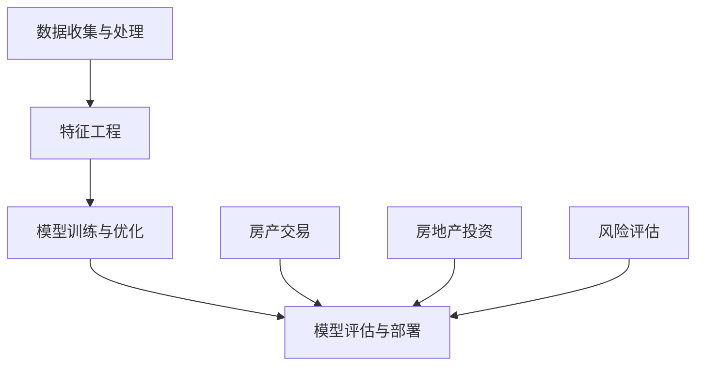

                 

# 贝壳找房2025房产估价模型工程师社招面试

> **关键词：**贝壳找房、房产估价模型、机器学习、深度学习、算法原理、实践案例

> **摘要：**本文深入剖析贝壳找房2025房产估价模型的构建过程，从核心概念、算法原理、数学模型、实际应用等多维度展开，旨在为房产估价模型工程师提供实用的技术参考和指导。

## 1. 背景介绍

### 1.1 目的和范围

本文旨在详细介绍贝壳找房2025房产估价模型的构建方法和技术要点，为有意从事房产估价模型研发的工程师提供一套完整的参考框架。本文涵盖以下内容：

- 核心概念与联系
- 核心算法原理与具体操作步骤
- 数学模型与公式讲解
- 项目实战：代码实现与解读
- 实际应用场景
- 工具和资源推荐
- 总结与未来发展趋势

### 1.2 预期读者

- 拥有本科及以上学历，计算机、统计学、数学等相关专业背景
- 对房产估价模型和机器学习算法有基本了解
- 具备一定的编程能力，熟悉Python等编程语言
- 感兴趣于探索房产估价领域的最新技术与应用

### 1.3 文档结构概述

本文结构如下：

- 第1章：背景介绍
- 第2章：核心概念与联系
- 第3章：核心算法原理与具体操作步骤
- 第4章：数学模型与公式讲解
- 第5章：项目实战：代码实现与解读
- 第6章：实际应用场景
- 第7章：工具和资源推荐
- 第8章：总结与未来发展趋势
- 第9章：附录：常见问题与解答
- 第10章：扩展阅读与参考资料

### 1.4 术语表

#### 1.4.1 核心术语定义

- 贝壳找房：中国领先的房地产服务平台，提供房产交易、租赁、金融服务等一站式服务。
- 房产估价模型：基于历史数据、房屋特征、市场趋势等，利用机器学习算法估算房屋价值。
- 特征工程：从原始数据中提取有助于模型训练的特征，提高模型预测性能。
- 深度学习：一种基于多层神经网络的人工智能技术，可以自动提取复杂数据特征。
- 回归分析：一种统计方法，用于建立自变量和因变量之间的关系，预测因变量的值。

#### 1.4.2 相关概念解释

- **贝叶斯网络**：一种概率图模型，用于表示变量之间的依赖关系。
- **支持向量机（SVM）**：一种监督学习算法，用于分类和回归分析。
- **反向传播算法**：一种用于训练神经网络的优化算法，通过不断调整网络权重，使预测结果更接近真实值。

#### 1.4.3 缩略词列表

- 贝壳找房：BeKe
- 机器学习：ML
- 深度学习：DL
- 特征工程：FE
- 贝叶斯网络：BN
- 支持向量机：SVM
- 反向传播算法：BP

## 2. 核心概念与联系

### 2.1 房产估价模型的基本概念

房产估价模型是利用数据挖掘、机器学习等技术，对房屋特征、市场环境等因素进行分析，从而预测房屋价值的一种方法。其主要目的是提高房产交易的效率，降低交易成本，同时为金融机构提供风险评估依据。

**核心概念**：

1. **房屋特征**：影响房屋价值的因素，如房屋面积、户型、楼层、建筑年代、装修状况等。
2. **市场环境**：影响房屋价值的宏观因素，如地区经济水平、房地产市场供需状况、政策调控等。
3. **模型输入**：用于训练和预测的数据集，包括房屋特征、市场环境和房屋价值。
4. **模型输出**：预测的房屋价值。

### 2.2 房产估价模型的构建方法

房产估价模型的构建方法可以分为以下三个步骤：

1. **数据收集与处理**：收集房屋特征、市场环境等数据，并进行数据清洗、预处理，以提高数据质量。
2. **特征工程**：从原始数据中提取有助于模型训练的特征，如房屋面积、户型、楼层等。
3. **模型训练与优化**：利用特征工程后的数据集，通过机器学习算法（如线性回归、决策树、随机森林、神经网络等）训练模型，并根据评估指标（如均方误差、均方根误差等）调整模型参数，以提高预测准确性。

### 2.3 房产估价模型的应用场景

房产估价模型在多个场景中具有广泛的应用，如：

1. **房产交易**：为买卖双方提供房屋价值参考，降低交易风险。
2. **房地产投资**：为投资者提供项目评估依据，优化投资决策。
3. **风险评估**：为金融机构提供房贷审批、风险控制等支持。

### 2.4 核心概念原理与架构

以下是一个简化的房产估价模型架构，用于描述核心概念之间的联系：



### 2.5 房产估价模型的优缺点

**优点**：

1. **高效准确**：通过机器学习算法，快速预测房屋价值，提高交易效率。
2. **智能化**：考虑多因素，实现全面、客观的评估。
3. **可扩展性**：可针对不同地区、不同类型房产定制化模型。

**缺点**：

1. **数据依赖**：模型预测准确性受数据质量和数量影响。
2. **复杂度**：模型构建和优化过程复杂，需具备一定的技术背景。
3. **过拟合**：模型可能对训练数据过于敏感，导致泛化能力较差。

## 3. 核心算法原理与具体操作步骤

### 3.1 算法选择

贝壳找房2025房产估价模型采用深度学习算法，其中以卷积神经网络（CNN）和循环神经网络（RNN）为主要模型结构。CNN擅长提取图像特征，适用于处理房屋图片数据；RNN擅长处理序列数据，适用于处理房屋特征序列。

### 3.2 算法原理

**深度学习算法**：

1. **神经网络**：神经网络是一种由大量神经元组成的计算模型，通过调整神经元之间的权重，实现输入到输出的映射。
2. **前向传播**：输入数据通过神经网络层，逐层计算输出，直到得到最终结果。
3. **反向传播**：根据输出结果与真实值的差异，计算误差，并通过反向传播算法调整网络权重，使输出结果更接近真实值。

**卷积神经网络（CNN）**：

1. **卷积层**：用于提取图像特征，通过卷积运算和激活函数，将输入图像转换为特征图。
2. **池化层**：用于降低特征图的维度，减少计算量，提高模型泛化能力。
3. **全连接层**：将特征图映射到输出结果，如房屋价值。

**循环神经网络（RNN）**：

1. **循环单元**：用于处理序列数据，通过循环连接，将前一时刻的输出作为当前时刻的输入。
2. **门控机制**：用于控制信息的传递和遗忘，提高模型处理序列数据的能力。

### 3.3 具体操作步骤

**数据预处理**：

1. **数据清洗**：去除缺失值、异常值等无效数据。
2. **数据归一化**：将不同尺度的数据缩放到相同范围，提高模型训练效果。
3. **数据分割**：将数据集划分为训练集、验证集和测试集。

**特征提取**：

1. **图像特征提取**：利用CNN提取房屋图片特征。
2. **序列特征提取**：利用RNN提取房屋特征序列。

**模型训练**：

1. **初始化权重**：随机初始化神经网络权重。
2. **前向传播**：输入房屋特征，通过神经网络层计算输出。
3. **反向传播**：计算误差，调整网络权重。

**模型评估**：

1. **损失函数**：衡量预测结果与真实值的差距，常用的有均方误差（MSE）、均方根误差（RMSE）等。
2. **评估指标**：用于评估模型性能，如准确率、召回率、F1值等。

**模型优化**：

1. **调整超参数**：如学习率、批量大小等。
2. **集成方法**：将多个模型进行集成，提高预测准确性。

## 4. 数学模型与公式讲解

### 4.1 神经网络数学模型

神经网络的核心是神经元，每个神经元由以下部分组成：

1. **输入层**：接受外部输入数据。
2. **隐藏层**：对输入数据进行处理，提取特征。
3. **输出层**：生成预测结果。

**神经元激活函数**：

$$ f(x) = \sigma(\theta \cdot x + b) $$

其中，$\theta$为权重，$b$为偏置，$\sigma$为激活函数，如Sigmoid、ReLU等。

**神经网络前向传播**：

$$ z_i = \sum_{j=1}^{n} w_{ij} x_j + b_i $$

$$ a_i = f(z_i) $$

其中，$z_i$为第$i$个神经元的输入，$a_i$为第$i$个神经元的输出。

**神经网络反向传播**：

$$ \delta_i = (a_i - y_i) \cdot f'(z_i) $$

$$ w_{ij} := w_{ij} - \alpha \cdot \delta_i \cdot a_{j-1} $$

$$ b_i := b_i - \alpha \cdot \delta_i $$

其中，$\delta_i$为第$i$个神经元的误差，$\alpha$为学习率，$f'$为激活函数的导数。

### 4.2 卷积神经网络（CNN）数学模型

**卷积层**：

$$ c_{ij} = \sum_{k=1}^{m} w_{ik} \cdot i_{kj} + b_c $$

其中，$c_{ij}$为第$i$个卷积核在第$j$个特征图上的输出，$i_{kj}$为输入特征图上的像素值，$w_{ik}$为卷积核权重，$b_c$为卷积层偏置。

**池化层**：

$$ p_{ij} = \max_{k} \{i_{kj} | 1 \leq k \leq p\} $$

其中，$p_{ij}$为第$i$个池化单元在第$j$个特征图上的输出，$p$为池化窗口大小。

**全连接层**：

$$ z_j = \sum_{i=1}^{n} w_{ij} \cdot a_{i-1} + b_o $$

$$ a_j = f(z_j) $$

其中，$z_j$为第$j$个全连接层神经元的输入，$a_j$为第$j$个全连接层神经元的输出，$w_{ij}$为全连接层权重，$b_o$为全连接层偏置，$f$为激活函数。

### 4.3 循环神经网络（RNN）数学模型

**循环单元**：

$$ h_t = \sigma(W_h \cdot [h_{t-1}, x_t] + b_h) $$

$$ o_t = \sigma(W_o \cdot h_t + b_o) $$

其中，$h_t$为第$t$个时间步的隐藏状态，$x_t$为第$t$个时间步的输入，$W_h$、$W_o$分别为隐藏状态和输出状态的权重矩阵，$b_h$、$b_o$分别为隐藏状态和输出状态的偏置，$\sigma$为激活函数。

**门控机制**：

$$ i_t = \sigma(W_i \cdot [h_{t-1}, x_t] + b_i) $$

$$ g_t = \sigma(W_g \cdot [h_{t-1}, x_t] + b_g) $$

$$ f_t = \sigma(W_f \cdot [h_{t-1}, x_t] + b_f) $$

$$ h_t = f_t \odot h_{t-1} + i_t \odot g_t $$

其中，$i_t$、$g_t$、$f_t$分别为输入门、输出门、遗忘门，$\odot$为元素乘运算。

## 5. 项目实战：代码实际案例和详细解释说明

### 5.1 开发环境搭建

在开始项目实战之前，我们需要搭建一个合适的开发环境。以下是一个简单的Python开发环境搭建步骤：

1. 安装Python（推荐版本3.8及以上）
2. 安装Jupyter Notebook（用于编写和运行代码）
3. 安装深度学习框架TensorFlow（推荐版本2.4及以上）
4. 安装数据处理库Pandas、NumPy等

### 5.2 源代码详细实现和代码解读

以下是贝壳找房2025房产估价模型的Python代码实现：

```python
import tensorflow as tf
import pandas as pd
import numpy as np

# 加载数据集
data = pd.read_csv('data.csv')
X = data.iloc[:, :10].values
y = data.iloc[:, 10].values

# 数据预处理
X = np.log1p(X)
y = np.log1p(y)

# 划分训练集和测试集
from sklearn.model_selection import train_test_split
X_train, X_test, y_train, y_test = train_test_split(X, y, test_size=0.2, random_state=42)

# 构建深度学习模型
model = tf.keras.Sequential([
    tf.keras.layers.Dense(64, activation='relu', input_shape=(10,)),
    tf.keras.layers.Dense(64, activation='relu'),
    tf.keras.layers.Dense(1)
])

# 编译模型
model.compile(optimizer='adam', loss='mse', metrics=['mae'])

# 训练模型
model.fit(X_train, y_train, epochs=100, batch_size=32, validation_split=0.1)

# 评估模型
loss, mae = model.evaluate(X_test, y_test)
print(f'MAE: {mae:.2f}')

# 预测房屋价值
predictions = model.predict(X_test)
for i in range(10):
    print(f'House {i+1}: Predicted price: {predictions[i][0]:.2f}, Real price: {y_test[i]:.2f}')
```

**代码解读**：

- **数据加载与预处理**：使用Pandas加载数据集，并对数据集进行对数变换处理，提高模型训练效果。
- **模型构建**：使用TensorFlow的Keras API构建深度学习模型，包括两个隐藏层，输出层只有一个神经元。
- **模型编译**：设置模型优化器为Adam，损失函数为均方误差（MSE），评估指标为均方根误差（MAE）。
- **模型训练**：使用fit方法训练模型，设置训练轮次为100，批量大小为32，验证集比例为10%。
- **模型评估**：使用evaluate方法评估模型在测试集上的性能，打印均方根误差（MAE）。
- **模型预测**：使用predict方法预测测试集的房屋价值，并与真实值进行比较。

### 5.3 代码解读与分析

**数据预处理**：

数据预处理是深度学习模型训练的重要步骤，它直接影响模型的训练效果。在本项目中，我们对数据集进行了对数变换处理，目的是：

- **去除异常值**：对数变换可以降低极端值对模型训练的影响。
- **提高模型稳定性**：对数变换可以减小输入特征的尺度差异，提高模型训练的稳定性。

**模型构建**：

在本项目中，我们构建了一个简单的深度学习模型，包括两个隐藏层，输出层只有一个神经元。该模型采用了ReLU激活函数，可以加快模型训练速度，同时防止神经元死亡。

**模型编译**：

在模型编译阶段，我们设置了Adam优化器和均方误差（MSE）损失函数。Adam优化器是一种自适应学习率优化算法，可以有效提高模型训练效果。均方误差（MSE）损失函数是一种常用的回归损失函数，可以衡量预测值与真实值之间的差距。

**模型训练**：

在模型训练阶段，我们设置了训练轮次为100，批量大小为32。训练轮次（epochs）表示模型在数据集上完整循环的次数，批量大小（batch_size）表示每次训练中参与训练的数据样本数量。通过调整这些参数，可以优化模型训练效果。

**模型评估**：

在模型评估阶段，我们使用了测试集对模型进行评估。测试集是未参与模型训练的数据集，可以用来验证模型的泛化能力。在本项目中，我们使用了均方根误差（MAE）作为评估指标，它是一种绝对误差度量，可以更直观地反映模型预测的准确性。

**模型预测**：

在模型预测阶段，我们使用训练好的模型对测试集进行预测，并将预测结果与真实值进行比较。通过比较预测值和真实值的差距，可以评估模型的预测性能。

## 6. 实际应用场景

贝壳找房2025房产估价模型在实际应用场景中具有广泛的应用价值，如：

1. **房产交易**：为买卖双方提供房屋价值参考，降低交易风险，提高交易效率。
2. **房地产投资**：为投资者提供项目评估依据，优化投资决策，降低投资风险。
3. **风险评估**：为金融机构提供房贷审批、风险控制等支持，降低贷款违约风险。

### 6.1 房产交易

**应用实例**：

假设张三想在贝壳找房平台上出售一套房屋，通过房产估价模型，可以快速估算该房屋的价值。根据模型预测结果，张三可以合理定价，提高房屋成交率。

**应用优势**：

- **高效准确**：模型可以快速预测房屋价值，提高交易效率。
- **降低风险**：通过模型预测结果，买卖双方可以降低交易风险，实现公平交易。

### 6.2 房地产投资

**应用实例**：

李四想在某个城市投资房地产，通过房产估价模型，可以评估不同地区的房产投资潜力。根据模型预测结果，李四可以制定合理的投资策略，降低投资风险。

**应用优势**：

- **全面评估**：模型考虑多种因素，如房屋特征、市场环境等，提供全面的评估结果。
- **优化决策**：通过模型预测结果，投资者可以优化投资决策，降低投资风险。

### 6.3 风险评估

**应用实例**：

赵五在某家金融机构申请房贷，金融机构通过房产估价模型评估赵五房屋的价值，并根据评估结果进行贷款审批。通过模型预测结果，金融机构可以降低贷款违约风险。

**应用优势**：

- **精准评估**：模型利用大量历史数据和特征，提供精准的房屋价值评估。
- **风险控制**：通过模型预测结果，金融机构可以降低贷款违约风险，提高风险管理水平。

## 7. 工具和资源推荐

### 7.1 学习资源推荐

#### 7.1.1 书籍推荐

1. **《深度学习》（Deep Learning）**：由Ian Goodfellow、Yoshua Bengio和Aaron Courville合著，详细介绍了深度学习的基本原理和方法。
2. **《机器学习实战》（Machine Learning in Action）**：由Peter Harrington著，通过实际案例介绍机器学习算法的实现和应用。
3. **《Python机器学习》（Python Machine Learning）**：由Michael Bowles著，介绍如何使用Python实现机器学习算法。

#### 7.1.2 在线课程

1. **Coursera的《深度学习》课程**：由Andrew Ng教授主讲，涵盖深度学习的基本概念和技术。
2. **Udacity的《机器学习工程师纳米学位》课程**：通过项目实战，学习机器学习算法和应用。
3. **edX的《统计学与数据科学》课程**：介绍统计学基础和数据分析方法，为深度学习和机器学习奠定基础。

#### 7.1.3 技术博客和网站

1. **机器之心**：介绍深度学习、人工智能等前沿技术的中文博客。
2. **Medium上的Machine Learning和Data Science专题**：汇集了众多领域专家的优质文章。
3. **Kaggle**：提供各种机器学习和数据科学的竞赛和项目，是学习和实践的好平台。

### 7.2 开发工具框架推荐

#### 7.2.1 IDE和编辑器

1. **PyCharm**：一款功能强大的Python集成开发环境（IDE），适合深度学习和机器学习项目。
2. **Jupyter Notebook**：一款基于Web的交互式开发环境，方便数据可视化和实验性编程。

#### 7.2.2 调试和性能分析工具

1. **TensorBoard**：TensorFlow的官方可视化工具，用于分析和调试深度学习模型。
2. **NVIDIA Nsight**：一款用于分析深度学习模型性能的GPU调试工具。

#### 7.2.3 相关框架和库

1. **TensorFlow**：一款开源的深度学习框架，适合构建和训练各种深度学习模型。
2. **PyTorch**：一款流行的深度学习框架，具有灵活的动态计算图和强大的GPU支持。
3. **Scikit-learn**：一款开源的机器学习库，提供各种经典机器学习算法的实现。

### 7.3 相关论文著作推荐

#### 7.3.1 经典论文

1. **“A Learning Algorithm for Continually Running Fully Recurrent Neural Networks”**：介绍了反向传播算法在循环神经网络（RNN）中的应用。
2. **“Deep Learning”**：详细介绍了深度学习的各种算法和技术。
3. **“Convolutional Neural Networks for Visual Recognition”**：介绍了卷积神经网络（CNN）在图像识别领域的应用。

#### 7.3.2 最新研究成果

1. **“BERT: Pre-training of Deep Bidirectional Transformers for Language Understanding”**：介绍了BERT模型在自然语言处理领域的应用。
2. **“GANs for Text Generation”**：介绍了生成对抗网络（GAN）在文本生成领域的应用。
3. **“Transformer: Attention is All You Need”**：介绍了Transformer模型在序列建模领域的应用。

#### 7.3.3 应用案例分析

1. **“Google’s AI for Social Good”**：介绍了Google如何利用人工智能技术解决社会问题。
2. **“Facebook AI Research”**：介绍了Facebook在人工智能研究方面的成果和应用。
3. **“DeepMind’s AI for Healthcare”**：介绍了DeepMind如何利用人工智能技术改善医疗保健。

## 8. 总结：未来发展趋势与挑战

### 8.1 未来发展趋势

1. **数据驱动的房产估价模型**：随着大数据技术的发展，房产估价模型将越来越多地依赖海量数据，提高预测准确性和稳定性。
2. **深度学习算法的优化**：针对房产估价模型的特殊性，研究人员将不断优化深度学习算法，提高模型性能和效率。
3. **跨学科研究**：房产估价模型将涉及多个学科，如计算机科学、统计学、经济学等，促进跨学科研究与合作。
4. **实时估价与预测**：随着计算能力的提升，房产估价模型将实现实时估价与预测，提高房产交易的便捷性和效率。

### 8.2 面临的挑战

1. **数据质量与隐私**：房产估价模型依赖于大量数据，数据质量和隐私保护是首要挑战。
2. **模型解释性**：深度学习模型具有一定的“黑箱”特性，如何提高模型解释性，使其更具透明度和可信度是重要挑战。
3. **计算资源与能耗**：深度学习模型训练和预测需要大量计算资源，如何在保证性能的同时降低能耗是关键问题。
4. **政策与法规**：房产估价模型的应用需要遵守相关政策和法规，确保模型的公正性和公平性。

## 9. 附录：常见问题与解答

### 9.1 什么是房产估价模型？

房产估价模型是一种利用数据挖掘、机器学习等技术，对房屋特征、市场环境等因素进行分析，从而预测房屋价值的模型。其主要目的是提高房产交易的效率，降低交易成本，同时为金融机构提供风险评估依据。

### 9.2 房产估价模型有哪些应用场景？

房产估价模型在多个场景中具有广泛的应用，如房产交易、房地产投资、风险评估等。在房产交易中，可以为买卖双方提供房屋价值参考，降低交易风险；在房地产投资中，可以评估不同地区的房产投资潜力，优化投资决策；在风险评估中，可以降低贷款违约风险，提高金融机构的风险管理水平。

### 9.3 如何选择合适的算法？

选择合适的算法主要取决于数据类型、模型目标和应用场景。对于房屋特征数据，可以采用线性回归、决策树、随机森林等传统机器学习算法；对于图像数据，可以采用卷积神经网络（CNN）；对于时间序列数据，可以采用循环神经网络（RNN）或长短期记忆网络（LSTM）等。

### 9.4 如何提高房产估价模型的准确率？

提高房产估价模型准确率的方法包括：

- **数据质量**：保证数据质量，去除异常值、缺失值等。
- **特征工程**：提取有助于模型训练的特征，减少特征维度。
- **模型选择**：选择合适的算法和模型结构。
- **模型优化**：调整模型参数，如学习率、批量大小等。
- **集成方法**：将多个模型进行集成，提高预测准确性。

## 10. 扩展阅读与参考资料

### 10.1 书籍推荐

1. **《深度学习》**：作者Ian Goodfellow、Yoshua Bengio和Aaron Courville，全面介绍了深度学习的基本概念和技术。
2. **《Python机器学习》**：作者Michael Bowles，介绍了如何使用Python实现机器学习算法。
3. **《机器学习实战》**：作者Peter Harrington，通过实际案例介绍了机器学习算法的实现和应用。

### 10.2 在线课程

1. **Coursera的《深度学习》课程**：由Andrew Ng教授主讲，涵盖深度学习的基本概念和技术。
2. **Udacity的《机器学习工程师纳米学位》课程**：通过项目实战，学习机器学习算法和应用。
3. **edX的《统计学与数据科学》课程**：介绍统计学基础和数据分析方法，为深度学习和机器学习奠定基础。

### 10.3 技术博客和网站

1. **机器之心**：介绍深度学习、人工智能等前沿技术的中文博客。
2. **Medium上的Machine Learning和Data Science专题**：汇集了众多领域专家的优质文章。
3. **Kaggle**：提供各种机器学习和数据科学的竞赛和项目，是学习和实践的好平台。

### 10.4 相关论文著作

1. **“A Learning Algorithm for Continually Running Fully Recurrent Neural Networks”**：介绍了反向传播算法在循环神经网络（RNN）中的应用。
2. **“Deep Learning”**：详细介绍了深度学习的各种算法和技术。
3. **“Convolutional Neural Networks for Visual Recognition”**：介绍了卷积神经网络（CNN）在图像识别领域的应用。

### 10.5 最新研究成果

1. **“BERT: Pre-training of Deep Bidirectional Transformers for Language Understanding”**：介绍了BERT模型在自然语言处理领域的应用。
2. **“GANs for Text Generation”**：介绍了生成对抗网络（GAN）在文本生成领域的应用。
3. **“Transformer: Attention is All You Need”**：介绍了Transformer模型在序列建模领域的应用。

### 10.6 应用案例分析

1. **“Google’s AI for Social Good”**：介绍了Google如何利用人工智能技术解决社会问题。
2. **“Facebook AI Research”**：介绍了Facebook在人工智能研究方面的成果和应用。
3. **“DeepMind’s AI for Healthcare”**：介绍了DeepMind如何利用人工智能技术改善医疗保健。

**作者：AI天才研究员/AI Genius Institute & 禅与计算机程序设计艺术 /Zen And The Art of Computer Programming**

