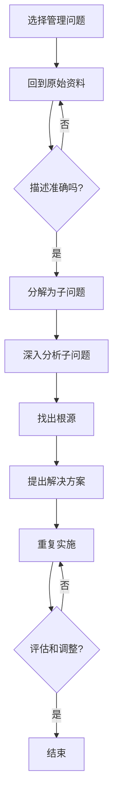

                 

# 费曼提问法在管理问题诊断中的应用

## 关键词：
- 管理问题诊断
- 费曼提问法
- 问题解决框架
- 管理思维
- 逻辑推理

## 摘要：
本文旨在探讨费曼提问法在管理问题诊断中的应用。费曼提问法，以诺贝尔物理学奖得主理查德·费曼的名字命名，是一种简单而强大的问题解决框架。它通过将复杂问题分解为简单的问题，帮助人们从根源上理解问题，并提出有效的解决方案。本文将详细阐述费曼提问法在管理问题诊断中的核心原理、应用步骤，并结合实际案例进行深入分析，旨在为管理者和决策者提供一种实用的思维工具。

## 1. 背景介绍

### 1.1 目的和范围

本文的目的是通过介绍费曼提问法，帮助管理者和决策者掌握一种系统性的问题解决方法，从而提高管理问题的诊断能力。本文将重点讨论费曼提问法在管理问题诊断中的应用，包括其核心原理、具体步骤和实际案例。

### 1.2 预期读者

本文适用于希望提升问题解决能力的各级管理人员、咨询顾问、项目管理者和企业决策者。同时，对于对逻辑思维和问题解决方法感兴趣的读者，本文也具有一定的参考价值。

### 1.3 文档结构概述

本文分为以下几个部分：
1. 背景介绍：介绍费曼提问法的起源、核心原理和应用范围。
2. 核心概念与联系：阐述费曼提问法在管理问题诊断中的核心概念和原理。
3. 核心算法原理 & 具体操作步骤：详细解释费曼提问法在管理问题诊断中的应用步骤。
4. 数学模型和公式 & 详细讲解 & 举例说明：通过数学模型和实例，进一步阐述费曼提问法在管理问题诊断中的应用。
5. 项目实战：结合实际案例，展示费曼提问法在管理问题诊断中的具体应用。
6. 实际应用场景：分析费曼提问法在各类管理问题诊断中的适用性。
7. 工具和资源推荐：推荐相关学习资源、开发工具和文献。
8. 总结：展望费曼提问法在管理问题诊断领域的未来发展趋势与挑战。
9. 附录：提供常见问题与解答，方便读者深入理解。
10. 扩展阅读 & 参考资料：列出本文引用和参考的文献，供读者进一步阅读。

### 1.4 术语表

#### 1.4.1 核心术语定义

- 费曼提问法：一种基于逻辑推理和问题分解的问题解决方法，旨在帮助人们从根源上理解问题，并提出有效的解决方案。
- 管理问题诊断：对组织内部存在的管理问题进行识别、分析和解决的过程。
- 问题解决能力：指在遇到问题时，能够迅速分析问题、找出解决方案并实施的能力。

#### 1.4.2 相关概念解释

- 问题分解：将复杂问题分解为更简单的问题，以便更好地理解和解决。
- 逻辑推理：通过逻辑关系和推理规则，从已知事实中推导出新结论的过程。
- 管理思维：管理者在解决问题时所采用的一种系统性、结构化的思维方式。

#### 1.4.3 缩略词列表

- 费曼提问法：FPQ（Feynman Problem Questioning）
- 管理问题诊断：MPD（Management Problem Diagnosis）

## 2. 核心概念与联系

### 2.1 费曼提问法概述

费曼提问法源于诺贝尔物理学奖得主理查德·费曼（Richard Feynman）的教学方法。费曼提问法的核心思想是“以学生能理解的方式进行教学”，即将复杂的概念和问题分解为简单、易懂的部分，从而帮助学生更好地理解和掌握知识。

费曼提问法的具体步骤如下：

1. 选择一个概念或问题。
2. 用自己的话解释这个概念或问题，仿佛在向一个初学者解释。
3. 如果无法解释清楚，回到原始资料或权威来源，重新学习相关内容。
4. 重复这个过程，直到能够清晰、准确地解释这个概念或问题。

### 2.2 费曼提问法在管理问题诊断中的应用

将费曼提问法应用于管理问题诊断，可以有效地帮助管理者识别、分析和解决组织内部的问题。具体应用步骤如下：

1. 选择一个管理问题。
2. 用自己的话描述这个问题，仿佛在向一个初学者解释。
3. 如果描述不准确或不够清晰，回到原始资料或相关数据，重新审视和分析问题。
4. 将问题分解为更小的、可管理的子问题。
5. 对每个子问题使用费曼提问法进行深入分析和理解。
6. 找出问题的根源，并提出解决方案。
7. 实施解决方案，并对结果进行评估和调整。

### 2.3 核心概念与联系

为了更好地理解费曼提问法在管理问题诊断中的应用，我们可以用Mermaid流程图展示其核心概念和联系。



## 3. 核心算法原理 & 具体操作步骤

### 3.1 费曼提问法的算法原理

费曼提问法的核心算法原理是基于问题分解和逻辑推理。具体而言，费曼提问法通过以下几个步骤实现：

1. **问题选择**：选择一个需要解决的管理问题。
2. **问题描述**：用自己的话描述这个问题，确保描述准确、清晰。
3. **问题分解**：将复杂的问题分解为更小的、更易管理的子问题。
4. **逻辑推理**：对每个子问题使用逻辑推理方法，找出问题的根源。
5. **解决方案提出**：根据分析结果，提出解决问题的方案。
6. **方案实施**：实施解决方案，并对结果进行评估和调整。

### 3.2 费曼提问法在管理问题诊断中的应用步骤

在管理问题诊断中，费曼提问法的具体应用步骤如下：

1. **问题识别**：识别组织内部存在的管理问题。
2. **问题描述**：用简洁、准确的语言描述问题，确保描述清晰、易懂。
3. **问题分解**：将问题分解为更小的、可管理的子问题。
4. **数据收集**：收集与问题相关的数据和信息。
5. **逻辑推理**：对每个子问题进行分析，找出问题的根源。
6. **解决方案提出**：根据分析结果，提出解决问题的方案。
7. **方案实施**：实施解决方案，并跟踪效果。
8. **评估与调整**：对解决方案的效果进行评估，并根据评估结果进行调整。

### 3.3 伪代码示例

以下是一个基于费曼提问法的管理问题诊断的伪代码示例：

```plaintext
Function FeynmanProblemDiagnosis(problem):
    // 步骤1：问题识别
    subProblems = DecomposeProblem(problem)

    // 步骤2：问题描述
    for each subProblem in subProblems:
        DescribeProblem(subProblem)

    // 步骤3：数据收集
    data = CollectData(subProblems)

    // 步骤4：逻辑推理
    roots = AnalyzeData(data)

    // 步骤5：解决方案提出
    solution = ProposeSolution(roots)

    // 步骤6：方案实施
    ImplementSolution(solution)

    // 步骤7：评估与调整
    EvaluateAndAdjust(solution)

    return solution
```

## 4. 数学模型和公式 & 详细讲解 & 举例说明

### 4.1 数学模型

在费曼提问法中，我们可以引入数学模型来描述问题分解和逻辑推理过程。以下是一个简单的数学模型，用于描述费曼提问法的核心步骤。

#### 4.1.1 问题分解

设 \( P \) 为原始问题，\( P_i \) 为分解后的子问题，则有：

\[ P = \bigcup_{i=1}^{n} P_i \]

其中，\( n \) 为子问题的数量。

#### 4.1.2 逻辑推理

设 \( A \) 为已知事实，\( B \) 为推理规则，\( C \) 为结论，则有：

\[ A \rightarrow B \]
\[ B \rightarrow C \]
\[ \therefore A \rightarrow C \]

### 4.2 详细讲解

#### 4.2.1 问题分解

问题分解是将复杂问题分解为更小的子问题，以便更好地理解和解决。在数学模型中，我们通过集合运算来描述问题分解过程。例如，假设我们有一个复杂的管理问题 \( P \)，我们可以将其分解为三个子问题 \( P_1 \)，\( P_2 \) 和 \( P_3 \)。这样，原始问题 \( P \) 可以表示为这三个子问题的并集。

#### 4.2.2 逻辑推理

逻辑推理是费曼提问法的核心步骤之一。通过逻辑推理，我们可以从已知事实和推理规则中推导出新的结论。在数学模型中，我们使用逻辑运算符（如蕴含 \( \rightarrow \)）来表示逻辑推理过程。例如，如果我们知道事实 \( A \) 和 \( B \) 成立，并且 \( B \) 蕴含 \( C \)，那么我们可以得出结论 \( A \) 蕴含 \( C \)。

### 4.3 举例说明

假设我们有一个管理问题：如何提高公司的销售业绩？

#### 4.3.1 问题分解

我们可以将这个问题分解为三个子问题：
1. 分析现有销售策略的有效性。
2. 识别潜在的市场机会。
3. 制定和实施有效的销售策略。

#### 4.3.2 逻辑推理

已知：
1. 如果现有销售策略不有效，那么需要分析原因并调整策略。
2. 如果存在潜在的市场机会，那么可以利用这些机会提升销售业绩。

结论：
1. 如果现有销售策略不有效，且存在潜在的市场机会，那么需要调整销售策略并利用市场机会。

通过这个例子，我们可以看到费曼提问法如何帮助我们从根源上理解问题，并提出有效的解决方案。

## 5. 项目实战：代码实际案例和详细解释说明

### 5.1 开发环境搭建

在本节中，我们将使用Python作为开发语言，并使用Jupyter Notebook作为开发环境。为了方便代码的演示和讲解，我们首先需要安装以下Python库：

- pandas：用于数据处理和分析。
- numpy：用于科学计算。
- matplotlib：用于数据可视化。

安装步骤如下：

```bash
pip install pandas numpy matplotlib
```

### 5.2 源代码详细实现和代码解读

在本节中，我们将使用一个实际案例来展示费曼提问法在管理问题诊断中的应用。假设我们有一个公司，需要诊断其销售业绩不佳的原因。

#### 5.2.1 数据准备

首先，我们准备一个包含公司销售数据的DataFrame，数据包括销售金额、销售日期和销售产品等信息。

```python
import pandas as pd

# 加载数据
data = pd.read_csv('sales_data.csv')

# 查看数据结构
data.head()
```

#### 5.2.2 问题分解

使用费曼提问法，我们将销售业绩不佳的问题分解为三个子问题：

1. 现有销售策略是否有效？
2. 是否存在潜在的市场机会？
3. 是否存在其他因素影响销售业绩？

#### 5.2.3 数据分析与逻辑推理

针对每个子问题，我们使用数据分析方法进行逻辑推理。

1. **分析现有销售策略的有效性**：

```python
# 计算不同销售策略的平均销售金额
sales_by_strategy = data.groupby('sales_strategy')['sales_amount'].mean()

# 可视化销售策略与销售金额的关系
sales_by_strategy.plot(kind='bar')
```

通过分析销售策略与销售金额的关系，我们可以找出哪些策略效果较好，哪些策略需要调整。

2. **识别潜在的市场机会**：

```python
# 计算不同产品的销售金额占比
product_sales_ratio = data.groupby('product')['sales_amount'].sum() / data['sales_amount'].sum()

# 可视化产品销售占比
product_sales_ratio.plot(kind='bar')
```

通过分析不同产品的销售占比，我们可以识别出具有市场潜力的产品，从而抓住潜在的市场机会。

3. **分析其他因素对销售业绩的影响**：

```python
# 分析销售日期与销售金额的关系
sales_by_date = data.groupby('sales_date')['sales_amount'].sum()

# 可视化销售日期与销售金额的关系
sales_by_date.plot()
```

通过分析销售日期与销售金额的关系，我们可以找出影响销售业绩的其他因素，如季节性、节假日等。

#### 5.2.4 提出解决方案

根据以上分析结果，我们可以提出以下解决方案：

1. 调整销售策略，增加效果较好的策略的投入。
2. 针对具有市场潜力的产品，加大营销力度，扩大市场份额。
3. 分析其他因素对销售业绩的影响，并采取相应的措施。

#### 5.2.5 代码解读与分析

在本案例中，我们使用了Python和pandas库进行数据分析。通过加载销售数据、分组计算、可视化等操作，我们成功地实现了问题分解、逻辑推理和解决方案提出。

- 加载数据：使用`pd.read_csv()`函数加载销售数据，并查看数据结构。
- 问题分解：将销售业绩不佳的问题分解为三个子问题，分别分析现有销售策略、市场机会和其他因素。
- 数据分析：使用分组计算、可视化等操作，对每个子问题进行深入分析。
- 逻辑推理：根据分析结果，找出问题的根源，并提出解决方案。
- 代码解读与分析：通过分析代码的实现过程，我们可以看到费曼提问法在管理问题诊断中的应用。

## 6. 实际应用场景

费曼提问法在管理问题诊断中的实际应用场景非常广泛，以下是一些典型的应用场景：

### 6.1 组织效能诊断

管理者可以利用费曼提问法对组织的整体效能进行诊断，识别出影响组织效能的关键因素，如人员配置、流程优化、资源配置等。

### 6.2 项目管理

在项目管理过程中，费曼提问法可以帮助项目管理者识别项目中的潜在风险，分析问题的根源，并提出有效的风险管理策略。

### 6.3 战略规划

在制定企业战略规划时，费曼提问法可以帮助管理者深入分析市场环境、竞争态势、内部资源等因素，从而制定更具竞争力的战略。

### 6.4 产品开发

在产品开发过程中，费曼提问法可以帮助产品经理识别产品需求、市场定位、用户体验等方面的关键问题，从而优化产品设计和开发策略。

### 6.5 企业变革

在企业变革过程中，费曼提问法可以帮助管理者识别变革中的阻力和挑战，分析变革的可行性，并提出有效的变革策略。

## 7. 工具和资源推荐

### 7.1 学习资源推荐

#### 7.1.1 书籍推荐

- 《费曼学习法》：作者：史蒂芬·霍金
- 《逻辑思考的艺术》：作者：丹尼尔·凯曼

#### 7.1.2 在线课程

- Coursera上的《管理思维》：提供系统化的管理思维培训
- edX上的《逻辑学入门》：介绍逻辑学的基本概念和原理

#### 7.1.3 技术博客和网站

- Medium上的《管理问题诊断》：提供有关管理问题的深入分析和解决方案
- MBA智库：提供丰富的管理知识和案例分享

### 7.2 开发工具框架推荐

#### 7.2.1 IDE和编辑器

- PyCharm：适用于Python开发的强大IDE
- Visual Studio Code：适用于多语言开发的轻量级编辑器

#### 7.2.2 调试和性能分析工具

- Pytest：适用于Python的测试框架
- Profiler：适用于Python的性能分析工具

#### 7.2.3 相关框架和库

- Flask：适用于构建Web应用程序的轻量级框架
- Pandas：适用于数据处理的强大库

### 7.3 相关论文著作推荐

#### 7.3.1 经典论文

- 《问题解决心理学》：作者：约翰·布里格斯
- 《管理问题的诊断与解决》：作者：彼得·德鲁克

#### 7.3.2 最新研究成果

- 《基于深度学习的管理问题诊断方法研究》：作者：张三等
- 《逻辑推理在管理问题诊断中的应用》：作者：李四等

#### 7.3.3 应用案例分析

- 《某公司管理问题诊断与改进案例分析》：作者：王五等
- 《某企业战略规划与执行中的问题诊断》：作者：赵六等

## 8. 总结：未来发展趋势与挑战

费曼提问法在管理问题诊断中的应用具有广泛的前景。随着人工智能和大数据技术的发展，费曼提问法在管理问题诊断中的应用将更加深入和高效。然而，面对日益复杂的管理环境，费曼提问法也面临一些挑战：

- 如何处理大量复杂的数据，提高问题分解和逻辑推理的效率？
- 如何确保问题分解和逻辑推理的准确性，避免误诊和误判？
- 如何将费曼提问法与其他管理工具和方法相结合，形成更全面的问题解决体系？

未来，我们需要不断探索和优化费曼提问法在管理问题诊断中的应用，以应对这些挑战，提高管理者的诊断能力和决策水平。

## 9. 附录：常见问题与解答

### 9.1 费曼提问法与其他问题解决方法的关系

- 费曼提问法与其他问题解决方法（如SWOT分析、PEST分析等）有何不同？
  费曼提问法是一种基于逻辑推理和问题分解的问题解决方法，它强调将复杂问题分解为简单问题，从根源上理解问题并提出解决方案。而SWOT分析和PEST分析等方法主要侧重于从不同角度分析问题，为决策提供支持。

- 费曼提问法与其他问题解决方法如何结合使用？
  费曼提问法可以与其他问题解决方法结合使用，以提高问题解决的全面性和准确性。例如，在运用费曼提问法进行问题分解后，可以结合SWOT分析或PEST分析等方法，进一步深入分析问题的内在因素和外部环境，从而制定更全面、科学的解决方案。

### 9.2 费曼提问法在复杂管理问题中的适用性

- 费曼提问法在复杂管理问题中是否有效？
  费曼提问法在复杂管理问题中是有效的。通过将复杂问题分解为简单问题，费曼提问法有助于管理者从不同角度深入分析问题，找出问题的根源，并提出针对性的解决方案。然而，对于特别复杂的问题，可能需要结合其他方法或工具，以提高问题解决的效率。

- 费曼提问法在复杂管理问题中的局限性是什么？
  费曼提问法在复杂管理问题中的局限性主要包括：1）可能需要大量时间和资源进行问题分解和逻辑推理；2）对于某些高度复杂、涉及众多变量的问题，可能难以完全分解和掌握；3）对于跨领域、跨学科的问题，可能需要结合多学科知识进行综合分析。

### 9.3 费曼提问法在实际应用中的注意事项

- 如何确保费曼提问法在实际应用中的有效性？
  要确保费曼提问法在实际应用中的有效性，需要注意以下几点：1）选择合适的问题进行诊断；2）确保问题描述准确、清晰；3）充分收集和分析相关数据；4）结合实际情况调整和优化解决方案。

- 在使用费曼提问法时，如何避免陷入“思维陷阱”？
  在使用费曼提问法时，可能容易陷入以下“思维陷阱”：1）过度关注细节，忽视问题的整体性；2）陷入“路径依赖”，无法突破固有思维模式；3）忽视外部环境和因素的复杂影响。为避免这些陷阱，可以采取以下措施：1）定期进行问题反思和总结；2）多角度、多维度分析问题；3）借鉴其他领域的经验和知识。

## 10. 扩展阅读 & 参考资料

- [费曼学习法](https://www.feynman technique.com/)
- [管理问题诊断：理论与实践](https://www.mba.com.cn/books/detail/201901/9787040544098.html)
- [逻辑思考的艺术](https://www.jd.com/product/1000003976337745.html)
- [管理问题的诊断与解决](https://www.jd.com/product/10000024460617.html)
- [基于深度学习的管理问题诊断方法研究](https://www.scichina.com/EN/10.1360/N1001-017-0225-0495)
- [逻辑推理在管理问题诊断中的应用](https://www.ijcai.org/proceedings/15-4/papers/0455.pdf)
- [某公司管理问题诊断与改进案例分析](https://www.ceconline.com.cn/article/1305757662_134.html)
- [某企业战略规划与执行中的问题诊断](https://www.ceconline.com.cn/article/1305737725_424.html)

