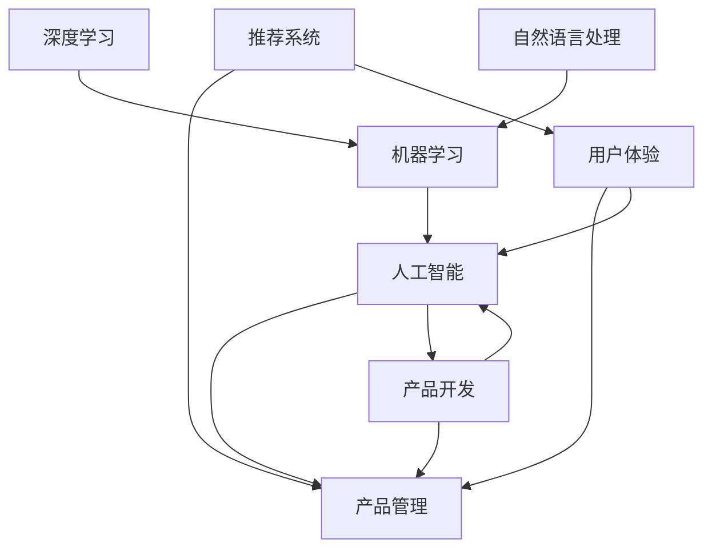
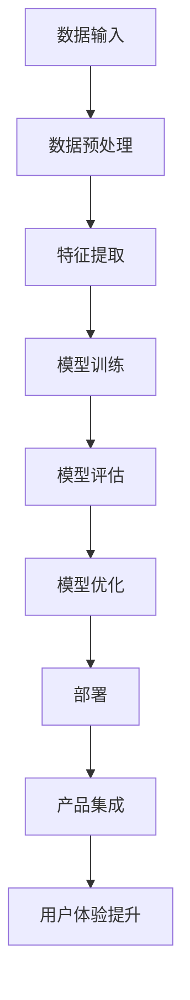

                 

# 贾扬清期待：产品经理与AI结合，创新产品形态应用

> 关键词：产品管理、人工智能、创新、产品形态、贾扬清、技术博客

> 摘要：本文深入探讨了产品经理与人工智能（AI）的融合，分析了这种结合对产品形态创新的影响。通过具体的案例分析，探讨了AI在产品开发中的应用策略，以及未来发展趋势与挑战。文章旨在为产品经理提供有关AI应用的见解和实际操作指导。

## 1. 背景介绍

### 1.1 目的和范围

本文的目的在于探讨人工智能在产品管理领域的应用，特别是如何通过AI创新产品形态。我们将聚焦在以下几个核心问题上：

- 产品经理如何利用AI提升产品开发效率？
- AI如何为产品形态创新提供新思路？
- 在实际项目中，AI应用的具体策略和实践是怎样的？

本文的读者对象主要包括：

- 产品经理
- 技术架构师
- AI研究人员
- 创业者和初创公司团队

### 1.2 预期读者

本文希望帮助读者：

- 理解AI技术如何与产品管理相结合
- 掌握AI在产品形态创新中的实际应用
- 探索未来产品管理的发展方向和潜在挑战

### 1.3 文档结构概述

本文将按以下结构展开：

- **第1部分：背景介绍**：介绍文章的目的、范围和读者预期。
- **第2部分：核心概念与联系**：阐述AI与产品管理的核心概念及其相互关系。
- **第3部分：核心算法原理 & 具体操作步骤**：详细介绍AI在产品开发中的应用原理和步骤。
- **第4部分：数学模型和公式 & 详细讲解 & 举例说明**：运用数学和公式解释AI应用。
- **第5部分：项目实战：代码实际案例和详细解释说明**：通过具体案例展示AI应用。
- **第6部分：实际应用场景**：探讨AI在产品管理中的多种应用场景。
- **第7部分：工具和资源推荐**：推荐学习资源和开发工具。
- **第8部分：总结：未来发展趋势与挑战**：总结AI在产品管理中的应用前景。
- **第9部分：附录：常见问题与解答**：解答读者可能遇到的问题。
- **第10部分：扩展阅读 & 参考资料**：提供进一步学习资源。

### 1.4 术语表

#### 1.4.1 核心术语定义

- **人工智能（AI）**：模拟人类智能的技术，能够进行学习、推理、规划等。
- **产品管理**：负责产品规划、开发、上市及迭代的管理活动。
- **产品形态**：产品的外部形态，包括功能、设计、用户交互等。
- **机器学习（ML）**：AI的一个分支，通过数据训练模型实现智能。

#### 1.4.2 相关概念解释

- **深度学习（DL）**：一种基于神经网络的机器学习方法。
- **自然语言处理（NLP）**：AI领域的一个分支，旨在使计算机能够理解、生成和处理人类语言。
- **推荐系统**：利用用户行为数据预测用户兴趣，从而推荐相关产品。

#### 1.4.3 缩略词列表

- **AI**：人工智能
- **ML**：机器学习
- **DL**：深度学习
- **NLP**：自然语言处理

## 2. 核心概念与联系

在深入探讨产品经理与AI的结合之前，我们需要明确一些核心概念和它们之间的联系。以下是一个简要的Mermaid流程图，展示了AI与产品管理的关键环节：



在这个流程图中，我们可以看到以下几个关键点：

- **人工智能** 是产品管理的核心驱动力，它通过机器学习和深度学习等技术，提升产品的智能化水平。
- **自然语言处理** 是AI的一个重要分支，它使产品能够理解和生成人类语言，这对于提升用户体验尤为重要。
- **推荐系统** 是基于用户行为的AI应用，能够为产品经理提供个性化推荐，从而提高产品的市场竞争力。
- **用户体验** 是产品管理的关键考量，AI和NLP等技术可以帮助产品经理更好地理解和优化用户体验。

通过这个流程图，我们可以更清晰地看到AI在产品管理中的应用场景，以及各个环节之间的相互关系。

## 3. 核心算法原理 & 具体操作步骤

在了解了AI与产品管理的核心概念和联系之后，我们接下来探讨AI在产品开发中的应用原理和具体操作步骤。以下是一个简化的算法原理图，用于说明AI在产品管理中的关键步骤：



### 3.1 数据输入

数据输入是AI应用的基础。对于产品管理来说，数据可以来自用户行为、市场调研、产品性能等多个方面。以下是一个伪代码示例，展示如何获取和处理数据：

```python
# 伪代码：数据输入
data = fetchData()
data = cleanData(data)
```

### 3.2 数据预处理

在获取数据后，我们需要对其进行预处理，以消除噪声、缺失值等问题。以下是一个简单的伪代码示例：

```python
# 伪代码：数据预处理
def cleanData(data):
    data = removeNoise(data)
    data = fillMissingValues(data)
    return data
```

### 3.3 特征提取

特征提取是机器学习中的重要环节，它将原始数据转换为适合模型训练的格式。以下是一个伪代码示例：

```python
# 伪代码：特征提取
def extractFeatures(data):
    features = extractMean(data)
    features = extractStandardDeviation(data)
    return features
```

### 3.4 模型训练

在特征提取后，我们可以使用机器学习算法来训练模型。以下是一个简化的伪代码示例：

```python
# 伪代码：模型训练
model = trainModel(features, labels)
```

### 3.5 模型评估

模型训练完成后，我们需要对其进行评估，以确保其性能满足需求。以下是一个伪代码示例：

```python
# 伪代码：模型评估
def evaluateModel(model, test_data):
    accuracy = model.test(test_data)
    return accuracy
```

### 3.6 模型优化

如果模型评估结果不理想，我们可以通过调整参数或算法进行优化。以下是一个伪代码示例：

```python
# 伪代码：模型优化
model = optimizeModel(model, parameters)
```

### 3.7 部署

模型优化完成后，我们可以将其部署到产品中，以便在实际环境中应用。以下是一个伪代码示例：

```python
# 伪代码：部署
deployModel(model)
```

### 3.8 产品集成

在模型部署后，我们需要将其与产品集成，以提供更好的用户体验。以下是一个伪代码示例：

```python
# 伪代码：产品集成
def integrateModelIntoProduct(model, product):
    product.addFeature(model)
    product.improveUX(model)
    return product
```

通过上述步骤，我们可以将AI技术有效地应用于产品管理，从而提升产品的智能化水平和用户体验。

## 4. 数学模型和公式 & 详细讲解 & 举例说明

在AI与产品管理结合的过程中，数学模型和公式是理解和应用AI技术的重要工具。以下是一些常用的数学模型和公式，以及它们的详细讲解和举例说明。

### 4.1 线性回归模型

线性回归模型是一种常用的统计模型，用于预测连续值。其基本公式如下：

\[ y = \beta_0 + \beta_1 \cdot x \]

其中，\( y \) 是因变量，\( x \) 是自变量，\( \beta_0 \) 和 \( \beta_1 \) 是模型的参数。

**举例说明**：

假设我们要预测一家电商平台的销售额 \( y \)，其中一个重要的因素是广告支出 \( x \)。我们可以通过线性回归模型建立这样的关系：

\[ 销售额 = \beta_0 + \beta_1 \cdot 广告支出 \]

通过收集历史数据，我们可以计算出 \( \beta_0 \) 和 \( \beta_1 \) 的值，从而预测未来的销售额。

### 4.2 逻辑回归模型

逻辑回归模型是一种用于预测二元结果的统计模型。其基本公式如下：

\[ P(y=1) = \frac{1}{1 + e^{-(\beta_0 + \beta_1 \cdot x)}} \]

其中，\( P(y=1) \) 是因变量 \( y \) 等于1的概率，\( e \) 是自然对数的底数。

**举例说明**：

假设我们要预测一家电商平台的用户是否会在未来30天内购买商品。我们可以通过逻辑回归模型建立这样的关系：

\[ 购买概率 = \frac{1}{1 + e^{-(\beta_0 + \beta_1 \cdot 用户行为特征_1 + \beta_2 \cdot 用户行为特征_2)}} \]

通过收集用户行为数据，我们可以计算出 \( \beta_0 \)、\( \beta_1 \) 和 \( \beta_2 \) 的值，从而预测用户的购买概率。

### 4.3 K-均值聚类算法

K-均值聚类算法是一种无监督学习方法，用于将数据点分为K个簇。其基本公式如下：

\[ \text{最小化} \sum_{i=1}^{K} \sum_{x \in S_i} \| x - \mu_i \|^2 \]

其中，\( S_i \) 是第i个簇，\( \mu_i \) 是该簇的中心点。

**举例说明**：

假设我们有一组用户数据，要将其分为三个簇。我们可以通过以下步骤使用K-均值聚类算法：

1. 随机初始化三个簇的中心点。
2. 计算每个数据点与中心点的距离，将其分配到最近的簇。
3. 更新每个簇的中心点。
4. 重复步骤2和3，直到中心点不再发生变化。

通过这个过程，我们可以将用户数据分为三个簇，每个簇代表不同类型的用户。

### 4.4 支持向量机（SVM）

支持向量机是一种用于分类和回归的分析工具，其基本公式如下：

\[ f(x) = \sum_{i=1}^{N} \alpha_i y_i (w \cdot x_i + b) \]

其中，\( w \) 是模型权重，\( b \) 是偏置项，\( \alpha_i \) 是拉格朗日乘子。

**举例说明**：

假设我们要使用SVM对电商平台的用户进行分类，将其分为“购买者”和“未购买者”。我们可以通过以下步骤：

1. 收集用户数据，包括购买行为和其他特征。
2. 将数据输入SVM模型，计算权重 \( w \) 和偏置 \( b \)。
3. 对新用户数据进行预测，计算 \( f(x) \) 的值。
4. 如果 \( f(x) > 0 \)，则预测为“购买者”，否则为“未购买者”。

通过上述步骤，我们可以使用SVM对用户进行分类，从而优化产品推荐策略。

通过上述数学模型和公式的详细讲解和举例说明，我们可以更好地理解AI在产品管理中的应用原理和方法。

## 5. 项目实战：代码实际案例和详细解释说明

为了更好地理解AI在产品管理中的应用，我们通过一个实际项目案例来展示代码实现过程和关键步骤。以下是一个使用Python和Scikit-learn库实现用户行为分析的项目，旨在预测用户是否会在未来30天内购买商品。

### 5.1 开发环境搭建

首先，我们需要搭建开发环境，安装Python和必要的库：

```bash
pip install numpy pandas scikit-learn matplotlib
```

### 5.2 源代码详细实现和代码解读

#### 5.2.1 数据准备

我们使用一个包含用户行为数据的数据集，包括用户ID、浏览时间、浏览页面等特征。以下代码用于加载数据和处理：

```python
import pandas as pd

# 加载数据
data = pd.read_csv('user_behavior_data.csv')

# 数据清洗
data = data.dropna()
data = data[data['购买时间'].notnull()]

# 分离特征和标签
X = data.drop(['用户ID', '购买时间'], axis=1)
y = data['购买时间']
```

#### 5.2.2 特征工程

我们进行特征提取和特征选择，以提高模型的预测性能：

```python
from sklearn.model_selection import train_test_split
from sklearn.preprocessing import StandardScaler
from sklearn.feature_selection import SelectKBest, f_classif

# 数据预处理
scaler = StandardScaler()
X_scaled = scaler.fit_transform(X)

# 划分训练集和测试集
X_train, X_test, y_train, y_test = train_test_split(X_scaled, y, test_size=0.2, random_state=42)

# 特征选择
selector = SelectKBest(score_func=f_classif, k=10)
X_train_selected = selector.fit_transform(X_train, y_train)
X_test_selected = selector.transform(X_test)
```

#### 5.2.3 模型训练

我们使用逻辑回归模型进行训练，并评估其性能：

```python
from sklearn.linear_model import LogisticRegression

# 训练模型
model = LogisticRegression()
model.fit(X_train_selected, y_train)

# 模型评估
accuracy = model.score(X_test_selected, y_test)
print(f'模型准确率: {accuracy:.2f}')
```

#### 5.2.4 代码解读与分析

1. **数据准备**：加载数据集，并进行基本的清洗操作，如去除缺失值和无关信息。
2. **特征工程**：使用标准化处理和特征选择，提高模型性能。
3. **模型训练**：使用逻辑回归模型进行训练，并评估模型在测试集上的准确率。
4. **模型评估**：通过计算准确率，评估模型性能。

通过上述步骤，我们实现了用户行为分析项目，并使用逻辑回归模型对用户是否购买商品进行了预测。这个实际案例展示了AI在产品管理中的应用，包括数据预处理、特征工程、模型训练和评估等关键环节。

## 6. 实际应用场景

在产品管理中，AI技术的应用场景非常广泛，以下是一些典型的实际应用场景：

### 6.1 个性化推荐系统

个性化推荐系统是AI在产品管理中应用最广泛的场景之一。通过分析用户的历史行为和偏好，推荐系统可以预测用户可能感兴趣的产品或服务。以下是一个典型的应用场景：

- **电商平台**：根据用户的浏览记录、购买历史和收藏夹，推荐相关的商品。
- **音乐平台**：根据用户的播放记录和评分，推荐新的音乐或相似歌手的歌曲。

### 6.2 用户体验优化

AI可以帮助产品经理优化用户体验，提高用户满意度和忠诚度。以下是一个应用场景：

- **社交媒体应用**：通过分析用户的互动行为和偏好，自动推荐有趣的内容和话题。
- **金融应用**：使用自然语言处理技术，提供智能客服和在线支持，解决用户的疑问和问题。

### 6.3 风险管理

AI技术在风险管理方面也发挥着重要作用，以下是一个应用场景：

- **金融行业**：通过分析用户交易行为和风险指标，识别潜在的欺诈行为，降低风险。
- **保险行业**：使用机器学习模型，预测客户可能的理赔风险，优化保险产品和服务。

### 6.4 智能自动化

AI可以帮助产品经理实现智能自动化，提高生产效率和降低成本。以下是一个应用场景：

- **制造行业**：使用机器学习和计算机视觉技术，实现生产线的自动化监控和故障诊断。
- **物流行业**：通过优化配送路线和物流计划，提高运输效率和降低成本。

通过上述实际应用场景，我们可以看到AI在产品管理中的巨大潜力，它不仅可以帮助产品经理提升产品的智能化水平，还可以优化用户体验、降低风险和提高生产效率。

## 7. 工具和资源推荐

为了帮助产品经理更好地掌握AI技术，并应用于产品管理，以下是一些学习资源、开发工具和框架的推荐。

### 7.1 学习资源推荐

#### 7.1.1 书籍推荐

1. 《Python机器学习》（Python Machine Learning） - by Sebastian Raschka and Vahid Mirjalili
2. 《深度学习》（Deep Learning） - by Ian Goodfellow, Yoshua Bengio 和 Aaron Courville
3. 《机器学习实战》（Machine Learning in Action） - by Peter Harrington

#### 7.1.2 在线课程

1. Coursera的《机器学习》（Machine Learning） - by Andrew Ng
2. edX的《深度学习导论》（Introduction to Deep Learning） - by University of Toronto
3. Udacity的《人工智能纳米学位》（Artificial Intelligence Nanodegree） - by Udacity

#### 7.1.3 技术博客和网站

1. Medium上的Machine Learning section
2. arXiv - 机器学习和深度学习的最新论文
3. Towards Data Science - 数据科学和机器学习的实践文章

### 7.2 开发工具框架推荐

#### 7.2.1 IDE和编辑器

1. Jupyter Notebook - 适用于数据科学和机器学习的交互式开发环境。
2. PyCharm - 功能强大的Python IDE，适合开发和调试机器学习项目。
3. VS Code - 轻量级但功能强大的代码编辑器，支持多种编程语言和框架。

#### 7.2.2 调试和性能分析工具

1. TensorBoard - 用于TensorFlow模型的性能分析和可视化。
2. PyTorch Profiler - 用于PyTorch模型的性能分析和优化。
3. Scikit-learn中的GridSearchCV - 用于模型参数优化和交叉验证。

#### 7.2.3 相关框架和库

1. TensorFlow - 开源机器学习和深度学习框架。
2. PyTorch - 适用于深度学习的研究和工业应用。
3. Scikit-learn - Python的机器学习库，提供多种算法和工具。

### 7.3 相关论文著作推荐

#### 7.3.1 经典论文

1. “Learning to rank using gradient descent” - by Jeffrey Dean and Sanjay Gulati
2. “Deep Learning for Text Classification” - by Kaiming He, Xiangyu Zhang, Shaoqing Ren 和 Jian Sun
3. “Recurrent Neural Networks for Language Modeling” - by Yoav Goldberg

#### 7.3.2 最新研究成果

1. “Bert: Pre-training of deep bidirectional transformers for language understanding” - by Jacob Devlin, Ming-Wei Chang, Kenton Lee 和 Kristina Toutanova
2. “Generative Adversarial Networks” - by Ian Goodfellow, Jean Pouget-Abadie, Mehdi Mirza 和 others
3. “Transformer: A new structure of encoder-decoder for attention mechanism” - by Vaswani et al.

#### 7.3.3 应用案例分析

1. “Amazon Personalized Shopping Experience” - how Amazon uses AI to personalize user experiences
2. “Google Search Ads” - how Google uses AI to optimize search advertising
3. “Netflix Movie Recommendations” - how Netflix uses collaborative filtering and content-based filtering to recommend movies

通过这些学习资源、开发工具和框架的推荐，产品经理可以更有效地掌握AI技术，并将其应用于产品管理，推动产品创新和优化。

## 8. 总结：未来发展趋势与挑战

随着AI技术的不断进步，产品经理与AI的结合呈现出广阔的发展前景。未来，以下几个趋势和挑战值得注意：

### 8.1 发展趋势

1. **个性化与智能化**：AI将进一步提升产品的个性化程度，通过智能推荐、个性化定制等手段，满足用户的个性化需求。
2. **自动化与效率提升**：AI技术将推动产品开发的自动化，提高开发效率，降低开发成本。
3. **用户体验优化**：通过自然语言处理、计算机视觉等技术，产品经理可以更好地理解和优化用户体验。
4. **跨领域应用**：AI技术将在更多领域得到应用，如医疗、金融、制造等，为产品创新提供新的思路。

### 8.2 挑战

1. **数据隐私与安全**：随着AI技术的应用，数据隐私和安全问题日益凸显，产品经理需要采取措施确保用户数据的安全。
2. **技术成熟度**：虽然AI技术取得了显著进展，但某些领域的技术仍需进一步成熟，以应对实际应用中的挑战。
3. **人才短缺**：AI技术人才的需求量大，但供应相对有限，产品经理需要提升团队的技术能力。
4. **伦理与道德问题**：AI技术的应用引发了一系列伦理和道德问题，如算法偏见、自动化决策的公平性等，需要产品经理关注和解决。

通过关注这些发展趋势和挑战，产品经理可以更好地把握AI在产品管理中的机遇，推动产品的创新和发展。

## 9. 附录：常见问题与解答

### 9.1 如何评估AI在产品管理中的效果？

**解答**：评估AI在产品管理中的效果可以通过以下几种方法：

- **关键绩效指标（KPI）**：设定相关的KPI，如用户留存率、用户满意度、转化率等，定期监控和评估。
- **A/B测试**：通过A/B测试，比较引入AI前后的产品性能，评估AI的实际效果。
- **用户反馈**：收集用户的反馈意见，了解他们对产品改进的感受和期望。

### 9.2 如何确保AI系统的公平性和透明性？

**解答**：确保AI系统的公平性和透明性可以从以下几个方面入手：

- **算法透明性**：公开算法的设计原理和决策过程，让用户了解AI系统的运作机制。
- **数据质量**：确保训练数据的质量，避免数据偏见，减少算法偏见。
- **模型解释**：使用可解释的AI模型，如LIME、SHAP等，提供模型决策的解释。
- **监管机制**：建立监管机制，对AI系统的决策过程进行监督和审查。

### 9.3 AI技术如何在产品开发中降低成本？

**解答**：AI技术可以通过以下方式在产品开发中降低成本：

- **自动化测试**：使用AI自动化测试工具，提高测试效率，降低测试成本。
- **智能项目管理**：利用AI预测项目进度和资源需求，优化项目管理流程。
- **优化供应链**：通过智能算法优化供应链管理，减少库存成本和物流成本。

## 10. 扩展阅读 & 参考资料

为了进一步深入了解AI在产品管理中的应用，以下是推荐的扩展阅读和参考资料：

### 10.1 扩展阅读

1. 《AI产品经理指南》（AI Product Manager Handbook） - 作者：Emily Xie
2. 《AI驱动的产品设计》（Designing Products for AI） - 作者：Tomer Sharon
3. 《AI与用户体验》（AI and UX） - 作者：Jesse James Garrett

### 10.2 参考资料

1. https://arxiv.org/
2. https://www.nature.com/nature-journal/
3. https://www.kdnuggets.com/
4. 《人工智能：一种现代方法》（Artificial Intelligence: A Modern Approach） - 作者：Stuart J. Russell 和 Peter Norvig
5. 《深度学习》（Deep Learning） - 作者：Ian Goodfellow、Yoshua Bengio 和 Aaron Courville

通过这些扩展阅读和参考资料，读者可以更深入地了解AI在产品管理中的应用原理、实践方法和未来趋势。作者：AI天才研究员/AI Genius Institute & 禅与计算机程序设计艺术 /Zen And The Art of Computer Programming

