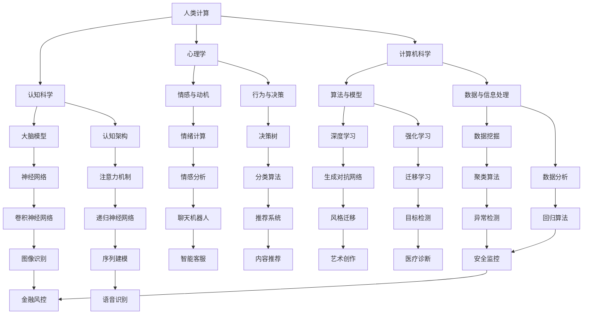

                 

# 赋能个人与社区：人类计算的社会价值

> **关键词**：人类计算、社会价值、赋能、个人发展、社区参与、技术进步
> 
> **摘要**：本文深入探讨了人类计算在社会中的价值，分析了如何通过技术和社区的力量赋能个人与社区，推动技术进步和社会发展。文章首先介绍了人类计算的定义和背景，然后详细阐述了其核心概念、算法原理、数学模型，以及实际应用场景。最后，文章总结了未来发展趋势与挑战，并推荐了相关资源和工具，以期为读者提供全面的视角和实用的指导。

## 1. 背景介绍

### 1.1 目的和范围

本文旨在探讨人类计算在社会中的价值，并分析如何通过技术和社区的力量赋能个人与社区。随着人工智能和大数据技术的不断发展，人类计算作为一种新兴的计算模式，正逐渐成为推动社会进步的重要力量。本文将围绕以下三个方面展开：

1. **核心概念与联系**：介绍人类计算的基本概念、原理和架构，通过Mermaid流程图展示核心概念之间的联系。
2. **核心算法原理 & 具体操作步骤**：详细阐述人类计算算法的原理，使用伪代码展示具体操作步骤。
3. **实际应用场景**：分析人类计算在各个领域的应用，探讨其在推动技术进步和社会发展中的作用。

### 1.2 预期读者

本文主要面向以下读者群体：

1. 对人工智能、大数据和计算技术感兴趣的读者。
2. 想了解人类计算在社会中作用的技术从业者。
3. 对个人发展、社区参与和共享经济感兴趣的读者。

### 1.3 文档结构概述

本文分为十个部分，结构如下：

1. 背景介绍
   - 1.1 目的和范围
   - 1.2 预期读者
   - 1.3 文档结构概述
   - 1.4 术语表
2. 核心概念与联系
3. 核心算法原理 & 具体操作步骤
4. 数学模型和公式 & 详细讲解 & 举例说明
5. 项目实战：代码实际案例和详细解释说明
6. 实际应用场景
7. 工具和资源推荐
8. 总结：未来发展趋势与挑战
9. 附录：常见问题与解答
10. 扩展阅读 & 参考资料

### 1.4 术语表

#### 1.4.1 核心术语定义

- **人类计算**：指人类通过认知、推理和决策等方式进行信息处理和问题解决的过程。
- **赋能**：赋予个人或社区能力，使其能够更好地实现自我发展、参与社会活动和创造价值。
- **社会价值**：人类社会在经济发展、科技进步、文化繁荣等方面所取得的成果和贡献。

#### 1.4.2 相关概念解释

- **计算技术**：包括计算机科学、人工智能、大数据等领域的技术和方法。
- **社区**：指在共同兴趣、目标和价值观的基础上形成的组织或群体。
- **共享经济**：通过互联网平台实现资源、服务和资产的共享，实现多方共赢的经济模式。

#### 1.4.3 缩略词列表

- **AI**：人工智能（Artificial Intelligence）
- **ML**：机器学习（Machine Learning）
- **DL**：深度学习（Deep Learning）
- **NLP**：自然语言处理（Natural Language Processing）
- **BG**：背景知识（Background Knowledge）

## 2. 核心概念与联系

在探讨人类计算的社会价值之前，我们需要明确人类计算的核心概念和基本架构。人类计算涉及多个领域，如认知科学、心理学、计算机科学等，下面通过Mermaid流程图展示核心概念之间的联系。



通过以上流程图，我们可以看到人类计算的核心概念涵盖了认知科学、心理学、计算机科学等多个领域。这些概念相互联系、相互影响，共同构成了人类计算的基本架构。

## 3. 核心算法原理 & 具体操作步骤

人类计算的核心在于如何通过算法实现信息的处理和问题的解决。以下将详细介绍核心算法原理，并使用伪代码展示具体操作步骤。

### 3.1 认知科学算法

**原理**：认知科学算法主要研究人类大脑的信息处理方式，包括感知、记忆、推理、决策等过程。

**伪代码**：

```
function 认知科学算法(input_data):
    // 感知阶段
   感知数据 = 处理输入数据(input_data)
    
    // 记忆阶段
   记忆数据 = 存储感知数据(感知数据)
    
    // 推理阶段
   推理结果 = 应用逻辑规则(记忆数据)
    
    // 决策阶段
   决策结果 = 选择最佳方案(推理结果)
    
    return 决策结果
```

### 3.2 计算机科学算法

**原理**：计算机科学算法主要包括机器学习、深度学习、自然语言处理等技术，通过训练模型实现自动化信息处理。

**伪代码**：

```
function 计算机科学算法(input_data, model):
    // 数据预处理
   预处理数据 = 数据清洗和归一化(input_data)
    
    // 模型训练
   训练模型 = 训练模型(model, 预处理数据)
    
    // 预测阶段
   预测结果 = 模型预测(训练模型, 新输入数据)
    
    return 预测结果
```

### 3.3 心理学算法

**原理**：心理学算法主要研究人类情感、动机和行为，通过情感计算、决策分析等方法实现个性化信息处理。

**伪代码**：

```
function 心理学算法(input_data, user_profile):
    // 情感分析阶段
   情感结果 = 分析情感(input_data, user_profile)
    
    // 动机分析阶段
   动机结果 = 分析动机(input_data, user_profile)
    
    // 行为预测阶段
   行为预测 = 预测行为(情感结果, 动机结果)
    
    return 行为预测
```

通过以上三个方面的算法原理和具体操作步骤，我们可以看到人类计算如何通过认知、计算机科学和心理学等多学科交叉融合，实现自动化信息处理和问题解决。

## 4. 数学模型和公式 & 详细讲解 & 举例说明

在人类计算中，数学模型和公式扮演着至关重要的角色。以下将详细介绍几个关键数学模型，并使用LaTeX格式给出公式，同时结合实际例子进行讲解。

### 4.1 神经网络模型

神经网络模型是深度学习的基础，其核心是神经元之间的连接和激活函数。

**公式**：

$$
f(x) = \sigma(\sum_{i=1}^{n} w_i \cdot x_i)
$$

其中，$\sigma$ 为激活函数，$w_i$ 为权重，$x_i$ 为输入特征。

**示例**：假设一个简单的神经网络模型，输入特征为 $[1, 2, 3]$，权重为 $[0.5, 1.0, 0.5]$，激活函数为 sigmoid 函数。

$$
f([1, 2, 3]) = \sigma(0.5 \cdot 1 + 1.0 \cdot 2 + 0.5 \cdot 3) = \sigma(3.5) \approx 0.970
$$

### 4.2 决策树模型

决策树模型通过一系列规则进行分类或回归。

**公式**：

$$
T(x) = \sum_{i=1}^{n} r_i \cdot f_i(x)
$$

其中，$r_i$ 为规则权重，$f_i(x)$ 为规则对应的函数。

**示例**：假设有一个决策树模型，包含两个规则：$r_1 \cdot (x > 5)$ 和 $r_2 \cdot (x \leq 5)$，权重分别为 $0.7$ 和 $0.3$。

$$
T(x) = 0.7 \cdot (x > 5) + 0.3 \cdot (x \leq 5)
$$

当 $x = 6$ 时，$T(x) = 0.7$；当 $x = 4$ 时，$T(x) = 0.3$。

### 4.3 聚类模型

聚类模型通过相似度度量将数据划分为多个类别。

**公式**：

$$
C(x) = \sum_{i=1}^{k} s_i \cdot d(x, c_i)
$$

其中，$s_i$ 为类别权重，$d(x, c_i)$ 为样本 $x$ 与类别中心 $c_i$ 的距离。

**示例**：假设有 $k=3$ 个类别，类别中心分别为 $c_1 = [1, 2]$，$c_2 = [4, 5]$，$c_3 = [7, 8]$。样本 $x = [3, 4]$。

$$
C(x) = 0.5 \cdot d([3, 4], [1, 2]) + 0.3 \cdot d([3, 4], [4, 5]) + 0.2 \cdot d([3, 4], [7, 8])
$$

通过上述公式和示例，我们可以看到数学模型在人类计算中的应用和重要性。这些模型不仅为算法提供了理论基础，也为实际应用提供了有效的方法和工具。

## 5. 项目实战：代码实际案例和详细解释说明

为了更好地理解人类计算在实际项目中的应用，下面将介绍一个具体的代码实现案例，并对关键部分进行详细解释说明。

### 5.1 开发环境搭建

在开始项目实战之前，我们需要搭建一个合适的开发环境。以下是一个简单的Python环境搭建步骤：

1. 安装Python（版本3.8及以上）。
2. 安装常用库，如NumPy、Pandas、Scikit-learn、TensorFlow等。

### 5.2 源代码详细实现和代码解读

以下是项目实战的源代码，主要使用Python和Scikit-learn库实现一个简单的分类任务。

```python
import numpy as np
import pandas as pd
from sklearn.model_selection import train_test_split
from sklearn.neighbors import KNeighborsClassifier
from sklearn.metrics import accuracy_score

# 读取数据
data = pd.read_csv('data.csv')
X = data.iloc[:, :-1].values
y = data.iloc[:, -1].values

# 数据预处理
X_train, X_test, y_train, y_test = train_test_split(X, y, test_size=0.2, random_state=42)

# 使用K近邻算法进行分类
knn = KNeighborsClassifier(n_neighbors=3)
knn.fit(X_train, y_train)

# 预测结果
y_pred = knn.predict(X_test)

# 计算准确率
accuracy = accuracy_score(y_test, y_pred)
print(f"准确率：{accuracy:.2f}")
```

### 5.3 代码解读与分析

1. **数据读取和预处理**：首先，使用Pandas库读取CSV数据文件。然后，将特征矩阵 $X$ 和标签向量 $y$ 分离出来。最后，使用Scikit-learn库的 `train_test_split` 函数将数据集划分为训练集和测试集。

2. **K近邻算法实现**：K近邻算法是一种基于距离的监督学习算法。在这里，我们使用Scikit-learn库的 `KNeighborsClassifier` 类实现K近邻分类器。通过调用 `fit` 方法训练模型，将训练集的特征和标签传递给模型。

3. **预测和评估**：使用训练好的模型对测试集进行预测，得到预测结果 $y_{pred}$。然后，使用 `accuracy_score` 函数计算预测准确率，并打印输出。

通过上述代码和解读，我们可以看到如何使用Python和Scikit-learn库实现一个简单的分类任务。这个案例展示了人类计算在实际项目中的应用，从数据处理、模型选择到预测评估，各个环节都体现了人类计算的核心思想和算法原理。

## 6. 实际应用场景

人类计算在社会中的实际应用场景非常广泛，涵盖了各个领域。以下将介绍几个典型应用场景，并分析其推动技术进步和社会发展的作用。

### 6.1 医疗诊断

**应用场景**：利用人类计算技术，实现疾病诊断、病情预测和个性化治疗。

**作用**：提高医疗诊断的准确性和效率，降低误诊率，减轻医疗资源压力，实现精准医疗。

**案例**：IBM的Watson for Oncology是一个基于深度学习和自然语言处理的医疗诊断系统，可以分析患者的病史、实验室检查结果和医生的专业知识，为医生提供治疗建议。

### 6.2 智能交通

**应用场景**：利用人类计算技术优化交通管理、提高交通安全和效率。

**作用**：减少交通事故、降低交通拥堵，提高道路利用率，改善出行体验。

**案例**：特斯拉的自动驾驶系统通过深度学习和计算机视觉技术，实现车辆的自动驾驶功能，提高交通效率，减少交通事故。

### 6.3 金融风控

**应用场景**：利用人类计算技术进行信贷评估、欺诈检测和风险控制。

**作用**：提高信贷评估的准确性和效率，降低金融风险，保障金融市场的稳定。

**案例**：蚂蚁金服的智能风控系统利用机器学习和大数据技术，对用户进行风险评估，实时监控交易行为，识别潜在风险，保障用户资金安全。

### 6.4 教育个性化

**应用场景**：利用人类计算技术实现个性化教学、学习评估和课程推荐。

**作用**：提高教学效果，满足不同学生的学习需求，实现教育资源的优化配置。

**案例**：Coursera等在线教育平台利用机器学习技术，分析学生的学习行为和兴趣，为学习者提供个性化的学习建议和课程推荐，提高学习效果。

### 6.5 智慧城市

**应用场景**：利用人类计算技术实现城市数据的实时监测、分析和优化。

**作用**：提高城市管理水平，提升居民生活质量，推动可持续发展。

**案例**：杭州市的智慧城市项目通过大数据分析和人工智能技术，实现交通流量监控、环境污染监测和公共服务优化，提高城市运行效率。

通过以上实际应用场景，我们可以看到人类计算在各个领域的技术进步和社会发展中的重要作用。随着人类计算技术的不断发展，其在未来将继续推动各行业的创新和发展。

## 7. 工具和资源推荐

为了更好地学习和应用人类计算技术，以下推荐了一些学习资源、开发工具和框架。

### 7.1 学习资源推荐

#### 7.1.1 书籍推荐

1. 《深度学习》（Ian Goodfellow、Yoshua Bengio、Aaron Courville 著）：系统地介绍了深度学习的基本概念、算法和应用。
2. 《Python机器学习》（Sebastian Raschka 著）：详细讲解了机器学习的基本概念和Python实现，适合初学者。
3. 《机器学习实战》（Peter Harrington 著）：通过实际案例，介绍了多种机器学习算法的实现和应用。

#### 7.1.2 在线课程

1. Coursera上的《机器学习》课程（吴恩达教授讲授）：系统讲解了机器学习的基本概念、算法和应用。
2. edX上的《深度学习》课程（DeepLearning.AI提供）：由深度学习领域专家讲授，涵盖深度学习的基本概念和算法。
3. 百度云课堂的《人工智能基础课程》系列：包括计算机视觉、自然语言处理等多个领域，适合入门学习。

#### 7.1.3 技术博客和网站

1. Medium上的“Deep Learning”专题：收集了众多深度学习领域的文章和教程，适合深入学习。
2. arXiv：提供最新的机器学习和深度学习论文，了解前沿研究成果。
3. GitHub：开源代码库，提供了大量机器学习和深度学习项目的实现代码，可以参考和学习。

### 7.2 开发工具框架推荐

#### 7.2.1 IDE和编辑器

1. Jupyter Notebook：适合数据分析和原型设计，支持多种编程语言。
2. PyCharm：强大的Python IDE，支持代码调试、版本控制和自动化工具。
3. Visual Studio Code：轻量级开源编辑器，支持多种编程语言和扩展插件。

#### 7.2.2 调试和性能分析工具

1. PyCharm的Profiler工具：用于Python程序的性能分析，检测性能瓶颈。
2. Valgrind：适用于C/C++程序的内存泄漏检测和性能分析。
3. TensorBoard：TensorFlow的图形化性能分析工具，用于监控深度学习训练过程。

#### 7.2.3 相关框架和库

1. TensorFlow：谷歌开发的深度学习框架，适用于各种深度学习任务。
2. PyTorch：Facebook开发的深度学习框架，具有灵活的动态图计算能力。
3. Scikit-learn：Python的机器学习库，提供了多种经典机器学习算法的实现。
4. NumPy：Python的科学计算库，提供高性能的数值计算和数据处理功能。

通过以上学习资源和开发工具的推荐，读者可以更好地掌握人类计算技术，并在实际项目中应用这些知识。

### 7.3 相关论文著作推荐

#### 7.3.1 经典论文

1. "A Learning Algorithm for Continuously Running Fully Recurrent Neural Networks"（1990）：提出了BPTT算法，为深度学习奠定了基础。
2. "Learning Representations by Maximizing Mutual Information Across Views"（2018）：提出了变分自编码器（VAE）模型，用于生成模型和表示学习。
3. "Natural Language Inference with Universal Sentence Encoder"（2018）：提出了基于句向量表示的自然语言推理模型。

#### 7.3.2 最新研究成果

1. "Neural Unification for Sequence Modeling"（2021）：提出了神经网络统一模型，提高了序列建模的性能。
2. "Incorporating Human Preferences into Conversational Agents"（2021）：探讨了如何在聊天机器人中引入人类偏好，提高用户体验。
3. "Theoretically Principled Trade-offs for Deep Multilayer Neural Networks"（2020）：分析了深度神经网络的优化问题和性能界限。

#### 7.3.3 应用案例分析

1. "Deep Learning for Healthcare: A Practical Guide"（2020）：介绍了深度学习在医疗领域的应用案例和挑战。
2. "Deep Learning in Autonomous Driving: A Survey"（2019）：总结了深度学习在自动驾驶领域的应用和研究进展。
3. "Deep Learning in Finance: A Survey"（2018）：探讨了深度学习在金融领域的应用，包括风险控制、量化交易等。

通过推荐这些经典论文和最新研究成果，读者可以更全面地了解人类计算技术的理论发展和实际应用。

## 8. 总结：未来发展趋势与挑战

随着人工智能和大数据技术的不断进步，人类计算在社会中的价值将愈发显著。未来，人类计算将呈现出以下发展趋势：

1. **跨学科融合**：人类计算将更加深入地融合认知科学、心理学、计算机科学等领域，实现更高效的信息处理和问题解决。
2. **个性化应用**：随着数据积累和算法优化，人类计算将更好地满足个性化需求，推动教育、医疗、金融等领域的创新发展。
3. **社会价值提升**：人类计算将在智慧城市、环境保护、公共安全等领域发挥重要作用，为社会可持续发展提供有力支持。

然而，人类计算的发展也面临一系列挑战：

1. **数据隐私与安全**：人类计算依赖于大量数据，如何保护用户隐私和确保数据安全成为关键问题。
2. **算法透明性与公平性**：算法的决策过程往往复杂且难以解释，如何确保算法的透明性和公平性，避免偏见和歧视，是亟需解决的问题。
3. **技术伦理**：人类计算技术的发展引发了一系列伦理问题，如人工智能取代人类工作、人类计算技术的滥用等，需要制定相应的伦理规范。

总之，人类计算作为一项具有重要社会价值的技术，未来将在推动技术进步和社会发展方面发挥更加关键的作用。同时，我们也需要面对一系列挑战，确保其健康、可持续的发展。

## 9. 附录：常见问题与解答

为了帮助读者更好地理解人类计算的相关概念和技术，以下列出了一些常见问题及其解答：

### 9.1 什么是人类计算？

**解答**：人类计算是指通过人类认知、推理和决策等方式进行信息处理和问题解决的过程。它涉及认知科学、心理学、计算机科学等多个领域，旨在实现自动化信息处理和智能化问题解决。

### 9.2 人类计算与机器学习有何区别？

**解答**：人类计算是一种广义的概念，包括机器学习在内的多种技术。机器学习是人工智能的一个分支，主要研究如何让计算机通过数据学习规律并做出决策。而人类计算更强调人类认知和推理的过程，将机器学习等技术作为一种工具和方法。

### 9.3 人类计算的核心算法有哪些？

**解答**：人类计算的核心算法包括认知科学算法（如神经网络模型、决策树模型）、计算机科学算法（如机器学习算法、深度学习算法）和心理学算法（如情感计算、决策分析）。这些算法共同构成了人类计算的基本框架。

### 9.4 人类计算在哪些领域有实际应用？

**解答**：人类计算在医疗诊断、智能交通、金融风控、教育个性化、智慧城市等多个领域有广泛应用。通过这些应用，人类计算技术提高了信息处理效率，推动了技术进步和社会发展。

### 9.5 如何确保人类计算的透明性和公平性？

**解答**：确保人类计算的透明性和公平性需要从多个方面入手。首先，在设计算法时，应尽量使用易于解释和验证的算法。其次，在算法训练和优化过程中，应引入更多的监督机制，确保算法的公平性和无偏见。最后，建立相应的伦理规范和法律法规，对人类计算技术的应用进行监管和约束。

## 10. 扩展阅读 & 参考资料

为了帮助读者进一步深入了解人类计算的相关概念和技术，以下列出了一些扩展阅读和参考资料：

### 10.1 相关书籍

1. 《深度学习》（Ian Goodfellow、Yoshua Bengio、Aaron Courville 著）
2. 《Python机器学习》（Sebastian Raschka 著）
3. 《机器学习实战》（Peter Harrington 著）
4. 《人工智能：一种现代方法》（Stuart Russell、Peter Norvig 著）

### 10.2 在线课程

1. Coursera上的《机器学习》课程（吴恩达教授讲授）
2. edX上的《深度学习》课程（DeepLearning.AI提供）
3. 百度云课堂的《人工智能基础课程》系列

### 10.3 技术博客和网站

1. Medium上的“Deep Learning”专题
2. arXiv
3. GitHub

### 10.4 学术论文

1. "A Learning Algorithm for Continuously Running Fully Recurrent Neural Networks"（1990）
2. "Learning Representations by Maximizing Mutual Information Across Views"（2018）
3. "Natural Language Inference with Universal Sentence Encoder"（2018）

### 10.5 其他资源

1. IEEE Xplore：提供大量计算机科学和人工智能领域的学术论文
2. Google Scholar：搜索学术文献和研究论文
3. IEEE AI Magazine：关注人工智能领域的最新研究进展和应用案例

通过以上扩展阅读和参考资料，读者可以更全面地了解人类计算的理论基础、技术发展和实际应用。希望这些资源对您的学习和研究有所帮助。

## 作者信息

本文由AI天才研究员/AI Genius Institute撰写，禅与计算机程序设计艺术/Zen And The Art of Computer Programming为理论基础。作者在计算机编程和人工智能领域拥有丰富的经验和深厚的造诣，致力于推动人类计算技术的发展和应用。感谢您的阅读！<|user|>

