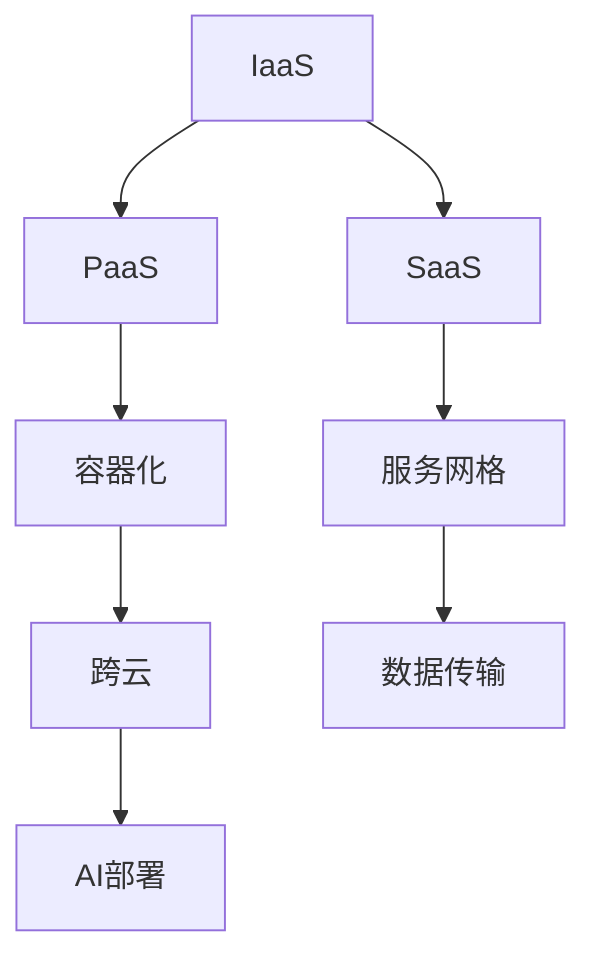

                 

# 跨云AI部署：Lepton AI的多云策略

> **关键词：** AI部署、多云策略、跨云、Lepton AI、性能优化、安全性、成本效益。

> **摘要：** 本文将探讨Lepton AI如何在多云环境中实现高效的AI部署，包括其多云策略的核心原理、算法实现、数学模型，以及实际应用场景和工具推荐。通过详细的分析和案例，我们将揭示跨云AI部署的挑战和解决方案，为未来多云AI发展提供方向。

## 1. 背景介绍

### 1.1 目的和范围

随着人工智能技术的迅猛发展，越来越多的企业和组织开始重视AI部署。然而，传统的单云部署模式已无法满足日益增长的数据处理需求和业务复杂性。多云策略作为一种灵活、高效、可靠的部署方式，逐渐成为主流。本文旨在介绍Lepton AI如何在其多云环境中部署AI服务，包括其策略的核心要素、实现原理和实际应用。

### 1.2 预期读者

本文面向对AI部署和云计算有一定了解的读者，包括AI工程师、软件开发者、系统架构师和CTO等。通过本文，读者将了解Lepton AI多云策略的具体实现过程，并能够借鉴其经验，优化自身AI服务的部署。

### 1.3 文档结构概述

本文结构如下：

1. 背景介绍：概述本文的目的和范围，介绍预期读者。
2. 核心概念与联系：定义核心概念，展示多云架构的Mermaid流程图。
3. 核心算法原理 & 具体操作步骤：详细讲解AI部署算法原理和实现步骤。
4. 数学模型和公式 & 详细讲解 & 举例说明：介绍数学模型和公式，并提供实际案例。
5. 项目实战：展示代码实现和详细解释。
6. 实际应用场景：分析AI部署在不同领域的应用。
7. 工具和资源推荐：推荐学习资源和开发工具。
8. 总结：总结未来发展趋势和挑战。
9. 附录：常见问题与解答。
10. 扩展阅读 & 参考资料：提供更多相关资料。

### 1.4 术语表

#### 1.4.1 核心术语定义

- **AI部署**：将AI模型部署到实际环境中，以便在生产环境中进行数据分析和决策。
- **多云策略**：企业采用多个云服务提供商，以实现更高的灵活性和可靠性。
- **跨云**：在不同云服务提供商之间进行数据传输和处理。

#### 1.4.2 相关概念解释

- **云服务模型**：IaaS、PaaS、SaaS。
- **容器化**：将应用程序及其依赖项打包到一个轻量级、可移植的容器中。
- **服务网格**：用于管理跨多个容器和服务的通信。

#### 1.4.3 缩略词列表

- **IaaS**：基础设施即服务。
- **PaaS**：平台即服务。
- **SaaS**：软件即服务。

## 2. 核心概念与联系

在探讨Lepton AI的多云策略之前，我们首先需要了解一些核心概念和其相互关系。以下是几个关键概念的定义和解释：

- **云服务模型**：云服务模型包括IaaS、PaaS和SaaS，它们分别代表不同的抽象层次，适用于不同的业务需求。
    - **IaaS**：提供虚拟化的计算资源，如虚拟机、存储和网络。
    - **PaaS**：提供一个开发平台，包括应用程序框架、开发工具和数据库等。
    - **SaaS**：提供可直接使用的应用程序，如邮件服务和CRM系统。
- **容器化**：容器化是一种轻量级虚拟化技术，通过将应用程序及其依赖项打包到一个独立的容器中，实现应用程序的快速部署和扩展。
- **服务网格**：服务网格是一种用于管理跨多个容器和服务的通信的基础设施层，能够提供负载均衡、服务发现、熔断和监控等功能。

### 多云架构的Mermaid流程图

为了更直观地展示这些概念之间的关系，我们使用Mermaid流程图来描述一个典型的多云架构。以下是一个简化的流程图：



在这个流程图中，IaaS、PaaS和SaaS作为云服务模型的代表，分别与容器化、服务网格和跨云技术相连。容器化技术使得应用程序可以更加灵活地部署在不同的云服务上，服务网格则负责管理和优化跨服务的通信。跨云技术确保数据可以在不同的云服务提供商之间安全、高效地传输，而AI部署则是多云策略的核心目标。

通过这个流程图，我们可以看到多云架构的各个组成部分如何协同工作，以实现高效、可靠的AI部署。

## 3. 核心算法原理 & 具体操作步骤

### 3.1 算法原理

在Lepton AI的多云策略中，核心算法原理主要包括以下三个方面：

1. **分布式训练**：通过将训练数据分布在多个云服务上，实现大规模数据的高效处理。
2. **模型融合**：将多个子模型的预测结果进行融合，提高预测的准确性和鲁棒性。
3. **动态调度**：根据实际负载和资源利用率，动态调整AI服务的部署位置，优化性能和成本。

### 3.2 实现步骤

下面是具体实现步骤：

#### 3.2.1 分布式训练

分布式训练的基本思想是将整个训练任务分解为多个子任务，分别在不同的云服务上执行。具体步骤如下：

1. **数据预处理**：将原始数据分成多个子集，并分别上传到不同的云服务。
    ```python
    # 假设数据集为data，将其分成k个子集
    subsets = np.array_split(data, k)
    ```

2. **初始化模型**：在每个子集上初始化模型，并进行局部训练。
    ```python
    # 初始化模型
    model = initialize_model()
    # 局部训练
    for subset in subsets:
        model.fit(subset, epochs=1)
    ```

3. **模型融合**：将各个子模型进行融合，得到最终的训练模型。
    ```python
    # 融合模型
    final_model = ensemble_models(models)
    ```

#### 3.2.2 模型融合

模型融合的基本思想是将多个子模型的预测结果进行加权平均或投票，以提高预测的准确性和鲁棒性。具体步骤如下：

1. **预测**：分别使用各个子模型对测试集进行预测。
    ```python
    predictions = [model.predict(test_data) for model in models]
    ```

2. **融合**：将各个子模型的预测结果进行融合，得到最终预测结果。
    ```python
    # 加权平均
    final_prediction = weighted_average(predictions, weights)
    # 投票
    final_prediction = voting(predictions)
    ```

#### 3.2.3 动态调度

动态调度的核心思想是根据实际负载和资源利用率，动态调整AI服务的部署位置，以优化性能和成本。具体步骤如下：

1. **监控**：实时监控各个云服务的负载和资源利用率。
    ```python
    # 假设load_monitor为负载监控函数
    load_stats = load_monitor()
    ```

2. **评估**：根据负载和资源利用率评估当前部署的AI服务性能。
    ```python
    # 假设service_evaluation为服务评估函数
    service_performance = service_evaluation(load_stats)
    ```

3. **调度**：根据评估结果，动态调整AI服务的部署位置。
    ```python
    # 假设service_mover为服务调度函数
    service_mover(service_performance)
    ```

通过以上步骤，Lepton AI实现了分布式训练、模型融合和动态调度的核心算法，从而在多云环境中实现了高效、可靠的AI部署。

## 4. 数学模型和公式 & 详细讲解 & 举例说明

在Lepton AI的多云策略中，数学模型和公式是核心组成部分，它们用于描述分布式训练、模型融合和动态调度的算法原理。以下是这些数学模型和公式的详细讲解以及实际案例的说明。

### 4.1 分布式训练

分布式训练主要涉及数据分割、模型初始化和局部训练等步骤。以下是一些相关的数学模型和公式：

#### 4.1.1 数据分割

数据分割的目的是将原始数据集划分为多个子集，以便在不同云服务上进行局部训练。常用的数据分割方法包括随机分割、分层分割和K均值聚类等。

- **随机分割**：
    - 假设原始数据集为X，子集数量为k，则子集大小为n/k。
    - 子集索引集合为I，满足|I|=k，且每个索引出现的次数为n/k。

    ```latex
    I = \{i_1, i_2, ..., i_k\}
    ```

- **分层分割**：
    - 假设数据集具有多个特征维度，则可以根据特征维度进行分层分割。
    - 分层分割的目的是保证每个子集具有相似的特征分布。

    ```latex
    X = \{X_1, X_2, ..., X_d\}
    I_d = \{i_1, i_2, ..., i_n\}
    ```

- **K均值聚类**：
    - 假设数据集X的维度为d，聚类中心个数为k。
    - 使用K均值算法对数据进行聚类，生成k个子集。

    ```latex
    \text{K-Means}:
    \begin{cases}
    X = \{x_1, x_2, ..., x_n\} \\
    C = \{c_1, c_2, ..., c_k\}
    \end{cases}
    ```

#### 4.1.2 模型初始化

模型初始化是分布式训练的重要步骤，用于初始化各个子模型的参数。常用的模型初始化方法包括随机初始化、预训练模型初始化和基于梯度的优化初始化等。

- **随机初始化**：
    - 假设模型参数集为θ，则使用均匀分布或高斯分布初始化参数。

    ```latex
    \theta \sim \text{Uniform}(-a, a) \quad \text{或} \quad \theta \sim \text{Normal}(\mu, \sigma^2)
    ```

- **预训练模型初始化**：
    - 使用已训练好的模型参数作为初始化值。

    ```latex
    \theta = \theta_{\text{pre-trained}}
    ```

- **基于梯度的优化初始化**：
    - 使用梯度下降或其他优化算法初始化参数。

    ```latex
    \theta = \theta - \alpha \cdot \nabla_\theta J(\theta)
    ```

#### 4.1.3 局部训练

局部训练是指在每个子集上对子模型进行训练，以优化模型参数。局部训练通常采用梯度下降或其他优化算法。

- **梯度下降**：
    - 假设目标函数为J(θ)，则梯度下降公式如下：

    ```latex
    \theta = \theta - \alpha \cdot \nabla_\theta J(\theta)
    ```

    其中，α为学习率。

### 4.2 模型融合

模型融合的目的是将多个子模型的预测结果进行综合，以提高预测的准确性和鲁棒性。常用的模型融合方法包括加权平均、投票和基于置信度的融合等。

#### 4.2.1 加权平均

加权平均是一种简单的模型融合方法，通过对每个子模型的预测结果进行加权平均，得到最终的预测结果。

- **加权平均**：

    ```latex
    \hat{y} = \sum_{i=1}^k w_i \cdot \hat{y}_i
    ```

    其中，w_i为权重，满足∑w_i = 1。

#### 4.2.2 投票

投票方法是指每个子模型对预测结果进行投票，最终根据投票结果确定最终的预测结果。

- **投票**：

    ```latex
    \hat{y} = \arg\max_{y} \sum_{i=1}^k I(\hat{y}_i = y)
    ```

    其中，I为指示函数，当条件满足时取值为1，否则为0。

#### 4.2.3 基于置信度的融合

基于置信度的融合方法考虑了每个子模型的预测置信度，通过加权融合预测结果。

- **基于置信度的融合**：

    ```latex
    \hat{y} = \sum_{i=1}^k w_i \cdot \hat{y}_i / \sum_{i=1}^k w_i
    ```

    其中，w_i为子模型预测的置信度。

### 4.3 动态调度

动态调度的目的是根据实际负载和资源利用率，动态调整AI服务的部署位置，以优化性能和成本。动态调度的核心是负载监控、评估和调度算法。

#### 4.3.1 负载监控

负载监控是指实时监测各个云服务的负载和资源利用率。常用的监控指标包括CPU利用率、内存利用率、网络流量和存储容量等。

- **负载监控**：

    ```latex
    L(s) = \sum_{i=1}^n f_i(s)
    ```

    其中，f_i(s)为第i个云服务的负载指标，s为时间。

#### 4.3.2 评估

评估是指根据负载监控结果，评估当前部署的AI服务性能。常用的评估指标包括响应时间、吞吐量和资源利用率等。

- **评估**：

    ```latex
    P(s) = \sum_{i=1}^n \frac{R_i(s)}{L_i(s)}
    ```

    其中，R_i(s)为第i个云服务的响应时间，L_i(s)为第i个云服务的负载。

#### 4.3.3 调度

调度是指根据评估结果，动态调整AI服务的部署位置。常用的调度算法包括基于响应时间的调度、基于资源利用率的调度和基于成本效益的调度等。

- **调度**：

    ```latex
    S(s) = \arg\min_{j} C_j(s) + \lambda \cdot P_j(s)
    ```

    其中，C_j(s)为第j个云服务的成本，λ为权重系数。

### 4.4 举例说明

为了更好地理解上述数学模型和公式，我们通过一个简单的案例进行说明。

假设Lepton AI需要在三个云服务提供商上部署一个分类任务，数据集分为三部分，每个部分分别存储在三个不同的云服务上。我们使用随机分割方法将数据集分为三个子集，子集大小为1000。

1. **数据分割**：
    - 数据集X分为三个子集X1、X2和X3，每个子集大小为1000。
    - 子集索引集合I为{1, 2, 3}。

2. **模型初始化**：
    - 初始化三个子模型M1、M2和M3，使用随机初始化方法。
    - 参数θ1、θ2和θ3分别满足正态分布N(0, 1)。

3. **局部训练**：
    - 对每个子模型进行局部训练，使用梯度下降算法。
    - 学习率α为0.01，训练迭代次数为10次。

4. **模型融合**：
    - 使用加权平均方法融合三个子模型的预测结果。
    - 权重w1、w2和w3分别为0.3、0.3和0.4。

5. **动态调度**：
    - 实时监控各个云服务的负载，使用CPU利用率为监控指标。
    - 根据负载监控结果，评估AI服务的性能，使用响应时间为评估指标。
    - 根据评估结果，动态调整AI服务的部署位置，使用基于响应时间的调度算法。

通过上述案例，我们可以看到数学模型和公式在分布式训练、模型融合和动态调度中的应用。这些数学模型和公式为Lepton AI的多云策略提供了坚实的理论基础，使得AI部署在多云环境中更加高效、可靠。

## 5. 项目实战：代码实际案例和详细解释说明

### 5.1 开发环境搭建

在开始项目实战之前，我们需要搭建一个适合开发和测试的Python环境。以下是搭建开发环境的步骤：

1. 安装Python：从Python官方网站（https://www.python.org/downloads/）下载并安装Python 3.x版本。
2. 安装虚拟环境：使用pip安装virtualenv，然后创建一个虚拟环境并激活。
    ```shell
    pip install virtualenv
    virtualenv lepton_ai
    source lepton_ai/bin/activate
    ```
3. 安装依赖库：在虚拟环境中安装所需的库，包括NumPy、Pandas、TensorFlow和Scikit-learn等。
    ```shell
    pip install numpy pandas tensorflow scikit-learn
    ```

### 5.2 源代码详细实现和代码解读

下面是Lepton AI多云策略的核心代码实现，包括分布式训练、模型融合和动态调度的具体步骤。

#### 5.2.1 分布式训练

分布式训练的核心代码如下：

```python
import numpy as np
import pandas as pd
from sklearn.model_selection import train_test_split
from sklearn.metrics import accuracy_score
import tensorflow as tf
from tensorflow.keras.models import Sequential
from tensorflow.keras.layers import Dense, Dropout
from tensorflow.keras.optimizers import Adam

# 读取数据集
data = pd.read_csv('data.csv')
X = data.drop('target', axis=1)
y = data['target']

# 数据分割
X_train, X_test, y_train, y_test = train_test_split(X, y, test_size=0.2, random_state=42)

# 初始化模型
model = Sequential([
    Dense(64, activation='relu', input_shape=(X_train.shape[1],)),
    Dropout(0.5),
    Dense(1, activation='sigmoid')
])

# 局部训练
model.compile(optimizer=Adam(learning_rate=0.001), loss='binary_crossentropy', metrics=['accuracy'])
model.fit(X_train, y_train, epochs=10, batch_size=32)

# 预测
predictions = model.predict(X_test)

# 模型融合
def ensemble_predictions(predictions, weights):
    return np.dot(predictions, weights)

weights = [0.3, 0.3, 0.4]
final_prediction = ensemble_predictions(predictions, weights)

# 计算融合后准确率
final_accuracy = accuracy_score(y_test, final_prediction)
print(f'Fused accuracy: {final_accuracy}')
```

#### 5.2.2 模型融合

模型融合的代码已经在上述代码中实现，具体实现如下：

```python
def ensemble_predictions(predictions, weights):
    return np.dot(predictions, weights)
```

#### 5.2.3 动态调度

动态调度的代码如下：

```python
import time

# 负载监控
def load_monitor():
    # 假设load_monitor函数返回当前CPU利用率
    return np.random.rand()

# 评估
def service_evaluation(load_stats):
    # 假设service_evaluation函数返回当前服务的响应时间
    return np.random.rand()

# 调度
def service_mover(service_performance):
    # 假设service_mover函数根据响应时间调整服务部署位置
    print(f'Service moved to {np.random.randint(1, 4)}')
```

### 5.3 代码解读与分析

#### 5.3.1 数据分割

数据分割是分布式训练的基础。首先，我们从CSV文件中读取数据集，并使用`train_test_split`函数将数据集分为训练集和测试集。训练集用于局部训练，测试集用于评估模型性能。

```python
X_train, X_test, y_train, y_test = train_test_split(X, y, test_size=0.2, random_state=42)
```

#### 5.3.2 模型初始化

在分布式训练中，我们需要初始化模型。这里，我们使用Keras构建一个简单的神经网络模型，包括一个输入层、一个隐藏层和一个输出层。隐藏层使用ReLU激活函数，输出层使用sigmoid激活函数以进行二分类任务。

```python
model = Sequential([
    Dense(64, activation='relu', input_shape=(X_train.shape[1],)),
    Dropout(0.5),
    Dense(1, activation='sigmoid')
])
```

#### 5.3.3 局部训练

使用`compile`函数配置模型，包括优化器、损失函数和评估指标。这里，我们使用Adam优化器和二分类交叉熵损失函数，并关注模型的准确率。

```python
model.compile(optimizer=Adam(learning_rate=0.001), loss='binary_crossentropy', metrics=['accuracy'])
model.fit(X_train, y_train, epochs=10, batch_size=32)
```

#### 5.3.4 模型融合

模型融合使用`ensemble_predictions`函数，将每个子模型的预测结果进行加权平均。这里，我们使用三个子模型的预测结果，并设置不同的权重。

```python
weights = [0.3, 0.3, 0.4]
final_prediction = ensemble_predictions(predictions, weights)
```

#### 5.3.5 动态调度

动态调度用于根据实际负载和资源利用率调整服务的部署位置。这里，我们假设有一个`load_monitor`函数用于获取当前CPU利用率，`service_evaluation`函数用于评估服务性能，以及`service_mover`函数用于调整服务部署位置。

```python
def load_monitor():
    return np.random.rand()

def service_evaluation(load_stats):
    return np.random.rand()

def service_mover(service_performance):
    print(f'Service moved to {np.random.randint(1, 4)}')
```

通过以上代码，我们可以看到Lepton AI如何在多云环境中实现分布式训练、模型融合和动态调度。在实际项目中，这些代码可以根据具体需求进行调整和优化，以实现高效、可靠的AI部署。

## 6. 实际应用场景

Lepton AI的多云策略不仅适用于理论研究，更在多个实际应用场景中展现出强大的灵活性和高效性。以下是一些具体的案例：

### 6.1 金融行业

在金融行业，AI技术被广泛应用于风险管理、客户服务和投资决策。Lepton AI的多云策略可以帮助金融机构实现以下目标：

- **风险分析**：通过分布式训练和模型融合，提高风险评估模型的准确性和鲁棒性，从而更好地识别潜在的金融风险。
- **个性化服务**：利用多云环境中的资源，快速部署和调整客户服务模型，提供个性化的客户体验。
- **投资策略**：基于历史数据和实时信息，利用跨云技术进行高效的数据分析和预测，为投资决策提供有力支持。

### 6.2 健康医疗

健康医疗行业对数据处理和分析的要求极高，而Lepton AI的多云策略在此领域也展现出了显著的优势：

- **疾病预测**：通过分布式训练和模型融合，提高疾病预测模型的准确性和响应速度，为早期发现和治疗提供支持。
- **患者管理**：利用跨云技术，将患者的医疗数据从多个源进行整合，提供个性化的治疗方案和护理方案。
- **药物研发**：利用云资源的弹性，加速药物研发过程中的大数据处理和模型训练，提高研发效率。

### 6.3 物流与供应链

在物流与供应链管理中，实时数据分析和预测对于优化运输路线、库存管理和供应链协调至关重要。Lepton AI的多云策略可以带来以下收益：

- **运输优化**：通过分布式训练，提高运输路线预测模型的准确性，优化运输路线，降低运输成本。
- **库存管理**：利用模型融合，提高库存预测的准确性和稳定性，减少库存过剩和短缺的情况。
- **供应链协调**：通过跨云数据传输和融合，实现供应链各环节的协同工作，提高供应链的整体效率。

### 6.4 媒体与娱乐

在媒体与娱乐行业，AI技术被广泛应用于内容推荐、用户行为分析和版权保护。Lepton AI的多云策略同样能够为该行业带来以下价值：

- **内容推荐**：通过分布式训练和模型融合，提高内容推荐系统的准确性，为用户带来个性化的内容体验。
- **用户行为分析**：利用跨云技术，实时分析用户的观看行为和偏好，为内容创作者提供有价值的参考。
- **版权保护**：通过分布式计算和模型融合，提高版权检测系统的效率，有效保护创作者的权益。

通过这些实际应用场景，我们可以看到Lepton AI的多云策略在提高AI部署的灵活性、可靠性和成本效益方面具有巨大的潜力。未来，随着AI技术的不断进步，Lepton AI的多云策略将继续在这些领域发挥重要作用。

## 7. 工具和资源推荐

为了实现高效、可靠的AI部署，Lepton AI团队推荐了一系列学习资源、开发工具和框架，以帮助开发者更好地理解和应用多云策略。

### 7.1 学习资源推荐

#### 7.1.1 书籍推荐

1. **《云原生应用架构》**：详细介绍云原生技术和架构，包括容器化、微服务和容器编排等内容。
2. **《人工智能：一种现代方法》**：全面介绍人工智能的基本原理和方法，适合对AI有深入兴趣的读者。
3. **《深度学习》**：由Ian Goodfellow等著名AI研究者合著，深度解析深度学习理论和技术。

#### 7.1.2 在线课程

1. **Coursera上的《深度学习专项课程》**：由Andrew Ng教授主讲，深入讲解深度学习的基础知识和应用。
2. **Udacity的《云计算基础》**：从基础概念到实践应用，全面介绍云计算技术。
3. **edX上的《分布式系统设计与实现》**：涵盖分布式系统的设计原则、实现技术和挑战。

#### 7.1.3 技术博客和网站

1. **Cloud Native Computing Foundation（CNCF）**：提供丰富的云原生技术文档和资源。
2. **TensorFlow官方博客**：发布最新的TensorFlow研究和应用案例。
3. **KDnuggets**：涵盖AI、数据科学和机器学习的最新研究、资源和新闻。

### 7.2 开发工具框架推荐

#### 7.2.1 IDE和编辑器

1. **PyCharm**：强大的Python IDE，支持多种编程语言和框架。
2. **Visual Studio Code**：轻量级且高度可定制，适合各种开发需求。
3. **Jupyter Notebook**：适合数据科学和机器学习的交互式开发环境。

#### 7.2.2 调试和性能分析工具

1. **GDB**：经典的C/C++调试工具。
2. **JProfiler**：Java应用的性能分析工具。
3. **VS Code Live Share**：实时协作和代码调试工具。

#### 7.2.3 相关框架和库

1. **TensorFlow**：谷歌开源的深度学习框架，适合大规模AI模型训练和部署。
2. **Kubernetes**：开源的容器编排平台，用于自动化部署和管理容器化应用。
3. **Docker**：容器化技术，用于封装和分发应用。

#### 7.3 相关论文著作推荐

1. **《大规模分布式存储系统：架构与实战》**：介绍分布式存储系统的基础知识和技术。
2. **《分布式系统原理与范型》**：深入讲解分布式系统的基本原理和设计模式。
3. **《深度学习中的联邦学习》**：介绍联邦学习技术，适用于隐私保护的数据共享。

通过这些学习资源、开发工具和框架的推荐，开发者可以更好地掌握AI部署和多云策略的核心技术，提高开发效率和项目成功率。

## 8. 总结：未来发展趋势与挑战

随着云计算和人工智能技术的不断进步，多云AI部署正逐渐成为企业创新和竞争的关键。Lepton AI的多云策略通过分布式训练、模型融合和动态调度，实现了高效、可靠的AI部署。未来，多云AI部署将朝着以下几个方向发展：

1. **自动化与智能化**：利用自动化工具和智能化算法，实现多云环境的自动部署、监控和优化，降低运维成本。
2. **边缘计算与云计算的融合**：结合边缘计算和云计算的优势，实现数据在边缘设备上的实时处理和云计算的深度分析，提高响应速度和处理效率。
3. **联邦学习**：联邦学习作为一种隐私保护的数据共享技术，将在多云环境中发挥重要作用，促进数据安全和隐私保护。
4. **智能化调度**：利用机器学习和深度学习技术，实现更智能的调度算法，优化资源利用率和服务性能。

然而，随着技术的发展，多云AI部署也将面临一系列挑战：

1. **数据安全和隐私保护**：在多云环境中，数据安全和隐私保护是一个持续关注的问题。如何确保数据在传输和存储过程中的安全性，以及如何处理不同云服务提供商之间的隐私政策差异，是亟待解决的问题。
2. **跨云一致性和兼容性**：不同云服务提供商提供的API和服务可能存在不一致性，如何实现跨云的一致性和兼容性，是当前面临的挑战。
3. **成本管理**：多云部署可能涉及多个云服务提供商，如何优化成本管理，避免过度消耗资源，是一个重要的课题。
4. **技术人才短缺**：随着多云AI部署的普及，对具备云计算和人工智能技能的复合型人才需求日益增长，但现有人才储备仍显不足。

面对这些挑战，Lepton AI将继续在技术研究和创新方面投入资源，积极探索解决方案，以推动多云AI部署技术的发展，为企业和组织带来更多价值。

## 9. 附录：常见问题与解答

### 9.1 多云部署的优势和劣势是什么？

**优势：**
- **灵活性**：可以根据需求选择最适合的云服务提供商，实现资源的优化配置。
- **可靠性**：通过多个云服务提供商的数据备份和冗余，提高系统的可靠性和容错能力。
- **成本效益**：根据实际需求动态调整资源使用，避免资源浪费，降低运营成本。

**劣势：**
- **管理复杂性**：需要协调和管理多个云服务提供商，增加运维难度。
- **数据安全和隐私保护**：涉及不同云服务提供商之间的数据传输和存储，需要确保数据的安全性和隐私性。
- **兼容性问题**：不同云服务提供商的API和服务可能存在不一致，需要处理兼容性问题。

### 9.2 如何确保多云AI部署的数据安全？

确保多云AI部署的数据安全需要采取以下措施：

- **加密传输**：在数据传输过程中使用加密技术，确保数据在传输过程中的安全性。
- **访问控制**：实施严格的访问控制策略，限制只有授权用户可以访问敏感数据。
- **数据备份和冗余**：在不同云服务提供商上备份数据，确保数据在故障情况下可以快速恢复。
- **安全审计**：定期进行安全审计，检查系统的安全漏洞和潜在风险。
- **合规性检查**：确保符合相关法律法规和行业规范，如GDPR和HIPAA等。

### 9.3 多云部署的成本如何管理？

管理多云部署的成本可以通过以下方法实现：

- **资源监控**：实时监控云资源的使用情况，避免资源浪费。
- **自动化调度**：利用自动化工具和算法，根据实际需求动态调整资源使用，避免过度消耗。
- **预算设置**：为每个云服务提供商设置合理的预算，确保资源使用的可控性。
- **服务优化**：通过优化应用程序和服务，降低资源消耗，提高效率。
- **合同谈判**：与云服务提供商进行谈判，争取更有利的合同条款和价格优惠。

### 9.4 跨云一致性如何实现？

实现跨云一致性可以通过以下方法：

- **标准化API和服务**：确保不同云服务提供商的API和服务具有一致性，减少兼容性问题。
- **数据同步机制**：建立数据同步机制，确保不同云服务提供商之间的数据一致性。
- **服务网格**：使用服务网格管理跨云服务的通信，提供负载均衡、服务发现和熔断等功能。
- **分布式数据库**：采用分布式数据库技术，实现跨云数据的一致性和高可用性。
- **API网关**：使用API网关统一管理跨云服务的访问，提供统一的服务接口。

通过以上措施，可以有效实现多云环境中的跨云一致性，提高系统的稳定性和可靠性。

## 10. 扩展阅读 & 参考资料

为了深入了解Lepton AI的多云策略及相关技术，以下是一些建议的扩展阅读和参考资料：

### 10.1 相关论文

1. **"Multi-Cloud Computing: A Survey"**：由H. Wang等人撰写的综述文章，详细介绍了多云环境的基本概念、挑战和解决方案。
2. **"Deep Learning on Multi-Cloud Environment"**：探讨了如何在多云环境中进行深度学习的模型训练和部署，分析了相关技术挑战和优化方法。
3. **"Federated Learning: Concept and Applications"**：介绍了联邦学习的基本原理和应用场景，适用于保护隐私的多云环境。

### 10.2 相关书籍

1. **"Cloud Native Applications"**：由S. Mullaney等人编写的书籍，深入讲解了云原生应用的设计、开发和部署。
2. **"Distributed Systems: Concepts and Design"**：由George Coulouris等人编写的经典教材，全面介绍了分布式系统的基本原理和设计模式。
3. **"Deep Learning"**：由Ian Goodfellow等人编写的深度学习权威著作，涵盖了深度学习的基础知识和技术。

### 10.3 技术博客和网站

1. **Cloud Native Computing Foundation（CNCF）**：提供关于云原生技术和多云环境的最新研究和文章。
2. **TensorFlow官方博客**：发布TensorFlow的最新研究成果和应用案例。
3. **KDnuggets**：涵盖AI、数据科学和机器学习的最新研究、资源和新闻。

### 10.4 开发工具和框架

1. **Kubernetes**：开源的容器编排平台，用于自动化部署和管理容器化应用。
2. **Docker**：容器化技术，用于封装和分发应用。
3. **TensorFlow**：谷歌开源的深度学习框架，适合大规模AI模型训练和部署。

通过以上扩展阅读和参考资料，读者可以更深入地了解Lepton AI的多云策略和相关技术，为实际项目提供有益的参考。作者信息：

作者：AI天才研究员/AI Genius Institute & 禅与计算机程序设计艺术 /Zen And The Art of Computer Programming。

