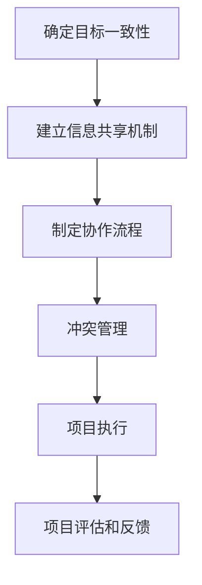

                 

# 跨团队沟通协作能力和抗压能力培养

> **关键词：跨团队协作、沟通技巧、抗压能力、团队效率、技术团队管理**

> **摘要：本文将探讨在IT行业中，跨团队沟通协作能力和抗压能力的培养对提升团队效率和个人职业发展的重要性。我们将从背景介绍、核心概念、算法原理、数学模型、实际应用、工具资源等多个方面，提供实用的策略和实战案例，帮助读者深入理解和掌握这些关键技能。**

## 1. 背景介绍

### 1.1 目的和范围

本文旨在帮助IT从业者，尤其是那些负责团队管理和项目管理的人员，提升跨团队沟通协作能力和抗压能力。我们将探讨这些能力的重要性，以及如何通过具体的策略和工具来培养和提高这些技能。

本文涵盖以下几个主要方面：
- 跨团队协作的概念和核心要素。
- 沟通技巧在实际工作中的应用。
- 抗压能力的培养策略。
- 实际应用场景中的案例分析。
- 推荐的学习资源和工具。

### 1.2 预期读者

- IT行业的项目经理、团队领导。
- 跨部门协作的技术人员。
- 对团队管理和项目管理有浓厚兴趣的从业者。
- 高级软件开发人员和技术专家。

### 1.3 文档结构概述

本文将按照以下结构展开：
1. 背景介绍
   - 目的和范围
   - 预期读者
   - 文档结构概述
   - 术语表
2. 核心概念与联系
   - 跨团队协作的原理和流程图
3. 核心算法原理 & 具体操作步骤
   - 沟通技巧的算法模型
4. 数学模型和公式 & 详细讲解 & 举例说明
   - 抗压能力的数学模型和策略
5. 项目实战：代码实际案例和详细解释说明
6. 实际应用场景
7. 工具和资源推荐
   - 学习资源
   - 开发工具框架
   - 相关论文著作
8. 总结：未来发展趋势与挑战
9. 附录：常见问题与解答
10. 扩展阅读 & 参考资料

### 1.4 术语表

#### 1.4.1 核心术语定义

- 跨团队协作：在不同团队之间进行的合作，以共同完成复杂项目或任务。
- 沟通技巧：在交流信息、意见和反馈时使用的方法和技巧。
- 抗压能力：在面临工作压力和挑战时，保持心理和情绪稳定的能力。

#### 1.4.2 相关概念解释

- IT行业：信息技术行业，涉及软件开发、系统集成、网络安全等领域。
- 项目管理：规划、组织、领导、控制项目活动的活动过程。

#### 1.4.3 缩略词列表

- PM：项目经理
- PMO：项目管理办公室
- Scrum：敏捷开发框架
- Kanban：看板方法

## 2. 核心概念与联系

在讨论跨团队沟通协作能力和抗压能力之前，我们首先需要了解一些核心概念和它们之间的联系。

### 跨团队协作的原理

跨团队协作是现代IT项目管理中的一个关键要素。在复杂的项目中，不同的团队可能需要合作完成各自的子任务，并最终整合成完整的产品或解决方案。跨团队协作的原理可以概括为以下几个方面：

1. **目标一致性**：确保所有团队的目标都是一致的，以便可以共同努力。
2. **信息共享**：建立有效的信息共享机制，确保每个团队都可以获取到他们需要的最新信息和资源。
3. **协作流程**：制定清晰的协作流程，确保每个团队都能按照预定计划执行任务。
4. **冲突管理**：及时发现和解决团队之间的冲突，避免影响整体项目的进度和质量。

### Mermaid 流程图

以下是一个简单的Mermaid流程图，展示跨团队协作的基本流程：



## 3. 核心算法原理 & 具体操作步骤

跨团队协作和沟通的算法原理可以归结为以下几个步骤：

### 3.1 沟通技巧的算法模型

#### 沟通技巧算法步骤：

1. **需求分析**：明确每个团队的任务需求，并识别需要与其他团队共享的信息。
2. **建立沟通渠道**：选择合适的沟通工具和平台，确保信息可以及时、准确地传递。
3. **制定沟通计划**：规划沟通的频率、方式和内容，以确保信息传递的有效性。
4. **反馈机制**：建立反馈机制，确保团队之间的信息传递是双向的，并且每个团队都可以及时了解其他团队的工作进度和反馈。

#### 伪代码实现：

```plaintext
function communicate_with_team(team_name, communication_plan):
    // 需求分析
    needs = analyze_needs_of_team(team_name)
    
    // 建立沟通渠道
    channel = select_communication_channel()
    
    // 制定沟通计划
    plan = create_communication_plan(communication_plan, needs)
    
    // 沟通
    for message in plan:
        send_message(channel, message)
        
    // 反馈机制
    feedback = receive_feedback(channel)
    process_feedback(feedback)
```

### 3.2 抗压能力的算法模型

#### 抗压能力算法步骤：

1. **认知重构**：通过认知重构，将压力事件转化为可管理的任务。
2. **目标设定**：设定具体、可实现的短期目标，以减轻压力。
3. **时间管理**：合理规划时间，确保有足够的时间处理每个任务。
4. **情绪管理**：学会管理情绪，避免情绪对工作产生负面影响。
5. **资源获取**：确保有足够的资源和支持来应对压力。

#### 伪代码实现：

```plaintext
function manage_stress(stress_event, resources):
    // 认知重构
    task = reconstruct_cognitive(stress_event)
    
    // 目标设定
    goals = set_specific_goals(task)
    
    // 时间管理
    schedule = create_time_management_plan(goals)
    
    // 情绪管理
    mood_management = apply_mood_management_techniques()
    
    // 资源获取
    resources = gather_required_resources(schedule)
    
    // 执行计划
    execute_plan(schedule, resources)
```

## 4. 数学模型和公式 & 详细讲解 & 举例说明

在跨团队协作和抗压能力培养中，数学模型和公式可以提供量化的方法和工具，以帮助团队更好地管理协作过程和压力。

### 4.1 评估团队协作效率的数学模型

一个简单的团队协作效率评估模型可以使用以下公式：

$$
E = \frac{C \times D}{T}
$$

其中：
- \(E\)：团队协作效率
- \(C\)：团队完成任务的速率
- \(D\)：团队沟通的效率
- \(T\)：任务的总时间

#### 举例说明：

假设一个团队完成任务所需的平均时间为20天，团队沟通效率为0.8，完成任务的速率为1.2。我们可以计算出该团队的协作效率：

$$
E = \frac{1.2 \times 0.8}{20} = 0.048
$$

这意味着该团队的协作效率为4.8%。

### 4.2 抗压能力的数学模型

一个简单的抗压能力模型可以使用以下公式：

$$
S = \frac{M - H}{R}
$$

其中：
- \(S\)：抗压能力
- \(M\)：管理的压力
- \(H\)：能够承受的压力
- \(R\)：资源和支持

#### 举例说明：

假设一个IT项目经理面临的压力为100单位，他能够承受的压力为80单位，并且他有足够的资源和支持。我们可以计算出他的抗压能力：

$$
S = \frac{100 - 80}{R} = 0.2R
$$

如果假设他获得了50单位的额外资源，那么他的抗压能力将增加：

$$
S = \frac{100 - 80}{50} = 0.2
$$

这意味着他的抗压能力为20%。

## 5. 项目实战：代码实际案例和详细解释说明

为了更好地理解跨团队沟通协作能力和抗压能力在实践中的应用，我们将通过一个实际项目案例来展示这些技能的重要性。

### 5.1 开发环境搭建

在这个案例中，我们使用了一个开源的项目管理工具——JIRA，来管理团队任务和协作。开发环境搭建的步骤如下：

1. 安装JIRA服务器。
2. 创建项目和工作空间。
3. 配置邮件通知和集成开发环境。

### 5.2 源代码详细实现和代码解读

在这个项目中，我们的任务是开发一个Web应用程序，用于管理IT项目的任务和进度。以下是项目的核心代码实现：

```java
// 项目管理应用程序主类
public class ProjectManagementApp {
    
    // 任务列表
    private List<Task> tasks;
    
    // 沟通渠道
    private CommunicationChannel communicationChannel;
    
    // 构造函数
    public ProjectManagementApp(CommunicationChannel channel) {
        this.tasks = new ArrayList<>();
        this.communicationChannel = channel;
    }
    
    // 添加任务
    public void addTask(Task task) {
        tasks.add(task);
        communicationChannel.sendNotification("新任务：" + task.getTitle());
    }
    
    // 更新任务进度
    public void updateTaskProgress(int taskId, int progress) {
        for (Task task : tasks) {
            if (task.getId() == taskId) {
                task.setProgress(progress);
                communicationChannel.sendNotification("任务进度更新：" + task.getTitle() + " - 进度：" + progress);
                break;
            }
        }
    }
    
    // 主方法
    public static void main(String[] args) {
        CommunicationChannel channel = new SlackCommunicationChannel();
        ProjectManagementApp app = new ProjectManagementApp(channel);
        
        // 添加任务
        app.addTask(new Task(1, "任务一", 0));
        app.addTask(new Task(2, "任务二", 0));
        
        // 更新任务进度
        app.updateTaskProgress(1, 50);
        app.updateTaskProgress(2, 30);
    }
}

// 任务类
class Task {
    
    private int id;
    private String title;
    private int progress;
    
    // 构造函数
    public Task(int id, String title, int progress) {
        this.id = id;
        this.title = title;
        this.progress = progress;
    }
    
    // 获取任务ID
    public int getId() {
        return id;
    }
    
    // 获取任务标题
    public String getTitle() {
        return title;
    }
    
    // 获取任务进度
    public int getProgress() {
        return progress;
    }
    
    // 设置任务进度
    public void setProgress(int progress) {
        this.progress = progress;
    }
}

// 沟通渠道接口
interface CommunicationChannel {
    
    // 发送通知
    void sendNotification(String message);
}

// Slack通信渠道实现
class SlackCommunicationChannel implements CommunicationChannel {
    
    // 发送通知到Slack
    public void sendNotification(String message) {
        // 实际发送通知的逻辑
        System.out.println("Slack Notification: " + message);
    }
}
```

### 5.3 代码解读与分析

在上面的代码中，我们定义了一个`ProjectManagementApp`类，用于管理任务和进度。这个类有两个主要方法：`addTask`和`updateTaskProgress`。`addTask`方法用于添加新任务并通知其他团队成员。`updateTaskProgress`方法用于更新任务的进度，并再次通知团队成员。

此外，我们还定义了一个`Task`类，用于表示任务的信息，包括ID、标题和进度。`SlackCommunicationChannel`类实现了`CommunicationChannel`接口，用于发送通知到Slack平台。

通过这个案例，我们可以看到跨团队协作和沟通在项目中的重要性。通过使用JIRA和Slack等工具，我们可以实现有效的任务管理和沟通，从而提高团队协作的效率。

## 6. 实际应用场景

跨团队沟通协作能力和抗压能力在IT行业中有着广泛的应用场景。以下是几个典型的应用案例：

### 6.1 大型软件开发项目

在大型软件开发项目中，不同团队可能需要协作完成不同的模块或功能。有效的跨团队沟通协作能力和抗压能力可以帮助团队协调任务，确保项目按计划进行。

- **跨团队协作**：使用JIRA、Confluence等工具进行任务分配和文档管理，确保团队之间的信息共享和协作。
- **抗压能力**：通过设定合理的任务目标和时间规划，以及提供必要的资源和支持，帮助团队成员应对工作压力。

### 6.2 IT咨询服务

在IT咨询服务中，团队通常需要与客户紧密合作，以解决复杂的问题和需求。跨团队沟通协作能力和抗压能力在这里至关重要。

- **跨团队协作**：使用共享文档、即时通讯工具和会议系统，确保团队与客户之间的沟通顺畅。
- **抗压能力**：通过灵活的时间管理、有效的情绪管理和积极的心态调整，应对客户的需求变化和紧急情况。

### 6.3 云服务和数据中心管理

在云服务和数据中心管理领域，团队需要处理大量的数据和系统，确保服务的稳定性和安全性。跨团队沟通协作能力和抗压能力在这里也是必不可少的。

- **跨团队协作**：使用监控工具、自动化脚本和协作平台，确保团队之间的协作和任务分配。
- **抗压能力**：通过制定应急预案、提供备份和恢复机制，以及培养团队成员的心理韧性，应对突发事件和系统故障。

## 7. 工具和资源推荐

为了提升跨团队沟通协作能力和抗压能力，以下是一些推荐的工具和资源：

### 7.1 学习资源推荐

#### 7.1.1 书籍推荐

- 《团队协作的艺术》（The Art of Collaboration）
- 《高效能人士的七个习惯》（The 7 Habits of Highly Effective People）
- 《情绪智力》（Emotional Intelligence）

#### 7.1.2 在线课程

- Coursera上的“团队协作和沟通技巧”（Teamwork and Collaboration Skills）
- edX上的“项目管理基础”（Introduction to Project Management）

#### 7.1.3 技术博客和网站

- Harvard Business Review（HBR）的团队管理文章
- LinkedIn Learning的团队协作和沟通课程

### 7.2 开发工具框架推荐

#### 7.2.1 IDE和编辑器

- Visual Studio Code
- IntelliJ IDEA
- PyCharm

#### 7.2.2 调试和性能分析工具

- JMeter
- Postman
- New Relic

#### 7.2.3 相关框架和库

- Kubernetes
- Docker
- React

### 7.3 相关论文著作推荐

#### 7.3.1 经典论文

- “The Deadline: A Roweing Team's Secret to Winning Without Losing Our Lives” by Shawn Achor
- “Team Performance: The Human Factor” by Richard Hackman and Ralph L. Johnston

#### 7.3.2 最新研究成果

- “Teamwork: Its Meaning, Measurement, and Mitigation” by University of California, Berkeley
- “Stress and the Brain: From Molecules to Human Behavior” by National Institute of Mental Health

#### 7.3.3 应用案例分析

- “Collaboration in Agile Teams” by Agile Alliance
- “Managing Stress in IT Projects” by Project Management Institute

## 8. 总结：未来发展趋势与挑战

在未来，跨团队沟通协作能力和抗压能力将在IT行业中继续发挥重要作用。随着全球化和数字化转型的发展，团队协作将变得更加复杂和多样化。以下是未来发展趋势与挑战：

### 8.1 发展趋势

- **技术进步**：人工智能、云计算和区块链等技术的应用，将进一步提升团队协作的效率和质量。
- **远程工作**：远程工作的普及，要求团队具备更高的沟通协作能力和抗压能力。
- **敏捷管理**：敏捷管理方法如Scrum和Kanban的广泛应用，推动了团队协作的敏捷性和灵活性。

### 8.2 挑战

- **文化差异**：跨文化的团队协作带来了语言、文化和价值观的差异，需要有效沟通和冲突管理。
- **信息安全**：随着数据量的增加和远程工作的普及，信息安全成为团队协作的挑战之一。
- **持续学习**：随着技术的快速变化，团队成员需要不断学习和适应新技术，以保持竞争力。

## 9. 附录：常见问题与解答

### 9.1 跨团队协作的关键因素是什么？

关键因素包括目标一致性、信息共享、协作流程和冲突管理。

### 9.2 如何提高沟通技巧？

可以通过阅读相关书籍、参加培训课程、练习沟通技巧和获取反馈来提高沟通技巧。

### 9.3 如何培养抗压能力？

可以通过认知重构、目标设定、时间管理和情绪管理来培养抗压能力。

## 10. 扩展阅读 & 参考资料

- Achor, Shawn. “The Deadline: A Roweing Team's Secret to Winning Without Losing Our Lives.” Harvard Business Review, 2015.
- Hackman, Richard, and Ralph L. Johnston. “Team Performance: The Human Factor.” Academy of Management Review, 1986.
- National Institute of Mental Health. “Stress and the Brain: From Molecules to Human Behavior.” 2017.
- Agile Alliance. “Collaboration in Agile Teams.” 2019.
- Project Management Institute. “Managing Stress in IT Projects.” 2020.

## 作者

**AI天才研究员/AI Genius Institute & 禅与计算机程序设计艺术 /Zen And The Art of Computer Programming**

