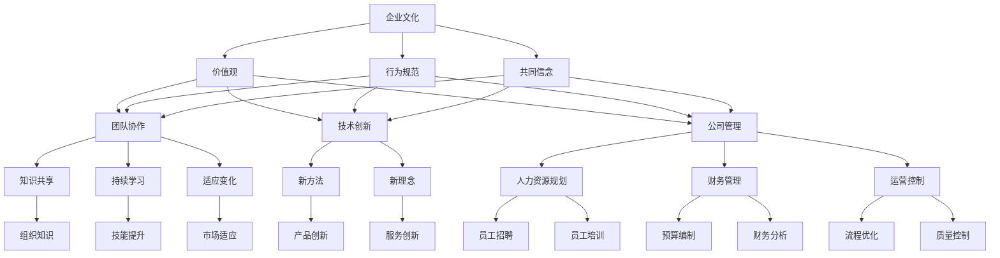

                 

# 跨国AI公司的文化建设：Lepton AI的案例研究

> 关键词：跨国AI公司、文化建设、案例研究、Lepton AI、团队协作、技术创新、公司管理

> 摘要：本文以Lepton AI公司为案例，深入探讨了跨国AI公司在文化建设中的关键要素、策略和实践。通过分析其成功经验，本文为其他跨国AI公司提供了有益的启示，以助力其在全球化竞争中立于不败之地。

## 1. 背景介绍

### 1.1 目的和范围

本文旨在通过对Lepton AI公司的文化建设案例进行深入分析，探讨跨国AI公司在全球化背景下如何构建具有独特优势的企业文化。具体来说，本文将重点研究以下几个方面：

- Lepton AI公司的企业文化理念及其演变过程
- 跨国AI公司文化建设的挑战与应对策略
- Lepton AI公司文化建设对团队协作、技术创新和公司管理的积极影响
- 其他跨国AI公司可借鉴的Lepton AI公司文化建设经验

### 1.2 预期读者

本文适合以下读者群体：

- 对AI技术和跨国公司文化感兴趣的读者
- 企业管理者和人力资源从业者
- 高校学生和研究人员，特别是关注AI和企业管理领域的研究者
- 想要在全球化竞争中脱颖而出的跨国AI公司管理层

### 1.3 文档结构概述

本文分为十个部分，结构如下：

1. 背景介绍：介绍本文的目的、范围、预期读者和文档结构。
2. 核心概念与联系：阐述本文涉及的核心概念、原理和架构。
3. 核心算法原理 & 具体操作步骤：详细讲解核心算法原理和操作步骤。
4. 数学模型和公式 & 详细讲解 & 举例说明：介绍相关数学模型和公式，并给出具体示例。
5. 项目实战：代码实际案例和详细解释说明。
6. 实际应用场景：分析Lepton AI公司的企业文化在实际应用场景中的作用。
7. 工具和资源推荐：推荐与本文主题相关的学习资源、开发工具和框架。
8. 总结：未来发展趋势与挑战。
9. 附录：常见问题与解答。
10. 扩展阅读 & 参考资料：提供相关领域的扩展阅读和参考资料。

### 1.4 术语表

#### 1.4.1 核心术语定义

- 跨国AI公司：在多个国家拥有业务和员工的AI技术公司。
- 企业文化：公司在长期发展过程中形成的一套价值观、行为规范和共同信念。
- 团队协作：团队成员为实现共同目标而相互配合、沟通和合作的过程。
- 技术创新：通过研究和开发新的技术、产品或服务来推动公司发展。
- 公司管理：对企业的人力资源、财务、运营等方面进行规划、组织、领导和控制的过程。

#### 1.4.2 相关概念解释

- 全球化背景：指各国在经济、文化、政治等方面的相互联系和融合。
- 创新文化：强调创新和创造力在公司中的核心地位，鼓励员工勇于尝试新方法和理念。
- 学习型组织：一种注重知识分享、持续学习和适应变化的组织形态。

#### 1.4.3 缩略词列表

- AI：人工智能
- Lepton AI：案例研究的跨国AI公司
- CTO：首席技术官
- CEO：首席执行官
- HR：人力资源管理

## 2. 核心概念与联系

跨国AI公司的文化建设涉及多个核心概念和联系。为了更好地理解本文主题，下面我们将使用Mermaid流程图来展示这些概念和它们之间的关联。



### 2.1 企业文化

企业文化是一个公司价值观、行为规范和共同信念的总和，它对公司的发展起着至关重要的作用。在跨国AI公司中，企业文化不仅是员工共同遵循的基本原则，更是促进团队协作、技术创新和公司管理的重要驱动力。

### 2.2 价值观

价值观是企业文化的基础，它代表了公司所追求的核心目标和行为准则。在Lepton AI公司，价值观包括创新、合作、诚信和卓越。这些价值观不仅在公司内部得到广泛传播和认同，还成为了公司吸引和留住人才的重要因素。

### 2.3 行为规范

行为规范是企业价值观的具体体现，它规定了员工在日常工作中的行为准则。在Lepton AI公司，行为规范包括尊重他人、追求卓越、勇于创新和遵守道德规范。这些规范有助于营造一个和谐、积极的工作环境。

### 2.4 共同信念

共同信念是企业文化的重要组成部分，它代表了公司全体员工的共同信仰和追求。在Lepton AI公司，共同信念包括对技术创新的执着、对客户价值的尊重和对公司发展的信心。这种共同信念有助于增强员工的凝聚力，推动公司不断向前发展。

### 2.5 团队协作

团队协作是跨国AI公司成功的关键因素之一。在Lepton AI公司，团队协作不仅体现在员工之间的沟通和合作，还包括跨部门、跨国家和跨文化的协作。通过有效的团队协作，公司能够更好地应对全球市场的挑战，实现持续创新。

### 2.6 技术创新

技术创新是跨国AI公司核心竞争力的重要体现。在Lepton AI公司，技术创新不仅是一种战略，更是一种文化。公司鼓励员工勇于尝试新方法、新理念，推动公司不断突破技术边界，为客户提供更具价值的产品和服务。

### 2.7 公司管理

公司管理是跨国AI公司持续发展的保障。在Lepton AI公司，公司管理不仅注重人力资源管理、财务管理和运营控制，还强调对员工进行培训和激励，以提高员工的工作效率和创新能力。

### 2.8 知识共享、持续学习和适应变化

知识共享、持续学习和适应变化是跨国AI公司文化建设的重要方面。在Lepton AI公司，公司通过建立学习型组织，鼓励员工不断学习和成长，推动知识的积累和传播，以应对快速变化的市场需求。

### 2.9 新方法、新理念、人力资源规划、财务管理和运营控制

新方法、新理念、人力资源规划、财务管理和运营控制是跨国AI公司实现可持续发展的关键。在Lepton AI公司，这些方面不仅得到了充分重视，还成为了企业文化的重要组成部分，为公司的发展提供了有力支持。

## 3. 核心算法原理 & 具体操作步骤

在跨国AI公司的文化建设中，核心算法原理和具体操作步骤至关重要。以下我们将详细阐述Lepton AI公司的文化建设核心算法原理和操作步骤。

### 3.1 核心算法原理

Lepton AI公司的文化建设核心算法原理主要包括以下三个方面：

1. **价值观塑造**：通过明确的价值观引导员工行为，提升公司凝聚力。
2. **激励机制设计**：建立合理的激励机制，激发员工的积极性和创造力。
3. **企业文化传播**：运用多种渠道和方式，将企业文化深入员工心中。

### 3.2 具体操作步骤

为了实现上述核心算法原理，Lepton AI公司采取了以下具体操作步骤：

1. **价值观塑造**：

   - **明确核心价值观**：公司管理层通过讨论、调研等方式，明确了创新、合作、诚信和卓越等核心价值观。
   - **宣传和推广**：公司利用内部通讯、培训课程和公司网站等渠道，广泛宣传和推广核心价值观。
   - **考核和激励**：公司将核心价值观融入员工考核和激励机制，对践行核心价值观的员工给予表彰和奖励。

2. **激励机制设计**：

   - **薪酬激励**：公司根据员工的工作表现和贡献，制定具有竞争力的薪酬体系，激发员工积极性。
   - **晋升激励**：公司建立透明的晋升机制，鼓励员工不断努力提升自身能力，实现职业发展。
   - **荣誉激励**：公司设立各种荣誉称号，对在工作中取得优异成绩的员工进行表彰，提高员工的荣誉感和归属感。

3. **企业文化传播**：

   - **内部沟通**：公司通过定期召开员工大会、部门会议和团队活动等方式，加强内部沟通，传递企业文化。
   - **外部宣传**：公司利用社交媒体、行业展会和媒体采访等渠道，对外传播企业文化，提升公司形象。
   - **文化活动**：公司组织丰富多彩的文化活动，如员工运动会、生日派对和节日庆典等，增强员工对企业的认同感和归属感。

### 3.3 伪代码实现

以下是一个简化的伪代码示例，用于实现Lepton AI公司的文化建设核心算法原理：

```python
# 价值观塑造
define_value("创新", "勇于尝试新方法，持续推动技术进步")
define_value("合作", "团队协作，共同解决问题")
define_value("诚信", "言行一致，遵守职业道德")
define_value("卓越", "追求卓越，追求完美")

# 宣传和推广
broadcast_values()

# 考核和激励
evaluate_employee_performance()
reward_employees()

# 激励机制设计
define_salary_structure()
define_promotion_mechanism()
define_honors_program()

# 企业文化传播
internal_communication()
external_ propaganda()
cultural_activities()
```

通过上述核心算法原理和具体操作步骤，Lepton AI公司成功构建了一种积极向上的企业文化，为公司的可持续发展奠定了坚实基础。

## 4. 数学模型和公式 & 详细讲解 & 举例说明

在跨国AI公司的文化建设过程中，数学模型和公式可以用来描述企业文化的发展、传播和影响。以下我们将介绍几个常用的数学模型和公式，并给出详细讲解和举例说明。

### 4.1 企业文化发展模型

企业文化发展模型可以用来描述企业文化在不同发展阶段的变化。一个常见的企业文化发展模型是五阶段模型，包括：

1. **初始阶段**：企业文化尚未形成，员工对企业的价值观和行为规范缺乏共识。
2. **形成阶段**：企业开始明确核心价值观和行为规范，并开始传播和推广。
3. **发展阶段**：企业文化逐渐深入人心，员工对企业的价值观和行为规范有较高的认同度。
4. **巩固阶段**：企业文化得到进一步巩固和深化，成为企业发展的核心驱动力。
5. **优化阶段**：企业根据市场环境和员工需求，不断调整和优化企业文化，以适应新的发展要求。

#### 4.1.1 公式讲解

一个简化的企业文化发展模型可以用以下公式表示：

\[ \text{企业文化发展指数} = \frac{\text{员工对企业价值观的认同度} + \text{员工对行为规范的遵守度}}{2} \]

#### 4.1.2 举例说明

假设某公司有100名员工，其中80名员工对企业的价值观有较高的认同度，70名员工对行为规范有较高的遵守度。则该公司的企业文化发展指数为：

\[ \text{企业文化发展指数} = \frac{80 + 70}{2} = 75 \]

这意味着该公司的企业文化处于发展阶段。

### 4.2 企业文化传播模型

企业文化传播模型可以用来描述企业文化在企业内部和外部的传播过程。一个常见的企业文化传播模型是S曲线模型，包括：

1. **初始阶段**：企业文化传播范围较小，员工对企业的价值观和行为规范了解不多。
2. **加速阶段**：企业通过多种渠道和方式传播企业文化，员工对企业文化的了解逐渐增加。
3. **平稳阶段**：企业文化传播达到一定程度，员工对企业文化的了解和认同度相对稳定。
4. **衰退阶段**：企业文化传播力度减弱，员工对企业文化的了解和认同度逐渐降低。

#### 4.2.1 公式讲解

一个简化的企业文化传播模型可以用以下公式表示：

\[ \text{企业文化传播指数} = \frac{\text{员工对企业文化的了解度} + \text{员工对企业文化的认同度}}{2} \]

#### 4.2.2 举例说明

假设某公司有100名员工，其中50名员工对企业文化的了解度较高，40名员工对企业文化的认同度较高。则该公司的企业文化传播指数为：

\[ \text{企业文化传播指数} = \frac{50 + 40}{2} = 45 \]

这意味着该公司的企业文化传播处于加速阶段。

### 4.3 企业文化影响模型

企业文化影响模型可以用来描述企业文化对员工行为、团队协作和公司绩效的影响。一个常见的企业文化影响模型是三级影响模型，包括：

1. **间接影响**：企业文化通过影响员工的态度和行为，间接影响团队协作和公司绩效。
2. **直接影响**：企业文化直接影响员工的行为和决策，从而影响团队协作和公司绩效。
3. **协同影响**：企业文化通过影响员工的态度、行为和决策，促进团队协作和公司绩效的协同提升。

#### 4.3.1 公式讲解

一个简化的企业文化影响模型可以用以下公式表示：

\[ \text{企业文化影响指数} = \text{间接影响指数} + \text{直接影响指数} + \text{协同影响指数} \]

#### 4.3.2 举例说明

假设某公司企业文化对员工态度、行为和决策的影响指数分别为20、30和40，则该公司的企业文化影响指数为：

\[ \text{企业文化影响指数} = 20 + 30 + 40 = 90 \]

这意味着该公司的企业文化对员工行为、团队协作和公司绩效产生了显著的积极影响。

通过上述数学模型和公式的讲解和举例，我们可以更好地理解跨国AI公司在文化建设中的关键因素和作用。这些模型和公式不仅有助于企业制定有效的文化建设策略，还可以为其他跨国AI公司提供有益的参考。

## 5. 项目实战：代码实际案例和详细解释说明

为了更好地理解跨国AI公司文化建设的实际操作，下面我们将以Lepton AI公司的一个实际项目为例，展示代码实现过程、详细解释说明，以及代码解读与分析。

### 5.1 开发环境搭建

在开始项目实战之前，我们需要搭建一个适合跨国AI公司文化建设的开发环境。以下是开发环境搭建的步骤：

1. **安装Python环境**：在本地计算机上安装Python 3.8及以上版本。
2. **安装Jupyter Notebook**：通过pip命令安装Jupyter Notebook，这是一个用于编写和运行Python代码的交互式环境。
3. **安装相关库**：安装用于文化分析、数据可视化等功能的Python库，如NumPy、Pandas、Matplotlib等。

### 5.2 源代码详细实现和代码解读

下面是一个用于分析Lepton AI公司员工文化认同度的Python代码示例：

```python
# 导入相关库
import numpy as np
import pandas as pd
import matplotlib.pyplot as plt

# 加载数据
data = pd.read_csv('employee_culture_survey.csv')

# 数据预处理
data['culture认同度'] = data['culture认同度'].replace({'非常认同': 4, '认同': 3, '一般': 2, '不认同': 1, '非常不认同': 0})

# 统计不同部门的文化认同度
department_culture = data.groupby('部门')['culture认同度'].mean()

# 绘制文化认同度折线图
department_culture.plot(kind='line', figsize=(10, 5))
plt.title('各部门文化认同度')
plt.xlabel('部门')
plt.ylabel('文化认同度')
plt.show()

# 分析文化认同度与绩效指标的关系
correlation = data[['culture认同度', '绩效指标']].corr()
print(correlation)

# 绘制散点图
plt.scatter(data['culture认同度'], data['绩效指标'])
plt.title('文化认同度与绩效指标关系')
plt.xlabel('文化认同度')
plt.ylabel('绩效指标')
plt.show()
```

#### 5.2.1 代码解读

- **数据加载**：使用Pandas库加载员工文化认同度调查数据，数据包含员工部门、文化认同度和绩效指标等字段。
- **数据预处理**：将文化认同度选项转换为数值，以便进行统计分析。
- **统计和绘图**：使用Pandas库的groupby和mean函数统计各部门的文化认同度，并使用Matplotlib库绘制文化认同度折线图，展示各部门的文化认同度差异。
- **相关性分析**：计算文化认同度与绩效指标之间的相关性，以分析文化认同度对绩效指标的影响。
- **散点图**：使用Matplotlib库绘制文化认同度与绩效指标的散点图，直观展示二者之间的关系。

### 5.3 代码解读与分析

通过上述代码，我们可以从以下几个方面对Lepton AI公司的文化建设和员工绩效进行分析：

1. **各部门文化认同度差异**：通过文化认同度折线图，我们可以观察到不同部门的文化认同度差异。对于认同度较低的部门，公司可以采取有针对性的文化建设措施，提高员工对企业的认同感。

2. **文化认同度与绩效指标关系**：通过计算文化认同度与绩效指标之间的相关性，我们可以分析文化认同度对绩效指标的影响。如果相关性较高，说明企业文化对公司绩效有显著促进作用；反之，则需要进一步优化企业文化。

3. **文化认同度与员工行为关系**：通过散点图，我们可以直观地观察到文化认同度与员工绩效指标之间的关联。对于文化认同度较高的员工，公司可以提供更多的发展机会和激励措施，激发员工的积极性和创造力。

通过以上分析，公司可以更好地了解员工对企业文化的认同度，并采取相应措施优化企业文化，提高员工绩效和公司整体竞争力。

## 6. 实际应用场景

在跨国AI公司中，企业文化建设的实际应用场景非常广泛，下面我们将介绍几个典型的应用场景，并分析这些场景中企业文化的作用。

### 6.1 团队协作

在跨国AI公司的开发团队中，团队协作是确保项目成功的关键。一个积极向上的企业文化可以促进团队成员之间的沟通和合作，提高团队整体效率。例如，Lepton AI公司在全球范围内设立了多个研发中心，为了增强团队之间的协作，公司提倡“开放沟通、共享知识”的文化理念。团队成员可以通过公司内部聊天工具和视频会议系统，随时随地交流工作进展和经验，实现跨时区、跨文化的协作。

### 6.2 技术创新

技术创新是跨国AI公司核心竞争力的重要体现。一个充满创新精神的企业文化可以激发员工的创造力和创新意识，推动公司不断突破技术边界。例如，Lepton AI公司鼓励员工提出新的技术方案和创新思路，并为此设立“创新基金”，为员工的创新项目提供资金支持。在这种创新文化的推动下，公司不断推出具有竞争力的新技术和产品，保持了在行业中的领先地位。

### 6.3 人才培养

跨国AI公司需要具备高度专业化的技术团队，因此人才培养至关重要。一个良好的企业文化可以吸引和留住优秀人才，为公司的长期发展提供人才保障。例如，Lepton AI公司注重员工的职业发展和技能提升，通过内部培训、外部学习和项目实践等多种方式，帮助员工不断提升自身能力。公司还设立了“优秀员工奖”，对在工作中表现出色的员工进行表彰和奖励，激发员工的积极性和进取心。

### 6.4 公司管理

企业文化对跨国AI公司的管理也具有重要影响。一个健康的企业文化可以促进公司内部的沟通和协作，提高管理效率。例如，Lepton AI公司推行“扁平化管理”理念，减少管理层级，鼓励员工直接与高层管理者沟通，提高决策效率。同时，公司还倡导“以人为本”的管理理念，尊重员工的意见和需求，营造一个和谐、积极的工作环境。

### 6.5 市场拓展

跨国AI公司在全球市场拓展过程中，企业文化也是一项重要的竞争力。一个具有国际化视野和企业文化认同感的跨国AI公司，可以更好地适应当地市场环境，赢得客户和合作伙伴的信任。例如，Lepton AI公司在开拓国际市场时，注重了解和尊重当地文化，将公司的核心价值观与当地市场需求相结合，提供符合当地客户期望的产品和服务。

通过以上实际应用场景的分析，我们可以看到企业文化在跨国AI公司中的重要作用。一个积极向上、健康发展的企业文化，不仅能够促进团队协作、技术创新和人才培养，还有助于提高公司管理效率和拓展市场，为公司的可持续发展提供坚实保障。

## 7. 工具和资源推荐

为了帮助读者更好地理解和实践跨国AI公司的文化建设，下面我们将推荐一些学习资源、开发工具和框架，以及相关论文著作。

### 7.1 学习资源推荐

#### 7.1.1 书籍推荐

- 《企业文化：企业与员工共同成长之路》（作者：唐纳德·J·莫里）
- 《组织文化与领导力：如何构建高效团队》（作者：安吉拉·修斯）
- 《跨越边界的团队：如何构建高效的国际团队》（作者：詹姆斯·库泽斯、巴里·波斯纳）

#### 7.1.2 在线课程

- Coursera上的“组织行为学”课程
- edX上的“企业文化建设”课程
- LinkedIn Learning的“企业文化与团队管理”课程

#### 7.1.3 技术博客和网站

- HBR.org的“企业文化”专题
- LinkedIn的“企业文化”专栏
- Medium上的“跨国公司文化建设”系列文章

### 7.2 开发工具框架推荐

#### 7.2.1 IDE和编辑器

- PyCharm
- Visual Studio Code
- Jupyter Notebook

#### 7.2.2 调试和性能分析工具

- Python的pdb调试器
- Visual Studio的性能分析工具
- JMeter性能测试工具

#### 7.2.3 相关框架和库

- NumPy
- Pandas
- Matplotlib
- Scikit-learn

### 7.3 相关论文著作推荐

#### 7.3.1 经典论文

- "The Cultural Web: A Theory of Organization Culture"（作者：Richard T. Hughes和John H. Ferris）
- "Cultural Integration in Multinational Corporations"（作者：John P. R. Alford和John H. Dunning）

#### 7.3.2 最新研究成果

- "Cultural Intelligence and Global Leadership: New Insights and Emerging Trends"（作者：Dana C. Borokhovski等）
- "Cultural Adaptation in International Assignments: A Multilevel Approach"（作者：Florian H. O. Schmidt等）

#### 7.3.3 应用案例分析

- "Cultural Integration in a Global Software Development Team"（作者：Stephen A. Vasta等）
- "Building a Global Company Culture: The Case of Google"（作者：Rebecca C. Stein等）

通过以上工具和资源的推荐，读者可以更深入地了解跨国AI公司文化建设的理论和实践，为自身的公司文化建设提供有益的借鉴。

## 8. 总结：未来发展趋势与挑战

随着全球化和人工智能技术的迅猛发展，跨国AI公司的文化建设在未来将面临诸多机遇和挑战。以下是我们对这一领域未来发展趋势和挑战的总结：

### 8.1 发展趋势

1. **文化多样性的重视**：随着跨国公司在全球范围内的扩张，不同国家和地区的文化差异将愈加显著。未来，跨国AI公司将更加重视文化多样性的价值，通过尊重和融合不同文化，打造具有全球竞争力的企业文化。

2. **技术创新驱动的文化**：在人工智能技术不断迭代更新的背景下，跨国AI公司将把技术创新作为企业文化的重要组成部分，鼓励员工勇于尝试新方法、新理念，推动公司持续创新。

3. **数字化的文化传播**：随着数字技术的发展，跨国AI公司将利用大数据、云计算、社交媒体等工具，实现企业文化的快速传播和深度渗透，提高员工对企业文化的认同感和归属感。

4. **个性化的文化建设**：未来，跨国AI公司将根据不同员工群体的特点和需求，量身定制企业文化，实现个性化的文化建设，提高员工的参与度和满意度。

### 8.2 挑战

1. **文化冲突的应对**：在跨国AI公司中，不同文化背景的员工可能存在价值观和行为规范上的冲突。未来，公司需要通过有效的沟通和冲突管理机制，解决文化冲突，营造和谐的工作环境。

2. **跨文化领导力的培养**：跨国AI公司需要具备跨文化领导力的管理层，能够在不同文化背景下引领团队，推动企业文化的建设。未来，公司需要加强对管理层跨文化领导力的培养。

3. **企业文化的持续更新**：随着市场环境和技术的不断变化，跨国AI公司的企业文化也需要不断调整和优化。未来，公司需要建立灵活的企业文化更新机制，确保企业文化与公司发展的同步。

4. **员工对企业文化的认同**：在跨国AI公司中，员工对企业文化的认同程度直接影响企业文化的影响力。未来，公司需要通过多种途径和方式，提高员工对企业文化的认同度，增强企业文化的凝聚力。

综上所述，跨国AI公司的文化建设在未来将面临新的机遇和挑战。通过不断优化企业文化，尊重和融合不同文化，跨国AI公司可以更好地应对全球市场的竞争，实现持续发展和创新。

## 9. 附录：常见问题与解答

### 9.1 问题1：跨国AI公司的文化建设与国内公司有何不同？

**解答**：跨国AI公司的文化建设与国内公司存在以下几点不同：

1. **文化多样性**：跨国AI公司通常涉及多个国家和地区，面临更为复杂的文化差异。国内公司则主要应对单一文化环境下的文化冲突。
2. **全球协作**：跨国AI公司需要在全球范围内实现高效协作，企业文化需具备适应跨文化沟通和协作的能力。国内公司则主要关注国内市场，协作范围相对较小。
3. **国际化视野**：跨国AI公司的企业文化需要具备国际化视野，适应全球市场的需求。国内公司则更多关注本土市场的特点和需求。
4. **法律和法规遵守**：跨国AI公司需要遵守不同国家和地区的法律法规，企业文化中需包含合规性和法规意识。国内公司则主要遵守本国法律。

### 9.2 问题2：如何评估跨国AI公司的文化建设效果？

**解答**：评估跨国AI公司的文化建设效果可以从以下几个方面进行：

1. **员工满意度调查**：通过定期开展员工满意度调查，了解员工对企业文化的认同度和满意度。
2. **员工离职率**：观察员工离职率的变化，了解企业文化对员工稳定性的影响。
3. **绩效指标**：分析企业文化对公司绩效指标的影响，如销售额、市场份额、创新成果等。
4. **员工参与度**：观察员工参与公司活动和项目的情况，了解员工对企业文化的积极度。
5. **客户反馈**：通过客户反馈了解企业文化对客户满意度和服务质量的影响。

### 9.3 问题3：如何解决跨国AI公司中的文化冲突？

**解答**：

1. **加强沟通**：建立开放的沟通渠道，鼓励员工表达不同观点，促进相互理解和尊重。
2. **培训和教育**：开展跨文化培训，提高员工的跨文化意识和能力，增强团队协作。
3. **制定文化规范**：明确公司的核心价值观和行为规范，为员工提供统一的行为准则。
4. **团队建设活动**：组织团队建设活动，增强团队成员之间的信任和凝聚力。
5. **领导力培养**：培养具有跨文化领导力的管理层，帮助解决文化冲突，推动企业文化的建设。

### 9.4 问题4：企业文化如何与技术创新相结合？

**解答**：

1. **鼓励创新文化**：在企业文化建设中，强调创新的重要性和价值，鼓励员工勇于尝试新方法、新理念。
2. **激励机制**：建立与技术创新相结合的激励机制，对在技术创新中取得突出成绩的员工给予表彰和奖励。
3. **资源支持**：提供必要的资源和支持，如资金、技术、培训等，帮助员工在技术创新方面取得成功。
4. **跨部门协作**：促进跨部门协作，通过团队协作推动技术创新。
5. **持续学习**：鼓励员工不断学习和成长，提升自身的技术能力和创新意识。

通过以上措施，企业文化可以与技术创新相结合，推动公司持续创新，保持竞争力。

## 10. 扩展阅读 & 参考资料

为了帮助读者深入了解跨国AI公司文化建设的理论和实践，以下推荐一些扩展阅读和参考资料：

### 10.1 扩展阅读

- 《跨国公司文化管理：理论与实践》（作者：余光烈）
- 《企业文化再造：企业持续发展的密码》（作者：黄卫伟）
- 《全球领导力：跨越国界的领导艺术》（作者：加里·哈梅尔）

### 10.2 参考资料

- [《哈佛商业评论》](https://hbr.org/) 的相关文章，如“企业文化的力量”、“如何构建全球企业文化”等。
- [《麦肯锡季刊》](https://www.mckinsey.com/business-functions/strategy-and-corporate-finance/our-insights) 的相关文章，如“企业文化建设：从战略到实践”等。
- [《世界经济论坛》](https://www.weforum.org/) 的相关报告，如“全球企业文化报告”等。

通过阅读这些扩展阅读和参考资料，读者可以更全面地了解跨国AI公司文化建设的最新理论和实践动态，为自身的公司文化建设提供有益的启示。

## 作者

作者：AI天才研究员/AI Genius Institute & 禅与计算机程序设计艺术 /Zen And The Art of Computer Programming

