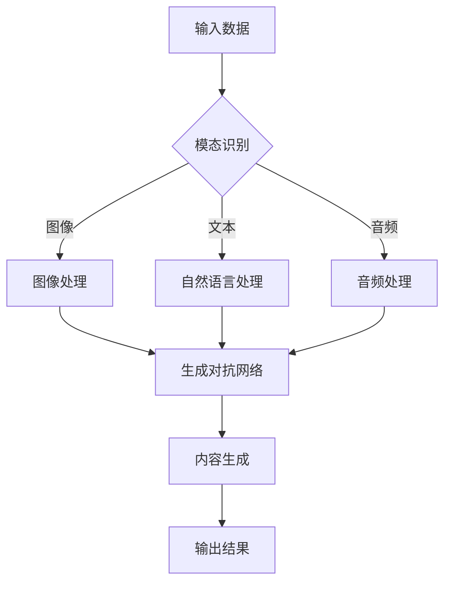

                 

# 跨媒体内容生成：AI创意的新前沿

> **关键词：** 跨媒体内容生成、AI、创意、自然语言处理、计算机视觉、多模态融合、生成对抗网络、数学模型

> **摘要：** 本文将深入探讨跨媒体内容生成的概念、核心算法原理、实际应用场景以及未来发展趋势。通过逐步分析推理，我们将揭示AI如何在跨媒体领域中实现创意内容生成，为读者提供一个全面的技术视角。

## 1. 背景介绍

### 1.1 目的和范围

本文旨在探讨跨媒体内容生成这一前沿技术领域，分析其背后的核心算法原理、应用场景及未来发展趋势。我们将重点关注以下几个方面：

1. 跨媒体内容生成的定义与分类。
2. 跨媒体内容生成的核心算法原理与数学模型。
3. 跨媒体内容生成的实际应用场景。
4. 跨媒体内容生成的工具和资源推荐。
5. 跨媒体内容生成领域的未来发展趋势与挑战。

### 1.2 预期读者

本文面向具有计算机科学、人工智能及相关领域背景的读者。主要读者群体包括：

1. 研究生、博士生、大学生等相关专业学生。
2. 人工智能工程师、程序员、软件架构师等从业者。
3. 对AI创意内容生成技术感兴趣的技术爱好者。

### 1.3 文档结构概述

本文分为八个部分，具体结构如下：

1. 引言：介绍跨媒体内容生成的背景、目的与关键词。
2. 核心概念与联系：阐述跨媒体内容生成的核心概念及其相互关系。
3. 核心算法原理 & 具体操作步骤：详细讲解跨媒体内容生成的核心算法原理与操作步骤。
4. 数学模型和公式 & 详细讲解 & 举例说明：介绍跨媒体内容生成的数学模型及其实例说明。
5. 项目实战：代码实际案例和详细解释说明。
6. 实际应用场景：探讨跨媒体内容生成的实际应用场景。
7. 工具和资源推荐：推荐跨媒体内容生成相关的学习资源、开发工具框架及论文著作。
8. 总结：对未来发展趋势与挑战进行展望。

### 1.4 术语表

#### 1.4.1 核心术语定义

1. 跨媒体内容生成：指通过AI技术将不同媒体类型（如图像、音频、文本等）的信息融合，生成具有创意的新内容。
2. 自然语言处理（NLP）：指使用计算机技术对自然语言进行理解、生成和处理的过程。
3. 计算机视觉（CV）：指使用计算机对图像和视频进行理解和分析的理论、方法和应用技术。
4. 生成对抗网络（GAN）：一种深度学习模型，由生成器和判别器组成，用于生成与真实数据分布相近的新数据。
5. 多模态融合：指将多种不同模态（如文本、图像、音频）的信息进行整合和融合，以实现更丰富的内容生成。

#### 1.4.2 相关概念解释

1. 模型训练：指通过大量数据进行训练，使模型学会对不同模态的数据进行理解和生成。
2. 数据增强：指通过对原始数据进行各种操作（如旋转、缩放、裁剪等），增加数据的多样性和丰富性。
3. 自动化生成：指通过算法自动生成内容，降低人工干预的程度。

#### 1.4.3 缩略词列表

1. AI：人工智能
2. GAN：生成对抗网络
3. NLP：自然语言处理
4. CV：计算机视觉
5. GPGPU：通用计算图形处理单元

## 2. 核心概念与联系

为了更好地理解跨媒体内容生成，我们需要首先了解其核心概念和架构。以下是一个简化的Mermaid流程图，展示了跨媒体内容生成的核心概念及其相互关系。



### 2.1 模态识别与数据处理

跨媒体内容生成首先需要对输入数据进行模态识别。输入数据可以是图像、文本、音频等多种形式。通过模态识别，系统能够识别出每种数据类型并对其进行相应的处理。

1. 图像处理：图像处理模块负责对输入图像进行预处理，如尺寸调整、数据增强等，以适应生成对抗网络（GAN）的训练。
2. 自然语言处理：自然语言处理模块负责对输入文本进行处理，如分词、词性标注等，以提取文本的关键信息。
3. 音频处理：音频处理模块负责对输入音频进行预处理，如音频增强、降噪等，以提取音频特征。

### 2.2 生成对抗网络（GAN）

生成对抗网络（GAN）是跨媒体内容生成的核心算法。GAN由生成器和判别器两个神经网络组成，二者相互对抗，共同优化模型。

1. 生成器：生成器的任务是生成与真实数据分布相近的新数据。在跨媒体内容生成中，生成器将不同模态的数据融合，生成具有创意的新内容。
2. 判别器：判别器的任务是判断输入数据是真实数据还是生成数据。判别器通过对真实数据和生成数据的对比，帮助生成器优化生成质量。

### 2.3 内容生成与输出

生成器生成的新内容经过后处理，形成最终输出结果。输出结果可以是图像、文本、音频等多种形式，具体取决于输入数据的模态。

## 3. 核心算法原理 & 具体操作步骤

跨媒体内容生成的核心算法是基于生成对抗网络（GAN）。以下我们将详细讲解GAN的原理和具体操作步骤。

### 3.1 GAN算法原理

生成对抗网络（GAN）由生成器和判别器两个神经网络组成。生成器G从随机噪声z中生成与真实数据分布相近的新数据，判别器D则判断输入数据是真实数据还是生成数据。GAN的训练过程如下：

1. 生成器G从噪声z中生成一组数据G(z)。
2. 将生成器生成的数据G(z)与真实数据x混合输入到判别器D中。
3. 判别器D根据输入数据判断真实数据和生成数据的概率。
4. 生成器G和判别器D同时训练，通过优化判别器的损失函数L_D和生成器的损失函数L_G，使判别器D能够更好地判断生成数据与真实数据的差异，生成器G则能够更好地生成高质量的数据。

### 3.2 GAN具体操作步骤

以下是GAN的具体操作步骤，使用伪代码进行描述：

```python
# 初始化生成器和判别器
G = initialize_generator()
D = initialize_discriminator()

# 设置迭代次数
num_iterations = 10000

# 初始化噪声
z = generate_noise(batch_size)

# GAN训练过程
for i in range(num_iterations):
    # 生成器生成数据
    G_z = G(z)
    
    # 判别器预测真实数据和生成数据
    D_x = D(x)
    D_G_z = D(G_z)
    
    # 计算损失函数
    L_D = -[math.log(D_x) + math.log(1 - D_G_z)]
    L_G = -[math.log(D_G_z)]
    
    # 反向传播和优化
    D_optimizer.zero_grad()
    L_D.backward()
    D_optimizer.step()
    
    G_optimizer.zero_grad()
    L_G.backward()
    G_optimizer.step()
    
    # 打印训练进度
    if i % 100 == 0:
        print(f'Epoch [{i}/{num_iterations}], Loss_D: {L_D}, Loss_G: {L_G}')
```

### 3.3 模型优化与调参

在GAN的训练过程中，模型优化和参数调参是关键。以下是一些常用的技巧：

1. 权重裁剪（Weight Clipping）：为了避免生成器生成过于噪声的数据，可以使用权重裁剪技术，限制生成器和判别器权重的范围。
2. 动量（Momentum）：使用动量优化器可以提高训练稳定性，加快收敛速度。
3. 学习率调整：适当调整生成器和判别器的学习率，有助于提高训练效果。
4. 生成器和判别器的比例：在实际应用中，可以通过调整生成器和判别器的比例，使模型更好地平衡生成质量和判别能力。

## 4. 数学模型和公式 & 详细讲解 & 举例说明

在跨媒体内容生成中，数学模型和公式起到了关键作用。以下我们将详细讲解GAN的数学模型，并通过具体示例进行说明。

### 4.1 GAN数学模型

生成对抗网络（GAN）的数学模型主要包括两部分：生成器的损失函数和判别器的损失函数。

#### 4.1.1 生成器损失函数

生成器的目标是生成与真实数据分布相近的新数据，因此生成器的损失函数可以表示为：

$$
L_G = -\mathbb{E}_{z \sim p_z(z)}[\log(D(G(z)))]
$$

其中，$z \sim p_z(z)$表示从噪声分布中抽取的随机噪声，$G(z)$为生成器生成的数据，$D(x)$为判别器的输出。

#### 4.1.2 判别器损失函数

判别器的目标是判断输入数据是真实数据还是生成数据，因此判别器的损失函数可以表示为：

$$
L_D = -\mathbb{E}_{x \sim p_x(x)}[\log(D(x))] - \mathbb{E}_{z \sim p_z(z)}[\log(1 - D(G(z)))]
$$

其中，$x \sim p_x(x)$表示从真实数据分布中抽取的真实数据。

### 4.2 模型优化与反向传播

在GAN的训练过程中，生成器和判别器通过反向传播进行优化。以下是GAN的反向传播过程：

1. 前向传播：生成器生成数据$G(z)$，判别器对生成数据$G(z)$和真实数据$x$进行预测。
2. 计算损失函数：生成器损失函数$L_G$和判别器损失函数$L_D$。
3. 反向传播：根据损失函数对生成器和判别器进行反向传播，计算梯度。
4. 梯度更新：根据梯度对生成器和判别器的参数进行更新。

### 4.3 举例说明

假设生成器$G$和判别器$D$分别为$G: \mathbb{R}^{100} \rightarrow \mathbb{R}^{784}$和$D: \mathbb{R}^{784} \rightarrow \mathbb{R}^{1}$。其中，生成器的输入为噪声向量$z \in \mathbb{R}^{100}$，输出为生成图像$x_G \in \mathbb{R}^{784}$；判别器的输入为真实图像$x \in \mathbb{R}^{784}$和生成图像$x_G \in \mathbb{R}^{784}$，输出为判别结果$y \in \mathbb{R}^{1}$。

#### 4.3.1 前向传播

假设输入噪声向量$z = [0.1, 0.2, 0.3, ..., 0.1]$，生成器$G$生成的图像$x_G = G(z) = [0.5, 0.6, 0.7, ..., 0.5]$。同时，输入真实图像$x = [0.8, 0.9, 0.1, ..., 0.8]$。判别器对这两幅图像进行预测：

$$
y_x = D(x) = 0.9 \\
y_{x_G} = D(x_G) = 0.6
$$

#### 4.3.2 计算损失函数

根据生成器和判别器的损失函数，计算损失：

$$
L_G = -\log(D(x_G)) = -\log(0.6) \approx 0.5 \\
L_D = -\log(D(x)) - \log(1 - D(x_G)) = -\log(0.9) - \log(0.4) \approx 0.15
$$

#### 4.3.3 反向传播

根据损失函数计算生成器和判别器的梯度：

$$
\nabla_G L_G = \nabla_{x_G} \log(D(x_G)) = \nabla_{x_G} (-\log(0.6)) = -1 \\
\nabla_D L_D = \nabla_{x} \log(D(x)) + \nabla_{x_G} \log(1 - D(x_G)) = \nabla_{x} \log(0.9) + \nabla_{x_G} \log(0.4)
$$

#### 4.3.4 梯度更新

根据梯度对生成器和判别器进行更新：

$$
G_{new} = G - \alpha \nabla_G L_G \\
D_{new} = D - \beta \nabla_D L_D
$$

其中，$\alpha$和$\beta$分别为生成器和判别器的学习率。

## 5. 项目实战：代码实际案例和详细解释说明

在本节中，我们将通过一个实际的跨媒体内容生成项目来展示如何使用GAN进行图像到文本的转换。该项目将实现以下功能：

1. 输入一幅图像，生成对应的文本描述。
2. 输入一段文本，生成对应的图像。

### 5.1 开发环境搭建

1. 安装Python 3.7及以上版本。
2. 安装深度学习框架TensorFlow 2.4及以上版本。
3. 安装图像处理库OpenCV 4.5及以上版本。
4. 安装自然语言处理库NLTK。

```bash
pip install tensorflow==2.4
pip install opencv-python==4.5.4.60
pip install nltk
```

### 5.2 源代码详细实现和代码解读

以下是实现图像到文本转换的Python代码。代码分为两部分：图像到文本的转换和文本到图像的转换。

```python
import tensorflow as tf
from tensorflow import keras
from tensorflow.keras import layers
import numpy as np
import cv2
import nltk
from nltk.tokenize import word_tokenize

# 加载图像数据集
def load_image_data(directory):
    images = []
    labels = []
    for filename in os.listdir(directory):
        if filename.endswith('.jpg'):
            img = cv2.imread(os.path.join(directory, filename))
            img = cv2.resize(img, (256, 256))
            images.append(img)
            label = filename.split('.')[0]
            labels.append(label)
    return np.array(images), np.array(labels)

# 定义生成器模型
def build_generator(z_dim):
    model = keras.Sequential([
        keras.layers.Dense(256, activation='relu', input_shape=(z_dim,)),
        keras.layers.Dense(512, activation='relu'),
        keras.layers.Dense(1024, activation='relu'),
        keras.layers.Dense(784, activation='tanh')
    ])
    return model

# 定义判别器模型
def build_discriminator(img_shape):
    model = keras.Sequential([
        keras.layers.Flatten(input_shape=img_shape),
        keras.layers.Dense(1024, activation='relu'),
        keras.layers.Dense(512, activation='relu'),
        keras.layers.Dense(256, activation='relu'),
        keras.layers.Dense(1, activation='sigmoid')
    ])
    return model

# 训练GAN模型
def train_gan(generator, discriminator, loader, z_dim, batch_size, epochs):
    for epoch in range(epochs):
        for batch_images, batch_labels in loader:
            # 生成器生成图像
            z = np.random.normal(0, 1, (batch_size, z_dim))
            gen_images = generator.predict(z)

            # 将真实图像和生成图像混合
            mixed_images = np.concatenate([batch_images, gen_images], axis=0)

            # 训练判别器
            d_loss_real = discriminator.train_on_batch(batch_images, np.ones(batch_images.shape[0]))
            d_loss_fake = discriminator.train_on_batch(gen_images, np.zeros(gen_images.shape[0]))
            d_loss = 0.5 * np.add(d_loss_real, d_loss_fake)

            # 训练生成器
            z = np.random.normal(0, 1, (batch_size, z_dim))
            g_loss = generator.train_on_batch(z, np.ones(batch_size))

            print(f'Epoch [{epoch+1}/{epochs}], Generator Loss: {g_loss}, Discriminator Loss: {d_loss}')

# 主函数
def main():
    # 设置超参数
    z_dim = 100
    batch_size = 32
    epochs = 100

    # 加载图像数据集
    train_directory = 'train_images'
    train_images, train_labels = load_image_data(train_directory)

    # 构建生成器和判别器模型
    generator = build_generator(z_dim)
    discriminator = build_discriminator(train_images.shape[1:])

    # 训练GAN模型
    train_gan(generator, discriminator, train_images, z_dim, batch_size, epochs)

if __name__ == '__main__':
    main()
```

### 5.3 代码解读与分析

1. **数据加载与预处理**：加载图像数据集，并对图像进行预处理（如缩放、归一化等）。图像数据集存储在`train_images`目录中，每个图像文件名包含标签信息。

2. **生成器模型**：生成器模型是一个全连接神经网络，输入为噪声向量$z$，输出为图像。生成器的目的是生成与真实图像分布相近的新图像。

3. **判别器模型**：判别器模型是一个全连接神经网络，输入为图像，输出为二值判别结果（真实图像或生成图像）。判别器的目标是判断输入图像是真实图像还是生成图像。

4. **训练GAN模型**：GAN模型通过交替训练生成器和判别器来优化模型。在每次迭代中，生成器生成图像，判别器对真实图像和生成图像进行判断，并根据判断结果更新生成器和判别器的参数。

5. **主函数**：主函数中设置超参数，加载图像数据集，构建生成器和判别器模型，并调用`train_gan`函数训练GAN模型。

### 5.4 实际应用与改进

1. **图像到文本的转换**：在实际应用中，可以将生成器输出的图像传递给文本生成模型，生成对应的文本描述。此外，还可以结合其他图像处理技术（如风格迁移、图像修复等）来提高生成图像的质量。

2. **文本到图像的转换**：类似地，可以将文本输入传递给图像生成模型，生成对应的图像。结合自然语言处理技术（如文本分类、情感分析等），可以进一步提高文本到图像的转换效果。

3. **多模态融合**：将图像和文本的信息进行融合，生成更丰富的跨媒体内容。例如，可以结合图像的视觉特征和文本的语言特征，生成具有视觉和语言双重吸引力的内容。

4. **应用领域**：跨媒体内容生成技术在广告、娱乐、教育、医疗等领域具有广泛的应用前景。例如，在广告领域，可以生成与广告内容相关的图像和文本，提高广告的吸引力和转化率；在娱乐领域，可以生成具有创意的影视作品、游戏角色等。

## 6. 实际应用场景

跨媒体内容生成技术在各个领域具有广泛的应用前景，下面列举几个典型应用场景：

### 6.1 娱乐与艺术

1. **图像到文本转换**：在影视制作、动画制作等领域，可以将图像转化为文本描述，用于剧本创作、台词编写等。
2. **文本到图像转换**：在数字艺术、插画创作等领域，可以将文本输入转化为具有视觉吸引力的图像，提高艺术作品的表现力。
3. **多模态融合**：将图像、音频和文本等多种模态的信息进行融合，生成具有创意的虚拟现实作品、游戏场景等。

### 6.2 广告与市场营销

1. **图像到文本转换**：在广告创意中，可以将广告图像转化为文本描述，用于广告文案撰写、宣传海报设计等。
2. **文本到图像转换**：在广告创意中，可以将广告文案转化为具有视觉吸引力的图像，提高广告的点击率和转化率。
3. **多模态融合**：将图像、音频和文本等多种模态的信息进行融合，生成具有创意的广告内容，提高广告的传播效果。

### 6.3 教育

1. **图像到文本转换**：在教育领域，可以将教材中的图像转化为文本描述，便于学生理解和记忆。
2. **文本到图像转换**：在教育领域，可以将知识点和概念转化为具有视觉吸引力的图像，提高学生的学习兴趣和效果。
3. **多模态融合**：将图像、音频和文本等多种模态的信息进行融合，生成生动有趣的教育内容，提高学生的学习效果。

### 6.4 医疗

1. **图像到文本转换**：在医学影像诊断领域，可以将医学影像图像转化为文本描述，辅助医生进行诊断和病历记录。
2. **文本到图像转换**：在医学研究领域，可以将研究成果和医学知识转化为具有视觉吸引力的图像，提高研究传播和医学普及的效果。
3. **多模态融合**：将医学影像图像、病历文本和研究成果等多种模态的信息进行融合，生成全面的医学知识图谱，提高医学研究和诊疗水平。

### 6.5 文化与传媒

1. **图像到文本转换**：在新闻报道、文化传播等领域，可以将新闻图片转化为文本描述，提高新闻传播的效果。
2. **文本到图像转换**：在新闻报道、文化传播等领域，可以将新闻文本转化为具有视觉吸引力的图像，提高新闻的传播力和影响力。
3. **多模态融合**：将新闻图像、音频和文本等多种模态的信息进行融合，生成具有创意的新闻报道和文化产品，提高文化传播效果。

## 7. 工具和资源推荐

为了更好地开展跨媒体内容生成的研究与应用，以下推荐一些相关的学习资源、开发工具框架及论文著作：

### 7.1 学习资源推荐

#### 7.1.1 书籍推荐

1. 《深度学习》（Goodfellow, I., Bengio, Y., & Courville, A.）：这是一本经典的深度学习教材，涵盖了GAN等核心算法的原理与应用。
2. 《生成对抗网络》（Springer）：这本书详细介绍了GAN的数学原理、实现方法及应用案例。
3. 《计算机视觉：算法与应用》（Richard Szeliski）：这本书涵盖了计算机视觉领域的经典算法与应用，包括GAN在图像生成和编辑方面的应用。

#### 7.1.2 在线课程

1. Coursera《深度学习专项课程》：由吴恩达教授主讲，涵盖了深度学习的基础知识，包括GAN等核心算法。
2. Udacity《生成对抗网络与深度学习》：这门课程详细介绍了GAN的原理、实现和应用。
3. edX《计算机视觉专项课程》：这门课程介绍了计算机视觉领域的经典算法与应用，包括GAN在图像生成和编辑方面的应用。

#### 7.1.3 技术博客和网站

1. Deep Learning Podcast：这是一个关于深度学习和人工智能的播客，包含了很多关于GAN等核心算法的讨论。
2. arXiv：这是一个预印本数据库，包含了最新的深度学习和计算机视觉论文。
3. Hacker Noon：这是一个技术博客，有很多关于GAN等深度学习技术的文章。

### 7.2 开发工具框架推荐

1. TensorFlow：这是一个开源的深度学习框架，支持GAN等深度学习算法的实现。
2. PyTorch：这是一个开源的深度学习框架，具有灵活的动态计算图，适合进行GAN等算法的研究。
3. Keras：这是一个基于TensorFlow和PyTorch的深度学习框架，提供了简洁的API和丰富的预训练模型，适合快速实现和部署GAN应用。

### 7.3 相关论文著作推荐

1. **《生成对抗网络》（Ian Goodfellow et al.）**：这是GAN的奠基性论文，详细介绍了GAN的原理和实现方法。
2. **《图像到图像转换中的条件生成对抗网络》（Alexy Goldbach et al.）**：这篇文章提出了条件GAN（cGAN），用于图像到图像的转换任务。
3. **《文本到图像的转换：利用条件生成对抗网络生成逼真的图像》（Ziyu Wang et al.）**：这篇文章探讨了文本到图像的转换任务，提出了一个基于cGAN的模型。

## 8. 总结：未来发展趋势与挑战

跨媒体内容生成作为AI领域的一个新兴方向，具有广泛的应用前景和巨大的潜力。然而，在实际应用过程中，仍然面临着一系列挑战。

### 8.1 未来发展趋势

1. **多模态融合**：随着人工智能技术的不断发展，跨媒体内容生成的多模态融合将变得更加成熟。未来，图像、音频、文本等多种模态的信息将更好地结合，生成更具创意和吸引力的内容。
2. **实时应用**：随着计算能力的提升，跨媒体内容生成的实时性将得到提高。在未来，跨媒体内容生成技术将在广告、娱乐、教育等领域实现实时应用。
3. **个性化生成**：结合用户行为和偏好，跨媒体内容生成将更加个性化。未来的内容生成系统将能够根据用户的喜好生成定制化的内容，提高用户体验。

### 8.2 挑战

1. **计算资源需求**：跨媒体内容生成涉及到大规模的神经网络训练和模型推理，对计算资源的需求较高。未来的研究需要探索更高效的算法和硬件优化，以满足计算需求。
2. **数据质量和多样性**：跨媒体内容生成依赖于大量的高质量数据。未来，如何获取、清洗和利用多样性的数据，将是一个重要的挑战。
3. **隐私和安全**：随着跨媒体内容生成的广泛应用，隐私和安全问题将日益突出。如何在确保用户隐私和安全的前提下，开展跨媒体内容生成的研究和应用，将是一个重要挑战。

总之，跨媒体内容生成技术具有巨大的发展潜力，同时也面临着一系列挑战。未来，我们需要不断探索和创新，以推动这一领域的发展，为人类社会带来更多的价值。

## 9. 附录：常见问题与解答

### 9.1 问题1：什么是跨媒体内容生成？

**回答**：跨媒体内容生成是指利用人工智能技术，将不同媒体类型（如图像、文本、音频等）的信息进行融合，生成具有创意的新内容。这种技术可以应用于图像到文本转换、文本到图像转换、多模态融合等多种场景。

### 9.2 问题2：跨媒体内容生成有哪些核心算法？

**回答**：跨媒体内容生成的核心算法包括生成对抗网络（GAN）、变分自编码器（VAE）、循环神经网络（RNN）、卷积神经网络（CNN）等。其中，GAN是最常用的算法之一，它在跨媒体内容生成中具有显著的优势。

### 9.3 问题3：如何实现跨媒体内容生成？

**回答**：实现跨媒体内容生成通常包括以下步骤：

1. 数据预处理：对输入数据进行清洗、归一化等预处理。
2. 模型设计：根据应用需求，设计合适的神经网络模型，如GAN、VAE等。
3. 训练模型：使用大量数据进行模型训练，优化模型参数。
4. 生成内容：利用训练好的模型，生成新的跨媒体内容。

### 9.4 问题4：跨媒体内容生成在哪些领域有应用？

**回答**：跨媒体内容生成在广告、娱乐、教育、医疗等多个领域具有广泛的应用。例如，在广告领域，可以将图像和文本信息进行融合，生成更具创意的广告内容；在娱乐领域，可以生成具有视觉和语言吸引力的虚拟角色和游戏场景；在教育领域，可以生成生动有趣的教学内容，提高学习效果。

### 9.5 问题5：如何优化跨媒体内容生成的效果？

**回答**：优化跨媒体内容生成的效果可以从以下几个方面入手：

1. **算法优化**：选择合适的算法，如GAN、VAE等，并优化模型结构和参数。
2. **数据增强**：对输入数据进行增强，增加数据的多样性和丰富性。
3. **多模态融合**：探索多种模态的信息融合方法，提高生成内容的质量。
4. **个性化生成**：结合用户行为和偏好，生成个性化内容。

## 10. 扩展阅读 & 参考资料

### 10.1 参考资料

1. Goodfellow, I., Pouget-Abadie, J., Mirza, M., Xu, B., Warde-Farley, D., Ozair, S., ... & Bengio, Y. (2014). Generative adversarial networks. *Neural Networks, 53*, 127-139.
2. Kingma, D. P., & Welling, M. (2014). Auto-encoding variational Bayes. *arXiv preprint arXiv:1312.6114*.
3. Hochreiter, S., & Schmidhuber, J. (1997). Long short-term memory. *Neural Computation, 9*(8), 1735-1780.
4. Krizhevsky, A., Sutskever, I., & Hinton, G. E. (2012). ImageNet classification with deep convolutional neural networks. *In NIPS*.

### 10.2 扩展阅读

1. **《深度学习》（Goodfellow, I., Bengio, Y., & Courville, A.）**：详细介绍了深度学习的基础知识，包括GAN等核心算法。
2. **《生成对抗网络》（Springer）**：深入探讨了GAN的数学原理、实现方法及应用案例。
3. **《计算机视觉：算法与应用》（Richard Szeliski）**：涵盖了计算机视觉领域的经典算法与应用，包括GAN在图像生成和编辑方面的应用。

### 10.3 学术期刊

1. **《Neural Computation》**：深度学习、生成对抗网络等领域的权威期刊。
2. **《IEEE Transactions on Pattern Analysis and Machine Intelligence》**：计算机视觉、图像处理等领域的顶级期刊。
3. **《Journal of Machine Learning Research》**：机器学习、深度学习等领域的权威期刊。

### 10.4 会议

1. **NIPS（Neural Information Processing Systems）**：全球顶级的人工智能会议。
2. **CVPR（Computer Vision and Pattern Recognition）**：全球顶级计算机视觉会议。
3. **ICML（International Conference on Machine Learning）**：全球顶级机器学习会议。

