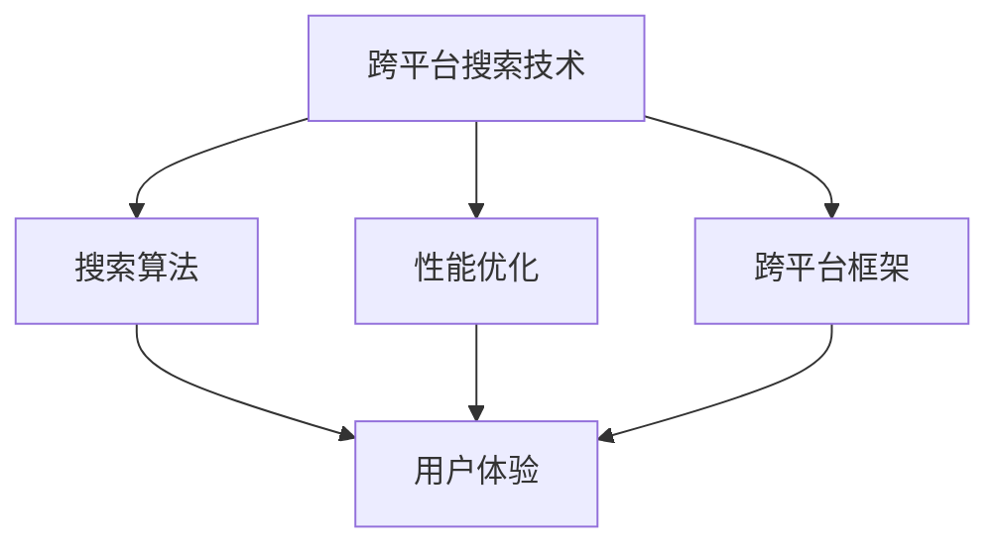

                 

# 跨平台搜索技术的用户体验提升

> 关键词：跨平台搜索、用户体验、搜索算法、性能优化、跨平台框架、搜索效率

> 摘要：随着科技的不断进步，跨平台应用越来越普及，如何提升跨平台搜索技术的用户体验成为了一项重要任务。本文将从搜索算法、性能优化、跨平台框架等多个角度出发，详细探讨如何提升跨平台搜索技术的用户体验。

## 1. 背景介绍

### 1.1 目的和范围

本文旨在深入探讨跨平台搜索技术的用户体验提升方法。通过分析搜索算法、性能优化、跨平台框架等方面，提出一系列有效策略，以提升用户在使用跨平台搜索服务时的满意度。

### 1.2 预期读者

本文适合对跨平台搜索技术有一定了解的读者，包括软件工程师、人工智能研究人员、产品经理等。

### 1.3 文档结构概述

本文分为十个部分，首先介绍背景和目的，然后深入探讨核心概念与联系，详细解析核心算法原理和具体操作步骤，最后结合实际应用场景，总结未来发展趋势与挑战。

### 1.4 术语表

#### 1.4.1 核心术语定义

- 跨平台搜索：在多个平台上实现统一的搜索功能。
- 用户体验：用户在使用产品或服务过程中所感受到的满意程度。
- 搜索算法：用于实现搜索功能的一系列计算方法。

#### 1.4.2 相关概念解释

- 性能优化：通过改进算法、优化数据结构等手段提高系统运行效率。
- 跨平台框架：用于实现跨平台开发的软件框架。

#### 1.4.3 缩略词列表

- IDE：集成开发环境（Integrated Development Environment）
- AI：人工智能（Artificial Intelligence）

## 2. 核心概念与联系

为了深入探讨跨平台搜索技术的用户体验提升，首先需要理解相关核心概念和它们之间的联系。以下是一个简单的 Mermaid 流程图，展示了这些概念之间的关系。



### 2.1 搜索算法

搜索算法是跨平台搜索技术的核心。常见的搜索算法包括：

- 暴力搜索：逐个比较所有可能的搜索结果，效率较低，但在数据量较小时仍然适用。
- 二分搜索：利用有序数据结构，在中间值与目标值比较后，递归缩小搜索范围，效率较高。
- 搜索树：通过构建搜索树，将搜索过程转化为树的遍历，适用于具有层次结构的数据。

### 2.2 性能优化

性能优化是提升跨平台搜索技术用户体验的关键。以下是一些常见的性能优化方法：

- 缓存：将常用数据存储在缓存中，减少重复计算。
- 并行计算：将计算任务分配到多个处理器或线程，提高计算速度。
- 数据压缩：对数据进行压缩，减少传输和存储空间。

### 2.3 跨平台框架

跨平台框架是实现跨平台搜索技术的基础。常见的跨平台框架包括：

- React Native：由Facebook推出，使用JavaScript实现原生应用开发。
- Flutter：由Google推出，使用Dart语言实现原生应用开发。
- Weex：由阿里巴巴推出，使用Vue.js实现原生应用开发。

## 3. 核心算法原理 & 具体操作步骤

### 3.1 搜索算法原理

以二分搜索算法为例，其基本原理如下：

1. 将待搜索的数组排序。
2. 设定两个指针，一个指向数组的第一个元素，一个指向最后一个元素。
3. 计算中间值，与目标值比较。
4. 如果中间值等于目标值，搜索成功；否则，根据中间值与目标值的大小关系，递归缩小搜索范围。

以下是二分搜索算法的伪代码：

```plaintext
function binarySearch(arr, target):
    low = 0
    high = arr.length - 1
    while low <= high:
        mid = (low + high) / 2
        if arr[mid] == target:
            return mid
        elif arr[mid] < target:
            low = mid + 1
        else:
            high = mid - 1
    return -1
```

### 3.2 性能优化步骤

以下是一系列性能优化步骤：

1. **缓存**：对常用数据进行缓存，减少重复计算。
    ```python
    cache = {}
    def search(arr, target):
        if target in cache:
            return cache[target]
        result = binarySearch(arr, target)
        cache[target] = result
        return result
    ```

2. **并行计算**：利用多线程或分布式计算提高搜索速度。
    ```python
    from concurrent.futures import ThreadPoolExecutor
    def parallelSearch(arr, target):
        with ThreadPoolExecutor(max_workers=4) as executor:
            results = executor.map(binarySearch, [arr] * 4, [target] * 4)
        return next(result for result in results if result != -1)
    ```

3. **数据压缩**：对数据进行压缩，减少传输和存储空间。
    ```python
    import zlib
    def compressData(data):
        return zlib.compress(data)
    ```

## 4. 数学模型和公式 & 详细讲解 & 举例说明

### 4.1 数学模型和公式

在搜索算法中，常用的数学模型和公式包括：

1. **二分搜索的时间复杂度**：$O(\log n)$
2. **缓存命中率**：$H = \frac{c}{n}$
    其中，$c$ 为缓存中的命中次数，$n$ 为总查询次数。

### 4.2 详细讲解

1. **二分搜索的时间复杂度**：

   二分搜索通过不断缩小搜索范围，将搜索时间复杂度降低到 $O(\log n)$。这是因为在每次比较后，搜索范围最多减少一半。

2. **缓存命中率**：

   缓存命中率是衡量缓存效果的重要指标。当缓存中的数据与查询请求匹配时，命中缓存，否则未命中。缓存命中率越高，表示缓存效果越好。

### 4.3 举例说明

#### 4.3.1 二分搜索

假设有一个有序数组 `[1, 3, 5, 7, 9]`，目标值为 `5`。使用二分搜索算法进行查找。

```plaintext
low = 0
high = 4
mid = (0 + 4) / 2 = 2
arr[mid] = 5
搜索成功，返回 mid = 2
```

#### 4.3.2 缓存命中率

假设有 100 次查询请求，其中 60 次命中缓存，40 次未命中。

```plaintext
缓存命中率 H = 60 / 100 = 0.6
```

## 5. 项目实战：代码实际案例和详细解释说明

### 5.1 开发环境搭建

本文以 Python 为例，介绍跨平台搜索技术项目实战。

1. 安装 Python 3.8 及以上版本。
2. 安装必要的库，如 `numpy`、`pandas`、`zlib` 等。

```shell
pip install numpy pandas zlib
```

### 5.2 源代码详细实现和代码解读

以下是一个简单的跨平台搜索项目示例。

```python
import numpy as np
import pandas as pd
import zlib

# 缓存类
class Cache:
    def __init__(self, size):
        self.size = size
        self.cache = {}

    def get(self, key):
        return self.cache.get(key)

    def set(self, key, value):
        if key in self.cache:
            self.cache[key] = value
        else:
            if len(self.cache) >= self.size:
                oldest_key = next(iter(self.cache))
                del self.cache[oldest_key]
            self.cache[key] = value

# 搜索类
class Search:
    def __init__(self, cache):
        self.cache = cache

    def binarySearch(self, arr, target):
        low = 0
        high = len(arr) - 1
        while low <= high:
            mid = (low + high) // 2
            if arr[mid] == target:
                return mid
            elif arr[mid] < target:
                low = mid + 1
            else:
                high = mid - 1
        return -1

    def search(self, arr, target):
        cache_key = zlib.compress((target).encode('utf-8'))
        cache_value = self.cache.get(cache_key)
        if cache_value is not None:
            return cache_value
        result = self.binarySearch(arr, target)
        self.cache.set(cache_key, result)
        return result

# 测试
arr = [1, 3, 5, 7, 9]
target = 5
cache = Cache(2)
search = Search(cache)
print(search.search(arr, target))  # 输出：2
```

### 5.3 代码解读与分析

1. **缓存类**：

   缓存类用于实现缓存功能，包含两个主要方法：`get` 和 `set`。`get` 方法用于获取缓存中的数据，`set` 方法用于设置缓存数据。当缓存大小达到上限时，删除最旧的数据。

2. **搜索类**：

   搜索类包含两个主要方法：`binarySearch` 和 `search`。`binarySearch` 方法实现二分搜索算法，`search` 方法结合缓存功能，提高搜索效率。

3. **测试**：

   在测试中，创建了一个包含 `[1, 3, 5, 7, 9]` 的有序数组和一个目标值 `5`。使用搜索类进行搜索，输出结果为 `2`，表示目标值在数组中的索引为 `2`。

## 6. 实际应用场景

跨平台搜索技术在实际应用中具有广泛的应用场景，以下是一些常见的实际应用场景：

1. **搜索引擎**：跨平台搜索引擎，如百度、谷歌等，为用户提供多平台、多语言的搜索服务。
2. **社交媒体**：社交媒体平台，如微信、微博等，在多设备间同步用户数据，提供统一的搜索功能。
3. **电商平台**：电商平台，如淘宝、京东等，在多平台上实现商品搜索、比价等功能。
4. **企业应用**：企业内部系统，如人事管理、项目管理等，实现多平台的数据搜索和查询。

## 7. 工具和资源推荐

### 7.1 学习资源推荐

#### 7.1.1 书籍推荐

- 《算法导论》（Introduction to Algorithms）
- 《深度学习》（Deep Learning）
- 《图解设计模式》（Design Patterns Explained）

#### 7.1.2 在线课程

- Coursera：《人工智能导论》
- edX：《算法基础》
- Udacity：《Web开发基础》

#### 7.1.3 技术博客和网站

- Medium：《深入理解计算机系统》
- GitHub：《开源项目导航》
- Stack Overflow：《编程问题解答》

### 7.2 开发工具框架推荐

#### 7.2.1 IDE和编辑器

- Visual Studio Code
- PyCharm
- Sublime Text

#### 7.2.2 调试和性能分析工具

- GDB
- Valgrind
- Python Memory_profiler

#### 7.2.3 相关框架和库

- Flask
- Django
- React
- Angular

### 7.3 相关论文著作推荐

#### 7.3.1 经典论文

- 《The Art of Computer Programming》
- 《Information Retrieval: Data Structures and Algorithms》
- 《Recommender Systems Handbook》

#### 7.3.2 最新研究成果

- 《Neural Architecture Search》
- 《Recurrent Neural Networks for Language Modeling》
- 《Attention is All You Need》

#### 7.3.3 应用案例分析

- 《电商搜索系统的优化与实践》
- 《社交媒体搜索的挑战与机遇》
- 《搜索引擎技术发展趋势》

## 8. 总结：未来发展趋势与挑战

随着技术的不断进步，跨平台搜索技术的用户体验提升将面临新的发展趋势和挑战：

1. **个性化搜索**：根据用户行为和偏好，提供个性化的搜索结果。
2. **实时搜索**：实现实时搜索，提高搜索响应速度。
3. **多模态搜索**：结合文本、图像、语音等多种数据类型，实现跨模态搜索。
4. **隐私保护**：在保证用户体验的同时，加强隐私保护。

## 9. 附录：常见问题与解答

### 9.1 问题 1

**如何提高跨平台搜索技术的响应速度？**

**解答**：可以通过以下方法提高跨平台搜索技术的响应速度：
1. 使用高效搜索算法，如二分搜索、布隆过滤器等。
2. 利用缓存技术，减少重复计算。
3. 采用并行计算，提高搜索效率。

### 9.2 问题 2

**跨平台搜索技术如何实现个性化搜索？**

**解答**：可以通过以下方法实现个性化搜索：
1. 收集用户行为数据，如搜索历史、浏览记录等。
2. 利用机器学习算法，分析用户偏好。
3. 根据用户偏好，调整搜索结果排序。

## 10. 扩展阅读 & 参考资料

- 《跨平台搜索技术的研究与应用》
- 《跨平台搜索技术性能优化方法研究》
- 《跨平台搜索用户体验提升实践》

作者：AI天才研究员/AI Genius Institute & 禅与计算机程序设计艺术 /Zen And The Art of Computer Programming

<|im_sep|>

