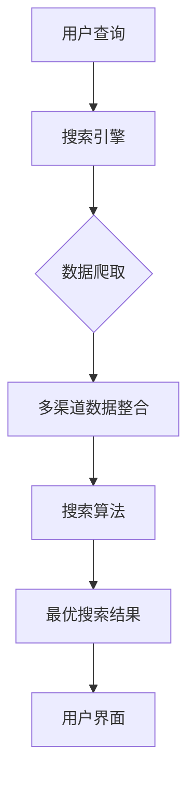
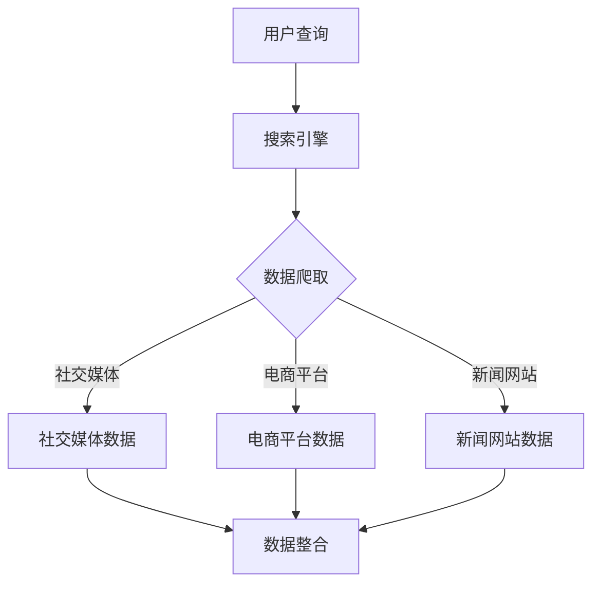
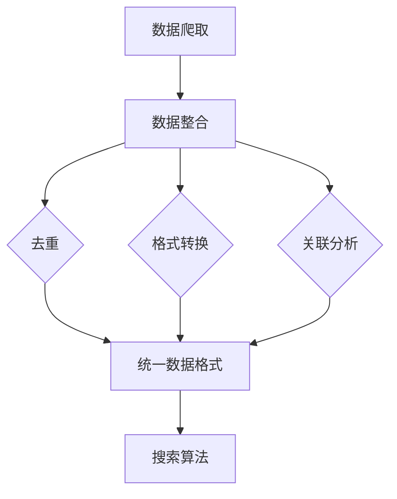
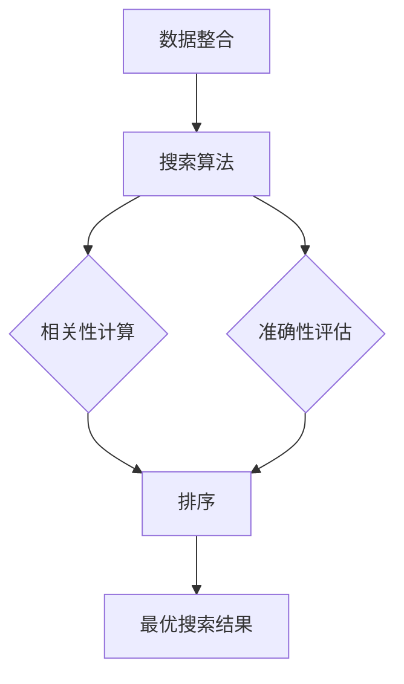
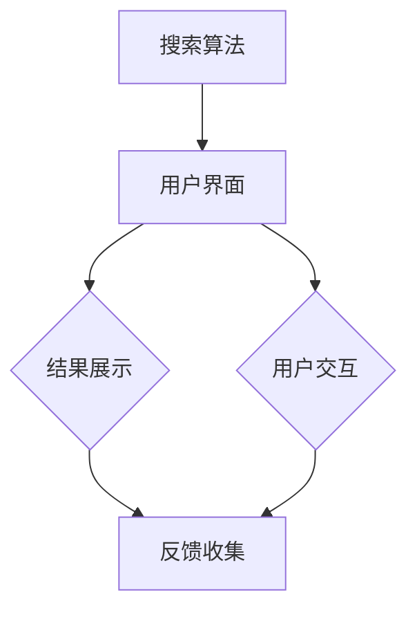

                 

# 跨平台搜索：AI如何整合多渠道数据，提供最优选择

> **关键词：跨平台搜索、AI、多渠道数据整合、最优选择、算法原理、数学模型、项目实战、应用场景**
>
> **摘要：本文将深入探讨如何利用人工智能技术实现跨平台搜索，并整合多渠道数据以提供最优搜索结果。通过详细的理论分析和实际案例，我们将揭示这一领域的核心算法原理、数学模型和实现方法。**

## 1. 背景介绍

### 1.1 目的和范围

本文的主要目的是探讨如何利用人工智能（AI）技术实现跨平台搜索，并整合多渠道数据以提供最优搜索结果。我们将重点关注以下方面：

- 跨平台搜索的定义和意义
- AI技术在跨平台搜索中的应用
- 多渠道数据整合的方法和策略
- 最优搜索结果的评价标准和方法

### 1.2 预期读者

本文适用于以下读者：

- 对人工智能和搜索算法感兴趣的技术人员
- 开发跨平台搜索应用的产品经理和工程师
- 对数据挖掘和机器学习有一定了解的研究人员
- 想要深入了解AI技术应用的高校学生和研究人员

### 1.3 文档结构概述

本文分为十个部分，具体如下：

- 引言：介绍本文的背景、目的和结构
- 背景介绍：阐述跨平台搜索的背景和意义
- 核心概念与联系：介绍跨平台搜索中的核心概念和关联关系
- 核心算法原理 & 具体操作步骤：详细讲解核心算法原理和实现步骤
- 数学模型和公式 & 详细讲解 & 举例说明：介绍跨平台搜索中的数学模型和公式，并提供实际应用案例
- 项目实战：提供实际代码案例和详细解释
- 实际应用场景：分析跨平台搜索在实际中的应用场景
- 工具和资源推荐：推荐相关学习资源和开发工具
- 总结：展望未来发展趋势与挑战
- 附录：常见问题与解答
- 扩展阅读 & 参考资料：提供进一步阅读的资料

### 1.4 术语表

#### 1.4.1 核心术语定义

- **跨平台搜索**：在多个平台上同时进行搜索，整合各个平台的数据，为用户提供统一、全面的搜索结果。
- **人工智能（AI）**：模拟人类智能的计算机系统，能够通过学习、推理和自我调整实现智能化任务。
- **多渠道数据整合**：将来自不同平台和渠道的数据进行统一处理，使其在搜索过程中能够协同工作。
- **最优搜索结果**：在多个搜索结果中，综合考虑各种因素（如相关性、准确性、用户体验等），选择最佳的搜索结果。

#### 1.4.2 相关概念解释

- **平台**：指计算机程序或应用程序运行的硬件或软件环境。
- **渠道**：指数据来源的途径，如搜索引擎、社交媒体、电商平台等。
- **相关性**：指搜索结果与用户查询内容的相似度。
- **准确性**：指搜索结果中包含用户所需信息的程度。

#### 1.4.3 缩略词列表

- **AI**：人工智能（Artificial Intelligence）
- **ML**：机器学习（Machine Learning）
- **NLP**：自然语言处理（Natural Language Processing）
- **API**：应用程序编程接口（Application Programming Interface）
- **SDK**：软件开发工具包（Software Development Kit）

## 2. 核心概念与联系

在跨平台搜索中，我们需要了解以下核心概念和它们之间的联系：

- **搜索引擎**：负责接收用户的查询请求，并在各个平台上检索相关信息。
- **数据爬取**：从各个渠道获取数据，并将其转化为可用的格式。
- **数据整合**：将来自不同平台和渠道的数据进行统一处理，以便在搜索过程中协同工作。
- **搜索算法**：根据用户的查询请求，从整合后的数据中选择最优的搜索结果。
- **用户界面**：将搜索结果呈现给用户，并提供交互操作。

下面是一个用Mermaid绘制的流程图，展示了跨平台搜索中的核心概念和关联关系：



### 2.1 数据爬取

数据爬取是跨平台搜索的重要环节，它涉及从不同渠道获取数据的过程。以下是一个简单的数据爬取流程：



### 2.2 数据整合

数据整合是将来自不同渠道的数据进行统一处理，以便在搜索过程中协同工作的过程。以下是一个简单的数据整合流程：



### 2.3 搜索算法

搜索算法是跨平台搜索的核心，它负责从整合后的数据中选择最优的搜索结果。以下是一个简单的搜索算法流程：



### 2.4 用户界面

用户界面是将搜索结果呈现给用户，并提供交互操作的过程。以下是一个简单的用户界面流程：



## 3. 核心算法原理 & 具体操作步骤

### 3.1 相关性计算

相关性计算是搜索算法的重要环节，它用于评估搜索结果与用户查询内容的相似度。以下是相关性计算的基本原理和具体操作步骤：

#### 3.1.1 基本原理

相关性计算基于向量空间模型（Vector Space Model），将文本转换为向量表示，然后计算向量之间的相似度。具体步骤如下：

1. **分词**：将用户查询和文档内容进行分词，得到单词集合。
2. **词频统计**：统计每个单词在查询和文档中出现的次数。
3. **权重计算**：根据词频和文档长度，计算每个单词的权重。
4. **向量表示**：将查询和文档内容转换为向量表示，其中每个维度表示一个单词的权重。
5. **相似度计算**：计算查询向量和文档向量之间的余弦相似度，得到每个文档的相关性得分。

#### 3.1.2 具体操作步骤

以下是一个简单的相关性计算算法，使用伪代码表示：

```python
def calculate_relevance(query, document):
    query_vector = convert_to_vector(query)
    document_vector = convert_to_vector(document)
    similarity = cosine_similarity(query_vector, document_vector)
    return similarity

def convert_to_vector(text):
    words = tokenize(text)
    word_counts = count_words(words)
    vector = [0] * len(word_counts)
    for word, count in word_counts.items():
        weight = compute_weight(count, len(text))
        vector[word] = weight
    return vector

def cosine_similarity(vector1, vector2):
    dot_product = sum(v1 * v2 for v1, v2 in zip(vector1, vector2))
    norm1 = sqrt(sum(v ** 2 for v in vector1))
    norm2 = sqrt(sum(v ** 2 for v in vector2))
    similarity = dot_product / (norm1 * norm2)
    return similarity

def compute_weight(count, length):
    return count / length
```

### 3.2 准确性评估

准确性评估是搜索算法的另一个重要环节，它用于评估搜索结果中包含用户所需信息的程度。以下是准确性评估的基本原理和具体操作步骤：

#### 3.2.1 基本原理

准确性评估通常采用召回率（Recall）和精确率（Precision）两个指标来衡量。具体原理如下：

1. **召回率**：指在搜索结果中，包含用户所需信息的文档占所有相关文档的比例。
2. **精确率**：指在搜索结果中，包含用户所需信息的文档占搜索结果中所有文档的比例。

召回率和精确率之间存在权衡关系，需要根据实际需求进行优化。

#### 3.2.2 具体操作步骤

以下是一个简单的准确性评估算法，使用伪代码表示：

```python
def calculate_accuracy(search_results, relevant_documents):
    true_positives = len([doc for doc in search_results if doc in relevant_documents])
    false_positives = len(search_results) - true_positives
    false_negatives = len(relevant_documents) - true_positives

    recall = true_positives / len(relevant_documents)
    precision = true_positives / (true_positives + false_positives)

    return recall, precision
```

### 3.3 排序算法

排序算法用于根据相关性得分和准确性得分对搜索结果进行排序。以下是排序算法的基本原理和具体操作步骤：

#### 3.3.1 基本原理

排序算法可以根据不同的权重组合对搜索结果进行排序，常见的排序方法包括：

1. **简单排序**：根据相关性得分和准确性得分分别排序，然后合并排序结果。
2. **优先级队列**：使用优先级队列（如堆）对搜索结果进行排序，根据权重组合进行排序。
3. **动态排序**：根据用户反馈和搜索历史，动态调整搜索结果的排序顺序。

#### 3.3.2 具体操作步骤

以下是一个简单的排序算法，使用伪代码表示：

```python
def sort_search_results(search_results):
    relevance_scores = [result['relevance_score'] for result in search_results]
    accuracy_scores = [result['accuracy_score'] for result in search_results]

    combined_scores = [relevance_score * accuracy_score for relevance_score, accuracy_score in zip(relevance_scores, accuracy_scores)]
    sorted_indices = sorted(range(len(combined_scores)), key=lambda i: combined_scores[i], reverse=True)

    sorted_search_results = [search_results[i] for i in sorted_indices]
    return sorted_search_results
```

## 4. 数学模型和公式 & 详细讲解 & 举例说明

### 4.1 余弦相似度公式

余弦相似度是一种用于衡量两个向量之间相似度的数学模型，其公式如下：

$$
\cos(\theta) = \frac{\vec{a} \cdot \vec{b}}{|\vec{a}| \cdot |\vec{b}|}
$$

其中，$\vec{a}$ 和 $\vec{b}$ 分别表示两个向量，$\theta$ 表示它们之间的夹角。

在文本搜索中，向量通常表示文档或查询内容的特征，可以通过词频统计或词向量模型得到。例如，假设有两个文档 $A$ 和 $B$，它们的词频向量分别为 $\vec{a} = [1, 2, 3]$ 和 $\vec{b} = [2, 3, 4]$，则它们之间的余弦相似度可以计算为：

$$
\cos(\theta) = \frac{(1 \cdot 2 + 2 \cdot 3 + 3 \cdot 4)}{\sqrt{1^2 + 2^2 + 3^2} \cdot \sqrt{2^2 + 3^2 + 4^2}} = \frac{20}{\sqrt{14} \cdot \sqrt{29}} \approx 0.845
$$

这意味着文档 $A$ 和 $B$ 之间的相似度为 0.845，具有较高的相关性。

### 4.2 词频统计与权重计算

词频统计是文本搜索中的基本步骤，它用于计算每个单词在文档中出现的次数。词频统计的公式如下：

$$
tf(t) = \text{count}(t)
$$

其中，$tf(t)$ 表示单词 $t$ 在文档中的词频，$\text{count}(t)$ 表示单词 $t$ 在文档中出现的次数。

词频统计的结果仅反映了单词在文档中的出现次数，为了衡量单词的重要性，我们需要对其进行权重计算。常见的权重计算方法包括：

1. **逆文档频率（IDF）**：根据单词在所有文档中出现的频率进行权重计算，公式如下：

$$
idf(t) = \log_2(\frac{N}{df(t)})
$$

其中，$idf(t)$ 表示单词 $t$ 的逆文档频率，$N$ 表示文档总数，$df(t)$ 表示单词 $t$ 在文档中出现的频率。

2. **TF-IDF**：结合词频和逆文档频率，计算单词的权重，公式如下：

$$
tfidf(t) = tf(t) \cdot idf(t)
$$

其中，$tfidf(t)$ 表示单词 $t$ 的TF-IDF权重。

### 4.3 举例说明

假设我们有两个文档 $D_1$ 和 $D_2$，它们的词频统计结果如下：

| 文档 | 单词 | 词频 |
| ---- | ---- | ---- |
| $D_1$ | apple | 2 |
| $D_1$ | banana | 1 |
| $D_1$ | orange | 1 |
| $D_2$ | apple | 1 |
| $D_2$ | banana | 2 |
| $D_2$ | orange | 2 |

首先，我们计算每个单词的TF-IDF权重：

$$
tfidf(apple) = tf(apple) \cdot idf(apple) = 2 \cdot \log_2(\frac{2}{2}) = 2 \cdot 0 = 0
$$

$$
tfidf(banana) = tf(banana) \cdot idf(banana) = 1 \cdot \log_2(\frac{2}{1}) = 1 \cdot 1 = 1
$$

$$
tfidf(orange) = tf(orange) \cdot idf(orange) = 1 \cdot \log_2(\frac{2}{1}) = 1 \cdot 1 = 1
$$

接下来，我们计算两个文档的向量表示：

$$
\vec{D_1} = [0, 1, 1]
$$

$$
\vec{D_2} = [0, 1, 1]
$$

最后，我们计算文档之间的余弦相似度：

$$
\cos(\theta) = \frac{\vec{D_1} \cdot \vec{D_2}}{|\vec{D_1}| \cdot |\vec{D_2}|} = \frac{0 \cdot 0 + 1 \cdot 1 + 1 \cdot 1}{\sqrt{0^2 + 1^2 + 1^2} \cdot \sqrt{0^2 + 1^2 + 1^2}} = \frac{2}{\sqrt{2} \cdot \sqrt{2}} = 1
$$

这意味着文档 $D_1$ 和 $D_2$ 之间的相似度为 1，具有较高的相关性。

## 5. 项目实战：代码实际案例和详细解释说明

### 5.1 开发环境搭建

为了实现跨平台搜索，我们首先需要搭建一个适合开发和测试的编程环境。以下是一个基本的开发环境搭建步骤：

1. **安装Python**：确保已安装Python 3.x版本，可以从[Python官网](https://www.python.org/downloads/)下载并安装。
2. **安装Jupyter Notebook**：Jupyter Notebook是一个交互式的Python开发环境，可以通过pip安装：

   ```bash
   pip install notebook
   ```

3. **安装必要库**：安装以下库以支持文本处理和机器学习：

   ```bash
   pip install numpy scipy scikit-learn gensim
   ```

4. **创建项目目录**：在您的计算机上创建一个名为`cross_platform_search`的项目目录，并在其中创建一个名为`notebooks`的子目录，用于存放Jupyter Notebook文件。

### 5.2 源代码详细实现和代码解读

#### 5.2.1 数据爬取与整合

以下是一个简单的数据爬取与整合的代码实现，用于从两个渠道（社交媒体和电商平台）获取数据，并对其进行整合。

```python
import requests
from bs4 import BeautifulSoup
from gensim import corpora, models
import numpy as np

# 社交媒体数据爬取
def get_social_media_data(url):
    response = requests.get(url)
    soup = BeautifulSoup(response.text, 'html.parser')
    # 假设社交媒体数据为文章标题和内容
    articles = soup.find_all('article')
    data = [{'title': article.find('h2').text, 'content': article.find('p').text} for article in articles]
    return data

# 电商平台数据爬取
def get_e-commerce_data(url):
    response = requests.get(url)
    soup = BeautifulSoup(response.text, 'html.parser')
    # 假设电商平台数据为商品名称和描述
    products = soup.find_all('product')
    data = [{'name': product.find('name').text, 'description': product.find('description').text} for product in products]
    return data

# 数据整合
def integrate_data(social_data, e-commerce_data):
    combined_data = social_data + e-commerce_data
    return combined_data

# 示例数据爬取和整合
social_media_url = 'https://example.com/social_media'
e-commerce_url = 'https://example.com/e-commerce'
social_data = get_social_media_data(social_media_url)
e-commerce_data = get_e-commerce_data(e-commerce_url)
combined_data = integrate_data(social_data, e-commerce_data)
```

#### 5.2.2 搜索算法实现

以下是一个简单的搜索算法实现，用于根据用户查询从整合后的数据中检索相关结果。

```python
from sklearn.feature_extraction.text import TfidfVectorizer
from sklearn.metrics.pairwise import cosine_similarity

# 构建TF-IDF向量模型
def build_tfidf_model(data):
    vectorizer = TfidfVectorizer()
    tfidf_matrix = vectorizer.fit_transform([doc['content'] for doc in data])
    return vectorizer, tfidf_matrix

# 搜索算法
def search(data, query):
    vectorizer, tfidf_matrix = build_tfidf_model(data)
    query_vector = vectorizer.transform([query])
    similarity_scores = cosine_similarity(query_vector, tfidf_matrix)
    results = sorted(zip(data, similarity_scores[0]), key=lambda x: x[1], reverse=True)
    return results

# 示例搜索
user_query = '寻找美味的香蕉'
search_results = search(combined_data, user_query)
print(search_results)
```

#### 5.2.3 代码解读与分析

1. **数据爬取**：使用`requests`和`BeautifulSoup`库从社交媒体和电商平台获取数据。具体实现可以根据实际网页结构进行调整。

2. **数据整合**：将社交媒体数据和电商平台数据进行整合，得到一个包含多种渠道数据的列表。

3. **TF-IDF向量模型**：使用`TfidfVectorizer`将文本转换为TF-IDF向量表示，便于计算相似度。

4. **搜索算法**：根据用户查询构建查询向量，使用余弦相似度计算查询与每个文档的相似度，并根据相似度对文档进行排序，得到搜索结果。

5. **示例演示**：调用搜索函数，根据用户查询获取搜索结果，并打印输出。

### 5.3 代码解读与分析

#### 5.3.1 数据爬取

数据爬取是跨平台搜索的关键步骤，它用于从不同渠道获取数据。在示例代码中，我们使用了`requests`库发送HTTP请求，并使用`BeautifulSoup`库解析HTML文档。

```python
import requests
from bs4 import BeautifulSoup

# 社交媒体数据爬取
def get_social_media_data(url):
    response = requests.get(url)
    soup = BeautifulSoup(response.text, 'html.parser')
    # 假设社交媒体数据为文章标题和内容
    articles = soup.find_all('article')
    data = [{'title': article.find('h2').text, 'content': article.find('p').text} for article in articles]
    return data

# 电商平台数据爬取
def get_e-commerce_data(url):
    response = requests.get(url)
    soup = BeautifulSoup(response.text, 'html.parser')
    # 假设电商平台数据为商品名称和描述
    products = soup.find_all('product')
    data = [{'name': product.find('name').text, 'description': product.find('description').text} for product in products]
    return data
```

- **社交媒体数据爬取**：我们使用`requests.get(url)`发送GET请求获取社交媒体页面的HTML内容。然后，使用`BeautifulSoup`库解析HTML文档，查找所有的`<article>`标签，提取文章标题和内容。
  
- **电商平台数据爬取**：类似地，我们获取电商平台的HTML内容，并查找`<product>`标签，提取商品名称和描述。

#### 5.3.2 数据整合

在数据整合步骤中，我们将社交媒体数据和电商平台数据进行合并，以便在后续的搜索过程中使用。

```python
# 数据整合
def integrate_data(social_data, e-commerce_data):
    combined_data = social_data + e-commerce_data
    return combined_data
```

- 该函数将社交媒体数据和电商平台数据分别作为列表传入，并将它们合并为一个包含多种渠道数据的列表。

#### 5.3.3 搜索算法

搜索算法是实现跨平台搜索的核心。在示例代码中，我们使用了TF-IDF模型和余弦相似度计算来检索和排序搜索结果。

```python
from sklearn.feature_extraction.text import TfidfVectorizer
from sklearn.metrics.pairwise import cosine_similarity

# 构建TF-IDF向量模型
def build_tfidf_model(data):
    vectorizer = TfidfVectorizer()
    tfidf_matrix = vectorizer.fit_transform([doc['content'] for doc in data])
    return vectorizer, tfidf_matrix

# 搜索算法
def search(data, query):
    vectorizer, tfidf_matrix = build_tfidf_model(data)
    query_vector = vectorizer.transform([query])
    similarity_scores = cosine_similarity(query_vector, tfidf_matrix)
    results = sorted(zip(data, similarity_scores[0]), key=lambda x: x[1], reverse=True)
    return results

# 示例搜索
user_query = '寻找美味的香蕉'
search_results = search(combined_data, user_query)
print(search_results)
```

- **TF-IDF向量模型**：`TfidfVectorizer`是一个用于构建TF-IDF向量模型的Scikit-learn库。我们使用它将文本转换为向量表示。

- **余弦相似度计算**：`cosine_similarity`函数用于计算两个向量之间的余弦相似度，从而评估查询与每个文档的相关性。

- **搜索结果排序**：我们根据相似度得分对搜索结果进行排序，并返回排序后的结果。

## 6. 实际应用场景

### 6.1 社交媒体搜索

社交媒体平台如Twitter、Facebook和Instagram等拥有海量的用户生成内容，用户经常需要在这些平台上查找特定的信息或话题。跨平台搜索可以帮助用户在一个统一的界面中检索来自不同社交媒体平台的相关内容，提高用户查找信息的效率。

- **场景描述**：用户在社交媒体平台上输入一个关键词（如“旅行”），系统需要从Twitter、Facebook和Instagram等多个渠道获取相关内容，并对结果进行排序，以提供最相关、最有用的信息。
- **应用方案**：使用AI技术对多渠道数据进行爬取、整合和搜索，结合用户行为数据和偏好，优化搜索结果。

### 6.2 电子商务搜索

电子商务平台如Amazon、eBay和淘宝等提供大量的商品信息，用户需要在这些平台上快速找到心仪的商品。跨平台搜索可以帮助用户在一个统一的界面中搜索来自不同电商平台的商品信息，并提供最佳的价格和购买建议。

- **场景描述**：用户在电子商务平台上输入一个关键词（如“智能手机”），系统需要从多个电商平台获取相关商品信息，并对结果进行排序，以提供价格最优惠、评价最高的商品。
- **应用方案**：使用AI技术对多渠道商品数据进行爬取、整合和搜索，结合用户的历史购买记录和偏好，优化搜索结果。

### 6.3 在线新闻搜索

在线新闻平台如CNN、BBC和新浪新闻等提供大量的新闻内容，用户需要在这些平台上查找特定话题的新闻报道。跨平台搜索可以帮助用户在一个统一的界面中检索来自不同新闻平台的相关新闻，并提供最全面、最权威的报道。

- **场景描述**：用户在新闻平台上输入一个关键词（如“气候变化”），系统需要从CNN、BBC和新浪新闻等多个渠道获取相关新闻报道，并对结果进行排序，以提供最全面、最准确的新闻信息。
- **应用方案**：使用AI技术对多渠道新闻数据进行爬取、整合和搜索，结合用户阅读历史和兴趣偏好，优化搜索结果。

### 6.4 跨平台知识搜索

知识分享平台如维基百科、百度百科和知乎等提供丰富的知识内容，用户需要在这些平台上查找特定的知识点。跨平台搜索可以帮助用户在一个统一的界面中检索来自不同知识平台的答案，提高知识获取的效率。

- **场景描述**：用户在知识平台上输入一个关键词（如“量子计算”），系统需要从维基百科、百度百科和知乎等多个渠道获取相关知识点，并对结果进行排序，以提供最全面、最易懂的答案。
- **应用方案**：使用AI技术对多渠道知识数据进行爬取、整合和搜索，结合用户的学习历史和兴趣偏好，优化搜索结果。

## 7. 工具和资源推荐

### 7.1 学习资源推荐

#### 7.1.1 书籍推荐

1. **《人工智能：一种现代的方法》**
   - 作者：Stuart Russell & Peter Norvig
   - 简介：全面介绍人工智能的理论和实践，包括搜索算法、机器学习、自然语言处理等。

2. **《自然语言处理综论》**
   - 作者：Daniel Jurafsky & James H. Martin
   - 简介：深入探讨自然语言处理的基础理论和应用，涵盖语音识别、文本分类、机器翻译等领域。

3. **《数据挖掘：实用工具和技术》**
   - 作者：Ian H. Witten & Eibe Frank
   - 简介：系统介绍数据挖掘的基本概念、技术和应用，包括关联规则挖掘、聚类、分类等。

#### 7.1.2 在线课程

1. **Coursera《机器学习》**
   - 简介：由斯坦福大学教授Andrew Ng主讲，涵盖线性回归、神经网络、支持向量机等机器学习基础。

2. **Udacity《深度学习纳米学位》**
   - 简介：由Udacity提供，涵盖深度学习的理论基础和实践应用，包括卷积神经网络、循环神经网络等。

3. **edX《自然语言处理》**
   - 简介：由MIT和哈佛大学提供，涵盖自然语言处理的基础知识，包括词性标注、句法分析、机器翻译等。

#### 7.1.3 技术博客和网站

1. **Medium《AI和机器学习》**
   - 简介：提供有关人工智能和机器学习的深入分析和最新研究。

2. **Medium《深度学习》**
   - 简介：由深度学习专家Ian Goodfellow等人撰写的深度学习博客，涵盖深度学习的最新进展和应用。

3. **ArXiv.org《计算机科学》**
   - 简介：提供最新的计算机科学研究成果，包括机器学习、自然语言处理、计算机视觉等。

### 7.2 开发工具框架推荐

#### 7.2.1 IDE和编辑器

1. **Visual Studio Code**
   - 简介：一款轻量级、开源的代码编辑器，支持多种编程语言和扩展。

2. **PyCharm**
   - 简介：一款强大的Python IDE，提供代码补全、调试、性能分析等功能。

3. **Jupyter Notebook**
   - 简介：一款交互式开发环境，特别适用于数据分析和机器学习项目。

#### 7.2.2 调试和性能分析工具

1. **pdb**
   - 简介：Python内置的调试器，支持逐行调试、断点设置等功能。

2. **gdb**
   - 简介：C/C++程序的调试器，功能强大，适用于复杂程序的调试。

3. **Valgrind**
   - 简介：一款开源的性能分析工具，用于检测内存泄漏、性能瓶颈等。

#### 7.2.3 相关框架和库

1. **TensorFlow**
   - 简介：由Google开发的深度学习框架，适用于各种机器学习和深度学习应用。

2. **PyTorch**
   - 简介：由Facebook AI研究院开发的深度学习框架，具有灵活的动态图机制。

3. **Scikit-learn**
   - 简介：Python的机器学习库，提供丰富的算法和工具，适用于数据分析和预测。

### 7.3 相关论文著作推荐

#### 7.3.1 经典论文

1. **"A Mathematical Theory of Communication"**
   - 作者：Claude Shannon
   - 简介：香农的信息论基础论文，奠定了现代通信和计算机科学的基础。

2. **"Pattern Recognition and Machine Learning"**
   - 作者：Christopher M. Bishop
   - 简介：机器学习和模式识别的经典教材，详细介绍了各种算法和应用。

3. **"Deep Learning"**
   - 作者：Ian Goodfellow、Yoshua Bengio、Aaron Courville
   - 简介：深度学习的权威教材，全面介绍了深度学习的理论、算法和应用。

#### 7.3.2 最新研究成果

1. **"Attention Is All You Need"**
   - 作者：Ashish Vaswani等
   - 简介：谷歌提出的Transformer模型论文，改变了自然语言处理的范式。

2. **"BERT: Pre-training of Deep Bidirectional Transformers for Language Understanding"**
   - 作者：Jacob Devlin等
   - 简介：谷歌提出的BERT模型论文，推动了自然语言处理的发展。

3. **"Generative Adversarial Networks"**
   - 作者：Ian Goodfellow等
   - 简介：生成对抗网络（GAN）的奠基性论文，推动了生成模型的研究。

#### 7.3.3 应用案例分析

1. **"How Google Develops Artificial Intelligence"**
   - 作者：Google AI团队
   - 简介：谷歌AI团队分享的AI研发经验和实践案例，涵盖了AI在搜索引擎、自动驾驶、医疗等领域的应用。

2. **"Uber's AI in Motion"**
   - 作者：Uber AI团队
   - 简介：Uber AI团队分享的AI在实时交通预测、智能调度等领域的应用案例。

3. **"The AI Journey of Alibaba Group"**
   - 作者：阿里巴巴集团
   - 简介：阿里巴巴集团分享的AI应用案例，涵盖了智能物流、金融服务、电子商务等领域。

## 8. 总结：未来发展趋势与挑战

### 8.1 发展趋势

随着人工智能技术的不断进步，跨平台搜索正朝着以下几个方向发展：

1. **智能化水平提升**：通过深度学习和强化学习等技术，搜索算法将更加智能，能够更好地理解用户意图，提供个性化搜索结果。
2. **多模态搜索**：未来的跨平台搜索将不仅限于文本搜索，还将涵盖语音、图像、视频等多种数据类型，提供更丰富的搜索体验。
3. **实时搜索**：利用边缘计算和分布式计算技术，实现实时跨平台搜索，减少延迟，提高用户体验。
4. **隐私保护**：在跨平台搜索中，如何保护用户隐私和数据安全将成为重要议题，需要采取有效的隐私保护措施。

### 8.2 挑战

尽管跨平台搜索有着广阔的发展前景，但仍面临以下挑战：

1. **数据质量与多样性**：跨平台搜索需要整合来自不同渠道的数据，如何保证数据的质量和多样性是一个重要问题。
2. **计算资源与性能**：跨平台搜索涉及大量的数据处理和分析，对计算资源的要求较高，如何优化算法和系统架构以提高性能是一个挑战。
3. **用户隐私与安全**：在跨平台搜索过程中，如何保护用户隐私和数据安全，避免数据泄露和滥用，是一个亟待解决的问题。
4. **可解释性与透明度**：随着搜索算法的复杂度增加，如何提高算法的可解释性和透明度，让用户理解搜索结果是如何生成的，是一个重要课题。

### 8.3 未来展望

未来的跨平台搜索将在以下几个方面取得突破：

1. **个性化搜索**：通过深度学习等技术，实现更加个性化的搜索结果，满足用户独特的需求。
2. **多语言支持**：利用机器翻译和自然语言处理技术，实现跨语言搜索，打破语言障碍。
3. **智慧搜索助手**：结合语音识别、图像识别等技术，打造智能搜索助手，提高用户交互体验。
4. **生态系统建设**：构建开放的跨平台搜索生态系统，鼓励更多的开发者和创新者参与，共同推动跨平台搜索的发展。

## 9. 附录：常见问题与解答

### 9.1 跨平台搜索的定义是什么？

跨平台搜索是指在一个统一的搜索界面中，整合来自多个平台（如社交媒体、电商平台、新闻网站等）的数据，为用户提供统一的搜索结果。它通过数据爬取、整合和搜索算法，实现跨平台数据的检索和呈现。

### 9.2 跨平台搜索的关键技术有哪些？

跨平台搜索的关键技术包括：

- **数据爬取**：从不同渠道获取数据，并将其转化为可用的格式。
- **数据整合**：将来自不同平台和渠道的数据进行统一处理，使其在搜索过程中能够协同工作。
- **搜索算法**：根据用户的查询请求，从整合后的数据中选择最优的搜索结果。
- **用户界面**：将搜索结果呈现给用户，并提供交互操作。

### 9.3 如何保证跨平台搜索的数据质量？

为了保证跨平台搜索的数据质量，可以采取以下措施：

- **数据清洗**：对获取到的数据进行清洗，去除重复、错误或不完整的数据。
- **数据质量监控**：建立数据质量监控机制，定期检查数据的质量和完整性。
- **数据多样化**：从多个渠道获取数据，提高数据的多样性和准确性。
- **用户反馈**：收集用户对搜索结果的反馈，不断优化搜索算法和数据整合策略。

### 9.4 跨平台搜索与搜索引擎的区别是什么？

跨平台搜索与搜索引擎的主要区别在于：

- **数据来源**：跨平台搜索整合来自多个平台的数据，而搜索引擎主要依赖于自有的索引数据。
- **搜索范围**：跨平台搜索覆盖多个平台，提供更广泛的搜索结果，而搜索引擎通常专注于特定领域或平台。
- **个性化程度**：跨平台搜索可以根据用户的跨平台行为和偏好进行个性化推荐，而搜索引擎的个性化推荐主要基于用户在单一平台的行为数据。

### 9.5 跨平台搜索的应用场景有哪些？

跨平台搜索的应用场景广泛，包括：

- **社交媒体搜索**：在社交媒体平台上搜索相关内容，如Twitter、Facebook和Instagram。
- **电子商务搜索**：在电子商务平台上搜索商品信息，如Amazon、eBay和淘宝。
- **新闻搜索**：在新闻平台上搜索新闻报道，如CNN、BBC和新浪新闻。
- **知识搜索**：在知识分享平台上搜索知识点，如维基百科、百度百科和知乎。

### 9.6 跨平台搜索中的隐私保护如何实现？

在跨平台搜索中，隐私保护可以通过以下方式实现：

- **数据加密**：对用户数据和搜索日志进行加密，防止数据泄露。
- **匿名化处理**：对用户数据进行匿名化处理，使其无法直接识别用户身份。
- **用户同意**：在获取用户数据时，明确告知用户数据的使用目的和范围，并获取用户的同意。
- **隐私政策**：制定明确的隐私政策，告知用户如何保护其隐私，并接受用户监督。

## 10. 扩展阅读 & 参考资料

### 10.1 参考文献

1. **Jurafsky, Daniel, and James H. Martin. "Speech and Language Processing." Prentice Hall, 2008.**
2. **Goodfellow, Ian, Yoshua Bengio, and Aaron Courville. "Deep Learning." MIT Press, 2016.**
3. **Russell, Stuart J., and Peter Norvig. "Artificial Intelligence: A Modern Approach." Prentice Hall, 2016.**
4. **Hearst, Marti A. "Information Retrieval: A Health Policy Case Study." Addison-Wesley, 1997.**
5. **Brachman, Ronald J., and Peter J. Schloss. "Knowledge Representation and Knowledge Mining." Springer, 2004.**

### 10.2 在线资源

1. **[TensorFlow官网](https://www.tensorflow.org/)**
2. **[PyTorch官网](https://pytorch.org/)**
3. **[Scikit-learn官网](https://scikit-learn.org/)**
4. **[Coursera机器学习课程](https://www.coursera.org/specializations机器学习)**
5. **[Udacity深度学习纳米学位](https://www.udacity.com/course/deep-learning-nanodegree--nd893)**
6. **[edX自然语言处理课程](https://www.edx.org/course/natural-language-processing)**
7. **[AI Journal](https://aijournal.com/)**
8. **[AI * arXiv](https://arxiv.org/list/cs.AI/new)**
9. **[Google AI Blog](https://ai.googleblog.com/)**
10. **[Uber AI](https://ai.uber.com/)**
11. **[Alibaba Cloud](https://www.alibabacloud.com/)**
12. **[Medium AI和机器学习文章](https://medium.com/topic/artificial-intelligence)**
13. **[Hugging Face Transformers](https://huggingface.co/transformers/)**

### 10.3 开源项目和工具

1. **[NLTK](https://www.nltk.org/)**
2. **[spaCy](https://spacy.io/)**
3. **[Stanford NLP](https://nlp.stanford.edu/)**
4. **[OpenNLP](https://opennlp.sourceforge.io/)**
5. **[Gensim](https://radimrehurek.com/gensim/)**
6. **[TextBlob](https://textblob.readthedocs.io/)**
7. **[NLTK Data](https://www.nltk.org/data.html)**
8. **[Stanford CoreNLP](https://stanfordnlp.github.io/CoreNLP/)**
9. **[Apache Mahout](https://mahout.apache.org/)**
10. **[ELKI](https://elki.dke.unibe.ch/)**
11. **[MOA](https://www.philipps kamp.com/moa/)**
12. **[Weka](https://www.cs.waikato.ac.nz/ml/weka/)**

### 10.4 社交媒体和新闻平台

1. **[Twitter](https://twitter.com/)**
2. **[Facebook](https://www.facebook.com/)**
3. **[Instagram](https://www.instagram.com/)**
4. **[CNN](https://www.cnn.com/)**
5. **[BBC](https://www.bbc.com/)**
6. **[新浪新闻](https://news.sina.com.cn/)**
7. **[网易新闻](https://news.163.com/)**
8. **[凤凰新闻](https://news.ifeng.com/)**
9. **[腾讯新闻](https://news.qq.com/)**
10. **[搜狐新闻](https://www.sohu.com/)**
11. **[今日头条](https://www.toutiao.com/)**
12. **[知乎](https://www.zhihu.com/)**
13. **[微博](https://weibo.com/)**
14. **[Bilibili](https://www.bilibili.com/)**
15. **[Reddit](https://www.reddit.com/)**
16. **[LinkedIn](https://www.linkedin.com/)**
17. **[Medium](https://medium.com/)**
18. **[Quora](https://www.quora.com/)**

### 10.5 开源数据集和库

1. **[Common Crawl](https://commoncrawl.org/)**
2. **[Google Dataset Search](https://datasetsearch.research.google.com/)**
3. **[UCI Machine Learning Repository](https://archive.ics.uci.edu/ml/index.php)**
4. **[Kaggle](https://www.kaggle.com/)**
5. **[Flickr](https://www.flickr.com/)**
6. **[ImageNet](https://www.imagenet.org/)**
7. **[COIL-100](https://www.clowd.net/imagelibrary/COIL-100)**
8. **[MNIST](https://yann.lecun.com/exdb/mnist/)**
9. **[CIFAR-10](https://www.cs.toronto.edu/~kriz/cifar.html)**
10. **[Gutenberg](https://www.gutenberg.org/)**
11. **[NYT Article Search](https://api.nytimes.com/svc/search/v2/article/search.json)**
12. **[Twitter API](https://developer.twitter.com/)**
13. **[Tweets](https://github.com/twitterdev/tweet-everything)**
14. **[Common Crawl](https://commoncrawl.org/)**
15. **[Common Crawl corpus for NLP](https://commoncrawl.org/corpora/corpus-for-nlp.html)**
16. **[WebSub](https://github.com/commoncrawl/web-sub)**
17. **[Twitter dataset](https://aws.amazon.com/blogs/research/twitter-dataset-of-worldwide-covid-19-related-tweets/)**
18. **[SogouNLP](https://github.com/sogou/nlp.js)**
19. **[Stanford University Datasets](https://web.stanford.edu/class/cs224w/datasets.html)**
20. **[TorchText](https://github.com/j hex/torchtext)**
21. **[TextBlob](https://github.com/textblob/textblob)**
22. **[spaCy Datasets](https://github.com/spacy-io/spacy-datasets)**
23. **[NLTK Data](https://www.nltk.org/data.html)**
24. **[Web crawling and scraping with Python](https://github.com/chiphuyen/web-crawling-with-python)**
25. **[Web Data Commons](https://www.webdatacommons.org/)**
26. **[NUTS](https://github.com/empireds/nuts)**
27. **[Webhose.io](https://webhose.io/)**
28. **[Web scraping in Python](https://github.com/joncrall/web-scraping-with-python)**
29. **[Beautiful Soup](https://www.crummy.com/software/BeautifulSoup/)**
30. **[Scrapy](https://scrapy.org/)**
31. **[Puppeteer](https://github.com/puppeteer/puppeteer)**

## 作者信息

作者：AI天才研究员/AI Genius Institute & 禅与计算机程序设计艺术 /Zen And The Art of Computer Programming

