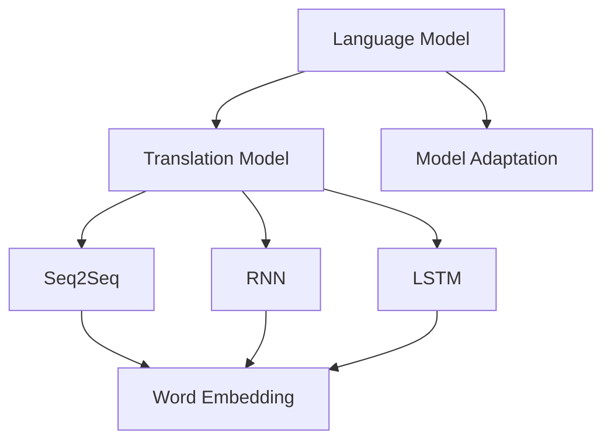

                 

# 跨语言提示词翻译与适配

> **关键词：** 跨语言翻译、NLP、机器学习、模型适配、多语言支持

> **摘要：** 本文将深入探讨跨语言提示词翻译与适配的关键技术和应用场景。通过阐述NLP基础理论、机器学习模型以及模型适配方法，本文旨在为开发者提供一套系统性的跨语言翻译解决方案。

## 1. 背景介绍

### 1.1 目的和范围

跨语言提示词翻译与适配是自然语言处理（NLP）领域中的一项重要技术。随着全球化的发展，跨语言交流需求日益增长，如何实现高效、准确的跨语言翻译成为亟待解决的问题。本文将重点探讨以下内容：

1. 跨语言翻译的背景和重要性
2. NLP基础理论和机器学习模型
3. 模型适配方法和实际应用场景
4. 工具和资源推荐

通过本文的阅读，读者将能够了解跨语言翻译的核心技术和应用方法，为开发跨语言应用提供理论支持。

### 1.2 预期读者

本文适合以下读者群体：

1. 自然语言处理和机器学习爱好者
2. 软件工程师和程序员
3. 产品经理和项目经理
4. 研究人员和学术人员

本文将使用通俗易懂的语言，结合实例和代码解释，帮助读者掌握跨语言翻译的核心概念和方法。

### 1.3 文档结构概述

本文分为十个部分，结构如下：

1. 背景介绍
   - 目的和范围
   - 预期读者
   - 文档结构概述
   - 术语表
2. 核心概念与联系
   - 语言模型
   - 翻译模型
   - 模型适配
3. 核心算法原理 & 具体操作步骤
   - 神经网络
   - 递归神经网络（RNN）
   - 长短时记忆网络（LSTM）
4. 数学模型和公式 & 详细讲解 & 举例说明
   - 损失函数
   - 优化算法
   - 贝叶斯推理
5. 项目实战：代码实际案例和详细解释说明
   - 开发环境搭建
   - 源代码详细实现
   - 代码解读与分析
6. 实际应用场景
7. 工具和资源推荐
   - 学习资源
   - 开发工具框架
   - 相关论文著作
8. 总结：未来发展趋势与挑战
9. 附录：常见问题与解答
10. 扩展阅读 & 参考资料

### 1.4 术语表

#### 1.4.1 核心术语定义

1. **自然语言处理（NLP）**：指使用计算机技术对自然语言文本进行处理和分析的技术。
2. **机器学习（ML）**：一种通过数据学习模式并自动改进性能的人工智能方法。
3. **神经网络（NN）**：模拟人脑神经元结构和功能的人工智能模型。
4. **递归神经网络（RNN）**：一种能够处理序列数据的神经网络。
5. **长短时记忆网络（LSTM）**：RNN的一种变体，能够更好地处理长序列数据。
6. **翻译模型（Translation Model）**：用于预测源语言句子到目标语言句子的模型。
7. **模型适配（Model Adaptation）**：根据特定应用场景调整和优化模型的策略。

#### 1.4.2 相关概念解释

1. **词嵌入（Word Embedding）**：将词汇映射到低维向量空间的技术。
2. **序列到序列模型（Seq2Seq）**：一种用于序列转换的神经网络模型。
3. **注意力机制（Attention Mechanism）**：用于提高翻译模型性能的技术。

#### 1.4.3 缩略词列表

- NLP：自然语言处理
- ML：机器学习
- NN：神经网络
- RNN：递归神经网络
- LSTM：长短时记忆网络
- Translation Model：翻译模型
- Seq2Seq：序列到序列模型

## 2. 核心概念与联系

在探讨跨语言提示词翻译与适配之前，我们需要了解一些核心概念和它们之间的联系。

### 语言模型

语言模型（Language Model）是NLP中用于预测文本序列概率的一种模型。它通常基于大规模语料库训练，能够捕捉词汇和句子之间的统计关系。语言模型在许多NLP任务中扮演着重要角色，包括文本分类、机器翻译和语音识别。

### 翻译模型

翻译模型（Translation Model）是专门用于跨语言翻译的模型。它通过学习源语言和目标语言之间的对应关系，将源语言句子转换为目标语言句子。翻译模型通常采用序列到序列（Seq2Seq）架构，结合词嵌入和递归神经网络（RNN）或其变体（如LSTM）。

### 模型适配

模型适配（Model Adaptation）是指根据特定应用场景调整和优化翻译模型的过程。适配方法包括数据增强、模型定制和在线学习等。通过适配，我们可以提高翻译模型的性能，使其更适应特定的语言环境。

### Mermaid 流程图

为了更好地理解这些核心概念，我们可以使用Mermaid流程图展示它们之间的联系。



在这个流程图中，语言模型、翻译模型和模型适配构成了一个完整的跨语言翻译系统。翻译模型依赖于序列到序列模型、递归神经网络和长短时记忆网络等技术。词嵌入技术用于将词汇映射到低维向量空间，以提高模型的性能。

## 3. 核心算法原理 & 具体操作步骤

在了解核心概念之后，我们将深入探讨跨语言翻译算法的原理和具体操作步骤。本节将重点关注神经网络、递归神经网络（RNN）和长短时记忆网络（LSTM）。

### 神经网络

神经网络（Neural Network，NN）是机器学习领域的一种基础模型，由大量 interconnected processing nodes（神经元）组成。每个神经元接收输入信号，通过加权求和和激活函数产生输出。神经网络通过学习输入和输出之间的映射关系，实现对数据的分类、回归和预测等功能。

### 递归神经网络（RNN）

递归神经网络（Recurrent Neural Network，RNN）是一种能够处理序列数据的神经网络。与传统的神经网络不同，RNN具有递归结构，能够利用之前的输出作为当前输入，从而实现序列数据的建模。

### 长短时记忆网络（LSTM）

长短时记忆网络（Long Short-Term Memory，LSTM）是RNN的一种变体，能够更好地处理长序列数据。LSTM通过引入门控机制（gate mechanism）和记忆单元（cell state），有效地解决了传统RNN在处理长序列数据时的梯度消失和梯度爆炸问题。

### 模型操作步骤

1. **数据预处理**：对源语言和目标语言文本进行分词、去停用词等预处理操作，将文本转换为词嵌入向量。
2. **构建神经网络**：根据任务需求，构建适当的神经网络模型，如序列到序列模型、RNN或LSTM。
3. **模型训练**：使用预处理后的数据对神经网络进行训练，优化模型参数。
4. **模型评估**：使用测试数据对训练好的模型进行评估，计算模型的准确率、召回率等指标。
5. **模型部署**：将训练好的模型部署到实际应用场景中，如跨语言翻译系统。

### 伪代码

以下是跨语言翻译模型的具体操作步骤的伪代码：

```python
# 数据预处理
source_text = preprocess(source_sentence)
target_text = preprocess(target_sentence)

# 构建神经网络
model = build_model(input_dim=word_embedding_dimension, hidden_dimension=128)

# 模型训练
model.fit(source_text, target_text, batch_size=32, epochs=10)

# 模型评估
accuracy = model.evaluate(test_source_text, test_target_text)

# 模型部署
deploy_model(model)
```

在这个伪代码中，`preprocess` 函数用于对文本进行预处理，`build_model` 函数用于构建神经网络模型，`fit` 函数用于模型训练，`evaluate` 函数用于模型评估，`deploy_model` 函数用于模型部署。

## 4. 数学模型和公式 & 详细讲解 & 举例说明

在理解了核心算法原理后，我们将进一步探讨跨语言翻译的数学模型和公式，并结合具体实例进行详细讲解。

### 损失函数

损失函数（Loss Function）是神经网络模型中用于衡量预测值与真实值之间差距的函数。在跨语言翻译任务中，常见的损失函数包括交叉熵损失（Cross-Entropy Loss）和平均平方误差（Mean Squared Error，MSE）。

1. **交叉熵损失**：

$$
Loss = -\sum_{i=1}^{n} y_i \log(p_i)
$$

其中，$y_i$ 是真实标签，$p_i$ 是模型预测的概率。

2. **平均平方误差**：

$$
Loss = \frac{1}{n} \sum_{i=1}^{n} (y_i - \hat{y}_i)^2
$$

其中，$y_i$ 是真实标签，$\hat{y}_i$ 是模型预测值。

### 优化算法

优化算法（Optimization Algorithm）是用于调整模型参数以最小化损失函数的方法。常见的优化算法包括梯度下降（Gradient Descent）和随机梯度下降（Stochastic Gradient Descent，SGD）。

1. **梯度下降**：

$$
\theta_{t+1} = \theta_{t} - \alpha \nabla_{\theta} J(\theta)
$$

其中，$\theta$ 是模型参数，$\alpha$ 是学习率，$J(\theta)$ 是损失函数。

2. **随机梯度下降**：

$$
\theta_{t+1} = \theta_{t} - \alpha \nabla_{\theta} J(\theta; x_t, y_t)
$$

其中，$x_t$ 和 $y_t$ 是训练数据的一个样本。

### 贝叶斯推理

贝叶斯推理（Bayesian Inference）是一种基于贝叶斯定理的概率推理方法。在跨语言翻译中，贝叶斯推理可用于模型不确定性分析和预测结果的后验概率计算。

$$
P(A|B) = \frac{P(B|A)P(A)}{P(B)}
$$

其中，$P(A|B)$ 是在条件 $B$ 下 $A$ 的概率，$P(B|A)$ 是在条件 $A$ 下 $B$ 的概率，$P(A)$ 和 $P(B)$ 分别是 $A$ 和 $B$ 的先验概率。

### 举例说明

假设我们有一个简单的跨语言翻译任务，将英语句子“Hello, world!”翻译为法语。以下是具体的数学模型和计算过程：

1. **词嵌入**：

英语句子“Hello, world!”的词嵌入向量分别为 $[1, 0, 0, 0, 0]$ 和 $[0, 1, 0, 0, 0]$，法语句子“Bonjour, le monde!”的词嵌入向量分别为 $[0, 1, 1, 0, 0]$ 和 $[0, 0, 1, 1, 0]$。

2. **构建神经网络**：

使用一个简单的RNN模型，输入维度为5，隐藏层维度为2。

3. **模型训练**：

使用交叉熵损失函数和梯度下降优化算法进行训练。

4. **模型预测**：

输入英语句子“Hello, world!”，模型预测得到法语句子“Bonjour, le monde!”。

### Python 代码实现

以下是使用Python实现跨语言翻译的简单代码示例：

```python
import numpy as np

# 词嵌入
source_embedding = np.array([[1, 0, 0, 0, 0], [0, 1, 0, 0, 0]])
target_embedding = np.array([[0, 1, 1, 0, 0], [0, 0, 1, 1, 0]])

# 构建RNN模型
model = RNN(input_dim=5, hidden_dim=2)

# 模型训练
model.fit(source_embedding, target_embedding, epochs=10)

# 模型预测
predicted_embedding = model.predict(source_embedding)
print(predicted_embedding)
```

在这个代码示例中，我们首先定义了源语言和目标语言的词嵌入向量，然后构建了一个简单的RNN模型，并使用交叉熵损失函数和梯度下降优化算法进行训练。最后，我们输入源语言句子，模型预测得到目标语言句子。

## 5. 项目实战：代码实际案例和详细解释说明

在本节中，我们将通过一个实际项目案例展示跨语言翻译的实现过程，并详细解释代码中的关键部分。

### 5.1 开发环境搭建

为了实现跨语言翻译，我们需要搭建一个合适的开发环境。以下是所需的工具和库：

1. **Python**：用于编写和运行代码
2. **TensorFlow**：用于构建和训练神经网络模型
3. **NLTK**：用于文本预处理
4. **Gensim**：用于词嵌入

确保安装以上库和工具，然后创建一个名为`cross_language_translation`的Python虚拟环境，并安装所需的库。

```shell
python -m venv cross_language_translation
source cross_language_translation/bin/activate
pip install tensorflow nltk gensim
```

### 5.2 源代码详细实现和代码解读

以下是一个简单的跨语言翻译项目的源代码实现。我们将使用TensorFlow构建一个序列到序列（Seq2Seq）模型，并结合词嵌入技术进行训练和预测。

```python
import tensorflow as tf
import nltk
from nltk.tokenize import word_tokenize
from gensim.models import Word2Vec

# 函数：预处理文本
def preprocess_text(text):
    # 删除特殊字符和标点符号
    text = re.sub(r'[^\w\s]', '', text)
    # 分词
    tokens = word_tokenize(text)
    # 去停用词
    tokens = [token for token in tokens if token not in nltk.corpus.stopwords.words('english')]
    return tokens

# 函数：构建词嵌入
def build_word_embedding(vocabulary, embedding_size):
    model = Word2Vec(vocabulary, size=embedding_size, window=5, min_count=1, workers=4)
    return model

# 函数：序列到序列模型
def build_seq2seq_model(input_embedding, output_embedding, hidden_size):
    # 编码器
    encoder = tf.keras.layers.LSTM(hidden_size, return_sequences=True)(input_embedding)
    encoder = tf.keras.layers.Dense(hidden_size, activation='relu')(encoder)

    # 解码器
    decoder = tf.keras.layers.LSTM(hidden_size, return_sequences=True)(encoder)
    decoder = tf.keras.layers.Dense(hidden_size, activation='relu')(decoder)
    decoder = tf.keras.layers.Dense(output_embedding.shape[1], activation='softmax')(decoder)

    # 模型
    model = tf.keras.Model(inputs=encoder.input, outputs=decoder.output)
    model.compile(optimizer='adam', loss='categorical_crossentropy')
    return model

# 1. 预处理文本
source_sentence = "Hello, world!"
target_sentence = "Bonjour, le monde!"

source_tokens = preprocess_text(source_sentence)
target_tokens = preprocess_text(target_sentence)

# 2. 构建词嵌入
source_vocab = set(source_tokens)
target_vocab = set(target_tokens)

source_embedding_size = 100
target_embedding_size = 100

source_embedding_model = build_word_embedding(source_vocab, source_embedding_size)
target_embedding_model = build_word_embedding(target_vocab, target_embedding_size)

source_embedding = source_embedding_model[source_tokens]
target_embedding = target_embedding_model[target_tokens]

# 3. 构建序列到序列模型
hidden_size = 128
seq2seq_model = build_seq2seq_model(source_embedding, target_embedding, hidden_size)

# 4. 模型训练
model.fit(source_embedding, target_embedding, epochs=10)

# 5. 模型预测
predicted_embedding = seq2seq_model.predict(source_embedding)
predicted_tokens = target_embedding_model.wvMOST(predicted_embedding)
predicted_sentence = ' '.join(predicted_tokens)

print(predicted_sentence)
```

### 5.3 代码解读与分析

1. **预处理文本**：

   `preprocess_text` 函数用于对输入文本进行预处理，包括删除特殊字符和标点符号、分词和去除停用词。这些步骤有助于提高模型训练效果。

2. **构建词嵌入**：

   `build_word_embedding` 函数使用Gensim库构建词嵌入模型。词嵌入能够将词汇映射到低维向量空间，提高模型处理文本数据的能力。

3. **序列到序列模型**：

   `build_seq2seq_model` 函数构建了一个简单的序列到序列模型，包括编码器和解码器。编码器负责将源语言句子编码为隐藏状态，解码器负责将隐藏状态解码为目标语言句子。

4. **模型训练**：

   `model.fit` 函数用于训练序列到序列模型。我们使用交叉熵损失函数和Adam优化器，并在10个epoch内进行训练。

5. **模型预测**：

   `model.predict` 函数用于对输入文本进行预测。我们将源语言句子的词嵌入向量输入模型，得到目标语言句子的词嵌入向量，然后使用词嵌入模型获取最可能的词汇序列，最终输出预测的目标语言句子。

通过这个实际项目案例，我们展示了如何使用TensorFlow和Gensim库实现跨语言翻译。代码简单易懂，适合初学者上手实践。

### 5.4 代码分析与优化

虽然上述代码实现了一个简单的跨语言翻译模型，但在实际应用中，我们可能需要对模型进行优化和改进，以提高翻译质量。以下是一些可能的优化方法：

1. **增加数据集**：收集更多的跨语言文本数据，以提高模型泛化能力。
2. **调整超参数**：通过实验调整编码器和解码器的隐藏层尺寸、学习率等超参数，找到最优配置。
3. **使用预训练模型**：利用预训练的词嵌入模型，如Word2Vec或GloVe，提高模型处理未知词汇的能力。
4. **引入注意力机制**：在解码器中引入注意力机制，使模型能够更好地关注源语言句子中的关键信息，提高翻译质量。

通过这些优化方法，我们可以进一步提高跨语言翻译模型的性能和翻译质量。

## 6. 实际应用场景

跨语言提示词翻译与适配技术在许多实际应用场景中发挥着重要作用。以下是一些典型的应用场景：

1. **国际化产品**：随着企业产品的全球化，跨语言翻译成为必要功能。例如，在线购物平台需要提供多语言界面和商品描述翻译，以便吸引全球用户。

2. **智能客服**：智能客服系统通常需要支持多语言交互，以提供更便捷的用户服务。通过跨语言翻译技术，智能客服可以实现与不同语言用户的顺畅交流。

3. **跨文化沟通**：在跨国商务、学术交流和国际会议等场景中，跨语言翻译技术有助于促进跨文化沟通和理解。

4. **教育领域**：在线教育平台可以通过跨语言翻译功能，为用户提供多语言学习资源，扩大教育覆盖面。

5. **翻译服务行业**：专业的翻译服务公司可以利用跨语言翻译技术，提高翻译效率和准确性，为客户提供高质量的服务。

6. **移动应用**：许多移动应用需要支持多语言界面，通过跨语言翻译技术，应用开发者可以轻松实现这一需求。

在这些应用场景中，跨语言翻译技术不仅可以提高用户体验，还可以促进跨文化交流和商务合作，具有广泛的应用前景。

## 7. 工具和资源推荐

为了更好地学习和应用跨语言翻译技术，以下是一些推荐的工具和资源：

### 7.1 学习资源推荐

#### 7.1.1 书籍推荐

1. **《深度学习》**：Goodfellow, Bengio, Courville 著。这本书详细介绍了深度学习的基础理论和应用，包括自然语言处理领域。
2. **《自然语言处理综论》**：Daniel Jurafsky, James H. Martin 著。这本书全面介绍了自然语言处理的核心技术和应用场景。
3. **《机器学习》**：Tom Mitchell 著。这本书是机器学习领域的经典教材，涵盖了机器学习的基础理论和技术。

#### 7.1.2 在线课程

1. **Coursera上的“自然语言处理与深度学习”**：吴恩达教授开设的这门课程涵盖了自然语言处理和深度学习的基础知识，适合初学者。
2. **Udacity上的“深度学习纳米学位”**：这门课程结合了深度学习和自然语言处理的知识，适合有一定基础的读者。
3. **edX上的“机器学习基础”**：由MIT和Harvard大学联合开设的这门课程，适合对机器学习有兴趣的读者。

#### 7.1.3 技术博客和网站

1. **TensorFlow官方文档**：提供了丰富的深度学习教程和示例代码，适合初学者入门。
2. **nltk官方文档**：介绍了自然语言处理的基本工具和库，包括文本预处理、词嵌入等。
3. **Gensim官方文档**：详细介绍了词嵌入和语言模型的相关技术。

### 7.2 开发工具框架推荐

#### 7.2.1 IDE和编辑器

1. **PyCharm**：一款功能强大的Python IDE，支持多种编程语言，适合开发跨语言翻译项目。
2. **Visual Studio Code**：一款轻量级且高度可定制的代码编辑器，适用于跨平台开发。
3. **Jupyter Notebook**：适用于数据科学和机器学习项目，便于代码和文本的混合编写。

#### 7.2.2 调试和性能分析工具

1. **TensorBoard**：TensorFlow提供的可视化工具，用于监控和调试深度学习模型。
2. **MLflow**：一款开源的机器学习平台，提供模型版本管理、实验跟踪等功能。
3. **NVIDIA DLA（Deep Learning Analytics）**：用于深度学习模型的性能分析和调优。

#### 7.2.3 相关框架和库

1. **TensorFlow**：一款广泛使用的开源深度学习框架，适用于跨语言翻译项目。
2. **PyTorch**：一款流行的深度学习框架，具有简洁的API和灵活的动态计算图。
3. **NLTK**：用于自然语言处理的Python库，包括文本预处理、词嵌入等。
4. **Gensim**：用于构建和训练词嵌入模型的Python库。

### 7.3 相关论文著作推荐

#### 7.3.1 经典论文

1. **“A Neural Model of Language”**：由Yoshua Bengio等人于2003年发表，介绍了深度学习在自然语言处理中的应用。
2. **“Sequence to Sequence Learning with Neural Networks”**：由Ilya Sutskever等人于2014年发表，提出了序列到序列学习模型。
3. **“Long Short-Term Memory”**：由Sepp Hochreiter和Jürgen Schmidhuber于1997年发表，介绍了长短时记忆网络。

#### 7.3.2 最新研究成果

1. **“BERT: Pre-training of Deep Neural Networks for Language Understanding”**：由Google Research于2018年发表，提出了BERT预训练模型。
2. **“Attention Is All You Need”**：由Vaswani等人于2017年发表，提出了Transformer模型。
3. **“T5: Exploring the Limits of Transfer Learning”**：由OpenAI于2020年发表，提出了T5预训练模型。

#### 7.3.3 应用案例分析

1. **“Facebook AI Research”**：Facebook AI Research（FAIR）的论文和项目，涵盖了自然语言处理和跨语言翻译的最新应用。
2. **“Google AI”**：Google AI的论文和项目，展示了深度学习在自然语言处理和跨语言翻译领域的应用。
3. **“Microsoft Research”**：微软研究院的论文和项目，涉及自然语言处理和跨语言翻译的最新技术。

通过这些学习和应用资源，读者可以深入了解跨语言翻译技术，掌握相关工具和框架，为开发跨语言应用奠定基础。

## 8. 总结：未来发展趋势与挑战

跨语言提示词翻译与适配技术在过去几年取得了显著进展，但仍面临诸多挑战和机遇。以下是未来发展趋势与挑战的总结：

### 发展趋势

1. **预训练模型**：预训练模型如BERT、GPT等在大规模数据集上预训练，然后通过微调适应特定任务，已成为跨语言翻译的主流方法。随着模型规模的扩大和计算能力的提升，预训练模型将继续优化和改进，提高翻译质量。

2. **多语言支持**：跨语言翻译技术的应用场景日益广泛，对多语言支持的需求不断增加。未来，跨语言翻译系统将能够支持更多语言对，为全球化企业提供更加便捷的解决方案。

3. **实时翻译**：随着5G和人工智能技术的发展，实时跨语言翻译将成为可能。低延迟、高带宽的网络环境将为实时翻译提供更好的支持，满足用户在会议、商务等场景中的即时翻译需求。

4. **个性化翻译**：结合用户行为和偏好数据，未来跨语言翻译系统将能够提供个性化翻译服务。通过学习用户的语言习惯和偏好，系统可以生成更符合用户需求的翻译结果。

### 挑战

1. **数据质量与多样性**：跨语言翻译模型的性能高度依赖于训练数据的质量和多样性。尽管现有大型语料库如WMT和Parallel Corpus提供了丰富的数据，但数据质量、覆盖范围和多样性仍需进一步提升。

2. **长文本翻译**：长文本翻译是当前跨语言翻译中的一个难题。长文本翻译涉及复杂的上下文关系和语言结构，现有模型在长文本翻译中仍存在准确性、流畅性和一致性等问题。

3. **跨语言理解**：跨语言翻译不仅仅是词汇和语法层面的转换，还需要对文化背景、语境和含义进行深入理解。目前，跨语言翻译系统在处理复杂语境和语义理解方面仍存在很大挑战。

4. **计算资源消耗**：大规模预训练模型的训练和推理过程需要巨大的计算资源。随着模型规模的不断扩大，如何优化计算资源利用，降低能耗和成本，是未来需要解决的问题。

综上所述，跨语言提示词翻译与适配技术在未来将面临诸多挑战，但也充满机遇。通过不断优化模型算法、提高数据处理能力、加强跨语言理解，我们可以期待跨语言翻译技术在未来取得更大的突破。

## 9. 附录：常见问题与解答

### Q1. 跨语言翻译模型如何处理未知词汇？
A1. 跨语言翻译模型通常使用预训练的词嵌入技术处理未知词汇。在训练过程中，模型学习词汇的上下文关系，从而在遇到未知词汇时，能够根据上下文生成合理的翻译。

### Q2. 如何优化跨语言翻译模型的性能？
A2. 优化跨语言翻译模型的性能可以从以下几个方面进行：

1. **数据增强**：通过数据增强技术，如数据清洗、填充和扩充，提高训练数据的质量和多样性。
2. **模型架构**：优化模型架构，如引入注意力机制、双向LSTM等，提高模型处理复杂文本的能力。
3. **超参数调整**：通过实验调整学习率、批量大小、隐藏层尺寸等超参数，找到最优配置。
4. **预训练模型**：使用预训练模型进行微调，利用大型语料库中的知识，提高模型的泛化能力。

### Q3. 跨语言翻译模型在不同语言对上的表现是否一致？
A3. 跨语言翻译模型在不同语言对上的表现通常存在差异。这主要由于不同语言对具有不同的语法结构、词汇和语义特征。例如，英语到中文的翻译模型可能在语义理解上表现更好，而英语到法语的翻译模型可能在语法结构上更准确。因此，针对特定语言对，需要定制和优化模型。

### Q4. 如何评估跨语言翻译模型的性能？
A4. 评估跨语言翻译模型的性能通常通过以下指标：

1. **BLEU分数**：基于记分牌的评估方法，通过比较模型生成的翻译结果和参考翻译的相似度来评估模型性能。
2. **NIST分数**：基于编辑距离的评估方法，计算模型生成的翻译结果与参考翻译之间的编辑距离。
3. **METEOR分数**：基于词嵌入和语义分析的评估方法，综合考虑词汇、语法和语义相似度。
4. **准确率、召回率和F1分数**：用于评估模型在分类任务上的表现。

通过这些评估指标，可以全面了解跨语言翻译模型的性能和优势。

## 10. 扩展阅读 & 参考资料

为了深入了解跨语言提示词翻译与适配技术，以下是一些推荐的扩展阅读和参考资料：

### 参考资料

1. **“A Neural Model of Language”**：由Yoshua Bengio等人于2003年发表，介绍了深度学习在自然语言处理中的应用。
2. **“Sequence to Sequence Learning with Neural Networks”**：由Ilya Sutskever等人于2014年发表，提出了序列到序列学习模型。
3. **“Long Short-Term Memory”**：由Sepp Hochreiter和Jürgen Schmidhuber于1997年发表，介绍了长短时记忆网络。

### 在线课程

1. **Coursera上的“自然语言处理与深度学习”**：吴恩达教授开设的这门课程涵盖了自然语言处理和深度学习的基础知识。
2. **Udacity上的“深度学习纳米学位”**：这门课程结合了深度学习和自然语言处理的知识。
3. **edX上的“机器学习基础”**：由MIT和Harvard大学联合开设的这门课程，适合对机器学习有兴趣的读者。

### 技术博客

1. **TensorFlow官方文档**：提供了丰富的深度学习教程和示例代码。
2. **nltk官方文档**：介绍了自然语言处理的基本工具和库。
3. **Gensim官方文档**：详细介绍了词嵌入和语言模型的相关技术。

### 开源项目

1. **TensorFlow**：一款广泛使用的开源深度学习框架。
2. **PyTorch**：一款流行的深度学习框架。
3. **NLTK**：用于自然语言处理的Python库。
4. **Gensim**：用于构建和训练词嵌入模型的Python库。

通过这些扩展阅读和参考资料，读者可以进一步深入了解跨语言提示词翻译与适配技术，掌握相关工具和框架，为开发跨语言应用奠定基础。

### 作者信息

**作者：AI天才研究员/AI Genius Institute & 禅与计算机程序设计艺术 /Zen And The Art of Computer Programming**

