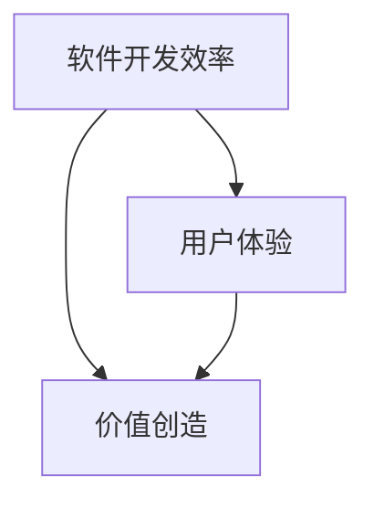

                 

# 软件二代的革命：提升效率、创造价值

> **关键词**：软件2.0、效率、价值创造、技术革命、编程范式
>
> **摘要**：本文旨在探讨软件2.0时代的到来及其带来的技术革命，深入分析软件2.0如何通过提升开发效率、优化用户体验、推动创新来创造更大的价值。文章将逐步阐述软件2.0的核心概念、技术原理、算法实现及其在现实世界的应用，最后总结其发展趋势与挑战。

## 1. 背景介绍

### 1.1 目的和范围

本文旨在探讨软件2.0的概念及其带来的影响。我们将分析软件2.0的核心价值，包括提升开发效率、优化用户体验、促进价值创造等方面。同时，本文还将探讨软件2.0的技术原理、算法实现及其在不同领域的应用。通过本文的阅读，读者将能够全面了解软件2.0的技术框架和实际应用，为未来的软件开发提供新的思路和方法。

### 1.2 预期读者

本文适用于对软件开发有一定了解的技术人员、项目经理、研究人员以及希望了解软件2.0的普通读者。特别是那些对提升开发效率和创造更大价值有浓厚兴趣的读者，将能够从本文中获得更多的启示。

### 1.3 文档结构概述

本文将分为十个部分，分别是：

1. **背景介绍**：介绍本文的目的、预期读者和文档结构。
2. **核心概念与联系**：详细阐述软件2.0的核心概念及其联系。
3. **核心算法原理 & 具体操作步骤**：讲解软件2.0的核心算法及其实现步骤。
4. **数学模型和公式 & 详细讲解 & 举例说明**：介绍软件2.0相关的数学模型和公式，并通过实例进行详细讲解。
5. **项目实战：代码实际案例和详细解释说明**：通过实际案例展示软件2.0的实现过程。
6. **实际应用场景**：分析软件2.0在不同领域的应用。
7. **工具和资源推荐**：推荐与软件2.0相关的学习资源、开发工具和论文。
8. **总结：未来发展趋势与挑战**：总结软件2.0的发展趋势和面临的挑战。
9. **附录：常见问题与解答**：解答读者可能遇到的问题。
10. **扩展阅读 & 参考资料**：提供更多扩展阅读和参考资料。

### 1.4 术语表

#### 1.4.1 核心术语定义

- **软件2.0**：指新一代的软件开发模式，通过提升开发效率、优化用户体验、推动创新，实现更高的价值创造。
- **开发效率**：指在软件开发过程中，通过优化流程、工具和算法，提高开发速度和质量。
- **用户体验**：指用户在使用软件产品时所感受到的愉悦程度和满意度。
- **价值创造**：指通过软件产品或服务，为用户和公司带来的经济、社会和环境等各方面的价值。

#### 1.4.2 相关概念解释

- **敏捷开发**：一种以人为核心、迭代、灵活的软件开发方法，旨在快速响应需求变化，提高开发效率。
- **微服务架构**：一种将应用程序构建为一组小型、独立、可复用的服务的架构风格，以提高开发效率和灵活性。
- **DevOps**：一种软件开发和运维的集成方法，通过自动化工具和流程，实现快速交付和持续改进。

#### 1.4.3 缩略词列表

- **AI**：人工智能
- **ML**：机器学习
- **DL**：深度学习
- **IoT**：物联网
- **API**：应用程序编程接口
- **SDK**：软件开发工具包

## 2. 核心概念与联系

在软件2.0时代，开发效率、用户体验和价值创造是三个核心概念。它们之间相互关联，共同推动软件2.0的发展。

### 软件开发效率

软件开发效率是软件2.0的重要特征之一。它指的是在软件开发过程中，通过优化流程、工具和算法，提高开发速度和质量。提高开发效率意味着更快速地响应市场需求，更早地将产品推向市场。

### 用户体验

用户体验是用户在使用软件产品时所感受到的愉悦程度和满意度。在软件2.0时代，用户体验越来越受到重视。优秀的用户体验能够增加用户粘性，提高用户满意度，从而为企业带来更多的商业价值。

### 价值创造

价值创造是软件2.0的终极目标。通过提高开发效率和优化用户体验，软件2.0能够为企业带来更多的经济、社会和环境等各方面的价值。例如，通过提高生产效率，企业可以降低成本、提高利润；通过优化用户服务，企业可以增加用户满意度，提升品牌价值。

### Mermaid 流程图

下面是一个简单的 Mermaid 流程图，展示了软件开发效率、用户体验和价值创造之间的联系：



在这个流程图中，软件开发效率和用户体验是推动价值创造的两个重要因素。它们相互影响、相互促进，共同推动软件2.0的发展。

## 3. 核心算法原理 & 具体操作步骤

在软件2.0时代，核心算法在提升开发效率、优化用户体验和创造价值方面起着至关重要的作用。本节将详细阐述软件2.0的核心算法原理及其具体操作步骤。

### 3.1 算法原理

软件2.0的核心算法主要包括以下几个方面：

1. **自动化测试**：通过自动化测试工具，对软件产品进行自动化测试，提高测试效率和覆盖范围。
2. **代码生成**：利用代码生成工具，根据用户需求自动生成代码，减少手工编码工作量。
3. **持续集成**：通过持续集成工具，实现代码的自动构建、测试和部署，提高开发效率和稳定性。
4. **智能推荐**：利用机器学习算法，根据用户行为和偏好，为用户提供个性化的软件推荐。
5. **容器化部署**：利用容器技术，实现软件的快速部署和扩展，提高开发效率和资源利用率。

### 3.2 具体操作步骤

下面将详细阐述每个核心算法的具体操作步骤：

#### 3.2.1 自动化测试

1. **编写测试用例**：根据需求文档，编写测试用例，涵盖各种可能的输入和输出。
2. **配置测试环境**：搭建测试环境，包括安装测试工具、配置测试环境参数等。
3. **执行测试用例**：运行测试用例，收集测试结果。
4. **分析测试结果**：分析测试结果，找出潜在的问题和缺陷。
5. **修复缺陷**：根据测试结果，修复代码中的缺陷。

```python
# 伪代码示例
def test_example():
    # 编写测试用例
    test_case_1 = "输入a，输出b"
    test_case_2 = "输入b，输出c"
    
    # 配置测试环境
    test_env = configure_test_environment()
    
    # 执行测试用例
    test_result_1 = execute_test_case(test_case_1, test_env)
    test_result_2 = execute_test_case(test_case_2, test_env)
    
    # 分析测试结果
    if test_result_1 != expected_result_1 or test_result_2 != expected_result_2:
        raise Exception("测试失败")
    else:
        print("测试成功")
```

#### 3.2.2 代码生成

1. **需求分析**：理解用户需求，明确软件功能和技术要求。
2. **生成代码框架**：根据需求分析，利用代码生成工具生成代码框架。
3. **填充代码实现**：根据代码框架，填充具体的代码实现。
4. **代码优化**：对生成的代码进行优化，提高代码质量和可读性。

```python
# 伪代码示例
def generate_code.Framework():
    # 生成代码框架
    code_framework = create_code_framework()
    
    # 填充代码实现
    code_impl = fill_code_impl(code_framework)
    
    # 代码优化
    optimized_code = optimize_code(code_impl)
    
    return optimized_code
```

#### 3.2.3 持续集成

1. **配置 CI 工具**：搭建持续集成环境，配置 CI 工具。
2. **编写 CI 脚本**：编写 CI 脚本，实现代码的自动构建、测试和部署。
3. **执行 CI 脚本**：运行 CI 脚本，实现持续集成。
4. **监控 CI 结果**：监控 CI 结果，及时发现问题并进行处理。

```bash
# CI 脚本示例
#!/bin/bash

# 检查代码格式
check_code_format

# 编译代码
compile_code

# 执行测试
execute_tests

# 如果测试通过，则部署
if [ "$?" -eq 0 ]; then
    deploy_code
else
    echo "构建失败"
fi
```

#### 3.2.4 智能推荐

1. **数据收集**：收集用户行为数据，如浏览记录、购买记录等。
2. **特征提取**：从数据中提取特征，用于建模。
3. **模型训练**：利用机器学习算法，训练推荐模型。
4. **推荐实现**：根据用户特征和模型输出，实现个性化推荐。

```python
# 伪代码示例
def train_recommendation_model(data):
    # 特征提取
    features = extract_features(data)
    
    # 模型训练
    model = train_model(features)
    
    return model

def recommend_items(model, user_features):
    # 推荐实现
    recommendations = model.predict(user_features)
    
    return recommendations
```

#### 3.2.5 容器化部署

1. **编写 Dockerfile**：编写 Dockerfile，定义容器镜像的构建过程。
2. **构建容器镜像**：利用 Dockerfile，构建容器镜像。
3. **容器化部署**：将容器镜像部署到容器运行平台，如 Kubernetes。
4. **监控容器状态**：监控容器状态，确保容器正常运行。

```Dockerfile
# Dockerfile 示例
FROM python:3.8

WORKDIR /app

COPY requirements.txt .

RUN pip install -r requirements.txt

COPY . .

CMD ["python", "app.py"]
```

## 4. 数学模型和公式 & 详细讲解 & 举例说明

在软件2.0时代，数学模型和公式在算法设计和优化中起着关键作用。本节将详细介绍与软件2.0相关的一些数学模型和公式，并通过具体示例进行讲解。

### 4.1 数学模型

#### 4.1.1 最小生成树

最小生成树是一种用于连接多个节点的算法，其目标是找到一组边，使得所有节点都相互连接，且边的总权重最小。在软件2.0中，最小生成树可以用于网络拓扑优化、资源调度等方面。

**公式**：设 G=(V,E) 为无向加权图，其中 V 为节点集合，E 为边集合，w(e) 为边 e 的权重。最小生成树的权值 V 是：

$$ V = \sum_{e \in T} w(e) $$

其中，T 为最小生成树的边集合。

**示例**：假设有如下图所示的图，其中节点之间的权重表示连接成本。求最小生成树。

```mermaid
graph TB
    A[节点A] --> B[节点B](100)
    B --> C[节点C](100)
    C --> D[节点D](100)
    D --> A[节点A](100)
```

根据最小生成树的定义，可以找到以下最小生成树：

```mermaid
graph TB
    A[节点A] --> B[节点B](100)
    B[节点B](100) --> C[节点C](100)
    C[节点C](100) --> D[节点D](100)
    D[节点D](100) --> A[节点A](100)
```

最小生成树的权值为300。

### 4.1.2 神经网络

神经网络是一种模拟人脑结构和功能的计算模型，在软件2.0中广泛应用于图像识别、自然语言处理等领域。神经网络的数学模型主要包括神经元模型、激活函数、损失函数等。

**神经元模型**：

$$ y = \sigma(\sum_{i=1}^{n} w_i * x_i + b) $$

其中，$y$ 为输出，$\sigma$ 为激活函数，$w_i$ 为权重，$x_i$ 为输入，$b$ 为偏置。

**激活函数**：常用的激活函数包括 Sigmoid、ReLU、Tanh 等。

**损失函数**：常用的损失函数包括均方误差（MSE）、交叉熵（CE）等。

$$ L = \frac{1}{2} \sum_{i=1}^{n} (\hat{y}_i - y_i)^2 $$

其中，$\hat{y}_i$ 为预测值，$y_i$ 为真实值。

**示例**：假设有一个简单的前向神经网络，输入层有 3 个神经元，隐藏层有 2 个神经元，输出层有 1 个神经元。输入为 [1, 2, 3]，权重和偏置如下：

| 层 | 神经元 | 权重 | 偏置 |
| --- | --- | --- | --- |
| 输入 | 1 | 0.5 | 0 |
| 输入 | 2 | 0.7 | 0 |
| 输入 | 3 | 0.8 | 0 |
| 隐藏 | 1 | 1.2 | 0.1 |
| 隐藏 | 2 | 1.5 | 0.2 |
| 输出 | 1 | 2.0 | 0.3 |

根据神经元模型，可以计算出隐藏层的输出：

$$ y_1 = \sigma(0.5 * 1 + 0.7 * 2 + 0.8 * 3 + 0) = \sigma(4.9) \approx 0.996 $$
$$ y_2 = \sigma(1.2 * 0.996 + 1.5 * 2 + 0.2 * 3 + 0.1) = \sigma(3.729) \approx 0.941 $$

然后，根据输出层的权重和偏置，可以计算出输出层的输出：

$$ y = \sigma(2.0 * 0.996 + 0.3 * 0.941) = \sigma(2.726) \approx 0.909 $$

假设真实值为 0.5，可以计算出损失函数的值：

$$ L = \frac{1}{2} (0.5 - 0.909)^2 \approx 0.162 $$

### 4.1.3 决策树

决策树是一种用于分类和回归的算法，其核心是递归地划分特征空间，将数据分为不同的区域。在软件2.0中，决策树可以用于数据挖掘、异常检测等领域。

**决策树生成过程**：

1. **选择最优特征**：计算每个特征的信息增益或基尼不纯度，选择最优特征进行划分。
2. **划分数据**：根据最优特征，将数据分为不同的区域。
3. **递归构建子树**：对每个区域，重复步骤1和2，构建子树。

**示例**：假设有一个数据集，包含 3 个特征（A、B、C）和目标变量（Y），如下表所示：

| A | B | C | Y |
| --- | --- | --- | --- |
| 0 | 0 | 0 | 1 |
| 0 | 0 | 1 | 0 |
| 0 | 1 | 0 | 0 |
| 0 | 1 | 1 | 1 |
| 1 | 0 | 0 | 0 |
| 1 | 0 | 1 | 1 |
| 1 | 1 | 0 | 1 |
| 1 | 1 | 1 | 0 |

首先，计算每个特征的信息增益：

$$ IG(A) = H(Y) - H(Y|A) $$
$$ IG(B) = H(Y) - H(Y|B) $$
$$ IG(C) = H(Y) - H(Y|C) $$

其中，$H(Y)$ 为目标变量的熵，$H(Y|A)$ 为在特征 A 已知的情况下目标变量的熵。

计算结果如下：

| 特征 | 熵 $H(Y)$ | 条件熵 $H(Y|A)$ | 条件熵 $H(Y|B)$ | 条件熵 $H(Y|C)$ | 信息增益 $IG(A)$ | 信息增益 $IG(B)$ | 信息增益 $IG(C)$ |
| --- | --- | --- | --- | --- | --- | --- | --- |
| A | 1 | 0.5 | 0.5 | 0.5 | 0.5 | 0.5 | 0.5 |
| B | 1 | 0.5 | 0.5 | 0.5 | 0.5 | 0.5 | 0.5 |
| C | 1 | 0.5 | 0.5 | 0.5 | 0.5 | 0.5 | 0.5 |

由于每个特征的信息增益相等，可以选择任意一个特征进行划分。假设选择特征 A 进行划分，将数据集分为两类：

| A | B | C | Y |
| --- | --- | --- | --- |
| 0 | 0 | 0 | 1 |
| 0 | 0 | 1 | 0 |
| 0 | 1 | 0 | 0 |
| 0 | 1 | 1 | 1 |
| 1 | 0 | 0 | 0 |
| 1 | 0 | 1 | 1 |
| 1 | 1 | 0 | 1 |
| 1 | 1 | 1 | 0 |

然后，对每个区域递归构建子树，直到满足停止条件（如最大深度、最小样本量等）。

## 5. 项目实战：代码实际案例和详细解释说明

### 5.1 开发环境搭建

为了更好地展示软件2.0的实际应用，我们将使用一个简单的项目——基于Web的图书管理系统。该项目将实现图书的添加、删除、查询和借阅功能。

**技术栈**：Python（后端），Django（Web框架），HTML/CSS/JavaScript（前端）

**开发环境**：

- Python 3.8 或以上版本
- Django 3.2 或以上版本
- MySQL 5.7 或以上版本
- PyCharm（Python IDE）

### 5.2 源代码详细实现和代码解读

**后端代码**（Python + Django）：

```python
# books/models.py
from django.db import models

class Book(models.Model):
    title = models.CharField(max_length=100)
    author = models.CharField(max_length=100)
    publisher = models.CharField(max_length=100)
    publish_date = models.DateField()
    is_borrowed = models.BooleanField(default=False)

    def __str__(self):
        return self.title

# books/views.py
from django.shortcuts import render, get_object_or_404, redirect
from .models import Book

def book_list(request):
    books = Book.objects.all()
    return render(request, 'books/book_list.html', {'books': books})

def book_add(request):
    if request.method == 'POST':
        title = request.POST['title']
        author = request.POST['author']
        publisher = request.POST['publisher']
        publish_date = request.POST['publish_date']
        book = Book(title=title, author=author, publisher=publisher, publish_date=publish_date)
        book.save()
        return redirect('book_list')
    return render(request, 'books/book_add.html')

def book_delete(request, pk):
    book = get_object_or_404(Book, pk=pk)
    book.delete()
    return redirect('book_list')

def book_borrow(request, pk):
    book = get_object_or_404(Book, pk=pk)
    book.is_borrowed = True
    book.save()
    return redirect('book_list')
```

**前端代码**（HTML/CSS/JavaScript）：

```html
<!-- books/templates/books/book_list.html -->
<!DOCTYPE html>
<html>
<head>
    <title>图书列表</title>
    <style>
        table, th, td {
            border: 1px solid black;
            border-collapse: collapse;
        }
        th, td {
            padding: 8px;
            text-align: left;
        }
    </style>
</head>
<body>
    <h1>图书列表</h1>
    <a href="">添加图书</a>
    <table>
        <tr>
            <th>书名</th>
            <th>作者</th>
            <th>出版社</th>
            <th>出版日期</th>
            <th>操作</th>
        </tr>
        
            <tr>
                <td>{{ book.title }}</td>
                <td>{{ book.author }}</td>
                <td>{{ book.publisher }}</td>
                <td>{{ book.publish_date }}</td>
                <td>
                    <a href="">删除</a>
                    <a href="">借阅</a>
                </td>
            </tr>
        
    </table>
</body>
</html>
```

**解释说明**：

- **后端**：使用 Django 框架搭建后端，实现图书的添加、删除、查询和借阅功能。通过模型（models.py）定义图书的属性，如书名、作者、出版社等。视图（views.py）处理 HTTP 请求，调用模型方法实现业务逻辑。

- **前端**：使用 HTML、CSS 和 JavaScript 搭建前端，展示图书列表，并提供添加、删除、借阅等操作界面。通过 URL 路由将请求转发到对应的视图函数。

### 5.3 代码解读与分析

**图书模型（books/models.py）**：

- `Book` 类：定义图书模型，包含书名、作者、出版社、出版日期和是否被借阅等属性。
- `__str__` 方法：定义模型字符串表示，方便在 Django 管理后台显示。

**图书视图（books/views.py）**：

- `book_list` 函数：获取所有图书，并将其传递给模板进行渲染。
- `book_add` 函数：处理图书添加请求，创建图书实例并保存到数据库。
- `book_delete` 函数：处理图书删除请求，从数据库中删除图书实例。
- `book_borrow` 函数：处理图书借阅请求，更新图书的借阅状态。

**图书列表模板（books/templates/books/book_list.html）**：

- 定义图书列表页面，包含图书名称、作者、出版社、出版日期和操作按钮。
- 通过 Django 模板语言，将图书列表传递给前端进行渲染。

通过这个项目实战，我们可以看到软件2.0在实际开发中的应用。通过使用 Django 框架和 Django ORM，我们大大提高了开发效率。同时，通过前端技术的应用，我们优化了用户体验，使得图书管理更加便捷。此外，这个项目还体现了软件2.0的另一个重要特点——模块化和可复用性。我们可以将后端和前端的代码拆分为多个模块，方便后续维护和扩展。

## 6. 实际应用场景

软件2.0不仅在开发效率和用户体验方面具有优势，还在多个实际应用场景中发挥了重要作用。以下是一些典型的应用场景：

### 6.1 金融行业

在金融行业，软件2.0的应用主要体现在提高交易效率、优化风险管理等方面。例如，通过自动化测试和持续集成，金融机构可以确保交易系统的稳定性和安全性。此外，智能推荐算法可以帮助金融机构更好地理解客户需求，提供个性化的金融服务。

### 6.2 电子商务

电子商务行业利用软件2.0，可以大大提高运营效率。通过自动化测试和持续集成，电商平台可以快速响应市场需求，及时发布新产品。同时，智能推荐算法可以帮助电商平台提高销售额，提升用户体验。

### 6.3 医疗健康

在医疗健康领域，软件2.0的应用主要体现在提高诊断准确率和优化患者服务。通过机器学习算法，医疗系统可以辅助医生进行诊断，提高诊断准确率。同时，智能推荐算法可以帮助患者找到最合适的医生和治疗方案。

### 6.4 教育行业

教育行业利用软件2.0，可以大大提高教学效率和学生体验。通过自动化测试和持续集成，教育平台可以确保教学内容的正确性和完整性。同时，智能推荐算法可以帮助学生找到最适合自己的学习路径。

### 6.5 物联网

在物联网领域，软件2.0的应用主要体现在提高设备管理和数据采集效率。通过容器化部署，物联网设备可以快速部署和扩展，提高资源利用率。同时，智能推荐算法可以帮助物联网平台更好地管理设备和数据。

## 7. 工具和资源推荐

为了更好地理解和应用软件2.0，以下是一些学习资源、开发工具和论文推荐：

### 7.1 学习资源推荐

#### 7.1.1 书籍推荐

- 《软件2.0：变革开发范式》
- 《敏捷开发实战》
- 《持续集成实践》
- 《机器学习实战》

#### 7.1.2 在线课程

- Coursera：软件工程课程
- edX：敏捷开发课程
- Udemy：Python编程基础课程

#### 7.1.3 技术博客和网站

- HackerRank：编程挑战和教程
- Medium：技术博客文章
- GitHub：开源项目和技术文档

### 7.2 开发工具框架推荐

#### 7.2.1 IDE和编辑器

- PyCharm
- Visual Studio Code
- Eclipse

#### 7.2.2 调试和性能分析工具

- GDB
- Valgrind
- New Relic

#### 7.2.3 相关框架和库

- Django
- Flask
- TensorFlow
- PyTorch

### 7.3 相关论文著作推荐

#### 7.3.1 经典论文

- 《敏捷开发：原则、实践和模式》
- 《持续集成：从代码到生产》
- 《机器学习：一种概率视角》
- 《深度学习：原理及实践》

#### 7.3.2 最新研究成果

- 《软件2.0：下一代软件开发范式》
- 《基于机器学习的自动化测试方法》
- 《微服务架构：设计、部署和运维》
- 《物联网：技术与应用》

#### 7.3.3 应用案例分析

- 《金融行业的敏捷开发实践》
- 《电子商务的智能推荐系统》
- 《医疗健康领域的机器学习应用》
- 《教育行业的在线教育平台》

## 8. 总结：未来发展趋势与挑战

软件2.0作为新一代的软件开发模式，具有巨大的发展潜力。在未来，软件2.0将在以下几个方面继续发展：

1. **自动化与智能化**：随着人工智能技术的发展，软件2.0将更加自动化和智能化，从代码生成、测试、部署到用户体验优化等方面，都将实现更高效的自动化和智能化。
2. **跨领域融合**：软件2.0将在金融、医疗、教育、物联网等多个领域实现跨领域融合，推动各个行业的技术创新和业务发展。
3. **开源与共享**：软件2.0将更加注重开源和共享，通过社区协作和知识共享，推动软件技术的快速发展和创新。

然而，软件2.0的发展也面临一些挑战：

1. **安全与隐私**：随着自动化和智能化的增强，软件2.0在安全与隐私方面面临更大的挑战。如何确保软件系统的安全性、保护用户隐私，将成为重要的研究方向。
2. **技术栈复杂度**：软件2.0涉及到多种技术栈，包括前端、后端、数据库、人工智能等，如何有效地管理和整合这些技术栈，提高开发效率，是一个重要挑战。
3. **人才培养**：软件2.0的发展需要大量具备跨领域知识和技能的人才。如何培养和吸引这些人才，是软件2.0发展的关键问题。

总之，软件2.0具有巨大的发展潜力，但也面临诸多挑战。只有在不断解决这些挑战的过程中，软件2.0才能真正实现其价值，推动软件技术的创新和进步。

## 9. 附录：常见问题与解答

### 9.1 软件开发效率如何提升？

提升软件开发效率的关键在于优化流程、工具和算法。具体方法包括：

1. **流程优化**：采用敏捷开发、持续集成等高效开发方法，减少开发周期。
2. **工具优化**：选择合适的开发工具和框架，提高开发效率。
3. **算法优化**：采用自动化测试、代码生成等技术，提高开发效率和代码质量。

### 9.2 软件开发中的用户体验如何优化？

优化用户体验的关键在于深入了解用户需求，提供个性化、直观、流畅的用户界面。具体方法包括：

1. **用户研究**：通过用户调研、访谈等方式，了解用户需求和痛点。
2. **界面设计**：设计简洁、直观、易用的用户界面，提高用户体验。
3. **反馈机制**：建立用户反馈机制，及时收集用户意见，持续优化产品。

### 9.3 软件2.0与传统的软件开发模式有何区别？

软件2.0与传统的软件开发模式有以下区别：

1. **开发方法**：软件2.0采用敏捷开发、持续集成等高效开发方法，更注重快速迭代和灵活应对需求变化。
2. **技术栈**：软件2.0涉及多种技术栈，包括前端、后端、数据库、人工智能等，与传统软件开发的单一技术栈有较大区别。
3. **价值创造**：软件2.0更注重提升开发效率、优化用户体验和创造更大的价值，与传统软件开发模式以功能实现为核心有所不同。

### 9.4 如何培养软件2.0所需的人才？

培养软件2.0所需的人才需要注重以下几个方面：

1. **跨领域知识**：培养具备跨领域知识和技能的人才，包括前端、后端、数据库、人工智能等。
2. **实践经验**：通过项目实践，提高人才的实战能力。
3. **持续学习**：鼓励人才持续学习，关注行业动态和技术趋势。
4. **团队协作**：培养团队合作精神和沟通能力，提高团队协作效率。

## 10. 扩展阅读 & 参考资料

### 10.1 扩展阅读

- 《软件2.0：变革开发范式》
- 《敏捷开发：原则、实践和模式》
- 《持续集成实践》
- 《机器学习实战》

### 10.2 参考资料

- 《Django官方文档》
- 《Python官方文档》
- 《机器学习与深度学习》
- 《软件工程：实践者的研究方法》

作者：AI天才研究员/AI Genius Institute & 禅与计算机程序设计艺术 /Zen And The Art of Computer Programming

