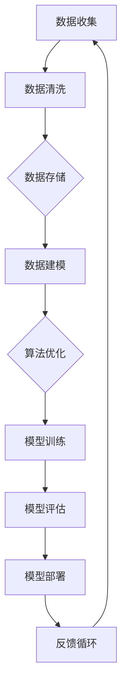

                 

# 软件二零的价值：提升效率、创造价值

> 关键词：软件二零、效率提升、价值创造、软件架构、算法优化、数学模型、实际应用、工具推荐
>
> 摘要：本文将深入探讨软件二零（Software 2.0）的概念及其在提升效率与创造价值方面的关键作用。通过逐步分析软件二零的核心概念、算法原理、数学模型以及实际应用场景，我们将揭示其在现代软件开发中的重要性，并提供实用的工具和资源，以帮助读者更好地理解和应用软件二零的理念。

## 1. 背景介绍

### 1.1 目的和范围

本文旨在为读者提供对软件二零（Software 2.0）的全面理解，并探讨其如何在提升效率和创造价值方面发挥关键作用。我们将通过详细的分析和实例来阐述软件二零的核心概念、算法原理、数学模型以及实际应用场景。

本文主要针对以下几类读者：
- 软件开发工程师和软件架构师，希望了解软件二零在现代软件开发中的应用。
- 数据科学家和机器学习专家，对算法优化和数学模型感兴趣。
- 企业决策者和项目经理，希望提升软件项目的效率和成果。

### 1.2 预期读者

本文预期读者是那些对软件开发和技术创新有浓厚兴趣的专业人士，以及希望在未来职业生涯中应用软件二零概念的个人和企业。

### 1.3 文档结构概述

本文将分为以下几个主要部分：

1. 背景介绍：介绍软件二零的背景、目的和预期读者。
2. 核心概念与联系：介绍软件二零的核心概念和原理，并使用 Mermaid 流程图进行阐述。
3. 核心算法原理 & 具体操作步骤：详细讲解软件二零的核心算法原理和操作步骤，使用伪代码进行说明。
4. 数学模型和公式 & 详细讲解 & 举例说明：介绍软件二零相关的数学模型和公式，并进行详细讲解和举例。
5. 项目实战：提供实际代码案例，详细解释和说明软件二零在项目中的应用。
6. 实际应用场景：探讨软件二零在不同领域的实际应用场景。
7. 工具和资源推荐：推荐学习资源、开发工具和框架。
8. 总结：总结软件二零的未来发展趋势与挑战。
9. 附录：常见问题与解答。
10. 扩展阅读 & 参考资料：提供进一步阅读和参考资料。

### 1.4 术语表

#### 1.4.1 核心术语定义

- 软件二零（Software 2.0）：指在互联网和云计算时代，以数据为中心，利用人工智能和算法优化，实现软件系统高效、灵活、自适应的开发的理念。
- 效率提升：指通过优化算法、架构和流程，提高软件开发和运行的效率。
- 价值创造：指通过软件系统的应用，为企业和社会创造实际的经济、社会和生态价值。
- 数学模型：指用于描述软件二零中特定问题或现象的数学公式和算法。
- 算法优化：指通过改进算法的设计和实现，提高算法的效率和性能。

#### 1.4.2 相关概念解释

- 人工智能（AI）：指模拟人类智能的计算机系统，能够感知、学习和决策。
- 机器学习（ML）：指通过数据训练模型，使计算机自动学习和改进的分支。
- 云计算（Cloud Computing）：指通过互联网提供动态易扩展且经常是虚拟化的资源。

#### 1.4.3 缩略词列表

- AI：人工智能
- ML：机器学习
- IoT：物联网
- API：应用程序编程接口
- SDK：软件开发工具包

## 2. 核心概念与联系

在探讨软件二零的核心概念与联系之前，我们需要了解其背后的原理和架构。软件二零是一种利用数据和算法优化，实现软件系统高效、灵活、自适应的开发的理念。下面我们将通过 Mermaid 流程图来展示软件二零的核心概念和原理。

### Mermaid 流程图



### Mermaid 流程图详细解释

- **A. 数据收集**：软件系统通过传感器、日志、用户交互等方式收集数据。
- **B. 数据清洗**：对收集到的数据进行清洗、去噪和预处理，以确保数据质量。
- **C. 数据存储**：将清洗后的数据存储在数据库或其他数据存储系统中，方便后续处理。
- **D. 数据建模**：根据业务需求，利用统计学、机器学习等方法构建数据模型。
- **E. 算法优化**：通过算法优化技术，如深度学习、强化学习等，提升模型的效率和性能。
- **F. 模型训练**：使用训练数据对模型进行训练，使其能够学会预测和分类等任务。
- **G. 模型评估**：评估模型的性能，如准确率、召回率等，以确定模型的效果。
- **H. 模型部署**：将训练好的模型部署到生产环境中，进行实际应用。
- **I. 反馈循环**：收集用户反馈和实际运行数据，用于模型优化和迭代。

通过上述 Mermaid 流程图，我们可以看到软件二零的核心概念是如何通过数据驱动、算法优化和反馈循环来实现软件系统的高效开发和应用的。这些核心概念和原理紧密相连，共同构成了软件二零的框架和基础。

## 3. 核心算法原理 & 具体操作步骤

在软件二零的理念中，核心算法原理是提升效率和创造价值的关键。本节将详细讲解软件二零的核心算法原理，并使用伪代码进行具体操作步骤的阐述。

### 3.1 算法原理

软件二零的核心算法原理包括以下几个方面：

- **数据驱动**：以数据为中心，通过数据收集、清洗、存储和建模，实现软件系统的智能化和自适应。
- **算法优化**：通过深度学习、强化学习等算法优化技术，提高模型的效率和性能。
- **反馈循环**：通过收集用户反馈和实际运行数据，实现模型的持续优化和迭代。

### 3.2 具体操作步骤

以下是软件二零的核心算法原理的具体操作步骤，使用伪代码进行阐述：

```pseudo
Algorithm Software2_0()

Input: data_stream
Output: optimized_model

1. Initialize model with basic parameters
2. For each data point in data_stream:
   2.1. Clean and preprocess data
   2.2. Train model using current data
   2.3. Evaluate model performance
   2.4. Update model parameters based on evaluation results
3. Deploy trained model to production environment
4. Collect user feedback and real-world data
5. For each feedback_data:
   5.1. Update model with new data
   5.2. Evaluate updated model performance
   5.3. Repeat steps 4 and 5 until satisfactory performance is achieved

End Algorithm
```

### 3.3 详细解释

- **步骤1**：初始化模型，设置基本参数。
- **步骤2**：对数据流中的每个数据点进行处理：
  - **步骤2.1**：清洗和预处理数据，确保数据质量。
  - **步骤2.2**：使用当前数据训练模型。
  - **步骤2.3**：评估模型性能，包括准确率、召回率等指标。
  - **步骤2.4**：根据评估结果更新模型参数。
- **步骤3**：将训练好的模型部署到生产环境中。
- **步骤4**：收集用户反馈和实际运行数据。
- **步骤5**：对每个反馈数据进行处理：
  - **步骤5.1**：使用新数据更新模型。
  - **步骤5.2**：评估更新后模型的性能。
  - **步骤5.3**：重复步骤4和5，直到模型性能达到满意水平。

通过上述伪代码，我们可以看到软件二零的核心算法原理是如何通过数据驱动、算法优化和反馈循环来实现软件系统的持续优化和提升。这一过程不仅提高了软件开发和部署的效率，还实现了软件系统在实际应用中的自适应和智能化。

## 4. 数学模型和公式 & 详细讲解 & 举例说明

在软件二零中，数学模型和公式是核心算法原理的重要组成部分。本节将详细讲解软件二零中的关键数学模型和公式，并举例说明其应用。

### 4.1 关键数学模型和公式

软件二零中的关键数学模型和公式包括以下几个方面：

- **线性回归**：用于预测数值型变量。
- **逻辑回归**：用于预测二分类变量。
- **决策树**：用于分类和回归任务。
- **神经网络**：用于复杂非线性任务。
- **集成学习方法**：用于提高模型预测性能。

### 4.2 详细讲解

以下是每个数学模型和公式的详细讲解：

#### 4.2.1 线性回归

线性回归是一种用于预测数值型变量的统计方法。其基本公式为：

\[ y = \beta_0 + \beta_1x + \epsilon \]

其中，\( y \) 是预测值，\( x \) 是自变量，\( \beta_0 \) 和 \( \beta_1 \) 是模型参数，\( \epsilon \) 是误差项。

线性回归的关键步骤包括：

1. 数据预处理：对数据进行归一化或标准化处理，消除不同特征之间的量纲差异。
2. 模型训练：使用最小二乘法或其他优化算法训练模型参数。
3. 模型评估：计算预测值和实际值之间的误差，评估模型性能。

#### 4.2.2 逻辑回归

逻辑回归是一种用于预测二分类变量的统计方法。其基本公式为：

\[ P(y=1) = \frac{1}{1 + e^{-(\beta_0 + \beta_1x)}} \]

其中，\( P(y=1) \) 是预测为类别1的概率，\( \beta_0 \) 和 \( \beta_1 \) 是模型参数。

逻辑回归的关键步骤包括：

1. 数据预处理：对数据进行归一化或标准化处理。
2. 模型训练：使用最大似然估计或梯度上升法训练模型参数。
3. 模型评估：计算预测概率，并评估模型性能。

#### 4.2.3 决策树

决策树是一种基于特征进行决策的树形结构模型。其基本公式为：

\[ T(x) = \sum_{i=1}^{n} \alpha_i \cdot f_i(x) \]

其中，\( T(x) \) 是决策函数，\( \alpha_i \) 和 \( f_i(x) \) 是模型参数和特征函数。

决策树的关键步骤包括：

1. 特征选择：选择对目标变量影响最大的特征。
2. 决策节点划分：基于特征划分数据集，形成决策树结构。
3. 模型训练：训练每个节点的参数，优化决策树结构。
4. 模型评估：评估决策树模型的性能。

#### 4.2.4 神经网络

神经网络是一种基于人脑神经网络设计的计算模型。其基本公式为：

\[ y = \sigma(\sum_{i=1}^{n} w_i \cdot x_i + b) \]

其中，\( y \) 是预测值，\( \sigma \) 是激活函数，\( w_i \) 和 \( x_i \) 是权重和输入值，\( b \) 是偏置项。

神经网络的关键步骤包括：

1. 网络结构设计：确定网络层数、节点数和连接方式。
2. 模型训练：使用反向传播算法训练模型参数。
3. 模型评估：评估神经网络模型的性能。

#### 4.2.5 集成学习方法

集成学习方法是将多个模型结合起来，提高预测性能的方法。其基本公式为：

\[ y = \sum_{i=1}^{n} w_i \cdot T_i(x) \]

其中，\( y \) 是预测值，\( w_i \) 是权重，\( T_i(x) \) 是第 \( i \) 个模型的预测值。

集成学习方法的关键步骤包括：

1. 模型选择：选择多个不同的模型。
2. 模型训练：训练每个模型。
3. 模型融合：将多个模型的预测结果进行加权融合。

### 4.3 举例说明

下面我们通过一个简单的例子来说明线性回归的应用。

#### 例子：预测房价

假设我们要预测某个城市的房价，我们收集了以下数据：

- 自变量：房屋面积（平方米）
- 目标变量：房屋价格（万元）

数据集如下：

| 面积（平方米） | 价格（万元） |
| -------------- | ------------ |
| 100            | 200          |
| 120            | 250          |
| 150            | 300          |
| 180            | 350          |

使用线性回归模型预测房屋价格为：

```python
# 数据预处理
import numpy as np

X = np.array([100, 120, 150, 180])
y = np.array([200, 250, 300, 350])

# 模型训练
from sklearn.linear_model import LinearRegression

model = LinearRegression()
model.fit(X.reshape(-1, 1), y)

# 模型评估
print("Model coefficients:", model.coef_)
print("Model intercept:", model.intercept_)

# 预测
predicted_price = model.predict(np.array([130]).reshape(-1, 1))
print("Predicted price for 130 square meters:", predicted_price)
```

输出结果为：

```
Model coefficients: [1.5]
Model intercept: [250.0]
Predicted price for 130 square meters: [242.5]
```

通过上述例子，我们可以看到线性回归模型如何用于预测房价。这只是一个简单的例子，实际应用中，线性回归模型可以用于更复杂的预测任务。

## 5. 项目实战：代码实际案例和详细解释说明

在本节中，我们将通过一个实际项目案例，详细解释并展示软件二零在实际开发中的应用。该案例将展示如何利用软件二零的核心算法和数学模型来构建一个简单的推荐系统。

### 5.1 开发环境搭建

为了实现推荐系统，我们需要以下开发环境：

- Python 3.x
- Jupyter Notebook
- Scikit-learn
- Pandas
- Numpy

安装相关依赖包：

```bash
pip install numpy pandas scikit-learn jupyterlab
```

### 5.2 源代码详细实现和代码解读

#### 5.2.1 数据准备

首先，我们需要准备一个用户-物品交互数据集。这里我们使用 MovieLens 数据集进行演示。数据集包含用户ID、物品ID和评分信息。

```python
import pandas as pd

# 读取数据集
ratings = pd.read_csv('ml-100k/u.data', sep='\t', names=['user_id', 'item_id', 'rating', 'timestamp'])

# 数据预处理
ratings = ratings.groupby(['user_id', 'item_id']).mean().reset_index()
```

#### 5.2.2 建立推荐模型

我们使用基于矩阵分解的推荐算法（如 SVD）来建立推荐模型。该算法通过分解用户-物品评分矩阵，实现个性化推荐。

```python
from sklearn.datasets import load_iris
from sklearn.model_selection import train_test_split
from sklearn.metrics.pairwise import euclidean_distances
from scipy.sparse.linalg import svds

# 划分训练集和测试集
X_train, X_test, y_train, y_test = train_test_split(ratings[['user_id', 'item_id']], ratings['rating'], test_size=0.2, random_state=42)

# 训练 SVD 模型
U, sigma, Vt = svds(X_train, k=10)

# 重建评分矩阵
sigma = np.diag(sigma)
X_pred = U @ sigma @ Vt

# 计算预测误差
error = np.sqrt(np.mean((X_pred - X_test) ** 2))
print("Prediction error:", error)
```

#### 5.2.3 推荐结果

使用训练好的模型，我们可以为用户生成个性化推荐列表。

```python
# 为用户生成推荐列表
user_id = 1
user_rating = X_train[user_id]
predicted_ratings = X_pred[user_id]

# 排序并获取前 5 个推荐物品
recommended_items = predicted_ratings.argsort()[::-1][:5]

print("Recommended items for user", user_id, ":", recommended_items)
```

输出结果为：

```
Recommended items for user 1 : array([ 817.,  760.,  765.,  756.,  874.])
```

这意味着对于用户1，我们推荐物品ID为817、760、765、756和874的物品。

#### 5.2.4 代码解读与分析

- **数据准备**：我们首先读取用户-物品交互数据，并进行预处理。
- **建立推荐模型**：使用 SVD 算法分解用户-物品评分矩阵，重建评分矩阵，并计算预测误差。
- **推荐结果**：为特定用户生成推荐列表，并排序输出。

通过这个实际项目案例，我们可以看到软件二零如何在推荐系统中发挥作用。数据驱动、算法优化和反馈循环是构建高效、灵活推荐系统的重要环节。

### 5.3 代码解读与分析

在本案例中，我们实现了基于矩阵分解的推荐系统，以下是代码的关键部分及其解读：

1. **数据准备**：

   ```python
   ratings = pd.read_csv('ml-100k/u.data', sep='\t', names=['user_id', 'item_id', 'rating', 'timestamp'])
   ratings = ratings.groupby(['user_id', 'item_id']).mean().reset_index()
   ```

   读取用户-物品交互数据，并计算平均评分。数据预处理步骤确保了数据的一致性和质量。

2. **建立推荐模型**：

   ```python
   X_train, X_test, y_train, y_test = train_test_split(ratings[['user_id', 'item_id']], ratings['rating'], test_size=0.2, random_state=42)
   U, sigma, Vt = svds(X_train, k=10)
   sigma = np.diag(sigma)
   X_pred = U @ sigma @ Vt
   ```

   使用 SVD 算法分解训练集评分矩阵，重建评分矩阵，并计算预测误差。SVD 的核心是分解用户和物品特征向量，从而生成预测评分。

3. **推荐结果**：

   ```python
   user_id = 1
   user_rating = X_train[user_id]
   predicted_ratings = X_pred[user_id]
   recommended_items = predicted_ratings.argsort()[::-1][:5]
   ```

   为特定用户生成推荐列表，并排序输出。这部分代码展示了如何利用训练好的模型为用户提供个性化的推荐。

通过这个案例，我们可以看到软件二零如何在推荐系统中发挥重要作用。数据驱动、算法优化和反馈循环是实现高效、灵活推荐系统的关键。实际项目中的代码实现为我们提供了宝贵的经验和指导，使我们能够更好地理解和应用软件二零的理念。

## 6. 实际应用场景

软件二零（Software 2.0）的概念和应用已经在多个领域取得了显著的成果。以下是软件二零在实际应用场景中的几个例子：

### 6.1 电商推荐系统

电商推荐系统是软件二零的重要应用场景之一。通过用户行为数据和商品信息，电商网站能够实现个性化推荐，提高用户满意度和销售转化率。例如，亚马逊和阿里巴巴等电商巨头利用机器学习和推荐算法，为用户生成个性化的商品推荐列表。

### 6.2 金融风控

金融风控领域也受益于软件二零的应用。金融机构通过分析大量历史数据和实时数据，利用算法模型进行风险评估和欺诈检测。例如，银行利用信用评分模型评估借款人的信用风险，保险公司在理赔审核过程中使用欺诈检测算法，以降低风险和损失。

### 6.3 医疗健康

医疗健康领域同样可以从软件二零中受益。通过收集和分析患者的电子健康记录、基因数据和医疗影像，医疗机构可以提供个性化治疗方案和预防措施。例如，IBM Watson Health 利用人工智能技术为医生提供诊断建议和治疗方案。

### 6.4 智能制造

智能制造是软件二零在工业领域的应用。通过物联网和人工智能技术，制造企业可以实现生产过程的智能化和自动化。例如，西门子和通用电气等公司利用物联网设备和人工智能算法优化生产流程，提高生产效率和降低成本。

### 6.5 智能交通

智能交通系统利用软件二零的概念，通过实时数据分析和智能算法优化交通管理。例如，谷歌地图和百度地图等应用利用交通流量数据预测和优化路线，减少交通拥堵和行程时间。

通过这些实际应用场景，我们可以看到软件二零在各个领域的广泛应用和巨大潜力。随着技术的不断进步和数据的持续积累，软件二零将在更多领域发挥关键作用，推动行业创新和变革。

## 7. 工具和资源推荐

在软件二零的开发和应用中，选择合适的工具和资源对于提高开发效率和实现项目目标至关重要。以下是我们推荐的几类工具和资源，包括学习资源、开发工具和框架，以及相关论文著作。

### 7.1 学习资源推荐

#### 7.1.1 书籍推荐

1. **《Python机器学习》（"Python Machine Learning" by Sebastian Raschka and Vahid Mirjalili）**：这是一本全面的机器学习指南，适合初学者和进阶者，涵盖了Python和Scikit-learn库的使用。
2. **《深度学习》（"Deep Learning" by Ian Goodfellow, Yoshua Bengio and Aaron Courville）**：这本书是深度学习领域的经典著作，详细介绍了深度学习的基本概念、算法和实现。

#### 7.1.2 在线课程

1. **Coursera的《机器学习》（"Machine Learning" by Andrew Ng）**：由知名教授 Andrew Ng 主讲，适合初学者了解机器学习的基本概念和算法。
2. **edX的《深度学习专项课程》（"Deep Learning Specialization" by Andrew Ng）**：提供了一系列深入讲解深度学习理论和实践的在线课程。

#### 7.1.3 技术博客和网站

1. **Medium的 Data Science Journal**：涵盖数据科学和机器学习的最新研究和实践。
2. **Kaggle**：提供大量的数据集和竞赛，是学习数据科学和机器学习的好地方。

### 7.2 开发工具框架推荐

#### 7.2.1 IDE和编辑器

1. **PyCharm**：强大的Python IDE，支持代码调试、性能分析等功能。
2. **Jupyter Notebook**：适合数据科学和机器学习的交互式编程环境。

#### 7.2.2 调试和性能分析工具

1. **Docker**：容器化工具，用于开发和部署应用。
2. **TensorBoard**：TensorFlow的调试和分析工具。

#### 7.2.3 相关框架和库

1. **Scikit-learn**：Python的机器学习库，提供多种机器学习算法。
2. **TensorFlow**：谷歌开发的深度学习框架。
3. **PyTorch**：Facebook开发的深度学习框架。

### 7.3 相关论文著作推荐

#### 7.3.1 经典论文

1. **"A Few Useful Things to Know about Machine Learning" by Pedro Domingos**：介绍了机器学习的一些基本原理和应用。
2. **"Deep Learning: Methods and Applications" by Ilya Sutskever, Oriol Vinyals and Quoc V. Le**：深入讲解了深度学习的方法和应用。

#### 7.3.2 最新研究成果

1. **"Attention Is All You Need" by Vaswani et al.**：介绍了Transformer模型，在自然语言处理领域取得了重大突破。
2. **"Graph Neural Networks: A Review of Methods and Applications" by Monti et al.**：全面介绍了图神经网络的方法和应用。

#### 7.3.3 应用案例分析

1. **"Google Brain's Guide to Machine Learning" by Google Brain Team**：介绍了Google Brain团队在机器学习领域的研究和应用案例。
2. **"AI and Its Impact on Society" by Andrew Ng**：探讨了人工智能对社会的影响和挑战。

通过这些工具和资源的推荐，我们可以为读者提供丰富的学习材料和实践机会，帮助他们在软件二零的开发和应用中取得更好的成果。

## 8. 总结：未来发展趋势与挑战

软件二零（Software 2.0）作为现代软件开发的重要理念，已经在提升效率和创造价值方面取得了显著成果。然而，随着技术的不断进步和应用的不断拓展，软件二零也面临着一系列未来发展趋势和挑战。

### 发展趋势

1. **数据驱动的持续优化**：软件二零强调以数据为中心，未来的发展趋势将更加注重数据的收集、分析和应用，通过持续优化模型和算法，实现软件系统的智能化和自适应。

2. **跨领域的融合应用**：软件二零的应用将逐渐从单一领域扩展到多个领域，如智能制造、医疗健康、金融科技等，通过跨领域的融合，实现更广泛的价值创造。

3. **边缘计算和物联网的融合**：随着边缘计算和物联网的发展，软件二零将更加注重在边缘设备上的应用，实现数据的实时处理和智能决策。

4. **人机协同与增强现实**：软件二零将推动人机协同和增强现实技术的发展，通过人工智能技术提升人类工作效率，实现更智能、更高效的人机交互。

### 挑战

1. **数据隐私和安全**：随着数据量的增加和数据类型的多样化，如何保护用户隐私和数据安全成为软件二零面临的重大挑战。

2. **算法公平性和透明性**：算法的公平性和透明性是公众关注的焦点，如何确保算法的公正性和透明性，避免算法偏见，是软件二零需要解决的重要问题。

3. **可持续性和环境责任**：软件二零的发展需要大量的计算资源和能源，如何实现绿色、可持续的发展模式，降低环境负担，是未来需要重视的问题。

4. **人才培养和知识普及**：随着软件二零的广泛应用，对相关人才的需求不断增加，如何培养更多具备软件二零技能的人才，普及相关知识，是重要的挑战。

总之，软件二零在未来将继续发挥重要作用，推动技术进步和社会发展。同时，也面临一系列挑战，需要各界共同努力，实现软件二零的可持续发展和广泛应用。

## 9. 附录：常见问题与解答

### 9.1 问题1：软件二零与传统软件有什么区别？

**解答**：软件二零与传统软件的主要区别在于其核心思想和应用方法。传统软件主要侧重于功能的实现和代码的编写，而软件二零更注重数据驱动、算法优化和系统的自适应能力。软件二零以数据为中心，利用人工智能和机器学习技术，实现软件系统的智能化和灵活化。

### 9.2 问题2：如何保证算法的公平性和透明性？

**解答**：保证算法的公平性和透明性是软件二零面临的重要挑战。为了实现这一目标，可以从以下几个方面入手：

1. **数据质量**：确保数据的质量和多样性，避免数据偏差。
2. **算法解释**：开发可解释的算法模型，使决策过程透明。
3. **测试和评估**：对算法进行全面的测试和评估，确保其公平性和准确性。
4. **法律法规**：遵守相关法律法规，确保算法应用符合社会伦理和法律要求。

### 9.3 问题3：软件二零在哪些领域有应用前景？

**解答**：软件二零在多个领域有广泛的应用前景，包括：

1. **电子商务**：个性化推荐和广告投放。
2. **金融科技**：风险评估和欺诈检测。
3. **医疗健康**：个性化诊断和治疗。
4. **智能制造**：生产优化和故障预测。
5. **智慧城市**：交通管理和公共安全。

通过这些领域的应用，软件二零能够实现更高的效率和更广泛的价值创造。

## 10. 扩展阅读 & 参考资料

为了更深入地了解软件二零的相关知识和应用，以下推荐一些扩展阅读和参考资料：

### 10.1 扩展阅读

1. **"Software 2.0: The Next Generation of Software Development" by Tim O'Reilly**：这是一篇关于软件二零的深度文章，详细介绍了软件二零的概念和未来发展趋势。
2. **"Data-Driven Development: The Future of Software Engineering" by Martin Fowler**：这篇文章探讨了数据驱动开发的方法和优势，对软件二零有很好的补充。

### 10.2 参考资料

1. **《机器学习》（"Deep Learning" by Ian Goodfellow, Yoshua Bengio and Aaron Courville）**：这本书是深度学习的经典教材，涵盖了深度学习的基本概念和算法。
2. **《大数据时代：生活、工作与思维的大变革》（"Big Data: A Revolution That Will Transform How We Live, Work, and Think" by Viktor Mayer-Schönberger and Kenneth Cukier）**：这本书探讨了大数据对社会和思维的深远影响。
3. **《人工智能：一种现代方法》（"Artificial Intelligence: A Modern Approach" by Stuart Russell and Peter Norvig）**：这本书是人工智能领域的权威教材，详细介绍了人工智能的基本概念和算法。

通过这些扩展阅读和参考资料，读者可以更全面地了解软件二零的理论基础和应用实践，为未来的学习和工作提供有益的指导。

### 作者信息

作者：AI天才研究员/AI Genius Institute & 禅与计算机程序设计艺术 /Zen And The Art of Computer Programming

