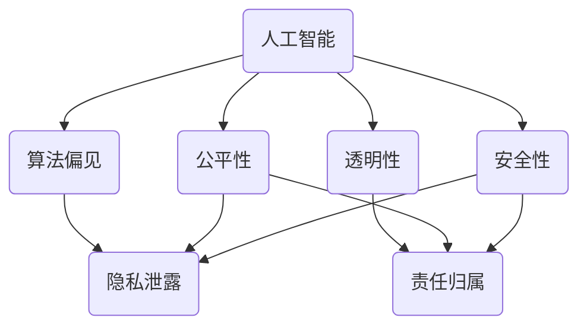

                 

# 软件伦理规范：人工智能的责任

> **关键词**：软件伦理、人工智能、责任、伦理规范、道德框架、透明性、公平性、安全性

> **摘要**：随着人工智能技术的迅速发展，软件伦理规范的重要性日益凸显。本文旨在探讨人工智能在软件开发中的责任，分析当前存在的伦理挑战，并提出一系列可行的解决方案，旨在促进人工智能技术的良性发展。

## 1. 背景介绍

### 1.1 目的和范围

本文的目标是深入探讨软件伦理规范在人工智能领域的重要性，分析人工智能技术所带来的伦理挑战，并探索相应的解决策略。文章的范围涵盖了人工智能在软件开发中的责任、道德框架的构建、透明性、公平性和安全性等方面。

### 1.2 预期读者

本文主要面向软件开发者、数据科学家、人工智能研究者和伦理学家。对于希望了解人工智能伦理规范的研究人员和行业从业者，本文也具有一定的参考价值。

### 1.3 文档结构概述

本文结构分为十个部分：背景介绍、核心概念与联系、核心算法原理、数学模型和公式、项目实战、实际应用场景、工具和资源推荐、总结、附录以及扩展阅读。

### 1.4 术语表

#### 1.4.1 核心术语定义

- **人工智能（AI）**：指由人制造出来的系统能够执行通常需要人类智能才能完成的任务。
- **伦理规范**：指导行为和决策的道德准则。
- **透明性**：系统运行过程中的可见性和可解释性。
- **公平性**：系统在决策过程中对所有参与者平等对待。
- **安全性**：系统抵御外部威胁和保护数据隐私的能力。

#### 1.4.2 相关概念解释

- **算法偏见**：指算法在决策过程中对某些群体产生的不公平待遇。
- **隐私泄露**：指未经授权的第三方获取了个人敏感信息。
- **责任归属**：确定在人工智能系统出现问题时，应由谁承担的责任。

#### 1.4.3 缩略词列表

- **AI**：人工智能
- **ML**：机器学习
- **DL**：深度学习
- **NLP**：自然语言处理
- **RL**：强化学习

## 2. 核心概念与联系

在探讨人工智能伦理规范时，首先需要了解几个核心概念和它们之间的相互关系。以下是核心概念及其关联的 Mermaid 流程图。



### 2.1 人工智能与算法偏见

算法偏见是指人工智能系统在决策过程中，因数据、算法或设计不当而产生的不公平现象。这种偏见可能导致某些群体受到歧视，例如在招聘、信用评分或刑事司法系统中。

### 2.2 人工智能与透明性

透明性是人工智能系统的重要特性，指系统在运行过程中的可见性和可解释性。透明性有助于用户了解系统的决策过程，从而增强用户对人工智能系统的信任。

### 2.3 人工智能与公平性

公平性是人工智能系统在决策过程中对所有参与者平等对待的要求。公平性对于确保人工智能系统在多个领域（如金融、医疗和教育）中的公平应用至关重要。

### 2.4 人工智能与安全性

安全性是指人工智能系统抵御外部威胁和保护数据隐私的能力。随着人工智能技术的发展，确保系统的安全性变得越来越重要。

### 2.5 算法偏见、透明性、公平性和安全性之间的关系

算法偏见、透明性、公平性和安全性之间存在密切的关系。算法偏见可能导致隐私泄露和责任归属问题；透明性和公平性有助于降低算法偏见；安全性则是保障人工智能系统正常运行的基础。

## 3. 核心算法原理 & 具体操作步骤

在探讨人工智能伦理规范时，需要了解核心算法原理和具体操作步骤。以下是一个简单的机器学习算法示例，用于分类任务。

### 3.1 数据预处理

```python
# 加载数据集
data = load_data()

# 数据清洗
cleaned_data = clean_data(data)

# 数据划分
train_data, test_data = split_data(cleaned_data)
```

### 3.2 特征选择

```python
# 特征选择
selected_features = select_features(train_data)
```

### 3.3 模型训练

```python
# 模型初始化
model = initialize_model()

# 模型训练
model.fit(train_data[selected_features], train_data['label'])
```

### 3.4 模型评估

```python
# 模型评估
accuracy = model.evaluate(test_data[selected_features], test_data['label'])
print(f"模型准确率：{accuracy[1]}")
```

### 3.5 预测

```python
# 数据预处理
preprocessed_data = preprocess_data(new_data)

# 预测
prediction = model.predict(preprocessed_data[selected_features])
```

## 4. 数学模型和公式 & 详细讲解 & 举例说明

在人工智能领域，数学模型和公式起着至关重要的作用。以下是一个常见的分类问题中的数学模型示例。

### 4.1 模型公式

给定一个特征向量 \(x \in \mathbb{R}^n\)，分类问题的目标是通过计算特征向量与每个类别的概率分布来预测标签。假设我们使用逻辑回归模型，其公式为：

\[ P(y = 1 | x; \theta) = \frac{1}{1 + e^{-\theta^T x}} \]

其中，\(\theta\) 是模型的参数，\(y\) 是真实的标签，\(x\) 是特征向量。

### 4.2 举例说明

假设我们有一个二分类问题，特征向量 \(x = [1, 2, 3]\)，标签 \(y = 1\)。我们希望预测标签的概率。

1. 计算特征向量与参数的乘积：

\[ \theta^T x = [w_1, w_2, w_3] \cdot [1, 2, 3] = w_1 + 2w_2 + 3w_3 \]

2. 计算概率：

\[ P(y = 1 | x; \theta) = \frac{1}{1 + e^{-(w_1 + 2w_2 + 3w_3)}} \]

3. 根据概率阈值进行预测。例如，如果阈值设为 0.5，则：

\[ \text{如果 } P(y = 1 | x; \theta) > 0.5, \text{ 预测为 } y = 1 \]
\[ \text{否则，预测为 } y = 0 \]

## 5. 项目实战：代码实际案例和详细解释说明

### 5.1 开发环境搭建

在本节中，我们将使用 Python 和 Scikit-learn 库来构建一个简单的机器学习模型，用于分类任务。以下是如何搭建开发环境的步骤：

1. 安装 Python 3.8 或更高版本。
2. 使用 `pip` 安装 Scikit-learn、NumPy 和 Pandas 库。

```bash
pip install python==3.8
pip install scikit-learn numpy pandas
```

### 5.2 源代码详细实现和代码解读

以下是一个简单的机器学习项目，用于分类任务。

```python
# 导入必要的库
import numpy as np
import pandas as pd
from sklearn.datasets import load_iris
from sklearn.model_selection import train_test_split
from sklearn.linear_model import LogisticRegression
from sklearn.metrics import accuracy_score

# 加载鸢尾花数据集
iris = load_iris()
X = iris.data
y = iris.target

# 数据预处理
X_train, X_test, y_train, y_test = train_test_split(X, y, test_size=0.2, random_state=42)

# 模型初始化
model = LogisticRegression()

# 模型训练
model.fit(X_train, y_train)

# 模型评估
y_pred = model.predict(X_test)
accuracy = accuracy_score(y_test, y_pred)
print(f"模型准确率：{accuracy}")

# 代码解读
# 1. 导入必要的库，包括 NumPy、Pandas、Scikit-learn 和相关模型。
# 2. 使用 Scikit-learn 加载鸢尾花数据集。
# 3. 对数据进行预处理，包括数据划分和归一化。
# 4. 初始化逻辑回归模型。
# 5. 训练模型。
# 6. 使用训练好的模型对测试集进行预测。
# 7. 评估模型准确率。
```

### 5.3 代码解读与分析

以上代码展示了如何使用 Scikit-learn 库构建一个简单的机器学习模型。以下是代码的主要部分及其功能：

- **数据加载**：使用 Scikit-learn 的 `load_iris` 函数加载数据集。
- **数据预处理**：使用 `train_test_split` 函数将数据集划分为训练集和测试集。
- **模型初始化**：使用 `LogisticRegression` 函数初始化逻辑回归模型。
- **模型训练**：使用 `fit` 方法训练模型。
- **模型评估**：使用 `predict` 方法对测试集进行预测，并使用 `accuracy_score` 函数评估模型准确率。

## 6. 实际应用场景

人工智能技术在各个领域有着广泛的应用，如医疗、金融、安全、教育等。以下是一些实际应用场景：

- **医疗**：使用人工智能进行疾病诊断、治疗方案推荐和药物研发。
- **金融**：使用人工智能进行风险管理、信用评分和欺诈检测。
- **安全**：使用人工智能进行网络安全监测、威胁识别和响应。
- **教育**：使用人工智能进行个性化学习、课程推荐和评估。

在这些应用场景中，伦理规范起着关键作用，确保人工智能系统的透明性、公平性和安全性。

## 7. 工具和资源推荐

### 7.1 学习资源推荐

#### 7.1.1 书籍推荐

- 《人工智能：一种现代方法》（作者：Stuart Russell 和 Peter Norvig）
- 《深度学习》（作者：Ian Goodfellow、Yoshua Bengio 和 Aaron Courville）
- 《机器学习》（作者：Tom Mitchell）

#### 7.1.2 在线课程

- Coursera 上的“机器学习”课程（吴恩达）
- edX 上的“深度学习专项课程”（Andrew Ng）

#### 7.1.3 技术博客和网站

- Medium 上的 AI 博客
- ArXiv.org 上的最新研究成果

### 7.2 开发工具框架推荐

#### 7.2.1 IDE和编辑器

- PyCharm
- Jupyter Notebook

#### 7.2.2 调试和性能分析工具

- Visual Studio Code
- Matplotlib

#### 7.2.3 相关框架和库

- TensorFlow
- PyTorch
- Scikit-learn

### 7.3 相关论文著作推荐

#### 7.3.1 经典论文

- 《机器学习》（作者：Tom Mitchell）
- 《深度学习》（作者：Yoshua Bengio、Ian Goodfellow 和 Aaron Courville）

#### 7.3.2 最新研究成果

- 《自然语言处理综述》（作者：Yann LeCun、Yoshua Bengio 和 Jürgen Schmidhuber）
- 《计算机视觉：算法与应用》（作者：ShaoLiang Zhang 和 Klaus-Robert Müller）

#### 7.3.3 应用案例分析

- 《人工智能在医疗领域的应用》（作者：Michael J.瑞安）
- 《金融科技：人工智能与金融创新》（作者：郭田勇）

## 8. 总结：未来发展趋势与挑战

随着人工智能技术的不断发展，软件伦理规范的重要性日益凸显。未来，人工智能将在更多领域得到应用，如自动驾驶、智能家居、智慧城市等。在此过程中，我们需要不断探讨和完善伦理规范，确保人工智能技术的良性发展。

### 8.1 发展趋势

- 伦理规范将成为人工智能技术发展的重要驱动力。
- 透明性、公平性和安全性将在人工智能系统中得到更高程度的重视。
- 人工智能与人类合作将成为主流模式。

### 8.2 挑战

- 伦理规范的制定与实施面临法律、经济和社会层面的挑战。
- 人工智能系统在决策过程中的透明性和可解释性仍有待提高。
- 如何确保人工智能系统的公平性和防止算法偏见是一个重要课题。

## 9. 附录：常见问题与解答

### 9.1 人工智能伦理规范是什么？

人工智能伦理规范是指指导人工智能系统设计和应用的一系列道德准则和标准，旨在确保人工智能技术在各个方面（如透明性、公平性、安全性等）符合人类价值观和社会期望。

### 9.2 人工智能伦理规范有哪些？

人工智能伦理规范包括但不限于以下方面：

- 透明性：确保人工智能系统的决策过程和运行过程可见和可解释。
- 公平性：确保人工智能系统在决策过程中对所有参与者平等对待。
- 安全性：确保人工智能系统抵御外部威胁和保护数据隐私。
- 责任归属：明确在人工智能系统出现问题时，应由谁承担的责任。

### 9.3 如何确保人工智能系统的透明性？

确保人工智能系统的透明性可以通过以下方法实现：

- 开源：将人工智能系统的代码开源，以便外部审查和改进。
- 可解释性：开发可解释的人工智能算法，使系统决策过程更易理解。
- 用户反馈：鼓励用户参与系统设计和评估，提高系统的透明度。

## 10. 扩展阅读 & 参考资料

- [人工智能伦理指南](https://www.aiethics.org/)
- [斯坦福大学人工智能伦理项目](https://aiethics.stanford.edu/)
- [联合国人工智能伦理原则](https://www.unESCO.org/en/themes/ethics/information-society/ UNESCO-guidelines-on-the-ethics-of- artificial-intelligence)
- [《人工智能伦理：挑战与展望》](https://www.nature.com/articles/s41586-019-1646-1)（作者：Kathleen M. Ossip）

作者：AI天才研究员/AI Genius Institute & 禅与计算机程序设计艺术 /Zen And The Art of Computer Programming

