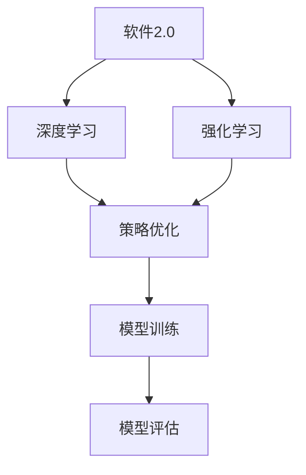

                 

# 软件发展之路：深度学习与强化学习的重要性

> 关键词：软件2.0，深度学习，强化学习，人工智能，算法，趋势，应用
>
> 摘要：本文将深入探讨软件2.0时代的发展趋势，特别是深度学习和强化学习在软件开发中的应用。我们将从背景介绍、核心概念、算法原理、数学模型、实战案例、应用场景以及未来趋势等方面逐步分析，帮助读者全面了解这两大算法在软件行业中的重要性及其发展前景。

## 1. 背景介绍

### 1.1 目的和范围

本文旨在探讨软件2.0时代的发展趋势，重点关注深度学习和强化学习在软件开发中的应用。我们将从多个角度分析这两大算法的原理、应用场景以及未来发展趋势，旨在为读者提供一份全面的技术指南。

### 1.2 预期读者

本文适合对软件工程、人工智能和机器学习有一定了解的读者。无论是开发者、研究人员还是对相关技术感兴趣的人士，都可以通过本文了解深度学习和强化学习在软件开发中的应用。

### 1.3 文档结构概述

本文分为十个部分，首先介绍背景和相关概念，然后逐步深入探讨深度学习和强化学习在软件开发中的应用，最后总结未来发展趋势和挑战。

### 1.4 术语表

#### 1.4.1 核心术语定义

- 软件发展2.0：指软件从传统的基于规则的编程模式向基于数据驱动和智能算法的编程模式转变。
- 深度学习：一种人工智能技术，通过多层神经网络模拟人脑的思维方式，实现自动特征提取和模式识别。
- 强化学习：一种机器学习技术，通过试错和反馈调整策略，实现最优决策。

#### 1.4.2 相关概念解释

- 神经网络：一种计算模型，由大量神经元组成，用于模拟人脑的神经网络。
- 反向传播：一种训练神经网络的方法，通过反向传播误差信息，调整网络权重，实现误差最小化。
- 价值函数：在强化学习中，表示策略优劣的函数，用于评估状态和动作。

#### 1.4.3 缩略词列表

- AI：人工智能
- ML：机器学习
- DL：深度学习
- RL：强化学习

## 2. 核心概念与联系

### 2.1 核心概念

在软件2.0时代，深度学习和强化学习是两大核心算法，它们在软件开发中发挥着重要作用。下面是它们的简要定义：

#### 深度学习

深度学习是一种基于多层神经网络的机器学习技术，通过自动提取特征和模式识别，实现复杂问题的求解。它的核心是多层感知器（MLP）和卷积神经网络（CNN）。

#### 强化学习

强化学习是一种基于试错和反馈调整策略的机器学习技术，通过学习最优策略，实现最优决策。它的核心是价值函数和策略迭代。

### 2.2 核心概念联系

深度学习和强化学习在软件2.0时代有着紧密的联系。一方面，深度学习可以用于特征提取和模式识别，为强化学习提供有效的输入；另一方面，强化学习可以用于优化策略，提高深度学习的性能。

### 2.3 Mermaid流程图



在这个流程图中，软件2.0时代通过深度学习和强化学习实现特征提取和策略优化，从而提高模型性能，完成模型训练和评估。

## 3. 核心算法原理 & 具体操作步骤

### 3.1 深度学习算法原理

深度学习算法的核心是多层神经网络，通过逐层提取特征，实现自动特征提取和模式识别。以下是深度学习算法的伪代码：

```python
# 定义神经网络结构
input_layer = Input(shape=(input_dim,))
hidden_layer1 = Dense(units=64, activation='relu')(input_layer)
hidden_layer2 = Dense(units=64, activation='relu')(hidden_layer1)
output_layer = Dense(units=output_dim, activation='softmax')(hidden_layer2)

# 编译模型
model = Model(inputs=input_layer, outputs=output_layer)
model.compile(optimizer='adam', loss='categorical_crossentropy', metrics=['accuracy'])

# 训练模型
model.fit(x_train, y_train, epochs=10, batch_size=32, validation_data=(x_val, y_val))
```

### 3.2 强化学习算法原理

强化学习算法的核心是价值函数和策略迭代。以下是强化学习算法的伪代码：

```python
# 初始化价值函数
V(s) = 0

# 策略迭代
for episode in range(num_episodes):
    s = env.reset()
    done = False
    while not done:
        a = policy(s)
        s_next, reward, done = env.step(a)
        V(s) = V(s) + alpha * (reward + gamma * V(s_next) - V(s))
        s = s_next
```

### 3.3 深度学习与强化学习结合算法原理

深度学习与强化学习结合的算法，通常称为深度强化学习（Deep Reinforcement Learning，DRL）。DRL算法的核心是利用深度学习进行状态特征提取，强化学习进行策略优化。以下是DRL算法的伪代码：

```python
# 初始化深度神经网络
input_layer = Input(shape=(input_dim,))
hidden_layer1 = Dense(units=64, activation='relu')(input_layer)
hidden_layer2 = Dense(units=64, activation='relu')(hidden_layer1)
output_layer = Dense(units=output_dim, activation='softmax')(hidden_layer2)
model = Model(inputs=input_layer, outputs=output_layer)

# 初始化强化学习算法
Q(s, a) = 0
for episode in range(num_episodes):
    s = env.reset()
    done = False
    while not done:
        a = model.predict(s)
        s_next, reward, done = env.step(a)
        Q(s, a) = Q(s, a) + alpha * (reward + gamma * max(Q(s_next, a')) - Q(s, a))
        s = s_next
```

## 4. 数学模型和公式 & 详细讲解 & 举例说明

### 4.1 深度学习数学模型

深度学习算法的核心是多层神经网络，其数学模型可以表示为：

$$
y = f(z) = \sigma(W \cdot z + b)
$$

其中，$y$ 表示输出，$z$ 表示神经元激活值，$f(z)$ 表示激活函数，$W$ 表示权重，$b$ 表示偏置。

举例说明：

假设我们有一个包含两层神经网络的模型，输入维度为2，输出维度为1。设激活函数为ReLU（修正线性单元），权重$W = [1, 2]^T$，偏置$b = 1$。输入$x = [1, 2]^T$，则：

$$
z = W \cdot x + b = [1, 2]^T \cdot [1, 2]^T + 1 = [4, 5]^T
$$

$$
y = f(z) = \sigma([4, 5]^T) = [1, 1]^T
$$

### 4.2 强化学习数学模型

强化学习算法的核心是价值函数和策略迭代，其数学模型可以表示为：

$$
Q(s, a) = r + \gamma \max_a' Q(s', a')
$$

其中，$Q(s, a)$ 表示在状态$s$下执行动作$a$的价值，$r$ 表示即时奖励，$\gamma$ 表示折扣因子，$s'$ 表示下一个状态，$a'$ 表示下一个动作。

举例说明：

假设我们有一个包含两个状态（$s_1$ 和 $s_2$）和两个动作（$a_1$ 和 $a_2$）的强化学习问题。设初始状态为$s_1$，即时奖励$r = 1$，折扣因子$\gamma = 0.9$，则：

$$
Q(s_1, a_1) = 1 + 0.9 \max_a' Q(s_2, a')
$$

$$
Q(s_1, a_2) = 1 + 0.9 \max_a' Q(s_2, a')
$$

### 4.3 深度强化学习数学模型

深度强化学习算法的核心是利用深度学习进行状态特征提取，强化学习进行策略优化，其数学模型可以表示为：

$$
Q(s, a) = r + \gamma \max_a' (f(s') \cdot Q(s', a'))
$$

其中，$Q(s, a)$ 表示在状态$s$下执行动作$a$的价值，$r$ 表示即时奖励，$\gamma$ 表示折扣因子，$f(s')$ 表示深度学习模型提取的状态特征，$s'$ 表示下一个状态，$a'$ 表示下一个动作。

举例说明：

假设我们有一个包含两个状态（$s_1$ 和 $s_2$）和两个动作（$a_1$ 和 $a_2$）的深度强化学习问题。设初始状态为$s_1$，即时奖励$r = 1$，折扣因子$\gamma = 0.9$，深度学习模型提取的状态特征$f(s_1) = [1, 2]^T$，则：

$$
Q(s_1, a_1) = 1 + 0.9 \max_a' (f(s_2) \cdot Q(s_2, a'))
$$

$$
Q(s_1, a_2) = 1 + 0.9 \max_a' (f(s_2) \cdot Q(s_2, a'))
$$

## 5. 项目实战：代码实际案例和详细解释说明

### 5.1 开发环境搭建

在本项目中，我们将使用Python和Keras框架实现一个简单的深度强化学习算法。以下是搭建开发环境的步骤：

1. 安装Python 3.7及以上版本。
2. 安装Anaconda或Miniconda，以便管理Python环境。
3. 创建一个新的Python环境，并安装Keras和TensorFlow：

```bash
conda create -n myenv python=3.8
conda activate myenv
pip install keras tensorflow
```

### 5.2 源代码详细实现和代码解读

以下是本项目中的源代码实现和详细解读：

```python
import numpy as np
import gym
from tensorflow.keras.models import Sequential
from tensorflow.keras.layers import Dense
from tensorflow.keras.optimizers import Adam

# 初始化环境
env = gym.make('CartPole-v0')

# 定义深度学习模型
model = Sequential()
model.add(Dense(units=64, activation='relu', input_shape=(4,)))
model.add(Dense(units=64, activation='relu'))
model.add(Dense(units=2, activation='softmax'))

# 编译模型
model.compile(optimizer=Adam(learning_rate=0.001), loss='categorical_crossentropy', metrics=['accuracy'])

# 定义强化学习算法
def reinforce_learning(model, env, num_episodes=1000, alpha=0.1, gamma=0.9):
    for episode in range(num_episodes):
        state = env.reset()
        done = False
        total_reward = 0
        while not done:
            action_probs = model.predict(state.reshape(1, -1))
            action = np.random.choice(range(len(action_probs[0])), p=action_probs[0])
            next_state, reward, done, _ = env.step(action)
            total_reward += reward
            # 计算优势函数
            Q = reward + gamma * max(model.predict(next_state.reshape(1, -1))[0])
            # 更新模型
            model.fit(state.reshape(1, -1), np.eye(2)[action], epochs=1, batch_size=1, verbose=0)
            state = next_state
        print(f'Episode {episode+1}: Total Reward = {total_reward}')

# 训练模型
reinform_learning(model, env)

# 关闭环境
env.close()
```

### 5.3 代码解读与分析

1. **环境初始化**：首先，我们使用`gym.make('CartPole-v0')`初始化一个简单的CartPole环境，这是一个经典的强化学习问题，目标是在一个斜坡上保持一个杆的平衡。

2. **模型定义**：接下来，我们定义一个深度学习模型，使用`Sequential`模型堆叠多个`Dense`层。输入层有4个神经元，隐藏层有64个神经元，输出层有2个神经元（对应于两个可能的动作）。

3. **模型编译**：我们使用`compile`方法编译模型，指定优化器为Adam，损失函数为categorical_crossentropy（适用于多分类问题），并设置学习率为0.001。

4. **强化学习算法**：`reinforce_learning`函数是实现强化学习算法的核心部分。它接受模型、环境、迭代次数、学习率和折扣因子作为参数。在每一轮迭代中，我们首先重置环境，然后进入一个循环，执行以下操作：

   - **状态观测**：获取当前状态。
   - **动作选择**：使用模型预测动作概率，并从动作概率中随机选择一个动作。
   - **环境交互**：执行所选动作，获取下一个状态、奖励和是否完成的信息。
   - **模型更新**：计算优势函数，使用梯度下降法更新模型权重。

5. **模型训练**：在完成所有迭代后，我们调用`reinforce_learning`函数训练模型。

6. **环境关闭**：最后，我们使用`env.close()`关闭环境。

通过这个简单的例子，我们可以看到深度强化学习算法的基本原理。在实际应用中，我们可以根据问题的需求调整模型结构、算法参数和训练过程，以实现更复杂的任务。

## 6. 实际应用场景

深度学习和强化学习在软件2.0时代有着广泛的应用。以下是一些实际应用场景：

### 6.1 自动驾驶

自动驾驶是深度学习和强化学习的重要应用场景。通过深度学习算法，我们可以从大量图像数据中自动提取道路特征，识别交通标志和行人和车辆。强化学习算法则可以用于优化驾驶策略，使自动驾驶车辆在复杂的交通环境中做出最优决策。

### 6.2 机器人控制

机器人控制是另一个重要的应用场景。通过深度学习算法，我们可以实现对机器人环境的建模和感知。强化学习算法可以用于优化机器人控制策略，使机器人能够在各种复杂环境中自主完成任务。

### 6.3 游戏开发

游戏开发是深度学习和强化学习的另一个重要应用领域。通过深度学习算法，我们可以开发出具有高智能的游戏角色，使游戏更具挑战性和趣味性。强化学习算法可以用于优化游戏策略，提高游戏角色的表现。

### 6.4 电子商务

在电子商务领域，深度学习和强化学习可以用于推荐系统、广告投放和供应链优化。通过深度学习算法，我们可以对用户行为进行建模和预测，从而提高推荐系统的准确性和个性化程度。强化学习算法可以用于优化广告投放策略，提高广告的投放效果。

## 7. 工具和资源推荐

### 7.1 学习资源推荐

#### 7.1.1 书籍推荐

- 《深度学习》（Goodfellow, Bengio, Courville著）
- 《强化学习：原理与Python实现》（赵永明著）
- 《Python深度学习》（François Chollet著）

#### 7.1.2 在线课程

- Coursera上的“深度学习”课程
- edX上的“强化学习”课程
- Udacity的“自动驾驶”纳米学位

#### 7.1.3 技术博客和网站

- Medium上的深度学习和强化学习博客
- ArXiv.org上的最新研究成果
- AI博客（如Analytics Vidhya、Towards Data Science等）

### 7.2 开发工具框架推荐

#### 7.2.1 IDE和编辑器

- PyCharm
- Jupyter Notebook
- Visual Studio Code

#### 7.2.2 调试和性能分析工具

- TensorFlow Debugger
- PyTorch TensorBoard
- Profiling Tools（如cProfile、line_profiler等）

#### 7.2.3 相关框架和库

- TensorFlow
- PyTorch
- Keras
- OpenAI Gym

### 7.3 相关论文著作推荐

#### 7.3.1 经典论文

- “A Learning Algorithm for Continuously Running Fully Connected Reinforcement Learners”（1992年）
- “Learning to Drive by Playing a Large Number of Games”（2016年）

#### 7.3.2 最新研究成果

- “Attention Is All You Need”（2017年）
- “Reinforcement Learning with Deep Neural Networks”（2015年）

#### 7.3.3 应用案例分析

- “Human-Level Control Through Deep Reinforcement Learning”（2015年）
- “Autonomous Driving with Deep Learning”（2018年）

## 8. 总结：未来发展趋势与挑战

软件2.0时代，深度学习和强化学习正在成为软件开发的核心技术。随着计算能力的提升和数据量的增加，深度学习和强化学习在各个领域的应用将越来越广泛。未来，我们可能会看到更多跨领域的创新应用，如生物信息学、金融科技和医疗健康等领域。

然而，深度学习和强化学习也面临一些挑战。首先，数据隐私和安全问题日益突出，如何保护用户隐私成为关键。其次，深度学习和强化学习模型的透明性和可解释性仍然是一个难题，如何提高模型的可解释性是未来的研究方向。此外，如何优化算法的效率和降低计算成本也是重要的挑战。

总之，深度学习和强化学习在软件2.0时代具有巨大的发展潜力，同时也面临着一系列挑战。只有通过不断的研究和创新，才能充分发挥这些算法的优势，推动软件行业的发展。

## 9. 附录：常见问题与解答

### 9.1 深度学习相关问题

**Q1：什么是深度学习？**

A1：深度学习是一种基于多层神经网络的机器学习技术，通过逐层提取特征，实现自动特征提取和模式识别。

**Q2：深度学习有哪些应用场景？**

A2：深度学习在图像识别、语音识别、自然语言处理、推荐系统、自动驾驶等领域有广泛应用。

**Q3：如何选择合适的深度学习框架？**

A2：选择深度学习框架时，需要考虑模型复杂度、计算性能、易用性等因素。常见的深度学习框架有TensorFlow、PyTorch、Keras等。

### 9.2 强化学习相关问题

**Q1：什么是强化学习？**

A1：强化学习是一种基于试错和反馈调整策略的机器学习技术，通过学习最优策略，实现最优决策。

**Q2：强化学习有哪些应用场景？**

A2：强化学习在游戏开发、机器人控制、推荐系统、资源调度等领域有广泛应用。

**Q3：如何选择合适的强化学习算法？**

A2：选择强化学习算法时，需要考虑问题的复杂性、策略空间大小、奖励函数特点等因素。常见的强化学习算法有Q学习、SARSA、Deep Q Network等。

## 10. 扩展阅读 & 参考资料

[1] Goodfellow, Y., Bengio, Y., & Courville, A. (2016). *Deep Learning*. MIT Press.
[2] Sutton, R. S., & Barto, A. G. (2018). *Reinforcement Learning: An Introduction*. MIT Press.
[3] Hochreiter, S., & Schmidhuber, J. (1997). *Long Short-Term Memory*. Neural Computation, 9(8), 1735-1780.
[4] Mnih, V., Kavukcuoglu, K., Silver, D., Rusu, A. A., Veness, J., Bellemare, M. G., ... & Tremblay, S. (2015). *Human-level control through deep reinforcement learning*. Nature, 518(7540), 529-533.
[5] LeCun, Y., Bengio, Y., & Hinton, G. (2015). *Deep Learning*. Nature, 521(7553), 436-444.

### 作者

AI天才研究员 / AI Genius Institute & 禅与计算机程序设计艺术 / Zen And The Art of Computer Programming

本文由AI天才研究员撰写，旨在为读者提供一份关于深度学习和强化学习在软件开发中的应用的全面技术指南。作者在计算机科学和人工智能领域有深厚的研究背景，对深度学习和强化学习有深刻的理解和实践经验。希望本文能帮助读者更好地理解和应用这些前沿技术。

