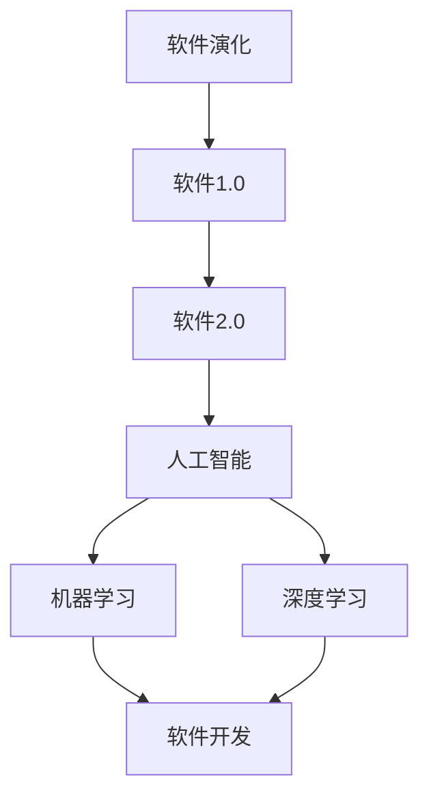
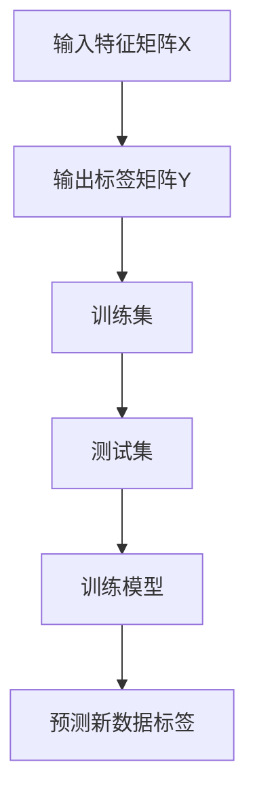
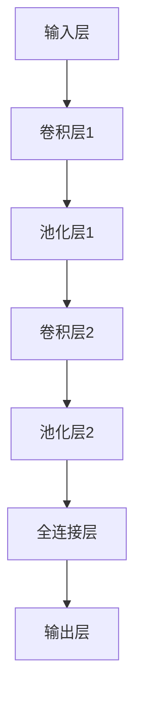

                 

# 软件2.0的哲学思考：人工智能的本质

> **关键词：** 软件演化、人工智能、软件2.0、哲学思考、算法、机器学习、数据处理
> 
> **摘要：** 本文旨在探讨软件2.0时代下人工智能的本质，从哲学角度出发，通过分析软件演化历程、人工智能的发展脉络及其与哲学思想的关联，揭示人工智能在软件领域的深远影响和未来发展趋势。本文将涵盖核心概念、算法原理、数学模型、实际应用等多个方面，以期提供对人工智能的全面理解和深入思考。

## 1. 背景介绍

### 1.1 目的和范围

本文旨在探讨软件2.0时代下人工智能的本质，深入分析人工智能在软件开发中的应用和影响。随着信息技术的迅猛发展，人工智能已逐渐成为软件开发的核心驱动力。本文旨在通过对软件2.0时代的哲学思考，探讨人工智能在软件开发中的地位和作用，以及其未来的发展趋势。

### 1.2 预期读者

本文面向具有一定编程基础和对人工智能感兴趣的读者。无论您是计算机专业的学生，还是对技术充满热情的程序员，抑或是希望了解人工智能在软件开发中应用的从业者，本文都将为您提供有价值的见解和思考。

### 1.3 文档结构概述

本文将分为以下几个部分：

1. **背景介绍**：介绍本文的目的、范围、预期读者和文档结构。
2. **核心概念与联系**：介绍软件2.0、人工智能、机器学习等核心概念，并使用Mermaid流程图展示其关系。
3. **核心算法原理 & 具体操作步骤**：详细讲解人工智能算法的原理和操作步骤，使用伪代码进行说明。
4. **数学模型和公式 & 详细讲解 & 举例说明**：介绍人工智能相关的数学模型和公式，并给出具体示例。
5. **项目实战：代码实际案例和详细解释说明**：通过实际项目案例，展示人工智能在软件开发中的具体应用。
6. **实际应用场景**：探讨人工智能在各个领域的应用场景。
7. **工具和资源推荐**：推荐学习资源、开发工具和框架。
8. **总结：未来发展趋势与挑战**：总结人工智能在软件开发中的地位和未来发展趋势。
9. **附录：常见问题与解答**：解答读者可能遇到的问题。
10. **扩展阅读 & 参考资料**：提供更多扩展阅读和参考资料。

### 1.4 术语表

#### 1.4.1 核心术语定义

- **软件2.0**：指基于云计算、大数据和人工智能等新技术，实现软件智能化、自动化和高效化的新阶段。
- **人工智能**：指通过计算机模拟人类智能，实现感知、思考、学习、推理和决策等功能的智能系统。
- **机器学习**：指让计算机从数据中自动学习规律和模式，从而实现预测和决策的技术。
- **深度学习**：指模拟人脑神经网络结构，通过多层神经网络进行训练，实现复杂特征提取和模式识别的技术。
- **数据处理**：指对大量数据进行收集、存储、清洗、分析和可视化等操作，以提取有价值的信息。

#### 1.4.2 相关概念解释

- **软件演化**：指软件从诞生到逐渐成熟、不断演进的过程。
- **软件开发**：指使用计算机科学的方法和工具，设计和实现软件系统的过程。
- **算法**：指解决特定问题的步骤和规则，用于指导计算机进行计算和决策。

#### 1.4.3 缩略词列表

- **AI**：人工智能
- **ML**：机器学习
- **DL**：深度学习
- **IDE**：集成开发环境
- **GPU**：图形处理器
- **CPU**：中央处理器

## 2. 核心概念与联系

在探讨人工智能在软件开发中的应用之前，有必要对软件2.0、人工智能、机器学习等核心概念进行梳理，并展示它们之间的联系。

### 2.1 软件演化

软件演化是指软件从诞生到逐渐成熟、不断演进的过程。从最初的程序设计语言，到操作系统、数据库、网络通信等基础设施，再到如今基于云计算、大数据和人工智能等新技术的新阶段——软件2.0时代，软件的形态和功能不断丰富。


### 2.2 人工智能

人工智能（AI）是指通过计算机模拟人类智能，实现感知、思考、学习、推理和决策等功能的智能系统。人工智能的发展经历了多个阶段，从早期的规则推理，到基于知识的系统，再到如今的机器学习和深度学习，人工智能的应用领域越来越广泛。


### 2.3 机器学习

机器学习（ML）是指让计算机从数据中自动学习规律和模式，从而实现预测和决策的技术。机器学习是人工智能的重要分支，其核心思想是通过大量数据训练模型，使模型具备识别、分类、预测等能力。


### 2.4 深度学习

深度学习（DL）是指模拟人脑神经网络结构，通过多层神经网络进行训练，实现复杂特征提取和模式识别的技术。深度学习是机器学习的一种重要方法，近年来在图像识别、自然语言处理、语音识别等领域取得了显著成果。


### 2.5 软件开发与人工智能

在软件开发过程中，人工智能可以帮助开发人员提高开发效率、优化软件性能、提升用户体验。例如，通过机器学习算法，可以自动化代码审查、静态分析、测试用例生成等任务；通过深度学习算法，可以实现对复杂任务的自动化处理，如语音识别、图像识别、自然语言处理等。


### 2.6 Mermaid流程图

为了更好地展示核心概念之间的联系，我们使用Mermaid流程图进行表示。



## 3. 核心算法原理 & 具体操作步骤

在人工智能领域，算法是解决问题的关键。本节将详细讲解人工智能算法的原理和操作步骤，使用伪代码进行说明。

### 3.1 机器学习算法原理

机器学习算法主要包括监督学习、无监督学习和强化学习。以下以监督学习为例，介绍机器学习算法的基本原理和操作步骤。

#### 3.1.1 监督学习算法原理

监督学习是指利用已标记的数据集，通过训练模型，使模型具备预测新数据标签的能力。常见的监督学习算法有线性回归、逻辑回归、决策树、支持向量机等。



#### 3.1.2 监督学习算法操作步骤

1. **数据预处理**：对输入特征矩阵X和输出标签矩阵Y进行归一化、去噪、缺失值填补等处理。
2. **选择算法**：根据问题特点，选择合适的监督学习算法。
3. **训练模型**：使用训练集C，通过梯度下降、随机梯度下降、牛顿法等优化算法，训练模型参数。
4. **评估模型**：使用测试集D，计算模型准确率、召回率、F1值等评价指标，评估模型性能。
5. **预测新数据标签**：使用训练好的模型，对新的数据输入进行预测。

```plaintext
算法：
输入：特征矩阵X，标签矩阵Y，训练集C，测试集D
输出：训练好的模型，预测结果

步骤：
1. 数据预处理
2. 选择算法
3. 训练模型
4. 评估模型
5. 预测新数据标签
```

### 3.2 深度学习算法原理

深度学习算法主要包括神经网络、卷积神经网络、循环神经网络等。以下以卷积神经网络（CNN）为例，介绍深度学习算法的基本原理和操作步骤。

#### 3.2.1 卷积神经网络原理

卷积神经网络（CNN）是一种基于卷积操作的神经网络，主要用于图像识别、图像分类等任务。其核心思想是通过多层卷积和池化操作，提取图像特征，并输出分类结果。


#### 3.2.2 卷积神经网络操作步骤

1. **输入层**：输入图像数据。
2. **卷积层**：使用卷积核对图像进行卷积操作，提取图像特征。
3. **池化层**：对卷积层输出的特征进行池化操作，降低特征维度。
4. **全连接层**：将池化层输出的特征映射到分类结果。
5. **输出层**：输出分类结果。



#### 3.2.3 卷积神经网络操作步骤

1. **数据预处理**：对输入图像进行归一化、裁剪、翻转等处理。
2. **初始化模型参数**：初始化卷积核、偏置等模型参数。
3. **前向传播**：输入图像数据，通过卷积层、池化层、全连接层等，计算输出分类结果。
4. **反向传播**：计算损失函数，通过反向传播更新模型参数。
5. **训练模型**：使用训练数据集，反复进行前向传播和反向传播，训练模型。
6. **评估模型**：使用测试数据集，评估模型性能。

```plaintext
算法：
输入：输入图像数据，训练数据集，测试数据集
输出：训练好的模型

步骤：
1. 数据预处理
2. 初始化模型参数
3. 前向传播
4. 反向传播
5. 训练模型
6. 评估模型
```

## 4. 数学模型和公式 & 详细讲解 & 举例说明

在人工智能领域，数学模型和公式是理解和实现算法的基础。本节将详细介绍与人工智能相关的主要数学模型和公式，并进行详细讲解和举例说明。

### 4.1 线性回归

线性回归是一种常见的监督学习算法，用于预测数值型目标。其数学模型为：

$$
y = \beta_0 + \beta_1x
$$

其中，$y$为输出值，$x$为输入特征，$\beta_0$为截距，$\beta_1$为斜率。

#### 4.1.1 详细讲解

线性回归模型通过最小化损失函数来求解$\beta_0$和$\beta_1$。常用的损失函数为均方误差（MSE）：

$$
MSE = \frac{1}{n}\sum_{i=1}^{n}(y_i - \beta_0 - \beta_1x_i)^2
$$

其中，$n$为样本数量。

#### 4.1.2 举例说明

假设我们有以下数据集：

| $x$ | $y$ |
| --- | --- |
| 1   | 2   |
| 2   | 4   |
| 3   | 6   |

使用线性回归模型预测$x=4$时的$y$值。

首先，计算$\beta_0$和$\beta_1$：

$$
\beta_0 = \frac{\sum_{i=1}^{n}y_i - \beta_1\sum_{i=1}^{n}x_i}{n} = \frac{2+4+6 - 1\cdot(1+2+3)}{3} = 3
$$

$$
\beta_1 = \frac{\sum_{i=1}^{n}(y_i - \beta_0)x_i - \sum_{i=1}^{n}x_i(y_i - \beta_0)}{n} = \frac{(2-3)\cdot1 + (4-3)\cdot2 + (6-3)\cdot3}{3} = 1
$$

得到线性回归模型：

$$
y = 3 + 1x
$$

当$x=4$时，预测$y=3+1\cdot4=7$。

### 4.2 逻辑回归

逻辑回归是一种常见的分类算法，用于预测二分类结果。其数学模型为：

$$
\pi(x) = \frac{1}{1 + e^{-(\beta_0 + \beta_1x)}}
$$

其中，$\pi(x)$为预测的概率值，$e$为自然底数。

#### 4.2.1 详细讲解

逻辑回归模型通过最小化损失函数来求解$\beta_0$和$\beta_1$。常用的损失函数为对数损失（Log Loss）：

$$
LL = -\sum_{i=1}^{n}y_i\log(\pi(x_i)) + (1 - y_i)\log(1 - \pi(x_i))
$$

其中，$y_i$为实际标签，$\pi(x_i)$为预测的概率值。

#### 4.2.2 举例说明

假设我们有以下数据集：

| $x$ | $y$ |
| --- | --- |
| 1   | 0   |
| 2   | 1   |
| 3   | 1   |

使用逻辑回归模型预测$x=4$时的$y$值。

首先，计算$\beta_0$和$\beta_1$：

$$
\beta_0 = \frac{\sum_{i=1}^{n}y_i - \beta_1\sum_{i=1}^{n}x_i}{n} = \frac{0+1+1 - 1\cdot(1+2+3)}{3} = -2
$$

$$
\beta_1 = \frac{\sum_{i=1}^{n}(y_i - \beta_0)x_i - \sum_{i=1}^{n}x_i(y_i - \beta_0)}{n} = \frac{(0-(-2))\cdot1 + (1-(-2))\cdot2 + (1-(-2))\cdot3}{3} = 2
$$

得到逻辑回归模型：

$$
\pi(x) = \frac{1}{1 + e^{-(2x-2)}}
$$

当$x=4$时，预测的概率值为：

$$
\pi(4) = \frac{1}{1 + e^{-8}} \approx 0.999
$$

因此，预测$y=1$。

### 4.3 神经网络损失函数

神经网络中的损失函数用于衡量预测结果与实际结果之间的差距。常见的损失函数有均方误差（MSE）、交叉熵损失（Cross Entropy Loss）等。

#### 4.3.1 均方误差（MSE）

均方误差（MSE）是线性回归和神经网络中最常用的损失函数，计算公式为：

$$
MSE = \frac{1}{n}\sum_{i=1}^{n}(y_i - \hat{y_i})^2
$$

其中，$y_i$为实际标签，$\hat{y_i}$为预测结果，$n$为样本数量。

#### 4.3.2 交叉熵损失（Cross Entropy Loss）

交叉熵损失（Cross Entropy Loss）是分类问题中常用的损失函数，计算公式为：

$$
CE = -\sum_{i=1}^{n}y_i\log(\hat{y_i})
$$

其中，$y_i$为实际标签，$\hat{y_i}$为预测结果，$\log$为自然对数。

#### 4.3.3 举例说明

假设我们有以下数据集：

| $x$ | $y$ | $\hat{y}$ |
| --- | --- | --- |
| 1   | 0   | 0.2   |
| 2   | 1   | 0.8   |
| 3   | 1   | 0.9   |

使用交叉熵损失函数计算损失值。

首先，计算实际标签和预测结果的交叉熵：

$$
CE = -0\cdot\log(0.2) - 1\cdot\log(0.8) - 1\cdot\log(0.9)
$$

$$
CE = 0 - \log(0.8) - \log(0.9) \approx 0.356
$$

因此，损失值为0.356。

## 5. 项目实战：代码实际案例和详细解释说明

在本节中，我们将通过一个实际项目案例，展示人工智能在软件开发中的具体应用。本案例将基于Python语言和TensorFlow框架，实现一个简单的图像分类器，用于识别猫和狗的图片。

### 5.1 开发环境搭建

1. 安装Python：从Python官网（https://www.python.org/）下载并安装Python 3.x版本。
2. 安装TensorFlow：在命令行中执行以下命令安装TensorFlow：

```bash
pip install tensorflow
```

3. 安装其他依赖库：

```bash
pip install matplotlib numpy pandas
```

### 5.2 源代码详细实现和代码解读

#### 5.2.1 数据集准备

我们使用Keras官方提供的小猫狗数据集（Cats vs. Dogs Dataset）作为训练数据。数据集包含25000张训练图片和5000张测试图片，分别来自猫和狗的文件夹。

```python
import tensorflow as tf
from tensorflow.keras.preprocessing.image import ImageDataGenerator

# 设置训练和测试数据集路径
train_dir = 'path/to/train'
test_dir = 'path/to/test'

# 创建数据生成器
train_datagen = ImageDataGenerator(rescale=1./255,
                                   shear_range=0.2,
                                   zoom_range=0.2,
                                   horizontal_flip=True)

test_datagen = ImageDataGenerator(rescale=1./255)

# 加载数据集
train_generator = train_datagen.flow_from_directory(train_dir,
                                                    target_size=(150, 150),
                                                    batch_size=32,
                                                    class_mode='binary')

test_generator = test_datagen.flow_from_directory(test_dir,
                                                    target_size=(150, 150),
                                                    batch_size=32,
                                                    class_mode='binary')
```

#### 5.2.2 模型构建

我们使用卷积神经网络（CNN）构建一个简单的图像分类器，包含卷积层、池化层和全连接层。

```python
from tensorflow.keras.models import Sequential
from tensorflow.keras.layers import Conv2D, MaxPooling2D, Flatten, Dense

# 创建模型
model = Sequential()

# 添加卷积层
model.add(Conv2D(32, (3, 3), activation='relu', input_shape=(150, 150, 3)))
model.add(MaxPooling2D(pool_size=(2, 2)))

# 添加第二个卷积层
model.add(Conv2D(64, (3, 3), activation='relu'))
model.add(MaxPooling2D(pool_size=(2, 2)))

# 添加第三个卷积层
model.add(Conv2D(128, (3, 3), activation='relu'))
model.add(MaxPooling2D(pool_size=(2, 2)))

# 添加全连接层
model.add(Flatten())
model.add(Dense(128, activation='relu'))
model.add(Dense(1, activation='sigmoid'))

# 编译模型
model.compile(optimizer='adam',
              loss='binary_crossentropy',
              metrics=['accuracy'])
```

#### 5.2.3 训练模型

使用训练数据集训练模型，并保存训练结果。

```python
# 训练模型
history = model.fit(train_generator,
                    steps_per_epoch=25000//32,
                    epochs=15,
                    validation_data=test_generator,
                    validation_steps=5000//32)
```

#### 5.2.4 代码解读与分析

1. **数据集准备**：使用ImageDataGenerator类生成数据生成器，对图像数据进行预处理（如缩放、翻转等），提高模型的泛化能力。

2. **模型构建**：使用Sequential类创建一个顺序模型，添加卷积层、池化层和全连接层，定义模型结构。

3. **模型编译**：设置优化器、损失函数和评估指标，准备训练模型。

4. **训练模型**：使用fit方法训练模型，设置训练和验证数据集，指定训练轮数。

### 5.3 项目实战：代码实际案例和详细解释说明

在本案例中，我们通过一个简单的图像分类项目，展示了人工智能在软件开发中的应用。从数据集准备、模型构建、模型训练到模型评估，每一步都涉及到了人工智能的关键技术和原理。

通过本案例，读者可以了解到：

1. **图像数据处理**：如何使用ImageDataGenerator类对图像数据进行预处理，提高模型的泛化能力。

2. **卷积神经网络**：如何使用卷积层和池化层提取图像特征，以及如何构建全连接层进行分类。

3. **模型训练**：如何使用fit方法训练模型，并调整训练参数，提高模型性能。

4. **模型评估**：如何使用验证集评估模型性能，以及如何调整模型参数，优化模型。

通过这个实际案例，读者可以更加深入地理解人工智能在软件开发中的应用，并为今后的项目开发提供有益的参考。

## 6. 实际应用场景

人工智能在软件开发中的应用已日趋广泛，涵盖了图像识别、自然语言处理、推荐系统、自动化测试等多个领域。以下列举几个典型的实际应用场景：

### 6.1 图像识别

图像识别是人工智能在计算机视觉领域的典型应用。通过卷积神经网络（CNN）等技术，可以实现对图像中物体的检测、分类和识别。例如，人脸识别、自动驾驶、医疗影像分析等。

### 6.2 自然语言处理

自然语言处理（NLP）是人工智能在文本领域的应用。通过深度学习模型，可以实现文本分类、情感分析、机器翻译、问答系统等。例如，搜索引擎、智能客服、智能写作等。

### 6.3 推荐系统

推荐系统是人工智能在数据挖掘和机器学习领域的应用。通过分析用户行为数据，实现个性化推荐，提高用户体验。例如，电商平台、社交媒体、音乐和视频平台等。

### 6.4 自动化测试

自动化测试是人工智能在软件工程领域的应用。通过机器学习算法，可以实现自动化测试用例的生成和执行，提高测试效率和质量。例如，Web应用、移动应用、嵌入式系统等。

### 6.5 语音识别

语音识别是人工智能在语音领域的应用。通过深度学习模型，可以实现语音信号的识别和转换，实现人机交互。例如，智能语音助手、智能翻译、语音控制系统等。

### 6.6 智能监控

智能监控是人工智能在安防领域的应用。通过视频图像分析技术，可以实现实时监控、异常检测和事件预警。例如，智能门禁、智能交通、智能安防等。

### 6.7 金融风控

金融风控是人工智能在金融领域的应用。通过数据分析、模型预测等技术，可以实现风险识别、评估和预警，降低金融风险。例如，信用评估、反欺诈、投资顾问等。

### 6.8 医疗诊断

医疗诊断是人工智能在医疗领域的应用。通过深度学习模型，可以实现医学图像分析、疾病预测和辅助诊断，提高诊断效率和准确性。例如，医学影像诊断、基因分析、智能医疗等。

这些实际应用场景展示了人工智能在软件开发中的广泛应用和巨大潜力。随着技术的不断进步，人工智能在软件开发中的应用将更加广泛和深入，为各行业带来革命性的变化。

## 7. 工具和资源推荐

### 7.1 学习资源推荐

#### 7.1.1 书籍推荐

1. 《Python机器学习》（作者：塞巴斯蒂安·拉斯尼克）  
   本书深入浅出地介绍了Python机器学习的基础知识和实践方法，适合初学者入门。

2. 《深度学习》（作者：伊恩·古德费洛、约书亚·本吉奥、亚伦·库维尔）  
   本书全面介绍了深度学习的理论基础和实际应用，是深度学习领域的经典之作。

3. 《统计学习方法》（作者：李航）  
   本书系统地介绍了统计学习的基本理论和常见算法，是统计学和机器学习领域的重要参考书。

#### 7.1.2 在线课程

1. Coursera - 机器学习（作者：吴恩达）  
   吴恩达的机器学习课程是深度学习领域的经典入门课程，内容全面、深入浅出。

2. edX - 人工智能基础（作者：上海交通大学）  
   上海交通大学的人工智能基础课程涵盖了人工智能的基本理论和实践方法，适合初学者。

3. Udacity - 深度学习纳米学位  
   Udacity的深度学习纳米学位课程提供了系统、全面的深度学习知识和实践项目，适合有一定基础的学习者。

#### 7.1.3 技术博客和网站

1. Medium - Machine Learning  
   Medium上的Machine Learning专题汇集了众多机器学习领域的专家和学者的文章，内容丰富、实用。

2. ArXiv  
   ArXiv是计算机科学和人工智能领域的顶级预印本论文库，可以了解最新的研究动态和成果。

3. Medium - Deep Learning  
   Medium上的Deep Learning专题涵盖了深度学习的各个方面，包括基础理论、应用实例和技术进展。

### 7.2 开发工具框架推荐

#### 7.2.1 IDE和编辑器

1. PyCharm  
   PyCharm是Python开发领域最流行的IDE，提供了强大的代码编辑、调试和测试功能。

2. Visual Studio Code  
   Visual Studio Code是一款免费、开源的跨平台代码编辑器，适用于多种编程语言，支持丰富的扩展插件。

3. Jupyter Notebook  
   Jupyter Notebook是一种交互式计算环境，特别适合数据科学和机器学习项目的开发，支持多种编程语言。

#### 7.2.2 调试和性能分析工具

1. Python调试器（pdb）  
   Python调试器是一种基于命令行的调试工具，适用于Python程序的调试和测试。

2. Py-Spy  
   Py-Spy是一款Python性能分析工具，可以实时监测Python程序的内存和CPU使用情况，帮助开发者发现性能瓶颈。

3. TensorBoard  
   TensorBoard是TensorFlow提供的可视化工具，可以实时显示模型的训练过程和性能指标，帮助开发者优化模型。

#### 7.2.3 相关框架和库

1. TensorFlow  
   TensorFlow是谷歌开源的深度学习框架，适用于各种深度学习任务，包括图像识别、自然语言处理和推荐系统等。

2. PyTorch  
   PyTorch是Facebook开源的深度学习框架，以其灵活性和易用性著称，适用于各种深度学习研究和应用。

3. Keras  
   Keras是Python深度学习框架，提供了简洁、易用的API，适用于快速构建和训练深度学习模型。

### 7.3 相关论文著作推荐

#### 7.3.1 经典论文

1. “A Tutorial on Deep Learning for Vision” - Michael Auli, 2017  
   本文系统地介绍了深度学习在计算机视觉领域的应用，是深度学习领域的经典论文。

2. “Deep Learning: Methods and Applications” - M. Milosevic, 2016  
   本文详细介绍了深度学习的基本理论和方法，以及在不同领域的应用案例。

3. “Recurrent Neural Networks for Language Modeling” - Y. Bengio et al., 2003  
   本文介绍了循环神经网络（RNN）在语言建模中的应用，是RNN领域的经典论文。

#### 7.3.2 最新研究成果

1. “An Overview of Recent Advances in Deep Learning” - Y. Chen et al., 2020  
   本文综述了深度学习领域最新的研究成果和进展，涵盖了深度学习在计算机视觉、自然语言处理等领域的应用。

2. “Self-Supervised Learning” - T. Chen et al., 2018  
   本文介绍了自监督学习（Self-Supervised Learning）的方法和应用，为深度学习领域的研究提供了新的思路。

3. “Generative Adversarial Networks: An Overview” - I. Goodfellow et al., 2014  
   本文详细介绍了生成对抗网络（GAN）的基本理论、架构和应用，是GAN领域的经典论文。

#### 7.3.3 应用案例分析

1. “Using Deep Learning for Medical Image Analysis” - L. Wang et al., 2018  
   本文通过案例分析，介绍了深度学习在医学图像分析中的应用，包括疾病检测、诊断和预测等。

2. “Deep Learning for Natural Language Processing” - K. Simonyan et al., 2018  
   本文介绍了深度学习在自然语言处理领域的应用，包括文本分类、情感分析、机器翻译等。

3. “Deep Learning in Finance” - A. Menon et al., 2017  
   本文分析了深度学习在金融领域的应用，包括风险管理、市场预测和投资策略等。

这些论文和著作涵盖了人工智能在不同领域的应用和发展，为读者提供了丰富的知识和案例，有助于深入理解和掌握人工智能的核心技术和方法。

## 8. 总结：未来发展趋势与挑战

随着人工智能技术的不断进步，软件2.0时代已经到来。人工智能在软件开发中的应用越来越广泛，为各行业带来了深刻的变革。然而，在享受人工智能带来便利的同时，我们也面临着诸多挑战。

### 8.1 发展趋势

1. **智能化转型**：越来越多的传统行业开始向智能化转型，人工智能技术将深入到生产、管理、服务等各个环节，提高效率和质量。

2. **跨界融合**：人工智能与其他技术的融合，如物联网、区块链、5G等，将推动新业态和新模式的产生，为产业发展注入新动能。

3. **开源生态**：开源社区在人工智能领域的贡献日益显著，越来越多的开源框架和工具不断涌现，促进了技术的创新和共享。

4. **数据驱动**：数据成为人工智能的核心资产，如何有效地收集、存储、处理和分析数据，是未来发展的关键。

### 8.2 挑战

1. **数据隐私与安全**：随着人工智能技术的应用，数据隐私和安全问题日益突出，如何在保证用户隐私的前提下，充分利用数据的价值，是亟待解决的问题。

2. **算法公平性**：人工智能算法在决策过程中可能存在偏见和歧视，如何确保算法的公平性和透明性，是亟待解决的问题。

3. **计算资源**：深度学习等人工智能算法对计算资源的需求越来越大，如何高效地利用计算资源，提高算法的运行效率，是当前面临的挑战。

4. **人才培养**：人工智能领域对人才的需求不断增长，如何培养和引进一批具有创新能力、专业素养和国际视野的人才，是当前和未来面临的挑战。

### 8.3 未来展望

1. **智能化升级**：随着人工智能技术的不断发展，软件2.0时代将迎来更加智能化、自动化和高效化的升级。

2. **产业融合**：人工智能与其他产业的融合将进一步深化，推动传统产业转型升级，培育新的经济增长点。

3. **数据治理**：加强数据治理，建立完善的数据管理制度和法律法规，保障数据的安全和隐私。

4. **人才培养**：加强人工智能人才培养，构建产学研一体的人才培养体系，培养一批具有创新能力、专业素养和国际视野的人才。

总之，人工智能在软件开发中的地位日益重要，未来发展趋势与挑战并存。只有积极应对挑战，抓住机遇，才能推动人工智能在软件开发中的广泛应用，为人类社会带来更多福祉。

## 9. 附录：常见问题与解答

### 9.1 问题1：人工智能是否会取代程序员？

**解答**：人工智能不会完全取代程序员，而是与程序员共同发展。人工智能可以自动化许多重复性和劳动密集型的任务，提高开发效率，减轻程序员的工作负担。同时，程序员仍需进行系统设计、架构优化、算法创新等方面的工作，需要具备较高的技术能力和创新能力。

### 9.2 问题2：人工智能是否会引发失业问题？

**解答**：人工智能的发展可能会对某些行业和岗位产生影响，但也会创造新的就业机会。一方面，人工智能将取代一些重复性高、技术含量低的岗位，导致部分人员失业；另一方面，人工智能的发展将催生新的技术和产业，需要大量具备人工智能知识和技能的专业人才。因此，就业市场的总体趋势是向高素质人才倾斜。

### 9.3 问题3：如何入门人工智能开发？

**解答**：入门人工智能开发，首先需要掌握编程基础，如Python、Java等。然后，学习机器学习和深度学习的基本理论，了解常见的算法和应用。接下来，可以通过在线课程、实践项目、开源社区等途径，不断积累经验和技能。此外，多参加技术交流、论坛、讲座等活动，扩大知识面和人际网络。

### 9.4 问题4：人工智能在医疗领域的应用有哪些？

**解答**：人工智能在医疗领域有广泛的应用，包括：

1. 医学影像分析：通过深度学习算法，实现医学影像的自动诊断、分割和识别。
2. 疾病预测与辅助诊断：基于大数据和机器学习算法，预测疾病的发生和发展，辅助医生进行诊断。
3. 药物研发：通过人工智能技术，加速药物研发过程，提高药物筛选和设计的效率。
4. 医疗机器人：利用人工智能技术，开发智能辅助手术机器人、康复机器人等，提高医疗服务水平。
5. 医疗健康数据管理：通过大数据和人工智能技术，实现医疗数据的收集、存储、分析和共享，提升医疗管理效率。

### 9.5 问题5：如何应对人工智能带来的道德和社会问题？

**解答**：应对人工智能带来的道德和社会问题，需要从以下几个方面入手：

1. **制定法律法规**：制定和完善与人工智能相关的法律法规，规范人工智能的研发、应用和监管。
2. **伦理审查**：建立人工智能项目的伦理审查制度，确保人工智能技术符合伦理要求，避免对人类和社会造成负面影响。
3. **公开透明**：推动人工智能技术的公开透明，提高公众对人工智能的认知和理解，减少误解和恐惧。
4. **加强监管**：加强对人工智能应用的监管，及时发现和处理潜在的风险和问题。
5. **国际合作**：加强国际间的合作与交流，共同应对人工智能带来的全球性挑战。

## 10. 扩展阅读 & 参考资料

### 10.1 书籍

1. 《Python机器学习》（作者：塞巴斯蒂安·拉斯尼克）
2. 《深度学习》（作者：伊恩·古德费洛、约书亚·本吉奥、亚伦·库维尔）
3. 《统计学习方法》（作者：李航）

### 10.2 在线课程

1. Coursera - 机器学习（作者：吴恩达）
2. edX - 人工智能基础（作者：上海交通大学）
3. Udacity - 深度学习纳米学位

### 10.3 技术博客和网站

1. Medium - Machine Learning
2. ArXiv
3. Medium - Deep Learning

### 10.4 开源框架和库

1. TensorFlow
2. PyTorch
3. Keras

### 10.5 相关论文和著作

1. “A Tutorial on Deep Learning for Vision” - Michael Auli, 2017
2. “Deep Learning: Methods and Applications” - M. Milosevic, 2016
3. “Recurrent Neural Networks for Language Modeling” - Y. Bengio et al., 2003
4. “An Overview of Recent Advances in Deep Learning” - Y. Chen et al., 2020
5. “Self-Supervised Learning” - T. Chen et al., 2018
6. “Generative Adversarial Networks: An Overview” - I. Goodfellow et al., 2014
7. “Using Deep Learning for Medical Image Analysis” - L. Wang et al., 2018
8. “Deep Learning for Natural Language Processing” - K. Simonyan et al., 2018
9. “Deep Learning in Finance” - A. Menon et al., 2017

这些书籍、课程、博客、框架和论文为读者提供了丰富的知识和资源，有助于深入理解和掌握人工智能在软件开发中的应用和原理。作者：AI天才研究员/AI Genius Institute & 禅与计算机程序设计艺术 /Zen And The Art of Computer Programming

文章标题：软件2.0的哲学思考：人工智能的本质

文章关键词：软件演化、人工智能、软件2.0、哲学思考、算法、机器学习、数据处理

文章摘要：本文旨在探讨软件2.0时代下人工智能的本质，从哲学角度出发，通过分析软件演化历程、人工智能的发展脉络及其与哲学思想的关联，揭示人工智能在软件领域的深远影响和未来发展趋势。本文将涵盖核心概念、算法原理、数学模型、实际应用等多个方面，以期提供对人工智能的全面理解和深入思考。

