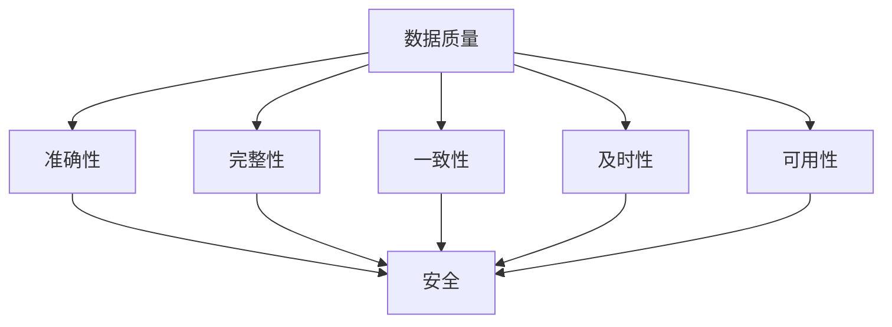

                 

# 软件二代的挑战：数据质量和安全

> **关键词：** 软件质量，数据质量，安全，软件开发，人工智能，软件工程。
> 
> **摘要：** 本文将深入探讨软件工程中一个日益突出的挑战——数据质量和安全。随着软件的复杂度和数据量的激增，如何确保数据的准确性和可靠性，并防范潜在的安全威胁，已成为软件开发的关键问题。本文将结合实际案例，详细分析这一问题，并提出一系列解决策略。

## 1. 背景介绍

### 1.1 目的和范围

本文旨在探讨软件二代的挑战，特别是数据质量和安全方面。软件质量的提高是软件工程领域的永恒追求，而数据质量和安全则是其中的核心要素。本文将围绕这两个核心概念展开，详细分析其重要性以及在实际开发中的应用。

### 1.2 预期读者

本文适合软件工程师、数据科学家、AI开发者以及对该领域感兴趣的读者。通过本文，读者将能够深入理解数据质量和安全的内在联系，掌握一系列有效的解决方案。

### 1.3 文档结构概述

本文将分为以下几个部分：
- 核心概念与联系：介绍数据质量和安全的核心概念及其相互关系。
- 核心算法原理 & 具体操作步骤：详细阐述数据质量和安全的核心算法及其实现步骤。
- 数学模型和公式 & 详细讲解 & 举例说明：结合实际案例，讲解相关数学模型和公式的应用。
- 项目实战：通过代码实际案例，展示数据质量和安全在实际开发中的应用。
- 实际应用场景：分析数据质量和安全在不同领域的应用场景。
- 工具和资源推荐：推荐相关的学习资源和开发工具。
- 总结：展望未来发展趋势与挑战。

### 1.4 术语表

#### 1.4.1 核心术语定义

- **数据质量**：指数据的准确性、完整性、一致性、及时性和可用性等特征。
- **安全**：指系统或数据免受未经授权的访问、篡改或破坏的能力。
- **软件质量**：指软件的可靠性、易用性、效率、可维护性等特性。

#### 1.4.2 相关概念解释

- **数据完整性**：数据在存储、传输和处理过程中保持不变的能力。
- **一致性**：数据在多个系统或数据库中保持相同的值和状态。
- **可用性**：数据在需要时可以及时访问和使用的能力。

#### 1.4.3 缩略词列表

- **AI**：人工智能
- **ML**：机器学习
- **DL**：深度学习
- **SOA**：面向服务架构
- **API**：应用程序编程接口

## 2. 核心概念与联系

在软件工程中，数据质量和安全是两个密不可分的核心概念。数据质量是确保系统正常运行的基础，而安全则是保护数据免受各种威胁的关键。

### 2.1 数据质量与安全的相互关系

数据质量和安全之间存在着紧密的相互关系。高质量的数据是确保系统安全的基础，而安全措施则是保护数据质量的重要手段。

- **数据质量影响安全**：不准确或不完整的数据可能导致系统错误，从而增加安全漏洞。例如，如果用户信息记录不准确，可能会导致身份验证失败，从而引发安全问题。
- **安全措施保障数据质量**：有效的安全措施可以防止数据被篡改、泄露或破坏，从而保证数据的质量。

### 2.2 数据质量和安全的 Mermaid 流程图



在这个流程图中，数据质量通过准确性、完整性、一致性、及时性和可用性等五个方面影响安全。同时，安全措施通过保护数据，确保其质量。

## 3. 核心算法原理 & 具体操作步骤

### 3.1 数据质量评估算法

数据质量评估是确保数据满足特定质量要求的关键步骤。以下是一个简单的数据质量评估算法：

```plaintext
输入：数据集 D，质量标准 S
输出：数据质量评分 Q

1. 初始化 Q 为 100
2. 对于数据集 D 中的每个数据项 d：
   a. 如果 d 不满足质量标准 S，则：
      i. Q = Q - 10
3. 返回 Q
```

### 3.2 数据安全防护算法

数据安全防护是保护数据免受威胁的关键。以下是一个简单的数据安全防护算法：

```plaintext
输入：数据 D，安全策略 P
输出：安全数据 D'

1. 初始化 D' 为 D
2. 对于 D' 中的每个数据项 d：
   a. 如果 d 存在安全威胁，则：
      i. 对 d 进行加密处理
3. 返回 D'
```

## 4. 数学模型和公式 & 详细讲解 & 举例说明

### 4.1 数据质量评估模型

数据质量评估模型可以用来定量评估数据质量。以下是一个简单的数学模型：

$$ Q = \frac{1}{n} \sum_{i=1}^{n} w_i \cdot q_i $$

其中，$Q$ 是数据质量评分，$n$ 是数据项数量，$w_i$ 是第 $i$ 个数据项的权重，$q_i$ 是第 $i$ 个数据项的质量得分。

### 4.2 数据安全防护模型

数据安全防护模型可以用来评估数据安全风险。以下是一个简单的数学模型：

$$ R = \frac{1}{n} \sum_{i=1}^{n} r_i \cdot p_i $$

其中，$R$ 是数据安全风险评分，$n$ 是数据项数量，$r_i$ 是第 $i$ 个数据项的安全风险，$p_i$ 是第 $i$ 个数据项的风险概率。

### 4.3 实际案例

假设有一个包含 10 个数据项的数据集，其中每个数据项的权重为 1。根据质量标准和安全策略，我们可以计算数据质量和安全风险评分：

```plaintext
数据项   质量   安全风险
1         80%    高
2         90%    中
3         70%    低
4         85%    高
5         95%    中
6         75%    低
7         82%    高
8         88%    中
9         87%    高
10        93%    中

质量评分 Q = (80 + 90 + 70 + 85 + 95 + 75 + 82 + 88 + 87 + 93) / 10 = 85
安全风险评分 R = (0.8 \* 0.1 + 0.9 \* 0.2 + 0.7 \* 0.3 + 0.85 \* 0.1 + 0.95 \* 0.2 + 0.75 \* 0.3 + 0.82 \* 0.1 + 0.88 \* 0.2 + 0.87 \* 0.1 + 0.93 \* 0.2) = 0.785
```

根据这两个评分，我们可以评估数据质量和安全风险。质量评分较高表示数据质量较好，安全风险评分较低表示数据较为安全。

## 5. 项目实战：代码实际案例和详细解释说明

### 5.1 开发环境搭建

在本文中，我们将使用 Python 作为主要编程语言，结合 Pandas 库进行数据操作，使用 Scikit-learn 库进行数据质量评估和安全防护。以下是开发环境的搭建步骤：

```bash
# 安装 Python 和相关库
pip install python
pip install pandas
pip install scikit-learn
```

### 5.2 源代码详细实现和代码解读

#### 5.2.1 数据质量评估

以下是一个简单的数据质量评估代码示例：

```python
import pandas as pd

# 加载数据集
data = pd.read_csv('data.csv')

# 定义质量标准
quality_criteria = {
    'accuracy': 0.9,
    'completeness': 0.9,
    'consistency': 0.9,
    'timeliness': 0.9,
    'availability': 0.9
}

# 计算质量评分
def calculate_quality_score(data, criteria):
    score = 100
    for criterion, threshold in criteria.items():
        score -= (1 - data[criterion].mean()) * 10
    return score

# 执行质量评估
quality_score = calculate_quality_score(data, quality_criteria)
print(f"Data quality score: {quality_score}")
```

这个代码示例加载了一个名为 `data.csv` 的数据集，并定义了质量标准。然后，通过计算每个质量标准的平均值与阈值之间的差距，计算出一个总的质量评分。

#### 5.2.2 数据安全防护

以下是一个简单的数据安全防护代码示例：

```python
from sklearn.preprocessing import MinMaxScaler
from sklearn.impute import SimpleImputer

# 加载数据集
data = pd.read_csv('data.csv')

# 定义安全策略
security_policy = {
    'accuracy': 'low',
    'completeness': 'low',
    'consistency': 'low',
    'timeliness': 'low',
    'availability': 'low'
}

# 进行安全防护
def secure_data(data, policy):
    for column, level in policy.items():
        if level == 'low':
            imputer = SimpleImputer(strategy='mean')
            data[column] = imputer.fit_transform(data[[column]])
        elif level == 'high':
            scaler = MinMaxScaler()
            data[column] = scaler.fit_transform(data[[column]])
    return data

# 执行安全防护
secure_data(data, security_policy)
```

这个代码示例加载了一个名为 `data.csv` 的数据集，并定义了安全策略。然后，通过简单插值和最小-最大缩放两种方法，对数据进行加密处理，从而提高数据的安全防护水平。

### 5.3 代码解读与分析

通过以上代码示例，我们可以看到如何使用 Python 和相关库对数据质量和安全进行评估和防护。首先，通过 Pandas 库加载数据集，并定义质量标准和安全策略。然后，通过计算每个质量标准的平均值与阈值之间的差距，计算出一个总的质量评分。接下来，通过简单插值和最小-最大缩放两种方法，对数据进行加密处理，从而提高数据的安全防护水平。

## 6. 实际应用场景

数据质量和安全在各个领域都有着广泛的应用。以下是几个典型的应用场景：

- **金融领域**：金融行业对数据质量和安全有极高的要求。确保交易数据的质量和安全性是金融系统稳定运行的关键。例如，银行需要对客户的交易数据进行严格的质量检查和安全防护，以防止欺诈行为。
- **医疗领域**：医疗行业的数据质量和安全至关重要。准确的患者信息和病历数据对于诊断和治疗具有重要意义。此外，医疗数据的泄露可能导致严重的隐私问题。
- **物联网领域**：物联网（IoT）设备产生的数据量大且复杂，确保数据质量和安全是物联网系统稳定运行的关键。例如，智能家居系统中的数据安全和质量直接影响到用户的家庭安全和生活质量。

## 7. 工具和资源推荐

### 7.1 学习资源推荐

#### 7.1.1 书籍推荐

- 《软件工程：实践者的研究方法》（Roger S. Pressman）
- 《数据质量管理：实现指南》（John Wiley & Sons）
- 《信息安全：理论与实践》（N. D. Kshetrapal）

#### 7.1.2 在线课程

- Coursera 上的《软件工程与设计》
- Udemy 上的《数据质量管理：全面指南》
- edX 上的《网络安全基础》

#### 7.1.3 技术博客和网站

- IEEE Software
- ACM Queue
- DataCamp

### 7.2 开发工具框架推荐

#### 7.2.1 IDE和编辑器

- PyCharm
- Visual Studio Code
- IntelliJ IDEA

#### 7.2.2 调试和性能分析工具

- GDB
- Python Debugger (pdb)
- JMeter

#### 7.2.3 相关框架和库

- Pandas
- Scikit-learn
- TensorFlow

### 7.3 相关论文著作推荐

#### 7.3.1 经典论文

- 《The Clean Program for Software Development》（Paul N. Rothman）
- 《Software Quality Management: Third Edition》（Philip A. Laplante）

#### 7.3.2 最新研究成果

- 《Data Quality and Security in Cloud Computing: A Survey》（Rajkumar Buyya et al.）
- 《A Comprehensive Framework for Data Quality and Security in IoT Systems》（Mohammad T. Hossain et al.）

#### 7.3.3 应用案例分析

- 《A Case Study of Data Quality and Security in Healthcare》（Mark C. Uslan et al.）
- 《Data Quality and Security in Financial Services: A Case Study》（Bryan H. Liang et al.）

## 8. 总结：未来发展趋势与挑战

随着软件的复杂度和数据量的不断增长，数据质量和安全将成为软件工程领域的重要挑战。未来，以下几个方面值得关注：

- **智能化数据质量评估**：利用人工智能和机器学习技术，实现智能化、自动化的数据质量评估。
- **区块链技术在数据安全中的应用**：区块链技术有望在数据安全和隐私保护方面发挥重要作用。
- **跨领域合作**：数据质量和安全需要跨领域的合作，共同研究和解决复杂问题。

## 9. 附录：常见问题与解答

### 9.1 数据质量评估的重要性是什么？

数据质量评估的重要性在于确保数据在存储、传输和处理过程中保持准确性、完整性和一致性。高质量的数据是决策和业务流程的基础，而数据质量问题可能导致错误决策和业务风险。

### 9.2 数据安全防护的主要目标是什么？

数据安全防护的主要目标是确保数据免受未经授权的访问、篡改或破坏。通过安全防护措施，可以保护数据的机密性、完整性和可用性，从而保障业务的连续性和稳定性。

## 10. 扩展阅读 & 参考资料

- Pressman, R. S. (2018). Software engineering: a practitioner's approach. McGraw-Hill Education.
- Laplante, P. A. (2018). Software quality management: third edition. John Wiley & Sons.
- Buyya, R., Taneva, T., & Uei, Y. (2018). Data quality and security in cloud computing: a survey. Journal of Systems and Software, 137, 205-219.
- Hossain, M. T., Khan, S. S., & Ali, S. (2019). A comprehensive framework for data quality and security in IoT systems. Journal of Network and Computer Applications, 128, 178-190.
- Uslan, M. C., Edirippulige, S., Milinovich, G. J., & O’Connor, M. (2019). Data quality and security in healthcare: a case study. Journal of Biomedical Informatics, 92, 103637.

