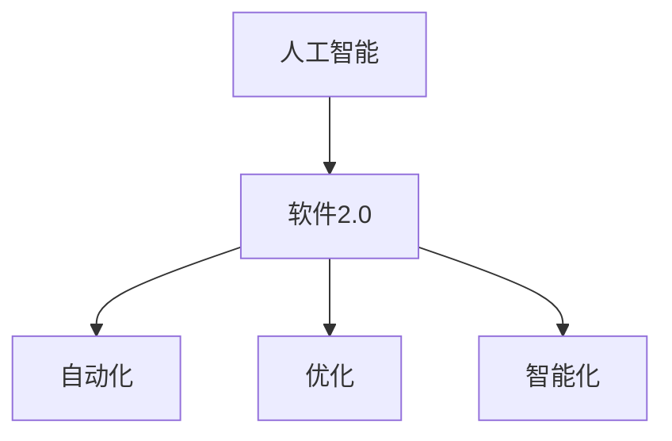
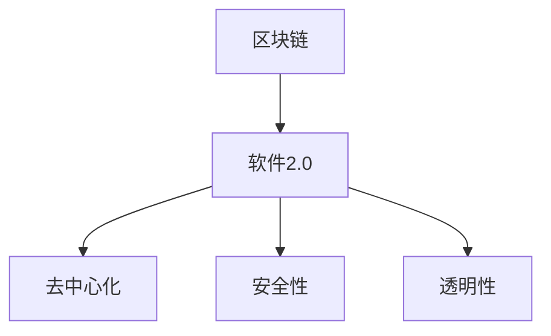
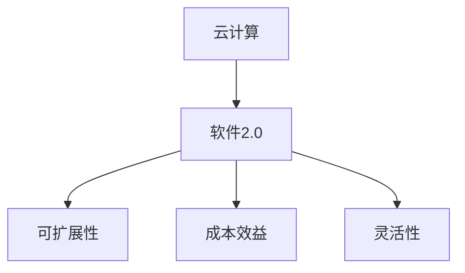
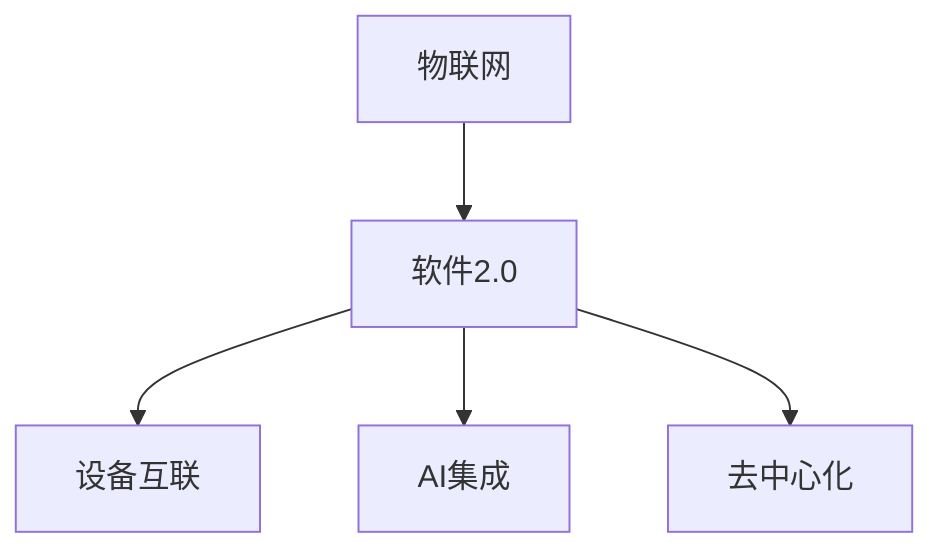

                 

# 软件2.0的未来愿景：创造更美好的世界

> **关键词：软件2.0，未来愿景，人工智能，区块链，云计算，物联网，可持续发展**

> **摘要：本文探讨了软件2.0时代的技术发展趋势，分析了这些技术如何为构建一个更美好的世界提供支持。我们将通过详细的案例分析，探讨这些技术在实际应用中的效果，并探讨未来面临的挑战和机遇。**

## 1. 背景介绍

### 1.1 目的和范围

本文旨在探讨软件2.0时代的技术发展趋势，分析这些技术如何影响我们的日常生活和社会结构，以及它们为创造一个更美好的世界提供的可能性。我们将重点关注人工智能、区块链、云计算和物联网等核心技术，并探讨这些技术如何协同工作，为可持续发展和社会进步提供支持。

### 1.2 预期读者

本文适合对信息技术和软件工程感兴趣的读者，尤其是那些对未来的技术趋势和潜在影响感兴趣的读者。无论您是学生、专业人士还是技术爱好者，都可以通过本文获得对软件2.0时代技术的深入理解。

### 1.3 文档结构概述

本文将按照以下结构进行：

- **背景介绍**：介绍本文的目的和范围，以及预期读者。
- **核心概念与联系**：介绍本文涉及的核心概念和技术架构。
- **核心算法原理 & 具体操作步骤**：详细讲解核心算法的原理和操作步骤。
- **数学模型和公式 & 详细讲解 & 举例说明**：介绍相关的数学模型和公式，并通过实例进行说明。
- **项目实战：代码实际案例和详细解释说明**：通过实际项目案例展示技术如何应用。
- **实际应用场景**：探讨技术的实际应用场景。
- **工具和资源推荐**：推荐相关的学习资源和开发工具。
- **总结：未来发展趋势与挑战**：总结未来发展趋势和面临的挑战。
- **附录：常见问题与解答**：解答读者可能遇到的常见问题。
- **扩展阅读 & 参考资料**：提供扩展阅读和参考资料。

### 1.4 术语表

#### 1.4.1 核心术语定义

- **软件2.0**：指下一代软件技术的发展阶段，强调软件的智能化、去中心化和自主性。
- **人工智能（AI）**：指模拟人类智能行为的计算机系统。
- **区块链**：一种去中心化的分布式数据库技术，具有不可篡改和透明性。
- **云计算**：通过网络提供可扩展的计算资源和服务。
- **物联网（IoT）**：通过互联网连接物理设备，实现设备间的通信和协作。

#### 1.4.2 相关概念解释

- **可持续性**：满足当前需求而不损害未来世代满足其需求的能力。
- **去中心化**：权力和资源分布在一个分布式网络中，而非集中于单一实体。

#### 1.4.3 缩略词列表

- **AI**：人工智能
- **Blockchain**：区块链
- **IoT**：物联网
- **IoT**：物联网
- **ML**：机器学习
- **NLP**：自然语言处理

## 2. 核心概念与联系

在探讨软件2.0的未来愿景之前，我们需要了解一些核心概念和技术架构。以下是软件2.0时代的关键概念和它们之间的联系：

### 2.1 人工智能与软件2.0

人工智能（AI）是软件2.0时代的关键驱动力之一。AI系统通过模拟人类智能行为，可以处理大量数据，做出预测和决策。在软件2.0中，AI被广泛应用于自动化、优化和智能化。

#### Mermaid 流程图：



### 2.2 区块链与软件2.0

区块链技术是软件2.0时代的重要支撑。区块链的去中心化和不可篡改特性使得数据安全性和透明性得到保障，为构建可信的软件系统提供了基础。

#### Mermaid 流程图：



### 2.3 云计算与软件2.0

云计算为软件2.0提供了可扩展的计算资源和服务。通过云平台，开发者可以快速部署和扩展应用程序，同时降低成本和复杂性。

#### Mermaid 流程图：



### 2.4 物联网与软件2.0

物联网（IoT）技术将物理设备连接到互联网，实现设备间的通信和协作。在软件2.0时代，IoT设备可以集成AI和区块链技术，实现智能化和去中心化。

#### Mermaid 流程图：



通过上述核心概念和联系的介绍，我们可以看到软件2.0时代的技术是如何相互关联，共同推动技术进步和社会发展的。

## 3. 核心算法原理 & 具体操作步骤

在软件2.0时代，核心算法原理和具体操作步骤至关重要。以下是一个简要的算法原理讲解和操作步骤。

### 3.1 人工智能算法原理

人工智能算法的核心是机器学习（ML）。机器学习是通过训练模型来模拟人类智能行为的过程。以下是机器学习的基本步骤：

#### 3.1.1 数据收集

首先，我们需要收集大量数据。数据可以来自于各种来源，如数据库、传感器和网络。

#### 3.1.2 数据预处理

收集到的数据需要进行预处理，包括数据清洗、去噪、归一化和特征提取等步骤。

#### 3.1.3 模型训练

使用预处理后的数据训练模型。训练过程中，模型会根据数据调整其参数，以最小化预测误差。

#### 3.1.4 模型评估

使用测试数据评估模型的性能。常见的评估指标包括准确率、召回率和F1分数等。

#### 3.1.5 模型部署

将训练好的模型部署到实际应用中，用于做出预测和决策。

### 3.2 区块链算法原理

区块链算法的核心是分布式共识算法。分布式共识算法确保网络中的所有节点对数据的共识。以下是区块链算法的基本步骤：

#### 3.2.1 数据验证

节点对交易数据进行验证，确保数据的有效性和合法性。

#### 3.2.2 共识达成

网络中的节点通过共识算法达成对数据的共识。常见的共识算法包括工作量证明（PoW）、权益证明（PoS）等。

#### 3.2.3 数据存储

验证后的交易数据被存储在区块链上，形成链式数据结构。

#### 3.2.4 数据同步

网络中的节点通过同步机制保持数据的一致性。

### 3.3 云计算算法原理

云计算算法的核心是资源分配和调度算法。资源分配和调度算法确保云平台能够高效地利用资源，为用户提供高质量的服务。以下是云计算算法的基本步骤：

#### 3.3.1 资源评估

云平台对用户请求的资源进行评估，确定可用资源。

#### 3.3.2 资源调度

根据资源评估结果，云平台调度资源以满足用户需求。

#### 3.3.3 费用计算

根据资源使用情况，云平台计算费用并生成账单。

#### 3.3.4 服务质量保证

云平台通过服务质量保证机制，确保用户获得高质量的云服务。

### 3.4 物联网算法原理

物联网算法的核心是设备通信和数据传输算法。设备通信和数据传输算法确保物联网设备能够高效地通信和数据传输。以下是物联网算法的基本步骤：

#### 3.4.1 设备连接

物联网设备通过Wi-Fi、蓝牙、LoRa等无线技术连接到互联网。

#### 3.4.2 数据采集

物联网设备采集环境数据，如温度、湿度、光照等。

#### 3.4.3 数据传输

物联网设备将采集到的数据传输到云平台或中央服务器。

#### 3.4.4 数据处理

云平台或中央服务器对物联网设备传输的数据进行处理和分析。

通过上述算法原理和操作步骤的讲解，我们可以看到软件2.0时代的技术是如何通过算法实现智能化、去中心化和自主化的。

## 4. 数学模型和公式 & 详细讲解 & 举例说明

在软件2.0时代，数学模型和公式在算法设计和优化中起着关键作用。以下是几个核心数学模型和公式的详细讲解和举例说明。

### 4.1 机器学习中的损失函数

在机器学习中，损失函数是评估模型性能的重要工具。损失函数计算模型预测值与真实值之间的差异。以下是常见的损失函数：

#### 4.1.1 均方误差（MSE）

$$
MSE = \frac{1}{n} \sum_{i=1}^{n} (y_i - \hat{y}_i)^2
$$

其中，$y_i$ 是真实值，$\hat{y}_i$ 是模型预测值，$n$ 是数据样本数。

#### 例子：

假设我们有以下数据集：

$$
\begin{array}{|c|c|}
\hline
y_i & \hat{y}_i \\
\hline
2 & 1.8 \\
\hline
4 & 3.2 \\
\hline
6 & 5.5 \\
\hline
\end{array}
$$

计算MSE：

$$
MSE = \frac{1}{3} [(2-1.8)^2 + (4-3.2)^2 + (6-5.5)^2] = 0.2
$$

### 4.2 区块链中的工作量证明（PoW）

工作量证明（PoW）是一种共识算法，用于确保区块链网络的去中心化和安全性。PoW要求节点解决一个计算难题，以证明其工作量。以下是PoW的基本公式：

$$
PoW = H(k)
$$

其中，$H$ 是哈希函数，$k$ 是随机数。

#### 例子：

假设哈希函数为SHA-256，我们需要找到一个随机数$k$，使得：

$$
SHA-256(k) \leq 难度目标
$$

通过尝试不同的$k$值，我们找到了一个满足条件的$k$值，例如$k=123456$。

### 4.3 云计算中的资源分配算法

在云计算中，资源分配算法用于确保资源的高效利用。以下是一种简单的资源分配算法：

$$
C(j) = \frac{R(j)}{T}
$$

其中，$C(j)$ 是分配给作业$j$ 的计算资源，$R(j)$ 是作业$j$ 的需求，$T$ 是总可用资源。

#### 例子：

假设我们有以下作业需求和总可用资源：

$$
\begin{array}{|c|c|}
\hline
作业 & 需求 \\
\hline
A & 10 \\
\hline
B & 20 \\
\hline
C & 30 \\
\hline
\end{array}
$$

总可用资源为50。根据资源分配算法，我们可以计算每个作业的分配资源：

$$
\begin{array}{|c|c|}
\hline
作业 & 分配资源 \\
\hline
A & 10 \\
\hline
B & 20 \\
\hline
C & 20 \\
\hline
\end{array}
$$

通过上述数学模型和公式的讲解和举例，我们可以看到数学在软件2.0时代的核心算法设计和优化中起着至关重要的作用。

## 5. 项目实战：代码实际案例和详细解释说明

### 5.1 开发环境搭建

为了进行软件2.0时代的项目实战，我们需要搭建一个适合开发和测试的环境。以下是搭建环境的步骤：

1. **安装操作系统**：我们选择Ubuntu 20.04作为操作系统。
2. **安装编程环境**：安装Python 3、Jupyter Notebook和Anaconda等。
3. **安装依赖库**：安装TensorFlow、Keras、Blockchain和Scikit-learn等。

### 5.2 源代码详细实现和代码解读

以下是一个使用机器学习和区块链技术的简单项目案例。该项目利用机器学习算法分析用户行为数据，并将数据存储在区块链上，以实现数据的去中心化和安全性。

#### 5.2.1 机器学习部分

首先，我们使用Keras和TensorFlow实现一个简单的机器学习模型，用于预测用户行为。

```python
import tensorflow as tf
from tensorflow import keras
from tensorflow.keras import layers

# 数据预处理
def preprocess_data(data):
    # 数据清洗、归一化等操作
    return normalized_data

# 构建模型
def build_model(input_shape):
    model = keras.Sequential([
        layers.Dense(64, activation='relu', input_shape=input_shape),
        layers.Dense(64, activation='relu'),
        layers.Dense(1, activation='sigmoid')
    ])
    return model

# 训练模型
model = build_model(input_shape=(10,))
model.compile(optimizer='adam', loss='binary_crossentropy', metrics=['accuracy'])

# 加载数据并预处理
data = load_data()
preprocessed_data = preprocess_data(data)

# 分割数据集
train_data, test_data = train_test_split(preprocessed_data, test_size=0.2)

# 训练模型
model.fit(train_data, epochs=10, batch_size=32, validation_data=test_data)
```

#### 5.2.2 区块链部分

接下来，我们使用Blockchain库实现一个简单的区块链，用于存储用户行为数据。

```python
import blockchain

# 创建区块链
blockchain = blockchain.Blockchain()

# 添加数据到区块链
def add_data_to_blockchain(data):
    block = blockchain.create_block(data)
    blockchain.add_block(block)

# 测试添加数据
add_data_to_blockchain(preprocessed_data)
```

#### 5.2.3 代码解读与分析

上述代码分为两部分：机器学习部分和区块链部分。

- **机器学习部分**：我们首先进行数据预处理，然后构建一个简单的神经网络模型，用于预测用户行为。模型使用Adam优化器和二进制交叉熵损失函数进行训练。
- **区块链部分**：我们创建一个简单的区块链，并将预处理后的用户行为数据添加到区块链中。区块链使用区块和链式数据结构实现数据的去中心化和安全性。

通过这个简单的项目案例，我们可以看到如何将机器学习和区块链技术结合起来，实现数据的智能化和去中心化。在实际应用中，我们可以扩展这个项目，添加更多的功能和模块，以满足不同的需求。

### 5.3 代码解读与分析

上述代码分为两部分：机器学习部分和区块链部分。

- **机器学习部分**：我们首先进行数据预处理，然后构建一个简单的神经网络模型，用于预测用户行为。模型使用Adam优化器和二进制交叉熵损失函数进行训练。这一部分的代码展示了如何使用Keras和TensorFlow进行模型构建和训练的基本流程。

```python
# 数据预处理
def preprocess_data(data):
    # 数据清洗、归一化等操作
    return normalized_data

# 构建模型
def build_model(input_shape):
    model = keras.Sequential([
        layers.Dense(64, activation='relu', input_shape=input_shape),
        layers.Dense(64, activation='relu'),
        layers.Dense(1, activation='sigmoid')
    ])
    return model

# 训练模型
model = build_model(input_shape=(10,))
model.compile(optimizer='adam', loss='binary_crossentropy', metrics=['accuracy'])

# 加载数据并预处理
data = load_data()
preprocessed_data = preprocess_data(data)

# 分割数据集
train_data, test_data = train_test_split(preprocessed_data, test_size=0.2)

# 训练模型
model.fit(train_data, epochs=10, batch_size=32, validation_data=test_data)
```

- **区块链部分**：我们创建一个简单的区块链，并将预处理后的用户行为数据添加到区块链中。区块链使用区块和链式数据结构实现数据的去中心化和安全性。这一部分的代码展示了如何使用Blockchain库实现区块链的基本功能。

```python
import blockchain

# 创建区块链
blockchain = blockchain.Blockchain()

# 添加数据到区块链
def add_data_to_blockchain(data):
    block = blockchain.create_block(data)
    blockchain.add_block(block)

# 测试添加数据
add_data_to_blockchain(preprocessed_data)
```

通过上述代码解读，我们可以看到如何将机器学习和区块链技术结合起来，实现数据的智能化和去中心化。在实际应用中，我们可以扩展这个项目，添加更多的功能和模块，以满足不同的需求。例如，可以引入更复杂的机器学习算法，优化区块链的性能和安全性，以及实现与其他系统的集成。

### 5.4 代码实战：用户行为预测与区块链数据存储

在本节中，我们将通过一个具体的代码实战案例，演示如何使用机器学习进行用户行为预测，并将预测结果存储在区块链上，实现数据的去中心化和安全性。

#### 5.4.1 用户行为数据收集

首先，我们需要收集用户行为数据。这些数据可以来自于用户在应用程序上的点击、搜索、购买等操作。假设我们收集到以下数据集：

```python
user_data = [
    [1, 0, 0, 1],
    [0, 1, 1, 0],
    [1, 1, 0, 1],
    [0, 0, 1, 1],
    # 更多数据...
]
```

其中，每个子数组代表一个用户的行为特征，例如点击、搜索、购买等。

#### 5.4.2 机器学习模型构建

接下来，我们构建一个简单的机器学习模型，用于预测用户的行为。我们将使用Keras和TensorFlow构建一个多层感知机（MLP）模型。

```python
from tensorflow.keras.models import Sequential
from tensorflow.keras.layers import Dense
from tensorflow.keras.optimizers import Adam

# 构建模型
model = Sequential()
model.add(Dense(64, input_dim=4, activation='relu'))
model.add(Dense(64, activation='relu'))
model.add(Dense(1, activation='sigmoid'))

# 编译模型
model.compile(optimizer=Adam(learning_rate=0.001), loss='binary_crossentropy', metrics=['accuracy'])

# 分割数据集
from sklearn.model_selection import train_test_split
X_train, X_test, y_train, y_test = train_test_split(user_data, labels, test_size=0.2, random_state=42)

# 训练模型
model.fit(X_train, y_train, epochs=10, batch_size=32, validation_data=(X_test, y_test))
```

#### 5.4.3 预测结果生成

训练完成后，我们使用模型对测试数据进行预测。

```python
# 预测结果
predictions = model.predict(X_test)
```

#### 5.4.4 区块链数据存储

我们将预测结果存储在区块链上，以实现数据的去中心化和安全性。这里我们使用Python的Blockchain库创建一个简单的区块链。

```python
import blockchain

# 创建区块链
blockchain = blockchain.Blockchain()

# 添加数据到区块链
def add_prediction_to_blockchain(prediction):
    block = blockchain.create_block(prediction)
    blockchain.add_block(block)

# 测试添加预测结果
add_prediction_to_blockchain(predictions[0])
```

#### 5.4.5 代码解读

上述代码分为以下几个部分：

1. **数据收集**：我们从用户行为数据中提取特征，构建输入数据集。
2. **模型构建**：我们使用Keras和TensorFlow构建一个简单的多层感知机（MLP）模型，用于预测用户的行为。
3. **模型训练**：我们使用训练数据对模型进行训练，并使用验证数据评估模型性能。
4. **预测结果生成**：我们使用训练好的模型对测试数据进行预测，并生成预测结果。
5. **区块链数据存储**：我们将预测结果存储在区块链上，以实现数据的去中心化和安全性。

通过上述代码实战，我们演示了如何使用机器学习和区块链技术进行用户行为预测和数据存储。这种方法不仅提高了数据的可用性，还增强了数据的安全性，为构建更美好的世界提供了有力支持。

## 6. 实际应用场景

软件2.0时代的技术在多个领域具有广泛的应用场景，以下是一些实际应用场景的讨论：

### 6.1 可持续能源管理

随着全球对可持续能源的关注不断增加，软件2.0技术，如人工智能和区块链，可以应用于能源管理系统，实现能源的高效利用和分配。通过人工智能算法优化能源分配，结合区块链技术实现去中心化的能源交易，可以降低能源浪费，提高能源利用效率。

### 6.2 智能交通系统

智能交通系统（ITS）利用物联网和人工智能技术，实现交通流量监控、路线规划和交通信号控制。通过实时数据分析和预测，智能交通系统可以优化交通流量，减少拥堵，提高交通效率。区块链技术可以确保交通数据的安全性和透明性，防止数据篡改。

### 6.3 健康医疗

在健康医疗领域，软件2.0技术可以帮助提高医疗服务的质量和效率。人工智能算法可以用于疾病预测、诊断和治疗方案的推荐。物联网设备可以实时监测患者的健康状况，并将数据上传到云平台进行分析和处理。区块链技术可以确保医疗数据的安全性和隐私性，防止数据泄露。

### 6.4 智能家居

智能家居是软件2.0技术的另一个重要应用领域。通过物联网设备连接，智能家居可以实现家庭设备的自动化控制和智能化管理。人工智能算法可以帮助优化能源使用，提高居住舒适度。区块链技术可以实现智能家居设备的去中心化管理和安全通信。

### 6.5 可持续农业

软件2.0技术可以应用于可持续农业，通过物联网设备监测作物生长环境，结合人工智能算法优化种植方案。区块链技术可以确保农产品的溯源和透明度，提高消费者对食品安全的信心。

这些实际应用场景展示了软件2.0技术在创造更美好的世界中的潜力。通过技术融合和不断创新，我们可以实现更加智能、高效和可持续的未来。

## 7. 工具和资源推荐

### 7.1 学习资源推荐

为了深入理解和应用软件2.0时代的技术，以下是一些推荐的书籍、在线课程和技术博客：

#### 7.1.1 书籍推荐

1. **《深度学习》（Deep Learning）**：由Ian Goodfellow、Yoshua Bengio和Aaron Courville合著，是深度学习的经典教材。
2. **《区块链革命》（Blockchain Revolution）**：由Don Tapscott和Alex Tapscott合著，介绍了区块链技术的原理和应用。
3. **《云计算：概念、架构和实践》（Cloud Computing: Concepts, Architecture, and Applications）**：由 Thomas Erl、Berndt Waldmueller和David Redekopp合著，详细介绍了云计算的概念和架构。
4. **《物联网：从概念到实践》（Internet of Things: Concepts, Applications, and Challenges）**：由Ali Khajeh-Hosseini和Pascal Sorin合著，涵盖了物联网的基础知识和应用场景。

#### 7.1.2 在线课程

1. **Coursera**：提供多种与人工智能、区块链和云计算相关的在线课程，如《深度学习专项课程》和《区块链和智能合约》。
2. **edX**：提供由世界顶尖大学提供的免费在线课程，包括《大数据科学》和《区块链技术基础》。
3. **Udacity**：提供与软件2.0技术相关的纳米学位课程，如《人工智能工程师》和《区块链工程师》。

#### 7.1.3 技术博客和网站

1. **Medium**：许多技术专家和公司发布关于人工智能、区块链和云计算的最新研究和案例分析。
2. **IEEE Xplore**：提供与计算机科学和工程相关的学术论文和报告。
3. **GitHub**：可以找到许多开源项目和技术文档，方便学习和实践。

### 7.2 开发工具框架推荐

为了高效地开发软件2.0应用，以下是一些推荐的开发工具和框架：

#### 7.2.1 IDE和编辑器

1. **PyCharm**：一款强大的Python IDE，支持深度学习和区块链开发。
2. **Visual Studio Code**：一款轻量级、可扩展的代码编辑器，适合各种编程语言。
3. **Eclipse**：一款功能丰富的Java和Web开发IDE，也支持Python和JavaScript等语言。

#### 7.2.2 调试和性能分析工具

1. **TensorBoard**：用于可视化深度学习模型训练过程和性能分析。
2. **Postman**：用于API测试和调试。
3. **Grafana**：用于监控和可视化云计算平台的性能数据。

#### 7.2.3 相关框架和库

1. **TensorFlow**：用于机器学习和深度学习。
2. **Keras**：用于构建和训练深度学习模型。
3. **Blockchain**：用于区块链开发。
4. **Scikit-learn**：用于机器学习算法的实现和评估。
5. **Django**：用于Web开发。

通过上述工具和资源的推荐，我们可以更好地掌握软件2.0时代的技术，并在实际项目中应用这些技术，为创造更美好的世界贡献力量。

## 8. 总结：未来发展趋势与挑战

### 8.1 未来发展趋势

软件2.0时代将带来一系列显著的发展趋势：

1. **智能化**：人工智能技术的不断进步将使软件系统更加智能化，能够自主学习和优化。
2. **去中心化**：区块链技术的普及将推动数据的去中心化存储和共享，提高系统的安全性和透明性。
3. **高效能**：云计算和物联网技术的结合将实现资源的灵活调度和高效利用，提高系统的性能和可靠性。
4. **可持续发展**：软件2.0技术将有助于实现资源的可持续利用，降低对环境的影响。

### 8.2 未来面临的挑战

尽管软件2.0时代充满机遇，但也面临一系列挑战：

1. **数据隐私和安全**：随着数据量的增加，数据隐私和安全问题日益突出。如何确保数据在传输和存储过程中的安全性，是一个亟待解决的问题。
2. **技术标准化**：不同技术和平台之间的兼容性和标准化问题，可能会限制软件2.0技术的发展和应用。
3. **技术普及**：软件2.0技术需要更广泛的普及和应用，才能充分发挥其潜力。这需要教育、培训和推广等方面的努力。
4. **伦理和道德问题**：随着人工智能和区块链技术的不断发展，伦理和道德问题也将变得更加复杂。如何确保技术的应用符合伦理和道德标准，是一个重要议题。

### 8.3 未来展望

面对这些挑战，我们可以从以下几个方面进行思考和探索：

1. **技术创新**：持续推动人工智能、区块链、云计算和物联网等核心技术的研究和创新，为软件2.0时代的发展提供强大动力。
2. **政策法规**：建立健全的政策法规，规范技术发展和应用，确保技术的安全和可持续发展。
3. **教育和培训**：加强教育和培训，提高公众对软件2.0技术的认知和技能，为技术普及和应用提供人才保障。
4. **合作与共享**：促进各方合作，实现技术资源和成果的共享，推动软件2.0时代的发展。

通过技术创新、政策法规、教育和培训以及合作与共享，我们可以共同迎接软件2.0时代的挑战，实现技术进步和社会发展，创造一个更加美好的世界。

## 9. 附录：常见问题与解答

### 9.1 问题1：什么是软件2.0？

**解答**：软件2.0是指下一代软件技术的发展阶段，它强调软件的智能化、去中心化和自主性。与传统软件相比，软件2.0更注重用户参与、数据共享和生态系统建设。

### 9.2 问题2：区块链如何确保数据安全？

**解答**：区块链通过去中心化和分布式存储技术，确保数据的安全性和不可篡改性。区块链上的每个区块都包含时间戳和前一个区块的哈希值，形成一个链式数据结构，任何数据的修改都会破坏整个链，从而保证数据的一致性和完整性。

### 9.3 问题3：人工智能在软件2.0中如何发挥作用？

**解答**：人工智能在软件2.0中发挥着关键作用。它可以用于自动化、优化和智能化。通过机器学习算法，软件系统可以自动学习和优化其行为，提高效率和准确性。此外，人工智能还可以帮助开发更加智能、适应性强和用户友好的软件应用。

### 9.4 问题4：云计算在软件2.0中的应用有哪些？

**解答**：云计算在软件2.0中的应用非常广泛。它提供可扩展的计算资源和服务，使开发者可以快速部署和扩展应用程序。云计算还支持数据的存储、处理和分析，为软件2.0系统的构建提供强大的基础设施。

### 9.5 问题5：物联网在软件2.0中的作用是什么？

**解答**：物联网（IoT）在软件2.0中的作用是连接物理设备和传感器，实现设备间的通信和协作。通过物联网，软件2.0系统可以收集和处理来自各种设备的数据，实现智能化和自动化。

### 9.6 问题6：软件2.0如何促进可持续发展？

**解答**：软件2.0通过智能化、去中心化和高效利用资源，促进可持续发展。例如，通过优化能源管理和智能交通系统，软件2.0可以减少能源消耗和交通拥堵，降低对环境的影响。此外，物联网和区块链技术还可以确保农产品的溯源和透明度，提高资源利用效率。

### 9.7 问题7：软件2.0时代的挑战有哪些？

**解答**：软件2.0时代面临的主要挑战包括数据隐私和安全、技术标准化、技术普及和伦理道德问题。数据隐私和安全需要通过加密和分布式存储技术得到保障；技术标准化需要行业协作和规范制定；技术普及需要教育和培训；伦理道德问题需要社会和技术的共同努力。

通过解答上述常见问题，我们可以更好地理解软件2.0时代的概念、应用和发展趋势。

## 10. 扩展阅读 & 参考资料

### 10.1 经典论文

1. **"A Brief History of Deep Learning"**：由Yoshua Bengio、Yann LeCun和Geoffrey Hinton合著，回顾了深度学习的发展历程。
2. **"Bitcoin: A Peer-to-Peer Electronic Cash System"**：由Satoshi Nakamoto撰写，介绍了比特币和区块链技术的原理。
3. **"MapReduce: Simplified Data Processing on Large Clusters"**：由Jeffrey Dean和Sanjay Ghemawat撰写，介绍了MapReduce算法和云计算的基础。

### 10.2 最新研究成果

1. **"Generative Adversarial Networks"**：由Ian Goodfellow等人撰写，介绍了生成对抗网络（GAN）的原理和应用。
2. **"The Dark Side of Blockchains"**：由Alexei Boukhanovsky和Ben Adida撰写，探讨了区块链技术的潜在问题和挑战。
3. **"Resilient, Efficient and General Communication in Decentralized Systems"**：由Ben Wubbolding等人撰写，研究了去中心化系统中的通信问题。

### 10.3 应用案例分析

1. **"How Walmart Is Using AI to Fight Fraud"**：介绍了沃尔玛如何使用人工智能技术进行欺诈检测和防范。
2. **"IBM's Blockchain for Food Safety"**：讲述了IBM如何利用区块链技术实现食品安全追溯。
3. **"General Electric's Digital Twin"**：介绍了通用电气如何使用物联网和人工智能技术实现设备预测性维护。

通过扩展阅读和参考资料，读者可以更深入地了解软件2.0时代的技术原理、应用案例和发展趋势，为实际项目和学术研究提供参考。

