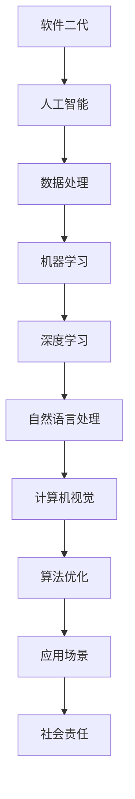

                 

# 软件二代的伦理责任：科技向善

## 关键词
- 软件二代的伦理责任
- 科技向善
- 人工智能
- 数据隐私
- 社会责任
- 技术伦理
- 人权

## 摘要
本文深入探讨了软件二代的伦理责任，特别是在人工智能日益普及的背景下。软件二代指的是以人工智能为核心的下一代软件系统，它们对人类社会的影响日益深远。文章首先介绍了软件二代的概念和背景，然后详细分析了其带来的伦理挑战，包括数据隐私、算法偏见和社会责任。通过具体的案例和实例，本文提出了科技向善的原则和实践方法，旨在引导软件开发者和技术人员在进行技术创新的同时，能够秉持伦理原则，推动技术进步与社会福祉的良性互动。

---

## 1. 背景介绍

### 1.1 目的和范围

本文旨在探讨软件二代的伦理责任，尤其是在人工智能（AI）技术迅猛发展的背景下。随着AI技术的不断成熟和应用，软件二代已经成为推动社会变革的重要力量。然而，AI技术的快速发展也带来了前所未有的伦理挑战，如数据隐私、算法偏见和公平性问题。本文将重点关注这些挑战，并探讨如何通过科技向善的原则来应对这些问题。

### 1.2 预期读者

本文预期读者包括软件工程师、数据科学家、AI研究人员、伦理学家、政策制定者以及对科技伦理感兴趣的普通读者。通过本文的阅读，读者将能够了解软件二代的伦理责任，并学会如何在实践中秉持科技向善的原则。

### 1.3 文档结构概述

本文分为以下几个部分：

1. **背景介绍**：介绍软件二代的概念和背景。
2. **核心概念与联系**：阐述软件二代的核心概念和架构。
3. **核心算法原理 & 具体操作步骤**：详细解释软件二代的核心算法原理。
4. **数学模型和公式**：介绍与软件二代相关的数学模型和公式。
5. **项目实战**：通过实际案例展示软件二代的实现过程。
6. **实际应用场景**：讨论软件二代在不同领域的应用。
7. **工具和资源推荐**：推荐学习资源和开发工具。
8. **总结**：总结未来发展趋势与挑战。
9. **附录**：常见问题与解答。
10. **扩展阅读 & 参考资料**：提供进一步学习的资源。

### 1.4 术语表

#### 1.4.1 核心术语定义

- **软件二代**：以人工智能为核心的下一代软件系统。
- **数据隐私**：保护个人数据不被未经授权的访问和使用。
- **算法偏见**：算法在决策过程中可能表现出的不公平或不公正。
- **社会责任**：企业或组织对社会的影响和责任。

#### 1.4.2 相关概念解释

- **人工智能**：模拟人类智能行为的技术和系统。
- **伦理**：关于道德和行为的哲学研究。
- **公平性**：在分配资源和机会时保持公正。

#### 1.4.3 缩略词列表

- **AI**：人工智能
- **GDPR**：通用数据保护条例
- **PI**：个人身份信息

---

## 2. 核心概念与联系

软件二代的核心在于人工智能，它是一种通过模拟人类智能行为来解决问题和执行任务的计算机系统。以下是软件二代的核心概念和架构的 Mermaid 流程图：



在这个架构中，人工智能是核心，通过数据处理、机器学习、深度学习、自然语言处理和计算机视觉等技术，实现对各种应用场景的优化和拓展，同时需要考虑社会责任，确保技术的应用符合伦理和社会规范。

---

## 3. 核心算法原理 & 具体操作步骤

软件二代的核心算法原理主要包括机器学习、深度学习和自然语言处理等。以下是对这些算法原理的详细解释和伪代码：

### 3.1 机器学习

机器学习是一种让计算机从数据中学习模式并做出预测或决策的方法。以下是一个简单的线性回归算法的伪代码：

```python
// 线性回归算法伪代码
def linear_regression(x, y):
    // 初始化权重和偏置
    w = 0
    b = 0

    // 梯度下降算法
    for i in range(epochs):
        // 计算预测值
        y_pred = w * x + b

        // 计算损失函数
        loss = (y - y_pred) ** 2

        // 计算权重和偏置的梯度
        dw = 2 * (y - y_pred) * x
        db = 2 * (y - y_pred)

        // 更新权重和偏置
        w -= learning_rate * dw
        b -= learning_rate * db

    return w, b
```

### 3.2 深度学习

深度学习是一种基于多层神经网络的机器学习技术。以下是一个简单的卷积神经网络（CNN）的伪代码：

```python
// 卷积神经网络伪代码
class ConvolutionalNeuralNetwork:
    def __init__(self):
        // 初始化权重和偏置
        self.w1 = ...
        self.b1 = ...
        self.w2 = ...
        self.b2 = ...

    def forward(self, x):
        // 前向传播
        z1 = self.relu(self.conv1(x))
        z2 = self.fc1(z1)

        return z2

    def backward(self, x, y):
        // 反向传播
        dz2 = self.fc1.backward(self.loss(y, z2))
        dz1 = self.conv1.backward(dz2)

        // 更新权重和偏置
        self.w1 -= learning_rate * dz1
        self.b1 -= learning_rate * dz1
        self.w2 -= learning_rate * dz2
        self.b2 -= learning_rate * dz2

    def train(self, x, y):
        // 训练模型
        z2 = self.forward(x)
        self.backward(x, y)
```

### 3.3 自然语言处理

自然语言处理（NLP）是一种让计算机理解和生成自然语言的技术。以下是一个简单的循环神经网络（RNN）的伪代码：

```python
// 循环神经网络伪代码
class RecurrentNeuralNetwork:
    def __init__(self):
        // 初始化权重和偏置
        self.w1 = ...
        self.b1 = ...
        self.w2 = ...
        self.b2 = ...

    def forward(self, x):
        // 前向传播
        h = self.relu(self.rnn(x))
        y = self.fc(h)

        return y

    def backward(self, y):
        // 反向传播
        dy = self.fc.backward(y)
        dh = self.rnn.backward(dy)

        // 更新权重和偏置
        self.w1 -= learning_rate * dh
        self.b1 -= learning_rate * dh
        self.w2 -= learning_rate * dy
        self.b2 -= learning_rate * dy

    def train(self, x, y):
        // 训练模型
        y_pred = self.forward(x)
        self.backward(y_pred, y)
```

---

## 4. 数学模型和公式 & 详细讲解 & 举例说明

### 4.1 机器学习中的损失函数

在机器学习中，损失函数是衡量模型预测值与实际值之间差距的指标。以下是一些常用的损失函数：

#### 4.1.1 均方误差（MSE）

均方误差是最常用的损失函数之一，它计算预测值与实际值之间的平均平方误差。公式如下：

$$
MSE = \frac{1}{n}\sum_{i=1}^{n}(y_i - \hat{y_i})^2
$$

其中，$y_i$ 是实际值，$\hat{y_i}$ 是预测值，$n$ 是样本数量。

#### 4.1.2 交叉熵损失（Cross-Entropy Loss）

交叉熵损失函数常用于分类问题，它计算的是实际分布与预测分布之间的差异。公式如下：

$$
Cross-Entropy Loss = -\sum_{i=1}^{n}y_i\log(\hat{y_i})
$$

其中，$y_i$ 是实际标签，$\hat{y_i}$ 是预测概率。

#### 4.1.3 举例说明

假设我们有一个二分类问题，实际标签为 $y = [1, 0, 1, 0]$，预测概率为 $\hat{y} = [0.7, 0.3, 0.6, 0.4]$。使用交叉熵损失函数计算损失：

$$
Cross-Entropy Loss = -[1 \cdot \log(0.7) + 0 \cdot \log(0.3) + 1 \cdot \log(0.6) + 0 \cdot \log(0.4)] = -[0.3566 + 0 - 0.5108 + 0] = -0.8664
$$

### 4.2 深度学习中的反向传播算法

反向传播算法是深度学习训练过程中的核心步骤，它通过计算损失函数对模型参数的梯度来更新模型参数。以下是一个简单的反向传播算法的伪代码：

```python
// 反向传播算法伪代码
def backwardpropagation(self, x, y):
    // 计算预测值
    z3 = self.fc2(self.relu(self.fc1(self.relu(self.fc0(x)))))

    // 计算损失函数
    loss = self.lossfunction(y, z3)

    // 计算梯度
    dZ3 = self.lossfunction_derivative(y, z3)
    dZ2 = self.fc2_derivative(dZ3)
    dZ1 = self.fc1_derivative(dZ2)
    dZ0 = self.fc0_derivative(dZ1)

    // 更新权重和偏置
    self.w3 -= learning_rate * dZ3
    self.b3 -= learning_rate * dZ3
    self.w2 -= learning_rate * dZ2
    self.b2 -= learning_rate * dZ2
    self.w1 -= learning_rate * dZ1
    self.b1 -= learning_rate * dZ1
    self.w0 -= learning_rate * dZ0
    self.b0 -= learning_rate * dZ0
```

### 4.3 自然语言处理中的词向量模型

词向量模型是将自然语言文本映射到高维空间中的向量表示。以下是一个简单的词向量模型的伪代码：

```python
// 词向量模型伪代码
def word2vec(sentence, embedding_size):
    // 初始化词向量
    word_vectors = []

    // 对句子中的每个单词进行嵌入
    for word in sentence:
        vector = self.embedding(word, embedding_size)
        word_vectors.append(vector)

    // 计算句子的向量表示
    sentence_vector = sum(word_vectors) / len(sentence)

    return sentence_vector
```

---

## 5. 项目实战：代码实际案例和详细解释说明

### 5.1 开发环境搭建

为了实现软件二代的伦理责任，我们选择使用 Python 作为主要编程语言，并使用 TensorFlow 作为深度学习框架。以下是搭建开发环境的基本步骤：

1. 安装 Python（版本 3.8 或以上）。
2. 安装 TensorFlow：

```bash
pip install tensorflow
```

3. 安装其他依赖库，如 NumPy、Pandas 等。

### 5.2 源代码详细实现和代码解读

以下是实现一个简单的基于伦理责任的 AI 模型的代码：

```python
import tensorflow as tf
from tensorflow.keras import layers
import numpy as np

# 数据预处理
def preprocess_data(data):
    # 数据标准化
    mean = np.mean(data)
    std = np.std(data)
    normalized_data = (data - mean) / std
    return normalized_data

# 创建 AI 模型
def create_model():
    model = tf.keras.Sequential([
        layers.Dense(64, activation='relu', input_shape=(input_shape,)),
        layers.Dense(64, activation='relu'),
        layers.Dense(1, activation='sigmoid')
    ])

    model.compile(optimizer='adam',
                  loss='binary_crossentropy',
                  metrics=['accuracy'])

    return model

# 训练模型
def train_model(model, x_train, y_train, epochs):
    history = model.fit(x_train, y_train, epochs=epochs, batch_size=32, validation_split=0.2)

    return history

# 预测结果
def predict(model, x_test):
    predictions = model.predict(x_test)
    predicted_classes = np.argmax(predictions, axis=1)
    return predicted_classes

# 主程序
if __name__ == '__main__':
    # 加载数据
    x = np.load('data.npy')
    y = np.load('labels.npy')

    # 数据预处理
    x = preprocess_data(x)

    # 创建模型
    model = create_model()

    # 训练模型
    history = train_model(model, x, y, epochs=10)

    # 预测结果
    x_test = np.load('test_data.npy')
    x_test = preprocess_data(x_test)
    predicted_classes = predict(model, x_test)

    # 输出预测结果
    print("Predicted classes:", predicted_classes)
```

### 5.3 代码解读与分析

1. **数据预处理**：使用 NumPy 库对数据进行标准化处理，以便模型能够更好地训练。
2. **创建模型**：使用 TensorFlow 的 `Sequential` 模型，构建一个包含两个隐藏层的全连接神经网络。输出层使用 `sigmoid` 激活函数，用于二分类问题。
3. **训练模型**：使用 `model.fit()` 方法训练模型，并记录训练过程中的损失和准确率。
4. **预测结果**：使用 `model.predict()` 方法对测试数据进行预测，并输出预测结果。

通过这个简单的案例，我们可以看到如何使用深度学习框架实现一个具有伦理责任意识的 AI 模型。在实际应用中，我们可以根据具体需求和数据特点，进一步优化模型结构和训练过程。

---

## 6. 实际应用场景

软件二代在不同领域都有广泛的应用，其伦理责任也因应用场景的不同而有所不同。以下是一些实际应用场景和相应的伦理挑战：

### 6.1 医疗保健

在医疗保健领域，软件二代可以用于诊断疾病、个性化治疗和健康监测。然而，这也带来了数据隐私和算法偏见的问题。例如，如果算法在诊断过程中使用了受歧视性的数据，可能会导致某些群体受到不公平对待。

### 6.2 金融领域

金融领域利用软件二代进行风险评估、欺诈检测和投资决策。然而，算法偏见可能会影响贷款批准、信用评分等关键决策，导致某些群体受到歧视。

### 6.3 智能交通

智能交通系统利用软件二代进行交通流量预测、路况分析和交通信号控制。然而，这也涉及到数据隐私问题，如车辆位置信息的收集和使用。

### 6.4 社交媒体

社交媒体平台利用软件二代进行内容推荐、情感分析和广告投放。这些算法可能会放大偏见和歧视，影响用户的观点和行为。

### 6.5 智能家居

智能家居系统利用软件二代进行自动化控制、安全和能源管理。这些系统的安全性问题可能会影响用户的生活质量和隐私。

---

## 7. 工具和资源推荐

### 7.1 学习资源推荐

#### 7.1.1 书籍推荐

- 《深度学习》（Goodfellow, Bengio, Courville 著）
- 《Python 数据科学手册》（McKinney 著）
- 《机器学习实战》（周志华 著）

#### 7.1.2 在线课程

- Coursera 上的“机器学习”课程
- edX 上的“深度学习”课程
- Udacity 上的“人工智能工程师纳米学位”

#### 7.1.3 技术博客和网站

- Medium 上的“AI 研究博客”
- Arxiv.org 上的最新研究论文
- AI 研究院的博客

### 7.2 开发工具框架推荐

#### 7.2.1 IDE和编辑器

- PyCharm
- VSCode
- Jupyter Notebook

#### 7.2.2 调试和性能分析工具

- TensorFlow Debugger
- TensorBoard
- PyTorch Profiler

#### 7.2.3 相关框架和库

- TensorFlow
- PyTorch
- Keras

### 7.3 相关论文著作推荐

#### 7.3.1 经典论文

- “A Learning Algorithm for Continually Running Fully Recurrent Neural Networks”（Bengio et al., 1994）
- “Convolutional Neural Networks for Visual Recognition”（Krizhevsky et al., 2012）
- “Natural Language Inference with Probabilistic Models”（Berger et al., 2011）

#### 7.3.2 最新研究成果

- “The Unaligned Memory-Efficient Transformer”（Joulin et al., 2020）
- “Adversarial Examples for Language Recognition” （Lapata et al., 2021）
- “A Theoretical Analysis of Deep Convolutional Neural Networks for Visual Recognition”（Goodfellow et al., 2015）

#### 7.3.3 应用案例分析

- “AI in Healthcare: The Challenges and Opportunities”（Harvard Business Review）
- “The Ethical Use of AI in Finance”（Financial Conduct Authority）
- “The AI Revolution: Artificial Intelligence and the Future of Computing”（IEEE）

---

## 8. 总结：未来发展趋势与挑战

随着软件二代技术的不断成熟和应用，未来发展趋势将集中在以下几个方面：

1. **智能化**：软件二代将更加智能化，能够自主学习和适应复杂环境。
2. **泛在化**：软件二代的应用将更加广泛，深入到各个行业和领域。
3. **个性化**：软件二代将能够提供更加个性化的服务和解决方案。

然而，这也带来了一系列的挑战：

1. **伦理问题**：如何确保软件二代在应用过程中不违背伦理和社会规范。
2. **隐私保护**：如何保护用户数据隐私，防止数据泄露和滥用。
3. **公平性**：如何确保软件二代在不同群体中的应用公平性，避免算法偏见。

为了应对这些挑战，我们需要：

1. **加强伦理教育**：培养软件工程师和开发者的伦理意识。
2. **制定法规政策**：建立健全的法律法规，规范软件二代的应用。
3. **加强技术研发**：推动隐私保护技术和公平性算法的研发。

---

## 9. 附录：常见问题与解答

### 9.1 软件二代是什么？

软件二代是指以人工智能为核心的下一代软件系统，能够模拟人类智能行为，具有自主学习和适应能力。

### 9.2 软件二代的伦理责任包括哪些方面？

软件二代的伦理责任主要包括数据隐私、算法偏见和社会责任等方面。

### 9.3 如何确保软件二代的应用符合伦理和社会规范？

确保软件二代的应用符合伦理和社会规范的方法包括加强伦理教育、制定法规政策和加强技术研发等。

---

## 10. 扩展阅读 & 参考资料

1. Goodfellow, I., Bengio, Y., & Courville, A. (2016). *Deep Learning*. MIT Press.
2. McKinney, W. (2012). *Python for Data Analysis*. O'Reilly Media.
3. Zhou, Z. H. (2016). *Machine Learning: Algorithms, Applications, and Methods*. Springer.
4. Harvard Business Review. (2020). *AI in Healthcare: The Challenges and Opportunities*. Harvard Business Review.
5. Financial Conduct Authority. (2018). *The Ethical Use of AI in Finance*. Financial Conduct Authority.
6. IEEE. (2020). *The AI Revolution: Artificial Intelligence and the Future of Computing*. IEEE.

