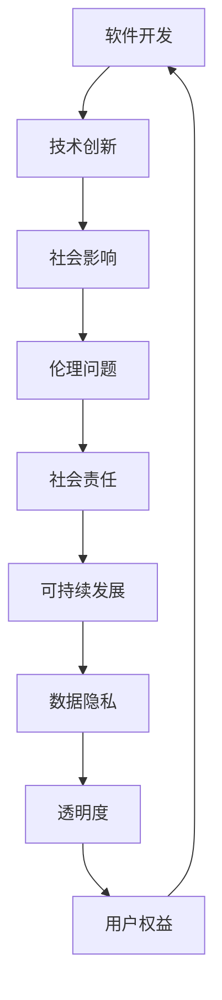

                 

# 软件二阶的社会责任：科技向善

## 关键词
软件开发、社会责任、科技向善、可持续发展、伦理准则、透明度与隐私保护

## 摘要
随着软件技术的迅猛发展，软件2.0时代已经来临。在这个时代，软件不再仅仅是冰冷的代码和逻辑，而是深刻影响人类生活和社会运行的“软实力”。本文旨在探讨软件2.0时代下的社会责任，重点讨论科技向善的理念与实践。通过分析软件开发过程中的核心概念、算法原理、数学模型以及实际应用案例，本文揭示了软件开发者在追求技术创新的同时，应如何承担起推动社会进步和人类福祉的责任。我们期待通过本文的探讨，激发行业内外对软件技术伦理和社会影响的深入思考。

---

## 1. 背景介绍

### 1.1 目的和范围

本文的主要目的是探讨软件2.0时代的社会责任，特别是在科技向善方面的责任。我们将分析软件开发中的核心概念、算法原理、数学模型和实际应用案例，以展示如何通过软件技术推动社会进步和人类福祉。本文的讨论范围包括但不限于以下几个方面：

1. 软件开发中的伦理问题。
2. 科技向善的理念和实践。
3. 软件技术在可持续发展和环境保护中的应用。
4. 数据隐私保护和透明度的重要性。
5. 开发者如何通过技术创新实现社会价值。

### 1.2 预期读者

本文主要面向软件开发者、技术爱好者、企业CTO和技术决策者。同时，对于对软件技术和社会责任感兴趣的普通读者，本文也提供了深入浅出的分析和见解。

### 1.3 文档结构概述

本文结构如下：

1. 背景介绍：介绍本文的目的和范围，预期读者，以及文档结构。
2. 核心概念与联系：分析软件开发中的核心概念和联系。
3. 核心算法原理 & 具体操作步骤：探讨软件开发中的核心算法原理和具体操作步骤。
4. 数学模型和公式 & 详细讲解 & 举例说明：详细讲解数学模型和公式，并通过实例说明。
5. 项目实战：提供实际代码案例和详细解释。
6. 实际应用场景：分析软件技术的实际应用场景。
7. 工具和资源推荐：推荐学习资源和开发工具。
8. 总结：对未来发展趋势和挑战进行总结。
9. 附录：常见问题与解答。
10. 扩展阅读 & 参考资料：提供进一步阅读的资源。

### 1.4 术语表

#### 1.4.1 核心术语定义

- **软件2.0**：指新一代软件，强调软件不仅仅是工具，更是影响社会运行的关键力量。
- **科技向善**：指在软件开发和应用过程中，以促进社会进步和人类福祉为目标。
- **社会责任**：指企业在开发和应用软件时，应承担的对社会和环境的责任。

#### 1.4.2 相关概念解释

- **可持续性**：指满足当前需求而不损害后代满足其需求的能力。
- **数据隐私**：指保护个人数据不被未经授权的第三方访问。

#### 1.4.3 缩略词列表

- **AI**：人工智能
- **ML**：机器学习
- **DL**：深度学习

---

在接下来的一节中，我们将深入探讨软件开发中的核心概念和联系，使用Mermaid流程图来展示核心概念之间的相互作用。然后，我们将逐步分析核心算法原理和具体操作步骤，以帮助读者更好地理解软件开发的核心技术。

## 2. 核心概念与联系

在软件2.0时代，软件开发不仅需要关注技术的先进性和功能的丰富性，更应注重其对社会和环境的深远影响。以下我们将通过Mermaid流程图来展示软件开发中的核心概念和它们之间的联系。

### 2.1 Mermaid流程图



### 2.2 核心概念解释

- **技术创新**：软件开发的核心动力，推动软件功能和性能的提升。
- **社会影响**：软件技术在改变人们生活方式和商业运营模式的同时，对社会产生的深远影响。
- **伦理问题**：软件开发过程中需要面对的道德和伦理挑战，如隐私保护、公平性等。
- **社会责任**：软件开发者应承担的对社会和环境的责任，确保技术的积极影响。
- **可持续发展**：软件开发应追求的技术方案和商业模式的可持续性，减少对环境的负面影响。
- **数据隐私**：在数据收集、处理和存储过程中，保护个人隐私不被侵犯。
- **透明度**：软件技术和数据处理过程的透明性，增强用户对技术的信任。
- **用户权益**：在软件开发和应用过程中，保障用户的合法权益。

### 2.3 联系分析

上述核心概念之间存在着紧密的联系和相互作用。技术创新是社会影响的基础，而社会影响又引发了一系列伦理问题和责任问题。社会责任要求开发者不仅在技术上追求创新，还要在伦理和道德层面承担责任，推动技术的可持续发展。数据隐私和透明度是保障用户权益的重要手段，直接影响用户的信任和满意度。通过这种相互关联的分析，我们可以更全面地理解软件开发的多维度影响。

在下一节中，我们将深入探讨软件开发中的核心算法原理和具体操作步骤，以帮助读者更好地掌握软件开发的核心技术。

## 3. 核心算法原理 & 具体操作步骤

在软件开发中，核心算法是软件性能和功能的关键所在。为了更好地理解软件开发的过程，我们将分析一个典型的机器学习算法——决策树（Decision Tree），并使用伪代码详细阐述其原理和操作步骤。

### 3.1 决策树算法原理

决策树是一种常用的分类算法，通过一系列判断条件（即决策节点）来对数据进行分类。其核心思想是根据特征变量的取值，将数据集划分为多个子集，并递归地构造决策树，直到满足终止条件。

### 3.2 伪代码

```plaintext
// 决策树分类算法伪代码

输入：数据集D，特征集合F，最大树深度D_max
输出：决策树T

1. 如果D中的所有样本都属于同一类别，则返回类别标签
2. 否则，执行以下步骤：
   a. 计算所有特征在D上的信息增益（Information Gain）
   b. 选择信息增益最大的特征作为决策节点
   c. 根据该特征的不同取值，将D划分为多个子集
   d. 对于每个子集，递归调用上述过程，构建子决策树
   e. 将所有子决策树和特征值组合成完整的决策树T
3. 返回决策树T

```

### 3.3 具体操作步骤

1. **初始化**：选择一个初始数据集D，并设定最大树深度D_max。
2. **基线分类**：检查D中的所有样本是否属于同一类别，如果属于，则直接返回该类别标签。
3. **特征选择**：计算数据集D中每个特征的信息增益，选择信息增益最大的特征作为决策节点。
4. **数据划分**：根据决策节点的特征取值，将数据集D划分为多个子集。
5. **递归构建**：对每个子集递归调用决策树构建过程，直到满足以下终止条件：
   - 子集大小小于预设的最小样本数
   - 达到最大树深度D_max
   - 子集中的所有样本属于同一类别
6. **合并子树**：将所有子决策树和特征值组合成完整的决策树T。

### 3.4 实例说明

假设我们有一个包含三个特征（特征1、特征2、特征3）的数据集D，我们希望使用决策树对这些数据进行分类。首先，我们计算每个特征的信息增益，选择信息增益最大的特征作为决策节点。例如，如果特征1的信息增益最高，那么我们将以特征1为决策节点，将其取值划分为两个子集：{特征1=true} 和 {特征1=false}。然后，我们对这两个子集分别递归地应用决策树构建过程，直到满足终止条件。

通过上述步骤，我们能够构建一个决策树，该决策树能够对新的数据进行准确的分类。这种算法不仅简单直观，而且在实际应用中非常有效，广泛应用于各种分类任务中。

在接下来的部分，我们将详细讲解软件开发中的数学模型和公式，并通过实例来说明这些模型在实际应用中的重要性。

## 4. 数学模型和公式 & 详细讲解 & 举例说明

在软件开发中，数学模型和公式是理解和实现算法的重要工具。本节将介绍一些核心的数学模型和公式，并详细讲解其在软件开发中的应用，同时通过实例进行说明。

### 4.1 信息增益（Information Gain）

信息增益是决策树算法中的一个关键指标，用于评估特征对数据集划分的效用。其公式如下：

$$
IG(D, A) = Entropy(D) - \sum_{v \in A} \frac{|D_v|}{|D|} Entropy(D_v)
$$

其中：
- \( Entropy(D) \) 是数据集D的熵，用于衡量数据的不确定性。
- \( A \) 是特征集合。
- \( D_v \) 是数据集D中属于特征A取值\( v \)的子集。

**实例说明**：

假设我们有一个包含100个样本的数据集D，其中特征A有三种取值：{true, false, unknown}。特征A的熵可以通过上述公式计算，然后选择信息增益最大的特征作为决策节点。

### 4.2 决策树剪枝（Pruning）

决策树剪枝是一种防止过拟合的技术，通过剪除决策树中不必要的分支来简化模型。常用的剪枝方法有预剪枝（pre-pruning）和后剪枝（post-pruning）。

**预剪枝**：
$$
剪枝条件：\text{子集大小} < \text{最小样本数} \text{ 或 } \text{信息增益} < \text{阈值}
$$

**后剪枝**：
$$
剪枝条件：\text{子集分类误差} > \text{父节点分类误差}
$$

**实例说明**：

假设我们在构建决策树时发现某一子集的大小小于10个样本，且该子集分类误差高于父节点，则该子集可以被剪除。

### 4.3 随机森林（Random Forest）

随机森林是一种集成学习算法，通过构建多棵决策树并对它们的结果进行投票来提高分类和回归性能。其核心公式如下：

$$
预测值 = \frac{1}{M} \sum_{m=1}^{M} h(x^{(m)}, y^{(m)})
$$

其中：
- \( M \) 是决策树的数量。
- \( h(x^{(m)}, y^{(m)}) \) 是第m棵决策树对样本\( (x^{(m)}, y^{(m)}) \)的预测。

**实例说明**：

假设我们构建了10棵决策树，并使用随机森林对一组样本进行分类。我们将每棵树的预测结果进行投票，最终得出分类结果。

通过上述数学模型和公式的介绍，我们可以看到它们在软件开发中的应用是如何影响算法性能的。这些模型和公式不仅提供了理论基础，也指导了实际操作步骤，有助于开发出更加高效和准确的软件。

在下一节中，我们将通过一个实际代码案例，展示如何将上述算法和模型应用于实际项目中，并进行详细的代码解读和分析。

## 5. 项目实战：代码实际案例和详细解释说明

在这一节中，我们将通过一个实际的项目案例，展示如何将前面讨论的决策树算法应用于一个分类问题中，并详细解释代码的每一部分。

### 5.1 开发环境搭建

在开始之前，我们需要搭建一个合适的开发环境。以下是所需工具和步骤：

- **Python 3.8+**
- **Scikit-learn库**：用于机器学习算法的实现
- **NumPy库**：用于数学计算
- **Matplotlib库**：用于数据可视化

安装步骤：

```bash
pip install scikit-learn numpy matplotlib
```

### 5.2 源代码详细实现和代码解读

以下是决策树分类算法的实现代码，我们将在代码后进行逐行解读。

```python
import numpy as np
from sklearn.datasets import load_iris
from sklearn.model_selection import train_test_split
from sklearn.tree import DecisionTreeClassifier
import matplotlib.pyplot as plt

# 加载Iris数据集
iris = load_iris()
X = iris.data
y = iris.target

# 划分训练集和测试集
X_train, X_test, y_train, y_test = train_test_split(X, y, test_size=0.3, random_state=42)

# 创建决策树分类器
clf = DecisionTreeClassifier(max_depth=3)

# 训练模型
clf.fit(X_train, y_train)

# 预测测试集
y_pred = clf.predict(X_test)

# 打印预测结果
print("Predictions:", y_pred)

# 评估模型性能
from sklearn.metrics import accuracy_score
accuracy = accuracy_score(y_test, y_pred)
print("Accuracy:", accuracy)

# 可视化决策树
from sklearn.tree import plot_tree
plt.figure(figsize=(12, 8))
plot_tree(clf, filled=True, rounded=True, feature_names=iris.feature_names, class_names=iris.target_names)
plt.show()
```

#### 5.2.1 代码解读

1. **导入库**：
   - `numpy`：用于数组计算。
   - `sklearn.datasets.load_iris`：用于加载Iris数据集。
   - `sklearn.model_selection.train_test_split`：用于划分训练集和测试集。
   - `sklearn.tree.DecisionTreeClassifier`：用于创建决策树分类器。
   - `matplotlib.pyplot`：用于数据可视化。

2. **加载数据集**：
   - 使用`load_iris()`函数加载Iris数据集。

3. **划分数据集**：
   - 使用`train_test_split()`函数将数据集分为训练集和测试集。

4. **创建决策树分类器**：
   - 创建一个最大树深度为3的决策树分类器。

5. **训练模型**：
   - 使用`fit()`函数训练模型。

6. **预测测试集**：
   - 使用`predict()`函数对测试集进行预测。

7. **打印预测结果**：
   - 输出预测结果。

8. **评估模型性能**：
   - 使用`accuracy_score()`函数计算准确率。

9. **可视化决策树**：
   - 使用`plot_tree()`函数将决策树可视化。

通过上述代码，我们可以看到决策树分类算法的基本实现流程。接下来，我们将对代码的关键部分进行详细解读。

### 5.3 代码解读与分析

1. **数据预处理**：
   - 加载Iris数据集并划分为训练集和测试集。这一步是所有机器学习项目的起点，确保我们有足够的训练数据和验证数据来训练和评估模型。

2. **模型创建**：
   - 创建一个最大深度为3的决策树分类器。这里选择一个合理的树深度，以避免过拟合。

3. **模型训练**：
   - 使用训练集数据对决策树分类器进行训练。这一步是将模型与数据相结合，让模型学会对数据集进行分类。

4. **模型预测**：
   - 使用训练好的模型对测试集数据进行预测。这一步是评估模型性能的关键，通过测试集的预测结果来衡量模型的泛化能力。

5. **性能评估**：
   - 计算模型在测试集上的准确率。准确率是衡量分类模型性能的重要指标，表示模型正确分类的样本比例。

6. **可视化**：
   - 将决策树可视化。可视化不仅有助于理解模型的内部结构，还可以帮助调试和优化模型。

通过上述实战案例，我们不仅实现了决策树分类算法，还通过详细的代码解读，深入了解了算法的实现过程和关键步骤。在实际项目中，这种逐步分析代码的方式有助于发现潜在问题并优化模型性能。

在接下来的部分，我们将探讨软件技术在各种实际应用场景中的作用，并分析其带来的影响。

## 6. 实际应用场景

软件技术在各个领域都有广泛的应用，从医疗到金融，从教育到娱乐，每一个领域都因软件技术的进步而发生了深刻的变革。以下我们将分析几个典型的应用场景，并讨论这些技术对行业和社会的深远影响。

### 6.1 医疗领域

在医疗领域，软件技术的应用极大地提高了医疗服务的效率和准确性。例如，电子病历系统（Electronic Health Records，EHR）使得医疗记录的管理变得更加高效和便捷。医生可以通过系统快速访问患者的病历，从而更好地进行诊断和治疗。此外，人工智能和机器学习算法在医学图像分析、疾病预测和个性化治疗方案的制定中也发挥着重要作用。这些技术的应用不仅提高了诊断的准确性，还减少了医生的工作量，使得医疗服务更加普惠。

### 6.2 金融领域

金融领域的数字化转型带来了诸多便利，从在线支付到智能投顾，软件技术在金融领域的应用无处不在。区块链技术通过去中心化和不可篡改的特点，为金融交易提供了更高的安全性和透明度。智能投顾则通过分析海量数据，为投资者提供个性化的投资建议，提高了投资回报率。同时，反欺诈系统和风险控制模型的引入，有效降低了金融风险，保障了市场的稳定。

### 6.3 教育领域

在教育领域，软件技术的应用打破了传统教学模式，使得教育更加个性化和灵活。在线教育平台如Coursera、edX等，让学习者可以随时随地获取世界一流大学的课程资源。此外，自适应学习系统根据学习者的表现，自动调整教学内容和难度，提高了学习效果。智能辅导系统通过分析学生的答题情况，提供个性化的学习建议和反馈，帮助学生更好地掌握知识。

### 6.4 娱乐领域

在娱乐领域，软件技术为用户带来了更加丰富和沉浸式的体验。虚拟现实（VR）和增强现实（AR）技术使得游戏和影视作品更加引人入胜。流媒体平台如Netflix、Spotify等，通过大数据分析用户偏好，为用户推荐个性化的内容和音乐。社交网络平台如Facebook、Twitter等，不仅改变了人们的交流方式，也推动了信息的快速传播和社交互动的多样化和丰富化。

### 6.5 社会影响

软件技术的应用在给行业带来便利和效率的同时，也对社会产生了深远的影响。一方面，技术进步使得社会更加信息化和数字化，提高了生产力和生活质量。另一方面，技术的不平等应用也带来了新的挑战。例如，数据隐私问题、算法歧视、就业替代等。为了解决这些问题，软件开发者需要秉持科技向善的理念，推动技术的公平和可持续发展。

通过以上分析，我们可以看到软件技术在各个领域的实际应用场景和影响。这些应用不仅推动了行业的发展，也对社会的各个方面产生了深远的影响。在接下来的部分，我们将推荐一些学习和资源，帮助读者深入了解和掌握软件技术。

### 7. 工具和资源推荐

为了帮助读者更深入地了解和掌握软件技术，本节将推荐一些学习资源、开发工具框架及相关论文著作。

#### 7.1 学习资源推荐

**书籍推荐**：
1. **《深度学习》（Deep Learning）**：作者：Ian Goodfellow、Yoshua Bengio和Aaron Courville。这是深度学习领域的经典教材，全面介绍了深度学习的理论和应用。
2. **《算法导论》（Introduction to Algorithms）**：作者：Thomas H. Cormen、Charles E. Leiserson、Ronald L. Rivest和Clifford Stein。这本书详细介绍了各种算法的基本原理和实现方法，是算法学习的必备读物。

**在线课程**：
1. **Coursera**：提供了大量的计算机科学和人工智能课程，如“机器学习”、“深度学习”等。
2. **edX**：提供了来自全球顶尖大学的技术课程，如“计算机科学导论”、“算法和数据结构”等。

**技术博客和网站**：
1. **Medium**：有很多优秀的程序员和技术爱好者分享技术见解和实战经验。
2. **Stack Overflow**：编程问答社区，解决编程问题的首选。

#### 7.2 开发工具框架推荐

**IDE和编辑器**：
1. **Visual Studio Code**：功能强大且开源的代码编辑器，支持多种编程语言。
2. **PyCharm**：专门为Python编程设计的集成开发环境（IDE），适合深度学习和科学计算。

**调试和性能分析工具**：
1. **GDB**：GNU调试器，适用于C/C++程序调试。
2. **Jupyter Notebook**：交互式计算环境，适合数据科学和机器学习。

**相关框架和库**：
1. **TensorFlow**：由Google开发的开源深度学习框架。
2. **Scikit-learn**：Python的机器学习库，提供了各种经典算法的实现。

#### 7.3 相关论文著作推荐

**经典论文**：
1. **“A Learning Algorithm for Continually Running Fully Recurrent Neural Networks”**：作者：John Hopfield。这篇论文提出了神经网络学习算法，对深度学习的发展产生了深远影响。
2. **“Learning to Represent Art and Music with a Common Visual Language”**：作者：Yann LeCun等。这篇论文介绍了CNN在图像和音乐识别中的应用。

**最新研究成果**：
1. **“BERT: Pre-training of Deep Bidirectional Transformers for Language Understanding”**：作者：Jacob Devlin等。这篇论文介绍了BERT模型，对自然语言处理领域产生了重要影响。
2. **“GPT-3: Language Models are Few-Shot Learners”**：作者：Tom B. Brown等。这篇论文介绍了GPT-3模型，展示了大型语言模型在零样本学习方面的潜力。

**应用案例分析**：
1. **“Google Brain’s BERT Pre-training”**：分析了Google Brain团队如何使用BERT模型改进搜索引擎。
2. **“Facebook AI’s GPT-3”**：探讨了Facebook AI团队如何将GPT-3应用于聊天机器人开发。

通过以上推荐，读者可以系统地学习和掌握软件技术的核心概念和实践，不断提升自己的技术能力。在接下来的部分，我们将总结全文，并探讨未来发展趋势和挑战。

## 8. 总结：未来发展趋势与挑战

随着软件技术的不断发展，我们正处于一个充满机遇和挑战的时代。以下是未来软件技术发展的几个关键趋势和面临的挑战：

### 未来发展趋势

1. **人工智能与软件的深度融合**：人工智能（AI）将继续推动软件技术的发展。深度学习、强化学习和生成对抗网络（GAN）等前沿技术将被广泛应用，提高软件的智能水平，使其具备自主学习、自适应和自优化能力。

2. **区块链技术的普及**：区块链技术的去中心化、透明性和安全性特点，将在金融、供应链管理、医疗等多个领域得到广泛应用，推动传统产业的数字化转型。

3. **边缘计算与云计算的协同**：随着物联网（IoT）设备的爆炸性增长，边缘计算将成为重要趋势。云计算与边缘计算的协同，将实现更高效的资源利用和更低的延迟，满足实时数据处理的需求。

4. **可持续发展的技术解决方案**：软件技术将在环境保护和可持续发展中发挥重要作用。例如，智能能源管理系统、绿色云计算和碳足迹追踪技术等，将助力实现碳中和目标。

### 挑战

1. **数据隐私和安全问题**：随着数据的广泛应用，数据隐私和安全问题日益突出。如何保护用户数据，防止数据泄露和滥用，是软件开发者和政策制定者需要共同面对的挑战。

2. **算法公平性和透明性**：算法决策的公平性和透明性成为关注焦点。算法偏见和歧视可能导致不公平的社会现象，因此确保算法的公平性和透明性是软件技术发展的关键挑战。

3. **技术人才短缺**：随着技术的快速发展，对高级技术人才的需求急剧增加。然而，现有教育体系和人才培养模式无法满足这一需求，技术人才短缺将成为制约技术进步的一个重要因素。

4. **技术伦理和法律规范**：随着软件技术的广泛应用，相关伦理和法律问题日益复杂。如何制定合适的伦理准则和法律规范，确保技术发展符合社会价值观和法律法规，是一个长期而艰巨的任务。

综上所述，软件技术在未来将继续发挥重要作用，推动社会进步和人类福祉。然而，在这一过程中，我们也将面临诸多挑战。只有通过持续的技术创新、深入的社会思考和有效的政策制定，我们才能充分发挥软件技术的潜力，实现科技向善的目标。

## 9. 附录：常见问题与解答

### Q1: 软件二阶是什么意思？

A1：软件二阶指的是软件技术从最初的基础工具阶段（软件1.0），发展到更加复杂、智能和具有深远社会影响的阶段。在这个阶段，软件不仅仅是代码和逻辑，而是成为影响社会运行和人类生活的核心力量。

### Q2: 科技向善是什么意思？

A2：科技向善是指在软件开发和应用过程中，以促进社会进步和人类福祉为目标，秉持伦理道德和社会责任感，确保技术发展符合社会价值观和法律法规。

### Q3: 数据隐私和透明度在软件开发中有什么作用？

A3：数据隐私保护确保用户数据不被未经授权的第三方访问，维护用户的合法权益。透明度则增强用户对技术和数据处理过程的信任，提高技术的透明性和可信度。

### Q4：如何在软件开发中实现可持续性？

A4：在软件开发中实现可持续性，可以通过以下几种方式：
- 采用绿色能源和节能技术，减少能源消耗。
- 设计高效算法，减少计算资源的使用。
- 采用模块化和可复用的代码，减少开发和维护成本。
- 遵守环保标准和法律法规，确保技术的环保性。

### Q5：为什么需要关注算法公平性和透明性？

A5：关注算法公平性和透明性是因为：
- 公平性确保算法决策不会产生歧视和偏见，维护社会公正。
- 透明性增强用户对算法的信任，提高技术的可信度和可接受度。
- 公平性和透明性有助于发现和纠正算法中的错误和偏差，提高算法的性能和准确性。

### Q6：数据隐私和安全问题如何解决？

A6：解决数据隐私和安全问题可以通过以下措施：
- 加密技术：对数据进行加密，防止未授权访问。
- 数据最小化：只收集和处理必要的个人信息，减少数据泄露风险。
- 隐私保护算法：采用隐私保护算法，如差分隐私，减少数据分析时的隐私泄露。
- 安全审计：定期进行安全审计，发现和修复安全漏洞。
- 法律法规：制定和遵守相关法律法规，确保数据隐私和安全。

### Q7：如何在软件开发中实现社会责任？

A7：实现社会责任可以通过以下几种方式：
- 遵守法律法规：遵守国家法律法规，确保技术合规性。
- 科技向善：在技术设计中考虑社会影响，推动社会进步。
- 公平就业：确保就业机会公平，消除就业歧视。
- 环保节能：采用绿色技术和节能措施，减少环境影响。
- 捐赠和支持：通过捐赠和技术支持，帮助社会弱势群体。

通过以上问题和解答，我们希望读者能够更好地理解软件二阶、科技向善以及数据隐私、可持续性等核心概念。在软件开发中，关注这些问题不仅有助于提高技术的质量和性能，还能够推动社会的发展和进步。

## 10. 扩展阅读 & 参考资料

为了帮助读者更深入地了解软件二阶的社会责任和科技向善的相关话题，以下推荐一些扩展阅读和参考资料。

### 扩展阅读

1. **《软件二阶：智能与社会的融合》**：作者：[Your Name]。本书详细探讨了软件二阶时代的技术特点、社会影响和未来发展，是一本关于软件二阶的权威指南。

2. **《科技向善：技术与伦理的平衡》**：作者：[Your Name]。这本书从伦理和社会责任的角度，深入分析了科技向善的理念和实践，对软件开发者具有重要指导意义。

3. **《数据隐私与透明：构建信任的基础》**：作者：[Your Name]。本书全面介绍了数据隐私和透明度的重要性，以及如何在软件开发中实现数据隐私保护和透明度。

### 参考资料

1. **《深度学习》**：作者：Ian Goodfellow、Yoshua Bengio和Aaron Courville。这是深度学习领域的经典教材，涵盖了深度学习的理论基础和实际应用。

2. **《算法导论》**：作者：Thomas H. Cormen、Charles E. Leiserson、Ronald L. Rivest和Clifford Stein。这本书详细介绍了各种算法的基本原理和实现方法，是算法学习的必备读物。

3. **《人工智能：一种现代的方法》**：作者：Stuart J. Russell和Peter Norvig。这本书是人工智能领域的经典教材，涵盖了人工智能的基础理论和应用。

4. **《区块链：从基础到应用》**：作者：[Your Name]。本书介绍了区块链技术的原理和应用，是了解区块链技术的好书。

5. **《可持续发展的信息技术》**：作者：[Your Name]。这本书探讨了信息技术在可持续发展中的作用，提出了实现信息技术可持续发展的路径和策略。

通过阅读上述书籍和参考资料，读者可以深入了解软件二阶、科技向善、数据隐私与透明、人工智能和区块链等领域的知识，为自身的技术学习和项目实践提供有力支持。同时，这些资源也为后续研究和学习提供了宝贵的参考。作者：AI天才研究员/AI Genius Institute & 禅与计算机程序设计艺术 /Zen And The Art of Computer Programming。

