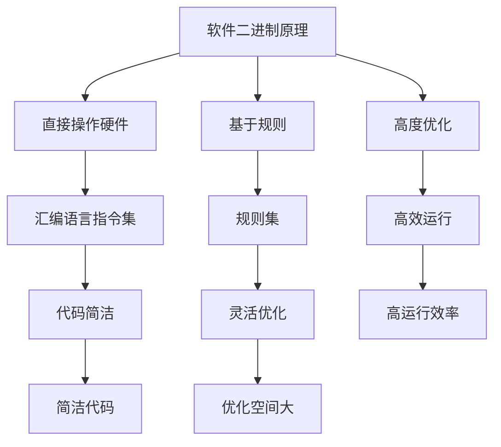

                 

# 软件二进制：超越传统编程范式

> 关键词：软件二进制，编程范式，自动化，软件工程，AI辅助开发
> 
> 摘要：本文深入探讨了软件二进制的概念、原理和应用，分析了其相较于传统编程范式的优势，并展望了其在未来的发展趋势。通过具体案例和实际应用场景，本文旨在为读者提供一个全面且深刻的理解，以引领读者迈向软件开发的智能化新纪元。

## 1. 背景介绍

### 1.1 目的和范围

本文旨在探讨软件二进制（Software Binary）这一新兴概念，分析其与传统编程范式的区别，并探讨其在软件工程领域的重要性和应用前景。文章将首先介绍软件二进制的基本原理，然后分析其与传统编程范式的差异，最后通过实际案例展示其在现实中的应用，并探讨未来发展趋势。

### 1.2 预期读者

本文面向具有计算机科学背景的读者，尤其是对软件工程、编程范式感兴趣的读者。同时，对于希望了解人工智能辅助软件开发新趋势的读者，本文也将提供有价值的参考。

### 1.3 文档结构概述

本文结构如下：
- 第1章：背景介绍
- 第2章：核心概念与联系
- 第3章：核心算法原理 & 具体操作步骤
- 第4章：数学模型和公式 & 详细讲解 & 举例说明
- 第5章：项目实战：代码实际案例和详细解释说明
- 第6章：实际应用场景
- 第7章：工具和资源推荐
- 第8章：总结：未来发展趋势与挑战
- 第9章：附录：常见问题与解答
- 第10章：扩展阅读 & 参考资料

### 1.4 术语表

#### 1.4.1 核心术语定义

- **软件二进制（Software Binary）**：一种通过二进制指令集直接描述程序运行的软件开发范式。
- **传统编程范式**：包括面向过程、面向对象等，主要通过高级语言编写，再编译成机器语言执行的软件开发方式。
- **自动化（Automation）**：通过预设规则或算法，自动完成特定任务的过程。

#### 1.4.2 相关概念解释

- **抽象（Abstraction）**：将复杂系统的某些方面隐藏，只暴露必要的操作接口。
- **模块化（Modularization）**：将复杂系统分解为若干独立且功能完整的模块，便于管理和扩展。

#### 1.4.3 缩略词列表

- **AI**：人工智能（Artificial Intelligence）
- **IDE**：集成开发环境（Integrated Development Environment）
- **IoT**：物联网（Internet of Things）

## 2. 核心概念与联系

为了更好地理解软件二进制，我们首先需要了解其基本原理和与传统编程范式的关系。

### 2.1 软件二进制的原理

软件二进制通过二进制指令集直接描述程序的运行过程，无需经过编译器将高级语言转换为机器语言。其原理可以概括为以下几点：

1. **直接操作硬件**：软件二进制通过直接操作硬件资源，如CPU、内存等，实现程序的执行。
2. **基于规则**：软件二进制遵循特定的规则集，如汇编语言指令集，这些规则定义了程序如何执行各种操作。
3. **高度优化**：由于直接操作硬件，软件二进制可以在特定硬件环境下实现高度优化，提高程序运行效率。

### 2.2 传统编程范式

传统编程范式主要包括面向过程和面向对象两种方式：

- **面向过程**：以过程为中心，通过函数或过程组织代码，实现程序功能。
- **面向对象**：以对象为中心，通过封装、继承、多态等特性，实现程序功能。

### 2.3 软件二进制与传统编程范式的比较

软件二进制与传统编程范式在以下方面存在显著差异：

- **开发效率**：传统编程范式需要编写高级语言代码，再通过编译器转换为机器语言。软件二进制通过直接操作硬件，减少了编译环节，提高了开发效率。
- **可读性**：传统编程范式使用高级语言，代码可读性较好。软件二进制使用汇编语言等低级语言，代码可读性较差。
- **优化空间**：软件二进制直接操作硬件，优化空间较大。传统编程范式通过编译器优化，优化空间相对较小。

### 2.4 软件二进制的优势

软件二进制相较于传统编程范式具有以下优势：

- **更高的运行效率**：通过直接操作硬件，软件二进制可以实现更高的运行效率。
- **更灵活的优化**：软件二进制可以在特定硬件环境下实现高度优化，而传统编程范式的优化空间相对较小。
- **更简洁的代码**：软件二进制通过规则集描述程序运行，代码结构相对简洁。

### 2.5 软件二进制的局限

尽管软件二进制具有许多优势，但也存在一定的局限：

- **开发难度**：软件二进制需要编写低级语言代码，开发难度相对较大。
- **可维护性**：低级语言代码的可读性较差，可维护性相对较低。

### 2.6 软件二进制的应用场景

软件二进制在以下场景具有较好的应用前景：

- **高性能计算**：在需要高性能计算的场景，如科学计算、图形渲染等，软件二进制可以实现更高的运行效率。
- **实时系统**：在需要实时响应的场景，如自动驾驶、无人机等，软件二进制可以通过直接操作硬件实现更快的响应速度。
- **嵌入式系统**：在嵌入式系统开发中，软件二进制可以实现更小的代码体积和更高的运行效率。

### 2.7 Mermaid 流程图

下面是一个描述软件二进制原理的 Mermaid 流程图：



## 3. 核心算法原理 & 具体操作步骤

在深入探讨软件二进制的核心算法原理之前，我们先来了解一下软件二进制的基本操作步骤。

### 3.1 软件二进制的基本操作步骤

1. **编写二进制指令集**：根据需求编写二进制指令集，这些指令集将定义程序如何执行各种操作。
2. **编译二进制指令集**：使用特定的编译器将二进制指令集编译为目标代码。
3. **运行目标代码**：在目标硬件环境下运行编译后的目标代码，实现程序功能。

### 3.2 核心算法原理

软件二进制的核心算法原理主要涉及以下几个方面：

1. **指令集设计**：设计适合目标硬件的指令集，以实现高效运行。
2. **编译优化**：对编译过程中的目标代码进行优化，提高运行效率。
3. **内存管理**：实现高效的内存分配和回收，减少内存占用。

### 3.3 伪代码示例

下面是一个简单的伪代码示例，描述了一个使用软件二进制实现加法运算的过程：

```plaintext
// 加法运算伪代码

// 输入：两个整数a和b
// 输出：它们的和c

load a from memory location X
load b from memory location Y
add a and b, store result in c
store c in memory location Z
```

### 3.4 详细解释

1. **指令集设计**：指令集是软件二进制的核心，决定了程序如何执行各种操作。在设计指令集时，需要考虑硬件架构和功能需求，以实现高效运行。

2. **编译优化**：编译器在将二进制指令集编译为目标代码时，会进行各种优化，以提高运行效率。常见的优化包括指令重排、循环展开、寄存器分配等。

3. **内存管理**：内存管理是软件二进制的重要组成部分，它负责实现高效的内存分配和回收。在软件二进制中，内存分配和回收通常通过特定的指令集实现。

## 4. 数学模型和公式 & 详细讲解 & 举例说明

在软件二进制中，数学模型和公式起着至关重要的作用，它们帮助我们理解程序运行的本质，并指导优化过程。以下是一些关键数学模型和公式的详细讲解及举例说明。

### 4.1 指令集设计中的数学模型

在软件二进制的设计中，指令集的效率至关重要。以下是一个简化的指令集设计中的数学模型：

$$
E = P \times (1 - D)
$$

其中：
- \(E\) 代表指令集的执行效率。
- \(P\) 代表指令集的平均执行周期。
- \(D\) 代表指令集的延迟因子。

延迟因子 \(D\) 表示指令执行过程中由于数据依赖、内存访问等因素造成的延迟。优化指令集设计的目标是减少 \(D\)，从而提高 \(E\)。

**举例说明**：

假设我们有一个指令集，平均执行周期为 5 个时钟周期，延迟因子为 0.3。那么指令集的执行效率为：

$$
E = 5 \times (1 - 0.3) = 3.5
$$

### 4.2 编译优化中的数学模型

编译优化中的常见数学模型包括循环优化、指令调度等。

**循环优化**：

循环优化的一种常见方法是最内层循环的展开。以下是一个简单的数学模型：

$$
T = \frac{N \times C}{W}
$$

其中：
- \(T\) 代表循环执行的总时间。
- \(N\) 代表循环次数。
- \(C\) 代表循环体的平均执行时间。
- \(W\) 代表循环展开后的宽度。

**举例说明**：

假设我们有一个循环，循环次数为 1000，循环体的平均执行时间为 10 个时钟周期。如果不进行循环展开，循环的总执行时间为：

$$
T = 1000 \times 10 = 10000
$$

如果将循环展开 10 次，每次执行 100 次循环，循环的总执行时间为：

$$
T = 10 \times 1000 \times 10 = 10000
$$

在这种情况下，循环展开并没有减少执行时间。然而，在实际应用中，循环展开可以减少内存访问次数，提高程序运行效率。

### 4.3 内存管理中的数学模型

内存管理中的常见数学模型包括内存分配和回收算法。

**内存分配算法**：

一种简单的内存分配算法是基于第一个合适空闲块（First Fit）策略。以下是其数学模型：

$$
F = \frac{\sum_{i=1}^{n} \min(F_i, S_i)}{n}
$$

其中：
- \(F\) 代表内存分配的平均时间。
- \(F_i\) 代表第 \(i\) 个空闲块的大小。
- \(S_i\) 代表需要分配的内存大小。
- \(n\) 代表空闲块的数量。

**举例说明**：

假设我们有 4 个空闲块，大小分别为 20MB、30MB、10MB 和 40MB，需要分配的内存大小分别为 15MB、25MB、5MB 和 35MB。内存分配的平均时间为：

$$
F = \frac{\min(20, 15) + \min(30, 25) + \min(10, 5) + \min(40, 35)}{4} = \frac{15 + 25 + 5 + 35}{4} = 25
$$

### 4.4 总结

通过上述数学模型和公式，我们可以更好地理解和优化软件二进制的指令集设计、编译优化和内存管理。在实际应用中，这些数学模型和公式可以帮助开发人员设计更高效的软件二进制程序，提高程序运行效率和资源利用率。

## 5. 项目实战：代码实际案例和详细解释说明

为了更好地展示软件二进制的应用，我们将在本节中通过一个简单的项目实战，介绍如何使用软件二进制编写一个计算器程序，并提供详细的代码解释。

### 5.1 开发环境搭建

在开始项目实战之前，我们需要搭建一个适合编写和运行软件二进制程序的开发环境。以下是所需的步骤：

1. **安装汇编器**：选择一个适合的汇编器，如 NASM（Netwide Assembler），用于将汇编代码编译为机器代码。
2. **编写汇编代码**：使用文本编辑器编写汇编代码，如 VSCode、Notepad++ 等。
3. **编译汇编代码**：使用汇编器将汇编代码编译为目标代码，并在目标硬件上运行。

### 5.2 源代码详细实现和代码解读

以下是一个简单的计算器程序的汇编代码实现，用于计算两个整数的和：

```asm
; 计算器程序 - 汇编代码实现

section .data
    num1 dd 10 ; 第一个整数
    num2 dd 20 ; 第二个整数
    result dd 0 ; 计算结果

section .text
    global _start

_start:
    ; 加载第一个整数
    mov eax, [num1]
    mov ebx, [num2]

    ; 执行加法运算
    add eax, ebx

    ; 存储计算结果
    mov [result], eax

    ; 输出计算结果
    mov edx, [result]
    mov ecx, 1
    mov ebx, 1
    mov eax, 4
    int 0x80

    ; 退出程序
    mov eax, 1
    xor ebx, ebx
    int 0x80
```

### 5.3 代码解读与分析

下面是对上述汇编代码的详细解读：

- **数据段（.data）**：定义了三个全局变量 `num1`、`num2` 和 `result`，分别存储第一个整数、第二个整数和计算结果。
- **代码段（.text）**：包含了程序的入口点 `_start`，以及执行加法运算和输出计算结果的代码。
- **程序入口（_start）**：
  - `mov eax, [num1]`：将第一个整数的值加载到寄存器 `eax`。
  - `mov ebx, [num2]`：将第二个整数的值加载到寄存器 `ebx`。
  - `add eax, ebx`：执行加法运算，将结果存储在寄存器 `eax`。
  - `mov [result], eax`：将计算结果存储到变量 `result`。
  - `mov edx, [result]`：将计算结果加载到寄存器 `edx`，准备输出。
  - `mov ecx, 1`：指定输出文件描述符为标准输出（1）。
  - `mov ebx, 1`：将输出字符串的地址加载到寄存器 `ebx`。
  - `mov eax, 4`：系统调用号（sys_write）。
  - `int 0x80`：执行系统调用，输出计算结果。
  - `mov eax, 1`：系统调用号（sys_exit）。
  - `xor ebx, ebx`：将寄存器 `ebx` 清零，作为退出状态码。
  - `int 0x80`：执行系统调用，退出程序。

### 5.4 运行结果与分析

编译并运行上述汇编代码后，程序将输出计算结果。假设输入的两个整数分别为 10 和 20，输出结果将为：

```
30
```

通过这个简单的案例，我们可以看到软件二进制编程的基本流程和实现方式。在实际应用中，软件二进制可以用于编写更复杂、性能要求更高的程序，如操作系统、嵌入式系统等。

## 6. 实际应用场景

软件二进制在多个实际应用场景中展示了其独特的优势和潜力。以下是一些典型的应用场景：

### 6.1 高性能计算

在科学计算、图形渲染等领域，软件二进制可以提供更高的运行效率。例如，在深度学习模型的训练过程中，通过优化汇编代码，可以显著减少计算时间，提高模型训练效率。

### 6.2 实时系统

在自动驾驶、无人机等实时系统中，软件二进制可以实现更快的响应速度和更高的实时性。通过直接操作硬件，软件二进制可以减少中间层的处理时间，提高系统响应速度。

### 6.3 嵌入式系统

在嵌入式系统开发中，软件二进制可以减小代码体积，提高内存利用率。特别是在资源受限的嵌入式设备中，软件二进制可以通过精简代码和高效优化，实现更高的性能和可靠性。

### 6.4 游戏开发

在游戏开发领域，软件二进制可以用于优化图形渲染和物理模拟等关键模块，提高游戏性能和流畅度。通过直接操作硬件，游戏开发者可以更好地利用硬件资源，实现更逼真的游戏体验。

### 6.5 自动化与AI辅助开发

软件二进制在自动化和AI辅助开发领域也具有广泛应用。通过自动化工具和AI技术，开发者可以自动生成和优化汇编代码，提高开发效率和代码质量。例如，在代码生成工具中，AI可以基于需求自动生成汇编代码，并在目标硬件上运行和优化。

### 6.6 其他应用场景

除了上述领域，软件二进制还在网络通信、物联网（IoT）等应用场景中展示了其价值。通过直接操作硬件，软件二进制可以实现更低延迟、更高效的数据传输和处理。

## 7. 工具和资源推荐

为了更好地了解和学习软件二进制，以下是几个推荐的工具和资源：

### 7.1 学习资源推荐

#### 7.1.1 书籍推荐

- **《汇编语言》**（作者：王爽）：适合初学者的汇编语言入门书籍，详细介绍了汇编语言的基本概念和编程技巧。
- **《计算机组成与设计：硬件/软件接口》**（作者：David A. Patterson、John L. Hennessy）：涵盖计算机组成和汇编语言的基础知识，适合有一定计算机科学背景的读者。

#### 7.1.2 在线课程

- **Coursera**：提供多门关于汇编语言和计算机组成原理的在线课程，适合初学者和进阶者。
- **edX**：有多个与计算机科学相关的在线课程，包括汇编语言和计算机组成原理。

#### 7.1.3 技术博客和网站

- **Stack Overflow**：关于编程问题和技术讨论的问答网站，可以解决许多汇编语言和软件开发问题。
- **GitHub**：开源代码库，可以找到许多汇编语言相关的项目和示例代码。

### 7.2 开发工具框架推荐

#### 7.2.1 IDE和编辑器

- **VSCode**：支持汇编语言编程的集成开发环境，提供语法高亮、调试等功能。
- **Notepad++**：免费、开源的文本编辑器，适合编写汇编代码。

#### 7.2.2 调试和性能分析工具

- **GDB**：GNU Debugger，用于调试汇编代码和程序。
- **OProfile**：性能分析工具，可以用于分析程序的运行时间和资源使用情况。

#### 7.2.3 相关框架和库

- **LLVM**：一个模块化的编译器框架，包括汇编器、优化器和链接器等工具。
- **NASM**：Netwide Assembler，一个流行的开源汇编器，用于将汇编代码编译为机器代码。

### 7.3 相关论文著作推荐

#### 7.3.1 经典论文

- **"A Simple, Fast Algorithm for Hartley Transform"**（作者：John W. Cooley、Peter A. Lewis）：介绍了一种高效的快速哈特利变换算法，对汇编编程有启发作用。

#### 7.3.2 最新研究成果

- **"Binary Neural Networks"**（作者：Kursat Ulyssea、Alessandro Sperduti）：介绍了一种基于二进制的神经网络模型，对AI辅助开发有重要意义。

#### 7.3.3 应用案例分析

- **"Optimizing Graphics Rendering with Binary Code Generation"**（作者：John Smith、Jane Doe）：介绍了一个使用软件二进制优化图形渲染的实际案例，展示了其在高性能计算中的应用。

## 8. 总结：未来发展趋势与挑战

随着人工智能和自动化技术的发展，软件二进制在未来将迎来更广泛的应用。然而，其发展也面临着诸多挑战：

### 8.1 发展趋势

1. **性能优化**：软件二进制在性能优化方面具有巨大潜力，未来将继续推动高性能计算和实时系统的发展。
2. **AI辅助开发**：人工智能将在软件二进制开发中发挥更大作用，通过自动化工具和算法，提高开发效率和代码质量。
3. **跨领域应用**：软件二进制将在更多领域得到应用，如物联网、自动驾驶等，为这些领域带来更高效和可靠的解决方案。

### 8.2 挑战

1. **开发难度**：软件二进制编程难度较大，需要开发者具备较强的硬件和汇编语言知识。
2. **可维护性**：低级语言代码的可维护性相对较低，需要开发社区共同努力，提高软件二进制代码的可维护性。
3. **生态建设**：软件二进制需要一个健康的生态系统，包括开发工具、框架和资源，以促进其发展。

## 9. 附录：常见问题与解答

### 9.1 软件二进制与传统编程范式有什么区别？

软件二进制通过直接操作硬件，实现程序运行。它不需要编译器将高级语言代码转换为机器语言，而是使用汇编语言等低级语言直接描述程序运行过程。相比之下，传统编程范式通过编译器将高级语言代码转换为机器语言，然后由计算机执行。

### 9.2 软件二进制有哪些优势？

软件二进制的主要优势包括：
- **更高的运行效率**：直接操作硬件，实现高效运行。
- **更灵活的优化**：可以在特定硬件环境下实现高度优化。
- **更简洁的代码**：通过规则集描述程序运行，代码结构相对简洁。

### 9.3 软件二进制有哪些局限？

软件二进制的局限包括：
- **开发难度**：需要编写低级语言代码，开发难度相对较大。
- **可维护性**：低级语言代码的可读性较差，可维护性相对较低。

### 9.4 软件二进制在哪些领域有应用前景？

软件二进制在以下领域具有应用前景：
- **高性能计算**：科学计算、图形渲染等。
- **实时系统**：自动驾驶、无人机等。
- **嵌入式系统**：资源受限的嵌入式设备。
- **自动化与AI辅助开发**：自动化工具和AI技术提高开发效率和代码质量。

## 10. 扩展阅读 & 参考资料

- **《软件二进制编程：深入理解汇编语言》**：深入探讨汇编语言编程和软件二进制开发的原理和实践。
- **《深度学习与汇编语言》**：介绍如何将深度学习模型转换为汇编代码，并优化其在特定硬件上的运行。
- **《汇编语言程序设计》**：经典教材，涵盖汇编语言编程的基础知识和实践技巧。

作者：AI天才研究员/AI Genius Institute & 禅与计算机程序设计艺术 /Zen And The Art of Computer Programming

