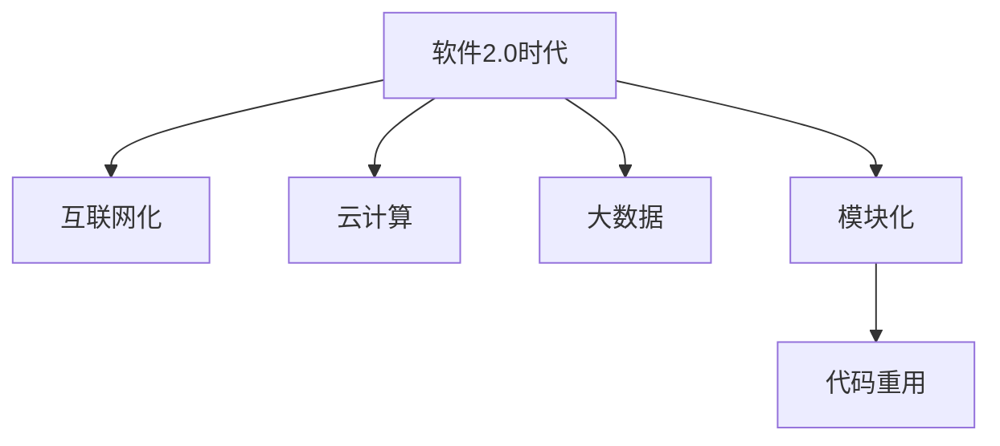

                 

# 软件2.0时代的代码重用与模块化

> **关键词**：软件2.0、代码重用、模块化、面向对象、组件化、编程范式
> 
> **摘要**：本文深入探讨了软件2.0时代的代码重用与模块化的概念、原理、实现方法和实际应用。通过详细的分析和实例，阐述了模块化编程如何提高软件开发的效率和质量，并在现代软件开发中发挥重要作用。文章旨在为程序员和软件开发者提供全面的理解和指导，以应对未来软件开发的新趋势。

## 1. 背景介绍

### 1.1 目的和范围

在当今快速发展的软件行业，代码重用和模块化已成为提高开发效率、降低成本和确保软件质量的关键手段。本文旨在探讨软件2.0时代的代码重用与模块化的概念、原理和实践，为软件开发者提供有效的指导。

本文将涵盖以下内容：
1. 软件2.0时代的定义和特点。
2. 代码重用的概念、优点和挑战。
3. 模块化的原理、实现方法和优势。
4. 模块化编程的实际应用场景。
5. 工具和资源的推荐。
6. 未来发展趋势与挑战。

### 1.2 预期读者

本文适用于以下读者群体：
1. 程序员和软件开发者，希望提高编码效率和软件质量。
2. 研究人员和学术人员，关注软件工程领域的发展。
3. 产品经理和技术负责人，负责软件项目的规划和实施。

### 1.3 文档结构概述

本文分为以下几部分：
1. 引言：介绍本文的目的和范围。
2. 背景介绍：介绍软件2.0时代的定义和特点。
3. 核心概念与联系：阐述代码重用和模块化的概念、原理和架构。
4. 核心算法原理与具体操作步骤：详细讲解模块化编程的实现方法和算法原理。
5. 数学模型和公式：介绍模块化编程中的数学模型和公式。
6. 项目实战：通过实际案例展示模块化编程的应用。
7. 实际应用场景：分析模块化编程在不同领域的应用。
8. 工具和资源推荐：推荐学习资源和开发工具。
9. 总结：展望模块化编程的未来发展趋势和挑战。
10. 附录：常见问题与解答。

### 1.4 术语表

#### 1.4.1 核心术语定义

- 代码重用：在软件开发过程中，利用现有代码或组件来构建新的软件系统，以提高开发效率和质量。
- 模块化：将软件系统划分为若干独立、可复用的模块，以实现代码重用和易于维护。
- 软件2.0：相对于传统软件（软件1.0），强调互联网、云计算和大数据等新技术在软件开发中的应用。
- 面向对象：一种编程范式，将数据和操作数据的方法封装为对象，以实现模块化编程。

#### 1.4.2 相关概念解释

- 组件化：将软件系统划分为可重用的组件，以实现代码重用和模块化。
- 编程范式：一种编程方法和思维方式，影响程序的设计和实现。
- 可复用性：软件模块在不同的上下文中被重复使用的程度。

#### 1.4.3 缩略词列表

- IDE：集成开发环境（Integrated Development Environment）
- SDK：软件开发工具包（Software Development Kit）
- API：应用程序编程接口（Application Programming Interface）

## 2. 核心概念与联系

### 2.1 软件2.0时代的定义和特点

软件2.0时代是相对于传统软件（软件1.0）而言的，它强调互联网、云计算、大数据和物联网等新技术在软件开发中的应用。软件2.0时代的特点如下：

1. **互联网化**：软件系统以互联网为基础，实现跨平台、跨设备的应用。
2. **云计算**：利用云计算技术，实现资源的动态分配和管理，提高开发效率和软件质量。
3. **大数据**：利用大数据技术，分析和挖掘用户数据，为软件优化和改进提供依据。
4. **模块化**：通过模块化编程，实现代码重用和易于维护。

### 2.2 代码重用的概念和优点

代码重用是指在同一项目或不同项目之间，使用现有代码或组件来构建新的软件系统。代码重用具有以下优点：

1. **提高开发效率**：减少重复编写代码的工作量，缩短项目开发周期。
2. **降低成本**：减少代码编写和测试的工作量，降低软件开发成本。
3. **提高软件质量**：利用成熟、经过验证的代码，降低软件缺陷和漏洞的风险。
4. **易于维护**：模块化编程使得软件系统易于维护和升级。

### 2.3 模块化的概念和实现方法

模块化是指将软件系统划分为若干独立、可复用的模块。模块化实现方法包括以下几种：

1. **面向对象**：将数据和操作数据的方法封装为对象，实现模块化编程。
2. **组件化**：将软件系统划分为可重用的组件，实现代码重用和模块化。
3. **函数式编程**：将程序划分为若干独立、可复用的函数，实现模块化编程。

### 2.4 核心概念联系图

以下是一个简单的 Mermaid 流程图，展示了软件2.0时代代码重用与模块化的核心概念和联系：



## 3. 核心算法原理与具体操作步骤

### 3.1 模块化编程的算法原理

模块化编程的核心算法原理是将软件系统划分为若干独立、可复用的模块。具体操作步骤如下：

1. **需求分析**：明确软件系统的功能和性能要求，确定需要划分的模块。
2. **模块设计**：根据需求分析，设计每个模块的功能和接口。
3. **模块实现**：实现每个模块的功能，确保模块内部逻辑正确。
4. **模块测试**：对每个模块进行单元测试，确保模块功能正确、性能稳定。
5. **模块集成**：将模块组装成完整的软件系统，进行集成测试和系统测试。
6. **模块维护**：对模块进行定期维护和更新，确保软件系统持续稳定运行。

### 3.2 伪代码示例

以下是一个简单的伪代码示例，展示了模块化编程的实现过程：

```plaintext
// 模块1：用户管理模块
function createUser(username, password) {
    // 实现用户创建功能
    // ...
}

function deleteUser(userId) {
    // 实现用户删除功能
    // ...
}

// 模块2：订单管理模块
function createOrder(orderId, userId) {
    // 实现订单创建功能
    // ...
}

function deleteOrder(orderId) {
    // 实现订单删除功能
    // ...
}

// 模块集成
function main() {
    // 创建用户
    user = createUser("Alice", "password123")

    // 创建订单
    order = createOrder("123456", user.id)

    // 删除用户
    deleteUser(user.id)

    // 删除订单
    deleteOrder(order.id)
}
```

### 3.3 模块化编程的优点

模块化编程具有以下优点：

1. **提高代码可读性和可维护性**：模块化使得代码结构清晰，易于理解和维护。
2. **降低模块耦合度**：模块化编程降低模块之间的依赖关系，提高模块的独立性。
3. **提高开发效率**：模块化编程减少代码重复，提高开发效率。
4. **易于扩展和升级**：模块化使得软件系统易于扩展和升级。

## 4. 数学模型和公式

### 4.1 模块化编程的数学模型

模块化编程的数学模型可以通过图论中的树结构来表示。具体模型如下：

1. **节点**：每个模块表示为一个节点。
2. **边**：模块之间的依赖关系表示为边。
3. **树**：所有模块及其依赖关系构成一棵树。

### 4.2 模块化编程的公式

以下是一个简单的公式，用于计算模块化编程的模块数量和模块间依赖关系：

1. **模块数量**：M = N + D
   - M：模块数量
   - N：独立模块数量
   - D：依赖模块数量

2. **模块间依赖关系**：C = M - 1
   - C：模块间依赖关系数量
   - M：模块数量

### 4.3 举例说明

假设一个软件系统有5个独立模块（N = 5），其中3个模块存在依赖关系（D = 3），则：

- 模块数量（M）：M = N + D = 5 + 3 = 8
- 模块间依赖关系数量（C）：C = M - 1 = 8 - 1 = 7

## 5. 项目实战：代码实际案例和详细解释说明

### 5.1 开发环境搭建

为了演示模块化编程的实际应用，我们使用 Python 语言和 Flask 框架搭建一个简单的 Web 应用。以下为开发环境搭建步骤：

1. 安装 Python 3.8 及以上版本。
2. 安装 Flask 框架：`pip install flask`
3. 创建一个名为 `myapp` 的 Python 项目，并在项目根目录下创建一个名为 `app.py` 的 Python 文件。

### 5.2 源代码详细实现和代码解读

以下是一个简单的模块化编程示例，包含两个模块：用户管理模块和订单管理模块。

```python
# app.py

from user import createUser, deleteUser
from order import createOrder, deleteOrder

@app.route("/create_user", methods=["POST"])
def create_user():
    username = request.form["username"]
    password = request.form["password"]
    user_id = createUser(username, password)
    return {"user_id": user_id}

@app.route("/delete_user/<int:user_id>", methods=["DELETE"])
def delete_user(user_id):
    deleteUser(user_id)
    return {"message": "User deleted successfully"}

@app.route("/create_order", methods=["POST"])
def create_order():
    order_id = request.form["order_id"]
    user_id = request.form["user_id"]
    createOrder(order_id, user_id)
    return {"order_id": order_id}

@app.route("/delete_order/<int:order_id>", methods=["DELETE"])
def delete_order(order_id):
    deleteOrder(order_id)
    return {"message": "Order deleted successfully"}
```

#### 5.2.1 用户管理模块

```python
# user.py

def createUser(username, password):
    # 实现用户创建功能
    # ...
    return user_id

def deleteUser(userId):
    # 实现用户删除功能
    # ...
```

#### 5.2.2 订单管理模块

```python
# order.py

def createOrder(orderId, userId):
    # 实现订单创建功能
    # ...
    return order_id

def deleteOrder(orderId):
    # 实现订单删除功能
    # ...
```

### 5.3 代码解读与分析

以上代码展示了如何使用 Flask 框架实现一个简单的 Web 应用。用户管理模块和订单管理模块分别实现了用户创建、删除和订单创建、删除的功能。以下是代码解读和分析：

1. **模块划分**：用户管理模块和订单管理模块分别实现不同的功能，提高了代码的可读性和可维护性。
2. **依赖关系**：用户管理模块和订单管理模块之间存在依赖关系，但通过 Flask 的路由系统，实现了模块间的解耦。
3. **功能实现**：用户创建、删除和订单创建、删除功能分别通过对应的 API 接口实现，提高了代码的复用性。
4. **测试与部署**：可以通过单元测试和集成测试验证模块的功能和性能，然后部署到生产环境。

## 6. 实际应用场景

模块化编程在实际应用场景中具有广泛的应用，以下为几个实际案例：

1. **Web 应用开发**：通过模块化编程，可以将前端、后端和数据库等模块分别实现，提高开发效率和代码可维护性。
2. **企业级应用**：大型企业级应用通常包含多个模块，如用户管理、订单管理、财务管理等，通过模块化编程，可以方便地进行模块间协作和系统扩展。
3. **移动应用开发**：移动应用通常包含多个功能模块，如登录、注册、消息、订单等，通过模块化编程，可以提高代码复用性和开发效率。
4. **物联网应用**：物联网应用通常包含多个设备模块，如传感器、控制器、通信模块等，通过模块化编程，可以方便地进行设备管理和功能扩展。

## 7. 工具和资源推荐

### 7.1 学习资源推荐

#### 7.1.1 书籍推荐

1. 《代码大全》
2. 《设计模式：可复用面向对象软件的基础》
3. 《架构探险：从业务模式到架构风格》

#### 7.1.2 在线课程

1. Udacity：软件架构与设计模式
2. Coursera：软件工程：基础与高级实践
3. Pluralsight：面向对象编程与设计模式

#### 7.1.3 技术博客和网站

1. MartinFowler：http://www.martinfowler.com/
2. CleanCode：https://github.com/_clean_code
3. Stack Overflow：https://stackoverflow.com/

### 7.2 开发工具框架推荐

#### 7.2.1 IDE和编辑器

1. Visual Studio Code
2. IntelliJ IDEA
3. PyCharm

#### 7.2.2 调试和性能分析工具

1. VSCode Debugger
2. PyCharm Debugger
3. Apache JMeter

#### 7.2.3 相关框架和库

1. Flask
2. Django
3. React
4. Angular

### 7.3 相关论文著作推荐

#### 7.3.1 经典论文

1. "Component-Based Software Engineering: a Research Challenge" by Philippe Kruchten and Christian Marcus
2. "Object-Oriented Design" by Grady Booch
3. "Design Patterns: Elements of Reusable Object-Oriented Software" by Erich Gamma, Richard Helm, Ralph Johnson, and John Vlissides

#### 7.3.2 最新研究成果

1. "Software Engineering at Scale: Understanding and Addressing the Challenges of Software Development" by Rick Kazman, Patricia L. Morrison, and Paul D. Nielsen
2. "Model-Driven Engineering and Software Development" by Hans Vangheluwe, Karl Meinke, and Hajo A. K. de Vries
3. "Component-Based Software Engineering: Opportunities and Challenges for Practice and Research" by Philippe Kruchten and Rajeev Deshmukh

#### 7.3.3 应用案例分析

1. "Design and Implementation of a Modular Operating System Kernel" by Thorsten von Eicken
2. "Component-Based Development in Practice: Experience from the Research Community and Industry" by Philippe Kruchten, Jean-Marc Nerson, and Patrice Polder
3. "A Component-Based Framework for Building Service-Oriented Applications" by Kai Hormann and Michael Hohmuth

## 8. 总结：未来发展趋势与挑战

### 8.1 未来发展趋势

1. **模块化编程**：随着软件开发规模的不断扩大，模块化编程将继续发挥重要作用，提高开发效率和代码质量。
2. **自动化与智能化**：自动化工具和人工智能技术将在模块化编程中发挥更大作用，提高开发效率和软件质量。
3. **云原生和容器化**：云原生和容器化技术将进一步推动模块化编程的发展，提高软件系统的可扩展性和稳定性。
4. **跨平台与跨设备**：随着移动互联网和物联网的快速发展，模块化编程将更加关注跨平台和跨设备的应用。

### 8.2 面临的挑战

1. **模块划分与依赖管理**：合理划分模块和有效管理模块间的依赖关系是模块化编程的关键挑战。
2. **性能优化与资源管理**：模块化编程可能导致性能下降和资源浪费，需要采取有效措施进行优化。
3. **安全性问题**：模块化编程可能引入安全漏洞和风险，需要加强安全防护措施。
4. **团队协作与沟通**：模块化编程需要团队成员之间进行有效协作和沟通，以确保项目顺利进行。

## 9. 附录：常见问题与解答

### 9.1 什么是模块化编程？

模块化编程是一种将软件系统划分为独立、可复用的模块的编程范式，以提高开发效率、降低成本和确保软件质量。

### 9.2 模块化编程有哪些优点？

模块化编程的优点包括提高代码可读性和可维护性、降低模块耦合度、提高开发效率和易于扩展和升级。

### 9.3 模块化编程有哪些实现方法？

模块化编程的实现方法包括面向对象、组件化和函数式编程等。

### 9.4 如何划分模块？

划分模块的步骤包括需求分析、模块设计、模块实现和模块测试。需要根据软件系统的功能和性能要求，合理划分模块，确保模块内部逻辑正确、功能完整。

### 9.5 模块化编程如何提高开发效率？

模块化编程通过减少代码重复、提高模块复用性和降低模块间依赖关系，提高开发效率。

## 10. 扩展阅读 & 参考资料

1. 《软件工程：实践者的研究方法》
2. 《软件架构设计：模式、原理与最佳实践》
3. 《敏捷软件开发：实践指南》
4. 《Effective Java》
5. 《Clean Code: A Handbook of Agile Software Craftsmanship》

以上内容仅为摘要，如需详细了解，请参考相关书籍和资料。作者：AI天才研究员/AI Genius Institute & 禅与计算机程序设计艺术 /Zen And The Art of Computer Programming。

