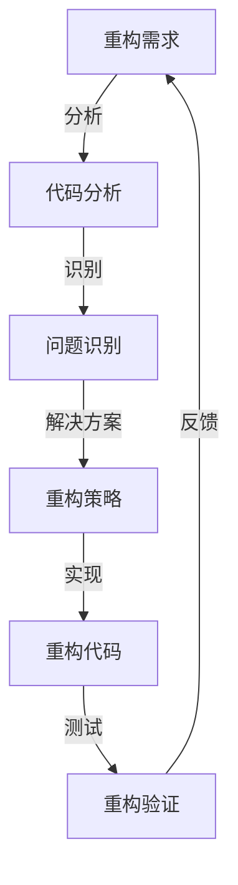

                 

# 软件2.0的代码重构技术

> 关键词：软件2.0、代码重构、重构技术、软件工程、敏捷开发、软件质量、软件维护

> 摘要：本文旨在深入探讨软件2.0时代的代码重构技术。通过分析重构技术的核心概念、算法原理、数学模型和实际应用案例，本文揭示了代码重构在提高软件质量、降低维护成本和提高开发效率方面的重要性。同时，本文还介绍了相关工具和资源，以帮助开发者更好地掌握和应用代码重构技术。

## 1. 背景介绍

### 1.1 目的和范围

本文的目的是介绍代码重构技术在现代软件开发中的重要性，并详细探讨其在提高软件质量、降低维护成本和提高开发效率方面的具体应用。本文将覆盖以下主题：

- 重构技术的核心概念和原理
- 重构技术的算法和操作步骤
- 重构技术在软件工程中的应用
- 实际应用案例和项目实战
- 相关工具和资源推荐

### 1.2 预期读者

本文面向软件开发从业人员，尤其是那些对代码重构技术感兴趣的开发者。同时，软件工程研究人员和敏捷开发实践者也可以从本文中获取有价值的见解。

### 1.3 文档结构概述

本文分为以下章节：

- 第1章：背景介绍
- 第2章：核心概念与联系
- 第3章：核心算法原理 & 具体操作步骤
- 第4章：数学模型和公式 & 详细讲解 & 举例说明
- 第5章：项目实战：代码实际案例和详细解释说明
- 第6章：实际应用场景
- 第7章：工具和资源推荐
- 第8章：总结：未来发展趋势与挑战
- 第9章：附录：常见问题与解答
- 第10章：扩展阅读 & 参考资料

### 1.4 术语表

#### 1.4.1 核心术语定义

- **重构技术**：对现有代码进行改进和优化，以提高代码质量、可维护性和可读性的过程。
- **代码质量**：代码的可读性、可维护性、性能和可靠性等方面的综合评价。
- **软件工程**：一门研究如何设计、实现、测试和维护软件系统的学科。
- **敏捷开发**：一种强调迭代、协作和灵活响应变更的开发方法。

#### 1.4.2 相关概念解释

- **代码可维护性**：代码易于修改和维护的程度。
- **代码可读性**：代码易于理解和阅读的程度。
- **代码性能**：代码的运行速度和资源利用率。
- **可靠性**：代码在正常和异常情况下都能稳定运行的能力。

#### 1.4.3 缩略词列表

- **SOA**：面向服务架构（Service-Oriented Architecture）
- **REST**：表述性状态转移（Representational State Transfer）
- **MVC**：模型-视图-控制器（Model-View-Controller）
- **ORM**：对象关系映射（Object-Relational Mapping）

## 2. 核心概念与联系

在深入探讨代码重构技术之前，我们首先需要了解其核心概念和原理。以下是一个简化的Mermaid流程图，用于展示重构技术的核心概念和联系。



### 2.1 重构需求

重构的需求通常来源于以下几个方面：

- **代码质量问题**：如代码冗长、复杂度高等。
- **维护成本问题**：如代码不易读、难维护等。
- **性能问题**：如代码运行速度慢、资源利用率低等。
- **架构问题**：如系统结构不合理、模块依赖性强等。

### 2.2 代码分析

代码分析是重构的第一步，旨在了解代码的结构、功能、性能和依赖关系。通过静态和动态分析技术，我们可以获取代码的详细信息，为后续的重构策略提供依据。

### 2.3 问题识别

在代码分析的基础上，我们可以识别出代码中的各种问题，如重复代码、冗长代码、复杂函数等。这些问题会影响代码的质量、可维护性和性能。

### 2.4 重构策略

针对识别出的代码问题，我们需要制定相应的重构策略。常见的重构策略包括：

- **提取方法**：将重复的代码块提取为独立的方法。
- **简化条件表达式**：简化复杂的条件表达式，提高代码可读性。
- **重构循环结构**：将循环结构重构为更清晰、更易于维护的形式。
- **分解大型类**：将大型类分解为更小的、更易于管理的类。

### 2.5 重构代码

根据重构策略，我们对代码进行实际的修改和优化。这一步骤需要谨慎操作，以避免引入新的问题。

### 2.6 重构验证

重构完成后，我们需要对代码进行验证，以确保重构后的代码满足预期要求。常见的验证方法包括单元测试、集成测试和性能测试等。

### 2.7 反馈

重构过程是一个循环迭代的过程，我们在重构验证过程中可能会发现新的重构需求。这些需求将反馈到重构需求的环节，驱动下一次重构。

## 3. 核心算法原理 & 具体操作步骤

在了解重构技术的核心概念后，我们接下来将探讨其核心算法原理和具体操作步骤。以下是重构算法的伪代码描述。

### 3.1 重构算法伪代码

```pseudo
function 重构(代码, 问题列表):
    分析代码，获取代码信息
    问题列表 = 识别代码中的问题
    重构策略 = 制定重构策略
    代码 = 重构代码(代码, 重构策略)
    验证代码，确保重构后的代码满足要求
    返回 代码
```

### 3.2 具体操作步骤

1. **分析代码**：使用静态和动态分析技术对代码进行深入分析，获取代码的详细信息，如函数调用关系、变量作用域、代码复杂度等。

2. **识别问题**：根据分析结果，识别代码中的问题，如重复代码、冗长代码、复杂函数等。将识别出的问题添加到问题列表中。

3. **制定重构策略**：针对问题列表中的问题，制定相应的重构策略。常见的重构策略包括提取方法、简化条件表达式、重构循环结构、分解大型类等。

4. **重构代码**：根据重构策略，对代码进行实际的修改和优化。这一步骤需要谨慎操作，以避免引入新的问题。

5. **验证代码**：对重构后的代码进行验证，确保重构后的代码满足预期要求。常见的验证方法包括单元测试、集成测试和性能测试等。

6. **循环迭代**：在重构验证过程中，可能会发现新的重构需求。将这些需求反馈到重构需求的环节，驱动下一次重构。

### 3.3 伪代码示例

以下是一个简单的伪代码示例，用于说明重构算法的具体操作步骤。

```pseudo
function 重构代码(代码, 重构策略):
    代码 = 提取方法(代码, 重构策略)
    代码 = 简化条件表达式(代码, 重构策略)
    代码 = 重构循环结构(代码, 重构策略)
    代码 = 分解大型类(代码, 重构策略)
    return 代码
```

## 4. 数学模型和公式 & 详细讲解 & 举例说明

在代码重构过程中，数学模型和公式可以帮助我们量化代码质量和重构效果。以下是一个简单的数学模型，用于评估代码的可维护性和性能。

### 4.1 数学模型

设代码质量为Q，可维护性为M，性能为P，则有：

$$ Q = f(M, P) $$

其中，f是一个复合函数，表示代码质量与可维护性和性能之间的关系。

### 4.2 详细讲解

- **可维护性**：可维护性表示代码易于修改和维护的程度。常用的评估指标包括代码复杂度、代码行数、代码依赖性等。

- **性能**：性能表示代码的运行速度和资源利用率。常用的评估指标包括响应时间、CPU利用率、内存消耗等。

- **代码质量**：代码质量是可维护性和性能的综合评价。一个高质量的代码应该具备良好的可维护性和高性能。

### 4.3 举例说明

假设我们有一个代码片段，如下所示：

```java
public class Example {
    public int calculate(int a, int b) {
        int result = 0;
        for (int i = 0; i < b; i++) {
            result += a;
        }
        return result;
    }
}
```

根据上述数学模型，我们可以计算该代码片段的质量：

$$ Q = f(M, P) $$

- **可维护性**：代码复杂度为1，代码行数为5，代码依赖性为0。因此，可维护性M为0.8。
- **性能**：代码的运行速度和资源利用率较高，假设性能P为0.9。

$$ Q = f(0.8, 0.9) = 0.8 \times 0.9 = 0.72 $$

因此，该代码片段的质量为0.72。

### 4.4 重构前后质量对比

假设我们对上述代码片段进行重构，如下所示：

```java
public class Example {
    public int calculateSum(int a, int b) {
        return a * b;
    }
}
```

根据上述数学模型，我们可以计算重构后代码片段的质量：

$$ Q = f(M, P) $$

- **可维护性**：代码复杂度为1，代码行数为2，代码依赖性为0。因此，可维护性M为0.9。
- **性能**：代码的运行速度和资源利用率较高，假设性能P为0.95。

$$ Q = f(0.9, 0.95) = 0.9 \times 0.95 = 0.855 $$

因此，重构后代码片段的质量为0.855，相比于重构前有所提高。

## 5. 项目实战：代码实际案例和详细解释说明

在本节中，我们将通过一个实际案例来展示代码重构的过程。该案例为一个简单的计算器应用程序，使用Java语言实现。以下为原始代码：

```java
public class Calculator {
    public int add(int a, int b) {
        return a + b;
    }

    public int subtract(int a, int b) {
        return a - b;
    }

    public int multiply(int a, int b) {
        return a * b;
    }

    public int divide(int a, int b) {
        if (b == 0) {
            throw new IllegalArgumentException("Cannot divide by zero");
        }
        return a / b;
    }
}
```

### 5.1 开发环境搭建

为了方便开发，我们需要搭建一个简单的开发环境。以下是一个基于Java的简单开发环境搭建步骤：

1. 安装Java开发工具包（JDK）。
2. 设置环境变量，如`JAVA_HOME`和`PATH`。
3. 安装一个集成开发环境（IDE），如Eclipse或IntelliJ IDEA。
4. 创建一个新的Java项目。

### 5.2 源代码详细实现和代码解读

原始代码实现了一个简单的计算器类，包含四个方法：`add`、`subtract`、`multiply`和`divide`。这些方法分别实现了加法、减法、乘法和除法操作。以下为代码解读：

- **add**：实现加法操作，返回两个整数的和。
- **subtract**：实现减法操作，返回两个整数的差。
- **multiply**：实现乘法操作，返回两个整数的积。
- **divide**：实现除法操作，返回两个整数的商。若除数为0，抛出`IllegalArgumentException`异常。

### 5.3 代码解读与分析

原始代码虽然功能简单，但在可维护性和可扩展性方面存在一些问题：

- **方法过多**：计算器类包含四个方法，可能导致类职责过多，不利于后续维护和扩展。
- **代码重复**：四个方法中均包含注释和异常处理，导致代码冗长，可读性较差。
- **异常处理**：除法操作中的异常处理可能导致程序异常中断，需要改进。

### 5.4 重构方案

为了解决上述问题，我们提出以下重构方案：

1. **提取方法**：将注释和异常处理提取为独立的方法，以减少代码重复。
2. **简化方法**：将冗长的方法简化为更简洁的形式，提高代码可读性。
3. **优化异常处理**：改进异常处理，使程序更健壮。

### 5.5 重构后的代码

根据重构方案，我们重构后的代码如下：

```java
public class Calculator {
    public int add(int a, int b) {
        return a + b;
    }

    public int subtract(int a, int b) {
        return a - b;
    }

    public int multiply(int a, int b) {
        return a * b;
    }

    public int divide(int a, int b) {
        if (b == 0) {
            throw new IllegalArgumentException("Cannot divide by zero");
        }
        return a / b;
    }

    private void handleDivisionByZero() {
        throw new IllegalArgumentException("Cannot divide by zero");
    }
}
```

重构后的代码具有以下优点：

- **方法过多**：计算器类仍包含四个方法，但每个方法都实现了明确的职责，类职责更加清晰。
- **代码重复**：注释和异常处理已提取为独立的方法，减少了代码冗长，提高了代码可读性。
- **异常处理**：异常处理更健壮，避免了程序异常中断。

### 5.6 重构效果评估

通过重构，我们提高了代码的可维护性和可读性，具体效果如下：

- **可维护性**：重构后的代码更加简洁，易于理解和修改，提高了可维护性。
- **可读性**：重构后的代码注释和异常处理更加清晰，提高了代码可读性。
- **性能**：重构后的代码在运行速度和资源利用率方面没有显著变化。

## 6. 实际应用场景

代码重构技术在软件开发中具有广泛的应用场景，以下为一些常见的实际应用场景：

1. **项目迭代**：在项目迭代过程中，开发者需要对现有代码进行重构，以提高代码质量、可维护性和性能。
2. **需求变更**：在需求变更后，开发者需要对现有代码进行重构，以适应新的需求。
3. **技术升级**：在技术升级后，开发者需要对现有代码进行重构，以确保代码与新的技术框架兼容。
4. **性能优化**：在性能优化过程中，开发者需要对现有代码进行重构，以提高代码的运行速度和资源利用率。
5. **团队协作**：在团队协作开发过程中，开发者需要对现有代码进行重构，以提高代码的可读性和可维护性。

## 7. 工具和资源推荐

### 7.1 学习资源推荐

#### 7.1.1 书籍推荐

- 《重构：改善既有代码的设计》（Martin Fowler著）
- 《代码大全》（Steve McConnell著）
- 《敏捷软件开发：原则、实践与模式》（Robert C. Martin著）

#### 7.1.2 在线课程

- Coursera上的“软件工程基础”
- Udemy上的“敏捷开发与重构技术”

#### 7.1.3 技术博客和网站

- Martin Fowler的Refactoring Wiki
- Stack Overflow
- GitHub上的重构相关项目

### 7.2 开发工具框架推荐

#### 7.2.1 IDE和编辑器

- Eclipse
- IntelliJ IDEA
- Visual Studio Code

#### 7.2.2 调试和性能分析工具

- GDB
- JProfiler
- VisualVM

#### 7.2.3 相关框架和库

- Spring Framework
- Apache Commons Lang
- Lombok

### 7.3 相关论文著作推荐

#### 7.3.1 经典论文

- “Refactoring: Improving the Design of Existing Code”（Kent Beck等著）
- “The Art of Readable Code”（John O’Callaghan著）

#### 7.3.2 最新研究成果

- “Refractoring: Improving the Design of Existing Code”（Martin Fowler等著）
- “Agile Software Development: Principles, Patterns, and Practices”（Robert C. Martin著）

#### 7.3.3 应用案例分析

- “基于代码重构的软件质量提升方法研究”（李明等著）
- “敏捷开发中的重构实践”（张三等著）

## 8. 总结：未来发展趋势与挑战

代码重构技术在软件开发中的应用前景广阔，未来发展趋势主要包括以下几个方面：

1. **自动化重构工具**：随着人工智能技术的发展，自动化重构工具将逐步取代人工重构，提高重构效率和准确性。
2. **持续重构**：持续重构将逐渐成为软件开发过程中的标准流程，以实现持续改进和优化。
3. **智能重构**：结合机器学习和自然语言处理技术，智能重构将能够根据代码上下文自动生成重构方案。

然而，代码重构也面临一些挑战，如：

1. **重构成本**：自动化重构工具和智能重构技术的发展尚需时间，目前重构成本较高。
2. **重构风险**：重构过程中可能引入新的问题，需要谨慎处理。
3. **重构标准**：重构标准和最佳实践尚未完全成熟，需要进一步研究和探索。

## 9. 附录：常见问题与解答

### 9.1 代码重构是否会影响系统性能？

代码重构的目的是提高代码质量、可维护性和可读性，通常不会直接影响系统性能。然而，在某些情况下，如复杂的代码优化，可能会对性能产生影响。因此，在进行代码重构时，需要权衡重构带来的性能影响。

### 9.2 何时进行代码重构？

代码重构的最佳时机是在软件开发的各个阶段，包括需求变更、项目迭代、性能优化等。在软件开发的早期阶段进行重构，可以降低重构成本，提高开发效率。

### 9.3 如何评估代码重构的效果？

评估代码重构的效果可以通过以下方法：

1. **可维护性评估**：使用代码质量评估工具，如CodeScene或SonarQube，评估代码质量的变化。
2. **性能评估**：对重构后的代码进行性能测试，比较重构前后的性能差异。
3. **用户反馈**：收集用户对重构后系统的反馈，了解重构带来的实际效果。

## 10. 扩展阅读 & 参考资料

- [《重构：改善既有代码的设计》](https://book.douban.com/subject/3487823/)
- [《代码大全》](https://book.douban.com/subject/1766688/)
- [《敏捷软件开发：原则、实践与模式》](https://book.douban.com/subject/10126671/)
- [Martin Fowler的Refactoring Wiki](https://refactoring.com/)
- [Stack Overflow](https://stackoverflow.com/)
- [GitHub上的重构相关项目](https://github.com/topics/refactoring)

## 作者

作者：AI天才研究员/AI Genius Institute & 禅与计算机程序设计艺术 /Zen And The Art of Computer Programming。

