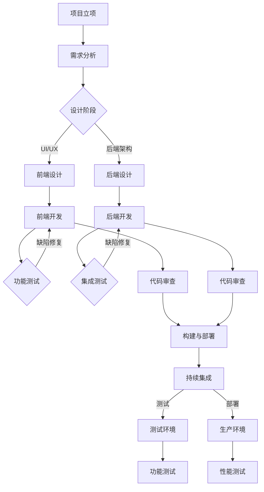

                 

# 软件2.0的发布管理流程

> **关键词：** 软件发布管理、版本控制、敏捷开发、持续集成、持续交付、DevOps
> 
> **摘要：** 本文旨在深入探讨软件2.0时代下的发布管理流程，从核心概念到实际操作，逐步分析并阐述如何在现代软件开发中实现高效的发布管理，助力团队快速响应市场变化，提升产品竞争力。

## 1. 背景介绍

### 1.1 目的和范围

本文旨在为软件开发团队提供一个全面而详细的发布管理流程指南。我们将会探讨从项目立项到最终产品发布所涉及的关键步骤、工具和技术。范围涵盖敏捷开发、持续集成（CI）和持续交付（CD）等现代软件开发实践。

### 1.2 预期读者

本文面向有一定软件开发经验，希望提升团队发布管理效率和流程的工程师、项目经理和技术负责人。

### 1.3 文档结构概述

本文将分为以下几个部分：

1. **背景介绍**：简要介绍发布管理的背景和重要性。
2. **核心概念与联系**：介绍发布管理中的核心概念及其相互关系。
3. **核心算法原理 & 具体操作步骤**：详细阐述发布管理的算法原理和操作步骤。
4. **数学模型和公式 & 详细讲解 & 举例说明**：分析发布管理中的数学模型和公式。
5. **项目实战：代码实际案例和详细解释说明**：通过实际案例说明发布管理流程。
6. **实际应用场景**：讨论发布管理在不同场景中的应用。
7. **工具和资源推荐**：推荐学习资源、开发工具和框架。
8. **总结：未来发展趋势与挑战**：总结发布管理的发展趋势和面临的挑战。
9. **附录：常见问题与解答**：提供常见问题的解答。
10. **扩展阅读 & 参考资料**：提供进一步的阅读资源。

### 1.4 术语表

#### 1.4.1 核心术语定义

- **发布管理**：软件生命周期中确保软件版本从开发环境到生产环境安全、稳定地过渡的过程。
- **敏捷开发**：一种以用户需求为导向的软件开发方法，强调快速迭代和持续交付。
- **持续集成（CI）**：一种软件开发实践，通过自动化构建和测试，确保代码库始终处于可部署状态。
- **持续交付（CD）**：在CI的基础上，通过自动化测试和部署，实现软件从开发到上线的高效流程。
- **DevOps**：一种文化和实践，强调软件开发与运维团队的协作，以实现持续集成和持续交付。

#### 1.4.2 相关概念解释

- **版本控制**：一种软件工程实践，用于管理和跟踪源代码和历史变更。
- **持续部署（DP）**：在持续交付的基础上，自动将软件部署到生产环境。
- **功能测试**：验证软件功能是否按照需求正确实现的测试。
- **负载测试**：模拟真实用户行为，评估系统在高负载下的性能和稳定性。

#### 1.4.3 缩略词列表

- **CI**：持续集成（Continuous Integration）
- **CD**：持续交付（Continuous Delivery）
- **DP**：持续部署（Continuous Deployment）
- **SaaS**：软件即服务（Software as a Service）
- **PaaS**：平台即服务（Platform as a Service）
- **IaaS**：基础设施即服务（Infrastructure as a Service）

## 2. 核心概念与联系

在深入讨论发布管理流程之前，首先需要理解其核心概念和它们之间的联系。以下是一个使用Mermaid绘制的流程图，展示发布管理中的关键概念及其相互关系。



### 2.1 项目立项

项目立项是发布管理的起点。在这一阶段，团队需要明确项目目标、功能需求、时间表和预算。同时，进行风险评估和资源分配。

### 2.2 需求分析

需求分析阶段，团队将与利益相关者（如客户、产品经理）进行沟通，明确软件功能、性能和用户体验要求。

### 2.3 设计阶段

设计阶段包括前端设计和后端设计。前端设计关注用户界面和用户体验，后端设计关注系统架构和数据库设计。

### 2.4 开发阶段

开发阶段包括前端开发和后端开发。开发者将根据设计文档进行编码，同时进行功能测试和集成测试。

### 2.5 代码审查

代码审查是确保代码质量的关键步骤。通过代码审查，团队能够发现潜在的错误、性能瓶颈和代码风格问题。

### 2.6 构建与部署

构建与部署阶段涉及将代码从开发环境转移到测试环境和生产环境。持续集成（CI）工具如Jenkins或GitLab CI可以自动化这一过程。

### 2.7 持续集成

持续集成通过自动化构建和测试，确保每次代码提交都能正常运行。这有助于快速识别和修复问题，提高代码质量。

### 2.8 测试环境与生产环境

测试环境用于进行功能测试和性能测试，确保软件在真实场景下能稳定运行。生产环境则是软件最终部署的地方。

## 3. 核心算法原理 & 具体操作步骤

### 3.1 版本控制

版本控制是发布管理的基石。以下是使用Git进行版本控制的伪代码：

```python
# 克隆仓库
git clone <仓库地址>

# 切换到新分支
git checkout -b <新分支名称>

# 提交更改
git add .
git commit -m "提交描述"

# � push 更改到远程仓库
git push origin <新分支名称>

# 合并分支
git checkout main
git merge <新分支名称>
git push
```

### 3.2 持续集成

持续集成通过自动化构建和测试确保代码库始终处于可部署状态。以下是使用Jenkins的伪代码：

```python
# 配置Jenkins流水线
cat << EOF > pipeline.yml
pipeline {
    agent any
    stages {
        stage('构建') {
            steps {
                sh 'mvn clean package'
            }
        }
        stage('测试') {
            steps {
                sh 'mvn test'
            }
        }
        stage('部署') {
            steps {
                sh 'mvn deploy'
            }
        }
    }
}
EOF

# 运行Jenkins流水线
java -jar jenkins.war --prefix=/var/jenkins_home --httpPort=8080
```

### 3.3 持续交付

持续交付通过自动化测试和部署，实现从开发到上线的高效流程。以下是使用GitLab CI的伪代码：

```yaml
stages:
  - build
  - test
  - deploy

build:
  stage: build
  script:
    - mvn clean package

test:
  stage: test
  script:
    - mvn test

deploy:
  stage: deploy
  script:
    - mvn deploy
```

### 3.4 代码审查

代码审查通过同行评审确保代码质量。以下是使用GitHub的伪代码：

```python
# 提交代码
git add .
git commit -m "提交描述"

# 开发者发起合并请求
git push origin <新分支名称>:main

# 代码审查者审查代码
github_pull_request_reviewer <审查者GitHub用户名>

# 审查后合并代码
git pull_request_merge
```

## 4. 数学模型和公式 & 详细讲解 & 举例说明

### 4.1 风险评估模型

风险评估是发布管理中的重要环节。以下是一个简单的风险评估公式：

$$
R = \frac{P \times I}{C}
$$

其中：
- \( R \) 是风险值。
- \( P \) 是概率，即某一事件发生的可能性。
- \( I \) 是影响，即事件发生对项目的负面影响。
- \( C \) 是缓解成本，即采取预防措施的代价。

### 4.2 持续集成成功率计算

持续集成成功率是评估CI系统稳定性的重要指标。以下是一个简单的计算公式：

$$
\text{成功率} = \frac{\text{成功构建次数}}{\text{总构建次数}} \times 100\%
$$

### 4.3 持续交付效率计算

持续交付效率可以通过以下公式计算：

$$
\text{交付效率} = \frac{\text{交付次数}}{\text{总时间}} \times 100\%
$$

其中：
- \( \text{交付次数} \) 是在特定时间段内成功部署到生产环境的次数。
- \( \text{总时间} \) 是同一时间段内团队用于开发和部署的总时间。

### 4.4 举例说明

假设我们有一个软件开发项目，预计完成需要3个月，实际完成时间为2.5个月。在这段时间里，团队完成了4次功能迭代，每次迭代都通过了CI/CD流程。以下是具体计算：

- **风险评估**：假设风险事件发生的概率为20%，每次事件的影响为5分，缓解成本为2分。则项目的风险值为：

$$
R = \frac{0.20 \times 5}{2} = 0.5
$$

- **持续集成成功率**：4次构建全部成功，则持续集成成功率为：

$$
\text{成功率} = \frac{4}{4} \times 100\% = 100\%
$$

- **持续交付效率**：4次迭代都在2.5个月的时间内完成，则持续交付效率为：

$$
\text{交付效率} = \frac{4}{2.5} \times 100\% = 160\%
$$

这表明团队在持续交付方面表现得非常出色，能够在比计划更短的时间内完成迭代。

## 5. 项目实战：代码实际案例和详细解释说明

### 5.1 开发环境搭建

为了演示发布管理流程，我们将使用一个简单的Web应用程序作为案例。以下是搭建开发环境所需的基本步骤：

1. **安装Java环境**：在本地机器上安装Java Development Kit（JDK）。可以通过以下命令安装：

   ```shell
   sudo apt-get update
   sudo apt-get install openjdk-8-jdk
   ```

2. **安装Maven**：Maven是一个项目管理和构建工具，用于构建Java项目。可以通过以下命令安装：

   ```shell
   sudo apt-get install maven
   ```

3. **安装Git**：Git是一个版本控制工具，用于管理代码库。可以通过以下命令安装：

   ```shell
   sudo apt-get install git
   ```

4. **安装Jenkins**：Jenkins是一个持续集成服务器，用于自动化构建和测试。可以通过以下命令安装：

   ```shell
   wget -q -O - https://pkg.jenkins.io/debian-stable/binaries/感染igm@Unstable.key | sudo tee /etc/keys/jenkins | sudo chmod 644 /etc/keys/jenkins
   sudo apt-get update
   sudo apt-get install jenkins
   ```

### 5.2 源代码详细实现和代码解读

以下是项目的源代码，以及每部分的详细解释。

```java
// 主类，处理HTTP请求
public class HelloWorld {
    public String sayHello() {
        return "Hello, World!";
    }
}

// Controller类，处理HTTP请求并返回响应
@RestController
public class HelloController {
    @Autowired
    private HelloWorld helloWorld;

    @GetMapping("/hello")
    public String sayHello() {
        return helloWorld.sayHello();
    }
}
```

- **HelloWorld类**：这个类有一个方法`sayHello`，返回一个字符串"Hello, World!"。
- **HelloController类**：这个类使用Spring框架的注解`@RestController`，表示它是一个Web控制器。它注入了`HelloWorld`实例，并在`/hello`路径上设置了一个GET请求处理器，返回`HelloWorld`类的`sayHello`方法的输出。

### 5.3 代码解读与分析

- **版本控制**：我们将使用Git进行版本控制。每次修改代码后，通过`git add`和`git commit`提交更改。当准备好将代码推送到远程仓库时，使用`git push`。

- **持续集成**：在Jenkins中配置一个流水线，每当有新的代码提交到仓库时，Jenkins会自动执行以下步骤：

  1. **构建**：使用Maven构建项目，生成可执行的JAR文件。
  2. **测试**：运行单元测试，确保代码质量。
  3. **部署**：将JAR文件部署到测试环境，进行功能测试。

- **代码审查**：在GitHub上创建合并请求，邀请团队成员进行代码审查。审查者可以在合并请求中添加评论，提出修改建议。代码审查通过后，合并请求将被合并到主分支。

### 5.4 部署到生产环境

当测试通过后，我们将JAR文件部署到生产环境。以下是使用Docker进行部署的步骤：

1. **创建Dockerfile**：

   ```dockerfile
   FROM openjdk:8-jdk-alpine
   COPY target/hello-world-1.0-SNAPSHOT.jar hello-world.jar
   ENTRYPOINT ["java","-jar","/hello-world.jar"]
   ```

2. **构建Docker镜像**：

   ```shell
   docker build -t hello-world:1.0-SNAPSHOT .
   ```

3. **运行Docker容器**：

   ```shell
   docker run -d -p 8080:8080 hello-world:1.0-SNAPSHOT
   ```

这将在生产环境中启动一个Web服务，提供"/hello"路径上的Hello World响应。

## 6. 实际应用场景

### 6.1 小型项目

对于小型项目，发布管理可能相对简单。团队可能只需要关注代码质量和版本控制。敏捷开发和持续集成（CI）可以帮助快速迭代和交付。

### 6.2 中型项目

中型项目可能需要更多的测试和审查。持续集成（CI）和持续交付（CD）可以确保代码质量，减少发布过程中的风险。DevOps文化鼓励开发和运维团队之间的协作，提高交付效率。

### 6.3 大型项目

大型项目通常涉及多个团队和复杂的技术栈。发布管理需要更严格的流程和工具支持。持续集成（CI）、持续交付（CD）和DevOps实践可以帮助团队实现高效协作和快速交付。

### 6.4 微服务架构

在微服务架构中，每个服务都有自己的版本和发布管理流程。通过API网关和管理平台，可以实现跨服务的协同工作和统一发布管理。

## 7. 工具和资源推荐

### 7.1 学习资源推荐

#### 7.1.1 书籍推荐

- 《持续交付：发布软件的黄金法则》
- 《DevOps实践指南》
- 《敏捷软件开发：原则、价值观与实践》

#### 7.1.2 在线课程

- Coursera上的《DevOps与持续交付》
- Udemy上的《Jenkins持续集成与自动化测试》
- Pluralsight上的《Git版本控制基础》

#### 7.1.3 技术博客和网站

- 《云原生计算基金会》网站
- 《Jenkins官方文档》
- 《GitHub官方文档》

### 7.2 开发工具框架推荐

#### 7.2.1 IDE和编辑器

- IntelliJ IDEA
- Eclipse
- Visual Studio Code

#### 7.2.2 调试和性能分析工具

- VisualVM
- JProfiler
- New Relic

#### 7.2.3 相关框架和库

- Spring Boot
- Docker
- Kubernetes

### 7.3 相关论文著作推荐

#### 7.3.1 经典论文

- 《敏捷软件开发：原则、价值观与实践》
- 《DevOps：实践与经验》
- 《微服务架构设计》

#### 7.3.2 最新研究成果

- 《持续交付：实现软件的持续交付》
- 《微服务架构：从设计到实践》
- 《云计算：基础设施即服务》

#### 7.3.3 应用案例分析

- 《阿里巴巴双11技术实践》
- 《谷歌的DevOps实践》
- 《亚马逊的微服务架构实践》

## 8. 总结：未来发展趋势与挑战

发布管理是软件开发中不可或缺的一部分，随着技术的不断进步，发布管理也在不断演进。以下是未来发展趋势和面临的挑战：

### 8.1 发展趋势

- **自动化程度提高**：持续集成（CI）和持续交付（CD）工具将更加智能化，自动化程度更高，减少人工干预。
- **云原生发布管理**：随着云原生技术的发展，发布管理将更加依赖于容器化和Kubernetes等云原生技术。
- **DevOps文化普及**：DevOps文化将逐渐成为软件开发的主流，促进开发和运维团队的深度协作。
- **AI与机器学习应用**：AI和机器学习将在发布管理中发挥更大作用，例如通过预测模型优化发布策略。

### 8.2 面临的挑战

- **安全与合规性**：随着软件发布频率的增加，安全性和合规性将成为更大挑战，需要更严格的流程和工具支持。
- **技术选型**：面对众多开源工具和框架，团队需要选择最适合自己项目的工具，降低复杂性。
- **人员培训**：团队需要不断学习新工具和技术，保持技能更新。
- **复杂度增加**：随着系统规模的扩大，发布管理的复杂度将增加，需要更好的管理和监控手段。

## 9. 附录：常见问题与解答

### 9.1 如何选择合适的发布管理工具？

选择合适的发布管理工具需要考虑以下因素：

- **团队规模和项目复杂度**：小型团队可以选择简单的工具，如Git和Jenkins。大型团队可能需要更复杂的工具，如Kubernetes和Spinnaker。
- **自动化程度**：选择能够高度自动化的工具，可以减少人工干预，提高效率。
- **社区和支持**：选择有良好社区和文档支持的工具，可以更快解决问题。

### 9.2 如何确保发布安全？

确保发布安全的关键措施包括：

- **代码审查**：进行严格的代码审查，确保代码质量。
- **测试环境**：在测试环境中进行全面测试，模拟真实生产环境。
- **安全扫描**：使用安全扫描工具检测潜在的安全漏洞。
- **合规性检查**：确保发布流程符合行业标准和法规要求。

### 9.3 如何优化发布流程？

优化发布流程的方法包括：

- **自动化**：通过自动化工具和脚本减少人工干预。
- **标准化**：制定统一的发布流程和规范。
- **监控与反馈**：实时监控发布过程，收集反馈，持续改进。

## 10. 扩展阅读 & 参考资料

- 《持续交付：发布软件的黄金法则》——Jez Humble, David Farley
- 《DevOps实践指南》——J. Paul Reed
- 《敏捷软件开发：原则、价值观与实践》——Robert C. Martin
- 《云原生计算基金会》官方网站
- 《Jenkins官方文档》
- 《GitHub官方文档》
- 《阿里巴巴双11技术实践》
- 《谷歌的DevOps实践》
- 《亚马逊的微服务架构实践》

### 作者

**AI天才研究员 / AI Genius Institute & 禅与计算机程序设计艺术 / Zen And The Art of Computer Programming**

