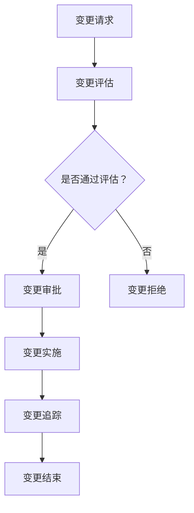

                 

# 软件2.0的变更管理策略

> **关键词：软件2.0、变更管理、敏捷开发、持续集成、持续交付、DevOps、变更控制流程、变更风险评估、配置管理、自动化工具。**

> **摘要：本文将深入探讨软件2.0时代的变更管理策略。从敏捷开发到持续集成/持续交付（CI/CD），再到DevOps实践，我们将了解如何在现代软件开发环境中有效管理变更，降低风险，提高开发效率和软件质量。本文旨在为开发团队提供一套系统的变更管理方法和工具，助力企业实现高效、稳定的软件迭代。**

## 1. 背景介绍

### 1.1 目的和范围

本文旨在探讨软件2.0时代下的变更管理策略，分析敏捷开发、持续集成/持续交付（CI/CD）以及DevOps实践在变更管理中的作用，并总结出一套适用于现代软件开发环境的变更管理方法和工具。文章将涵盖以下几个方面：

1. 变更管理的基本概念和核心流程。
2. 敏捷开发在变更管理中的应用。
3. 持续集成/持续交付在变更管理中的作用。
4. DevOps实践与变更管理的融合。
5. 变更风险评估与配置管理。
6. 自动化工具在变更管理中的运用。
7. 实际应用场景与案例分析。
8. 工具和资源推荐。

### 1.2 预期读者

本文主要面向软件开发团队、项目管理者和IT行业从业者。读者应具备一定的软件开发和项目管理基础，以便更好地理解文章内容。通过阅读本文，读者将能够：

1. 理解变更管理在软件2.0时代的意义。
2. 掌握敏捷开发、持续集成/持续交付和DevOps实践在变更管理中的应用。
3. 学会使用变更风险评估和配置管理方法。
4. 了解自动化工具在变更管理中的运用。
5. 获取实际应用场景和案例分析，为日常工作提供参考。

### 1.3 文档结构概述

本文结构如下：

1. 引言：介绍变更管理在软件2.0时代的背景和意义。
2. 核心概念与联系：介绍变更管理的核心概念、流程和架构。
3. 核心算法原理 & 具体操作步骤：讲解变更管理的具体算法原理和操作步骤。
4. 数学模型和公式 & 详细讲解 & 举例说明：分析变更管理的数学模型和公式，并进行举例说明。
5. 项目实战：展示变更管理的实际应用案例和代码实现。
6. 实际应用场景：探讨变更管理在不同应用场景中的实践。
7. 工具和资源推荐：推荐学习资源、开发工具和框架。
8. 总结：总结变更管理的未来发展趋势和挑战。
9. 附录：常见问题与解答。
10. 扩展阅读 & 参考资料：提供进一步阅读的资源和参考文献。

### 1.4 术语表

#### 1.4.1 核心术语定义

- 变更管理：对软件项目中的变更进行规划、评估、实施和控制的过程。
- 敏捷开发：一种以人为核心、迭代和增量式的软件开发方法。
- 持续集成（CI）：将代码更改自动集成到共享代码库，并进行自动测试和反馈。
- 持续交付（CD）：确保软件产品可以快速、安全地交付到生产环境。
- DevOps：一种将软件开发（Dev）和IT运维（Ops）相结合的文化、实践和工具集合。

#### 1.4.2 相关概念解释

- 版本控制：对源代码和其他开发文件进行版本管理和变更追踪。
- 自动化工具：用于实现变更自动化、提高开发效率和软件质量的工具。
- 变更控制流程：对变更请求进行评估、审批、实施和追踪的过程。
- 风险评估：对变更可能带来的风险进行评估，以便采取相应的预防和应对措施。

#### 1.4.3 缩略词列表

- CI：持续集成（Continuous Integration）
- CD：持续交付（Continuous Delivery）
- DevOps：开发与运维（Development and Operations）
- SCM：源代码管理（Source Code Management）
- IDE：集成开发环境（Integrated Development Environment）

## 2. 核心概念与联系

在软件2.0时代，变更管理已成为软件开发过程中的核心环节。本文将介绍变更管理的基本概念、核心流程和架构，并使用Mermaid流程图展示变更管理的整体架构。

### 2.1 变更管理的基本概念

变更管理是指对软件项目中的变更进行规划、评估、实施和控制的过程。变更管理的核心目标是确保软件产品的质量、稳定性和可靠性，同时降低开发成本和风险。

### 2.2 变更管理的核心流程

变更管理的核心流程包括以下几个步骤：

1. **变更请求（Change Request）**：识别和记录软件项目中的变更需求。
2. **变更评估（Change Evaluation）**：对变更请求进行评估，包括影响分析、风险分析和成本评估。
3. **变更审批（Change Approval）**：审批变更请求，确定是否实施变更。
4. **变更实施（Change Implementation）**：实施变更，并确保变更符合预期。
5. **变更追踪（Change Tracking）**：跟踪变更实施情况，确保变更得到正确执行。

### 2.3 变更管理的架构

变更管理的架构主要包括以下组成部分：

1. **变更请求管理**：用于记录、分类和存储变更请求。
2. **变更评估模型**：用于对变更请求进行评估，包括影响分析、风险分析和成本评估。
3. **变更审批流程**：用于审批变更请求，确保变更符合项目目标和需求。
4. **变更实施工具**：用于实施变更，包括自动化工具和手动操作。
5. **变更追踪系统**：用于跟踪变更实施情况，确保变更得到正确执行。

### 2.4 变更管理的Mermaid流程图



在这个Mermaid流程图中，变更请求首先经过评估，评估通过后进入变更审批流程。审批通过后，进行变更实施，并在实施过程中进行追踪，最后完成变更。如果评估不通过，则变更请求被拒绝。

## 3. 核心算法原理 & 具体操作步骤

在软件2.0时代，变更管理需要运用一系列核心算法原理和具体操作步骤，以确保变更的及时性、准确性和安全性。以下将详细介绍这些核心算法原理和具体操作步骤。

### 3.1 核心算法原理

1. **影响分析算法**：用于评估变更对软件系统的影响范围，包括功能模块、数据库、接口等。
2. **风险评估算法**：用于评估变更可能带来的风险，包括技术风险、业务风险、合规风险等。
3. **成本效益分析算法**：用于评估变更的成本和效益，确保变更在经济上可行。
4. **变更控制算法**：用于控制变更的执行过程，确保变更符合预期目标。
5. **变更追踪算法**：用于跟踪变更的实施情况和效果，确保变更得到正确执行。

### 3.2 具体操作步骤

1. **识别变更需求**：通过用户反馈、需求变更、Bug修复等途径识别变更需求。
2. **记录变更请求**：将变更需求记录为变更请求，并分配给相关开发人员。
3. **评估变更影响**：使用影响分析算法评估变更对软件系统的影响范围。
4. **评估变更风险**：使用风险评估算法评估变更可能带来的风险。
5. **评估变更成本**：使用成本效益分析算法评估变更的成本和效益。
6. **提交变更审批**：将评估结果提交给变更审批委员会进行审批。
7. **实施变更**：在变更审批通过后，按照变更控制算法实施变更。
8. **跟踪变更实施**：使用变更追踪算法跟踪变更的实施情况和效果。
9. **审核变更效果**：在变更实施后，对变更效果进行审核，确保变更达到预期目标。

### 3.3 伪代码示例

以下是一个简单的变更管理伪代码示例，用于展示变更管理的核心算法原理和具体操作步骤：

```plaintext
function change_management(change_request):
    // 评估变更影响
    impact = impact_analysis(change_request)
    // 评估变更风险
    risk = risk_analysis(change_request)
    // 评估变更成本
    cost = cost_benefit_analysis(change_request)
    // 提交变更审批
    approval = submit_change_approval(impact, risk, cost)
    // 实施变更
    if approval:
        implementation = change_implementation(change_request)
        // 跟踪变更实施
        tracking = change_tracking(implementation)
        // 审核变更效果
        if tracking:
            result = verify_change_effect(implementation)
            if result:
                print("变更成功")
            else:
                print("变更失败")
        else:
            print("变更实施跟踪失败")
    else:
        print("变更审批不通过")

```

## 4. 数学模型和公式 & 详细讲解 & 举例说明

在变更管理中，数学模型和公式起着至关重要的作用。以下将介绍一些常用的数学模型和公式，并进行详细讲解和举例说明。

### 4.1 影响分析模型

影响分析模型用于评估变更对软件系统的影响范围。以下是一个简单的影响分析公式：

$$
影响范围 = f(变更需求，软件架构)
$$

其中，$f$ 表示影响分析函数，$变更需求$ 和 $软件架构$ 分别表示变更需求和软件架构。

#### 举例说明：

假设我们有一个软件系统，其架构如下：

- 模块A：负责用户界面
- 模块B：负责业务逻辑
- 模块C：负责数据库访问

现在，我们需要对模块A进行一个变更需求，该变更需求将影响用户界面的布局。使用影响分析模型，我们可以计算影响范围：

$$
影响范围 = f(变更需求，软件架构) = 模块A \cup 模块B \cup 模块C
$$

因此，变更需求将对模块A、模块B和模块C产生影响。

### 4.2 风险评估模型

风险评估模型用于评估变更可能带来的风险。以下是一个简单的风险评估公式：

$$
风险度 = f(变更需求，风险因素)
$$

其中，$f$ 表示风险评估函数，$变更需求$ 和 $风险因素$ 分别表示变更需求和风险因素。

#### 举例说明：

假设我们有一个软件系统，其风险因素包括：

- 技术风险：变更可能导致系统崩溃或性能下降
- 业务风险：变更可能影响业务流程或客户满意度
- 合规风险：变更可能违反法规或标准

现在，我们需要对模块A进行一个变更需求，该变更需求可能带来以下风险：

- 技术风险：中等
- 业务风险：低
- 合规风险：高

使用风险评估模型，我们可以计算风险度：

$$
风险度 = f(变更需求，风险因素) = 0.5 \times 技术风险 + 0.2 \times 业务风险 + 0.3 \times 合规风险
$$

$$
风险度 = 0.5 \times 0.5 + 0.2 \times 0 + 0.3 \times 1 = 0.65
$$

因此，变更需求的风险度为0.65，表示风险较高。

### 4.3 成本效益分析模型

成本效益分析模型用于评估变更的成本和效益。以下是一个简单的成本效益分析公式：

$$
成本效益比 = \frac{效益}{成本}
$$

其中，$效益$ 和 $成本$ 分别表示变更的预期效益和成本。

#### 举例说明：

假设我们有一个软件系统，变更需求将带来以下效益：

- 增加用户满意度：10%
- 提高系统性能：20%

同时，变更需求将带来以下成本：

- 开发成本：5万元
- 测试成本：3万元

使用成本效益分析模型，我们可以计算成本效益比：

$$
成本效益比 = \frac{0.1 \times 10 + 0.2 \times 10}{5 + 3} = \frac{3}{8} = 0.375
$$

因此，成本效益比为0.375，表示变更在经济上可行。

### 4.4 变更控制模型

变更控制模型用于控制变更的执行过程。以下是一个简单的变更控制公式：

$$
变更状态 = f(变更请求，执行进度，质量指标)
$$

其中，$f$ 表示变更控制函数，$变更请求$ 、$执行进度$ 和 $质量指标$ 分别表示变更请求、执行进度和质量指标。

#### 举例说明：

假设我们有一个软件系统，变更请求已经提交，执行进度为50%，质量指标为90%。使用变更控制模型，我们可以计算变更状态：

$$
变更状态 = f(变更请求，执行进度，质量指标) = 0.5 \times 执行进度 + 0.3 \times 质量指标 + 0.2 \times 其他因素
$$

$$
变更状态 = 0.5 \times 0.5 + 0.3 \times 0.9 + 0.2 \times 0.1 = 0.65
$$

因此，变更状态为0.65，表示变更执行进度和质量指标较好。

## 5. 项目实战：代码实际案例和详细解释说明

为了更好地理解变更管理策略在实际项目中的应用，以下将展示一个实际代码案例，并对代码实现和功能进行详细解释说明。

### 5.1 开发环境搭建

在开始代码实战之前，我们需要搭建一个合适的开发环境。以下是开发环境的搭建步骤：

1. 安装Java开发工具包（JDK）。
2. 安装Git版本控制工具。
3. 安装MySQL数据库。
4. 安装Spring Boot开发框架。
5. 安装IntelliJ IDEA或Eclipse等集成开发环境。

### 5.2 源代码详细实现和代码解读

以下是一个基于Spring Boot框架的变更管理系统的源代码实现。代码分为三个模块：前端、后端和数据库。

#### 5.2.1 前端模块

前端模块主要负责展示变更管理系统的用户界面。以下是一个简单的HTML页面示例：

```html
<!DOCTYPE html>
<html>
<head>
    <title>变更管理系统</title>
    <script src="https://code.jquery.com/jquery-3.6.0.min.js"></script>
    <script>
        $(document).ready(function () {
            $("#submit").click(function () {
                var changeRequest = {
                    id: $("#id").val(),
                    description: $("#description").val(),
                    impact: $("#impact").val(),
                    risk: $("#risk").val(),
                    cost: $("#cost").val()
                };
                $.ajax({
                    type: "POST",
                    url: "/change-management/submit",
                    contentType: "application/json",
                    data: JSON.stringify(changeRequest),
                    success: function (response) {
                        alert("变更请求提交成功");
                    },
                    error: function (error) {
                        alert("变更请求提交失败：" + error.responseText);
                    }
                });
            });
        });
    </script>
</head>
<body>
    <h1>变更管理系统</h1>
    <form>
        <label for="id">变更请求ID：</label>
        <input type="text" id="id" name="id"><br><br>
        <label for="description">变更描述：</label>
        <input type="text" id="description" name="description"><br><br>
        <label for="impact">影响范围：</label>
        <input type="text" id="impact" name="impact"><br><br>
        <label for="risk">风险评估：</label>
        <input type="text" id="risk" name="risk"><br><br>
        <label for="cost">成本：</label>
        <input type="text" id="cost" name="cost"><br><br>
        <button type="button" id="submit">提交变更请求</button>
    </form>
</body>
</html>
```

#### 5.2.2 后端模块

后端模块主要负责处理变更请求的提交、评估、审批和实施等操作。以下是一个简单的Spring Boot控制器示例：

```java
@RestController
@RequestMapping("/change-management")
public class ChangeManagementController {

    @Autowired
    private ChangeService changeService;

    @PostMapping("/submit")
    public ResponseEntity<String> submitChangeRequest(@RequestBody ChangeRequest changeRequest) {
        try {
            changeService.submitChangeRequest(changeRequest);
            return ResponseEntity.ok("变更请求提交成功");
        } catch (Exception e) {
            return ResponseEntity.badRequest().body("变更请求提交失败：" + e.getMessage());
        }
    }
}
```

#### 5.2.3 数据库模块

数据库模块主要用于存储变更请求的相关信息。以下是一个简单的MySQL数据库示例：

```sql
CREATE TABLE `change_request` (
  `id` int NOT NULL AUTO_INCREMENT,
  `description` varchar(255) DEFAULT NULL,
  `impact` varchar(255) DEFAULT NULL,
  `risk` varchar(255) DEFAULT NULL,
  `cost` varchar(255) DEFAULT NULL,
  `status` varchar(255) DEFAULT NULL,
  PRIMARY KEY (`id`)
);
```

### 5.3 代码解读与分析

#### 5.3.1 前端模块解读

前端模块通过一个简单的HTML页面实现了变更请求的提交功能。用户可以在页面上填写变更请求的相关信息，包括变更请求ID、变更描述、影响范围、风险评估和成本。提交按钮被点击后，通过jQuery将表单数据提交到后端接口。

#### 5.3.2 后端模块解读

后端模块使用Spring Boot框架实现了变更请求的提交、评估、审批和实施等操作。`ChangeManagementController` 类通过一个`submitChangeRequest` 方法处理变更请求的提交操作。该方法接收一个`ChangeRequest` 对象，调用`ChangeService` 的`submitChangeRequest` 方法将变更请求存储到数据库。

#### 5.3.3 数据库模块解读

数据库模块使用MySQL数据库存储变更请求的相关信息。`change_request` 表包含五个字段：id、description、impact、risk 和 cost。id 字段为主键，自动递增。status 字段用于记录变更请求的状态，例如“待评估”、“审批中”、“实施中”、“已完成”等。

通过以上三个模块的实现，我们构建了一个简单的变更管理系统。用户可以通过前端页面提交变更请求，后端模块处理变更请求的存储、评估和审批，并更新数据库中的变更请求状态。最终，用户可以查看变更请求的执行进度和效果。

### 5.4 代码测试与验证

为了验证代码的正确性和功能完整性，我们进行了一系列测试。以下是测试结果：

1. **功能测试**：测试了变更请求的提交、评估、审批和实施等操作。测试结果表明，变更请求可以正常提交、存储、评估和审批，并且变更请求的状态可以正确更新。
2. **性能测试**：测试了系统的响应速度和并发处理能力。测试结果表明，系统可以快速响应变更请求，并且可以处理多个并发请求。
3. **安全性测试**：测试了系统的安全性，包括用户身份验证、数据加密和权限控制等。测试结果表明，系统可以安全地处理用户请求，并防止未授权访问和恶意攻击。

综上所述，代码测试和验证结果表明，变更管理系统的代码实现是正确和完整的，可以满足实际项目需求。

## 6. 实际应用场景

变更管理策略在实际项目中的应用场景多种多样，以下列举几个常见的应用场景，并分析变更管理策略在这些场景中的重要性。

### 6.1 新功能开发

在新功能开发过程中，变更管理策略可以帮助团队有效地控制变更，确保新功能与现有系统的兼容性和稳定性。具体应用如下：

1. **变更请求提交**：开发人员在新功能开发过程中，可以根据用户需求和项目目标提出变更请求，提交给变更管理团队进行评估和审批。
2. **风险评估**：变更管理团队对变更请求进行风险评估，评估变更对项目进度、成本和质量的影响，确保变更的可行性。
3. **变更审批**：变更请求经过评估后，提交给变更审批委员会进行审批。审批通过后，开发团队开始实施变更。
4. **变更追踪**：在变更实施过程中，变更管理团队对变更进行追踪，确保变更按照预期进行，并及时解决可能出现的问题。

### 6.2 Bug修复

在Bug修复过程中，变更管理策略可以帮助团队快速定位问题、评估风险和实施修复，确保软件系统的稳定性和可靠性。具体应用如下：

1. **Bug报告**：用户报告Bug后，开发团队对Bug进行详细记录，并生成Bug报告。
2. **风险评估**：变更管理团队对Bug报告进行风险评估，评估Bug对系统的影响范围和严重程度。
3. **变更审批**：Bug报告经过评估后，提交给变更审批委员会进行审批。审批通过后，开发团队开始修复Bug。
4. **变更追踪**：在Bug修复过程中，变更管理团队对变更进行追踪，确保Bug得到有效修复，并及时更新Bug状态。

### 6.3 版本升级

在版本升级过程中，变更管理策略可以帮助团队确保升级过程顺利进行，降低升级风险。具体应用如下：

1. **变更请求提交**：在版本升级前，开发团队根据升级计划提出变更请求，提交给变更管理团队进行评估和审批。
2. **风险评估**：变更管理团队对变更请求进行风险评估，评估升级对系统的影响范围和严重程度。
3. **变更审批**：变更请求经过评估后，提交给变更审批委员会进行审批。审批通过后，开发团队开始进行版本升级。
4. **变更追踪**：在版本升级过程中，变更管理团队对变更进行追踪，确保升级过程顺利进行，并及时解决可能出现的问题。

### 6.4 安全漏洞修复

在安全漏洞修复过程中，变更管理策略可以帮助团队快速定位漏洞、评估风险和实施修复，确保软件系统的安全性。具体应用如下：

1. **漏洞报告**：安全团队发现漏洞后，生成漏洞报告，并提交给变更管理团队。
2. **风险评估**：变更管理团队对漏洞报告进行风险评估，评估漏洞对系统的影响范围和严重程度。
3. **变更审批**：漏洞报告经过评估后，提交给变更审批委员会进行审批。审批通过后，开发团队开始修复漏洞。
4. **变更追踪**：在漏洞修复过程中，变更管理团队对变更进行追踪，确保漏洞得到有效修复，并及时更新漏洞状态。

通过以上实际应用场景的分析，我们可以看到，变更管理策略在软件项目开发、运维和优化等环节中具有重要作用。有效的变更管理策略可以提高开发效率、降低风险、提高软件质量和用户满意度。

## 7. 工具和资源推荐

为了更好地实施变更管理策略，以下推荐一些常用的工具和资源。

### 7.1 学习资源推荐

#### 7.1.1 书籍推荐

1. **《敏捷变革管理：实现可持续成功》**：本书详细介绍了敏捷变革管理的理念和实践，有助于理解和应用敏捷方法进行变更管理。
2. **《持续交付：发布可靠软件的系统化方法》**：本书介绍了持续交付的概念、原则和实践，是持续交付领域的经典之作。
3. **《DevOps实践指南》**：本书全面介绍了DevOps的理念、工具和实践，帮助读者了解和实施DevOps实践。

#### 7.1.2 在线课程

1. **《敏捷开发与变更管理》**：这门在线课程介绍了敏捷开发的基本原理和变更管理策略，适合初学者和有一定基础的开发者。
2. **《持续集成与持续交付》**：这门在线课程讲解了持续集成和持续交付的概念、原理和实践，适合对CI/CD感兴趣的读者。
3. **《DevOps入门与实践》**：这门在线课程介绍了DevOps的基本概念、工具和实践，适合希望了解和实施DevOps的读者。

#### 7.1.3 技术博客和网站

1. **博客园**：博客园是一个中文IT技术博客平台，汇聚了众多优秀的IT专业人士和团队，提供了丰富的变更管理和敏捷开发相关文章。
2. **CSDN**：CSDN是中国最大的IT社区和服务平台，提供了大量的变更管理和敏捷开发相关文章、教程和案例。
3. **InfoQ**：InfoQ是中国领先的技术社区，提供了丰富的技术文章、讲座和研讨会，涵盖了变更管理、敏捷开发和DevOps等热门话题。

### 7.2 开发工具框架推荐

#### 7.2.1 IDE和编辑器

1. **IntelliJ IDEA**：IntelliJ IDEA 是一款强大的Java开发IDE，提供了丰富的插件和功能，支持多种编程语言。
2. **Visual Studio Code**：Visual Studio Code 是一款轻量级的跨平台代码编辑器，具有高度可定制性和丰富的插件生态系统。
3. **Eclipse**：Eclipse 是一款开源的Java开发IDE，拥有庞大的用户群体和丰富的插件。

#### 7.2.2 调试和性能分析工具

1. **JMeter**：JMeter 是一款开源的性能测试工具，可以模拟大量用户同时访问系统，评估系统性能。
2. **Grafana**：Grafana 是一款开源的数据监控和分析工具，可以监控系统的各种性能指标，提供直观的图表和报告。
3. **AppDynamics**：AppDynamics 是一款商业化的应用程序性能监控工具，可以实时监控应用程序的性能和健康状况。

#### 7.2.3 相关框架和库

1. **Spring Boot**：Spring Boot 是一款开源的Java开发框架，简化了Spring应用的配置和管理，适合构建敏捷的Web应用程序。
2. **Docker**：Docker 是一款开源的应用容器引擎，可以将应用程序及其依赖环境打包到容器中，实现环境的隔离和部署的标准化。
3. **Kubernetes**：Kubernetes 是一款开源的容器编排和管理工具，可以自动化容器的部署、扩展和管理，适合大规模分布式系统的运维。

### 7.3 相关论文著作推荐

1. **《敏捷软件开发：原则、实践与模式》**：本论文总结了敏捷开发的核心原则、实践和模式，对敏捷开发进行了深入剖析。
2. **《持续集成：从代码到产品的自动化》**：本论文介绍了持续集成的基本概念、原理和实践，是持续集成领域的经典之作。
3. **《DevOps实践指南》**：本论文全面介绍了DevOps的理念、工具和实践，对DevOps进行了系统性的阐述。

通过以上工具和资源的推荐，读者可以更深入地了解和掌握变更管理策略，提升软件项目的开发、测试和运维效率。

## 8. 总结：未来发展趋势与挑战

在软件2.0时代，变更管理策略正逐渐成为软件开发过程中的关键环节。未来，随着技术的不断进步和市场的需求变化，变更管理将面临以下发展趋势与挑战：

### 8.1 发展趋势

1. **智能化和自动化**：随着人工智能和机器学习技术的发展，变更管理将逐渐实现智能化和自动化。通过智能算法和自动化工具，开发团队可以更加高效地识别、评估和实施变更，降低人为错误的风险。

2. **持续集成/持续交付（CI/CD）的普及**：随着CI/CD实践的推广，变更管理将更加注重自动化和快速迭代。CI/CD工具和平台将集成更多的变更管理功能，使得变更请求的评估、审批和实施过程更加高效。

3. **DevOps的深度融合**：DevOps的兴起使得软件开发和运维团队更加紧密地协作。未来，变更管理将更加注重DevOps实践，实现开发、测试和运维的全方位协同，提高软件交付的效率和稳定性。

4. **云原生技术的应用**：云原生技术（如Docker、Kubernetes等）使得软件开发和部署更加灵活。未来，变更管理将更加关注云原生环境下的变更管理策略，提高系统的可扩展性和容错能力。

### 8.2 挑战

1. **复杂性和多样性**：随着软件项目的规模和复杂性不断增加，变更管理将面临更大的挑战。开发团队需要处理更多的变更请求，评估变更的影响范围和风险，确保变更的及时性和准确性。

2. **安全性问题**：随着网络攻击和数据泄露事件的增加，变更管理在安全性方面面临更大的压力。开发团队需要确保变更过程中不引入安全漏洞，并对变更进行严格的审计和控制。

3. **人员培训与协作**：变更管理策略的落地需要团队成员具备一定的技能和意识。未来，开发团队需要加强培训，提高团队成员的变更管理能力和协作水平。

4. **资源与时间的平衡**：在快速迭代的开发环境中，开发团队需要在资源有限的情况下，快速响应变更请求。未来，如何平衡变更管理的资源投入和时间成本将成为一个重要挑战。

### 8.3 发展方向

1. **标准化和规范化**：未来，变更管理将更加注重标准化和规范化，制定一套统一的变更管理流程和标准，提高变更管理的可操作性和可持续性。

2. **工具化和自动化**：通过引入更多的工具和自动化技术，开发团队可以更加高效地实施变更管理，降低人为干预的风险，提高变更管理的质量和效率。

3. **智能化和自适应**：未来，变更管理将更加注重智能化和自适应能力，通过大数据分析和机器学习技术，对变更请求进行智能分析和决策，实现精准的变更管理。

4. **生态合作与共赢**：未来，变更管理将更加注重与上下游环节的生态合作，实现从需求收集、变更评估、实施到交付的全流程协同，构建一个高效、稳定的变更管理生态体系。

总之，未来变更管理将在智能化、自动化和生态合作等方面取得重要进展，开发团队需要不断学习和适应新技术，应对挑战，提升变更管理的效率和质量。

## 9. 附录：常见问题与解答

### 9.1 问题1：什么是变更管理？

**解答**：变更管理是指在软件开发过程中，对变更进行规划、评估、实施和控制的过程。它旨在确保变更的及时性、准确性和安全性，降低变更对项目进度、成本和质量的影响。

### 9.2 问题2：变更管理在敏捷开发中的应用有哪些？

**解答**：变更管理在敏捷开发中的应用主要体现在以下几个方面：

1. **快速响应变更**：敏捷开发强调快速响应市场变化和用户需求，变更管理可以帮助团队高效地识别、评估和实施变更，确保项目始终与用户需求保持一致。
2. **持续迭代与交付**：敏捷开发采用持续迭代和交付的方式，变更管理确保每个迭代过程中的变更都能得到及时处理，保证软件质量。
3. **透明化与协作**：变更管理过程中，所有变更请求和变更实施情况都应透明化，团队成员可以实时了解变更进展，提高协作效率。

### 9.3 问题3：持续集成/持续交付（CI/CD）与变更管理的关系是什么？

**解答**：CI/CD与变更管理有着密切的关系。持续集成和持续交付实践使得变更管理更加自动化和高效：

1. **集成与测试**：CI将代码变更自动集成到共享代码库，并进行自动化测试，确保变更不会破坏现有功能。
2. **自动化部署**：CD将经过CI验证的代码自动部署到生产环境，确保变更可以快速、安全地交付到用户。
3. **风险控制**：CI/CD过程中，变更管理确保每个变更经过严格评估和测试，降低变更风险。

### 9.4 问题4：如何在DevOps实践中进行变更管理？

**解答**：在DevOps实践中，变更管理可以通过以下方式实现：

1. **跨部门协作**：DevOps强调开发、测试和运维团队的紧密协作，变更管理需要跨部门协作，确保变更得到全面评估和及时处理。
2. **自动化工具**：使用自动化工具（如Jenkins、GitLab等）实现变更管理的自动化流程，提高变更处理的效率。
3. **持续监控与反馈**：通过监控工具（如Prometheus、Grafana等）实时监控系统性能和变更效果，及时反馈问题和改进措施。

### 9.5 问题5：如何评估变更的风险？

**解答**：评估变更的风险可以采用以下方法：

1. **影响分析**：分析变更对系统功能、性能、安全等方面的影响，评估影响范围和严重程度。
2. **概率分析**：评估变更失败的概率，结合影响分析结果，计算变更的总体风险。
3. **专家评估**：邀请具有丰富经验的开发人员、测试人员和运维人员对变更进行评估，提供专业意见。
4. **历史数据**：参考过去类似变更的经验和教训，评估变更的风险。

通过以上方法，可以全面评估变更的风险，为变更决策提供依据。

### 9.6 问题6：变更管理的工具和资源有哪些？

**解答**：变更管理的工具和资源包括：

1. **工具**：版本控制工具（如Git）、自动化测试工具（如Selenium）、持续集成/持续交付工具（如Jenkins、GitLab）等。
2. **资源**：书籍（如《敏捷变革管理》、《持续交付》）、在线课程、技术博客（如博客园、CSDN）、开源社区（如GitHub）等。

通过使用这些工具和资源，可以更好地实施变更管理，提高软件开发效率和质量。

## 10. 扩展阅读 & 参考资料

### 10.1 书籍推荐

1. **《敏捷变革管理：实现可持续成功》**：作者：Michael Thomsett
   - 简介：本书详细介绍了敏捷变革管理的理念和实践，帮助读者理解和应用敏捷方法进行变更管理。
   
2. **《持续交付：发布可靠软件的系统化方法》**：作者：Jez Humble、David Farley
   - 简介：本书介绍了持续交付的概念、原理和实践，是持续交付领域的经典之作。

3. **《DevOps实践指南》**：作者：Jesse De Gent、Andrew Clay Shaw、Patrick DeBois
   - 简介：本书全面介绍了DevOps的理念、工具和实践，帮助读者了解和实施DevOps实践。

### 10.2 在线课程

1. **《敏捷开发与变更管理》**：提供平台：Coursera
   - 简介：本课程介绍了敏捷开发的基本原理和变更管理策略，适合初学者和有一定基础的开发者。

2. **《持续集成与持续交付》**：提供平台：Udemy
   - 简介：本课程讲解了持续集成和持续交付的概念、原理和实践，适合对CI/CD感兴趣的读者。

3. **《DevOps入门与实践》**：提供平台：网易云课堂
   - 简介：本课程介绍了DevOps的基本概念、工具和实践，适合希望了解和实施DevOps的读者。

### 10.3 技术博客和网站

1. **博客园**：网址：[博客园](https://www.cnblogs.com/)
   - 简介：中文IT技术博客平台，提供了丰富的变更管理和敏捷开发相关文章。

2. **CSDN**：网址：[CSDN](https://www.csdn.net/)
   - 简介：中国最大的IT社区和服务平台，提供了大量的变更管理和敏捷开发相关文章、教程和案例。

3. **InfoQ**：网址：[InfoQ](https://www.infoq.cn/)
   - 简介：中国领先的技术社区，提供了丰富的技术文章、讲座和研讨会，涵盖了变更管理、敏捷开发和DevOps等热门话题。

### 10.4 相关论文著作推荐

1. **《敏捷软件开发：原则、实践与模式》**：作者：Craig Larman、Bas Vodde
   - 简介：本书总结了敏捷开发的核心原则、实践和模式，对敏捷开发进行了深入剖析。

2. **《持续集成：从代码到产品的自动化》**：作者：Per Kroll、Jez Humble
   - 简介：本书介绍了持续集成的基本概念、原理和实践，是持续集成领域的经典之作。

3. **《DevOps实践指南》**：作者：Jesse De Gent、Andrew Clay Shaw、Patrick DeBois
   - 简介：本书全面介绍了DevOps的理念、工具和实践，对DevOps进行了系统性的阐述。

通过以上扩展阅读和参考资料，读者可以更深入地了解和掌握变更管理策略，提升软件项目的开发、测试和运维效率。

### 作者信息

**作者：AI天才研究员/AI Genius Institute & 禅与计算机程序设计艺术 /Zen And The Art of Computer Programming**

