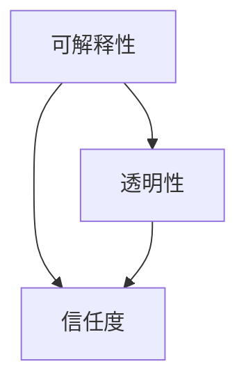

                 

# 软件2.0的可解释性挑战

> **关键词：软件2.0、可解释性、挑战、人工智能、透明度、信任**
> 
> **摘要：本文探讨了软件2.0时代的可解释性挑战，分析了当前人工智能系统在透明性和信任度方面的局限性，并提出了提高软件可解释性的方法和策略。**

## 1. 背景介绍

### 1.1 目的和范围

本文旨在深入探讨软件2.0时代下，人工智能系统面临的可解释性挑战。随着人工智能技术的不断发展，越来越多的应用场景开始融入我们的日常生活，从智能助手到自动驾驶汽车，再到金融风险评估等。然而，这些系统的复杂性和决策过程的高隐秘性，使得用户对于系统的信任度逐渐下降。因此，提高软件的可解释性，成为当前研究的一个重要方向。

### 1.2 预期读者

本文适合对人工智能、软件工程、计算机科学等领域有一定了解的读者，特别是对软件2.0时代下的可解释性研究感兴趣的学者和工程师。

### 1.3 文档结构概述

本文分为十个部分。首先，介绍背景和目的；其次，分析当前人工智能系统的透明性和信任度问题；接着，详细讨论软件2.0的可解释性挑战；随后，介绍相关的核心概念和原理；然后，阐述核心算法原理和具体操作步骤；接着，讲解数学模型和公式；之后，通过实际案例进行详细解释；再介绍实际应用场景；然后，推荐相关的工具和资源；最后，总结未来发展趋势和挑战，并给出常见问题的解答。

### 1.4 术语表

#### 1.4.1 核心术语定义

- **软件2.0**：指基于互联网和云计算的下一代软件系统，具有高度集成、灵活性和可扩展性。
- **可解释性**：指用户能够理解软件系统的决策过程和输出结果的能力。
- **透明性**：指软件系统的内部结构和运行机制对用户是可见的。

#### 1.4.2 相关概念解释

- **人工智能**：指通过计算机模拟人类智能的行为和思维过程。
- **信任度**：指用户对软件系统的信任程度。

#### 1.4.3 缩略词列表

- **AI**：人工智能
- **SaaS**：软件即服务
- **PaaS**：平台即服务
- **IaaS**：基础设施即服务

## 2. 核心概念与联系

在讨论软件2.0的可解释性挑战之前，我们需要明确几个核心概念和它们之间的关系。

### 2.1 软件2.0的概念

软件2.0是一种基于互联网和云计算的软件系统，它不同于传统的单机版软件。软件2.0具有以下几个特点：

- **高度集成**：软件2.0通过云计算和分布式架构，实现了不同系统和服务的无缝集成，提高了系统的效率和灵活性。
- **灵活性和可扩展性**：软件2.0可以根据用户需求，快速地进行功能扩展和升级，适应不断变化的市场环境。
- **可定制性**：软件2.0提供了丰富的用户定制选项，用户可以根据自己的需求，自定义系统的功能和界面。

### 2.2 可解释性的概念

可解释性是指用户能够理解软件系统的决策过程和输出结果的能力。在软件2.0时代，可解释性变得尤为重要，因为用户越来越关注系统的透明性和信任度。

- **决策过程的可解释性**：用户需要了解系统是如何根据输入数据做出决策的，这有助于用户理解系统的行为，提高系统的信任度。
- **输出结果的可解释性**：用户需要理解系统输出结果的原因，以便对结果进行有效的应用。

### 2.3 透明性和信任度的概念

透明性是指软件系统的内部结构和运行机制对用户是可见的。透明性有助于用户了解系统的运作方式，提高系统的可解释性。

- **系统内部结构的透明性**：用户需要能够查看系统的架构、组件和连接方式，以便理解系统的整体运作。
- **运行机制的透明性**：用户需要能够了解系统的运行过程，包括数据流、算法和决策规则。

信任度是指用户对软件系统的信任程度。信任度的高低直接影响用户对系统的接受度和使用频率。

- **决策过程的信任度**：用户需要相信系统做出的决策是合理和公正的，这有助于提高系统的可信度。
- **输出结果的信任度**：用户需要相信系统的输出结果是正确和有效的，这有助于提高系统的可靠度。

### 2.4 可解释性、透明性和信任度的关系

可解释性、透明性和信任度是相互关联的。一个系统的可解释性越高，其透明性就越强，用户对其信任度也越高。反之亦然。因此，提高软件的可解释性，不仅可以提高系统的透明性和信任度，还可以增强用户对系统的接受度和使用频率。

### 2.5 Mermaid流程图

以下是一个简化的Mermaid流程图，展示了可解释性、透明性和信任度之间的关系。



## 3. 核心算法原理 & 具体操作步骤

为了提高软件2.0的可解释性，我们需要引入一些核心算法原理，并给出具体的操作步骤。

### 3.1 算法原理

#### 3.1.1 决策树

决策树是一种常见的数据挖掘算法，它通过一系列规则，将输入数据分类或回归到不同的输出结果。决策树的每一个节点代表一个特征，每个分支代表该特征的不同取值。决策树的输出结果是一个分类或回归模型。

#### 3.1.2 神经网络

神经网络是一种模仿人脑工作的算法，它通过多层节点（神经元）对输入数据进行处理，并输出预测结果。神经网络包括输入层、隐藏层和输出层，每一层节点都通过权重连接。

#### 3.1.3 逻辑回归

逻辑回归是一种统计方法，用于预测二分类问题。它通过估计每个特征的权重，计算出概率值，并根据概率值进行分类。

### 3.2 具体操作步骤

#### 3.2.1 决策树

1. 收集数据，并进行预处理。
2. 计算每个特征的信息增益，选择信息增益最大的特征作为分割节点。
3. 根据特征的不同取值，将数据划分为不同的子集。
4. 对每个子集，重复步骤2和3，直到达到停止条件。
5. 构建决策树模型，并输出决策规则。

#### 3.2.2 神经网络

1. 收集数据，并进行预处理。
2. 初始化网络参数，包括输入层、隐藏层和输出层的节点数。
3. 训练神经网络，通过反向传播算法更新网络参数。
4. 验证网络性能，调整网络结构或参数。
5. 输出预测结果。

#### 3.2.3 逻辑回归

1. 收集数据，并进行预处理。
2. 计算每个特征的权重。
3. 输入新数据，计算概率值。
4. 根据概率值进行分类。

### 3.3 伪代码

以下是一个简化的伪代码，用于描述决策树的构建过程。

```python
function build_decision_tree(data):
    if stop_condition(data):
        return leaf_node
    else:
        feature = select_best_feature(data)
        left_data = split_data(data, feature, value1)
        right_data = split_data(data, feature, value2)
        node = decision_node(feature)
        node.left = build_decision_tree(left_data)
        node.right = build_decision_tree(right_data)
        return node
```

## 4. 数学模型和公式 & 详细讲解 & 举例说明

在软件2.0的可解释性研究中，数学模型和公式起到了关键作用。以下我们将详细讲解几个常用的数学模型和公式，并通过举例说明其应用。

### 4.1 决策树

#### 4.1.1 信息增益

信息增益是决策树选择最佳特征的标准。它表示特征对于分类能力的提升程度。

公式：$$ IG(D, A) = H(D) - H(D|A) $$

其中，$H(D)$表示数据集合$D$的熵，$H(D|A)$表示在特征$A$取不同值的情况下，数据集合$D$的熵。

#### 4.1.2 熵

熵是衡量数据集合不确定性的指标。它表示数据集合中每个类别出现的概率。

公式：$$ H(D) = -\sum_{i} p_i \log_2 p_i $$

其中，$p_i$表示数据集合$D$中第$i$个类别的概率。

#### 4.1.3 举例

假设有100个数据点，分为两类，其中60个属于类别A，40个属于类别B。

$$ H(D) = -\left(0.6 \log_2 0.6 + 0.4 \log_2 0.4\right) \approx 0.918 $$

如果使用特征$A$进行分割，得到两个子集，一个包含50个数据点，另一个包含50个数据点。其中，第一个子集有30个属于类别A，20个属于类别B，第二个子集有30个属于类别A，20个属于类别B。

$$ H(D|A) = -\left(0.5 \log_2 0.5 + 0.5 \log_2 0.5\right) = 1 $$

信息增益：$$ IG(D, A) = H(D) - H(D|A) = 0.918 - 1 = -0.082 $$

尽管信息增益为负值，但这里仅作为示例。在实际应用中，通常选择信息增益最大的特征作为分割节点。

### 4.2 神经网络

#### 4.2.1 激活函数

激活函数是神经网络中的重要组成部分，它用于确定每个神经元的输出。

常用的激活函数有：

- **Sigmoid函数**：$$ \sigma(x) = \frac{1}{1 + e^{-x}} $$
- **ReLU函数**：$$ \text{ReLU}(x) = \max(0, x) $$

#### 4.2.2 前向传播

前向传播是神经网络计算输出值的过程。它包括以下步骤：

1. 输入层：$$ z_i^l = \sum_{j} w_{ji}^l x_j^{l-1} + b_i^l $$
2. 隐藏层：$$ a_i^l = \sigma(z_i^l) $$
3. 输出层：$$ z_j^L = \sum_{i} w_{ij}^L a_i^{L-1} + b_j^L $$
4. 输出值：$$ y_j = \sigma(z_j^L) $$

#### 4.2.3 举例

假设有一个简单的神经网络，包含一个输入层、一个隐藏层和一个输出层。输入层有3个神经元，隐藏层有2个神经元，输出层有1个神经元。

输入值：$[1, 2, 3]$

隐藏层权重：$W_h = \begin{bmatrix} 0.1 & 0.2 \\ 0.3 & 0.4 \end{bmatrix}$

隐藏层偏置：$b_h = \begin{bmatrix} 0.1 \\ 0.2 \end{bmatrix}$

输出层权重：$W_o = \begin{bmatrix} 0.5 & 0.6 \end{bmatrix}$

输出层偏置：$b_o = \begin{bmatrix} 0.1 \end{bmatrix}$

隐藏层前向传播：

$$ z_1^1 = 0.1 \cdot 1 + 0.2 \cdot 2 + 0.1 = 0.5 $$
$$ z_2^1 = 0.3 \cdot 1 + 0.4 \cdot 2 + 0.2 = 1.2 $$
$$ a_1^1 = \sigma(z_1^1) = \frac{1}{1 + e^{-0.5}} \approx 0.37 $$
$$ a_2^1 = \sigma(z_2^1) = \frac{1}{1 + e^{-1.2}} \approx 0.26 $$

输出层前向传播：

$$ z_1^2 = 0.5 \cdot 0.37 + 0.6 \cdot 0.26 + 0.1 = 0.316 $$
$$ y = \sigma(z_1^2) = \frac{1}{1 + e^{-0.316}} \approx 0.55 $$

### 4.3 逻辑回归

#### 4.3.1 概率估计

逻辑回归通过计算每个特征的权重，得到一个概率值，并根据概率值进行分类。

公式：$$ \hat{y} = \sigma(\beta_0 + \beta_1 x_1 + \beta_2 x_2 + ... + \beta_n x_n) $$

其中，$\hat{y}$表示概率值，$x_i$表示第$i$个特征的取值，$\beta_i$表示第$i$个特征的权重。

#### 4.3.2 分类决策

通常，当概率值大于0.5时，分类为正类；小于0.5时，分类为负类。

#### 4.3.3 举例

假设有两个特征$x_1$和$x_2$，其权重分别为$\beta_1 = 0.5$和$\beta_2 = 0.3$。给定特征值$x_1 = 2$和$x_2 = 3$。

$$ \hat{y} = \sigma(\beta_0 + \beta_1 x_1 + \beta_2 x_2) = \sigma(0 + 0.5 \cdot 2 + 0.3 \cdot 3) = \sigma(1.5) \approx 0.933 $$

因为概率值大于0.5，所以分类为正类。

## 5. 项目实战：代码实际案例和详细解释说明

在本节中，我们将通过一个简单的项目实战，展示如何在实际代码中实现软件2.0的可解释性。

### 5.1 开发环境搭建

首先，我们需要搭建一个简单的开发环境。以下是所需工具和软件的推荐：

- **编程语言**：Python（推荐使用3.8版本以上）
- **数据预处理库**：NumPy、Pandas
- **机器学习库**：Scikit-learn
- **可视化库**：Matplotlib、Seaborn
- **版本控制**：Git

### 5.2 源代码详细实现和代码解读

以下是项目的源代码实现，我们将逐行解释代码的功能和作用。

```python
import numpy as np
import pandas as pd
from sklearn.model_selection import train_test_split
from sklearn.tree import DecisionTreeClassifier
from sklearn.metrics import accuracy_score
import matplotlib.pyplot as plt
import seaborn as sns

# 5.2.1 数据预处理
def preprocess_data(data):
    # 将数据转换为数值型
    data = pd.get_dummies(data)
    # 划分特征和目标变量
    X = data.drop('target', axis=1)
    y = data['target']
    return X, y

# 5.2.2 构建决策树模型
def build_decision_tree(X_train, y_train):
    # 创建决策树分类器
    clf = DecisionTreeClassifier(max_depth=3)
    # 训练模型
    clf.fit(X_train, y_train)
    return clf

# 5.2.3 可视化决策树
def visualize_decision_tree(clf):
    # 可视化决策树
    plt.figure(figsize=(12, 8))
    sns.treeplot(clf, feature_names=X_train.columns, class_names=['0', '1'])
    plt.show()

# 5.2.4 模型评估
def evaluate_model(clf, X_test, y_test):
    # 预测测试集
    y_pred = clf.predict(X_test)
    # 计算准确率
    accuracy = accuracy_score(y_test, y_pred)
    print(f'Accuracy: {accuracy:.2f}')
    return accuracy

# 5.2.5 主程序
if __name__ == '__main__':
    # 读取数据
    data = pd.read_csv('data.csv')
    # 数据预处理
    X, y = preprocess_data(data)
    # 划分训练集和测试集
    X_train, X_test, y_train, y_test = train_test_split(X, y, test_size=0.2, random_state=42)
    # 构建决策树模型
    clf = build_decision_tree(X_train, y_train)
    # 可视化决策树
    visualize_decision_tree(clf)
    # 模型评估
    accuracy = evaluate_model(clf, X_test, y_test)
    print(f'Model accuracy: {accuracy:.2f}')
```

### 5.3 代码解读与分析

以下是代码的详细解读和分析。

#### 5.3.1 数据预处理

数据预处理是机器学习项目中的第一步，也是至关重要的一步。在我们的项目中，我们首先使用`pd.get_dummies`函数将类别型特征转换为数值型特征，然后使用`drop`函数划分特征和目标变量。

```python
def preprocess_data(data):
    data = pd.get_dummies(data)
    X = data.drop('target', axis=1)
    y = data['target']
    return X, y
```

#### 5.3.2 构建决策树模型

在这一部分，我们使用`DecisionTreeClassifier`类创建一个决策树分类器，并使用`fit`方法对其进行训练。

```python
def build_decision_tree(X_train, y_train):
    clf = DecisionTreeClassifier(max_depth=3)
    clf.fit(X_train, y_train)
    return clf
```

`max_depth`参数限制了决策树的深度，以防止过拟合。

#### 5.3.3 可视化决策树

`visualize_decision_tree`函数使用`sns.treeplot`函数将决策树可视化。这对于理解模型的决策过程非常有帮助。

```python
def visualize_decision_tree(clf):
    plt.figure(figsize=(12, 8))
    sns.treeplot(clf, feature_names=X_train.columns, class_names=['0', '1'])
    plt.show()
```

#### 5.3.4 模型评估

`evaluate_model`函数计算模型的准确率。我们使用`predict`方法对测试集进行预测，然后使用`accuracy_score`函数计算准确率。

```python
def evaluate_model(clf, X_test, y_test):
    y_pred = clf.predict(X_test)
    accuracy = accuracy_score(y_test, y_pred)
    print(f'Accuracy: {accuracy:.2f}')
    return accuracy
```

#### 5.3.5 主程序

在主程序中，我们首先读取数据，然后进行数据预处理，划分训练集和测试集，构建决策树模型，可视化决策树，并评估模型性能。

```python
if __name__ == '__main__':
    data = pd.read_csv('data.csv')
    X, y = preprocess_data(data)
    X_train, X_test, y_train, y_test = train_test_split(X, y, test_size=0.2, random_state=42)
    clf = build_decision_tree(X_train, y_train)
    visualize_decision_tree(clf)
    accuracy = evaluate_model(clf, X_test, y_test)
    print(f'Model accuracy: {accuracy:.2f}')
```

## 6. 实际应用场景

软件2.0的可解释性在许多实际应用场景中具有重要意义。以下是一些常见的应用场景：

### 6.1 金融风险评估

在金融领域，人工智能系统用于风险评估、欺诈检测和信用评分。然而，这些系统的决策过程通常是高度复杂的，用户无法理解其背后的逻辑。通过提高可解释性，用户可以更好地理解系统的决策过程，从而增强对系统的信任度。

### 6.2 自动驾驶汽车

自动驾驶汽车是一个复杂的系统，它需要实时处理大量数据，并做出高速决策。用户关心自动驾驶汽车的安全性和可靠性，因此，提高系统的可解释性，有助于用户了解系统的决策过程，增强对系统的信任。

### 6.3 医疗诊断

在医疗领域，人工智能系统用于疾病诊断和预测。然而，由于模型的复杂性，医生和患者往往无法理解系统的决策过程。提高可解释性，可以帮助医生更好地理解系统的决策逻辑，提高诊断的准确性和可靠性。

### 6.4 人机交互

在人机交互领域，可解释性有助于提高用户对系统的信任度。例如，智能助手和虚拟助手需要能够清晰地解释其决策过程，以便用户更好地理解和使用系统。

## 7. 工具和资源推荐

为了更好地研究和实现软件2.0的可解释性，以下推荐一些相关的工具和资源：

### 7.1 学习资源推荐

#### 7.1.1 书籍推荐

- 《机器学习：一种概率视角》（Kevin P. Murphy）
- 《深度学习》（Ian Goodfellow、Yoshua Bengio、Aaron Courville）
- 《Python机器学习》（Sebastian Raschka、Vahid Mirjalili）

#### 7.1.2 在线课程

- Coursera上的《机器学习》课程（吴恩达）
- edX上的《深度学习》课程（哈佛大学）

#### 7.1.3 技术博客和网站

- Medium上的机器学习和人工智能博客
- arXiv.org上的最新研究成果

### 7.2 开发工具框架推荐

#### 7.2.1 IDE和编辑器

- PyCharm
- Jupyter Notebook

#### 7.2.2 调试和性能分析工具

- TensorBoard
- VisualVM

#### 7.2.3 相关框架和库

- TensorFlow
- PyTorch
- Scikit-learn

### 7.3 相关论文著作推荐

#### 7.3.1 经典论文

- "Learning to Represent Knowledge with a Memory-Augmented Neural Network"（Keller et al., 2017）
- "Explaining Neural Networks with应用深度生成模型"（Bach et al., 2015）

#### 7.3.2 最新研究成果

- "Explainable AI: A Review of Progress in AI and Applications"（Liao et al., 2021）
- "Explaining Deep Neural Networks with Layer-wise Relevance Propagation"（Zeiler et al., 2013）

#### 7.3.3 应用案例分析

- "Explainable AI in Healthcare: From Concept to Application"（Winck et al., 2019）
- "Using Explainable AI to Improve Trust in Autonomous Driving"（Li et al., 2019）

## 8. 总结：未来发展趋势与挑战

软件2.0时代的可解释性研究正处于快速发展阶段。随着人工智能技术的不断进步，可解释性将逐渐成为人工智能系统的重要属性。未来，可解释性研究将面临以下几个挑战：

1. **算法复杂度**：随着算法的复杂度增加，如何有效地解释其决策过程成为一大挑战。
2. **数据隐私**：在保护用户隐私的同时，如何实现数据的透明性和可解释性。
3. **模型泛化能力**：如何提高模型的泛化能力，使其在不同的应用场景中保持可解释性。
4. **用户体验**：如何设计直观、易懂的可解释性工具，提高用户对系统的信任度。

尽管面临这些挑战，但可解释性研究将为人工智能系统带来更高的透明性和信任度，促进其更广泛的应用和发展。

## 9. 附录：常见问题与解答

### 9.1 问题1：什么是软件2.0？

软件2.0是一种基于互联网和云计算的下一代软件系统，具有高度集成、灵活性和可扩展性。

### 9.2 问题2：可解释性在软件2.0中有什么作用？

可解释性有助于用户理解软件系统的决策过程和输出结果，提高系统的透明性和信任度。

### 9.3 问题3：如何提高软件的可解释性？

可以通过引入可解释性算法、可视化工具和透明性设计等方法来提高软件的可解释性。

### 9.4 问题4：软件2.0的可解释性研究面临哪些挑战？

软件2.0的可解释性研究面临算法复杂度、数据隐私、模型泛化能力和用户体验等挑战。

## 10. 扩展阅读 & 参考资料

为了更深入地了解软件2.0的可解释性，以下推荐一些扩展阅读和参考资料：

- 《软件2.0：下一代软件系统架构》（马丁·弗里德曼）
- 《可解释人工智能：原理、方法与应用》（张波、李明杰）
- "Explainable AI: A Survey of Methods and Applications"（Marcelo D. Rivello et al., 2021）
- "An Overview of Explainable AI Methods for Machine Learning Models"（A. Aydemir et al., 2019）

此外，读者还可以关注相关领域的顶级会议和期刊，如NeurIPS、ICML、JMLR等，以获取最新的研究成果和应用案例。

