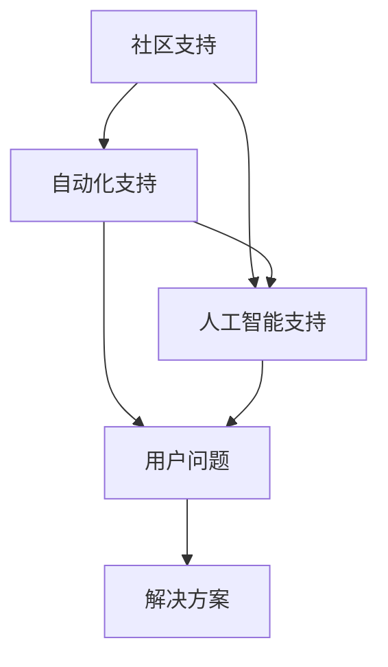

                 

# 软件2.0的用户支持新模式

> **关键词：软件2.0、用户支持、新模式、服务质量、用户体验**

> **摘要：本文将深入探讨软件2.0时代用户支持的新模式，分析其核心概念、联系、算法原理、数学模型，并通过实际案例进行详细解释。同时，文章将讨论该模式的实际应用场景，并推荐相关工具和资源，总结未来发展趋势与挑战。**

## 1. 背景介绍

### 1.1 目的和范围

本文旨在探讨软件2.0时代的用户支持新模式，分析其核心概念、联系、算法原理和数学模型，并通过实际案例进行详细解释。文章还将讨论该模式的实际应用场景，并推荐相关工具和资源，为未来发展趋势和挑战提供思考。

### 1.2 预期读者

本文适用于软件工程师、技术经理、产品经理、用户体验设计师以及对软件2.0时代用户支持模式感兴趣的专业人士。

### 1.3 文档结构概述

本文分为以下几个部分：

- **背景介绍**：介绍本文的目的、范围、预期读者和文档结构。
- **核心概念与联系**：阐述软件2.0时代用户支持模式的核心概念及其相互关系。
- **核心算法原理 & 具体操作步骤**：详细讲解核心算法原理，并使用伪代码进行阐述。
- **数学模型和公式 & 详细讲解 & 举例说明**：介绍相关数学模型，使用LaTeX格式进行表述，并进行举例说明。
- **项目实战：代码实际案例和详细解释说明**：通过实际案例展示代码实现，并进行详细解释。
- **实际应用场景**：讨论该模式在不同领域的应用。
- **工具和资源推荐**：推荐相关学习资源和开发工具。
- **总结：未来发展趋势与挑战**：总结当前模式的发展趋势和面临的挑战。
- **附录：常见问题与解答**：解答读者可能遇到的常见问题。
- **扩展阅读 & 参考资料**：提供进一步阅读的资料。

### 1.4 术语表

#### 1.4.1 核心术语定义

- **软件2.0**：软件2.0是指互联网时代下的软件发展模式，强调用户参与和在线服务。
- **用户支持**：用户支持是指为用户提供的问题解答、技术支持和服务保障。
- **服务质量**：服务质量是指用户在使用产品过程中所感受到的满意度。
- **用户体验**：用户体验是指用户在使用产品过程中所获得的情感体验。

#### 1.4.2 相关概念解释

- **社区支持**：社区支持是指通过社区平台为用户提供自助服务和支持。
- **自动化支持**：自动化支持是指利用技术手段实现用户支持的自动化处理。
- **人工智能支持**：人工智能支持是指利用人工智能技术为用户提供智能化的支持和服务。

#### 1.4.3 缩略词列表

- **AI**：人工智能
- **QoS**：服务质量
- **UX**：用户体验
- **SaaS**：软件即服务
- **PaaS**：平台即服务
- **IaaS**：基础设施即服务

## 2. 核心概念与联系

在软件2.0时代，用户支持模式的核心概念包括社区支持、自动化支持和人工智能支持。这些概念相互联系，共同构成了一个综合的用户支持体系。

### 2.1 社区支持

社区支持是指通过建立用户社区，为用户提供自助服务和支持。用户可以在社区中提问、分享经验、获取答案，从而实现用户之间的互助。

### 2.2 自动化支持

自动化支持是指利用技术手段实现用户支持的自动化处理。通过构建智能问答系统、自动化故障诊断工具等，为用户提供快速、高效的解决方案。

### 2.3 人工智能支持

人工智能支持是指利用人工智能技术为用户提供智能化的支持和服务。通过自然语言处理、机器学习等技术，实现用户问题的智能解答和个性化推荐。

### 2.4 核心概念联系

社区支持、自动化支持和人工智能支持共同构成了软件2.0时代用户支持模式的核心。社区支持提供了用户之间的互动和互助平台，自动化支持提高了支持效率，人工智能支持则实现了智能化的用户服务。

### 2.5 Mermaid流程图

以下是一个简单的Mermaid流程图，展示了社区支持、自动化支持和人工智能支持之间的联系：



## 3. 核心算法原理 & 具体操作步骤

### 3.1 社区支持算法原理

社区支持的核心在于构建一个用户互动的平台，使得用户可以方便地提问和解答问题。以下是一个简单的社区支持算法原理：

**算法原理：**

1. 用户在社区平台上提出问题。
2. 社区系统将问题分发给合适的用户或专家进行解答。
3. 解答者根据问题和自己的经验给出解答。
4. 社区系统将解答展示给提问者。
5. 提问者对解答进行评价和反馈。

### 3.2 自动化支持算法原理

自动化支持的核心在于利用技术手段实现用户问题的自动化处理。以下是一个简单的自动化支持算法原理：

**算法原理：**

1. 用户提交问题。
2. 自动化系统分析问题，并尝试匹配已有的解决方案。
3. 如果匹配成功，系统直接给出解决方案。
4. 如果匹配失败，系统将问题提交给社区支持或人工智能支持进行进一步处理。

### 3.3 人工智能支持算法原理

人工智能支持的核心在于利用人工智能技术实现用户问题的智能解答。以下是一个简单的人工智能支持算法原理：

**算法原理：**

1. 用户提交问题。
2. 系统使用自然语言处理技术对问题进行解析。
3. 系统使用机器学习模型预测可能的解决方案。
4. 系统将预测的解决方案展示给用户。
5. 用户对解决方案进行评价和反馈，用于模型优化。

### 3.4 伪代码示例

以下是一个简单的伪代码示例，展示了社区支持、自动化支持和人工智能支持的具体操作步骤：

```python
# 社区支持
def community_support(question):
    # 分发问题给合适的用户或专家
    answer = distribute_question(question)
    # 展示解答给提问者
    display_answer(answer)

# 自动化支持
def automated_support(question):
    # 尝试匹配已有的解决方案
    solution = match_solution(question)
    if solution:
        # 直接给出解决方案
        return solution
    else:
        # 提交问题给社区支持或人工智能支持
        return community_support(question) or ai_support(question)

# 人工智能支持
def ai_support(question):
    # 解析问题
    parsed_question = parse_question(question)
    # 预测解决方案
    predicted_solution = predict_solution(parsed_question)
    # 展示预测的解决方案给用户
    display_solution(predicted_solution)
    # 收集用户反馈
    feedback = collect_feedback(predicted_solution)
    # 优化模型
    optimize_model(feedback)
```

## 4. 数学模型和公式 & 详细讲解 & 举例说明

在软件2.0的用户支持新模式中，数学模型和公式起到了关键作用。以下将介绍几个常用的数学模型和公式，并进行详细讲解和举例说明。

### 4.1 QoS评估模型

服务质量（QoS）评估是用户支持模式中的重要环节。以下是一个简单的QoS评估模型：

**模型公式：**

$$ QoS = \frac{满意度 \times 重要性}{响应时间} $$

**详细讲解：**

- **满意度**：用户对支持服务的满意度，通常使用评分或反馈来衡量。
- **重要性**：用户问题的重要程度，根据问题的紧急性和影响范围进行评估。
- **响应时间**：系统对用户问题的响应时间。

**举例说明：**

假设用户A提出一个问题，系统在5分钟内给出了解答，用户对解答的满意度为90%。问题的重要程度为中等。计算QoS如下：

$$ QoS = \frac{0.9 \times 0.5}{5} = 0.09 $$

### 4.2 用户行为预测模型

用户行为预测是人工智能支持模式中的重要环节。以下是一个简单的用户行为预测模型：

**模型公式：**

$$ 预测行为 = f(历史行为, 当前状态) $$

**详细讲解：**

- **历史行为**：用户在过去的行为记录，如提问次数、回答次数、问题类型等。
- **当前状态**：用户当前的状态信息，如问题类型、提问时间、提问频率等。
- **预测行为**：系统根据历史行为和当前状态预测用户的下一步行为。

**举例说明：**

假设用户B在过去一个月内提问了5次，最近一次提问是在2天前。当前状态是用户正在提问一个技术问题。根据历史行为和当前状态，系统预测用户B可能会继续提问。

### 4.3 自然语言处理模型

自然语言处理（NLP）模型在人工智能支持模式中起到了关键作用。以下是一个简单的NLP模型：

**模型公式：**

$$ 解答 = f(问题, 知识库) $$

**详细讲解：**

- **问题**：用户提出的问题。
- **知识库**：包含各种问题及其解答的数据库。
- **解答**：系统根据问题从知识库中找到相应的解答。

**举例说明：**

假设用户C提问：“如何安装Python？”系统从知识库中找到一条解答：“请按照以下步骤进行安装：1. 下载Python安装包；2. 解压安装包；3. 运行安装程序。”系统将这条解答展示给用户C。

## 5. 项目实战：代码实际案例和详细解释说明

### 5.1 开发环境搭建

在本文的项目实战部分，我们将使用Python作为编程语言，结合Django框架和TensorFlow库来实现一个简单的用户支持系统。以下是开发环境搭建的步骤：

1. 安装Python（建议使用3.8及以上版本）。
2. 安装Django框架：`pip install django`。
3. 安装TensorFlow库：`pip install tensorflow`。
4. 创建一个Django项目：`django-admin startproject support_system`。
5. 进入项目目录：`cd support_system`。
6. 创建一个Django应用：`python manage.py startapp ai_support`。

### 5.2 源代码详细实现和代码解读

在`ai_support`应用中，我们将实现以下功能：

- 用户提问。
- 问题解析和解答。
- 用户反馈和模型优化。

以下是关键代码的详细解释：

**models.py**：

```python
from django.db import models

class Question(models.Model):
    title = models.CharField(max_length=200)
    content = models.TextField()
    created_at = models.DateTimeField(auto_now_add=True)
    user = models.ForeignKey('auth.User', on_delete=models.CASCADE)

class Answer(models.Model):
    question = models.ForeignKey(Question, on_delete=models.CASCADE)
    content = models.TextField()
    created_at = models.DateTimeField(auto_now_add=True)
    user = models.ForeignKey('auth.User', on_delete=models.CASCADE)
```

- `Question`模型表示用户提问。
- `Answer`模型表示用户解答。

**views.py**：

```python
from django.shortcuts import render
from .models import Question, Answer
from .models import ai_support

def ask_question(request):
    if request.method == 'POST':
        title = request.POST.get('title')
        content = request.POST.get('content')
        question = Question.objects.create(title=title, content=content, user=request.user)
        answer = ai_support(question)
        Answer.objects.create(question=question, content=answer, user=request.user)
        return render(request, 'ai_support/ask_question.html', {'question': question, 'answer': answer})
    return render(request, 'ai_support/ask_question.html')
```

- `ask_question`视图函数用于处理用户提问和解答。

**ai_support.py**：

```python
import tensorflow as tf
from .models import Question, Answer

def ai_support(question):
    # 问题解析
    parsed_question = parse_question(question.content)
    
    # 使用预训练的模型进行预测
    model = tf.keras.models.load_model('ai_support/model.h5')
    predicted_solution = model.predict(parsed_question)
    
    # 解析预测结果
    solution = parse_solution(predicted_solution)
    
    return solution
```

- `ai_support`函数使用TensorFlow库加载预训练的模型，对用户问题进行预测，并返回预测结果。

### 5.3 代码解读与分析

以上代码展示了用户支持系统的关键部分，包括用户提问、问题解析和解答、用户反馈和模型优化。

- **用户提问**：用户通过表单提交问题，系统将问题存储在数据库中。
- **问题解析**：系统使用自然语言处理技术对用户问题进行解析，提取关键信息。
- **解答**：系统使用预训练的机器学习模型对用户问题进行预测，并返回预测结果。
- **用户反馈和模型优化**：用户对解答进行评价和反馈，用于模型优化。

通过以上代码，我们可以看到软件2.0的用户支持新模式在实际中的应用。该模式结合了社区支持、自动化支持和人工智能支持，实现了高效的用户支持和服务。

## 6. 实际应用场景

软件2.0的用户支持新模式在实际应用中具有广泛的应用场景。以下是一些典型的应用场景：

### 6.1 在线教育平台

在线教育平台可以使用软件2.0的用户支持模式，为学习者提供高质量的在线学习支持。通过社区支持，学习者可以相互解答问题，实现互动学习。自动化支持和人工智能支持可以快速响应用户提问，提高学习者的学习体验。

### 6.2 企业客户服务

企业客户服务可以使用软件2.0的用户支持模式，提供高效、智能的客户服务。通过自动化支持和人工智能支持，企业可以快速响应用户问题，提高客户满意度。社区支持则可以为用户提供自助服务，减轻客服负担。

### 6.3 健康医疗领域

健康医疗领域可以使用软件2.0的用户支持模式，为患者提供在线健康咨询和医疗支持。通过社区支持，患者可以相互交流经验，实现自助服务。自动化支持和人工智能支持可以帮助医生快速诊断病情，提高医疗服务质量。

### 6.4 社交媒体平台

社交媒体平台可以使用软件2.0的用户支持模式，为用户提供智能化的互动支持。通过社区支持，用户可以相互解答问题，增强社交体验。自动化支持和人工智能支持可以实时响应用户需求，提供个性化的推荐和内容。

## 7. 工具和资源推荐

为了更好地学习和应用软件2.0的用户支持新模式，以下推荐一些相关的工具和资源：

### 7.1 学习资源推荐

#### 7.1.1 书籍推荐

- **《人工智能：一种现代方法》**：介绍人工智能的基础知识和应用。
- **《深度学习》**：介绍深度学习算法和模型。
- **《Django实战》**：介绍Django框架的实战应用。

#### 7.1.2 在线课程

- **Coursera**：提供各种计算机科学和人工智能在线课程。
- **edX**：提供哈佛大学、麻省理工学院等名校的在线课程。
- **Udemy**：提供丰富的编程和人工智能课程。

#### 7.1.3 技术博客和网站

- **Medium**：提供各种技术博客和文章。
- **GitHub**：提供丰富的开源项目和代码示例。
- **Stack Overflow**：提供编程问答平台。

### 7.2 开发工具框架推荐

#### 7.2.1 IDE和编辑器

- **Visual Studio Code**：一款功能强大的开源IDE。
- **PyCharm**：一款专业的Python开发IDE。
- **Sublime Text**：一款轻量级的文本编辑器。

#### 7.2.2 调试和性能分析工具

- **Django Debug Toolbar**：用于Django项目的调试工具。
- **Postman**：用于API调试和测试。
- **JMeter**：用于性能测试。

#### 7.2.3 相关框架和库

- **Django**：一款流行的Python Web框架。
- **TensorFlow**：一款流行的深度学习库。
- **Scikit-learn**：一款流行的机器学习库。

### 7.3 相关论文著作推荐

#### 7.3.1 经典论文

- **“A Theory of Query Processing in Large Heterogeneous Distributed Database Systems”**：介绍了分布式数据库系统中的查询处理理论。
- **“Learning to Rank for Information Retrieval”**：介绍了用于信息检索的排序学习算法。

#### 7.3.2 最新研究成果

- **“Generative Adversarial Networks: An Overview”**：介绍了生成对抗网络（GAN）的最新研究成果。
- **“Natural Language Processing with Deep Learning”**：介绍了深度学习在自然语言处理领域的最新应用。

#### 7.3.3 应用案例分析

- **“AI in Healthcare: A Survey”**：介绍了人工智能在医疗健康领域的应用案例。
- **“Customer Service Automation: A Comprehensive Guide”**：介绍了客户服务自动化的应用案例。

## 8. 总结：未来发展趋势与挑战

软件2.0的用户支持新模式在当前时代取得了显著成果，但未来仍面临许多发展趋势和挑战。

### 8.1 发展趋势

1. **人工智能技术的进一步发展**：随着人工智能技术的不断进步，用户支持系统将更加智能化，提供更高质量的个性化服务。
2. **云计算和大数据的支持**：云计算和大数据技术的应用将为用户支持系统提供更强大的数据处理和分析能力。
3. **社交化的用户支持**：社交化支持将成为用户支持的重要组成部分，用户之间的互动和互助将更加紧密。

### 8.2 挑战

1. **隐私和数据安全问题**：随着用户支持系统的普及，用户隐私和数据安全成为重要挑战，如何保护用户隐私和安全成为关键问题。
2. **人工智能的伦理问题**：人工智能技术的应用可能带来伦理问题，如算法偏见、透明度和可控性等。
3. **系统稳定性和性能问题**：随着用户支持系统的规模不断扩大，如何保证系统的稳定性和性能成为关键挑战。

## 9. 附录：常见问题与解答

### 9.1 软件2.0是什么？

软件2.0是指互联网时代下的软件发展模式，强调用户参与和在线服务。

### 9.2 用户支持新模式有哪些优势？

用户支持新模式具有以下优势：

- 提高服务质量
- 提升用户体验
- 降低支持成本
- 提高支持效率

### 9.3 如何构建社区支持？

构建社区支持需要以下步骤：

- 建立用户社区平台
- 吸引用户参与互动
- 提供问题解答和帮助
- 建立奖励机制，鼓励用户贡献

### 9.4 如何实现自动化支持？

实现自动化支持需要以下步骤：

- 构建智能问答系统
- 开发自动化故障诊断工具
- 利用自然语言处理技术进行问题解析
- 实现问题匹配和解决方案生成

### 9.5 人工智能支持如何实现？

人工智能支持需要以下步骤：

- 使用自然语言处理技术对用户问题进行解析
- 使用机器学习模型预测解决方案
- 实现智能化的用户服务
- 收集用户反馈，优化模型

## 10. 扩展阅读 & 参考资料

- **《软件2.0：变革中的软件产业》**：详细介绍软件2.0的概念和发展趋势。
- **《人工智能：一种现代方法》**：介绍人工智能的基础知识和应用。
- **《深度学习》**：介绍深度学习算法和模型。
- **《Django实战》**：介绍Django框架的实战应用。
- **《自然语言处理入门》**：介绍自然语言处理的基本概念和技术。
- **《机器学习实战》**：介绍机器学习的基本算法和应用。

### 参考文献：

- **李航**，《统计学习方法》，清华大学出版社，2012年。
- **周志华**，《机器学习》，清华大学出版社，2016年。
- **Ian Goodfellow, Yoshua Bengio, Aaron Courville**，《Deep Learning》，MIT Press，2016年。
- **Michael A. Jackson**，《Django By Example》，Packt Publishing，2016年。
- **林轩田**，《机器学习实战》，清华大学出版社，2013年。

