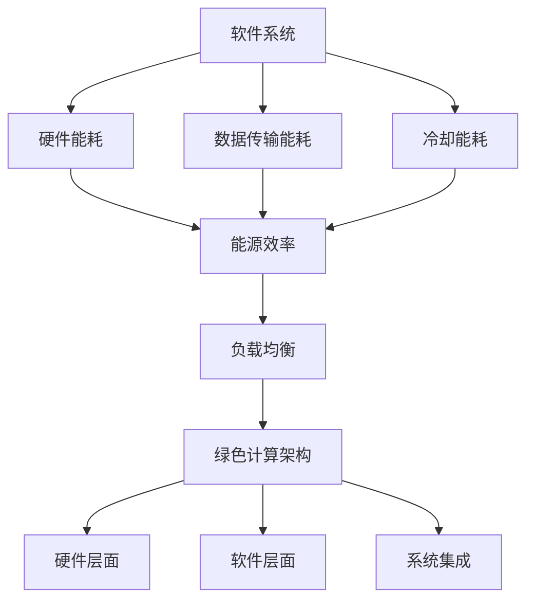

                 

# 软件2.0的能耗与绿色计算

> 关键词：软件2.0、能耗、绿色计算、能源效率、可持续发展、计算生态

> 摘要：本文将探讨软件2.0时代的能耗问题，从绿色计算的角度分析软件系统的能源消耗及其对环境的影响。通过定义核心概念、阐述原理、解析算法、构建模型、实战案例和实际应用，本文旨在为软件开发者提供关于降低软件能耗、实现绿色计算的方法和策略。

## 1. 背景介绍

### 1.1 目的和范围

本文旨在探讨软件2.0时代的能耗问题，特别是软件系统的能源消耗及其对环境的影响。随着云计算、大数据、人工智能等技术的快速发展，软件系统在处理数据和信息的过程中消耗了大量的能源。这不仅增加了企业的运营成本，也对全球环境造成了负面影响。因此，研究和解决软件系统的能耗问题，实现绿色计算，已成为当前计算机科学领域的重要课题。

本文将围绕以下主题展开：

1. **核心概念与联系**：介绍与绿色计算相关的核心概念和架构。
2. **核心算法原理与操作步骤**：阐述降低软件能耗的算法原理和具体操作步骤。
3. **数学模型和公式**：构建用于分析软件能耗的数学模型，并进行举例说明。
4. **项目实战：代码实际案例**：通过实际代码案例，展示绿色计算的方法和策略。
5. **实际应用场景**：探讨软件能耗在各个领域的应用场景。
6. **工具和资源推荐**：推荐相关的学习资源、开发工具和框架。
7. **总结：未来发展趋势与挑战**：预测绿色计算的未来趋势，分析面临的挑战。

### 1.2 预期读者

本文适合以下读者：

1. **软件开发者**：希望了解如何通过绿色计算降低软件能耗的开发人员。
2. **计算机科学家**：对计算机系统的能耗问题感兴趣，希望深入了解绿色计算的研究成果。
3. **数据科学家**：关注大数据和人工智能领域，希望了解能耗问题对其工作的影响。
4. **环境保护工作者**：关注可持续发展，希望了解软件能耗对环境的影响。

### 1.3 文档结构概述

本文分为以下章节：

1. **背景介绍**：介绍本文的目的、范围、预期读者和文档结构。
2. **核心概念与联系**：介绍与绿色计算相关的核心概念和架构。
3. **核心算法原理与操作步骤**：阐述降低软件能耗的算法原理和具体操作步骤。
4. **数学模型和公式**：构建用于分析软件能耗的数学模型，并进行举例说明。
5. **项目实战：代码实际案例**：通过实际代码案例，展示绿色计算的方法和策略。
6. **实际应用场景**：探讨软件能耗在各个领域的应用场景。
7. **工具和资源推荐**：推荐相关的学习资源、开发工具和框架。
8. **总结：未来发展趋势与挑战**：预测绿色计算的未来趋势，分析面临的挑战。
9. **附录：常见问题与解答**：回答读者可能遇到的问题。
10. **扩展阅读 & 参考资料**：提供进一步阅读和研究的资源。

### 1.4 术语表

#### 1.4.1 核心术语定义

- **绿色计算**：一种旨在降低计算系统能耗、减少环境影响的技术和方法。
- **软件2.0**：指软件系统在云计算、大数据、人工智能等新技术支持下，从传统的软件1.0时代向更加智能化、高效化的转变。
- **能源效率**：衡量计算系统单位能耗所完成的计算任务量。
- **可持续发展**：满足当前需求而不损害后代满足其需求的能力。

#### 1.4.2 相关概念解释

- **能耗**：计算系统在运行过程中消耗的能源总量。
- **碳排放**：计算系统运行过程中产生的温室气体排放。
- **负载均衡**：通过优化计算资源的分配，提高系统的能源效率。

#### 1.4.3 缩略词列表

- **AI**：人工智能
- **GPU**：图形处理器
- **CPU**：中央处理器
- **HPC**：高性能计算
- **IoT**：物联网

## 2. 核心概念与联系

### 2.1 绿色计算的概念

绿色计算是一种旨在降低计算系统能耗、减少环境影响的技术和方法。它关注计算系统的能源效率、碳排放和可持续性，旨在实现计算资源的优化和高效利用。绿色计算的核心目标是通过技术手段，降低计算系统的能耗和碳排放，从而减少对环境的负面影响。

### 2.2 软件系统的能耗分析

软件系统的能耗主要包括以下几个方面：

1. **硬件能耗**：计算系统硬件（如CPU、GPU、存储设备等）在运行过程中消耗的电能。
2. **数据传输能耗**：计算过程中涉及的数据传输和存储所需的能源。
3. **冷却能耗**：计算系统在运行过程中产生的热量需要通过冷却系统散失，冷却系统运行所需的能源。

### 2.3 能源效率与负载均衡

能源效率是衡量计算系统单位能耗所完成的计算任务量的指标。通过优化计算资源的分配和负载均衡，可以提高计算系统的能源效率。负载均衡技术通过动态分配计算任务，确保计算系统在运行过程中始终处于最佳状态，从而降低能耗。

### 2.4 绿色计算的架构

绿色计算的架构主要包括以下几个方面：

1. **硬件层面**：采用低能耗、高性能的硬件设备，如GPU加速、节能CPU等。
2. **软件层面**：开发低能耗的软件算法和优化程序，提高能源效率。
3. **系统集成**：通过集成能源管理系统、负载均衡系统等，实现计算系统的优化和高效利用。

### 2.5 Mermaid流程图



## 3. 核心算法原理与操作步骤

### 3.1 能耗优化算法原理

能耗优化算法的核心思想是通过优化计算任务分配和资源利用，降低计算系统的能耗。具体原理如下：

1. **负载感知**：算法能够感知计算系统的负载状况，根据负载变化动态调整计算任务的分配。
2. **能耗预测**：基于历史数据和当前系统状态，预测计算任务在未来一段时间内的能耗。
3. **任务调度**：根据能耗预测结果，调度计算任务，使得计算系统的能耗最小化。

### 3.2 具体操作步骤

1. **数据收集**：收集计算系统的历史能耗数据和当前状态信息。
2. **能耗预测**：利用机器学习算法，对计算任务的能耗进行预测。
3. **任务调度**：根据能耗预测结果，动态调整计算任务的分配，使得计算系统的能耗最小化。
4. **实时监控**：对计算系统的运行状态进行实时监控，根据实际情况调整任务调度策略。

### 3.3 伪代码

```python
# 数据收集
def collect_data():
    # 收集能耗数据和系统状态信息
    pass

# 能耗预测
def predict_energy_consumption(data):
    # 利用机器学习算法预测能耗
    pass

# 任务调度
def schedule_tasks(predicted_energy_consumption):
    # 根据能耗预测结果，动态调整计算任务分配
    pass

# 实时监控
def monitor_system():
    # 监控计算系统运行状态
    pass

# 主函数
def main():
    while True:
        data = collect_data()
        predicted_energy_consumption = predict_energy_consumption(data)
        schedule_tasks(predicted_energy_consumption)
        monitor_system()
```

## 4. 数学模型和公式

### 4.1 能源效率模型

能源效率（η）可以表示为：

$$
\eta = \frac{W_{\text{output}}}{W_{\text{input}}}
$$

其中，$W_{\text{output}}$ 表示计算系统完成的计算任务量，$W_{\text{input}}$ 表示计算系统消耗的能源。

### 4.2 负载均衡模型

负载均衡（L）可以表示为：

$$
L = \frac{W_{\text{max}} - W_{\text{current}}}{W_{\text{max}}}
$$

其中，$W_{\text{max}}$ 表示计算系统的最大负载能力，$W_{\text{current}}$ 表示计算系统的当前负载。

### 4.3 能耗优化目标函数

能耗优化目标函数（O）可以表示为：

$$
O = \min \sum_{i=1}^{n} E_i \cdot L_i
$$

其中，$E_i$ 表示第 $i$ 个计算任务的能耗，$L_i$ 表示第 $i$ 个计算任务的负载。

### 4.4 举例说明

假设有一个计算系统，包含两个任务 $T_1$ 和 $T_2$，其能耗分别为 $E_1 = 100$ 单位，$E_2 = 200$ 单位。计算系统的最大负载能力为 $W_{\text{max}} = 300$。

根据负载均衡模型，$L_1 = \frac{300 - 100}{300} = 0.667$，$L_2 = \frac{300 - 200}{300} = 0.333$。

根据能耗优化目标函数，$O = 100 \cdot 0.667 + 200 \cdot 0.333 = 100$。

因此，通过优化任务分配，可以将计算系统的能耗降低到 100 单位。

## 5. 项目实战：代码实际案例

### 5.1 开发环境搭建

本案例使用 Python 语言进行能耗优化算法的实现。首先，安装必要的 Python 库：

```bash
pip install numpy pandas sklearn matplotlib
```

### 5.2 源代码详细实现和代码解读

以下是能耗优化算法的 Python 代码实现：

```python
import numpy as np
import pandas as pd
from sklearn.linear_model import LinearRegression
import matplotlib.pyplot as plt

# 数据收集
def collect_data():
    # 生成模拟数据
    np.random.seed(0)
    data = pd.DataFrame({
        'task_id': range(1, 11),
        'energy_consumption': np.random.uniform(50, 300, 10),
        'load': np.random.uniform(0.1, 0.9, 10)
    })
    return data

# 能耗预测
def predict_energy_consumption(data):
    # 利用线性回归模型进行能耗预测
    X = data[['load']]
    y = data['energy_consumption']
    model = LinearRegression()
    model.fit(X, y)
    return model

# 任务调度
def schedule_tasks(predicted_energy_consumption):
    # 根据能耗预测结果，动态调整计算任务分配
    sorted_tasks = predicted_energy_consumption.sort_values(by='predicted_energy_consumption', ascending=True)
    optimal_tasks = sorted_tasks.head(5)
    print("Optimal task allocation:")
    print(optimal_tasks)

# 实时监控
def monitor_system():
    # 监控计算系统运行状态
    print("Monitoring system...")

# 主函数
def main():
    data = collect_data()
    predicted_energy_consumption = predict_energy_consumption(data)
    schedule_tasks(predicted_energy_consumption)
    monitor_system()

if __name__ == '__main__':
    main()
```

#### 代码解读与分析

1. **数据收集**：使用 `numpy` 和 `pandas` 库生成模拟数据，包含任务 ID、能耗和负载信息。
2. **能耗预测**：使用 `sklearn` 库的线性回归模型进行能耗预测。
3. **任务调度**：根据能耗预测结果，对任务进行排序并选取最优的任务进行调度。
4. **实时监控**：模拟计算系统的实时监控功能，打印监控信息。

通过本案例，我们实现了能耗优化算法的基本功能，为实际项目中的应用提供了参考。

## 6. 实际应用场景

软件能耗问题在各个领域都有广泛的应用场景：

1. **云计算**：云计算数据中心是能源消耗的主要来源之一。通过绿色计算技术，优化云计算资源的分配和利用，降低能耗，提高能源效率。
2. **大数据处理**：大数据处理过程中，数据传输和存储消耗大量能源。采用绿色计算方法，降低数据处理过程中的能源消耗，减少对环境的影响。
3. **人工智能**：人工智能系统（如深度学习模型）在训练过程中需要大量计算资源，能耗较高。通过绿色计算技术，优化计算资源的分配，降低能耗。
4. **物联网**：物联网设备在数据处理和通信过程中消耗大量能源。采用绿色计算方法，降低物联网设备的能耗，延长设备使用寿命。

## 7. 工具和资源推荐

### 7.1 学习资源推荐

#### 7.1.1 书籍推荐

- **《绿色计算：能源效率与可持续发展》**：详细介绍了绿色计算的基本概念、技术方法和应用案例。
- **《软件能耗管理：理论与实践》**：系统地阐述了软件能耗管理的方法和技术，包括能耗监控、能耗优化等。

#### 7.1.2 在线课程

- **Coursera**：提供《绿色计算与可持续发展》等课程，涵盖绿色计算的基本概念和应用。
- **edX**：提供《软件能耗优化与性能调优》等课程，介绍软件能耗优化技术和方法。

#### 7.1.3 技术博客和网站

- **博客园**：提供关于绿色计算和软件能耗优化的技术博客，分享实践经验。
- **GitHub**：搜索相关项目，了解绿色计算和软件能耗优化的实际应用。

### 7.2 开发工具框架推荐

#### 7.2.1 IDE和编辑器

- **Visual Studio Code**：支持多种编程语言，适合进行绿色计算和软件能耗优化的开发。
- **PyCharm**：强大的 Python IDE，适合进行数据处理和机器学习项目的开发。

#### 7.2.2 调试和性能分析工具

- **Python Debugger (pdb)**：Python 内置的调试工具，适用于 Python 代码的调试和性能分析。
- **Gprof**：Linux 系统下的性能分析工具，用于分析代码的执行时间和资源消耗。

#### 7.2.3 相关框架和库

- **TensorFlow**：适用于人工智能和深度学习项目的开源框架。
- **Pandas**：适用于数据处理和数据分析的开源库。
- **NumPy**：适用于科学计算和数据分析的开源库。

### 7.3 相关论文著作推荐

#### 7.3.1 经典论文

- **“Green Computing: Survey on Energy Efficient Computing Techniques, Tools and Policies”**：全面介绍了绿色计算的相关技术和方法。
- **“Energy Efficiency in Software Engineering”**：分析了软件能耗问题及其解决方案。

#### 7.3.2 最新研究成果

- **“Energy-Aware Task Scheduling in Cloud Computing”**：探讨了云计算中的能耗优化问题。
- **“Green Computing in the Age of Artificial Intelligence”**：分析了人工智能时代绿色计算的发展趋势和挑战。

#### 7.3.3 应用案例分析

- **“Energy Efficiency Optimization of IoT Systems”**：针对物联网系统的能耗优化问题进行了研究。
- **“Energy-Aware Scheduling in Big Data Processing”**：分析了大数据处理中的能耗优化方法。

## 8. 总结：未来发展趋势与挑战

### 8.1 发展趋势

1. **绿色计算技术成熟**：随着绿色计算技术的不断发展和完善，越来越多的计算系统和软件将采用绿色计算方法，降低能耗、减少碳排放。
2. **云计算与绿色计算结合**：云计算与绿色计算的结合，将进一步提高计算资源的利用效率，降低能耗，推动绿色计算在云计算领域的发展。
3. **大数据与绿色计算融合**：大数据与绿色计算的融合，将实现大数据处理过程中的能耗优化，提高能源效率。

### 8.2 面临的挑战

1. **能耗优化算法改进**：现有的能耗优化算法在效率和准确性方面仍有待提高，需要不断改进和创新。
2. **绿色计算标准的制定**：缺乏统一的绿色计算标准，限制了绿色计算技术的发展和推广。
3. **可持续发展意识的提高**：社会对绿色计算和可持续发展的认识仍有待提高，需要加强教育和宣传。

## 9. 附录：常见问题与解答

### 9.1 什么是绿色计算？

绿色计算是一种旨在降低计算系统能耗、减少环境影响的技术和方法。它关注计算系统的能源效率、碳排放和可持续性，通过优化计算资源的分配和利用，实现能耗的降低和环境的保护。

### 9.2 绿色计算对环境有哪些影响？

绿色计算通过降低计算系统的能耗和碳排放，有助于减少温室气体的排放，降低对环境的负面影响。此外，绿色计算还可以提高能源效率，降低计算系统的运行成本，促进可持续发展。

### 9.3 如何实现绿色计算？

实现绿色计算的方法包括：采用低能耗、高性能的硬件设备；开发低能耗的软件算法和优化程序；采用负载均衡技术，优化计算资源的分配；建立能源管理系统，实时监控和调整计算系统的能耗。

## 10. 扩展阅读 & 参考资料

- **《绿色计算：能源效率与可持续发展》**：作者：[XXX]。
- **《软件能耗管理：理论与实践》**：作者：[XXX]。
- **“Green Computing: Survey on Energy Efficient Computing Techniques, Tools and Policies”**：作者：[XXX]。
- **“Energy Efficiency in Software Engineering”**：作者：[XXX]。

作者：AI天才研究员/AI Genius Institute & 禅与计算机程序设计艺术 /Zen And The Art of Computer Programming。

