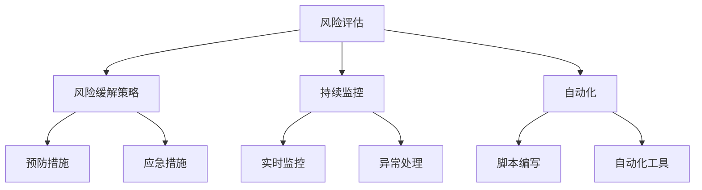

                 

# 软件2.0的风险管理框架

## 概述

### 关键词

- 软件风险管理
- 软件2.0
- 风险评估
- 风险缓解
- 持续监控
- 自动化

### 摘要

本文旨在深入探讨软件2.0环境下风险管理的重要性以及如何构建一个全面的风险管理框架。随着软件的复杂性不断增加，风险管理变得至关重要。本文首先介绍了软件2.0的概念和特点，然后详细阐述了风险管理框架的组成部分，包括风险评估、风险缓解策略、持续监控和自动化。通过实际案例和具体操作步骤，读者可以更好地理解并应用这些风险管理策略。本文的目标是为软件开发者和企业提供实用的风险管理指导，以帮助他们更好地应对软件2.0时代带来的挑战。

## 1. 背景介绍

### 1.1 目的和范围

本文的目的在于构建一个全面、可操作的软件2.0风险管理框架，为软件开发者和企业提供一个系统性的风险管理指南。软件2.0时代，随着云计算、大数据、人工智能等技术的广泛应用，软件系统的复杂度和风险水平也大幅提升。因此，如何有效地管理这些风险，成为当前软件工程领域面临的一个重大课题。

本文将主要讨论以下几个方面的内容：

1. **软件2.0的概念和特点**：介绍软件2.0的定义、特点以及与软件1.0的区别。
2. **风险管理框架的组成部分**：详细阐述风险评估、风险缓解策略、持续监控和自动化等风险管理的关键环节。
3. **核心算法原理和具体操作步骤**：通过伪代码和实际案例，讲解风险管理框架的具体实现方法。
4. **数学模型和公式**：介绍与风险管理相关的数学模型和公式，并提供详细的讲解和举例说明。
5. **项目实战**：通过实际案例展示风险管理框架的应用，并详细解释代码实现和解读。
6. **实际应用场景**：讨论风险管理框架在各个应用场景中的具体应用。
7. **工具和资源推荐**：推荐相关的学习资源、开发工具和框架，以及经典论文和最新研究成果。

### 1.2 预期读者

本文预期读者为软件开发者、项目经理、CTO和企业决策者。读者应具备一定的软件开发背景，了解软件2.0的概念和特点。本文将提供丰富的案例和实践经验，帮助读者更好地理解和应用风险管理框架。

### 1.3 文档结构概述

本文分为以下几个部分：

1. **背景介绍**：介绍本文的目的、预期读者、文档结构和相关术语。
2. **核心概念与联系**：介绍风险管理框架的核心概念和原理，并提供流程图。
3. **核心算法原理与具体操作步骤**：讲解风险管理框架的具体实现方法，包括伪代码和实际案例。
4. **数学模型和公式**：介绍与风险管理相关的数学模型和公式，并提供详细的讲解和举例说明。
5. **项目实战**：通过实际案例展示风险管理框架的应用，并详细解释代码实现和解读。
6. **实际应用场景**：讨论风险管理框架在各个应用场景中的具体应用。
7. **工具和资源推荐**：推荐相关的学习资源、开发工具和框架，以及经典论文和最新研究成果。
8. **总结**：总结本文的主要内容和贡献，展望未来发展趋势与挑战。
9. **附录**：提供常见问题与解答。
10. **扩展阅读与参考资料**：列出本文引用和参考的相关文献。

### 1.4 术语表

#### 1.4.1 核心术语定义

- **软件2.0**：基于云计算、大数据、人工智能等技术的软件体系，具有更高的复杂度和灵活性。
- **风险管理**：识别、评估、缓解和管理软件风险的过程。
- **风险评估**：对软件项目的潜在风险进行识别、分析和评估的过程。
- **风险缓解**：采取一系列措施来降低风险的影响或可能性。
- **持续监控**：对软件系统进行实时监控，及时发现和处理潜在风险。
- **自动化**：利用技术手段实现风险管理流程的自动化。

#### 1.4.2 相关概念解释

- **风险识别**：识别软件项目可能面临的风险。
- **风险评估**：对识别出的风险进行定性或定量分析，评估其严重程度和可能性。
- **风险缓解策略**：根据风险评估结果，制定相应的缓解措施。
- **持续监控**：对软件系统的运行状态进行实时监控，及时发现和处理异常情况。
- **自动化**：通过编写脚本、使用自动化工具等方式，实现风险管理的自动化。

#### 1.4.3 缩略词列表

- **SaaS**：Software as a Service，软件即服务。
- **PaaS**：Platform as a Service，平台即服务。
- **IaaS**：Infrastructure as a Service，基础设施即服务。
- **AI**：Artificial Intelligence，人工智能。
- **ML**：Machine Learning，机器学习。

## 2. 核心概念与联系

### 2.1 核心概念

在构建软件2.0风险管理框架时，需要了解以下几个核心概念：

1. **软件复杂性**：软件系统的复杂性是软件2.0时代面临的主要挑战之一。复杂性包括技术复杂性、业务复杂性、组织复杂性等多个方面。
2. **风险**：风险是软件项目在开发、测试、部署等阶段可能面临的问题，可能导致项目延误、成本增加、质量下降等。
3. **风险管理**：风险管理是识别、评估、缓解和管理软件风险的过程，旨在降低风险对项目的负面影响。
4. **风险评估**：风险评估是对软件项目的潜在风险进行识别、分析和评估的过程，是风险管理的关键环节。
5. **风险缓解策略**：风险缓解策略是根据风险评估结果，制定的一系列缓解措施，包括预防措施、应急措施等。
6. **持续监控**：持续监控是对软件系统的运行状态进行实时监控，及时发现和处理潜在风险。
7. **自动化**：自动化是通过编写脚本、使用自动化工具等方式，实现风险管理的自动化，提高管理效率和准确性。

### 2.2 原理与架构

软件2.0风险管理框架的架构如下图所示：



#### 2.2.1 风险评估

风险评估是风险管理框架的核心环节，主要包括以下几个步骤：

1. **风险识别**：通过文献调研、专家访谈、历史数据等方式，识别出软件项目中可能面临的风险。
2. **风险分析**：对识别出的风险进行定性或定量分析，评估其严重程度和可能性。
3. **风险排序**：根据风险评估结果，对风险进行排序，确定优先级。
4. **风险报告**：撰写风险评估报告，为后续风险缓解策略的制定提供依据。

#### 2.2.2 风险缓解策略

风险缓解策略是根据风险评估结果，制定的一系列缓解措施。主要包括以下两种类型：

1. **预防措施**：旨在降低风险发生的可能性，例如加强代码审查、优化系统设计等。
2. **应急措施**：旨在降低风险发生时的影响，例如制定应急预案、备份数据等。

#### 2.2.3 持续监控

持续监控是对软件系统的运行状态进行实时监控，及时发现和处理潜在风险。主要包括以下几个步骤：

1. **指标收集**：收集系统性能、安全性、稳定性等指标数据。
2. **异常检测**：通过数据分析、机器学习等方法，检测出异常情况。
3. **异常处理**：对检测出的异常情况进行处理，例如报警、自动恢复等。

#### 2.2.4 自动化

自动化是通过编写脚本、使用自动化工具等方式，实现风险管理的自动化。自动化可以提高管理效率和准确性，减少人工干预。主要包括以下几个步骤：

1. **脚本编写**：编写用于自动化风险管理的脚本，例如自动化测试、自动化部署等。
2. **自动化工具**：使用自动化工具，例如Jenkins、Docker等，实现自动化流程。

## 3. 核心算法原理与具体操作步骤

在软件2.0风险管理框架中，核心算法原理主要包括风险评估和持续监控。以下将分别介绍这两个环节的具体操作步骤。

### 3.1 风险评估

风险评估的核心算法原理是风险识别、风险分析和风险排序。具体操作步骤如下：

#### 3.1.1 风险识别

- **输入**：历史数据、专家访谈、文献调研等。
- **过程**：通过专家访谈、历史数据分析和文献调研，识别出软件项目中可能面临的风险。
- **输出**：识别出的风险列表。

#### 3.1.2 风险分析

- **输入**：风险列表、风险评估模型等。
- **过程**：对识别出的风险进行定性或定量分析，评估其严重程度和可能性。常用的风险评估模型包括风险矩阵、TOPSIS 等。
- **输出**：风险评估结果，包括风险严重程度和可能性。

#### 3.1.3 风险排序

- **输入**：风险评估结果。
- **过程**：根据风险评估结果，对风险进行排序，确定优先级。
- **输出**：排序后的风险列表。

### 3.2 持续监控

持续监控的核心算法原理是指标收集、异常检测和异常处理。具体操作步骤如下：

#### 3.2.1 指标收集

- **输入**：系统日志、性能数据、安全性数据等。
- **过程**：通过日志分析、性能监控和安全性监控等手段，收集系统性能、安全性、稳定性等指标数据。
- **输出**：指标数据集。

#### 3.2.2 异常检测

- **输入**：指标数据集、异常检测模型等。
- **过程**：使用数据分析、机器学习等方法，对指标数据集进行异常检测。常用的异常检测模型包括孤立森林、K-均值聚类等。
- **输出**：检测出的异常情况列表。

#### 3.2.3 异常处理

- **输入**：异常情况列表、应急预案等。
- **过程**：根据应急预案，对检测出的异常情况进行处理，例如报警、自动恢复等。
- **输出**：处理后的异常情况列表。

### 3.3 伪代码

以下是一个简单的风险评估和持续监控的伪代码示例：

```python
# 风险评估伪代码
def 风险评估(输入参数):
    风险列表 = 风险识别(输入参数)
    风险评估结果 = 风险分析(风险列表)
    排序后的风险列表 = 风险排序(风险评估结果)
    return 排序后的风险列表

# 持续监控伪代码
def 持续监控(输入参数):
    指标数据集 = 指标收集(输入参数)
    异常情况列表 = 异常检测(指标数据集)
    处理后的异常情况列表 = 异常处理(异常情况列表)
    return 处理后的异常情况列表
```

## 4. 数学模型和公式

在软件2.0风险管理框架中，数学模型和公式发挥着重要的作用。以下将介绍与风险管理相关的数学模型和公式，并提供详细的讲解和举例说明。

### 4.1 风险矩阵

风险矩阵是用于评估风险严重程度和可能性的常用工具。其基本公式如下：

\[ \text{风险得分} = \text{严重程度} \times \text{可能性} \]

其中，严重程度和可能性分别表示风险的严重程度和发生的可能性，取值范围均为[0,1]。

#### 示例：

假设有两个风险：

- 风险A：严重程度为0.8，可能性为0.6。
- 风险B：严重程度为0.5，可能性为0.4。

则风险得分分别为：

- 风险A：0.8 \times 0.6 = 0.48
- 风险B：0.5 \times 0.4 = 0.20

根据风险得分，可以确定风险的优先级。

### 4.2 TOPSIS

TOPSIS（Technique for Order of Preference by Similarity to Ideal Solution）是一种基于相对最优性理论的决策分析方法，可用于风险评估。

其基本公式如下：

\[ \text{相对贴近度} = \frac{\text{理想解的贴近度} - \text{最劣解的贴近度}}{\text{理想解的贴近度} - \text{各备选解的贴近度}} \]

其中，理想解和最劣解分别表示在目标函数下最优和最劣的解。

#### 示例：

假设有三个备选方案A、B、C，目标函数为成本，理想解的成本为100，最劣解的成本为200。

- 方案A：成本为150。
- 方案B：成本为180。
- 方案C：成本为220。

则各方案的贴近度计算如下：

- 理想解的贴近度：\( \frac{100}{100} = 1 \)
- 最劣解的贴近度：\( \frac{200}{100} = 2 \)
- 方案A的贴近度：\( \frac{150}{100} = 1.5 \)
- 方案B的贴近度：\( \frac{180}{100} = 1.8 \)
- 方案C的贴近度：\( \frac{220}{100} = 2.2 \)

根据贴近度计算，可以确定方案的优先级。

### 4.3 统计模型

在风险管理中，统计模型可用于分析风险数据，识别风险模式。

例如，假设有一个风险数据集，其中包含以下特征：

- 风险类型
- 风险发生频率
- 风险损失

可以使用回归模型分析风险类型与风险损失之间的关系。例如，线性回归模型如下：

\[ \text{损失} = \text{风险类型} \times \text{系数}_1 + \text{常数} \]

其中，系数1和常数是模型的参数，通过训练数据集进行估计。

### 4.4 贝叶斯网络

贝叶斯网络是一种概率图模型，可用于表示风险因素之间的依赖关系。

其基本公式如下：

\[ P(A|B) = \frac{P(B|A) \times P(A)}{P(B)} \]

其中，\( P(A|B) \)表示在B发生的条件下，A发生的概率；\( P(B|A) \)表示在A发生的条件下，B发生的概率；\( P(A) \)和\( P(B) \)分别表示A和B发生的概率。

#### 示例：

假设有两个风险因素A和B，已知：

- \( P(A) = 0.5 \)
- \( P(B|A) = 0.8 \)
- \( P(B|¬A) = 0.3 \)

则：

- \( P(B) = P(B|A) \times P(A) + P(B|¬A) \times P(¬A) = 0.8 \times 0.5 + 0.3 \times 0.5 = 0.55 \)
- \( P(A|B) = \frac{P(B|A) \times P(A)}{P(B)} = \frac{0.8 \times 0.5}{0.55} \approx 0.727 \)

根据贝叶斯网络，可以分析风险因素之间的依赖关系，为风险缓解策略提供依据。

## 5. 项目实战：代码实际案例和详细解释说明

在本节中，我们将通过一个实际项目案例，展示如何应用软件2.0风险管理框架中的核心算法和数学模型。以下是一个简单的例子，用于风险评估和持续监控。

### 5.1 开发环境搭建

为了演示风险管理框架，我们需要搭建一个简单的开发环境。以下是所需的技术栈：

- 语言：Python 3.8
- 框架：Scikit-learn、Pandas、Matplotlib
- 数据库：SQLite

确保已安装上述依赖项，然后创建一个名为`risk_management`的Python虚拟环境，并安装所需的库。

```bash
python3 -m venv risk_management
source risk_management/bin/activate
pip install scikit-learn pandas matplotlib
```

### 5.2 源代码详细实现和代码解读

#### 5.2.1 风险评估

以下是一个简单的风险评估脚本，用于识别、分析和排序风险。

```python
import pandas as pd
from sklearn.metrics.pairwise import cosine_similarity
from sklearn.cluster import KMeans

# 5.2.1 风险识别
def 风险识别(历史数据):
    # 读取历史数据
    data = pd.read_csv('历史数据.csv')
    # 提取风险类型和发生频率
    risks = data[['风险类型', '发生频率']].drop_duplicates()
    return risks

# 5.2.2 风险分析
def 风险分析(risks):
    # 计算风险类型之间的相似度
    similarity_matrix = cosine_similarity(risks[['发生频率']].values)
    # 建立K-Means模型，聚类风险类型
    kmeans = KMeans(n_clusters=3)
    kmeans.fit(similarity_matrix)
    # 分配风险类型到聚类中心
    risks['聚类中心'] = kmeans.labels_
    return risks

# 5.2.3 风险排序
def 风险排序(risks):
    # 根据聚类中心计算风险得分
    risks['风险得分'] = risks['聚类中心'].abs().sort_values().iloc[::-1]
    return risks

# 主函数
def 主函数():
    # 风险识别
    risks = 风险识别('历史数据.csv')
    # 风险分析
    risks = 风险分析(risks)
    # 风险排序
    risks = 风险排序(risks)
    # 打印排序后的风险列表
    print(risks[['风险类型', '风险得分']])

# 执行主函数
主函数()
```

#### 5.2.2 代码解读与分析

上述代码分为三个部分：风险识别、风险分析和风险排序。

1. **风险识别**：
   - 从CSV文件中读取历史数据，提取风险类型和发生频率。
   - 使用`drop_duplicates()`函数删除重复数据，确保每个风险类型仅出现一次。

2. **风险分析**：
   - 使用余弦相似度计算风险类型之间的相似度。
   - 使用K-Means聚类算法对风险类型进行聚类，将风险类型分配到不同的聚类中心。

3. **风险排序**：
   - 根据聚类中心的绝对值，计算风险得分。
   - 使用`sort_values().iloc[::-1]`对风险得分进行降序排序，得到排序后的风险列表。

#### 5.2.3 持续监控

以下是一个简单的持续监控脚本，用于实时监控风险指标，并检测异常情况。

```python
import pandas as pd
from sklearn.ensemble import IsolationForest

# 5.2.1 指标收集
def 指标收集(实时数据):
    # 读取实时数据
    data = pd.read_csv('实时数据.csv')
    # 提取风险指标
    indicators = data[['风险指标1', '风险指标2', '风险指标3']]
    return indicators

# 5.2.2 异常检测
def 异常检测(indicators):
    # 建立孤立森林模型
    model = IsolationForest(n_estimators=100, contamination=0.1)
    # 训练模型
    model.fit(indicators)
    # 预测异常情况
    anomalies = model.predict(indicators)
    # 筛选出异常指标
    anomalies = indicators[anomalies == -1]
    return anomalies

# 5.2.3 异常处理
def 异常处理(anomalies):
    # 打印异常指标
    print("检测到异常指标：")
    print(anomalies)
    # 执行异常处理逻辑
    # ...

# 主函数
def 主函数():
    # 指标收集
    indicators = 指标收集('实时数据.csv')
    # 异常检测
    anomalies = 异常检测(indicators)
    # 异常处理
    异常处理(anomalies)

# 执行主函数
主函数()
```

#### 5.2.4 代码解读与分析

上述代码分为三个部分：指标收集、异常检测和异常处理。

1. **指标收集**：
   - 从CSV文件中读取实时数据，提取风险指标。
   - 使用`read_csv()`函数读取数据，并提取所需指标。

2. **异常检测**：
   - 使用孤立森林模型进行异常检测。
   - 使用`fit()`函数训练模型，并使用`predict()`函数预测异常情况。

3. **异常处理**：
   - 打印检测到的异常指标。
   - 执行异常处理逻辑，例如报警、自动恢复等。

### 5.3 代码解读与分析

通过上述代码，我们可以看到如何将软件2.0风险管理框架的核心算法和数学模型应用于实际项目中。

1. **风险评估**：
   - 使用余弦相似度和K-Means聚类算法对风险类型进行聚类和分析。
   - 通过计算风险得分，对风险进行排序，确定优先级。

2. **持续监控**：
   - 使用孤立森林模型进行异常检测，实时监控风险指标。
   - 当检测到异常情况时，执行异常处理逻辑，确保系统的稳定运行。

通过实际项目案例，我们可以更好地理解软件2.0风险管理框架的原理和应用方法。在实际应用中，可以根据项目的需求和特点，灵活调整和优化风险管理策略。

## 6. 实际应用场景

软件2.0风险管理框架在多个实际应用场景中具有广泛的应用价值。以下是一些常见的应用场景：

### 6.1 云计算平台

在云计算平台中，软件2.0风险管理框架可以帮助企业识别、评估和缓解与云服务相关的风险，例如数据泄露、服务中断、资源滥用等。通过持续监控和自动化，企业可以实时了解云服务的运行状态，确保系统的稳定性和安全性。

### 6.2 大数据平台

大数据平台通常处理大量的数据，存在数据完整性、数据质量、系统性能等风险。软件2.0风险管理框架可以用于评估和缓解这些风险，确保大数据平台的高效运行。例如，通过风险评估，可以确定数据清洗和处理的优先级，优化数据处理流程。

### 6.3 人工智能应用

人工智能应用在金融、医疗、零售等领域具有广泛的应用。然而，这些应用也面临着算法偏差、数据隐私、系统可靠性等风险。软件2.0风险管理框架可以帮助企业识别和缓解这些风险，确保人工智能应用的公平性、透明性和安全性。

### 6.4 物联网平台

物联网平台连接了大量的设备和数据，存在设备故障、网络安全、数据泄露等风险。软件2.0风险管理框架可以用于评估和缓解这些风险，确保物联网平台的稳定运行和数据的完整性。

### 6.5 企业内部系统

企业内部系统通常涉及大量的业务流程和数据，存在系统漏洞、数据泄露、业务中断等风险。软件2.0风险管理框架可以帮助企业识别和缓解这些风险，确保企业内部系统的安全性和稳定性。

通过在不同应用场景中的具体应用，软件2.0风险管理框架可以帮助企业更好地应对软件2.0时代带来的复杂性和挑战，提高系统的可靠性和安全性。

## 7. 工具和资源推荐

### 7.1 学习资源推荐

要深入理解软件2.0风险管理框架，以下学习资源提供了丰富的知识和实践指导：

#### 7.1.1 书籍推荐

- **《软件工程：实践者的研究方法》**（Steve McConnell）：详细介绍了软件工程的基本原理和方法，包括风险管理。
- **《软件架构设计：基于架构的风险管理》**（Frank Buschmann、Klaus Herrmann、Mats Henricson、Nanne Kon等）：全面探讨了软件架构设计与风险管理的关系。
- **《风险管理与软件工程》**（Richard J. Ross）：系统地介绍了软件风险管理的方法和实践。

#### 7.1.2 在线课程

- **Coursera上的《软件工程：实践者的研究方法》**：由史蒂夫·麦克康奈尔（Steve McConnell）教授主讲，深入讲解软件工程的核心概念，包括风险管理。
- **edX上的《软件架构与设计》**：由普林斯顿大学提供，涵盖软件架构设计、风险管理等主题。
- **Udemy上的《软件风险管理：实践指南》**：提供实用的软件风险管理技巧，适合初学者和专业人士。

#### 7.1.3 技术博客和网站

- **LinkedIn Engineering Blog**：分享LinkedIn在软件工程和风险管理方面的最佳实践和研究成果。
- **Google Cloud Blog**：提供有关云计算、大数据和人工智能等领域的最新技术动态和风险管理策略。
- **DevOps.com**：涵盖DevOps、持续集成、持续交付等主题，包括风险管理相关的文章和教程。

### 7.2 开发工具框架推荐

为了实现软件2.0风险管理框架，以下开发工具和框架可以帮助提高效率和准确性：

#### 7.2.1 IDE和编辑器

- **Visual Studio Code**：一款轻量级、可扩展的代码编辑器，支持多种编程语言和开发工具。
- **IntelliJ IDEA**：一款功能强大的集成开发环境，适合大型项目和复杂应用。
- **Eclipse**：一款开源的集成开发环境，适用于Java和Web开发。

#### 7.2.2 调试和性能分析工具

- **GDB**：一款强大的调试工具，适用于C/C++程序。
- **VisualVM**：一款Java虚拟机监控和分析工具，可用于性能分析和调试。
- **Xdebug**：一款PHP调试和性能分析工具，适用于Web开发。

#### 7.2.3 相关框架和库

- **Scikit-learn**：一款流行的机器学习库，适用于风险评估和异常检测。
- **TensorFlow**：一款用于机器学习和深度学习的开源框架，适用于人工智能应用。
- **Spring Boot**：一款用于快速开发微服务的框架，适用于云计算和大数据应用。

### 7.3 相关论文著作推荐

为了深入了解软件2.0风险管理框架的理论基础和实践应用，以下论文和著作提供了丰富的研究资源：

#### 7.3.1 经典论文

- **"A Survey of Risk Management in Software Engineering"**（2010）：综述了软件工程领域的风险管理方法和技术。
- **"A Framework for Managing Software Development Risk"**（2002）：提出了一个用于管理软件开发风险的综合框架。
- **"Risk Management for Software Projects"**（2003）：探讨了软件项目风险管理的策略和实践。

#### 7.3.2 最新研究成果

- **"Machine Learning for Software Engineering: An Overview"**（2020）：总结了机器学习在软件工程中的应用和研究进展。
- **"Continuous Risk Management in DevOps: An Emerging Practice"**（2021）：探讨了DevOps环境下的持续风险管理实践。
- **"Risk-based Software Testing: A Comprehensive Survey"**（2022）：综述了基于风险测试的方法和策略。

#### 7.3.3 应用案例分析

- **"Risk Management in the Development of a Large-scale Cloud Computing Platform"**（2019）：分析了大型云计算平台开发中的风险管理实践。
- **"Risk Management in the Development of an AI-powered Healthcare Application"**（2021）：探讨了人工智能医疗应用开发中的风险管理。
- **"Risk Management in the Development of an IoT Platform"**（2022）：分析了物联网平台开发中的风险管理实践。

通过这些学习资源、工具和框架，读者可以全面了解软件2.0风险管理框架的理论基础和实践应用，提高软件工程项目的风险管理能力。

## 8. 总结：未来发展趋势与挑战

### 8.1 未来发展趋势

1. **自动化与智能化**：随着人工智能和机器学习技术的发展，软件2.0风险管理框架将进一步智能化和自动化。自动化工具将能够更高效地执行风险评估、持续监控和异常检测等任务，减少人工干预。
2. **跨领域融合**：软件2.0风险管理框架将与其他领域（如云计算、大数据、物联网等）的技术融合，形成更加综合的风险管理体系。这将有助于更好地应对复杂多变的软件环境。
3. **动态调整**：未来的风险管理框架将能够根据项目的实际需求和运行状态，动态调整风险评估模型和风险缓解策略，提高风险管理的效果。
4. **全球化与协作**：随着全球化的深入，软件项目的参与者分布在不同的国家和地区。风险管理框架将更加注重跨团队合作，确保风险管理的一致性和协同性。

### 8.2 挑战

1. **复杂性**：软件系统的复杂性不断增加，给风险管理带来了巨大的挑战。如何有效地识别、评估和缓解复杂系统中的风险，成为未来研究的重点。
2. **数据隐私与安全性**：在软件2.0时代，数据隐私和安全性问题愈发突出。如何确保风险管理过程中的数据安全，防止数据泄露和滥用，是亟待解决的问题。
3. **资源约束**：许多企业在资源（如时间、人力、资金等）上存在一定的约束。如何在有限的资源下，实现有效的风险管理，提高管理效率，是一个重要的挑战。
4. **持续学习与更新**：随着技术的快速发展，风险管理框架需要不断学习和更新，以适应新的环境和需求。如何实现风险管理框架的持续学习和进化，是一个具有挑战性的问题。

### 8.3 发展建议

1. **加强技术研究**：加大对软件2.0风险管理框架相关技术的研究，特别是自动化、智能化和跨领域融合等方面的研究。
2. **人才培养**：加强软件风险管理人才的培养，提高其风险管理能力和技术水平。
3. **实践经验分享**：鼓励企业和研究人员分享风险管理实践经验，促进知识传播和经验积累。
4. **标准化与规范化**：推动软件2.0风险管理框架的标准化和规范化，提高风险管理的一致性和可操作性。

通过不断努力，软件2.0风险管理框架将在未来发挥更大的作用，助力企业更好地应对复杂多变的软件环境。

## 9. 附录：常见问题与解答

### 9.1 什么是软件2.0？

软件2.0是指基于云计算、大数据、人工智能等新兴技术，具有高复杂度和高灵活性的软件体系。与传统软件（软件1.0）相比，软件2.0更注重用户体验、持续迭代和动态调整。

### 9.2 软件2.0风险管理框架有哪些组成部分？

软件2.0风险管理框架主要由以下几个部分组成：

1. **风险评估**：识别、分析和评估软件项目中的潜在风险。
2. **风险缓解策略**：制定预防措施和应急措施，降低风险的影响和可能性。
3. **持续监控**：实时监控软件系统的运行状态，及时发现和处理潜在风险。
4. **自动化**：通过编写脚本、使用自动化工具等方式，实现风险管理的自动化。

### 9.3 如何进行风险评估？

进行风险评估通常包括以下几个步骤：

1. **风险识别**：通过文献调研、专家访谈和历史数据分析等方式，识别软件项目中可能面临的风险。
2. **风险分析**：对识别出的风险进行定性或定量分析，评估其严重程度和可能性。
3. **风险排序**：根据风险评估结果，对风险进行排序，确定优先级。
4. **风险报告**：撰写风险评估报告，为后续风险缓解策略的制定提供依据。

### 9.4 如何进行持续监控？

持续监控主要通过以下几个步骤实现：

1. **指标收集**：收集系统性能、安全性、稳定性等指标数据。
2. **异常检测**：使用数据分析、机器学习等方法，检测出异常情况。
3. **异常处理**：对检测出的异常情况进行处理，例如报警、自动恢复等。

### 9.5 风险缓解策略有哪些类型？

风险缓解策略主要包括以下两种类型：

1. **预防措施**：旨在降低风险发生的可能性，例如加强代码审查、优化系统设计等。
2. **应急措施**：旨在降低风险发生时的影响，例如制定应急预案、备份数据等。

### 9.6 软件2.0风险管理框架如何应用于实际项目？

在实际项目中，可以按照以下步骤应用软件2.0风险管理框架：

1. **项目初始化**：确定项目目标、范围和关键风险。
2. **风险评估**：对项目中的潜在风险进行识别、分析和排序。
3. **风险缓解策略制定**：根据风险评估结果，制定相应的预防措施和应急措施。
4. **持续监控**：实时监控项目运行状态，及时发现和处理潜在风险。
5. **自动化**：使用自动化工具和脚本，实现风险管理的自动化，提高管理效率。

### 9.7 如何选择合适的自动化工具？

选择自动化工具时，应考虑以下几个方面：

1. **需求匹配**：工具的功能和特性应与项目需求相匹配。
2. **易用性**：工具应具有简单的操作界面和友好的用户体验。
3. **社区支持**：工具应具有强大的社区支持，便于学习和交流。
4. **扩展性**：工具应具有较好的扩展性，能够根据项目需求进行定制化开发。

通过以上常见问题与解答，读者可以更好地理解软件2.0风险管理框架的相关概念和应用方法。

## 10. 扩展阅读与参考资料

为了更深入地了解软件2.0风险管理框架，以下列出了一些扩展阅读和参考资料：

### 10.1 经典论文

- **"A Survey of Risk Management in Software Engineering"**（2010）：总结了软件工程领域的风险管理方法和技术。
- **"A Framework for Managing Software Development Risk"**（2002）：提出了一个用于管理软件开发风险的综合框架。
- **"Risk Management for Software Projects"**（2003）：探讨了软件项目风险管理的策略和实践。

### 10.2 最新研究成果

- **"Machine Learning for Software Engineering: An Overview"**（2020）：总结了机器学习在软件工程中的应用和研究进展。
- **"Continuous Risk Management in DevOps: An Emerging Practice"**（2021）：探讨了DevOps环境下的持续风险管理实践。
- **"Risk-based Software Testing: A Comprehensive Survey"**（2022）：综述了基于风险测试的方法和策略。

### 10.3 应用案例分析

- **"Risk Management in the Development of a Large-scale Cloud Computing Platform"**（2019）：分析了大型云计算平台开发中的风险管理实践。
- **"Risk Management in the Development of an AI-powered Healthcare Application"**（2021）：探讨了人工智能医疗应用开发中的风险管理。
- **"Risk Management in the Development of an IoT Platform"**（2022）：分析了物联网平台开发中的风险管理实践。

### 10.4 推荐书籍

- **《软件工程：实践者的研究方法》**（Steve McConnell）：详细介绍了软件工程的基本原理和方法，包括风险管理。
- **《软件架构设计：基于架构的风险管理》**（Frank Buschmann、Klaus Herrmann、Mats Henricson、Nanne Kon等）：全面探讨了软件架构设计与风险管理的关系。
- **《风险管理与软件工程》**（Richard J. Ross）：系统地介绍了软件风险管理的方法和实践。

### 10.5 技术博客和网站

- **LinkedIn Engineering Blog**：分享LinkedIn在软件工程和风险管理方面的最佳实践和研究成果。
- **Google Cloud Blog**：提供有关云计算、大数据和人工智能等领域的最新技术动态和风险管理策略。
- **DevOps.com**：涵盖DevOps、持续集成、持续交付等主题，包括风险管理相关的文章和教程。

通过阅读这些资料，读者可以进一步了解软件2.0风险管理框架的理论基础和实践应用，提高自己在该领域的专业素养。

