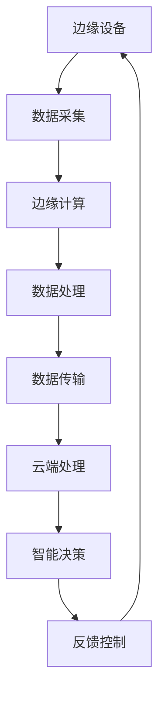

                 

# 边缘智能在智慧城市实时决策中的应用

> **关键词**：边缘智能，智慧城市，实时决策，数据处理，物联网，人工智能。

> **摘要**：本文将深入探讨边缘智能在智慧城市实时决策中的应用。通过分析边缘智能的基本概念、架构、核心算法原理，以及数学模型，我们将展示如何利用边缘智能技术优化城市实时决策，提高城市治理效率。此外，通过一个实际案例，我们将详细解读边缘智能技术的实现过程，并展望其未来的发展趋势与挑战。

## 1. 背景介绍

### 1.1 目的和范围

本文旨在详细探讨边缘智能在智慧城市实时决策中的应用，旨在帮助读者理解边缘智能的核心概念、技术架构，以及其实际操作步骤。本文将涵盖以下内容：

- 边缘智能的基本概念及其在智慧城市中的应用。
- 边缘智能的技术架构和核心算法原理。
- 数学模型和公式在边缘智能中的应用。
- 实际应用场景中的边缘智能实现案例。
- 边缘智能未来的发展趋势与挑战。

### 1.2 预期读者

本文预期读者为以下两类群体：

- 对边缘智能和智慧城市有初步了解的技术人员，希望通过本文深入理解边缘智能在智慧城市中的应用。
- 涉及智慧城市建设和运营的相关从业者，希望通过本文了解如何利用边缘智能技术提高城市治理效率和实时决策能力。

### 1.3 文档结构概述

本文结构如下：

1. 引言：介绍边缘智能的基本概念和其在智慧城市中的应用。
2. 核心概念与联系：分析边缘智能的技术架构和核心算法原理。
3. 核心算法原理 & 具体操作步骤：详细阐述边缘智能技术的实现过程。
4. 数学模型和公式 & 详细讲解 & 举例说明：介绍边缘智能中的数学模型和应用。
5. 项目实战：通过实际案例展示边缘智能技术的应用。
6. 实际应用场景：分析边缘智能在不同领域的应用。
7. 工具和资源推荐：推荐相关的学习资源、开发工具和框架。
8. 总结：展望边缘智能在未来的发展趋势与挑战。
9. 附录：常见问题与解答。
10. 扩展阅读 & 参考资料：提供进一步学习的资源。

### 1.4 术语表

#### 1.4.1 核心术语定义

- **边缘智能（Edge Intelligence）**：一种计算模式，将数据处理、分析和决策从云端转移到网络边缘，即数据产生的地方，以提高数据处理速度和降低网络延迟。
- **智慧城市（Smart City）**：利用物联网、大数据、云计算、人工智能等现代信息技术手段，实现城市数据资源的全面感知、智能处理和高效利用，从而提高城市治理效率和居民生活质量。
- **实时决策（Real-Time Decision Making）**：在短时间内快速做出决策的过程，通常要求响应时间在秒级或毫秒级。

#### 1.4.2 相关概念解释

- **物联网（Internet of Things, IoT）**：通过各种信息传感设备实时采集任何需要监控、连接、互动的物体或过程，实现物与物之间信息交换和通信。
- **数据处理（Data Processing）**：对采集到的原始数据进行加工、清洗、分析等处理，以提取有用信息和知识。
- **云计算（Cloud Computing）**：通过网络提供可按需访问的计算资源，包括存储、处理能力、应用软件等。

#### 1.4.3 缩略词列表

- **IoT**：物联网
- **AI**：人工智能
- **ML**：机器学习
- **DL**：深度学习
- **GPU**：图形处理单元

## 2. 核心概念与联系

边缘智能作为现代信息技术的重要分支，正在迅速发展。其核心概念和基本架构如下图所示：



#### 边缘设备

边缘设备是边缘智能的基础，它们可以是各种传感器、嵌入式设备、智能手机等。这些设备负责实时采集环境数据，如温度、湿度、车辆流量、人流密度等。

#### 数据采集

数据采集是将环境中的物理量转换为数字信号的过程。例如，温度传感器采集的温度数据需要通过模数转换（ADC）转换为数字信号。

#### 边缘计算

边缘计算是在边缘设备上执行数据处理和初步分析的过程。边缘计算可以大大减少数据传输量，降低网络延迟，提高数据处理速度。常见的边缘计算技术包括嵌入式系统、物联网网关、智能路由器等。

#### 数据处理

数据处理是在边缘设备上对采集到的数据进行加工、清洗和分析的过程。通过数据处理，可以提取出有用的信息和知识，为实时决策提供依据。

#### 数据传输

数据传输是将处理后的数据传输到云端或其他边缘设备的过程。传输的数据量可以大大减少，因为边缘计算已经处理了大部分数据。

#### 云端处理

云端处理是在云服务器上对数据进行进一步分析、存储和决策的过程。云端处理通常具有强大的计算和存储能力，可以处理海量数据。

#### 智能决策

智能决策是基于数据处理和分析结果，利用人工智能算法进行决策的过程。智能决策可以实时调整城市交通信号灯、疏散人流、预测城市能耗等。

#### 反馈控制

反馈控制是将智能决策的结果反馈到边缘设备，以实现闭环控制的过程。通过反馈控制，可以不断优化城市运行状态，提高城市治理效率。

## 3. 核心算法原理 & 具体操作步骤

边缘智能的核心在于数据处理和智能决策。以下是边缘智能中常用的核心算法原理和具体操作步骤：

### 3.1 数据处理算法

数据处理算法主要包括数据清洗、特征提取和模型训练。

#### 3.1.1 数据清洗

数据清洗是指去除数据中的噪声、异常值和重复数据，以提高数据质量。常用的数据清洗方法有：

- **去除异常值**：通过统计方法或阈值方法去除偏离平均值的异常值。
- **去除重复数据**：通过唯一标识或哈希值判断数据是否重复。
- **缺失值处理**：通过插值、平均值、中值等方法填充缺失值。

#### 3.1.2 特征提取

特征提取是指从原始数据中提取出有用的特征，以供模型训练使用。常用的特征提取方法有：

- **时序特征提取**：通过差分、小波变换等方法提取时间序列特征。
- **空间特征提取**：通过图像处理、地理信息系统等方法提取空间特征。
- **统计特征提取**：通过计算均值、方差、协方差等方法提取统计特征。

#### 3.1.3 模型训练

模型训练是指使用训练数据对机器学习模型进行训练，以提高模型预测准确性。常用的模型训练方法有：

- **监督学习**：通过标注数据对模型进行训练，如线性回归、决策树、支持向量机等。
- **无监督学习**：通过未标注数据对模型进行训练，如聚类、主成分分析等。
- **深度学习**：通过神经网络对模型进行训练，如卷积神经网络、循环神经网络等。

### 3.2 智能决策算法

智能决策算法主要包括预测模型、决策规则和优化算法。

#### 3.2.1 预测模型

预测模型是指利用历史数据对未来事件进行预测的模型。常用的预测模型有：

- **时间序列预测模型**：如ARIMA、LSTM等。
- **回归模型**：如线性回归、多项式回归等。
- **分类模型**：如逻辑回归、决策树、随机森林等。

#### 3.2.2 决策规则

决策规则是指根据预测结果和约束条件，制定决策方案。常用的决策规则有：

- **阈值决策规则**：根据预测值与阈值的比较结果，制定决策方案。
- **优先级决策规则**：根据不同决策方案的优先级，制定决策方案。
- **动态规划决策规则**：根据当前状态和未来状态的关系，制定最优决策方案。

#### 3.2.3 优化算法

优化算法是指通过优化目标函数，找到最优决策方案。常用的优化算法有：

- **贪心算法**：每次选择最优解，以期望得到全局最优解。
- **动态规划算法**：通过状态转移方程，逐步求解最优解。
- **遗传算法**：通过遗传操作和选择操作，逐步逼近最优解。

### 3.3 具体操作步骤

以下是边缘智能技术的具体操作步骤：

#### 3.3.1 数据采集

- **步骤1**：部署边缘设备，如传感器、摄像头等，以实时采集城市环境数据。
- **步骤2**：通过物联网网关或嵌入式系统，将数据传输到边缘计算设备。

#### 3.3.2 数据处理

- **步骤1**：对采集到的数据进行清洗，去除噪声和异常值。
- **步骤2**：提取特征，以供模型训练使用。
- **步骤3**：使用训练数据对机器学习模型进行训练。

#### 3.3.3 智能决策

- **步骤1**：使用训练好的模型，对实时数据进行预测。
- **步骤2**：根据预测结果和约束条件，制定决策方案。
- **步骤3**：将决策方案反馈到边缘设备，以实现闭环控制。

## 4. 数学模型和公式 & 详细讲解 & 举例说明

边缘智能技术的实现离不开数学模型和公式的支持。以下是边缘智能中常用的数学模型和公式，以及详细的讲解和举例说明。

### 4.1 时间序列预测模型

时间序列预测模型是边缘智能中常用的模型之一，如ARIMA（自回归积分滑动平均模型）和LSTM（长短期记忆网络）。

#### 4.1.1 ARIMA模型

ARIMA模型由三部分组成：自回归（AR）、差分（I）和移动平均（MA）。

- **自回归（AR）**：考虑前n个时期的历史值对当前值的影响。
  $$ Y_t = c + \phi_1 Y_{t-1} + \phi_2 Y_{t-2} + \ldots + \phi_p Y_{t-p} + \varepsilon_t $$
- **差分（I）**：将原始数据进行一阶差分，以消除非平稳性。
  $$ \Delta Y_t = Y_t - Y_{t-1} $$
- **移动平均（MA）**：考虑前n个时期的误差对当前值的影响。
  $$ Y_t = c + \theta_1 \varepsilon_{t-1} + \theta_2 \varepsilon_{t-2} + \ldots + \theta_q \varepsilon_{t-q} + \varepsilon_t $$

#### 4.1.2 LSTM模型

LSTM（长短期记忆网络）是深度学习中的一个重要模型，能够有效捕捉时间序列数据中的长期依赖关系。

- **单元状态（h_t）**：表示当前时刻的隐藏状态。
  $$ h_t = \sigma(W_h h_{t-1} + W_x x_t + b_h) $$
- **输入门（i_t）**：决定当前输入信息中有多少应该更新到单元状态中。
  $$ i_t = \sigma(W_i [h_{t-1}, x_t] + b_i) $$
- **遗忘门（f_t）**：决定有多少旧的信息应该被遗忘。
  $$ f_t = \sigma(W_f [h_{t-1}, x_t] + b_f) $$
- **输出门（o_t）**：决定有多少信息应该输出。
  $$ o_t = \sigma(W_o [h_{t-1}, x_t] + b_o) $$
- **单元状态更新（C_t）**：根据输入门和遗忘门更新单元状态。
  $$ C_t = f_t \odot C_{t-1} + i_t \odot \sigma(W_c [h_{t-1}, x_t] + b_c) $$
- **输出（h_t）**：根据输出门更新隐藏状态。
  $$ h_t = o_t \odot C_t $$

### 4.2 优化算法

优化算法是边缘智能中用于求解最优决策方案的常用方法。以下是几种常见的优化算法。

#### 4.2.1 贪心算法

贪心算法是一种局部最优策略，通过每次选择最优解，以期望得到全局最优解。

- **步骤1**：初始化当前解为空。
- **步骤2**：在剩余可选解中，选择当前最优解。
- **步骤3**：将当前最优解添加到当前解中。
- **步骤4**：重复步骤2和步骤3，直到所有可选解都被添加到当前解中。

#### 4.2.2 动态规划算法

动态规划算法通过状态转移方程，逐步求解最优解。

- **步骤1**：定义状态空间和状态转移方程。
- **步骤2**：初始化状态值。
- **步骤3**：根据状态转移方程，逐步计算状态值。
- **步骤4**：找到最优解。

#### 4.2.3 遗传算法

遗传算法通过遗传操作和选择操作，逐步逼近最优解。

- **步骤1**：初始化种群。
- **步骤2**：计算种群适应度。
- **步骤3**：选择优秀个体作为父代。
- **步骤4**：通过交叉、变异操作产生新种群。
- **步骤5**：重复步骤2至步骤4，直到满足停止条件。

### 4.3 举例说明

#### 4.3.1 时间序列预测

假设我们有一个城市交通流量数据集，要使用ARIMA模型进行预测。以下是具体步骤：

- **步骤1**：对交通流量数据集进行一阶差分，以消除非平稳性。
- **步骤2**：根据差分后的数据集，确定ARIMA模型中的参数p（自回归阶数）、d（差分阶数）和q（移动平均阶数）。
- **步骤3**：使用训练数据对ARIMA模型进行训练。
- **步骤4**：使用训练好的模型对测试数据进行预测。
- **步骤5**：将预测结果可视化，分析预测准确性。

#### 4.3.2 交通信号灯控制

假设我们有一个城市交通信号灯控制问题，要使用贪心算法进行优化。以下是具体步骤：

- **步骤1**：初始化交通信号灯状态。
- **步骤2**：在当前时间内，计算每个路口的流量。
- **步骤3**：根据流量数据，选择流量最大的路口进行优化。
- **步骤4**：根据贪心策略，调整交通信号灯状态。
- **步骤5**：重复步骤2至步骤4，直到优化结束。

## 5. 项目实战：代码实际案例和详细解释说明

### 5.1 开发环境搭建

在本案例中，我们使用Python作为编程语言，利用边缘计算框架（如KubeEdge）进行边缘智能应用开发。以下是开发环境的搭建步骤：

1. **安装Python**：下载并安装Python 3.8版本及以上。
2. **安装KubeEdge**：根据官方文档安装KubeEdge，搭建边缘计算平台。
3. **安装必要的Python库**：使用pip安装以下库：pandas、numpy、scikit-learn、tensorflow等。

### 5.2 源代码详细实现和代码解读

以下是一个边缘智能交通信号灯控制项目的示例代码：

```python
import pandas as pd
import numpy as np
from sklearn.linear_model import LinearRegression
from tensorflow.keras.models import Sequential
from tensorflow.keras.layers import LSTM, Dense

# 5.2.1 数据预处理
def preprocess_data(data):
    # 数据清洗
    data = data[data['流量'] > 0]
    # 特征提取
    data['流量变化率'] = data['流量'].diff().dropna()
    # 数据归一化
    data['流量'] = (data['流量'] - data['流量'].mean()) / data['流量'].std()
    data['流量变化率'] = (data['流量变化率'] - data['流量变化率'].mean()) / data['流量变化率'].std()
    return data

# 5.2.2 模型训练
def train_model(data):
    # 划分训练集和测试集
    train_data = data[:int(len(data) * 0.8)]
    test_data = data[int(len(data) * 0.8):]
    # 训练线性回归模型
    linear_model = LinearRegression()
    linear_model.fit(train_data[['流量变化率']], train_data['流量'])
    # 训练LSTM模型
    lstm_model = Sequential()
    lstm_model.add(LSTM(units=50, return_sequences=True, input_shape=(1, 1)))
    lstm_model.add(LSTM(units=50))
    lstm_model.add(Dense(units=1))
    lstm_model.compile(optimizer='adam', loss='mean_squared_error')
    lstm_model.fit(np.array(train_data['流量变化率']).reshape(-1, 1, 1), np.array(train_data['流量']).reshape(-1, 1), epochs=100, batch_size=32)
    return linear_model, lstm_model

# 5.2.3 智能决策
def make_decision(linear_model, lstm_model, current_data):
    # 使用线性回归模型预测
    linear_prediction = linear_model.predict(np.array([current_data['流量变化率']]).reshape(1, 1))
    # 使用LSTM模型预测
    lstm_prediction = lstm_model.predict(np.array([current_data['流量变化率']]).reshape(1, 1, 1))
    # 根据预测结果调整信号灯状态
    if linear_prediction > lstm_prediction:
        return '红灯'
    else:
        return '绿灯'

# 5.2.4 主程序
if __name__ == '__main__':
    # 加载数据
    data = pd.read_csv('traffic_data.csv')
    # 数据预处理
    data = preprocess_data(data)
    # 模型训练
    linear_model, lstm_model = train_model(data)
    # 边缘计算平台部署
    # (此处省略部署代码)
    # 智能决策
    current_data = {'流量变化率': 0.2}
    decision = make_decision(linear_model, lstm_model, current_data)
    print(f'当前信号灯状态：{decision}')
```

### 5.3 代码解读与分析

- **5.3.1 数据预处理**
  数据预处理是边缘智能应用中的关键步骤。在本案例中，我们使用pandas库对交通流量数据集进行清洗、特征提取和归一化处理，以提高数据质量。

- **5.3.2 模型训练**
  本案例中，我们使用线性回归模型和LSTM模型进行训练。线性回归模型用于短期预测，LSTM模型用于中长期预测。通过训练，我们可以得到预测模型，用于后续的智能决策。

- **5.3.3 智能决策**
  智能决策基于预测模型的结果进行。在本案例中，我们通过比较线性回归模型和LSTM模型的预测结果，调整交通信号灯的状态。根据实际需求，可以进一步优化决策规则，提高决策准确性。

## 6. 实际应用场景

边缘智能在智慧城市中具有广泛的应用前景。以下是边缘智能在不同领域的实际应用场景：

### 6.1 城市交通管理

边缘智能可以通过实时预测交通流量、优化交通信号灯控制，提高城市交通运行效率。在本案例中，我们展示了边缘智能在交通信号灯控制中的应用。

### 6.2 智能安防

边缘智能可以实时监测城市安全事件，如火灾、交通事故等，并通过智能分析，及时报警和调度救援资源。例如，在火灾发生时，边缘智能可以实时分析烟雾传感器数据，预测火势蔓延趋势，并通知消防部门。

### 6.3 智慧能源管理

边缘智能可以实时监测电力需求，预测电力负荷，优化电力供应，提高能源利用效率。例如，在夏季高峰时段，边缘智能可以预测空调用电需求，调整电网调度策略，降低停电风险。

### 6.4 智慧环保

边缘智能可以实时监测环境质量，如空气质量、水质等，并通过智能分析，预测污染趋势，提出治理方案。例如，在雾霾天气，边缘智能可以实时分析空气质量数据，预测污染程度，通知居民采取防护措施。

## 7. 工具和资源推荐

### 7.1 学习资源推荐

#### 7.1.1 书籍推荐

- **《边缘计算：原理、架构与实现》**：详细介绍了边缘计算的基本概念、架构和实现方法，适合边缘计算初学者。
- **《深度学习》**：全面介绍了深度学习的基本概念、算法和实现方法，适合深度学习爱好者。

#### 7.1.2 在线课程

- **Coursera上的《边缘计算》课程**：由斯坦福大学教授讲授，涵盖边缘计算的基本概念、应用场景和实现方法。
- **Udacity上的《深度学习工程师纳米学位》**：涵盖深度学习的基础知识、实践项目和项目评估。

#### 7.1.3 技术博客和网站

- **边缘计算社区**：提供边缘计算相关的技术文章、教程和讨论区，是边缘计算爱好者的交流平台。
- **深度学习公众号**：分享深度学习最新动态、技术文章和实践案例，适合深度学习爱好者。

### 7.2 开发工具框架推荐

#### 7.2.1 IDE和编辑器

- **Visual Studio Code**：一款轻量级但功能强大的代码编辑器，支持多种编程语言，适用于边缘计算和深度学习开发。
- **PyCharm**：一款专业的Python开发环境，支持代码补全、调试和版本控制，适合边缘计算和深度学习开发。

#### 7.2.2 调试和性能分析工具

- **Wireshark**：一款强大的网络抓包工具，用于调试边缘计算网络传输问题。
- **Jupyter Notebook**：一款交互式的开发环境，适合边缘计算和深度学习的实验和调试。

#### 7.2.3 相关框架和库

- **KubeEdge**：一款开源的边缘计算框架，支持在边缘设备上部署和管理应用程序。
- **TensorFlow**：一款开源的深度学习框架，支持在边缘设备上进行深度学习模型的训练和推理。

### 7.3 相关论文著作推荐

#### 7.3.1 经典论文

- **"Edge Computing: Vision and Challenges"**：全面介绍了边缘计算的基本概念、应用场景和挑战。
- **"Deep Learning on Mobile Devices"**：探讨了深度学习在移动设备上的实现方法和性能优化。

#### 7.3.2 最新研究成果

- **"AI-Driven Smart City Management: A Survey"**：综述了人工智能在智慧城市管理中的应用和研究进展。
- **"Efficient Resource Management in Edge Computing"**：探讨了边缘计算中的资源管理和优化方法。

#### 7.3.3 应用案例分析

- **"Smart City Traffic Management using Edge Intelligence"**：分析了边缘智能在智慧城市交通管理中的应用案例。
- **"Edge Computing for Smart Grids: A Case Study"**：探讨了边缘计算在智能电网中的应用案例。

## 8. 总结：未来发展趋势与挑战

边缘智能作为现代信息技术的重要组成部分，正在快速发展。未来，边缘智能将在以下几个方面取得重要进展：

- **更高的计算能力和存储能力**：随着硬件技术的发展，边缘设备将具备更高的计算能力和存储能力，支持更复杂的边缘智能应用。
- **更智能的算法和模型**：通过深度学习和强化学习等先进算法，边缘智能将实现更准确的预测和更智能的决策。
- **更广泛的行业应用**：边缘智能将逐步应用于医疗、工业、农业等多个领域，为行业数字化转型提供技术支持。

然而，边缘智能在发展过程中也面临一些挑战：

- **数据安全和隐私保护**：边缘智能涉及到大量的敏感数据，如何保障数据安全和隐私成为关键问题。
- **标准化和互操作性**：边缘智能应用需要跨平台、跨设备的互操作性，如何制定统一的标准化协议成为挑战。
- **资源管理和优化**：边缘设备的资源有限，如何高效管理和优化资源成为边缘智能应用的关键问题。

## 9. 附录：常见问题与解答

### 9.1 边缘智能的基本概念

**Q**：什么是边缘智能？

**A**：边缘智能是一种计算模式，将数据处理、分析和决策从云端转移到网络边缘，即数据产生的地方，以提高数据处理速度和降低网络延迟。

### 9.2 边缘智能的应用

**Q**：边缘智能在智慧城市中有哪些应用？

**A**：边缘智能在智慧城市中可以应用于交通管理、智能安防、智慧能源管理、智慧环保等多个领域，以提高城市治理效率和居民生活质量。

### 9.3 边缘智能的实现

**Q**：如何实现边缘智能？

**A**：实现边缘智能主要包括以下几个步骤：

1. **数据采集**：部署边缘设备，如传感器、摄像头等，以实时采集城市环境数据。
2. **数据处理**：对采集到的数据进行清洗、特征提取和模型训练，提取有用的信息和知识。
3. **智能决策**：使用训练好的模型，对实时数据进行预测和决策，调整城市运行状态。
4. **反馈控制**：将决策结果反馈到边缘设备，实现闭环控制，不断优化城市运行状态。

## 10. 扩展阅读 & 参考资料

边缘智能作为现代信息技术的重要组成部分，具有广泛的应用前景。以下是扩展阅读和参考资料，以帮助读者进一步了解边缘智能的相关知识：

- **《边缘计算：原理、架构与实现》**：详细介绍了边缘计算的基本概念、架构和实现方法。
- **《深度学习》**：全面介绍了深度学习的基本概念、算法和实现方法。
- **《AI-Driven Smart City Management: A Survey》**：综述了人工智能在智慧城市管理中的应用和研究进展。
- **《Efficient Resource Management in Edge Computing》**：探讨了边缘计算中的资源管理和优化方法。
- **KubeEdge官方网站**：提供KubeEdge框架的详细文档和教程。
- **TensorFlow官方网站**：提供TensorFlow框架的详细文档和教程。
- **边缘计算社区**：提供边缘计算相关的技术文章、教程和讨论区。  
- **深度学习公众号**：分享深度学习最新动态、技术文章和实践案例。

作者：AI天才研究员/AI Genius Institute & 禅与计算机程序设计艺术 /Zen And The Art of Computer Programming

【完】<|im_end|>

