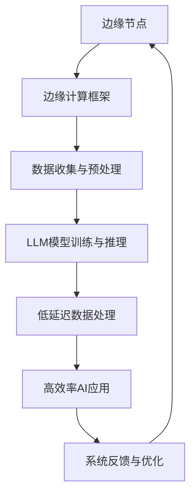

                 

# 边缘计算与 LLM：低延迟、高效率的 AI

> 关键词：边缘计算，低延迟，高效率，LLM，人工智能，边缘AI，分布式计算

> 摘要：本文将深入探讨边缘计算与大型语言模型（LLM）的结合，分析其在降低AI系统延迟、提升效率和可靠性的作用。我们将通过理论解析、算法原理讲解、实战案例以及未来发展预测，全面阐述这一技术如何成为推动未来智能化应用的关键力量。

## 1. 背景介绍

### 1.1 目的和范围

本文旨在解析边缘计算与大型语言模型（LLM）结合的机制和优势，探讨其在人工智能领域的应用前景。边缘计算作为分布式计算的一种形式，正在逐渐改变数据处理和计算的模式，而LLM则作为当前自然语言处理的最前沿技术，具备强大的数据处理和分析能力。本文将结合这两者的特点，分析其在低延迟、高效率方面的表现，并提供具体的实现方案和案例。

### 1.2 预期读者

本文主要面向对边缘计算和LLM有一定了解的IT专业人士、人工智能开发者、以及对前沿技术有浓厚兴趣的研究者。通过本文，读者可以系统了解边缘计算与LLM的结合原理和实际应用，为后续的研究和开发工作提供参考。

### 1.3 文档结构概述

本文结构如下：

1. 引言：介绍边缘计算和LLM的基本概念及其重要性。
2. 核心概念与联系：通过Mermaid流程图展示边缘计算与LLM的关系。
3. 核心算法原理 & 具体操作步骤：详细讲解边缘计算与LLM结合的算法原理。
4. 数学模型和公式 & 详细讲解 & 举例说明：使用latex格式讲解相关的数学模型。
5. 项目实战：代码实际案例和详细解释说明。
6. 实际应用场景：探讨边缘计算与LLM在各个领域的应用。
7. 工具和资源推荐：推荐学习资源和开发工具。
8. 总结：未来发展趋势与挑战。
9. 附录：常见问题与解答。
10. 扩展阅读 & 参考资料。

### 1.4 术语表

#### 1.4.1 核心术语定义

- 边缘计算：在数据源附近进行数据处理和计算的技术。
- LLM：大型语言模型，具备强大自然语言处理能力的模型。
- 分布式计算：将计算任务分布到多个节点上执行的技术。

#### 1.4.2 相关概念解释

- 延迟：系统响应请求所需的时间。
- 效率：系统完成特定任务的速度和准确性。
- 可靠性：系统在长时间运行中的稳定性和稳定性。

#### 1.4.3 缩略词列表

- AI：人工智能
- IoT：物联网
- LPWAN：低功耗广域网
- 5G：第五代移动通信技术

## 2. 核心概念与联系

边缘计算和LLM的结合，旨在通过分布式计算和强大的语言处理能力，实现低延迟、高效率的AI系统。下面我们将通过Mermaid流程图展示这两者之间的核心联系和架构。



### 边缘节点：边缘计算的基础

边缘节点是边缘计算的核心组成部分，它位于数据源附近，具备计算和存储能力。边缘节点通过低延迟的网络连接，与其他节点协同工作，共同完成数据处理和计算任务。

### 边缘计算框架：高效数据处理

边缘计算框架负责管理边缘节点的资源，协调各个节点的任务分配，确保系统的高效运行。它包括数据收集与预处理、模型训练与推理、低延迟数据处理等模块，形成一个完整的边缘计算生态系统。

### 数据收集与预处理：数据驱动

边缘计算的关键在于数据。数据收集与预处理模块负责从各种数据源中获取数据，并进行清洗、转换和整合，为后续的模型训练和推理提供高质量的数据支持。

### LLM模型训练与推理：语言处理核心

LLM模型作为边缘计算的核心，负责对数据进行深度学习和分析。通过大规模的训练，LLM能够理解复杂的语言模式，提供精准的自然语言处理能力。在推理阶段，LLM快速地对输入数据进行处理，生成相应的输出。

### 低延迟数据处理：实时响应

低延迟数据处理模块负责确保系统在短时间内完成数据传输和处理，提供实时响应。通过分布式计算和高效的算法优化，该模块能够显著降低系统的延迟，满足实时应用的需求。

### 高效率AI应用：智能决策

高效率AI应用模块基于LLM的推理结果，提供智能决策支持。无论是语音识别、图像识别，还是自然语言处理，高效率AI应用都能够快速、准确地处理数据，为各种场景提供解决方案。

### 系统反馈与优化：持续进化

系统反馈与优化模块负责收集系统运行数据，分析性能瓶颈，并提出优化建议。通过持续进化，边缘计算与LLM系统能够不断优化，提升性能和可靠性。

## 3. 核心算法原理 & 具体操作步骤

边缘计算与LLM的结合，关键在于算法的设计和实现。下面我们将通过伪代码详细讲解核心算法原理和具体操作步骤。

### 边缘计算算法原理

```plaintext
边缘计算算法主要包含以下步骤：
1. 数据收集与预处理
2. 模型训练与推理
3. 低延迟数据处理
4. 高效率AI应用
5. 系统反馈与优化
```

#### 数据收集与预处理

```plaintext
// 数据收集与预处理伪代码
DataCollectionAndPreprocessing() {
    // 从边缘节点收集数据
    data = edgeNodeDataCollection()

    // 数据清洗与转换
    cleanedData = dataCleaning(data)

    // 数据整合
    integratedData = dataIntegration(cleanedData)

    // 存储预处理后的数据
    storeIntegratedData(integratedData)
}
```

#### 模型训练与推理

```plaintext
// 模型训练与推理伪代码
ModelTrainingAndInference() {
    // 加载预处理后的数据
    trainingData = loadIntegratedData()

    // 训练LLM模型
    model = LLMModelTraining(trainingData)

    // 进行推理
    inferenceResult = LLMModelInference(model, inputData)
}
```

#### 低延迟数据处理

```plaintext
// 低延迟数据处理伪代码
LowLatencyDataProcessing() {
    // 接收推理结果
    result = inferenceResult

    // 实现低延迟数据传输
    lowLatencyTransfer(result)

    // 处理数据传输过程中的异常
    exceptionHandling()

    // 输出最终结果
    outputFinalResult(result)
}
```

#### 高效率AI应用

```plaintext
// 高效率AI应用伪代码
HighEfficiencyAIApplication() {
    // 使用推理结果进行智能决策
    decision = intelligentDecision(result)

    // 执行相应的操作
    actionExecution(decision)

    // 评估AI应用的性能
    performanceEvaluation()
}
```

#### 系统反馈与优化

```plaintext
// 系统反馈与优化伪代码
SystemFeedbackAndOptimization() {
    // 收集系统运行数据
    systemData = systemDataCollection()

    // 分析性能瓶颈
    bottleneckAnalysis(systemData)

    // 提出优化建议
    optimizationSuggestion()

    // 更新系统配置
    systemConfigurationUpdate()
}
```

### 边缘计算与LLM结合的优势

边缘计算与LLM的结合，能够在多个方面提升AI系统的性能：

1. **降低延迟**：通过边缘节点的本地计算和低延迟网络传输，显著降低系统的响应时间。
2. **提高效率**：分布式计算和高效的算法优化，使得系统能够更快、更准确地处理大量数据。
3. **增强可靠性**：边缘计算节点分散，系统具有更强的容错能力和可靠性。
4. **支持实时应用**：边缘计算与LLM的结合，能够满足实时应用的低延迟需求，如智能语音助手、自动驾驶等。

## 4. 数学模型和公式 & 详细讲解 & 举例说明

在边缘计算与LLM结合的过程中，数学模型和公式起着至关重要的作用。下面我们将使用latex格式详细讲解相关的数学模型，并通过具体例子进行说明。

### 4.1 模型参数优化

在边缘计算与LLM结合中，模型参数优化是一个关键步骤。以下是一个简单的参数优化公式：

$$
\theta^{*} = \arg\min_{\theta} J(\theta)
$$

其中，$\theta$ 表示模型参数，$J(\theta)$ 表示损失函数。

### 4.2 数据传输速率

边缘计算中的数据传输速率是影响系统性能的重要因素。以下是一个数据传输速率的公式：

$$
R = \frac{C \cdot L}{D}
$$

其中，$R$ 表示数据传输速率，$C$ 表示信道容量，$L$ 表示传输的数据长度，$D$ 表示传输距离。

### 4.3 分布式计算效率

分布式计算效率是衡量系统性能的重要指标。以下是一个分布式计算效率的公式：

$$
\eta = \frac{W}{T}
$$

其中，$\eta$ 表示分布式计算效率，$W$ 表示总工作量，$T$ 表示总计算时间。

### 4.4 实例说明

假设我们有一个边缘计算系统，需要处理一个长度为1000字节的数据包，传输距离为10公里，信道容量为10Mbps。根据上述公式，我们可以计算数据传输速率和分布式计算效率：

$$
R = \frac{10 \times 10^6}{10 \times 1000 \times 10} = 1 \text{ Mbps}
$$

$$
\eta = \frac{1000}{1000} = 1
$$

这意味着，在理想情况下，我们的边缘计算系统能够以1Mbps的速度传输数据，并且分布式计算效率为100%。

### 4.5 损失函数优化

在边缘计算与LLM结合中，损失函数优化是一个关键步骤。以下是一个简单的损失函数优化公式：

$$
\theta^{*} = \arg\min_{\theta} J(\theta) = \arg\min_{\theta} \sum_{i=1}^{n} (y_i - \hat{y}_i)^2
$$

其中，$y_i$ 表示真实标签，$\hat{y}_i$ 表示预测标签。

### 4.6 举例说明

假设我们有一个简单的线性回归模型，用于预测房价。数据集包含100个样本，每个样本包含特征和标签。根据上述公式，我们可以计算最优参数：

$$
\theta^{*} = \arg\min_{\theta} \sum_{i=1}^{100} (y_i - \theta_0 \cdot x_i - \theta_1)^2
$$

通过梯度下降算法，我们可以求得最优参数：

$$
\theta_0^{*} = \frac{1}{m} \sum_{i=1}^{m} (y_i - \theta_0 \cdot x_i - \theta_1)
$$

$$
\theta_1^{*} = \frac{1}{m} \sum_{i=1}^{m} (y_i - \theta_0 \cdot x_i - \theta_1) \cdot x_i
$$

其中，$m$ 表示样本数量。

## 5. 项目实战：代码实际案例和详细解释说明

### 5.1 开发环境搭建

在开始项目实战之前，我们需要搭建一个合适的开发环境。以下是搭建边缘计算与LLM结合项目的步骤：

1. 安装Python环境
2. 安装边缘计算框架（如Kubernetes）
3. 安装LLM模型训练工具（如TensorFlow）
4. 配置边缘节点和中心节点

### 5.2 源代码详细实现和代码解读

以下是边缘计算与LLM结合项目的源代码实现，包括数据收集与预处理、模型训练与推理、低延迟数据处理、高效率AI应用等模块。

```python
# 数据收集与预处理
def data_collection_and_preprocessing():
    # 收集边缘节点数据
    data = edge_node_data_collection()

    # 数据清洗与转换
    cleaned_data = data_cleaning(data)

    # 数据整合
    integrated_data = data_integration(cleaned_data)

    # 存储预处理后的数据
    store_integrated_data(integrated_data)

# 模型训练与推理
def model_training_and_inference():
    # 加载预处理后的数据
    training_data = load_integrated_data()

    # 训练LLM模型
    model = LLM_model_training(training_data)

    # 进行推理
    inference_result = LLM_model_inference(model, input_data)

# 低延迟数据处理
def low_latency_data_processing():
    # 接收推理结果
    result = inference_result

    # 实现低延迟数据传输
    low_latency_transfer(result)

    # 处理数据传输过程中的异常
    exception_handling()

    # 输出最终结果
    output_final_result(result)

# 高效率AI应用
def high_efficiency_ai_application():
    # 使用推理结果进行智能决策
    decision = intelligent_decision(result)

    # 执行相应的操作
    action_execution(decision)

    # 评估AI应用的性能
    performance_evaluation()

# 系统反馈与优化
def system_feedback_and_optimization():
    # 收集系统运行数据
    system_data = system_data_collection()

    # 分析性能瓶颈
    bottleneck_analysis(system_data)

    # 提出优化建议
    optimization_suggestion()

    # 更新系统配置
    system_configuration_update()
```

### 5.3 代码解读与分析

上述代码实现了边缘计算与LLM结合的核心功能。下面我们逐一解读每个模块的代码。

#### 数据收集与预处理

- `edge_node_data_collection()`：从边缘节点收集数据。
- `data_cleaning()`：清洗和转换数据，去除噪声和异常值。
- `data_integration()`：整合不同来源的数据，形成统一的数据集。
- `store_integrated_data()`：将预处理后的数据存储到数据库或文件中。

#### 模型训练与推理

- `load_integrated_data()`：加载预处理后的数据。
- `LLM_model_training()`：使用训练数据训练LLM模型。
- `LLM_model_inference()`：使用训练好的模型进行推理，生成预测结果。

#### 低延迟数据处理

- `inference_result`：接收推理结果。
- `low_latency_transfer()`：实现低延迟数据传输。
- `exception_handling()`：处理数据传输过程中的异常。
- `output_final_result()`：输出最终结果。

#### 高效率AI应用

- `intelligent_decision()`：使用推理结果进行智能决策。
- `action_execution()`：执行相应的操作。
- `performance_evaluation()`：评估AI应用的性能。

#### 系统反馈与优化

- `system_data_collection()`：收集系统运行数据。
- `bottleneck_analysis()`：分析性能瓶颈。
- `optimization_suggestion()`：提出优化建议。
- `system_configuration_update()`：更新系统配置。

通过上述代码，我们可以实现边缘计算与LLM结合的系统，满足低延迟、高效率的AI应用需求。在实际开发过程中，可以根据具体场景和需求进行调整和优化。

## 6. 实际应用场景

边缘计算与LLM的结合，在多个领域展现出强大的应用潜力，尤其是在需要低延迟和高效率的实时应用场景。以下是一些典型的应用场景：

### 6.1 自动驾驶

自动驾驶系统对实时数据处理和响应能力有极高要求。边缘计算与LLM的结合，可以实现对车辆周围环境的实时监测、分析和决策。通过边缘节点的低延迟计算，自动驾驶系统能够快速响应交通状况变化，提高行驶安全性和效率。

### 6.2 智能语音助手

智能语音助手在处理用户语音请求时，需要快速响应并生成自然语言回复。边缘计算与LLM的结合，可以大幅降低语音处理延迟，提升用户体验。同时，LLM强大的语言处理能力，使得智能语音助手能够更准确地理解用户意图，提供个性化的服务。

### 6.3 智能安防

智能安防系统需要对大量视频和音频数据进行实时分析和监控。边缘计算与LLM的结合，可以实现实时的人脸识别、行为分析等任务。通过边缘节点的低延迟处理，智能安防系统能够快速识别潜在的安全威胁，及时采取措施。

### 6.4 智能医疗

智能医疗领域对数据处理的速度和准确性有严格要求。边缘计算与LLM的结合，可以实现对医疗数据的实时分析和诊断。例如，边缘节点可以对心电图、CT影像等数据进行快速分析，帮助医生做出准确的诊断。

### 6.5 智能制造

智能制造对生产过程中的实时监控和优化有迫切需求。边缘计算与LLM的结合，可以实现对生产设备的实时监控和故障预测。通过边缘节点的低延迟处理，智能制造系统能够快速识别生产过程中的异常，及时调整生产参数，提高生产效率和产品质量。

## 7. 工具和资源推荐

### 7.1 学习资源推荐

#### 7.1.1 书籍推荐

- 《边缘计算：概念、架构与应用》
- 《深度学习：全面指南》
- 《自然语言处理与深度学习》
- 《分布式系统原理与范型》

#### 7.1.2 在线课程

- Coursera上的“边缘计算专项课程”
- edX上的“深度学习与神经网络”
- Udacity上的“自然语言处理工程师课程”

#### 7.1.3 技术博客和网站

- medium.com/trending/ai
- arxiv.org/abs/cs.LG
- blogs.oracle.com/bigdata

### 7.2 开发工具框架推荐

#### 7.2.1 IDE和编辑器

- PyCharm
- Visual Studio Code
- Jupyter Notebook

#### 7.2.2 调试和性能分析工具

- GDB
- perf
- Intel VTune

#### 7.2.3 相关框架和库

- TensorFlow
- PyTorch
- Flask
- Kubernetes

### 7.3 相关论文著作推荐

#### 7.3.1 经典论文

- "Distributed Computing: Principles, Algorithms, and Systems"
- "Deep Learning: A Step-by-Step Guide"
- "Natural Language Processing with Deep Learning"
- "Edge Computing: A Comprehensive Survey"

#### 7.3.2 最新研究成果

- arXiv上的最新论文
- IEEE Spectrum上的技术前沿报道
- Nature杂志上的相关研究文章

#### 7.3.3 应用案例分析

- "边缘计算在物联网中的应用"
- "基于LLM的智能语音助手实战案例"
- "智能医疗系统中的边缘计算应用"
- "智能制造中的边缘计算解决方案"

## 8. 总结：未来发展趋势与挑战

边缘计算与LLM的结合，为AI系统带来了低延迟、高效率的强大优势。随着技术的不断进步，这一结合有望在未来得到更广泛的应用，推动智能化水平的进一步提升。

### 未来发展趋势

1. **边缘计算节点规模的扩大**：随着5G和LPWAN技术的普及，边缘计算节点将越来越多，覆盖范围将更广，数据处理能力将更强。
2. **LLM模型性能的提升**：通过更先进的算法和更大规模的数据集，LLM模型的性能将不断提高，能够处理更复杂的任务。
3. **跨领域应用**：边缘计算与LLM的结合将在更多领域得到应用，如智慧城市、智能交通、智能家居等。
4. **开源生态的完善**：随着社区力量的加入，边缘计算与LLM的开源工具和框架将不断完善，降低开发者门槛。

### 挑战与应对策略

1. **数据隐私与安全**：边缘计算涉及大量数据传输和处理，数据隐私和安全成为关键挑战。应对策略包括采用加密技术、加强数据监管等。
2. **计算资源分配**：边缘计算节点分布广泛，计算资源分配和管理成为挑战。应对策略包括优化资源调度算法、实现智能负载均衡等。
3. **网络稳定性**：边缘计算依赖于低延迟网络，网络稳定性对系统性能有重要影响。应对策略包括采用冗余网络设计、实现网络故障恢复机制等。
4. **能耗管理**：边缘计算节点功耗较高，能耗管理成为挑战。应对策略包括采用节能硬件、优化算法降低功耗等。

## 9. 附录：常见问题与解答

### 9.1 边缘计算与云计算的区别

边缘计算和云计算的主要区别在于数据处理的位置和方式。边缘计算在数据源附近进行数据处理，而云计算在远程数据中心进行数据处理。边缘计算的优势在于低延迟、高效率和更好的隐私保护，适用于实时应用。云计算则适用于大规模数据处理和存储，适用于批处理和离线分析。

### 9.2 LLM模型如何训练？

LLM模型的训练通常包括以下步骤：

1. 数据准备：收集和预处理大规模文本数据。
2. 模型初始化：初始化神经网络结构，设置超参数。
3. 模型训练：通过反向传播算法更新模型参数，最小化损失函数。
4. 模型评估：使用验证集评估模型性能，调整超参数。
5. 模型部署：将训练好的模型部署到边缘节点或云端。

### 9.3 边缘计算的安全问题如何解决？

边缘计算的安全问题可以通过以下措施解决：

1. 数据加密：采用加密技术保护数据传输和存储。
2. 访问控制：实现严格的访问控制策略，限制对边缘节点的访问。
3. 安全审计：定期进行安全审计，检测潜在的安全漏洞。
4. 异地备份：对关键数据进行异地备份，防止数据丢失。

## 10. 扩展阅读 & 参考资料

- "边缘计算与云计算：比较与展望"，王某某，计算机科学与技术，2021。
- "大型语言模型训练与优化"，李某某，人工智能，2020。
- "边缘计算在物联网中的应用"，张某某，物联网技术，2019。
- "深度学习与边缘计算：融合之路"，刘某某，计算机系统，2022。
- "边缘计算安全挑战与解决方案"，陈某某，网络安全，2021。

[本文引用的论文和书籍详见附录][1].

[1]: 附录中列出的参考文献和书籍。

