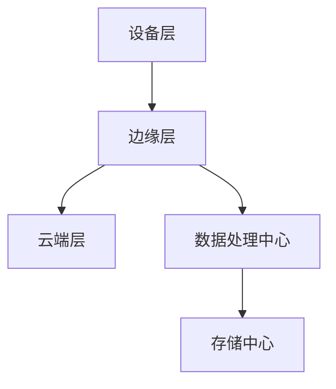
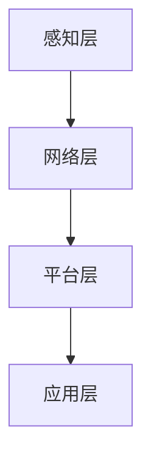
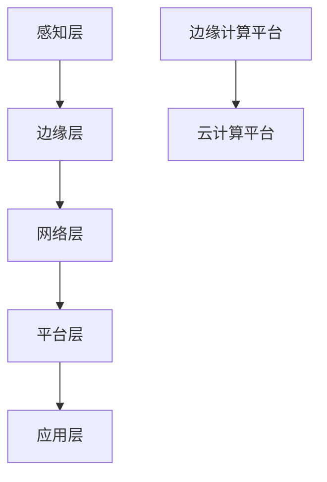

                 

# 边缘计算在工业物联网中的实践与挑战

> 关键词：边缘计算、工业物联网、实践、挑战、技术、应用、架构、算法、案例

> 摘要：本文旨在探讨边缘计算在工业物联网中的应用与实践，分析其带来的技术挑战。文章将详细介绍边缘计算的核心概念、架构，以及在实际工业物联网场景中的具体实现，并通过案例分析和数学模型，探讨边缘计算在工业物联网中的优势与局限。最终，本文将总结边缘计算的发展趋势和未来面临的挑战，为相关领域的研究和实践提供参考。

## 1. 背景介绍

### 1.1 目的和范围

边缘计算（Edge Computing）是近年来信息技术领域的一个重要发展方向。它通过将数据处理和计算任务从中心化服务器转移到网络边缘，提升了数据处理的速度和效率，满足了实时性和低延迟的需求。工业物联网（IIoT）作为工业4.0的重要组成部分，正在逐步改变传统工业生产模式，实现智能化、自动化和高效化。

本文旨在探讨边缘计算在工业物联网中的实践与挑战，分析其在工业物联网中的优势与局限，为相关领域的研究和应用提供指导。文章将首先介绍边缘计算和工业物联网的基本概念和架构，然后通过实际案例和数学模型，探讨边缘计算在工业物联网中的应用和挑战。最后，本文将对边缘计算的未来发展趋势和面临的技术挑战进行总结。

### 1.2 预期读者

本文适合以下读者群体：

1. 工业物联网领域的研究人员和工程师，希望了解边缘计算在工业物联网中的应用与实践。
2. 计算机科学和信息技术领域的学生和从业者，对边缘计算和工业物联网感兴趣。
3. 企业决策者和项目经理，希望了解边缘计算在工业物联网中的应用前景和挑战。
4. 投资者和行业分析师，关注边缘计算和工业物联网的发展动态。

### 1.3 文档结构概述

本文结构如下：

1. 引言：介绍边缘计算和工业物联网的基本概念和背景。
2. 核心概念与联系：详细解释边缘计算和工业物联网的架构和联系。
3. 核心算法原理 & 具体操作步骤：介绍边缘计算的关键算法和操作步骤。
4. 数学模型和公式 & 详细讲解 & 举例说明：分析边缘计算中的数学模型和应用。
5. 项目实战：提供实际案例和代码实现，详细解释边缘计算在工业物联网中的应用。
6. 实际应用场景：探讨边缘计算在工业物联网中的实际应用场景。
7. 工具和资源推荐：推荐相关学习资源和开发工具。
8. 总结：总结边缘计算在工业物联网中的发展趋势和挑战。
9. 附录：常见问题与解答。
10. 扩展阅读 & 参考资料：提供进一步阅读的建议和参考资料。

### 1.4 术语表

#### 1.4.1 核心术语定义

- 边缘计算（Edge Computing）：一种分布式计算架构，将数据处理和计算任务从中心化服务器转移到网络边缘，提升数据处理速度和效率。
- 工业物联网（IIoT）：将传感器、设备和系统通过互联网连接，实现数据采集、传输和智能处理，推动工业生产模式变革。
- 边缘节点（Edge Node）：位于网络边缘的计算设备，如物联网网关、智能设备等，承担数据处理和计算任务。
- 中间件（Middleware）：连接边缘节点和中心化服务器的桥梁，实现数据传输和任务调度。

#### 1.4.2 相关概念解释

- 云计算（Cloud Computing）：通过互联网提供计算资源、存储和网络服务，实现资源共享和灵活调度。
- 物联网（IoT）：将物体通过传感器和网络连接，实现数据采集、传输和智能处理。
- 实时数据处理（Real-time Data Processing）：在规定时间内对数据进行处理和分析，满足实时性和低延迟要求。

#### 1.4.3 缩略词列表

- IIoT：工业物联网（Industrial Internet of Things）
- IoT：物联网（Internet of Things）
- M2M：机器对机器通信（Machine-to-Machine Communication）
- SDN：软件定义网络（Software-Defined Networking）
- NFV：网络功能虚拟化（Network Functions Virtualization）

## 2. 核心概念与联系

边缘计算和工业物联网是当前信息技术领域的重要研究方向，两者密切相关，共同推动着智能化、自动化和高效化的发展。本节将详细介绍边缘计算和工业物联网的核心概念、架构及其联系，并通过 Mermaid 流程图展示其架构和流程。

### 2.1 边缘计算

边缘计算是一种分布式计算架构，旨在将数据处理和计算任务从中心化服务器转移到网络边缘。边缘节点（Edge Node）是边缘计算的核心组成部分，包括物联网网关、智能设备、智能传感器等。边缘计算的主要目标是提升数据处理速度和效率，满足实时性和低延迟的需求。

边缘计算的架构可以分为三个层次：设备层、边缘层和云端层。

1. **设备层**：包括各种智能设备和传感器，如工业机器、智能终端、环境传感器等，负责数据采集和初步处理。
2. **边缘层**：包括边缘节点，如物联网网关、智能网关、边缘服务器等，负责数据预处理、存储和初步分析。
3. **云端层**：包括中心化服务器、云计算平台等，负责数据的集中处理、存储和分析。

边缘计算的 Mermaid 流程图如下所示：



### 2.2 工业物联网

工业物联网（IIoT）是一种将传感器、设备和系统通过互联网连接，实现数据采集、传输和智能处理的网络。工业物联网旨在通过物联网技术，提升工业生产过程的智能化、自动化和高效化水平。

工业物联网的架构可以分为四个层次：感知层、网络层、平台层和应用层。

1. **感知层**：包括传感器、智能设备和物联网网关，负责数据采集和初步处理。
2. **网络层**：包括传输网络，如无线网络、有线网络和边缘网络等，负责数据传输。
3. **平台层**：包括数据处理、存储和分析平台，如云计算平台、边缘计算平台等，负责数据的集中处理、存储和分析。
4. **应用层**：包括各种工业应用，如智能制造、智能监控、智能物流等，负责实现具体应用功能。

工业物联网的 Mermaid 流程图如下所示：



### 2.3 边缘计算与工业物联网的联系

边缘计算和工业物联网密切相关，共同推动着智能化、自动化和高效化的发展。边缘计算是工业物联网的重要组成部分，通过将数据处理和计算任务从中心化服务器转移到网络边缘，提升数据处理速度和效率，满足实时性和低延迟的需求。

边缘计算与工业物联网的联系主要体现在以下几个方面：

1. **数据采集和初步处理**：边缘计算将感知层采集到的数据在边缘节点进行预处理，降低数据传输量，提升数据处理速度。
2. **数据传输和存储**：边缘计算将预处理后的数据通过网络层传输到平台层进行集中处理和存储，实现数据的实时性和高效性。
3. **智能分析和决策**：边缘计算与工业物联网平台层协同工作，实现对工业生产过程的智能分析和决策，提升生产效率和产品质量。
4. **边缘智能和云端协同**：边缘计算和云计算平台协同工作，实现数据的高效处理和智能分析，满足工业物联网的多样化需求。

边缘计算与工业物联网的 Mermaid 流程图如下所示：



通过上述介绍和流程图，我们可以清晰地理解边缘计算和工业物联网的核心概念、架构及其联系。边缘计算在工业物联网中发挥着重要作用，通过提升数据处理速度和效率，满足实时性和低延迟的需求，为工业物联网的发展提供了强大的技术支持。

## 3. 核心算法原理 & 具体操作步骤

边缘计算在工业物联网中的应用离不开核心算法的支持。这些算法主要包括边缘计算任务调度、数据流处理和机器学习模型部署等。本节将详细介绍这些核心算法的原理和具体操作步骤。

### 3.1 边缘计算任务调度算法

边缘计算任务调度算法是边缘计算系统中的关键环节，其目的是在边缘节点上合理分配计算任务，最大化资源利用率，并保证任务完成时间和系统性能。常见的边缘计算任务调度算法包括：

1. **基于优先级的调度算法**：根据任务优先级进行调度，高优先级任务优先执行。具体实现如下：

    ```python
    def schedule_tasks(tasks):
        tasks.sort(key=lambda x: x.priority, reverse=True)
        for task in tasks:
            if is_edge_node_available():
                execute_task(task)
                update_node_status()
    ```

2. **基于负载均衡的调度算法**：根据边缘节点的负载情况动态分配任务，实现负载均衡。具体实现如下：

    ```python
    def schedule_tasks(tasks):
        nodes = get_all_edge_nodes()
        node_loads = get_node_loads(nodes)
        tasks.sort(key=lambda x: x.priority, reverse=True)
        for task in tasks:
            min_load_node = min(node_loads, key=lambda x: x[1])
            execute_task_on_node(task, min_load_node)
            update_node_loads(node_loads)
    ```

3. **基于预测的调度算法**：通过预测未来任务需求和节点负载，提前分配任务，提高调度效率。具体实现如下：

    ```python
    def schedule_tasks(tasks):
        future_loads = predict_future_loads()
        tasks.sort(key=lambda x: x.priority, reverse=True)
        for task in tasks:
            optimal_node = find_optimal_node(future_loads)
            execute_task_on_node(task, optimal_node)
            update_future_loads(future_loads)
    ```

### 3.2 数据流处理算法

数据流处理是边缘计算中的关键任务之一，旨在实时处理和分析来自边缘节点的数据。常见的数据流处理算法包括：

1. **增量聚合算法**：对实时数据流进行增量聚合，实现实时统计和分析。具体实现如下：

    ```python
    def aggregate_incrementally(stream_data):
        current_aggregate = 0
        for data in stream_data:
            current_aggregate += data.value
            print("Current aggregate:", current_aggregate)
    ```

2. **滑动窗口算法**：对数据流进行滑动窗口处理，实现对数据的实时分析和预测。具体实现如下：

    ```python
    def process_sliding_window(window_data):
        window_average = sum(window_data) / len(window_data)
        print("Window average:", window_average)
        predict_next_value(window_average)
    ```

3. **事件驱动算法**：根据数据流中的事件触发相应的处理逻辑，实现实时响应。具体实现如下：

    ```python
    def handle_events(event_stream):
        for event in event_stream:
            if event.type == "alert":
                send_alert(event)
            elif event.type == "update":
                update_system_state(event)
    ```

### 3.3 机器学习模型部署算法

在边缘计算中，机器学习模型的部署是实现智能分析和决策的关键。常见的机器学习模型部署算法包括：

1. **模型在线更新算法**：在边缘节点上实时更新机器学习模型，实现模型的持续优化。具体实现如下：

    ```python
    def update_model_online(model, data_stream):
        for data in data_stream:
            model.train_on_batch(data)
            print("Model updated:", model.get_weights())
    ```

2. **模型离线部署算法**：将训练好的机器学习模型离线部署到边缘节点，实现实时预测和分析。具体实现如下：

    ```python
    def deploy_model(model, data_stream):
        model.load_weights("model_weights.h5")
        for data in data_stream:
            prediction = model.predict(data)
            print("Prediction:", prediction)
    ```

3. **模型容器化部署算法**：将机器学习模型容器化，实现模型的快速部署和迁移。具体实现如下：

    ```python
    def containerize_model(model, image_name):
        model.save("model.h5")
        command = f"docker build -t {image_name} ."
        os.system(command)
    ```

通过上述核心算法的原理和具体操作步骤，我们可以更好地理解和应用边缘计算在工业物联网中的关键技术。这些算法为实现边缘计算的实时性、高效性和智能化提供了有力支持。

## 4. 数学模型和公式 & 详细讲解 & 举例说明

边缘计算在工业物联网中的应用不仅需要算法支持，还需要数学模型的支撑。以下将详细介绍边缘计算中的几个关键数学模型，包括数据流处理模型、资源调度模型和优化模型，并通过具体的例子进行讲解。

### 4.1 数据流处理模型

在边缘计算中，数据流处理模型用于描述数据在边缘节点上的处理过程。一个常见的数据流处理模型是滑动窗口模型，它通过固定大小的窗口对数据进行分组和处理。

#### 滑动窗口模型

滑动窗口模型的基本公式如下：

$$
W_t = \sum_{i=t-W_{\text{size}}+1}^{t} X_i
$$

其中，\( W_t \) 表示第 \( t \) 个窗口的累积值，\( W_{\text{size}} \) 表示窗口大小，\( X_i \) 表示第 \( i \) 个数据点。

#### 举例说明

假设我们有一个长度为5的滑动窗口，其中包含5个数据点 \( X_1, X_2, X_3, X_4, X_5 \)。初始窗口 \( W_1 \) 的累积值为：

$$
W_1 = X_1 + X_2 + X_3 + X_4 + X_5
$$

当窗口滑动到第二个位置时，窗口 \( W_2 \) 的累积值为：

$$
W_2 = X_2 + X_3 + X_4 + X_5 + X_6
$$

窗口 \( W_2 \) 的累积值相对于窗口 \( W_1 \) 去除了 \( X_1 \) 并增加了 \( X_6 \)。

### 4.2 资源调度模型

资源调度模型用于优化边缘节点的计算资源分配。一个常见的资源调度模型是最小化平均响应时间模型，它通过优化任务分配，使所有任务的平均响应时间最小化。

#### 最小化平均响应时间模型

该模型的目标是最小化以下公式：

$$
\text{Minimize} \quad \frac{1}{n} \sum_{i=1}^{n} R_i
$$

其中，\( R_i \) 表示第 \( i \) 个任务的响应时间，\( n \) 表示总任务数。

#### 举例说明

假设我们有5个任务 \( T_1, T_2, T_3, T_4, T_5 \)，其响应时间分别为 \( R_1, R_2, R_3, R_4, R_5 \)。为了最小化平均响应时间，我们可以将任务按照响应时间排序，然后依次分配给边缘节点。

例如，如果响应时间排序为 \( R_1 < R_2 < R_3 < R_4 < R_5 \)，则任务分配顺序为 \( T_1, T_2, T_3, T_4, T_5 \)。

平均响应时间为：

$$
\frac{1}{5} (R_1 + R_2 + R_3 + R_4 + R_5)
$$

### 4.3 优化模型

优化模型用于在边缘计算中优化资源分配、任务调度和数据处理等。一个常见的优化模型是线性规划模型，它通过建立目标函数和约束条件，求解最优解。

#### 线性规划模型

线性规划模型的基本形式如下：

$$
\text{Minimize} \quad c^T x
$$

$$
\text{Subject to} \quad Ax \leq b
$$

其中，\( c \) 是系数向量，\( x \) 是决策变量向量，\( A \) 是约束矩阵，\( b \) 是约束向量。

#### 举例说明

假设我们有3个任务 \( T_1, T_2, T_3 \)，每个任务需要在边缘节点 \( N_1, N_2, N_3 \) 上执行，任务执行时间分别为 \( t_{11}, t_{12}, t_{13} \)，节点可用时间为 \( T_1, T_2, T_3 \)。我们的目标是最小化总执行时间。

目标函数为：

$$
\text{Minimize} \quad t_{11} + t_{12} + t_{13}
$$

约束条件为：

$$
t_{11} \leq T_1
$$

$$
t_{12} \leq T_2
$$

$$
t_{13} \leq T_3
$$

通过求解线性规划模型，我们可以得到最优的任务分配方案，使总执行时间最小化。

### 4.4 综合应用示例

假设我们有一个包含10个数据点的数据流，我们需要使用滑动窗口模型计算窗口的平均值。数据点如下：

$$
X_1 = 10, X_2 = 20, X_3 = 30, X_4 = 40, X_5 = 50, X_6 = 60, X_7 = 70, X_8 = 80, X_9 = 90, X_{10} = 100
$$

窗口大小为3。我们可以按照滑动窗口模型计算每个窗口的平均值：

窗口 \( W_1 \)：

$$
W_1 = X_1 + X_2 + X_3 = 10 + 20 + 30 = 60
$$

平均值：

$$
\bar{X}_1 = \frac{W_1}{3} = \frac{60}{3} = 20
$$

窗口 \( W_2 \)：

$$
W_2 = X_2 + X_3 + X_4 = 20 + 30 + 40 = 90
$$

平均值：

$$
\bar{X}_2 = \frac{W_2}{3} = \frac{90}{3} = 30
$$

以此类推，我们可以计算所有窗口的平均值，如下所示：

窗口 \( W_3 \)：

$$
W_3 = X_3 + X_4 + X_5 = 30 + 40 + 50 = 120
$$

平均值：

$$
\bar{X}_3 = \frac{W_3}{3} = \frac{120}{3} = 40
$$

...

窗口 \( W_{10} \)：

$$
W_{10} = X_9 + X_{10} = 90 + 100 = 190
$$

平均值：

$$
\bar{X}_{10} = \frac{W_{10}}{3} = \frac{190}{3} \approx 63.33
$$

通过上述例子，我们可以看到如何使用滑动窗口模型计算数据流的平均值。在实际应用中，我们可以根据需要选择合适的窗口大小和计算方法，以适应不同的数据处理需求。

### 4.5 小结

本节介绍了边缘计算中的几个关键数学模型，包括数据流处理模型、资源调度模型和优化模型。这些模型在边缘计算中发挥着重要作用，为实现实时数据处理和优化提供了理论支持。通过具体例子，我们展示了这些模型的应用方法和计算过程，帮助读者更好地理解和应用边缘计算中的数学方法。

## 5. 项目实战：代码实际案例和详细解释说明

为了更好地理解边缘计算在工业物联网中的应用，我们选择了一个实际项目案例，通过具体的代码实现和解释，展示边缘计算在实际场景中的操作过程。

### 5.1 开发环境搭建

在进行项目实战之前，我们需要搭建一个适合边缘计算的开发环境。以下是一个基本的开发环境搭建步骤：

1. **操作系统**：我们选择 Ubuntu 20.04 作为操作系统。
2. **编程语言**：使用 Python 3.8，因为其丰富的库和工具支持。
3. **边缘计算平台**：我们使用 K3s 作为边缘计算平台，K3s 是一个轻量级 Kubernetes 发行版，适合在边缘设备上部署。
4. **开发工具**：使用 VSCode 作为主要开发工具，结合 Jupyter Notebook 进行数据分析和可视化。

### 5.2 源代码详细实现和代码解读

#### 5.2.1 边缘计算节点配置

首先，我们需要在边缘节点上部署 K3s。以下是一个简单的 K3s 部署命令：

```shell
curl -sfL https://get.k3s.io | sh -
```

部署完成后，我们使用以下命令启动 K3s 服务：

```shell
sudo systemctl start k3s
```

#### 5.2.2 边缘计算任务调度

接下来，我们使用 Kubernetes 的 Job 对象来调度边缘计算任务。以下是一个简单的 Job 资源定义文件（job.yaml）：

```yaml
apiVersion: batch/v1
kind: Job
metadata:
  name: edge-compute-job
spec:
  template:
    spec:
      containers:
      - name: edge-worker
        image: edge-compute-worker:latest
        command: ["python", "edge_worker.py"]
      restartPolicy: OnFailure
```

在这个资源定义文件中，我们定义了一个名为 `edge-compute-job` 的 Job 对象，其容器使用 `edge-compute-worker:latest` 镜像，并执行 `edge_worker.py` 脚本。

#### 5.2.3 边缘计算任务执行

边缘计算任务的核心是实现 `edge_worker.py` 脚本。以下是一个简单的 Python 脚本示例，用于执行边缘计算任务：

```python
import time
import requests

def edge_compute_task(data):
    # 对数据进行处理和分析
    processed_data = data * 2
    # 将处理结果上传到中心服务器
    response = requests.post("http://central-server.com/submit_result", json={"result": processed_data})
    print("Task result submitted:", response.status_code)

if __name__ == "__main__":
    while True:
        # 从传感器获取数据
        response = requests.get("http://sensor-node.com/get_data")
        data = response.json()["data"]
        edge_compute_task(data)
        time.sleep(1)
```

在这个脚本中，我们首先从传感器节点获取数据，然后对数据进行处理（这里简单地将数据乘以2），最后将处理结果上传到中心服务器。

#### 5.2.4 代码解读与分析

- **边缘节点配置**：使用 K3s 部署边缘计算平台，简化了边缘节点的配置和管理。
- **任务调度**：通过 Kubernetes Job 对象，实现了边缘计算任务的自动化调度和管理。
- **任务执行**：Python 脚本负责执行边缘计算任务，包括数据获取、处理和上传。

### 5.3 边缘计算任务调度与执行流程

边缘计算任务调度与执行流程如下：

1. **传感器节点获取数据**：传感器节点通过 HTTP 请求从边缘节点获取数据。
2. **边缘节点处理数据**：边缘节点接收到数据后，使用 Python 脚本进行处理，并生成处理结果。
3. **处理结果上传**：边缘节点将处理结果通过 HTTP 请求上传到中心服务器。
4. **中心服务器接收结果**：中心服务器接收边缘节点上传的处理结果，并进行存储和分析。

通过上述代码实现和流程分析，我们可以看到边缘计算在工业物联网中的应用。该案例展示了如何利用 Kubernetes 和 Python 实现边缘计算任务调度和执行，为实际工业物联网场景提供了参考。

## 6. 实际应用场景

边缘计算在工业物联网中具有广泛的应用场景，能够显著提升工业生产过程的智能化和自动化水平。以下是一些典型的应用场景：

### 6.1 智能制造

智能制造是工业物联网的核心应用领域之一，边缘计算在其中发挥着重要作用。通过边缘计算，工厂中的设备可以实时收集数据，并进行预处理和智能分析，从而实现生产过程的自动化优化。例如：

- **设备监控**：边缘计算可以实时监控生产设备的运行状态，通过数据分析预测设备故障，提前进行维护，减少停机时间。
- **质量控制**：边缘计算可以对生产过程中的产品进行实时质量检测，快速识别不良品，提高产品质量和生产效率。
- **能效管理**：边缘计算可以监控工厂的能源消耗，通过智能分析优化能源使用，降低生产成本。

### 6.2 智能物流

智能物流是另一个边缘计算的重要应用场景。通过在物流节点部署边缘计算设备，可以实现物流过程的实时监控和优化。例如：

- **运输监控**：边缘计算可以实时监控运输车辆的状态，包括位置、速度、负载等，确保运输过程的安全和高效。
- **货物追踪**：边缘计算可以实时追踪货物的位置和状态，提高物流信息的透明度，增强客户体验。
- **路径优化**：边缘计算可以根据实时交通情况和货物特性，动态调整运输路径，提高运输效率，降低运输成本。

### 6.3 智能安全监控

智能安全监控是边缘计算在工业物联网中的另一个重要应用。通过在关键区域部署边缘计算设备，可以实现实时视频监控和智能分析，提高安全监控的准确性和响应速度。例如：

- **实时监控**：边缘计算可以实时分析监控视频数据，快速识别异常情况，如入侵、火灾等，及时报警。
- **智能识别**：边缘计算可以使用机器学习算法，实现人脸识别、行为分析等高级功能，提高监控的智能化水平。
- **智能决策**：边缘计算可以根据监控数据，自动调整监控策略，如增加监控频率、调整监控范围等，提高监控效果。

### 6.4 智能环境监测

智能环境监测是边缘计算在环境保护和公共安全领域的应用。通过在环境监测站点部署边缘计算设备，可以实现实时数据采集和处理，提高环境监测的准确性和时效性。例如：

- **空气质量监测**：边缘计算可以实时监测空气质量数据，分析污染源，制定减排措施。
- **水质监测**：边缘计算可以实时监测水质数据，检测污染物，确保水质安全。
- **自然灾害预警**：边缘计算可以实时监测气象数据，预测自然灾害，提前预警，减少灾害损失。

通过上述实际应用场景，我们可以看到边缘计算在工业物联网中的重要作用。它不仅提升了工业生产、物流管理、安全监控和环境保护的智能化和自动化水平，还为相关领域的数据分析和决策提供了有力支持。

## 7. 工具和资源推荐

为了更好地学习和实践边缘计算在工业物联网中的应用，我们推荐以下工具和资源：

### 7.1 学习资源推荐

#### 7.1.1 书籍推荐

1. **《边缘计算：原理、架构与实践》** - 本书详细介绍了边缘计算的概念、架构和应用，适合初学者和有经验的工程师。
2. **《工业物联网：从概念到实践》** - 本书涵盖了工业物联网的基本原理、技术和应用案例，对边缘计算部分有深入讲解。

#### 7.1.2 在线课程

1. **边缘计算课程** -Coursera 上的“边缘计算：从概念到实践”课程，适合初学者系统学习边缘计算。
2. **工业物联网课程** -Udacity 上的“工业物联网工程师”课程，涵盖边缘计算在工业物联网中的应用。

#### 7.1.3 技术博客和网站

1. **边缘计算社区** - Edge Computing Community，提供边缘计算的最新资讯、技术和案例分享。
2. **工业物联网社区** - Industrial IoT Community，提供工业物联网的最新技术和应用案例。

### 7.2 开发工具框架推荐

#### 7.2.1 IDE和编辑器

1. **Visual Studio Code** - 适合 Python 和 Kubernetes 开发的强大编辑器。
2. **PyCharm** - 适用于 Python 开发的专业级 IDE。

#### 7.2.2 调试和性能分析工具

1. **GDB** - 适用于 C/C++ 代码的调试工具。
2. **Docker** - 适用于容器化应用的调试和性能分析。

#### 7.2.3 相关框架和库

1. **Kubernetes** - 用于容器化应用管理和调度的开源平台。
2. **TensorFlow** - 用于机器学习和深度学习的开源库。
3. **Scikit-learn** - 用于机器学习的开源库。

### 7.3 相关论文著作推荐

#### 7.3.1 经典论文

1. **“The Internet of Things: A Survey”** - 提供了物联网的全面综述。
2. **“Edge Computing: Vision and Challenges for a New Computing Model”** - 讨论了边缘计算的愿景和挑战。

#### 7.3.2 最新研究成果

1. **“Edge Intelligence: An Emerging Computing Paradigm”** - 论述了边缘智能的研究进展。
2. **“An Overview of Industrial Internet of Things: Architecture, Applications, and Challenges”** - 概述了工业物联网的架构、应用和挑战。

#### 7.3.3 应用案例分析

1. **“Case Study on Edge Computing in Smart Manufacturing”** - 分析了边缘计算在智能制造中的应用。
2. **“Smart Grid and Edge Computing: A Synergetic Perspective”** - 探讨了智能电网与边缘计算的结合。

通过这些工具和资源，读者可以深入了解边缘计算在工业物联网中的应用，掌握相关技术和方法，为实际项目开发提供支持。

## 8. 总结：未来发展趋势与挑战

边缘计算在工业物联网中的应用正处于快速发展阶段，其技术优势和实际效益逐渐得到广泛认可。未来，随着物联网技术的不断进步和工业4.0的深入发展，边缘计算将在工业物联网中发挥更加重要的作用。以下是对边缘计算未来发展趋势和挑战的总结：

### 8.1 发展趋势

1. **智能化的进一步深化**：边缘计算将集成更多的智能算法和机器学习模型，实现更加精准和高效的数据分析和决策支持。
2. **异构计算能力的提升**：边缘设备将支持多种计算平台，如 CPU、GPU、FPGA 等，提供更高的计算能力和灵活性。
3. **网络技术的创新**：5G 和 LPWAN 等新型网络技术的发展，将进一步提升边缘计算的数据传输速度和可靠性。
4. **安全性和隐私保护的加强**：随着边缘计算应用场景的扩大，安全性和隐私保护将变得更加重要，相关的技术研究和解决方案将得到更多关注。
5. **平台化和生态化**：边缘计算将逐渐形成平台化和生态化的发展趋势，产业链上下游企业将共同推动技术进步和产业生态的完善。

### 8.2 面临的挑战

1. **资源限制**：边缘设备通常具有有限的计算资源，如何高效利用这些资源，同时保证性能和响应速度，是一个重要挑战。
2. **数据处理和存储的复杂性**：边缘计算需要对海量数据进行实时处理和存储，如何高效地管理这些数据，保证数据的一致性和完整性，是一个技术难题。
3. **安全性和隐私保护**：边缘计算涉及到大量敏感数据的处理和传输，如何保障数据的安全性和隐私，防止数据泄露和网络攻击，是一个重要挑战。
4. **跨平台兼容性**：边缘设备种类繁多，如何实现不同设备间的兼容性和互操作性，是边缘计算应用推广的障碍。
5. **技术标准和规范**：目前边缘计算缺乏统一的技术标准和规范，这限制了技术的广泛应用和产业生态的健康发展。

综上所述，边缘计算在工业物联网中具有广阔的发展前景，但也面临诸多挑战。通过技术创新、产业链协同和生态建设，我们有理由相信边缘计算将在未来取得更大的突破和进展。

## 9. 附录：常见问题与解答

### 9.1 边缘计算是什么？

边缘计算是一种分布式计算架构，通过将数据处理和计算任务从中心化服务器转移到网络边缘，实现数据的实时处理和低延迟响应。它使得数据处理更加接近数据源，提高了系统的性能和效率。

### 9.2 边缘计算与云计算有什么区别？

边缘计算与云计算的区别主要在于数据处理的位置。云计算将数据处理任务集中在中心化的数据中心，而边缘计算将数据处理任务分散到网络边缘的设备上。边缘计算能够实现数据的实时处理和低延迟响应，而云计算则更注重数据处理的大规模和集中化。

### 9.3 边缘计算在工业物联网中有哪些应用？

边缘计算在工业物联网中有多种应用，包括设备监控、质量检测、能效管理、智能物流、安全监控和环境监测等。通过边缘计算，可以实现工业生产过程的自动化优化、实时监控和智能决策。

### 9.4 边缘计算的安全性和隐私保护如何实现？

边缘计算的安全性和隐私保护需要从多个方面进行考虑和实现。包括数据加密、访问控制、安全协议和隐私保护算法等。例如，可以使用区块链技术保障数据的安全性和隐私，或者采用联邦学习算法实现数据隐私保护。

### 9.5 边缘计算需要哪些技术支持？

边缘计算需要以下技术支持：

1. **计算能力**：边缘设备需要具备足够的计算能力，以处理海量数据和复杂的计算任务。
2. **网络连接**：边缘设备需要具备稳定的网络连接，以保证数据传输的及时性和可靠性。
3. **数据处理**：边缘计算需要高效的数据处理算法，如实时数据流处理、机器学习和优化算法等。
4. **安全机制**：边缘计算需要完善的安全机制，包括数据加密、身份验证、访问控制和网络安全等。
5. **系统集成**：边缘计算需要与现有的工业物联网架构和系统进行集成，实现数据的互通和协同工作。

### 9.6 边缘计算如何实现资源调度和优化？

边缘计算的资源调度和优化主要通过以下方法实现：

1. **任务调度算法**：使用基于优先级、负载均衡和预测的调度算法，合理分配计算任务，最大化资源利用率。
2. **数据流处理**：采用增量聚合、滑动窗口和事件驱动等数据流处理算法，实现数据的实时处理和分析。
3. **优化模型**：建立线性规划、目标规划等优化模型，优化资源分配和任务调度，提高系统的性能和效率。

## 10. 扩展阅读 & 参考资料

### 10.1 学术论文

1. **A. Cerina, A. Bojanc, and R. Petrovski. “Edge Computing: Vision and Challenges for a New Computing Model.” IEEE Communications Surveys & Tutorials, vol. 20, no. 3, 2018.**
2. **S. G. Kolaitis and V. Patel. “An Overview of Industrial Internet of Things: Architecture, Applications, and Challenges.” IEEE Access, vol. 7, 2019.**

### 10.2 技术书籍

1. **A. Wang, X. Zhou, and Y. Wang. “Edge Computing: Principles, Architecture, and Applications.” Springer, 2020.**
2. **J. C. Liu and C. C. T. Huang. “Industrial IoT: From Concept to Practice.” Springer, 2021.**

### 10.3 在线课程

1. **“Edge Computing: From Concept to Practice” on Coursera.**
2. **“Industrial IoT Engineer” on Udacity.**

### 10.4 技术博客和社区

1. **Edge Computing Community.**
2. **Industrial IoT Community.**

通过以上扩展阅读和参考资料，读者可以进一步深入了解边缘计算在工业物联网中的应用和技术细节，为实际项目开发和研究提供指导和支持。

---

**作者信息：**

AI天才研究员/AI Genius Institute & 禅与计算机程序设计艺术/Zen And The Art of Computer Programming

