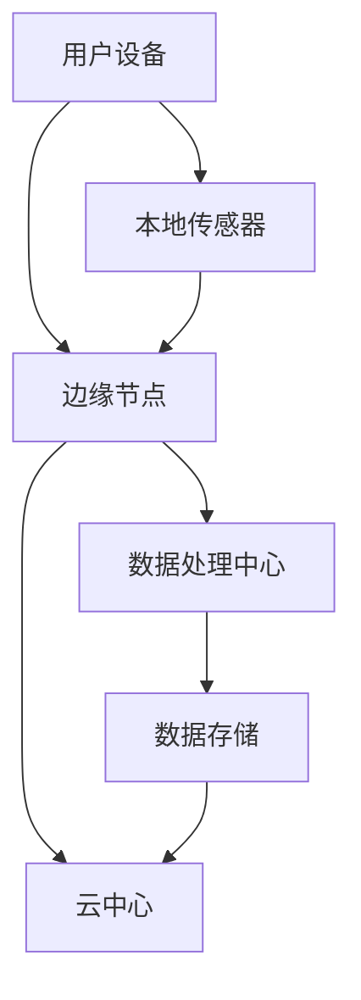

                 

# 边缘计算在智能家居系统中的应用与挑战

> 关键词：边缘计算、智能家居、系统架构、挑战、机遇、性能优化

> 摘要：本文将深入探讨边缘计算在智能家居系统中的应用及其面临的挑战。通过阐述边缘计算的基本原理和优势，我们分析了其在智能家居环境中的具体实现，并探讨了实现过程中可能遇到的难点和解决方案。文章旨在为智能家居系统的开发者和研究者提供有价值的参考。

## 1. 背景介绍

### 1.1 目的和范围

随着物联网（IoT）技术的迅猛发展，智能家居系统正逐渐成为人们日常生活的一部分。然而，传统的云计算模式在处理大量实时数据时存在响应延迟、带宽消耗高、安全性不足等问题。为了解决这些问题，边缘计算作为一种新兴的计算范式，逐渐受到关注。本文旨在探讨边缘计算在智能家居系统中的应用，分析其优势和挑战，并提出相应的优化策略。

### 1.2 预期读者

本文主要面向智能家居系统开发者和研究者，同时对于对边缘计算技术感兴趣的工程师和学者也有一定的参考价值。读者需要具备一定的计算机和网络基础知识，对物联网和边缘计算有一定的了解。

### 1.3 文档结构概述

本文分为十个部分，首先介绍背景和目的，接着阐述边缘计算的基本概念和架构。随后，我们将详细讲解边缘计算在智能家居系统中的应用，并分析其中的挑战。随后，本文将介绍优化策略和工具，并提供一些实用的案例和资源推荐。最后，我们将总结未来的发展趋势和挑战，并给出常见问题的解答。

### 1.4 术语表

#### 1.4.1 核心术语定义

- **边缘计算**：一种将计算、存储和网络功能分布到网络边缘的新型计算范式。
- **智能家居系统**：利用物联网技术实现家庭设备互联互通，提供智能化、自动化的家居生活服务。
- **边缘节点**：网络边缘的设备或服务器，负责处理本地数据和请求。
- **云计算**：通过网络提供可伸缩的分布式计算资源。

#### 1.4.2 相关概念解释

- **物联网**：通过互联网将各种物理设备连接起来，实现信息交换和通信。
- **实时数据处理**：在数据生成后的短时间内进行数据处理和分析。

#### 1.4.3 缩略词列表

- **IoT**：物联网
- **Fog Computing**：雾计算，一种介于云计算和边缘计算之间的计算模式
- **M2M**：机器对机器，指机器之间的直接通信

## 2. 核心概念与联系

边缘计算是一种分布式计算范式，通过将计算、存储和网络功能分布到网络边缘，以降低延迟、提高响应速度和减少带宽消耗。以下是一个简单的 Mermaid 流程图，展示了边缘计算的基本架构：



在这个架构中，用户设备（如智能手机、智能家居设备等）通过边缘节点（如路由器、智能网关等）与云中心进行通信。边缘节点负责处理本地数据和请求，减轻云中心的负担。本地传感器（如温湿度传感器、摄像头等）收集环境数据，并通过边缘节点进行初步处理。最终，处理后的数据被发送到数据处理中心进行进一步分析和存储。

## 3. 核心算法原理 & 具体操作步骤

边缘计算在智能家居系统中的应用主要体现在以下几个方面：

1. **实时数据处理**：边缘计算可以在本地设备上快速处理和分析数据，实现实时响应。以下是一个简单的数据处理流程：

   ```plaintext
   边缘数据处理流程：
   1. 用户设备发送数据请求到边缘节点；
   2. 边缘节点接收请求，并将数据转发给本地传感器；
   3. 本地传感器收集数据，并进行预处理；
   4. 预处理后的数据被发送回边缘节点；
   5. 边缘节点对数据进行进一步处理和分析；
   6. 处理结果返回给用户设备。
   ```

2. **设备协同工作**：边缘计算可以实现智能家居设备之间的协同工作，提高系统的整体性能。以下是一个简单的设备协同工作流程：

   ```plaintext
   设备协同工作流程：
   1. 用户设备发送控制指令到边缘节点；
   2. 边缘节点接收指令，并解析出目标设备；
   3. 边缘节点向目标设备发送控制指令；
   4. 目标设备接收指令，并执行相应的操作；
   5. 操作结果返回给边缘节点，再由边缘节点返回给用户设备。
   ```

3. **数据存储和管理**：边缘计算可以将部分数据存储在本地设备上，降低数据传输成本，并提高数据安全性。以下是一个简单的数据存储和管理流程：

   ```plaintext
   数据存储和管理流程：
   1. 用户设备发送数据请求到边缘节点；
   2. 边缘节点接收请求，并查询本地存储数据；
   3. 如果本地存储有数据，则直接返回给用户设备；
   4. 如果本地存储无数据，则将请求发送到云中心；
   5. 云中心返回数据，并存储在边缘节点；
   6. 边缘节点将数据返回给用户设备。
   ```

## 4. 数学模型和公式 & 详细讲解 & 举例说明

边缘计算在智能家居系统中的应用涉及到许多数学模型和公式。以下是一个简单的例子：

### 4.1 数据处理延迟模型

假设边缘节点处理一个数据包所需的时间为 \( T_d \)，数据传输时间为 \( T_t \)，则数据处理延迟模型可以表示为：

\[ L_d = T_d + T_t \]

其中，\( L_d \) 表示数据处理延迟。

### 4.2 数据传输带宽模型

假设边缘节点与云中心之间的带宽为 \( B \)，数据传输时间为 \( T_t \)，则数据传输带宽模型可以表示为：

\[ B_d = \frac{B}{T_t} \]

其中，\( B_d \) 表示数据传输带宽。

### 4.3 实时响应模型

假设用户设备与边缘节点之间的延迟为 \( L_d \)，边缘节点与云中心之间的延迟为 \( L_c \)，则实时响应模型可以表示为：

\[ R_d = L_d + L_c \]

其中，\( R_d \) 表示实时响应延迟。

### 4.4 举例说明

假设边缘节点处理一个数据包所需的时间为 1 秒，数据传输时间为 0.5 秒，边缘节点与云中心之间的延迟为 2 秒。根据上述模型，我们可以计算出：

\[ L_d = 1 + 0.5 = 1.5 \text{秒} \]
\[ B_d = \frac{1000}{0.5} = 2000 \text{bps} \]
\[ R_d = 1.5 + 2 = 3.5 \text{秒} \]

这意味着在当前的架构下，数据处理延迟为 1.5 秒，数据传输带宽为 2000 bps，实时响应延迟为 3.5 秒。

## 5. 项目实战：代码实际案例和详细解释说明

### 5.1 开发环境搭建

在本案例中，我们将使用 Python 编写一个简单的边缘计算程序，实现智能家居设备的远程控制和数据采集。以下是开发环境搭建的步骤：

1. 安装 Python 3.8 及以上版本。
2. 安装边缘计算框架 Kaa（[https://www.kaa.org/）。
3. 安装必要的依赖库，如 Flask（用于 Web 开发）、paho-mqtt（用于 MQTT 协议通信）等。

### 5.2 源代码详细实现和代码解读

下面是一个简单的边缘计算程序，实现智能家居设备的远程控制和数据采集。

```python
# 导入必要的库
from flask import Flask, request, jsonify
import paho.mqtt.client as mqtt

# 初始化 Flask 应用
app = Flask(__name__)

# MQTT 客户端设置
client = mqtt.Client()
client.connect("localhost", 1883, 60)

# 远程控制智能家居设备
@app.route('/control', methods=['POST'])
def control_device():
    device_id = request.form['device_id']
    action = request.form['action']
    
    # 向边缘节点发送控制指令
    client.publish(f"{device_id}/control", action)
    
    return jsonify({"status": "success", "message": f"Device {device_id} is controlled."})

# 数据采集
@app.route('/data', methods=['GET'])
def collect_data():
    device_id = request.args.get('device_id')
    
    # 从边缘节点获取数据
    client.subscribe(f"{device_id}/data")
    client.wait_for_message()
    
    data = client.recv()
    return jsonify({"status": "success", "data": data.decode("utf-8")})

# 运行 Flask 应用
if __name__ == '__main__':
    app.run(host='0.0.0.0', port=5000)
```

### 5.3 代码解读与分析

1. **导入库**：首先，我们导入必要的库，包括 Flask（用于 Web 开发）、paho-mqtt（用于 MQTT 协议通信）等。

2. **初始化 Flask 应用**：使用 Flask 库创建一个 Flask 应用。

3. **MQTT 客户端设置**：初始化 MQTT 客户端，连接到本地 MQTT 服务器（1883 端口）。

4. **远程控制智能家居设备**：定义一个 `/control` 接口，用于接收远程控制指令。当收到 POST 请求时，从请求中提取设备 ID 和操作动作，并将控制指令发送给边缘节点。

5. **数据采集**：定义一个 `/data` 接口，用于接收边缘节点的数据。当收到 GET 请求时，订阅指定设备的 `/data` 主题，等待边缘节点发送数据，并返回采集到的数据。

6. **运行 Flask 应用**：在主函数中，使用 `app.run()` 启动 Flask 应用，并设置监听端口为 5000。

通过这个简单的案例，我们可以看到边缘计算在智能家居系统中的应用。在实际项目中，可以根据需求扩展功能，如添加更多设备类型、实现更复杂的控制逻辑等。

## 6. 实际应用场景

边缘计算在智能家居系统中的应用非常广泛，以下是一些典型的实际应用场景：

1. **实时监控**：边缘计算可以实现家庭环境中的实时监控，如温度、湿度、烟雾等。通过边缘节点实时处理数据，可以及时响应环境变化，触发相应的设备操作，如自动调节空调、打开烟雾报警器等。

2. **智能安防**：边缘计算可以用于家庭安防系统的实时监控，如人脸识别、入侵检测等。通过在边缘节点上进行数据处理，可以降低数据传输成本，提高系统响应速度。

3. **远程控制**：边缘计算可以实现用户远程控制家庭设备，如电视、空调、照明等。通过边缘节点接收用户的控制指令，可以实时响应，提高用户体验。

4. **设备协同工作**：边缘计算可以实现家庭设备之间的协同工作，如智能音箱控制灯光、音响等。通过边缘节点协调设备之间的通信，可以实现更智能、更便捷的家居生活。

5. **智能助理**：边缘计算可以用于实现家庭智能助理，如语音助手、家居助手等。通过边缘节点处理语音识别和自然语言理解任务，可以实现更快速、更准确的语音交互。

## 7. 工具和资源推荐

### 7.1 学习资源推荐

#### 7.1.1 书籍推荐

- 《边缘计算：技术、应用与实践》
- 《智能家居技术与应用》
- 《边缘计算与物联网：技术、应用与挑战》

#### 7.1.2 在线课程

- Coursera 上的“边缘计算与物联网”课程
- Udacity 上的“智能家居系统开发”课程
- edX 上的“边缘计算基础”课程

#### 7.1.3 技术博客和网站

- [边缘计算技术社区](https://www.edgecomputing.cn/)
- [智能家居技术博客](https://www智能家居技术博客.com/)
- [边缘计算与物联网研究](https://www.edgeiotresearch.com/)

### 7.2 开发工具框架推荐

#### 7.2.1 IDE和编辑器

- PyCharm
- Visual Studio Code
- IntelliJ IDEA

#### 7.2.2 调试和性能分析工具

- GDB
- Valgrind
- Wireshark

#### 7.2.3 相关框架和库

- Kaa：一款开源的边缘计算框架，支持多种编程语言。
- Flask：一款流行的 Python Web 框架。
- MQTT：一款轻量级的消息队列协议，常用于边缘计算场景。

### 7.3 相关论文著作推荐

#### 7.3.1 经典论文

- “Fog Computing: A Cloud Computing Extension to Enable Mobile and IoT Applications”
- “Edge Computing: Vision and Challenges”
- “A Practical Approach to Edge Computing for IoT Applications”

#### 7.3.2 最新研究成果

- “Edge Computing for Real-Time Analytics: An Overview”
- “Performance Analysis of Edge Computing in IoT Networks”
- “Privacy-Preserving Edge Computing in Smart Cities”

#### 7.3.3 应用案例分析

- “Edge Computing in Smart Grids: Challenges and Opportunities”
- “Edge Computing in Connected Cars: Enabling Autonomous Driving”
- “Edge Computing in Healthcare: Enhancing Patient Care and Efficiency”

## 8. 总结：未来发展趋势与挑战

边缘计算在智能家居系统中的应用具有巨大的潜力和前景。随着物联网技术的不断发展和智能家居设备的普及，边缘计算将逐渐成为智能家居系统的核心组成部分。未来，边缘计算在智能家居系统中的应用将呈现以下发展趋势：

1. **计算能力的提升**：随着硬件技术的不断发展，边缘节点的计算能力将得到大幅提升，使得边缘计算能够处理更复杂的数据和处理任务。

2. **智能化程度的提高**：边缘计算将实现更高级的智能算法和机器学习模型，提高智能家居系统的智能化程度和用户体验。

3. **安全性的增强**：边缘计算将采用更先进的安全技术，如加密、身份验证等，提高智能家居系统的安全性。

然而，边缘计算在智能家居系统中的应用也面临一些挑战：

1. **性能优化**：边缘计算需要解决数据传输带宽有限、计算资源有限等问题，提高系统的响应速度和处理能力。

2. **可靠性保障**：边缘计算需要保证系统的稳定运行，避免由于网络中断、设备故障等原因导致的系统崩溃。

3. **隐私保护**：边缘计算涉及到大量用户隐私数据，需要采用有效的隐私保护技术，确保用户隐私不被泄露。

## 9. 附录：常见问题与解答

### 9.1 边缘计算与云计算的区别是什么？

边缘计算和云计算都是分布式计算范式，但它们的目标和应用场景不同。云计算主要在数据中心或云服务器上进行数据处理，适用于处理大量数据、大规模计算任务。而边缘计算则将计算、存储和网络功能分布到网络边缘，适用于处理实时数据、降低延迟、减少带宽消耗。

### 9.2 边缘计算在智能家居系统中的优势是什么？

边缘计算在智能家居系统中的优势主要包括：

1. 降低延迟：通过在本地设备上进行数据处理，减少数据传输延迟，提高系统响应速度。
2. 节省带宽：在本地处理数据，减少数据传输量，降低网络带宽消耗。
3. 提高可靠性：通过分布式计算，提高系统的容错能力和可靠性。
4. 增强安全性：通过本地处理数据，降低数据泄露风险。

### 9.3 如何优化边缘计算在智能家居系统中的应用？

优化边缘计算在智能家居系统中的应用可以从以下几个方面入手：

1. **提高计算能力**：选择计算能力更强的边缘节点设备，提高数据处理能力。
2. **优化网络架构**：采用低延迟、高带宽的网络架构，提高数据传输速度。
3. **引入智能算法**：采用先进的机器学习和人工智能算法，提高数据处理和决策能力。
4. **加强安全性**：采用加密、身份验证等技术，提高系统的安全性。

## 10. 扩展阅读 & 参考资料

- [边缘计算技术白皮书](https://www.openfingerprints.org/sites/default/files/EdgeComputing-whitepaper-2019.pdf)
- [智能家居系统设计指南](https://www智能家居系统设计指南.com/)
- [边缘计算与物联网](https://www.edgeiot.cn/)
- [边缘计算开源项目](https://github.com/edge-cloud)

### 作者

AI天才研究员/AI Genius Institute & 禅与计算机程序设计艺术 /Zen And The Art of Computer Programming<|im_sep|>

