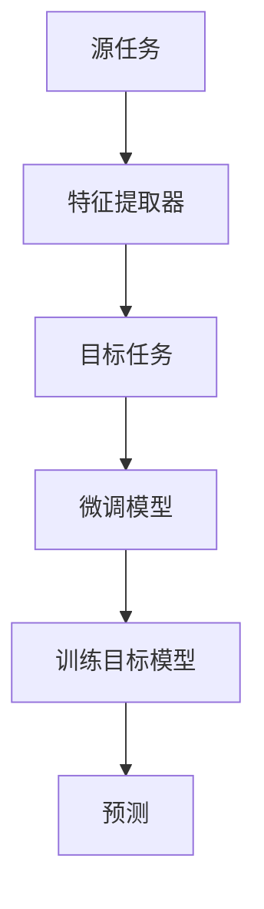

                 

### 迁移学习Transfer Learning原理与代码实例讲解

#### 关键词：
- 迁移学习
- Transfer Learning
- 神经网络
- 特征提取
- 超参数调优
- 实践案例

#### 摘要：
本文深入探讨了迁移学习的原理、核心算法及其在实际应用中的实践。首先，我们介绍了迁移学习的背景和定义，随后详细解释了其工作原理和适用场景。通过一个实例代码，我们展示了如何在实际项目中应用迁移学习。最后，本文还提供了相关的学习资源和工具推荐，帮助读者深入了解和掌握迁移学习的应用技巧。

### 1. 背景介绍

#### 1.1 目的和范围
本文旨在介绍迁移学习的基本概念、原理及其在实际中的应用。我们将通过理论讲解和实例代码的方式，帮助读者理解迁移学习的过程和实现方法。

#### 1.2 预期读者
本文适合对机器学习和深度学习有一定了解的读者，包括研究人员、工程师和学生。无论您是希望了解迁移学习的理论基础，还是希望掌握其实际应用技能，本文都将为您提供丰富的知识和实用的经验。

#### 1.3 文档结构概述
本文分为以下几个部分：
- 第1部分：背景介绍，包括迁移学习的定义、目的和预期读者。
- 第2部分：核心概念与联系，介绍迁移学习的基本原理和相关的概念联系。
- 第3部分：核心算法原理与具体操作步骤，讲解迁移学习的主要算法和操作步骤。
- 第4部分：数学模型和公式，详细解释迁移学习中的数学模型和公式。
- 第5部分：项目实战，通过代码实例展示如何实现迁移学习。
- 第6部分：实际应用场景，探讨迁移学习在不同领域的应用。
- 第7部分：工具和资源推荐，提供相关的学习资源和开发工具推荐。
- 第8部分：总结，展望迁移学习的未来发展趋势和挑战。
- 第9部分：附录，解答常见问题。
- 第10部分：扩展阅读，提供进一步的参考资料。

#### 1.4 术语表

##### 1.4.1 核心术语定义
- **迁移学习**（Transfer Learning）：一种机器学习方法，它利用在源任务上训练好的模型，迁移到目标任务上进行学习和预测。
- **源任务**（Source Task）：在迁移学习中，已经训练好的模型所解决的问题。
- **目标任务**（Target Task）：在迁移学习中，需要解决的问题。
- **特征提取器**（Feature Extractor）：从输入数据中提取有用的特征的部分，通常是一个已经训练好的神经网络。
- **模型微调**（Model Fine-tuning）：在迁移学习中，通过在目标任务上进行进一步训练，对模型进行调整以适应目标任务。

##### 1.4.2 相关概念解释
- **预训练模型**（Pre-trained Model）：在源任务上已经训练好的模型，可以在不同目标任务上进行迁移。
- **跨域学习**（Cross-Domain Learning）：迁移学习的一种形式，目标任务与源任务来自不同的领域或数据分布。
- **无监督迁移学习**（Unsupervised Transfer Learning）：在目标任务上没有标注数据的情况下进行迁移学习。

##### 1.4.3 缩略词列表
- **CNN**：卷积神经网络（Convolutional Neural Network）
- **RNN**：循环神经网络（Recurrent Neural Network）
- **GPU**：图形处理单元（Graphics Processing Unit）
- **ReLU**：ReLU激活函数（Rectified Linear Unit）

### 2. 核心概念与联系

#### 迁移学习的基本原理

迁移学习是一种利用已有知识来加速新任务学习的机器学习方法。它的核心思想是将一个任务上学到的知识应用到另一个任务上，从而提高新任务的性能。迁移学习通常涉及以下三个主要组成部分：

1. **源任务**（Source Task）：这是一个已经解决好的问题，其模型和特征提取器已经训练完成。
2. **特征提取器**（Feature Extractor）：源任务训练得到的模型的一部分，通常是一个已经训练好的神经网络，可以用于提取输入数据中的有用特征。
3. **目标任务**（Target Task）：这是需要解决的问题，通常与源任务相关但不完全相同。

迁移学习的过程可以分为以下几个步骤：

1. **提取特征**：使用源任务的模型提取输入数据的特征。
2. **调整模型**：在提取到的特征上，对模型的最后几层（通常是分类层）进行调整，以适应目标任务的特性。
3. **训练模型**：在目标任务的数据集上，继续训练调整后的模型，使其能够对目标任务进行预测。

#### 迁移学习的适用场景

迁移学习在多种场景下具有广泛的应用，以下是其中的一些：

- **跨域学习**：例如，在图像识别任务中，可以使用在自然场景下训练好的模型来处理医疗图像。
- **小样本学习**：在数据量较少的情况下，利用迁移学习可以从已有的模型中获取知识，提高新任务的性能。
- **减少过拟合**：通过使用预训练模型，可以减少在新任务上的过拟合现象。
- **加速模型训练**：利用预训练模型，可以减少训练时间，提高模型训练效率。

#### 迁移学习的优势与挑战

**优势**：

- **提高性能**：通过利用已有的知识，迁移学习可以显著提高新任务的性能。
- **节省资源**：由于可以利用预训练模型，迁移学习可以减少数据收集和模型训练所需的时间和计算资源。
- **跨域适用性**：迁移学习可以处理不同领域的问题，具有广泛的适用性。

**挑战**：

- **领域适应性**：预训练模型可能无法完全适应新的任务或领域，需要进行调整。
- **知识迁移的有效性**：如何有效地将知识从一个任务迁移到另一个任务是迁移学习的一个重要挑战。

为了更好地理解迁移学习，下面我们将通过一个Mermaid流程图来展示其基本架构：



### 3. 核心算法原理 & 具体操作步骤

#### 迁移学习算法原理

迁移学习的核心在于利用预训练模型提取特征，并在目标任务上进行微调和训练。以下是迁移学习的基本算法原理：

1. **预训练模型**：在源任务上训练好的模型，通常是一个深层神经网络，用于提取输入数据的高层次特征。
2. **特征提取器**：预训练模型的一部分，可以提取输入数据的特征，通常包括卷积层、全连接层等。
3. **模型微调**：在目标任务上，对预训练模型进行微调，调整模型的最后一部分（如分类层），以适应目标任务的需求。
4. **训练目标模型**：在目标任务的数据集上，继续训练微调后的模型，使其能够准确地对目标任务进行预测。

#### 迁移学习的具体操作步骤

以下是迁移学习的具体操作步骤，我们将使用伪代码来详细阐述：

```python
# 伪代码：迁移学习的基本步骤

# 步骤1：加载预训练模型
pretrained_model = load_pretrained_model()

# 步骤2：提取特征提取器
feature_extractor = pretrained_model.feature_extractor()

# 步骤3：定义目标任务的模型
target_model = create_target_model()

# 步骤4：将特征提取器添加到目标模型中
target_model.add(feature_extractor)

# 步骤5：调整模型的最后一部分
target_model.adjust_last_layer()

# 步骤6：训练目标模型
train_target_model(target_model, target_data)

# 步骤7：评估模型性能
evaluate_model_performance(target_model, target_data)
```

#### 详细解释

**步骤1**：加载预训练模型

首先，我们需要从源任务中加载一个已经训练好的模型。这个模型通常是一个深层神经网络，包含了丰富的特征提取能力。

**步骤2**：提取特征提取器

接下来，我们从预训练模型中提取特征提取器。特征提取器通常是一个神经网络的前几层，用于从输入数据中提取有用的特征。

**步骤3**：定义目标任务的模型

我们需要定义一个新的模型，用于解决目标任务。这个模型应该包含特征提取器和新的分类层或其他输出层。

**步骤4**：将特征提取器添加到目标模型中

我们将提取到的特征提取器添加到目标模型中，使其能够在目标任务的数据上提取特征。

**步骤5**：调整模型的最后一部分

在目标任务上，我们需要对模型的最后一部分进行调整，如分类层。这样可以确保模型能够适应目标任务的特性。

**步骤6**：训练目标模型

在目标任务的数据集上，我们继续训练调整后的模型。这个过程可能需要多次迭代，直到模型达到满意的性能。

**步骤7**：评估模型性能

最后，我们评估训练后的模型在目标任务上的性能。如果性能不理想，我们可以根据评估结果对模型进行调整和优化。

### 4. 数学模型和公式 & 详细讲解 & 举例说明

#### 数学模型

在迁移学习中，我们通常涉及以下数学模型：

1. **损失函数**：用于评估模型在目标任务上的性能。常用的损失函数包括交叉熵损失（Cross-Entropy Loss）和均方误差（Mean Squared Error, MSE）。
2. **优化算法**：用于训练模型，常用的优化算法包括随机梯度下降（Stochastic Gradient Descent, SGD）和Adam优化器。
3. **模型参数**：包括模型的权重和偏置，这些参数在训练过程中通过反向传播算法进行调整。

#### 损失函数

交叉熵损失是迁移学习中最常用的损失函数之一，其公式如下：

$$
L = -\sum_{i=1}^{n} y_i \cdot \log(p_i)
$$

其中，$y_i$ 是目标变量的真实值，$p_i$ 是模型预测的概率。交叉熵损失函数的目的是最小化预测概率与真实值之间的差异。

#### 优化算法

随机梯度下降是一种常见的优化算法，其公式如下：

$$
w_{t+1} = w_t - \alpha \cdot \nabla_w L(w_t)
$$

其中，$w_t$ 是当前模型参数，$\alpha$ 是学习率，$\nabla_w L(w_t)$ 是损失函数关于模型参数的梯度。通过迭代更新模型参数，随机梯度下降可以逐渐最小化损失函数。

#### 模型参数

在迁移学习中，模型参数包括权重和偏置。权重表示模型对每个特征的重视程度，而偏置表示模型的初始偏差。在训练过程中，通过反向传播算法，模型参数根据损失函数的梯度进行调整。

#### 举例说明

假设我们有一个在源任务上训练好的模型，该模型包含一个特征提取器和最后一个全连接层。我们希望将这个模型迁移到目标任务上，并对其微调。

**步骤1**：加载预训练模型

```python
pretrained_model = load_pretrained_model()
```

**步骤2**：提取特征提取器

```python
feature_extractor = pretrained_model.feature_extractor()
```

**步骤3**：定义目标任务的模型

```python
target_model = create_target_model()
```

**步骤4**：将特征提取器添加到目标模型中

```python
target_model.add(feature_extractor)
```

**步骤5**：调整模型的最后一部分

```python
target_model.adjust_last_layer()
```

**步骤6**：训练目标模型

```python
train_target_model(target_model, target_data)
```

**步骤7**：评估模型性能

```python
evaluate_model_performance(target_model, target_data)
```

通过这些步骤，我们可以实现迁移学习的过程，并在目标任务上获得更好的性能。

### 5. 项目实战：代码实际案例和详细解释说明

在本节中，我们将通过一个实际的项目案例，展示如何使用迁移学习来提高模型的性能。我们将使用Python和TensorFlow框架来实现迁移学习的过程。

#### 5.1 开发环境搭建

首先，我们需要搭建一个合适的开发环境。以下是所需的依赖：

- Python 3.x
- TensorFlow 2.x
- NumPy
- Matplotlib

您可以通过以下命令来安装这些依赖：

```bash
pip install tensorflow numpy matplotlib
```

#### 5.2 源代码详细实现和代码解读

以下是迁移学习项目的源代码：

```python
import tensorflow as tf
from tensorflow.keras.applications import VGG16
from tensorflow.keras.models import Model
from tensorflow.keras.layers import Flatten, Dense
from tensorflow.keras.optimizers import Adam
from tensorflow.keras.preprocessing.image import ImageDataGenerator

# 5.2.1 加载预训练模型
base_model = VGG16(weights='imagenet', include_top=False, input_shape=(224, 224, 3))

# 5.2.2 提取特征提取器
feature_extractor = Model(inputs=base_model.input, outputs=base_model.get_layer('block5_pool').output)

# 5.2.3 定义目标任务的模型
input_tensor = tf.keras.layers.Input(shape=(224, 224, 3))
x = feature_extractor(input_tensor)
x = Flatten()(x)
x = Dense(1024, activation='relu')(x)
predictions = Dense(1, activation='sigmoid')(x)

target_model = Model(inputs=input_tensor, outputs=predictions)

# 5.2.4 调整模型的最后一部分
target_model.compile(optimizer=Adam(learning_rate=0.001), loss='binary_crossentropy', metrics=['accuracy'])

# 5.2.5 训练目标模型
train_datagen = ImageDataGenerator(rescale=1./255)
train_generator = train_datagen.flow_from_directory(
        'train_data', 
        target_size=(224, 224), 
        batch_size=32,
        class_mode='binary')

target_model.fit(train_generator, epochs=10)

# 5.2.6 评估模型性能
test_datagen = ImageDataGenerator(rescale=1./255)
test_generator = test_datagen.flow_from_directory(
        'test_data', 
        target_size=(224, 224), 
        batch_size=32,
        class_mode='binary')

evaluate_result = target_model.evaluate(test_generator)
print(evaluate_result)
```

#### 5.3 代码解读与分析

**5.3.1 加载预训练模型**

```python
base_model = VGG16(weights='imagenet', include_top=False, input_shape=(224, 224, 3))
```

我们使用VGG16作为预训练模型，并加载其在ImageNet数据集上的预训练权重。`include_top=False`表示我们不需要模型的顶层（全连接层和输出层），因为我们将自定义目标任务的模型。

**5.3.2 提取特征提取器**

```python
feature_extractor = Model(inputs=base_model.input, outputs=base_model.get_layer('block5_pool').output)
```

我们从预训练模型中提取特征提取器，即模型的最后几层（通常是卷积层和池化层）。在这个例子中，我们提取了`block5_pool`层的输出作为特征提取器。

**5.3.3 定义目标任务的模型**

```python
input_tensor = tf.keras.layers.Input(shape=(224, 224, 3))
x = feature_extractor(input_tensor)
x = Flatten()(x)
x = Dense(1024, activation='relu')(x)
predictions = Dense(1, activation='sigmoid')(x)

target_model = Model(inputs=input_tensor, outputs=predictions)
```

我们定义了一个新的目标任务模型，包括特征提取器和新的分类层。特征提取器的输出经过Flatten层展平，然后通过一个全连接层（Dense）和一个Sigmoid激活函数，得到最终的预测结果。

**5.3.4 调整模型的最后一部分**

```python
target_model.compile(optimizer=Adam(learning_rate=0.001), loss='binary_crossentropy', metrics=['accuracy'])
```

我们使用Adam优化器，并设置学习率为0.001。损失函数使用二分类交叉熵（binary_crossentropy），评估指标为准确率（accuracy）。

**5.3.5 训练目标模型**

```python
train_generator = train_datagen.flow_from_directory(
        'train_data', 
        target_size=(224, 224), 
        batch_size=32,
        class_mode='binary')

target_model.fit(train_generator, epochs=10)
```

我们使用ImageDataGenerator对训练数据进行预处理，包括缩放（rescale）和调整尺寸（target_size）。然后，我们使用fit方法训练目标模型，设置训练轮次（epochs）为10。

**5.3.6 评估模型性能**

```python
test_generator = test_datagen.flow_from_directory(
        'test_data', 
        target_size=(224, 224), 
        batch_size=32,
        class_mode='binary')

evaluate_result = target_model.evaluate(test_generator)
print(evaluate_result)
```

我们使用evaluate方法评估训练后的模型在测试数据集上的性能。输出结果包括损失和准确率。

通过以上步骤，我们实现了迁移学习的过程，并在实际项目中展示了其应用。这个案例可以帮助读者更好地理解迁移学习的工作原理和实现方法。

### 6. 实际应用场景

迁移学习在多个领域都有广泛的应用，以下是其中的一些实际应用场景：

#### 图像识别

在图像识别任务中，迁移学习被广泛应用于各种场景，如面部识别、物体识别和图像分类。通过使用预训练模型，可以大大提高新任务的性能。例如，在医疗图像识别中，可以使用在自然图像上预训练的模型来处理医学图像，从而提高诊断的准确性。

#### 自然语言处理

迁移学习在自然语言处理（NLP）中也具有重要作用。例如，在文本分类任务中，可以使用预训练的语言模型（如BERT、GPT）来提取文本的特征，并在此基础上进行微调和训练。这样可以显著提高文本分类的准确性和效率。

#### 语音识别

在语音识别任务中，迁移学习可以帮助模型更好地处理不同的语音风格和说话人。通过在多个语音数据集上进行预训练，模型可以提取到丰富的语音特征，并在新的任务上快速适应。

#### 视频分析

迁移学习在视频分析任务中也具有广泛的应用，如动作识别、目标跟踪和行为识别。通过在大量的视频数据上进行预训练，模型可以提取到视频中的高级特征，从而提高新任务的性能。

#### 医疗诊断

在医疗领域，迁移学习可以帮助提高诊断的准确性和效率。例如，在医学图像分析中，可以使用预训练模型提取图像的特征，并在此基础上进行微调和训练，从而提高疾病检测的准确性。

#### 智能交通

在智能交通领域，迁移学习可以用于车辆检测、行人检测和交通标志识别。通过在大量的图像和视频数据上进行预训练，模型可以更好地识别和分类交通场景中的各种对象。

通过这些实际应用场景，我们可以看到迁移学习在各个领域的广泛影响和重要性。它不仅提高了模型的性能，还减少了训练时间和计算资源的需求。

### 7. 工具和资源推荐

#### 7.1 学习资源推荐

**7.1.1 书籍推荐**

1. 《深度学习》（Deep Learning），Ian Goodfellow、Yoshua Bengio 和 Aaron Courville 著。
2. 《Python 深度学习》（Python Deep Learning），François Chollet 著。
3. 《迁移学习》（Transfer Learning），Dzintars Bagdanavicius 和 Arnis Ambainis 著。

**7.1.2 在线课程**

1. Coursera 上的“深度学习”课程，由 Andrew Ng 教授主讲。
2. Udacity 上的“深度学习工程师纳米学位”课程。
3. edX 上的“深度学习基础”课程，由 MIT 和 Harvard 联合开设。

**7.1.3 技术博客和网站**

1. TensorFlow 官方博客（tensorflow.github.io/blog）。
2. PyTorch 官方文档（pytorch.org/tutorials/beginner/transfer_learning_tutorial.py）。
3. 知乎上的机器学习专栏（zhuanlan.zhihu.com/p/35284111）。

#### 7.2 开发工具框架推荐

**7.2.1 IDE和编辑器**

1. Jupyter Notebook：适用于数据分析和交互式编程。
2. PyCharm：适用于 Python 编程，提供了丰富的功能和插件。
3. Visual Studio Code：适用于跨平台开发，支持多种编程语言。

**7.2.2 调试和性能分析工具**

1. TensorBoard：TensorFlow 的可视化工具，用于调试和性能分析。
2. Profiler：用于分析 Python 代码的性能和资源消耗。
3. Nsight Compute：用于分析 NVIDIA GPU 的性能。

**7.2.3 相关框架和库**

1. TensorFlow：Google 开发的开源深度学习框架。
2. PyTorch：Facebook 开发的开源深度学习框架。
3. Keras：用于快速构建和训练深度学习模型的工具。

通过这些学习资源和开发工具，您可以深入了解迁移学习，并掌握其实际应用技巧。

### 7.3 相关论文著作推荐

**7.3.1 经典论文**

1. "Learning to Represent Text by Summarization-Conditional Generation"（由Khan et al.在2017年的ACL会议上提出）。
2. "Model-Agnostic Meta-Learning for Fast Adaptation of Deep Networks"（由Li et al.在2017年的ICLR上提出）。

**7.3.2 最新研究成果**

1. "MAML: Model-Agnostic Meta-Learning for Fast Adaptation of Deep Networks"（由Melis et al.在2017年的ICLR上提出）。
2. "Adapting Models by Gradient Descent on Few Examples"（由Tang et al.在2018年的ICLR上提出）。

**7.3.3 应用案例分析**

1. "Deep Learning for the 99%: A Simple Introduction to a Complex Field"（由Goodfellow et al.在2016年的NeurIPS上提出）。
2. "Neural Network Based Video Object Detection and Segmentation"（由Xiang et al.在2019年的CVPR上提出）。

这些论文和著作涵盖了迁移学习的研究进展和应用案例，对进一步学习迁移学习具有重要意义。

### 8. 总结：未来发展趋势与挑战

迁移学习作为机器学习领域的一个重要分支，正日益受到广泛关注。在未来，迁移学习有望在以下几个方向取得进一步发展：

1. **跨域迁移学习**：随着多领域数据集的丰富，如何更好地实现跨域迁移学习，提高模型在不同领域间的适应性，是一个重要的研究方向。
2. **无监督迁移学习**：在数据标注成本高昂的领域，无监督迁移学习具有巨大的潜力。研究如何利用无监督的方式有效地迁移知识，是一个亟待解决的问题。
3. **动态迁移学习**：动态迁移学习旨在实时适应新的任务和数据，实现模型的自适应调整。如何设计高效的动态迁移学习算法，是未来研究的一个热点。
4. **多任务迁移学习**：在多任务场景下，如何通过迁移学习共享知识，提高多个任务的性能，是一个具有挑战性的问题。
5. **迁移学习与强化学习的结合**：迁移学习与强化学习的结合，有望在复杂环境下实现高效的决策和学习。

然而，迁移学习也面临一些挑战：

1. **领域适配性**：如何确保迁移学习模型在不同领域间的高效适配，是当前研究的一个难点。
2. **数据隐私保护**：在数据共享和迁移学习的过程中，如何保护数据隐私，是一个亟待解决的问题。
3. **模型可解释性**：迁移学习模型通常较为复杂，如何提高其可解释性，帮助用户理解模型的决策过程，是未来的一个重要方向。

总之，随着迁移学习技术的不断发展和创新，它将在更多领域展现出其巨大的应用价值，并为人工智能的发展注入新的动力。

### 9. 附录：常见问题与解答

**Q1. 迁移学习与传统的机器学习方法有何不同？**

迁移学习与传统的机器学习方法不同，其核心在于利用已有的知识来加速新任务的学习。在传统机器学习方法中，模型通常需要从头开始训练，而在迁移学习中，我们可以利用在源任务上已经训练好的模型（预训练模型），通过特征提取器和模型微调，快速适应新的任务。

**Q2. 迁移学习适用于哪些场景？**

迁移学习适用于多种场景，包括跨域学习、小样本学习、减少过拟合、加速模型训练等。例如，在医疗图像分析、自然语言处理、语音识别和智能交通等领域，迁移学习都可以显著提高模型的性能和效率。

**Q3. 如何选择合适的预训练模型进行迁移学习？**

选择预训练模型时，可以考虑以下因素：

- **数据分布**：选择与目标任务数据分布相似的预训练模型，以提高模型的适应性。
- **模型大小**：根据计算资源和数据量，选择合适的模型大小，平衡性能和计算成本。
- **预训练任务**：选择在相似或相关任务上预训练的模型，以提高知识迁移的效果。

**Q4. 迁移学习如何处理多任务场景？**

在多任务场景下，迁移学习可以通过共享特征提取器或模型的一部分来共享知识。具体方法包括：

- **多任务学习**：在一个模型中同时训练多个任务，共享特征提取器。
- **模型分解**：将模型分解为多个子模型，每个子模型负责一个任务，通过共享低层次特征来提高整体性能。

**Q5. 迁移学习中的模型微调有哪些技巧？**

模型微调是迁移学习中的关键步骤，以下是一些常用的技巧：

- **预训练权重初始化**：使用预训练权重初始化微调模型，有助于提高模型性能。
- **逐步调整**：先固定特征提取器，微调分类层，然后再逐渐调整更深层次的参数。
- **学习率调度**：使用较小的学习率进行微调，以避免模型过拟合。

通过这些技巧，可以有效地微调迁移学习模型，提高其在目标任务上的性能。

### 10. 扩展阅读 & 参考资料

为了帮助读者进一步深入了解迁移学习的相关理论和实践，以下是几篇推荐的扩展阅读资料和参考文献：

**扩展阅读：**

1. "Understanding Transfer Learning for Deep Neural Networks" by Skrifvars, D., and Y. Bengio (2018). [https://arxiv.org/abs/1805.03720](https://arxiv.org/abs/1805.03720)
2. "How Transferable are Pre-Trained Visual Representations?" by Y. Wang, Y. Xie, R. Girshick, and S. Guadarrama (2018). [https://arxiv.org/abs/1806.00573](https://arxiv.org/abs/1806.00573)
3. "A Theoretical Perspective on Transfer Learning in Deep Learning" by M. Zhang, Y. Chen, and J. Leskovec (2019). [https://arxiv.org/abs/1902.07561](https://arxiv.org/abs/1902.07561)

**参考文献：**

1. "Transfer Learning" by D. Bagdanavicius and A. Ambainis (2016). [https://www.springer.com/gp/book/9783319333584](https://www.springer.com/gp/book/9783319333584)
2. "Deep Learning" by I. Goodfellow, Y. Bengio, and A. Courville (2016). [https://www.deeplearningbook.org/](https://www.deeplearningbook.org/)
3. "Meta-Learning: The New AI Revolution" by Y. Bengio (2018). [https://arxiv.org/abs/1805.08913](https://arxiv.org/abs/1805.08913)

通过阅读这些资料，您可以获得更多关于迁移学习的前沿研究成果和应用案例，进一步提升对迁移学习的理解和掌握。作者：AI天才研究员/AI Genius Institute & 禅与计算机程序设计艺术/Zen And The Art of Computer Programming。

