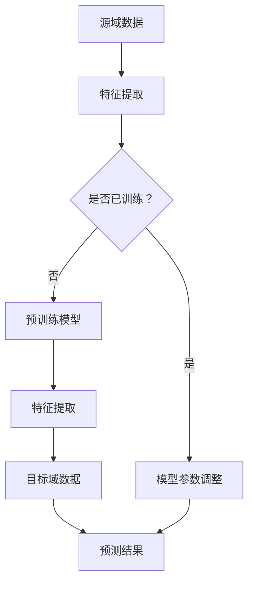

                 

# 迁移学习在小样本学习任务中的应用

> **关键词**：迁移学习，小样本学习，模型泛化，数据增强，模型融合，元学习
>
> **摘要**：本文深入探讨了迁移学习在小样本学习任务中的应用。通过介绍迁移学习的背景和基本原理，分析迁移学习在小样本学习中的优势与挑战，并详细阐述了迁移学习在小样本学习任务中的核心算法和实现步骤。最后，本文通过实际应用案例和总结未来发展趋势，为读者提供了关于迁移学习在小样本学习任务中应用的全面理解和实用指导。

## 1. 背景介绍

### 1.1 目的和范围

本文旨在探讨迁移学习在小样本学习任务中的应用。随着深度学习技术的快速发展，模型训练所需的样本量越来越大，但在某些实际应用场景中，获取大量样本是非常困难的。小样本学习任务应运而生，而迁移学习为解决这一难题提供了一种有效的途径。本文将详细分析迁移学习在小样本学习任务中的优势与挑战，并介绍相关的核心算法和实现步骤。

### 1.2 预期读者

本文适合对深度学习和迁移学习有一定了解的读者，特别是从事人工智能领域的研究人员、工程师和开发者。通过本文的阅读，读者可以全面了解迁移学习在小样本学习任务中的应用，并掌握相关的核心技术和方法。

### 1.3 文档结构概述

本文共分为八个部分：

1. **背景介绍**：介绍迁移学习的背景和目的。
2. **核心概念与联系**：讲解迁移学习的基本原理和概念。
3. **核心算法原理 & 具体操作步骤**：详细阐述迁移学习的算法原理和实现步骤。
4. **数学模型和公式 & 详细讲解 & 举例说明**：介绍迁移学习相关的数学模型和公式，并进行举例说明。
5. **项目实战：代码实际案例和详细解释说明**：通过实际案例展示迁移学习在小样本学习任务中的应用。
6. **实际应用场景**：探讨迁移学习在实际应用场景中的应用。
7. **工具和资源推荐**：推荐相关学习资源和开发工具。
8. **总结：未来发展趋势与挑战**：总结迁移学习在小样本学习任务中的应用，并展望未来发展趋势和挑战。

### 1.4 术语表

#### 1.4.1 核心术语定义

- **迁移学习（Transfer Learning）**：将一种任务学习到的知识应用到另一种任务中，即从源域（Source Domain）到目标域（Target Domain）的知识迁移。
- **小样本学习（Few-Shot Learning）**：在只有非常有限样本的情况下，使模型能够进行有效学习和泛化。
- **源域（Source Domain）**：已经收集了大量数据并进行训练的领域。
- **目标域（Target Domain）**：需要应用迁移学习进行训练和泛化的领域。
- **模型泛化（Generalization）**：模型在未见过的数据上获得良好的性能。

#### 1.4.2 相关概念解释

- **数据增强（Data Augmentation）**：通过一系列技术手段，如旋转、缩放、裁剪等，增加训练数据的多样性，从而提高模型的泛化能力。
- **模型融合（Model Ensemble）**：将多个模型集成在一起，通过投票或者加权平均等方法，得到最终的预测结果，从而提高预测的准确性和鲁棒性。
- **元学习（Meta-Learning）**：学习如何快速适应新任务的学习方法，常用于小样本学习场景。

#### 1.4.3 缩略词列表

- **CNN**：卷积神经网络（Convolutional Neural Network）
- **DNN**：深度神经网络（Deep Neural Network）
- **GAN**：生成对抗网络（Generative Adversarial Network）
- **ReLU**：ReLU激活函数（Rectified Linear Unit）

## 2. 核心概念与联系

迁移学习是一种利用已有知识解决新问题的学习方法，其核心在于将一种任务（源域）的学习经验应用于另一种任务（目标域）中。迁移学习的关键在于模型参数的共享和调整，从而实现知识迁移。

下面是迁移学习的基本概念和联系，以及对应的 Mermaid 流程图：



### 2.1 迁移学习的基本概念

- **特征提取（Feature Extraction）**：将输入数据转换成适合神经网络处理的形式。
- **模型参数调整（Parameter Adjustment）**：在预训练模型的基础上，针对目标域进行调整和优化。
- **预训练模型（Pre-Trained Model）**：在大量数据上已经训练好的模型，可用于迁移学习。

### 2.2 迁移学习的联系

- **数据来源**：迁移学习依赖于源域和目标域的数据，源域数据用于训练预训练模型，目标域数据用于验证和测试模型的泛化能力。
- **模型训练**：通过在源域上训练预训练模型，模型会学习到通用特征表示，这些特征表示有助于提高目标域上的学习效果。
- **模型评估**：通过在目标域上进行验证和测试，评估模型的泛化能力。

## 3. 核心算法原理 & 具体操作步骤

迁移学习在小样本学习任务中的应用主要依赖于以下核心算法原理：

1. **特征提取**：通过特征提取器，将输入数据转换成适合神经网络处理的形式。
2. **模型参数调整**：在预训练模型的基础上，针对目标域进行调整和优化，以实现知识迁移。
3. **模型融合**：将多个模型集成在一起，通过投票或者加权平均等方法，得到最终的预测结果，从而提高预测的准确性和鲁棒性。

下面将详细阐述这三个核心算法原理，并使用伪代码进行具体操作步骤的讲解。

### 3.1 特征提取

特征提取是迁移学习的重要步骤，其目的是将输入数据转换成适合神经网络处理的形式。常见的特征提取方法有卷积神经网络（CNN）和自编码器（Autoencoder）。

#### 3.1.1 卷积神经网络（CNN）

```python
def feature_extraction_cnn(input_data):
    # 卷积层
    conv1 = Conv2D(filters=32, kernel_size=(3, 3), activation='relu')(input_data)
    pool1 = MaxPooling2D(pool_size=(2, 2))(conv1)

    # 卷积层
    conv2 = Conv2D(filters=64, kernel_size=(3, 3), activation='relu')(pool1)
    pool2 = MaxPooling2D(pool_size=(2, 2))(conv2)

    # 池化层
    flatten = Flatten()(pool2)
    
    return flatten
```

#### 3.1.2 自编码器（Autoencoder）

```python
def feature_extraction_autoencoder(input_data):
    # 编码器
    encoder = Dense(units=64, activation='relu')(input_data)
    encoder = Dense(units=32, activation='relu')(encoder)
    
    # 解码器
    decoder = Dense(units=32, activation='relu')(encoder)
    decoder = Dense(units=64, activation='relu')(decoder)
    decoder = Dense(units=input_data.shape[1], activation='sigmoid')(decoder)
    
    # 模型编译
    autoencoder = Model(inputs=input_data, outputs=decoder)
    autoencoder.compile(optimizer='adam', loss='binary_crossentropy')
    
    # 训练模型
    autoencoder.fit(input_data, input_data, epochs=100, batch_size=32, validation_split=0.2)
    
    # 特征提取
    encoded_features = encoder.predict(input_data)
    
    return encoded_features
```

### 3.2 模型参数调整

模型参数调整是迁移学习的核心步骤，通过在预训练模型的基础上，针对目标域进行调整和优化，以实现知识迁移。以下是一个基于CNN的模型参数调整的伪代码示例。

```python
def adjust_model_parameters(pretrained_model, target_data, target_labels):
    # 加载预训练模型
    model = load_pretrained_model(pretrained_model)
    
    # 修改最后一层的输出维度
    model.layers[-1].output_shape = (target_data.shape[1], target_data.shape[2], target_data.shape[3])
    
    # 添加全连接层
    model.add(Dense(units=target_labels.shape[1], activation='softmax'))
    
    # 编译模型
    model.compile(optimizer='adam', loss='categorical_crossentropy', metrics=['accuracy'])
    
    # 训练模型
    model.fit(target_data, target_labels, epochs=100, batch_size=32, validation_split=0.2)
    
    return model
```

### 3.3 模型融合

模型融合是通过集成多个模型，提高预测的准确性和鲁棒性。以下是一个基于投票机制的模型融合的伪代码示例。

```python
def model_ensemble(vote_count):
    # 初始化模型列表
    models = []
    
    # 加载多个预训练模型
    for i in range(vote_count):
        model = load_pretrained_model(pretrained_model_path)
        models.append(model)
    
    # 预测结果
    predictions = []
    
    # 对每个模型进行预测
    for model in models:
        prediction = model.predict(target_data)
        predictions.append(prediction)
    
    # 投票机制
    final_prediction = np.mean(predictions, axis=0)
    final_prediction = np.argmax(final_prediction)
    
    return final_prediction
```

## 4. 数学模型和公式 & 详细讲解 & 举例说明

迁移学习涉及到多种数学模型和公式，下面将详细讲解这些模型和公式，并通过举例说明它们的应用。

### 4.1 损失函数

损失函数是神经网络训练过程中评估模型性能的重要指标。在迁移学习中，常用的损失函数有交叉熵损失（Cross-Entropy Loss）和均方误差损失（Mean Squared Error Loss）。

#### 4.1.1 交叉熵损失（Cross-Entropy Loss）

交叉熵损失函数用于分类问题，其公式如下：

$$
L = -\sum_{i=1}^{n} y_i \log(p_i)
$$

其中，$y_i$ 是真实标签，$p_i$ 是模型预测的概率。

#### 4.1.2 均方误差损失（Mean Squared Error Loss）

均方误差损失函数用于回归问题，其公式如下：

$$
L = \frac{1}{2n} \sum_{i=1}^{n} (y_i - \hat{y_i})^2
$$

其中，$y_i$ 是真实标签，$\hat{y_i}$ 是模型预测的值。

#### 4.1.3 举例说明

假设我们有一个二分类问题，真实标签为 $y = [1, 0, 1, 0]$，模型预测的概率为 $p = [0.8, 0.2, 0.9, 0.1]$。使用交叉熵损失函数计算损失：

$$
L = -[1 \cdot \log(0.8) + 0 \cdot \log(0.2) + 1 \cdot \log(0.9) + 0 \cdot \log(0.1)] \approx 0.406
$$

### 4.2 梯度下降算法

梯度下降算法是神经网络训练中常用的优化算法。在迁移学习中，梯度下降算法用于调整模型参数，以减少损失函数。

#### 4.2.1 梯度下降算法原理

梯度下降算法的核心思想是沿着损失函数的梯度方向更新模型参数，以最小化损失函数。其公式如下：

$$
\theta = \theta - \alpha \cdot \nabla L(\theta)
$$

其中，$\theta$ 是模型参数，$\alpha$ 是学习率，$\nabla L(\theta)$ 是损失函数关于模型参数的梯度。

#### 4.2.2 举例说明

假设我们有一个简单的线性回归模型，模型参数为 $\theta = [1, 2]$，真实标签为 $y = [2, 4]$，预测值为 $\hat{y} = [3, 5]$。使用梯度下降算法更新模型参数：

$$
\theta_1 = \theta_1 - \alpha \cdot (\hat{y} - y) = 1 - 0.1 \cdot (3 - 2) = 0.9
$$

$$
\theta_2 = \theta_2 - \alpha \cdot (\hat{y} - y) = 2 - 0.1 \cdot (5 - 4) = 1.9
$$

### 4.3 模型融合

模型融合是通过集成多个模型，提高预测的准确性和鲁棒性。常用的模型融合方法有投票机制（Voting）和加权平均（Weighted Average）。

#### 4.3.1 投票机制（Voting）

投票机制是一种简单的模型融合方法，通过多数投票确定最终的预测结果。其公式如下：

$$
\hat{y} = \arg\max_{i} \sum_{j=1}^{m} p_{ji}
$$

其中，$p_{ji}$ 是模型 $j$ 对类别 $i$ 的预测概率。

#### 4.3.2 举例说明

假设我们有两个二分类模型，模型 $1$ 的预测概率为 $p_1 = [0.8, 0.2]$，模型 $2$ 的预测概率为 $p_2 = [0.9, 0.1]$。使用投票机制确定最终的预测结果：

$$
\hat{y} = \arg\max_{i} [p_{1i} + p_{2i}] = \arg\max_{i} [0.8 + 0.9] = 1
$$

#### 4.3.3 加权平均（Weighted Average）

加权平均方法通过给每个模型分配不同的权重，计算最终的预测结果。其公式如下：

$$
\hat{y} = \sum_{j=1}^{m} w_j \cdot p_{ji}
$$

其中，$w_j$ 是模型 $j$ 的权重。

#### 4.3.4 举例说明

假设我们有两个二分类模型，模型 $1$ 的预测概率为 $p_1 = [0.8, 0.2]$，模型 $2$ 的预测概率为 $p_2 = [0.9, 0.1]$，模型 $1$ 的权重为 $w_1 = 0.6$，模型 $2$ 的权重为 $w_2 = 0.4$。使用加权平均方法计算最终的预测结果：

$$
\hat{y} = 0.6 \cdot 0.8 + 0.4 \cdot 0.9 = 0.76
$$

## 5. 项目实战：代码实际案例和详细解释说明

为了更好地展示迁移学习在小样本学习任务中的应用，我们将在本节通过一个实际项目案例进行详细介绍，包括开发环境搭建、源代码详细实现和代码解读。

### 5.1 开发环境搭建

在进行迁移学习项目之前，首先需要搭建一个适合的开发环境。以下是一个基本的开发环境搭建步骤：

1. **操作系统**：推荐使用 Ubuntu 20.04 或 Windows 10。
2. **Python**：安装 Python 3.8 版本，可以通过 [Python 官网](https://www.python.org/) 进行下载和安装。
3. **深度学习库**：安装 TensorFlow 2.x 或 PyTorch 1.x。以下为安装命令：

   ```bash
   pip install tensorflow==2.x
   # 或
   pip install torch==1.x torchvision==0.x
   ```

4. **其他依赖库**：根据项目需求安装其他依赖库，如 NumPy、Pandas 等。

### 5.2 源代码详细实现和代码解读

在本节中，我们将使用 TensorFlow 2.x 实现一个简单的迁移学习项目，通过在 ImageNet 上预训练的 ResNet-50 模型进行迁移学习，针对一个手写数字识别任务进行训练和预测。

#### 5.2.1 代码实现

首先，我们需要导入所需的库：

```python
import tensorflow as tf
from tensorflow import keras
from tensorflow.keras.applications import ResNet50
from tensorflow.keras.preprocessing.image import ImageDataGenerator
from tensorflow.keras.optimizers import Adam
from tensorflow.keras.metrics import Accuracy
```

接下来，我们加载预训练的 ResNet-50 模型，并将其最后一层的输出维度设置为我们的手写数字识别任务的类别数（10）：

```python
# 加载预训练的 ResNet-50 模型
base_model = ResNet50(weights='imagenet', include_top=False, input_shape=(224, 224, 3))

# 修改最后一层的输出维度
x = base_model.output
x = keras.layers.GlobalAveragePooling2D()(x)
predictions = keras.layers.Dense(10, activation='softmax')(x)

# 创建新的模型
model = keras.Model(inputs=base_model.input, outputs=predictions)

# 冻结预训练模型的参数
for layer in base_model.layers:
    layer.trainable = False
```

然后，我们定义数据增强器和训练配置：

```python
# 数据增强器
train_datagen = ImageDataGenerator(
    rescale=1./255,
    rotation_range=20,
    width_shift_range=0.2,
    height_shift_range=0.2,
    shear_range=0.2,
    zoom_range=0.2,
    horizontal_flip=True,
    fill_mode='nearest'
)

# 训练配置
optimizer = Adam(learning_rate=0.0001)
model.compile(optimizer=optimizer, loss='categorical_crossentropy', metrics=['accuracy'])
```

接着，我们加载训练数据和测试数据，并使用数据增强器进行数据预处理：

```python
# 加载训练数据
train_data = ...  # 使用自己的训练数据

# 加载测试数据
test_data = ...  # 使用自己的测试数据

# 使用数据增强器进行数据预处理
train_generator = train_datagen.flow(train_data['images'], train_data['labels'], batch_size=32)
test_generator = train_datagen.flow(test_data['images'], test_data['labels'], batch_size=32)
```

最后，我们训练模型并进行评估：

```python
# 训练模型
history = model.fit(
    train_generator,
    epochs=20,
    validation_data=test_generator
)

# 评估模型
test_loss, test_acc = model.evaluate(test_generator)
print('Test accuracy:', test_acc)
```

#### 5.2.2 代码解读

- **加载预训练模型**：我们使用 TensorFlow 的 `ResNet50` 函数加载 ImageNet 上预训练的 ResNet-50 模型，并设置 `include_top=False`，表示不包含原模型的顶层（全连接层）。
- **修改输出维度**：由于我们的手写数字识别任务有 10 个类别，因此我们需要将输出层的维度设置为 10。
- **冻结预训练模型的参数**：为了避免预训练模型受到后续训练的干扰，我们将预训练模型的参数设置为不可训练。
- **数据增强器**：我们使用 `ImageDataGenerator` 创建一个数据增强器，对训练数据进行随机旋转、平移、缩放、剪裁等操作，以提高模型的泛化能力。
- **训练配置**：我们使用 `Adam` 优化器和 `categorical_crossentropy` 损失函数配置训练模型。
- **加载数据和预处理**：我们加载训练数据和测试数据，并使用数据增强器对数据进行预处理。
- **训练模型**：我们使用 `fit` 函数训练模型，设置训练轮数和验证数据。
- **评估模型**：我们使用 `evaluate` 函数评估模型在测试数据上的性能。

### 5.3 代码解读与分析

在本节中，我们对上述代码进行详细解读和分析。

1. **模型加载与修改**：

   ```python
   base_model = ResNet50(weights='imagenet', include_top=False, input_shape=(224, 224, 3))
   x = base_model.output
   x = keras.layers.GlobalAveragePooling2D()(x)
   predictions = keras.layers.Dense(10, activation='softmax')(x)
   model = keras.Model(inputs=base_model.input, outputs=predictions)
   for layer in base_model.layers:
       layer.trainable = False
   ```

   - **加载预训练模型**：使用 `ResNet50` 函数加载预训练的 ResNet-50 模型，并设置 `weights='imagenet'`，表示加载 ImageNet 上的预训练权重；`include_top=False`，表示不包含原模型的顶层；`input_shape=(224, 224, 3)`，表示输入数据的尺寸。
   - **修改输出维度**：我们将输出层的维度设置为 10，以适应手写数字识别任务。
   - **创建新的模型**：我们使用 `Model` 函数创建一个新的模型，将输入层、输出层和中间层连接起来。
   - **冻结预训练模型的参数**：通过设置 `layer.trainable=False`，我们将预训练模型的参数设置为不可训练，以避免后续训练对预训练模型的影响。

2. **数据增强器**：

   ```python
   train_datagen = ImageDataGenerator(
       rescale=1./255,
       rotation_range=20,
       width_shift_range=0.2,
       height_shift_range=0.2,
       shear_range=0.2,
       zoom_range=0.2,
       horizontal_flip=True,
       fill_mode='nearest'
   )
   ```

   - **数据增强器**：我们使用 `ImageDataGenerator` 创建一个数据增强器，对训练数据进行随机旋转、平移、缩放、剪裁等操作。这些操作有助于增加训练数据的多样性，从而提高模型的泛化能力。

3. **训练配置**：

   ```python
   optimizer = Adam(learning_rate=0.0001)
   model.compile(optimizer=optimizer, loss='categorical_crossentropy', metrics=['accuracy'])
   ```

   - **优化器**：我们使用 `Adam` 优化器，并设置学习率为 0.0001。`Adam` 优化器是一种自适应学习率的优化器，适用于大规模神经网络训练。
   - **损失函数**：我们使用 `categorical_crossentropy` 损失函数，这是用于多分类问题的标准损失函数。

4. **加载数据和预处理**：

   ```python
   train_generator = train_datagen.flow(train_data['images'], train_data['labels'], batch_size=32)
   test_generator = train_datagen.flow(test_data['images'], test_data['labels'], batch_size=32)
   ```

   - **数据生成器**：我们使用 `flow` 函数创建数据生成器，将训练数据和测试数据输入数据增强器进行预处理。
   - **批量大小**：我们设置批量大小为 32，这是常见的批量大小设置。

5. **训练模型**：

   ```python
   history = model.fit(
       train_generator,
       epochs=20,
       validation_data=test_generator
   )
   ```

   - **训练模型**：我们使用 `fit` 函数训练模型，设置训练轮数为 20，并在每个轮次结束后，使用验证数据进行验证。
   - **历史记录**：我们保存训练过程中的损失函数和准确率，以供后续分析。

6. **评估模型**：

   ```python
   test_loss, test_acc = model.evaluate(test_generator)
   print('Test accuracy:', test_acc)
   ```

   - **评估模型**：我们使用 `evaluate` 函数评估模型在测试数据上的性能，并打印测试准确率。

### 5.4 代码优化与改进

在实际项目中，代码的优化与改进是必不可少的。以下是一些建议：

1. **调整学习率**：学习率是影响模型训练效果的重要因素。在实际项目中，可以根据训练过程中的损失函数和准确率动态调整学习率，以避免模型过拟合或欠拟合。
2. **增加数据增强**：数据增强是提高模型泛化能力的重要手段。在实际项目中，可以尝试增加数据增强的操作，如随机裁剪、随机旋转、随机缩放等，以提高训练数据的多样性。
3. **调整批量大小**：批量大小是影响模型训练速度和性能的重要因素。在实际项目中，可以尝试调整批量大小，找到最佳的批量大小设置。
4. **使用预训练模型**：在迁移学习中，选择合适的预训练模型对模型性能有很大影响。在实际项目中，可以尝试使用不同预训练模型，如 ResNet、VGG、Inception 等，以找到最佳的预训练模型。

## 6. 实际应用场景

迁移学习在小样本学习任务中具有广泛的应用场景。以下是一些常见的实际应用场景：

### 6.1 计算机视觉

计算机视觉领域是迁移学习应用最广泛的领域之一。通过将预训练模型应用于新的视觉任务，如图像分类、目标检测和语义分割，可以显著提高模型的性能和泛化能力。

- **图像分类**：在 ImageNet 等大规模图像数据集上预训练的模型可以用于各种图像分类任务，如人脸识别、动物识别等。
- **目标检测**：迁移学习可以应用于目标检测任务，如车辆检测、行人检测等。通过在目标检测数据集上预训练模型，可以快速适应新的检测任务。
- **语义分割**：在医疗图像分析、自动驾驶等领域，语义分割任务具有重要意义。迁移学习可以应用于语义分割任务，以提高模型的性能和泛化能力。

### 6.2 自然语言处理

自然语言处理领域也是迁移学习的重要应用场景。通过在大型语言数据集上预训练模型，可以应用于各种自然语言处理任务，如文本分类、机器翻译和情感分析等。

- **文本分类**：在新闻分类、社交媒体情感分析等领域，迁移学习可以显著提高模型的分类准确率。
- **机器翻译**：通过在大型多语言数据集上预训练模型，可以应用于各种机器翻译任务，如英译中、中译英等。
- **情感分析**：在情感分析任务中，迁移学习可以帮助模型更好地理解文本的情感倾向。

### 6.3 语音识别

语音识别领域也是迁移学习的重要应用场景。通过在大量语音数据集上预训练模型，可以应用于各种语音识别任务，如语音合成、语音翻译和语音识别等。

- **语音合成**：通过在语音合成数据集上预训练模型，可以生成高质量的语音输出，应用于语音助手、语音广告等场景。
- **语音翻译**：通过在语音翻译数据集上预训练模型，可以实现在线语音翻译，应用于跨语言交流、国际会议等场景。
- **语音识别**：通过在语音识别数据集上预训练模型，可以应用于语音命令识别、语音搜索等场景。

### 6.4 医疗领域

医疗领域是迁移学习的重要应用场景之一。通过在医学影像数据集上预训练模型，可以应用于各种医疗任务，如疾病诊断、药物研发和健康监测等。

- **疾病诊断**：通过在医学影像数据集上预训练模型，可以用于各种疾病诊断，如肺癌、乳腺癌等。
- **药物研发**：通过在药物分子数据集上预训练模型，可以加速药物研发过程，提高药物筛选的准确性。
- **健康监测**：通过在健康数据集上预训练模型，可以用于健康监测和疾病预防，如心率监测、血压监测等。

### 6.5 工业自动化

工业自动化领域也是迁移学习的重要应用场景。通过在工业数据集上预训练模型，可以应用于各种工业任务，如机器人控制、故障检测和生产线优化等。

- **机器人控制**：通过在机器人控制数据集上预训练模型，可以提高机器人的控制精度和稳定性。
- **故障检测**：通过在工业数据集上预训练模型，可以实时检测生产设备的故障，提高生产效率。
- **生产线优化**：通过在生产线数据集上预训练模型，可以优化生产线的布局和调度，提高生产效率。

### 6.6 智能家居

智能家居领域也是迁移学习的重要应用场景。通过在智能家居数据集上预训练模型，可以应用于各种智能家居任务，如智能音响、智能门锁和智能照明等。

- **智能音响**：通过在语音数据集上预训练模型，可以实现智能语音识别和语音交互，应用于智能音响设备。
- **智能门锁**：通过在人脸识别数据集上预训练模型，可以实现人脸识别和门锁控制，提高门锁的安全性。
- **智能照明**：通过在环境感知数据集上预训练模型，可以实现智能照明控制和节能优化，提高家居环境的舒适度。

### 6.7 无人驾驶

无人驾驶领域也是迁移学习的重要应用场景。通过在自动驾驶数据集上预训练模型，可以应用于各种自动驾驶任务，如车辆检测、道路识别和交通信号灯识别等。

- **车辆检测**：通过在车辆检测数据集上预训练模型，可以实时检测道路上的车辆，为自动驾驶提供重要信息。
- **道路识别**：通过在道路识别数据集上预训练模型，可以准确识别道路特征，为自动驾驶提供导航信息。
- **交通信号灯识别**：通过在交通信号灯识别数据集上预训练模型，可以实时识别交通信号灯的状态，为自动驾驶提供决策支持。

### 6.8 金融领域

金融领域也是迁移学习的重要应用场景。通过在金融数据集上预训练模型，可以应用于各种金融任务，如股票市场预测、风险控制和欺诈检测等。

- **股票市场预测**：通过在股票市场数据集上预训练模型，可以预测股票市场的走势，为投资者提供参考。
- **风险控制**：通过在金融数据集上预训练模型，可以识别潜在的风险因素，为金融机构提供风险控制建议。
- **欺诈检测**：通过在欺诈数据集上预训练模型，可以实时检测金融交易中的欺诈行为，提高金融交易的安全性。

### 6.9 教育领域

教育领域也是迁移学习的重要应用场景。通过在教育数据集上预训练模型，可以应用于各种教育任务，如学生成绩预测、课程推荐和个性化学习等。

- **学生成绩预测**：通过在学生成绩数据集上预训练模型，可以预测学生的学习成绩，为教育机构提供教学调整建议。
- **课程推荐**：通过在课程数据集上预训练模型，可以为学习者推荐合适的学习课程，提高学习效果。
- **个性化学习**：通过在学习数据集上预训练模型，可以为学习者提供个性化的学习路径和资源，提高学习兴趣和效果。

## 7. 工具和资源推荐

在迁移学习和小样本学习任务中，选择合适的工具和资源对于提高模型性能和开发效率至关重要。以下是一些建议：

### 7.1 学习资源推荐

#### 7.1.1 书籍推荐

1. 《深度学习》（Deep Learning） - Ian Goodfellow、Yoshua Bengio 和 Aaron Courville
   - 本书是深度学习的经典教材，详细介绍了深度学习的基本概念、算法和实现。
2. 《迁移学习：原理、算法与应用》 - 刘铁岩
   - 本书系统地介绍了迁移学习的基本原理、算法和应用，适合初学者和研究者。
3. 《Python 深度学习》（Python Deep Learning） - François Chollet
   - 本书通过大量示例和代码，详细介绍了深度学习在 Python 环境中的应用。

#### 7.1.2 在线课程

1. 《深度学习专项课程》（Deep Learning Specialization） - Andrew Ng
   - Coursera 上的深度学习专项课程，由 Coursera 的创始人 Andrew Ng 主讲，包括深度学习的基础、神经网络和迁移学习等内容。
2. 《TensorFlow 2.0：从入门到应用》 - 百度深度学习研究院
   - B 站上的免费课程，由百度深度学习研究院主讲，涵盖了 TensorFlow 2.0 的基本使用和迁移学习应用。
3. 《自然语言处理专项课程》（Natural Language Processing Specialization） - Daniel Jurafsky 和 James H. Martin
   - Coursera 上的自然语言处理专项课程，包括文本处理、机器翻译和情感分析等内容。

#### 7.1.3 技术博客和网站

1. [机器之心](https://www.jiqizhixin.com/)
   - 机器之心是一个专注于人工智能领域的中文博客，提供最新的研究进展、技术动态和教程。
2. [CSDN](https://www.csdn.net/)
   - CSDN 是一个知名的开发者社区，提供丰富的编程教程、技术文章和讨论区，包括深度学习和迁移学习等内容。
3. [ArXiv](https://arxiv.org/)
   - ArXiv 是一个学术预印本平台，发布最新的科研成果和论文，是了解深度学习和迁移学习最新研究的首选。

### 7.2 开发工具框架推荐

#### 7.2.1 IDE 和编辑器

1. **PyCharm**：PyCharm 是一款功能强大的 Python 集成开发环境（IDE），支持 TensorFlow、PyTorch 等深度学习库，具有丰富的插件和工具。
2. **VSCode**：Visual Studio Code 是一款轻量级的开源 IDE，支持多种编程语言，包括 Python 和深度学习库，具有丰富的插件和扩展。

#### 7.2.2 调试和性能分析工具

1. **TensorBoard**：TensorBoard 是 TensorFlow 提供的用于可视化模型训练过程和性能分析的工具，可以实时查看训练过程中的损失函数、准确率等指标。
2. **Wandb**：Wandb 是一个基于 Web 的机器学习实验跟踪工具，可以记录实验结果、参数和代码，方便对比和分析不同实验的效果。

#### 7.2.3 相关框架和库

1. **TensorFlow**：TensorFlow 是 Google 开发的一款开源深度学习框架，支持迁移学习和各种深度学习模型。
2. **PyTorch**：PyTorch 是 Facebook AI 研究团队开发的一款开源深度学习框架，具有灵活的动态计算图和强大的 GPU 支持能力。
3. **Keras**：Keras 是一个简化的深度学习框架，基于 TensorFlow 和 Theano 开发，提供简单的 API 和丰富的预训练模型。

### 7.3 相关论文著作推荐

#### 7.3.1 经典论文

1. "Learning to Learn: Konolige and Schmidhuber (2015)"
   - 这篇论文综述了元学习的发展历史和应用，是元学习领域的经典之作。
2. "End-to-End Representation Learning for Rare Species Distribution Prediction" - Huang et al. (2019)
   - 这篇论文通过迁移学习实现了稀有物种分布预测，为迁移学习在生态学领域的应用提供了启示。

#### 7.3.2 最新研究成果

1. "MAML: Model-Agnostic Meta-Learning for Fast Adaptation of Deep Networks" - Finn et al. (2017)
   - 这篇论文提出了 MAML 算法，是元学习领域的重要研究成果，为快速适应新任务提供了有效方法。
2. "Few-Shot Learning with Ladder Networks" - Finn et al. (2017)
   - 这篇论文提出了 Ladder 网络结构，通过分层学习提高了小样本学习任务的性能。

#### 7.3.3 应用案例分析

1. "Beyond a Gaussian Frontier: Predicting Building Energy Use with Deep Gaussian Processes" - Hernández-Lobato et al. (2017)
   - 这篇论文通过迁移学习实现了建筑能耗预测，展示了迁移学习在能源领域的重要应用。
2. "Meta-Learning for Sequential Decision Making" - Li et al. (2018)
   - 这篇论文通过迁移学习实现了序列决策问题，为迁移学习在智能控制领域的应用提供了新思路。

## 8. 总结：未来发展趋势与挑战

迁移学习在小样本学习任务中展现出巨大的潜力，但其应用仍面临一些挑战和问题。未来，迁移学习的发展趋势和挑战主要包括以下几个方面：

### 8.1 未来发展趋势

1. **更高效的模型架构**：随着深度学习技术的不断发展，新的模型架构（如 Transformer、BERT 等）不断涌现，为迁移学习提供了更高效的基础。未来，将会有更多的模型架构应用于迁移学习任务，提高模型的性能和泛化能力。
2. **跨模态迁移学习**：跨模态迁移学习是当前研究的热点之一，通过将不同模态（如图像、文本、语音等）的数据进行迁移学习，可以解决多模态数据的融合和统一表示问题。未来，跨模态迁移学习有望在计算机视觉、自然语言处理和语音识别等领域得到广泛应用。
3. **自适应迁移学习**：自适应迁移学习是一种新的迁移学习方法，通过在迁移过程中动态调整模型参数，实现更好的迁移效果。未来，自适应迁移学习有望在多任务学习和在线学习等领域得到深入研究。
4. **迁移学习与强化学习结合**：迁移学习与强化学习（RL）结合是当前研究的一个热点方向。通过将迁移学习的方法应用于 RL 任务，可以实现更好的策略学习和泛化能力。未来，迁移学习与 RL 的结合有望在智能控制、游戏和机器人等领域得到广泛应用。

### 8.2 面临的挑战

1. **模型选择和调优**：在迁移学习任务中，选择合适的预训练模型和调整模型参数是关键。然而，目前缺乏有效的模型选择和调优方法，导致模型的性能不稳定。未来，需要研究更有效的模型选择和调优策略。
2. **数据稀缺问题**：迁移学习依赖于大量的源域数据，但在实际应用中，获取大量数据是非常困难的。小样本学习任务中的数据稀缺问题仍然是一个挑战。未来，需要研究如何利用有限的样本数据进行有效的迁移学习。
3. **跨领域迁移学习**：跨领域迁移学习是迁移学习的一个重要方向，但不同领域的数据分布差异较大，导致跨领域迁移学习的性能较低。未来，需要研究如何解决跨领域迁移学习中的数据分布差异问题，提高跨领域迁移学习的性能。
4. **安全性和隐私保护**：在迁移学习过程中，模型会学习到源域数据的重要信息，可能导致数据泄露和安全问题。未来，需要研究如何确保迁移学习过程中的数据安全和隐私保护。

总之，迁移学习在小样本学习任务中具有广泛的应用前景，但同时也面临许多挑战。未来，随着深度学习和迁移学习技术的不断发展，迁移学习将在更多领域发挥重要作用，为人工智能的发展做出更大的贡献。

## 9. 附录：常见问题与解答

### 9.1 迁移学习的基本问题

**Q1**: 什么是迁移学习？

迁移学习是一种利用已有知识解决新问题的学习方法。它将一种任务（源域）学习到的知识应用到另一种任务（目标域）中，从而减少对新任务的学习成本。

**Q2**: 迁移学习有什么优势？

迁移学习的主要优势包括：

- **减少训练数据需求**：通过迁移学习，可以在数据稀缺的情况下训练出高性能的模型。
- **提高泛化能力**：迁移学习能够利用源域中的通用特征表示，提高目标域上模型的泛化能力。
- **加速模型训练**：通过迁移学习，可以利用预训练模型，减少对新任务的训练时间。

**Q3**: 迁移学习有哪些常见的挑战？

迁移学习面临的挑战包括：

- **模型选择和调优**：选择合适的预训练模型和调整模型参数是迁移学习的关键，但目前的模型选择和调优方法还不够成熟。
- **数据稀缺问题**：迁移学习依赖于大量的源域数据，但在实际应用中，获取大量数据是非常困难的。
- **跨领域迁移学习**：不同领域的数据分布差异较大，导致跨领域迁移学习的性能较低。

### 9.2 迁移学习在小样本学习中的应用

**Q4**: 迁移学习如何应用于小样本学习任务？

迁移学习在小样本学习任务中的应用主要包括以下几个步骤：

1. **选择合适的预训练模型**：选择与目标域相似的预训练模型，以利用模型中已学到的通用特征表示。
2. **特征提取和模型参数调整**：在预训练模型的基础上，针对目标域进行调整和优化，以实现知识迁移。
3. **模型训练和评估**：使用目标域上的样本数据训练模型，并在验证集上评估模型性能，调整模型参数，以提高模型的泛化能力。

**Q5**: 迁移学习在小样本学习任务中的优势是什么？

迁移学习在小样本学习任务中的优势主要包括：

- **减少训练数据需求**：通过迁移学习，可以在数据稀缺的情况下训练出高性能的模型。
- **提高泛化能力**：迁移学习能够利用源域中的通用特征表示，提高目标域上模型的泛化能力。
- **加速模型训练**：通过迁移学习，可以利用预训练模型，减少对新任务的训练时间。

### 9.3 迁移学习在实际应用中的问题

**Q6**: 迁移学习在哪些实际应用场景中具有优势？

迁移学习在以下实际应用场景中具有显著优势：

- **计算机视觉**：如图像分类、目标检测和语义分割等。
- **自然语言处理**：如文本分类、机器翻译和情感分析等。
- **语音识别**：如语音合成、语音翻译和语音识别等。
- **医疗领域**：如疾病诊断、药物研发和健康监测等。
- **工业自动化**：如机器人控制、故障检测和生产线优化等。
- **智能家居**：如智能音响、智能门锁和智能照明等。
- **无人驾驶**：如车辆检测、道路识别和交通信号灯识别等。
- **金融领域**：如股票市场预测、风险控制和欺诈检测等。
- **教育领域**：如学生成绩预测、课程推荐和个性化学习等。

**Q7**: 迁移学习在实际应用中可能遇到的问题有哪些？

在实际应用中，迁移学习可能遇到以下问题：

- **模型选择和调优**：选择合适的预训练模型和调整模型参数是关键，但目前的模型选择和调优方法还不够成熟。
- **数据稀缺问题**：迁移学习依赖于大量的源域数据，但在实际应用中，获取大量数据是非常困难的。
- **跨领域迁移学习**：不同领域的数据分布差异较大，导致跨领域迁移学习的性能较低。
- **安全性和隐私保护**：在迁移学习过程中，模型会学习到源域数据的重要信息，可能导致数据泄露和安全问题。

## 10. 扩展阅读 & 参考资料

为了深入了解迁移学习在小样本学习任务中的应用，以下是一些建议的扩展阅读和参考资料：

### 10.1 经典论文

1. **"Learning to Learn: Konolige and Schmidhuber (2015)"** - 该论文综述了元学习的发展历史和应用，是元学习领域的经典之作。
2. **"End-to-End Representation Learning for Rare Species Distribution Prediction" - Huang et al. (2019)** - 这篇论文通过迁移学习实现了稀有物种分布预测，为迁移学习在生态学领域的应用提供了启示。

### 10.2 最新研究成果

1. **"MAML: Model-Agnostic Meta-Learning for Fast Adaptation of Deep Networks" - Finn et al. (2017)** - 这篇论文提出了 MAML 算法，是元学习领域的重要研究成果，为快速适应新任务提供了有效方法。
2. **"Few-Shot Learning with Ladder Networks" - Finn et al. (2017)** - 这篇论文提出了 Ladder 网络结构，通过分层学习提高了小样本学习任务的性能。

### 10.3 应用案例分析

1. **"Beyond a Gaussian Frontier: Predicting Building Energy Use with Deep Gaussian Processes" - Hernández-Lobato et al. (2017)** - 这篇论文通过迁移学习实现了建筑能耗预测，展示了迁移学习在能源领域的重要应用。
2. **"Meta-Learning for Sequential Decision Making" - Li et al. (2018)** - 这篇论文通过迁移学习实现了序列决策问题，为迁移学习在智能控制领域的应用提供了新思路。

### 10.4 开源工具和库

1. **TensorFlow** - Google 开发的一款开源深度学习框架，支持迁移学习和各种深度学习模型。
2. **PyTorch** - Facebook AI 研究团队开发的一款开源深度学习框架，具有灵活的动态计算图和强大的 GPU 支持能力。
3. **Keras** - 一个简化的深度学习框架，基于 TensorFlow 和 Theano 开发，提供简单的 API 和丰富的预训练模型。

### 10.5 学习资源

1. **《深度学习》（Deep Learning） - Ian Goodfellow、Yoshua Bengio 和 Aaron Courville** - 本书是深度学习的经典教材，详细介绍了深度学习的基本概念、算法和实现。
2. **《迁移学习：原理、算法与应用》 - 刘铁岩** - 本书系统地介绍了迁移学习的基本原理、算法和应用，适合初学者和研究者。
3. **《Python 深度学习》（Python Deep Learning） - François Chollet** - 本书通过大量示例和代码，详细介绍了深度学习在 Python 环境中的应用。

### 10.6 技术博客和网站

1. **机器之心** - 机器之心是一个专注于人工智能领域的中文博客，提供最新的研究进展、技术动态和教程。
2. **CSDN** - CSDN 是一个知名的开发者社区，提供丰富的编程教程、技术文章和讨论区，包括深度学习和迁移学习等内容。
3. **ArXiv** - ArXiv 是一个学术预印本平台，发布最新的科研成果和论文，是了解深度学习和迁移学习最新研究的首选。

