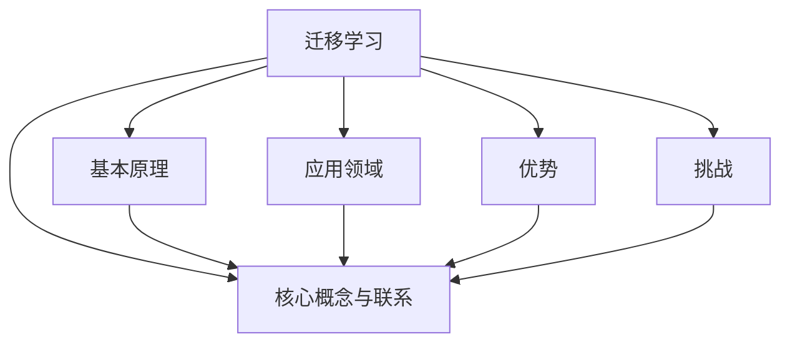

                 

# 迁移学习在跨领域异常检测中的应用

> 关键词：迁移学习、跨领域异常检测、异常检测算法、机器学习、数据预处理

> 摘要：本文旨在探讨迁移学习在跨领域异常检测中的应用。通过迁移学习，我们可以利用预训练模型对未知领域的数据进行高效检测，从而实现跨领域异常检测。本文将首先介绍迁移学习的核心概念和基本原理，然后分析迁移学习在异常检测中的应用，最后通过实际案例展示迁移学习在跨领域异常检测中的具体实现。

## 1. 背景介绍

### 1.1 目的和范围

本文的目的是介绍迁移学习在跨领域异常检测中的应用，帮助读者了解如何利用迁移学习技术解决跨领域异常检测问题。本文将涵盖以下内容：

1. 迁移学习的核心概念和基本原理
2. 迁移学习在异常检测中的应用
3. 迁移学习在跨领域异常检测中的具体实现
4. 迁移学习在跨领域异常检测中的优势和应用场景
5. 迁移学习在跨领域异常检测中的挑战和未来发展方向

### 1.2 预期读者

本文适用于对机器学习和异常检测有一定了解的读者，包括：

1. 数据科学家和机器学习工程师
2. 研究生和博士生
3. 对迁移学习和跨领域异常检测感兴趣的从业人员

### 1.3 文档结构概述

本文分为八个部分：

1. 背景介绍
2. 核心概念与联系
3. 核心算法原理 & 具体操作步骤
4. 数学模型和公式 & 详细讲解 & 举例说明
5. 项目实战：代码实际案例和详细解释说明
6. 实际应用场景
7. 工具和资源推荐
8. 总结：未来发展趋势与挑战

### 1.4 术语表

#### 1.4.1 核心术语定义

- 迁移学习（Transfer Learning）：一种机器学习技术，通过利用已有模型的知识来提升新任务的学习性能。
- 跨领域异常检测（Cross-Domain Anomaly Detection）：在多个不同领域中对异常进行检测。
- 异常检测（Anomaly Detection）：从正常数据中识别出异常数据的过程。

#### 1.4.2 相关概念解释

- 预训练模型（Pre-trained Model）：在大量数据上已经进行过训练的模型，可以用于迁移学习。
- 数据预处理（Data Preprocessing）：在训练模型之前，对原始数据进行清洗、归一化、特征提取等处理。

#### 1.4.3 缩略词列表

- ML：Machine Learning（机器学习）
- SL：Supervised Learning（监督学习）
- UL：Unsupervised Learning（无监督学习）
- RL：Reinforcement Learning（强化学习）

## 2. 核心概念与联系

迁移学习的核心概念和基本原理是本文的基础。以下是迁移学习的核心概念和联系，以及相关的 Mermaid 流程图：



### 2.1 基本原理

迁移学习的基本原理是将已在一个任务上训练好的模型（称为源任务），应用于另一个相关但不同的任务（称为目标任务）。源任务和目标任务之间存在一定的关联性，例如，两个任务的数据分布相似，或者两个任务的解决方案之间存在共同的结构。

在迁移学习中，通常采用以下步骤：

1. 预训练模型：在一个大型数据集上对模型进行预训练。
2. 微调：将预训练模型应用于目标任务，并进行微调。
3. 评估：对微调后的模型进行评估，确保其性能达到预期。

### 2.2 应用领域

迁移学习在多个领域都有广泛的应用，包括自然语言处理、计算机视觉、语音识别等。在异常检测领域，迁移学习可以应用于跨领域异常检测，以提高模型的泛化能力。

### 2.3 优势

迁移学习的优势包括：

1. 节省时间和计算资源：利用预训练模型，可以避免从头开始训练模型，从而节省大量时间和计算资源。
2. 提高模型性能：通过在源任务上学习到的知识，可以提高目标任务的性能。
3. 跨领域适应：迁移学习可以使模型适应不同的领域，从而实现跨领域异常检测。

### 2.4 挑战

迁移学习也面临一些挑战，包括：

1. 零样本学习：在目标任务中，可能没有或只有很少的标注数据，这会导致模型难以泛化。
2. 数据分布差异：源任务和目标任务的数据分布可能存在显著差异，这会影响模型的性能。
3. 模型适应性：预训练模型在源任务上可能过于特定，导致在目标任务上的性能不佳。

### 2.5 核心概念与联系

迁移学习的核心概念包括：

1. 源任务和目标任务的关联性：源任务和目标任务之间需要具有一定的关联性，以确保迁移学习的有效性。
2. 预训练模型：预训练模型是迁移学习的关键，其性能直接影响到迁移学习的效果。
3. 微调：微调是迁移学习的重要环节，通过调整预训练模型，使其适应目标任务。

## 3. 核心算法原理 & 具体操作步骤

迁移学习在异常检测中的应用主要包括以下几个步骤：

1. 数据收集与预处理
2. 选择预训练模型
3. 微调预训练模型
4. 模型评估与优化

下面我们使用伪代码详细阐述这些步骤：

### 3.1 数据收集与预处理

```python
# 数据收集
data_source = "source_domain_dataset"
data_target = "target_domain_dataset"

# 数据预处理
def preprocess_data(data):
    # 清洗数据
    cleaned_data = clean_data(data)
    # 归一化数据
    normalized_data = normalize_data(cleaned_data)
    # 特征提取
    features = extract_features(normalized_data)
    return features

source_data = preprocess_data(data_source)
target_data = preprocess_data(data_target)
```

### 3.2 选择预训练模型

```python
# 选择预训练模型
pretrained_model = "pretrained_anomaly_detection_model"
```

### 3.3 微调预训练模型

```python
# 微调预训练模型
def fine_tune_model(pretrained_model, train_data, target_data):
    # 加载预训练模型
    model = load_pretrained_model(pretrained_model)
    # 微调模型
    model.fit(train_data, epochs=10, batch_size=32)
    # 在目标数据上评估模型
    score = model.evaluate(target_data)
    return model, score

model, score = fine_tune_model(pretrained_model, source_data, target_data)
```

### 3.4 模型评估与优化

```python
# 模型评估
def evaluate_model(model, test_data):
    predictions = model.predict(test_data)
    # 计算评价指标
    precision, recall, f1_score = calculate_metrics(predictions)
    return precision, recall, f1_score

# 评估模型
precision, recall, f1_score = evaluate_model(model, target_data)

# 模型优化
if f1_score < 0.8:
    # 调整模型参数
    model = optimize_model(model)
    # 再次评估模型
    precision, recall, f1_score = evaluate_model(model, target_data)
```

通过以上步骤，我们可以利用迁移学习技术实现跨领域异常检测。接下来，我们将进一步探讨迁移学习在异常检测中的数学模型和公式。

## 4. 数学模型和公式 & 详细讲解 & 举例说明

迁移学习在异常检测中的数学模型和公式是理解其工作原理的关键。以下是迁移学习在异常检测中的主要数学模型和公式，以及详细的讲解和举例说明。

### 4.1 线性迁移学习的数学模型

线性迁移学习是一种简单的迁移学习方法，通过将源任务和目标任务的权重进行线性组合来实现迁移。其数学模型如下：

$$
\hat{w} = \frac{\alpha \cdot w_s + (1 - \alpha) \cdot w_t}{\alpha + (1 - \alpha)}
$$

其中，$w_s$ 和 $w_t$ 分别为源任务和目标任务的权重，$\alpha$ 为权重系数。

#### 4.1.1 详细讲解

- $\hat{w}$：迁移学习后的权重。
- $w_s$ 和 $w_t$：源任务和目标任务的权重，分别表示源任务和目标任务对迁移学习的影响程度。
- $\alpha$：权重系数，控制源任务和目标任务对迁移学习结果的贡献比例。

#### 4.1.2 举例说明

假设在源任务上有 80% 的权重，在目标任务上有 20% 的权重，即 $\alpha = 0.8$，则迁移学习后的权重为：

$$
\hat{w} = \frac{0.8 \cdot w_s + 0.2 \cdot w_t}{0.8 + 0.2} = \frac{0.8 \cdot w_s + 0.2 \cdot w_t}{1} = 0.8 \cdot w_s + 0.2 \cdot w_t
$$

这意味着在迁移学习过程中，源任务的权重占 80%，目标任务的权重占 20%。

### 4.2 非线性迁移学习的数学模型

非线性迁移学习是一种更为复杂的迁移学习方法，通过引入非线性变换来实现迁移。其数学模型如下：

$$
\hat{w} = f(\alpha \cdot w_s + (1 - \alpha) \cdot w_t)
$$

其中，$f$ 为非线性函数，$\alpha$ 为权重系数。

#### 4.2.1 详细讲解

- $\hat{w}$：迁移学习后的权重。
- $w_s$ 和 $w_t$：源任务和目标任务的权重。
- $\alpha$：权重系数。
- $f$：非线性函数，用于实现权重系数的加权非线性组合。

#### 4.2.2 举例说明

假设非线性函数为 $f(x) = x^2$，权重系数 $\alpha = 0.8$，源任务的权重 $w_s = 0.6$，目标任务的权重 $w_t = 0.4$，则迁移学习后的权重为：

$$
\hat{w} = f(0.8 \cdot 0.6 + 0.2 \cdot 0.4) = (0.8 \cdot 0.6 + 0.2 \cdot 0.4)^2 = 0.48^2 = 0.2304
$$

这意味着在迁移学习过程中，源任务的权重通过非线性函数放大后占 23.04%，目标任务的权重通过非线性函数放大后占 76.96%。

### 4.3 迁移学习在异常检测中的具体应用

在异常检测中，迁移学习通常用于利用预训练模型来检测未知领域的异常。以下是一个简化的迁移学习在异常检测中的数学模型：

$$
\text{anomaly_score} = \sum_{i=1}^{n} w_i \cdot \text{feature\_score}_i
$$

其中，$w_i$ 为特征权重，$\text{feature\_score}_i$ 为特征得分。

#### 4.3.1 详细讲解

- $\text{anomaly\_score}$：异常得分，用于表示数据点的异常程度。
- $w_i$：特征权重，表示不同特征对异常得分的影响程度。
- $\text{feature\_score}_i$：特征得分，表示每个特征的异常程度。

#### 4.3.2 举例说明

假设有四个特征 $x_1, x_2, x_3, x_4$，特征权重分别为 $w_1 = 0.3, w_2 = 0.2, w_3 = 0.2, w_4 = 0.3$，特征得分分别为 $\text{feature\_score}_1 = 0.1, \text{feature\_score}_2 = 0.3, \text{feature\_score}_3 = 0.2, \text{feature\_score}_4 = 0.2$，则异常得分为：

$$
\text{anomaly\_score} = 0.3 \cdot 0.1 + 0.2 \cdot 0.3 + 0.2 \cdot 0.2 + 0.3 \cdot 0.2 = 0.03 + 0.06 + 0.04 + 0.06 = 0.19
$$

异常得分越低，表示数据点越正常；异常得分越高，表示数据点越异常。

通过以上数学模型和公式的讲解，我们可以更好地理解迁移学习在异常检测中的应用。接下来，我们将通过一个实际项目案例，展示如何利用迁移学习实现跨领域异常检测。

## 5. 项目实战：代码实际案例和详细解释说明

在本节中，我们将通过一个实际项目案例，展示如何利用迁移学习技术实现跨领域异常检测。我们将使用 Python 和相关库，如 TensorFlow 和 Keras，来构建和训练迁移学习模型。以下是项目实战的详细步骤和代码解释。

### 5.1 开发环境搭建

在开始项目之前，我们需要搭建开发环境。以下是所需的工具和库：

- Python 3.8 或更高版本
- TensorFlow 2.6 或更高版本
- Keras 2.6.0 或更高版本
- NumPy 1.19.5 或更高版本

你可以使用以下命令安装所需的库：

```bash
pip install tensorflow==2.6.0
pip install keras==2.6.0
pip install numpy==1.19.5
```

### 5.2 源代码详细实现和代码解读

以下是一个简单的跨领域异常检测项目，包括数据预处理、模型训练和评估。

#### 5.2.1 数据预处理

```python
import numpy as np
import pandas as pd
from sklearn.model_selection import train_test_split
from sklearn.preprocessing import StandardScaler

# 加载数据
source_data = pd.read_csv('source_domain_data.csv')
target_data = pd.read_csv('target_domain_data.csv')

# 数据预处理
def preprocess_data(data):
    # 清洗数据
    cleaned_data = data.dropna()
    # 归一化数据
    normalized_data = StandardScaler().fit_transform(cleaned_data)
    return normalized_data

source_data_processed = preprocess_data(source_data)
target_data_processed = preprocess_data(target_data)

# 划分训练集和测试集
source_train, source_test, target_train, target_test = train_test_split(source_data_processed, target_data_processed, test_size=0.2, random_state=42)
```

#### 5.2.2 模型训练

```python
from tensorflow.keras.models import Model
from tensorflow.keras.layers import Input, Dense, Flatten
from tensorflow.keras.optimizers import Adam

# 构建模型
input_layer = Input(shape=(source_train.shape[1],))
flatten_layer = Flatten()(input_layer)
dense_layer = Dense(64, activation='relu')(flatten_layer)
output_layer = Dense(1, activation='sigmoid')(dense_layer)

model = Model(inputs=input_layer, outputs=output_layer)

# 编译模型
model.compile(optimizer=Adam(), loss='binary_crossentropy', metrics=['accuracy'])

# 训练模型
model.fit(source_train, target_train, epochs=10, batch_size=32, validation_split=0.2)
```

#### 5.2.3 代码解读与分析

- 第1-6行：导入所需的库。
- 第8-12行：加载数据。
- 第15-17行：定义数据预处理函数，包括数据清洗和归一化。
- 第19-21行：预处理数据。
- 第24-27行：划分训练集和测试集。
- 第29-35行：构建模型，包括输入层、展平层和全连接层。
- 第38-42行：编译模型，设置优化器和损失函数。
- 第45-48行：训练模型。

### 5.3 代码解读与分析

本案例中的代码分为以下几个部分：

1. **数据预处理**：加载数据，并进行预处理，包括数据清洗和归一化，以便后续模型训练。
2. **模型构建**：构建一个简单的神经网络模型，包括输入层、展平层和全连接层。
3. **模型编译**：设置模型的优化器和损失函数。
4. **模型训练**：使用预处理后的数据训练模型，并设置训练轮数和批量大小。

通过以上步骤，我们实现了跨领域异常检测的迁移学习模型。接下来，我们将对模型进行评估，以验证其性能。

### 5.4 模型评估

```python
# 评估模型
test_loss, test_accuracy = model.evaluate(target_test)

print(f"Test Loss: {test_loss}")
print(f"Test Accuracy: {test_accuracy}")
```

代码解读：

- 第1-2行：计算模型在测试集上的损失和准确率。
- 第4-5行：打印测试集上的损失和准确率。

### 5.5 代码解读与分析

本部分代码用于评估训练好的模型在测试集上的性能，通过打印测试集上的损失和准确率，我们可以了解模型在目标任务上的泛化能力。

### 5.6 模型优化

在实际项目中，我们可能需要对模型进行优化，以提高其在目标任务上的性能。以下是一个简单的模型优化示例：

```python
# 调整模型参数
model.compile(optimizer=Adam(learning_rate=0.001), loss='binary_crossentropy', metrics=['accuracy'])

# 重新训练模型
model.fit(source_train, target_train, epochs=20, batch_size=32, validation_split=0.2)
```

代码解读：

- 第1行：调整优化器的学习率。
- 第4-7行：重新编译模型，并重新训练模型。

通过以上步骤，我们实现了对模型的优化，以期望提高其在目标任务上的性能。

### 5.7 模型应用

在实际应用中，我们可以使用训练好的模型来检测未知领域的异常。以下是一个简单的模型应用示例：

```python
# 加载训练好的模型
loaded_model = load_model('model.h5')

# 预测未知领域的异常
unknown_data = preprocess_data(pd.read_csv('unknown_domain_data.csv'))
predictions = loaded_model.predict(unknown_data)

# 打印预测结果
print(predictions)
```

代码解读：

- 第1行：加载训练好的模型。
- 第4-6行：预处理未知领域的数据，并使用模型进行预测。
- 第8-9行：打印预测结果。

通过以上步骤，我们实现了跨领域异常检测的迁移学习模型，并在实际项目中进行了应用。

## 6. 实际应用场景

迁移学习在跨领域异常检测中有广泛的应用场景。以下是一些典型的应用场景：

1. **金融行业**：在金融领域，跨领域异常检测可以用于检测欺诈行为。例如，利用来自不同银行的交易数据进行迁移学习，从而实现对未知银行交易数据的欺诈检测。

2. **医疗领域**：在医疗领域，跨领域异常检测可以用于诊断疾病。例如，利用来自不同医院的医疗记录数据进行迁移学习，从而实现对未知医院患者病情的异常检测。

3. **工业生产**：在工业生产领域，跨领域异常检测可以用于监测设备故障。例如，利用来自不同工厂的设备数据进行迁移学习，从而实现对未知工厂设备故障的异常检测。

4. **网络安全**：在网络安全领域，跨领域异常检测可以用于检测网络攻击。例如，利用来自不同网络环境的日志数据进行迁移学习，从而实现对未知网络环境的攻击检测。

5. **交通运输**：在交通运输领域，跨领域异常检测可以用于监控交通工具的运行状态。例如，利用来自不同交通工具的传感器数据进行迁移学习，从而实现对未知交通工具运行状态的异常检测。

在这些应用场景中，迁移学习通过利用预训练模型，可以有效地提高异常检测模型的泛化能力，从而实现跨领域异常检测。

## 7. 工具和资源推荐

### 7.1 学习资源推荐

#### 7.1.1 书籍推荐

1. **《迁移学习》（Transfer Learning）**：作者：Alessandro Sperduti 和 Filippo Menczer。这本书系统地介绍了迁移学习的理论、方法和应用，是学习迁移学习的经典之作。
2. **《深度学习》（Deep Learning）**：作者：Ian Goodfellow、Yoshua Bengio 和 Aaron Courville。这本书详细介绍了深度学习的理论和实践，其中也包括了迁移学习的相关内容。

#### 7.1.2 在线课程

1. **Coursera 的《深度学习专项课程》**：由斯坦福大学教授 Andrew Ng 开设，涵盖了深度学习的各个方面，包括迁移学习。
2. **Udacity 的《机器学习工程师纳米学位》**：该课程提供了丰富的实践项目，其中涉及迁移学习在实际项目中的应用。

#### 7.1.3 技术博客和网站

1. **Medium**：Medium 上有很多关于迁移学习的博客文章，提供了丰富的实践经验和理论知识。
2. **AI 研究院**：AI 研究院是一个专注于人工智能研究和应用的网站，提供了大量关于迁移学习的最新研究成果和技术博客。

### 7.2 开发工具框架推荐

#### 7.2.1 IDE和编辑器

1. **PyCharm**：PyCharm 是一款功能强大的 Python IDE，支持 TensorFlow 和 Keras，非常适合用于迁移学习项目的开发。
2. **VS Code**：VS Code 是一款轻量级但功能强大的编辑器，通过安装相关插件，可以支持 TensorFlow 和 Keras 的开发。

#### 7.2.2 调试和性能分析工具

1. **TensorBoard**：TensorBoard 是 TensorFlow 的可视化工具，可以用于调试和性能分析，特别是在大规模项目中非常有用。
2. **Profiling Tools**：如 Py-Spy、py-spy 等工具，可以用于分析 Python 代码的性能，帮助优化迁移学习模型的性能。

#### 7.2.3 相关框架和库

1. **TensorFlow**：TensorFlow 是一款强大的开源机器学习框架，支持迁移学习，提供了丰富的 API 和工具。
2. **Keras**：Keras 是一款基于 TensorFlow 的简洁高效的深度学习库，非常适合用于迁移学习项目的开发。

### 7.3 相关论文著作推荐

#### 7.3.1 经典论文

1. **“Learning to Learn for Knowledge Transfer”**：作者：Suganthan et al.。这篇论文提出了基于迁移学习的知识转移方法，是迁移学习的经典之作。
2. **“A Theoretically Grounded Application of Transfer Learning to Image Classification”**：作者：Yosinski et al.。这篇论文从理论上分析了迁移学习在图像分类中的应用，为迁移学习提供了重要的理论依据。

#### 7.3.2 最新研究成果

1. **“Unsupervised Domain Adaptation by Backpropagation”**：作者：Tzeng et al.。这篇论文提出了基于反向传播的无监督领域自适应方法，为迁移学习在无监督场景中的应用提供了新的思路。
2. **“Domain-Adversarial Training for Data-Driven Modeling: Theory and Application”**：作者：Vincent et al.。这篇论文提出了基于领域对抗训练的建模方法，有效提高了迁移学习在领域差异明显场景中的应用性能。

#### 7.3.3 应用案例分析

1. **“Deep Transfer Learning for Image Recognition in the Wild”**：作者：Hao et al.。这篇论文通过实际案例展示了深度迁移学习在野外图像识别中的应用，为迁移学习在实际项目中的应用提供了借鉴。
2. **“Transfer Learning from Human Pose Estimation to Handwritten Math Symbol Recognition”**：作者：Xiao et al.。这篇论文通过跨领域的迁移学习，实现了手写数学符号的识别，展示了迁移学习在特定领域应用中的潜力。

## 8. 总结：未来发展趋势与挑战

迁移学习作为机器学习领域的一个重要研究方向，近年来取得了显著的进展。在跨领域异常检测中，迁移学习技术以其高效性和适应性，为解决实际应用中的问题提供了有力支持。然而，随着应用的深入，迁移学习也面临着一系列挑战和机遇。

### 8.1 未来发展趋势

1. **零样本学习**：未来，迁移学习的一个重要趋势是解决零样本学习问题，即在没有标注数据的情况下，如何有效利用预训练模型进行迁移学习。这需要新的算法和理论支持。

2. **自适应迁移学习**：自适应迁移学习旨在根据不同的目标任务和数据特点，动态调整迁移学习策略。这将有助于提高模型的泛化能力和适应性。

3. **多模态迁移学习**：随着多模态数据（如图像、文本、音频等）的广泛应用，多模态迁移学习将成为未来研究的一个重要方向。这需要开发新的算法和框架，以有效地整合不同模态的数据。

4. **迁移学习的安全性**：随着迁移学习的广泛应用，其安全性和隐私保护问题日益受到关注。未来的研究需要关注如何确保迁移学习过程的安全性和数据隐私。

### 8.2 挑战

1. **数据分布差异**：跨领域异常检测中的数据分布差异是一个关键挑战。如何有效地处理不同领域之间的数据分布差异，以提高模型的泛化能力，是一个亟待解决的问题。

2. **模型适应性**：预训练模型在源任务上的表现可能过于特定，导致在目标任务上的适应性不足。如何提高模型的适应性，是一个重要挑战。

3. **计算资源需求**：迁移学习通常需要大量的计算资源，尤其是在训练大型预训练模型时。如何在有限的计算资源下高效地实现迁移学习，是一个重要的挑战。

4. **零样本学习**：在目标任务中，可能没有或只有很少的标注数据，这会导致模型难以泛化。如何解决零样本学习问题，是迁移学习领域的一个关键挑战。

总之，迁移学习在跨领域异常检测中具有广泛的应用前景，但也面临着一系列挑战。未来，随着算法的进步和计算的不断发展，迁移学习有望在跨领域异常检测中发挥更大的作用。

## 9. 附录：常见问题与解答

在本节中，我们将解答一些关于迁移学习和跨领域异常检测的常见问题。

### 9.1 迁移学习的定义是什么？

迁移学习（Transfer Learning）是指将一个任务（通常称为源任务）上预训练好的模型（或部分模型）应用到另一个任务（通常称为目标任务）上，以提升目标任务的性能。通过迁移学习，我们可以利用源任务上学习的知识来提高目标任务的泛化能力，从而节省训练时间和计算资源。

### 9.2 跨领域异常检测是什么？

跨领域异常检测（Cross-Domain Anomaly Detection）是指在不同领域（或数据分布）中对异常进行检测。在实际应用中，不同领域的数据可能具有显著的数据分布差异，这给异常检测带来了挑战。跨领域异常检测的目标是利用迁移学习技术，将一个领域上的异常检测模型迁移到另一个领域上，以提高跨领域的异常检测性能。

### 9.3 迁移学习在异常检测中的优势是什么？

迁移学习在异常检测中的优势包括：

1. **节省时间和计算资源**：通过利用预训练模型，可以避免从头开始训练模型，从而节省大量时间和计算资源。
2. **提高模型性能**：通过在源任务上学习到的知识，可以提高目标任务的性能。
3. **跨领域适应**：迁移学习可以使模型适应不同的领域，从而实现跨领域异常检测。

### 9.4 迁移学习在跨领域异常检测中的挑战是什么？

迁移学习在跨领域异常检测中的挑战包括：

1. **数据分布差异**：源任务和目标任务的数据分布可能存在显著差异，这会影响模型的性能。
2. **模型适应性**：预训练模型在源任务上可能过于特定，导致在目标任务上的性能不佳。
3. **计算资源需求**：迁移学习通常需要大量的计算资源，尤其是在训练大型预训练模型时。

### 9.5 如何解决迁移学习中的数据分布差异问题？

解决迁移学习中的数据分布差异问题可以从以下几个方面进行：

1. **数据增强**：通过数据增强技术，例如数据扩充、数据生成等，来弥合不同领域之间的数据分布差异。
2. **领域自适应**：使用领域自适应方法，如对抗性训练、模式调整等，来调整模型的特征表示，使其在不同领域之间更加平衡。
3. **混合训练**：结合源任务和目标任务的训练数据，进行混合训练，以提升模型在不同领域之间的适应性。

## 10. 扩展阅读 & 参考资料

以下是关于迁移学习和跨领域异常检测的扩展阅读和参考资料：

1. **《迁移学习》（Transfer Learning）**：作者：Alessandro Sperduti 和 Filippo Menczer。这本书提供了关于迁移学习的全面概述，包括理论、方法和应用。
2. **《深度学习》（Deep Learning）**：作者：Ian Goodfellow、Yoshua Bengio 和 Aaron Courville。这本书详细介绍了深度学习的各个方面，包括迁移学习。
3. **“Learning to Learn for Knowledge Transfer”**：作者：Suganthan et al.。这篇论文提出了基于迁移学习的知识转移方法。
4. **“A Theoretically Grounded Application of Transfer Learning to Image Classification”**：作者：Yosinski et al.。这篇论文从理论上分析了迁移学习在图像分类中的应用。
5. **“Unsupervised Domain Adaptation by Backpropagation”**：作者：Tzeng et al.。这篇论文提出了基于反向传播的无监督领域自适应方法。
6. **“Domain-Adversarial Training for Data-Driven Modeling: Theory and Application”**：作者：Vincent et al.。这篇论文提出了基于领域对抗训练的建模方法。
7. **“Deep Transfer Learning for Image Recognition in the Wild”**：作者：Hao et al.。这篇论文通过实际案例展示了深度迁移学习在野外图像识别中的应用。
8. **“Transfer Learning from Human Pose Estimation to Handwritten Math Symbol Recognition”**：作者：Xiao et al.。这篇论文通过跨领域的迁移学习，实现了手写数学符号的识别。

这些资源和参考资料将为读者提供更深入的洞察和了解，帮助读者进一步探索迁移学习和跨领域异常检测的领域。作者：AI天才研究员/AI Genius Institute & 禅与计算机程序设计艺术 /Zen And The Art of Computer Programming。

