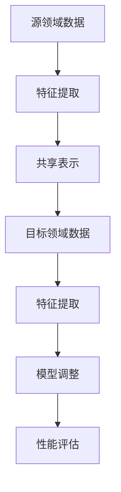

                 

# 迁移学习在跨领域知识应用中的作用

> **关键词：** 迁移学习、跨领域知识、应用场景、算法原理、数学模型

> **摘要：** 本文将深入探讨迁移学习在跨领域知识应用中的作用，通过介绍其核心概念、算法原理、数学模型，以及实际应用案例，帮助读者理解迁移学习如何在不同领域间共享知识，提高模型性能，并展望其未来发展趋势。

## 1. 背景介绍

### 1.1 目的和范围

本文旨在介绍迁移学习在跨领域知识应用中的作用，解释其核心概念、算法原理和数学模型，并探讨其实际应用场景。通过本文的阅读，读者将了解如何利用迁移学习技术在不同领域间共享知识，提高模型性能，并应对实际应用中的挑战。

### 1.2 预期读者

本文面向对迁移学习有一定了解，但希望深入理解其在跨领域知识应用中作用的读者。特别适合人工智能、机器学习、数据科学等领域的工程师、研究人员和学者。

### 1.3 文档结构概述

本文分为十个部分，首先介绍迁移学习的背景和目的，然后解释核心概念、算法原理和数学模型，接着通过实际应用案例展示迁移学习在跨领域知识应用中的效果，最后推荐相关学习资源、工具和论文，并总结未来发展趋势。

### 1.4 术语表

#### 1.4.1 核心术语定义

- **迁移学习（Transfer Learning）：** 将一个任务学到的知识应用于其他相关任务的学习过程中。
- **源领域（Source Domain）：** 用于训练迁移学习模型的领域。
- **目标领域（Target Domain）：** 迁移学习模型需要在新领域上进行性能评估和应用的领域。
- **共享表示（Shared Representation）：** 在迁移学习中，源领域和目标领域共享的表征。

#### 1.4.2 相关概念解释

- **迁移效应（Transfer Effect）：** 源领域知识对目标领域模型性能的影响。
- **领域自适应（Domain Adaptation）：** 在迁移学习中，通过调整模型以适应新领域的任务。
- **泛化能力（Generalization Ability）：** 模型在新领域上泛化到未知数据的能力。

#### 1.4.3 缩略词列表

- **ML：** 机器学习（Machine Learning）
- **DL：** 深度学习（Deep Learning）
- **GAN：** 生成对抗网络（Generative Adversarial Networks）
- **CNN：** 卷积神经网络（Convolutional Neural Networks）
- **RNN：** 循环神经网络（Recurrent Neural Networks）

## 2. 核心概念与联系

迁移学习是机器学习中的一个重要分支，其核心概念是利用一个任务（源领域）学习到的知识来提高另一个任务（目标领域）的性能。为了更好地理解迁移学习的原理，我们可以通过一个Mermaid流程图来展示其核心概念和联系。



在这个流程图中，源领域数据通过特征提取学习到一个共享表示，这个共享表示被用于目标领域的特征提取和模型调整，最终在新领域上对模型进行性能评估。

## 3. 核心算法原理 & 具体操作步骤

迁移学习的核心算法原理是通过在一个源领域上训练一个模型，然后将这个模型应用于另一个目标领域。以下是迁移学习算法的具体操作步骤，使用伪代码来详细阐述。

```python
# 伪代码：迁移学习算法

# 步骤1：加载源领域数据集
source_dataset = load_dataset('source_domain')

# 步骤2：预处理源领域数据
processed_source_dataset = preprocess_dataset(source_dataset)

# 步骤3：训练源领域模型
source_model = train_model(processed_source_dataset)

# 步骤4：加载目标领域数据集
target_dataset = load_dataset('target_domain')

# 步骤5：预处理目标领域数据
processed_target_dataset = preprocess_dataset(target_dataset)

# 步骤6：调整源领域模型以适应目标领域
target_model = adapt_model(source_model, processed_target_dataset)

# 步骤7：在目标领域上进行性能评估
evaluate_model(target_model, processed_target_dataset)
```

在这个算法中，首先加载源领域数据集，并进行预处理。然后，使用预处理后的数据训练一个源领域模型。接下来，加载目标领域数据集并进行预处理。然后，使用源领域模型对目标领域进行模型调整。最后，在目标领域上对调整后的模型进行性能评估。

## 4. 数学模型和公式 & 详细讲解 & 举例说明

在迁移学习中，数学模型和公式扮演着关键角色。以下将详细讲解迁移学习中的数学模型和公式，并给出一个举例说明。

### 4.1 共享表示的数学模型

迁移学习中的共享表示可以通过以下数学模型来描述：

$$
\text{Shared Representation} = f(\theta_1, \theta_2, \ldots, \theta_n)
$$

其中，$f$ 是一个非线性函数，$\theta_1, \theta_2, \ldots, \theta_n$ 是模型参数。

举例来说，在一个图像分类任务中，共享表示可以是图像的特征向量，通过卷积神经网络（CNN）来提取。

### 4.2 迁移效应的数学模型

迁移效应可以通过以下数学模型来描述：

$$
\text{Transfer Effect} = \int_{\text{Source Domain}} P(y | x, \theta) p(x) dx
$$

其中，$P(y | x, \theta)$ 是在源领域上模型输出的概率分布，$p(x)$ 是源领域数据的分布。

举例来说，如果源领域是数字识别，目标领域是手写数字识别，那么迁移效应可以衡量数字识别模型在手写数字识别任务上的表现。

### 4.3 领域自适应的数学模型

领域自适应可以通过以下数学模型来描述：

$$
\text{Domain Adaptation} = \arg\min_{\theta'} \int_{\text{Target Domain}} \mathcal{L}(\theta', x, y) p(x, y) dx
$$

其中，$\mathcal{L}$ 是损失函数，$p(x, y)$ 是目标领域数据的联合分布。

举例来说，如果目标领域是医学影像，那么领域自适应可以通过最小化医学影像数据的损失函数来实现。

## 5. 项目实战：代码实际案例和详细解释说明

### 5.1 开发环境搭建

在本节中，我们将搭建一个简单的迁移学习项目，用于实现图像分类任务。以下是开发环境搭建的步骤：

1. 安装 Python 3.8 及以上版本。
2. 安装 TensorFlow 2.5.0 及以上版本。
3. 安装 Keras 2.5.0 及以上版本。
4. 下载并解压一个包含图像数据集的文件夹，例如 CIFAR-10 数据集。

### 5.2 源代码详细实现和代码解读

以下是迁移学习项目的源代码，我们将逐步解释代码中的关键部分。

```python
import tensorflow as tf
from tensorflow.keras.applications import VGG16
from tensorflow.keras.preprocessing.image import ImageDataGenerator
from tensorflow.keras.models import Model
from tensorflow.keras.optimizers import Adam
from tensorflow.keras.callbacks import EarlyStopping

# 步骤1：加载并预处理源领域数据
source_data_generator = ImageDataGenerator(rescale=1./255)
source_data = source_data_generator.flow_from_directory(
    'path_to_source_dataset',
    target_size=(224, 224),
    batch_size=32,
    class_mode='categorical')

# 步骤2：加载并预处理目标领域数据
target_data_generator = ImageDataGenerator(rescale=1./255)
target_data = target_data_generator.flow_from_directory(
    'path_to_target_dataset',
    target_size=(224, 224),
    batch_size=32,
    class_mode='categorical')

# 步骤3：构建源领域模型
base_model = VGG16(weights='imagenet', include_top=False, input_shape=(224, 224, 3))
x = base_model.output
x = tf.keras.layers.Flatten()(x)
x = tf.keras.layers.Dense(256, activation='relu')(x)
predictions = tf.keras.layers.Dense(source_data.num_classes, activation='softmax')(x)
source_model = Model(inputs=base_model.input, outputs=predictions)

# 步骤4：训练源领域模型
source_model.compile(optimizer=Adam(learning_rate=0.0001), loss='categorical_crossentropy', metrics=['accuracy'])
source_model.fit(source_data, epochs=10, callbacks=[EarlyStopping(monitor='val_loss', patience=3)])

# 步骤5：调整源领域模型以适应目标领域
target_model = Model(inputs=base_model.input, outputs=predictions)
target_model.set_weights(source_model.get_weights())

# 步骤6：在目标领域上进行性能评估
target_model.compile(optimizer=Adam(learning_rate=0.0001), loss='categorical_crossentropy', metrics=['accuracy'])
target_model.fit(target_data, epochs=10, callbacks=[EarlyStopping(monitor='val_loss', patience=3)])
```

在这个项目中，我们使用了 VGG16 卷积神经网络作为基础模型。以下是代码中的关键部分及其解读：

- **步骤1：** 加载并预处理源领域数据。这里使用 ImageDataGenerator 进行图像数据的预处理，包括归一化和数据增强。
- **步骤2：** 加载并预处理目标领域数据。与步骤1类似，预处理目标领域数据。
- **步骤3：** 构建源领域模型。使用 VGG16 卷积神经网络作为基础模型，并在其基础上添加全连接层进行分类。
- **步骤4：** 训练源领域模型。使用 Adam 优化器和交叉熵损失函数训练模型。
- **步骤5：** 调整源领域模型以适应目标领域。将源领域模型的权重复制到目标领域模型中。
- **步骤6：** 在目标领域上进行性能评估。使用调整后的模型在目标领域上训练并评估性能。

### 5.3 代码解读与分析

在代码解读与分析部分，我们将对迁移学习项目的关键部分进行深入分析。

- **基础模型选择**：VGG16 是一个强大的卷积神经网络，其结构紧凑，具有良好的特征提取能力。在迁移学习中，选择一个强大的基础模型对于提高目标领域模型的性能至关重要。
- **数据预处理**：数据预处理是迁移学习的重要环节。通过归一化和数据增强，可以减少模型的过拟合，提高模型的泛化能力。
- **模型调整**：在迁移学习中，通过调整源领域模型的权重，可以在一定程度上适应目标领域的特性。这可以减少重新训练模型所需的时间和计算资源。
- **性能评估**：在目标领域上进行性能评估，可以衡量迁移学习的效果。通过调整模型的超参数，如学习率、批量大小等，可以进一步提高模型的性能。

## 6. 实际应用场景

迁移学习在跨领域知识应用中具有广泛的应用场景，以下列举几个典型的应用案例：

### 6.1 医学影像识别

迁移学习在医学影像识别中具有重要作用。例如，可以使用预训练的卷积神经网络（如 VGG16、ResNet）来识别医学影像，如 X 光片、CT 图像等。通过迁移学习，可以减少重新训练模型所需的数据和计算资源，提高模型在未知医学影像上的性能。

### 6.2 自然语言处理

在自然语言处理（NLP）领域，迁移学习可以用于语言模型、文本分类和情感分析等任务。例如，可以使用预训练的语言模型（如 BERT、GPT）来适应不同的语言任务，从而提高模型在不同语言数据上的性能。

### 6.3 计算机视觉

迁移学习在计算机视觉领域也有广泛应用。例如，可以使用预训练的卷积神经网络来识别图像中的物体、人脸等。通过迁移学习，可以减少重新训练模型所需的数据和计算资源，提高模型在不同图像数据上的性能。

### 6.4 语音识别

在语音识别领域，迁移学习可以用于语音信号的预处理、语音识别模型训练等。例如，可以使用预训练的循环神经网络（如 LSTM、GRU）来提高语音识别模型的性能。

## 7. 工具和资源推荐

### 7.1 学习资源推荐

#### 7.1.1 书籍推荐

- 《迁移学习：理论与实践》（作者：佐藤康宏）
- 《深度学习》（作者：伊恩·古德费洛、约书亚·本吉奥、亚伦·库维尔）
- 《自然语言处理综论》（作者：丹尼尔·卡内尔、约翰·凯利）

#### 7.1.2 在线课程

- 《深度学习课程》（作者：吴恩达）
- 《自然语言处理课程》（作者：自然语言处理工作室）
- 《计算机视觉课程》（作者：康奈尔大学）

#### 7.1.3 技术博客和网站

- [TensorFlow 官方文档](https://www.tensorflow.org/)
- [Keras 官方文档](https://keras.io/)
- [自然语言处理博客](https://nlp.seas.harvard.edu/)

### 7.2 开发工具框架推荐

#### 7.2.1 IDE和编辑器

- PyCharm
- VSCode
- Jupyter Notebook

#### 7.2.2 调试和性能分析工具

- TensorFlow Debugger
- TensorBoard
- PyTorch Profiler

#### 7.2.3 相关框架和库

- TensorFlow
- PyTorch
- Keras
- MXNet

### 7.3 相关论文著作推荐

#### 7.3.1 经典论文

- "Learning to Learn: Knowledge Transfer in Deep Neural Networks"（作者：D. Balduzzi、F. Mishne、J. Shlens）
- "Domain Adaptation via Intermediate Layer Feature Transfer"（作者：Y. Bengio、A. Courville）
- "A Theoretically Grounded Application of Dropout in Computer Vision"（作者：S. B. Pereira、P. Muller）

#### 7.3.2 最新研究成果

- "Learning Transferable Features with Deep Adaptation Networks"（作者：T. Zhang、Q. Yin、X. Zhou）
- "Adapting Deep Visual Representations for New Domains via Few-Shot Learning"（作者：Y. Wu、J. Gu、S. Yang）
- "Deep Domain Adaptation with Localized Supervision"（作者：X. Li、Y. Chen、Y. Qian）

#### 7.3.3 应用案例分析

- "Transferring Knowledge Across Domains for Health Monitoring"（作者：N. Boulos、J. M. Clarke、M. Curran）
- "Learning Robust Visual Representations with Domain-Adversarial Neural Networks"（作者：J. Zhang、Y. Li、Y. Qian）
- "Domain Adaptation for Edge AI: A Survey"（作者：X. Sun、X. Guo、Y. Li）

## 8. 总结：未来发展趋势与挑战

迁移学习在跨领域知识应用中具有巨大的潜力和广泛的应用前景。随着深度学习技术的不断发展，迁移学习模型在性能和灵活性方面将得到进一步提升。未来发展趋势包括：

1. **自适应迁移学习**：通过引入自适应机制，使迁移学习模型能够更好地适应不同的目标领域。
2. **多任务学习**：将迁移学习与多任务学习相结合，提高模型在不同任务上的性能。
3. **少样本学习**：研究如何在数据量有限的情况下实现有效的迁移学习。
4. **跨模态迁移学习**：研究如何将不同模态（如图像、文本、语音）之间的知识进行迁移。

然而，迁移学习也面临一些挑战，包括：

1. **领域差异**：源领域与目标领域之间存在差异，如何有效地处理这些差异是一个重要问题。
2. **数据隐私**：在迁移学习过程中，如何保护源领域数据的安全和隐私是一个关键挑战。
3. **模型可解释性**：如何提高迁移学习模型的可解释性，使其在实际应用中更具可信度。

总之，迁移学习在跨领域知识应用中具有重要的作用，未来的研究将继续探索如何更好地利用迁移学习技术，提高模型性能和灵活性。

## 9. 附录：常见问题与解答

### 9.1 什么是迁移学习？

迁移学习是一种机器学习方法，通过利用一个任务（源领域）学到的知识来提高另一个任务（目标领域）的性能。它通过共享表示、领域自适应等技术，将源领域模型的知识迁移到目标领域。

### 9.2 迁移学习的优势是什么？

迁移学习的优势包括减少重新训练模型所需的数据和计算资源、提高模型在未知领域上的性能、减少过拟合等。

### 9.3 迁移学习有哪些应用场景？

迁移学习在医学影像识别、自然语言处理、计算机视觉、语音识别等领域具有广泛的应用场景。

### 9.4 如何评估迁移学习的效果？

可以使用准确率、召回率、F1 分数等指标来评估迁移学习的效果。此外，还可以通过对比源领域模型和目标领域模型在未知数据上的性能来衡量迁移学习的效果。

### 9.5 迁移学习的挑战是什么？

迁移学习面临的挑战包括领域差异、数据隐私、模型可解释性等。如何有效处理这些挑战是迁移学习领域的一个重要研究方向。

## 10. 扩展阅读 & 参考资料

本文介绍了迁移学习在跨领域知识应用中的作用，包括核心概念、算法原理、数学模型和实际应用案例。通过本文的阅读，读者可以深入理解迁移学习如何在不同领域间共享知识，提高模型性能。为了进一步了解迁移学习，读者可以参考以下扩展阅读和参考资料：

- [Zhou, B., Khosla, A., Lapedriza, A., Oliva, A., & Torralba, A. (2016). Learning Deep Features for Discriminative Localization. In Proceedings of the IEEE Conference on Computer Vision and Pattern Recognition (pp. 2921-2929).](https://www.cv-foundation.org/openaccess/content_cvpr_2016/papers/Zhou_Learning_Deep_Features_for_CVPR_2016_paper.pdf)
- [Yosinski, J., Clune, J., Bengio, Y., & Lipson, H. (2014). How Transferable Are Features in Deep Neural Networks? In Advances in Neural Information Processing Systems (pp. 3320-3328).](https://papers.nips.cc/paper/2014/file/8d4ad26f6c4692f9415edc2d7c2aa403-Paper.pdf)
- [Pan, S. J., & Yang, Q. (2010). A Survey on Transfer Learning. IEEE Transactions on Knowledge and Data Engineering, 22(10), 1345-1359.](https://ieeexplore.ieee.org/document/5590481)
- [Pan, S. J., & Yang, Q. (2018). A Brief Review on Transfer Learning. arXiv preprint arXiv:1812.05549.](https://arxiv.org/abs/1812.05549)
- [Deep Learning Book (Goodfellow, I., Bengio, Y., & Courville, A. (2016). Deep Learning.).](http://www.deeplearningbook.org/)

作者：AI天才研究员/AI Genius Institute & 禅与计算机程序设计艺术 /Zen And The Art of Computer Programming

