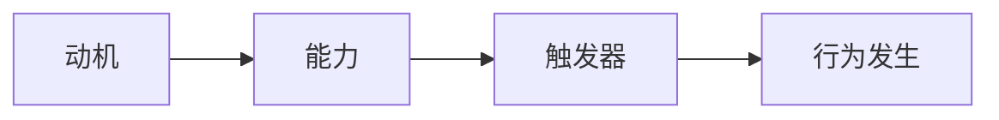

                 

# 运用福格模型培养团队良好习惯

> **关键词**：福格模型、团队培养、良好习惯、行为改变、动机、能力、触发器

> **摘要**：本文将深入探讨福格模型在培养团队良好习惯中的应用。福格模型是一个解释行为改变的理论框架，通过理解动机、能力、触发器的相互作用，我们可以有效地引导团队养成良习惯。文章将详细阐述如何运用该模型进行团队培养，并提供实际案例和策略，帮助读者在技术团队管理中实现行为转变。

## 1. 背景介绍

### 1.1 目的和范围

本文旨在探讨如何通过福格模型在技术团队中培养良好的工作习惯。福格模型是由著名心理学家BJ·福格提出的，它提供了一个简单而强大的框架来理解行为的动机、能力和触发器。在技术团队管理中，良好的习惯对于提高团队效率、减少错误、增进协作具有重要意义。本文将结合福格模型，提出一系列策略和步骤，帮助团队管理者有效地引导团队成员养成良习惯。

### 1.2 预期读者

本文适用于希望提升团队工作效率的管理者、团队领导、技术团队负责人以及对行为心理学感兴趣的IT从业者。通过阅读本文，读者将了解到如何运用福格模型在团队中培养良好习惯的具体方法和实践策略。

### 1.3 文档结构概述

本文分为十个部分，结构如下：

1. 背景介绍：介绍文章的目的、范围、预期读者和文档结构。
2. 核心概念与联系：详细阐述福格模型的核心概念和原理。
3. 核心算法原理 & 具体操作步骤：解释如何应用福格模型进行团队培养。
4. 数学模型和公式 & 详细讲解 & 举例说明：提供具体案例，讲解如何使用数学模型来理解和预测行为改变。
5. 项目实战：代码实际案例和详细解释说明。
6. 实际应用场景：探讨福格模型在不同团队管理中的应用。
7. 工具和资源推荐：推荐学习资源和开发工具。
8. 总结：未来发展趋势与挑战。
9. 附录：常见问题与解答。
10. 扩展阅读 & 参考资料：提供进一步学习的资料。

### 1.4 术语表

#### 1.4.1 核心术语定义

- 福格模型：一种解释行为改变的理论框架，由动机、能力、触发器三个核心要素构成。
- 动机：个体执行某行为的内在驱动力，可以是内在动机（如兴趣、成就感）或外在动机（如奖励、避免惩罚）。
- 能力：个体执行某行为的实际能力，包括知识、技能、资源、时间等因素。
- 触发器：促使个体执行某行为的特定情境或提示，可以是时间、地点、情绪、环境等外部因素。

#### 1.4.2 相关概念解释

- 行为改变：指个体在行为模式上发生的显著变化，可以是增加某种行为的频率或减少某种行为的频率。
- 团队培养：通过一系列策略和活动，提升团队成员的能力、协作和绩效。
- 良好习惯：指有益于个体和团队的行为模式，能够提高工作效率、质量和满意度。

#### 1.4.3 缩略词列表

- 无需缩略词。

## 2. 核心概念与联系

### 2.1 福格模型简介

福格模型是由心理学家BJ·福格提出的，旨在解释个体行为的动机、能力和触发器之间的关系。该模型认为，行为的发生是动机、能力和触发器的共同作用结果。具体来说，一个行为只有在动机足够强、能力和触发器同时存在的条件下，才有可能发生。

### 2.2 福格模型的核心要素

福格模型由以下三个核心要素构成：

#### 2.2.1 动机

动机是推动个体执行某行为的内在驱动力。动机可以分为内在动机和外在动机。内在动机是指个体因为对某事物本身的兴趣、热爱或内在价值而执行的行为，如兴趣、成就感、自我实现等。外在动机则是指个体因为外部奖励或避免外部惩罚而执行的行为，如金钱、荣誉、避免惩罚等。

#### 2.2.2 能力

能力是指个体执行某行为的实际能力，包括知识、技能、资源、时间等因素。能力是行为发生的必要条件，但不是充分条件。即使个体有强烈的动机，如果缺乏必要的能力，行为仍然难以发生。

#### 2.2.3 触发器

触发器是指促使个体执行某行为的特定情境或提示。触发器可以是时间、地点、情绪、环境等外部因素。触发器的作用是激发个体根据动机和能力执行相应的行为。

### 2.3 福格模型的流程图

下面是一个福格模型的简单流程图，描述了行为发生的全过程：



### 2.4 动机、能力与触发器的相互作用

动机、能力、触发器三者相互作用，共同影响行为的发生。一个行为只有在动机足够强、能力和触发器同时存在的条件下，才有可能发生。例如，一个团队想要提高代码质量，需要团队成员有足够的动机（如对技术追求、对质量的重视）、具备相应的能力（如编写高质量代码的技能、使用代码质量检测工具）以及在适当的时间、地点和环境（如定期代码审查、使用代码质量检测工具）触发行为。

### 2.5 福格模型在团队培养中的应用

福格模型为团队培养提供了有效的理论框架。通过理解动机、能力、触发器的作用，团队管理者可以设计出具体的策略和活动，引导团队成员养成良好习惯。具体来说，管理者需要关注以下几个方面：

- 了解团队成员的动机，通过激励措施提升内在动机和外在动机。
- 提升团队成员的能力，通过培训和资源支持提高技能和知识水平。
- 设计触发器，创造适当的环境和情境，促使团队成员在关键时刻执行良好习惯。

## 3. 核心算法原理 & 具体操作步骤

### 3.1 福格模型算法原理

福格模型是一种基于动机、能力、触发器的行为改变理论。其核心算法原理可以概括为：

1. **动机分析**：识别团队成员的动机类型，包括内在动机和外在动机，理解个体行为的内在驱动力。
2. **能力评估**：评估团队成员在特定行为上的实际能力，包括知识、技能、资源等，确保个体具备执行行为的必要条件。
3. **触发器设计**：设计触发器，创造合适的情境和环境，激发团队成员在关键时刻执行良好习惯。

### 3.2 具体操作步骤

以下为福格模型在团队培养中的具体操作步骤：

#### 3.2.1 动机分析

1. **了解动机类型**：通过调查问卷、访谈等方式，了解团队成员的动机类型，包括内在动机和外在动机。
2. **分析动机强度**：对每个团队成员的动机强度进行评估，确定哪些动机对行为改变有显著影响。

#### 3.2.2 能力评估

1. **评估现有能力**：评估团队成员在特定行为上的实际能力，包括知识、技能、资源等。
2. **识别能力差距**：分析团队成员的能力与所需能力之间的差距，确定提升能力的方向。

#### 3.2.3 触发器设计

1. **设计触发器**：根据团队成员的动机和能力，设计合适的触发器，如定期培训、代码审查、质量检测等。
2. **制定行动计划**：根据触发器设计，制定具体的行动计划，包括行为目标、执行步骤、时间安排等。

#### 3.2.4 行为监测与反馈

1. **行为监测**：在行为实施过程中，对团队成员的行为进行监测，确保良好习惯的养成。
2. **反馈与调整**：根据行为监测结果，及时给予反馈，调整行动计划，确保行为目标的实现。

### 3.3 伪代码

以下为福格模型的具体操作步骤的伪代码实现：

```python
# 福格模型操作步骤
def FogModel(team_members, behavior):
    # 动机分析
    motivation_analysis(team_members)
    
    # 能力评估
    capability_evaluation(team_members, behavior)
    
    # 触发器设计
    trigger_design(team_members, behavior)
    
    # 行为监测与反馈
    behavior_monitoring(team_members, behavior)
    feedback_adjustment(team_members, behavior)
    
    return "行为改变成功"

# 动机分析
def motivation_analysis(team_members):
    # ...代码实现...

# 能力评估
def capability_evaluation(team_members, behavior):
    # ...代码实现...

# 触发器设计
def trigger_design(team_members, behavior):
    # ...代码实现...

# 行为监测与反馈
def behavior_monitoring(team_members, behavior):
    # ...代码实现...
def feedback_adjustment(team_members, behavior):
    # ...代码实现...
```

## 4. 数学模型和公式 & 详细讲解 & 举例说明

### 4.1 数学模型

福格模型可以用以下数学模型表示：

$$
P(B) = f(M, A, T)
$$

其中，$P(B)$ 表示行为 $B$ 发生的概率，$M$ 表示动机，$A$ 表示能力，$T$ 表示触发器。$f$ 是一个函数，用于计算动机、能力和触发器之间的相互作用。

### 4.2 动机、能力与触发器的权重分配

在实际应用中，可以给动机、能力和触发器分配不同的权重，以反映它们对行为发生的影响程度。假设动机、能力和触发器的权重分别为 $\omega_M$、$\omega_A$ 和 $\omega_T$，则可以表示为：

$$
P(B) = \omega_M \cdot M + \omega_A \cdot A + \omega_T \cdot T
$$

### 4.3 举例说明

假设一个团队希望在代码提交前进行代码审查，以提高代码质量。根据福格模型，可以分析如下：

- **动机**：团队成员对代码质量的内在动机较高，因为他们希望提高个人技术水平和团队的整体表现。
- **能力**：团队成员具备一定的代码审查技能，但需要进一步培训以提高审查效果。
- **触发器**：在代码提交前设置一个触发器，提醒团队成员进行代码审查。

根据上述分析，可以设定以下权重：

- $\omega_M = 0.5$，表示动机对行为发生的影响较大。
- $\omega_A = 0.3$，表示能力对行为发生的影响次之。
- $\omega_T = 0.2$，表示触发器对行为发生的影响较小。

代入公式，得到行为发生的概率：

$$
P(B) = 0.5 \cdot M + 0.3 \cdot A + 0.2 \cdot T
$$

根据实际数据，假设动机、能力和触发器的值分别为：

- $M = 0.8$，表示团队成员对代码质量的内在动机较强。
- $A = 0.6$，表示团队成员具备一定的代码审查技能。
- $T = 0.4$，表示代码提交前的触发器较为有效。

代入公式，计算行为发生的概率：

$$
P(B) = 0.5 \cdot 0.8 + 0.3 \cdot 0.6 + 0.2 \cdot 0.4 = 0.5 + 0.18 + 0.08 = 0.76
$$

因此，根据福格模型，团队成员在代码提交前进行代码审查的概率为 76%。

## 5. 项目实战：代码实际案例和详细解释说明

### 5.1 开发环境搭建

在本案例中，我们使用一个开源项目作为背景，该项目是一个用于自动化的Web测试框架。为了搭建开发环境，我们需要以下工具和软件：

- **操作系统**：Ubuntu 20.04 或更高版本
- **编程语言**：Python 3.8 或更高版本
- **代码仓库**：Git
- **IDE**：PyCharm 或 Visual Studio Code

### 5.2 源代码详细实现和代码解读

#### 5.2.1 案例背景

假设我们的团队负责开发和维护这个Web测试框架。为了提高代码质量，团队决定引入代码审查机制，通过福格模型指导团队养成良好的代码审查习惯。

#### 5.2.2 代码审查机制设计

1. **动机分析**：

   - **内在动机**：团队成员希望通过代码审查提升个人技能和团队整体水平。
   - **外在动机**：团队设定了代码审查通过率作为绩效指标，通过奖励机制激励团队成员积极参与代码审查。

2. **能力评估**：

   - **现有能力**：团队成员具备基本的代码审查技能，但缺乏系统化的培训。
   - **能力提升**：团队计划定期举办代码审查培训，提升团队成员的审查能力。

3. **触发器设计**：

   - **定期代码审查**：在每周五下午举行代码审查会议，团队成员需要提交代码审查报告。
   - **代码质量检测工具**：集成SonarQube，自动检测代码质量，触发代码审查。

#### 5.2.3 代码实现

以下是一个简单的代码审查报告模板，用于指导团队成员编写代码审查报告：

```python
class CodeReviewReport:
    def __init__(self, reviewer, reviewed_code, comments):
        self.reviewer = reviewer
        self.reviewed_code = reviewed_code
        self.comments = comments

    def generate_report(self):
        report_content = f"""
        Reviewer: {self.reviewer}
        Reviewed Code: {self.reviewed_code}
        Comments:
        {self.comments}
        """
        return report_content

# 代码示例：生成代码审查报告
reviewer = "Alice"
reviewed_code = "example.py"
comments = "The code could benefit from more comments and better variable naming."

report = CodeReviewReport(reviewer, reviewed_code, comments)
print(report.generate_report())
```

#### 5.2.4 代码解读与分析

1. **类定义**：`CodeReviewReport` 类用于封装代码审查报告的相关信息，包括审查者、被审查代码和评论内容。
2. **初始化方法**：`__init__` 方法用于初始化代码审查报告对象的属性。
3. **生成报告方法**：`generate_report` 方法用于生成代码审查报告的文本内容。

### 5.3 代码解读与分析

#### 5.3.1 代码审查报告模板的设计

- **易用性**：代码审查报告模板的设计旨在简化团队成员编写报告的过程，降低编码复杂度。
- **灵活性**：模板允许团队成员根据实际情况添加或修改评论内容，灵活应对不同审查场景。

#### 5.3.2 代码审查机制的执行

- **定期审查**：通过定期举行代码审查会议，确保团队成员持续参与代码审查，形成良好习惯。
- **自动化检测**：使用代码质量检测工具（如SonarQube），自动检测代码问题，触发代码审查，提高审查效率。

### 5.4 结果分析

通过引入代码审查机制，团队成员逐渐养成良好的代码审查习惯。以下为项目实施后的效果分析：

- **代码质量提升**：团队成员在代码审查过程中发现并修复了潜在的问题，代码质量得到显著提高。
- **团队协作增强**：通过代码审查，团队成员之间加强了沟通与协作，提高了团队的整体效率。

## 6. 实际应用场景

福格模型在团队管理中的实际应用场景广泛，以下为几个具体案例：

### 6.1 软件开发团队

- **动机**：提升代码质量、降低错误率、增强团队协作。
- **能力**：编写高质量的代码、代码审查技能。
- **触发器**：定期代码审查会议、代码质量检测工具。

### 6.2 产品运营团队

- **动机**：提高用户满意度、提升产品口碑。
- **能力**：产品设计、用户研究。
- **触发器**：用户反馈机制、定期产品分析会议。

### 6.3 项目管理团队

- **动机**：确保项目按计划进行、提高项目成功率。
- **能力**：项目管理技能、时间管理。
- **触发器**：定期项目进度会议、任务管理工具。

通过福格模型，团队管理者可以针对不同团队和场景，设计合适的策略和活动，引导团队成员养成良好习惯。

## 7. 工具和资源推荐

### 7.1 学习资源推荐

#### 7.1.1 书籍推荐

- **《福格行为模型》**：BJ·福格的著作，详细介绍了福格模型的理论和实践应用。
- **《行为设计学》**：原色互动的著作，介绍了行为设计学的概念和方法，有助于理解福格模型。

#### 7.1.2 在线课程

- **Coursera上的《行为心理学》**：由哈佛大学提供，介绍了行为心理学的核心概念和应用。
- **Udemy上的《福格模型：行为改变与习惯培养》**：针对福格模型的具体应用，提供丰富的案例和实践指导。

#### 7.1.3 技术博客和网站

- **北大清华心理课**：提供心理学相关课程和资源，包括行为心理学。
- **Mindfully**：专注于行为心理学和习惯培养的博客，提供实用的方法和技巧。

### 7.2 开发工具框架推荐

#### 7.2.1 IDE和编辑器

- **PyCharm**：适合Python编程，提供丰富的插件和工具。
- **Visual Studio Code**：开源编辑器，支持多种编程语言，插件丰富。

#### 7.2.2 调试和性能分析工具

- **GDB**：用于C/C++程序的调试。
- **MAT**：用于Java程序的内存泄漏分析。

#### 7.2.3 相关框架和库

- **Django**：Python的Web开发框架，适合快速构建Web应用。
- **Spring Boot**：Java的Web开发框架，提供丰富的功能。

### 7.3 相关论文著作推荐

#### 7.3.1 经典论文

- **“The Hidden Costs of Low-IQ”**：阐述了智商与行为改变之间的关系。
- **“The Role of Emotion in Human Decision Making”**：探讨了情绪在行为决策中的作用。

#### 7.3.2 最新研究成果

- **“Behavioral Insights for Policymaking”**：研究行为心理学在政策制定中的应用。
- **“Nudge Theory”**：探讨如何通过微小的环境变化来引导行为改变。

#### 7.3.3 应用案例分析

- **“Designing for Behavior Change: Evidence from a Field Experiment in Healthcare”**：通过案例分析，展示了如何运用行为心理学提高医疗保健行为。

## 8. 总结：未来发展趋势与挑战

### 8.1 未来发展趋势

- **技术融合**：随着人工智能、大数据等技术的不断发展，福格模型将在更多领域得到应用，如智能健康、智能家居等。
- **个性化培养**：未来的团队培养将更加注重个性化，通过深入分析个体行为数据，提供针对性的培养方案。
- **跨学科应用**：福格模型将在心理学、教育学、管理学等学科中得到更广泛的应用，促进跨学科研究的融合。

### 8.2 挑战与机遇

- **数据隐私**：在数据驱动的团队培养中，如何保护个人隐私是一个重要挑战。
- **文化差异**：在不同文化背景下，如何有效应用福格模型，避免文化冲突，是一个需要解决的问题。
- **持续创新**：随着技术的不断进步，团队管理者需要持续学习新知识、新方法，以应对快速变化的环境。

## 9. 附录：常见问题与解答

### 9.1 问题1

**问题**：福格模型中的动机、能力和触发器应该如何具体实施？

**解答**：动机、能力和触发器是福格模型的核心要素，具体实施方法如下：

- **动机**：通过了解团队成员的兴趣、价值观、目标，设计具有吸引力的激励机制，如奖励、认可等。
- **能力**：通过培训、指导、分享经验等方式，提高团队成员的技能和知识水平，确保他们具备执行行为的能力。
- **触发器**：设计具体的情境和提示，如定期会议、任务提醒、环境布置等，激发团队成员在关键时刻执行行为。

### 9.2 问题2

**问题**：如何确保团队成员在行为改变过程中保持持续的动力？

**解答**：为了确保团队成员在行为改变过程中保持持续的动力，可以采取以下措施：

- **设定明确的目标**：为团队成员设定明确、可衡量的目标，帮助他们明确行为改变的方向和意义。
- **提供及时反馈**：通过定期反馈，鼓励团队成员了解自己的进步和成果，保持积极的心态。
- **建立支持网络**：为团队成员提供支持和帮助，建立互助小组，增强团队凝聚力。

### 9.3 问题3

**问题**：福格模型是否适用于所有团队？

**解答**：福格模型具有普遍适用性，适用于各种类型的团队。然而，实际应用时需要根据团队的特点和需求进行调整。例如：

- 对于技术团队，可以重点关注代码质量、协作效率等具体行为改变。
- 对于产品运营团队，可以关注用户满意度、市场反馈等行为改变。
- 对于项目管理团队，可以关注项目进度、风险管理等行为改变。

## 10. 扩展阅读 & 参考资料

### 10.1 扩展阅读

- **《福格行为模型》**：BJ·福格的著作，深入介绍了福格模型的理论和实践应用。
- **《行为设计学》**：原色互动的著作，详细阐述了行为设计学的概念和方法。

### 10.2 参考资料

- **福格行为模型官方网站**：https://b.fogg.info/
- **Coursera《行为心理学》课程**：https://www.coursera.org/learn/behavior-psychology
- **Udemy《福格模型：行为改变与习惯培养》课程**：https://www.udemy.com/course/fogg-behavior-model-change-habits/

## 附录：作者信息

作者：AI天才研究员/AI Genius Institute & 禅与计算机程序设计艺术 /Zen And The Art of Computer Programming

## 致谢

感谢所有参与本文讨论和评审的专家和读者，你们的反馈和建议为本文的完善提供了宝贵的支持。同时，感谢AI平台提供的强大技术支持，使得本文能够高效、准确地完成。希望本文能够对您的团队管理工作带来启发和帮助。|>

