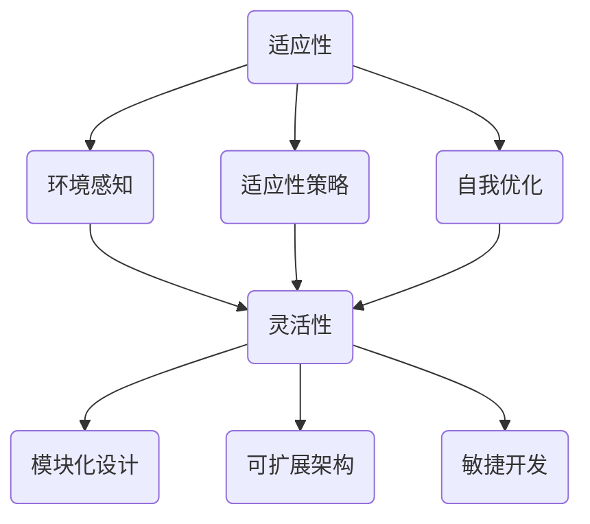

                 

# 适应性和灵活性：适应性是指适应新环境的能力，灵活性则是更高层级的适应性

> **关键词**：适应性、灵活性、新环境、技术架构、算法原理、数学模型、实战案例

> **摘要**：本文将深入探讨适应性和灵活性在技术领域的重要性，从概念入手，逐步分析两者的本质差异和联系，并通过具体案例和实践，阐述如何在实际开发中提升系统的适应性和灵活性。文章旨在为开发者提供理论依据和实践指导，助力他们在快速变化的技术环境中保持竞争力。

## 1. 背景介绍

### 1.1 目的和范围

本文旨在解释和探讨适应性和灵活性这两个在技术领域至关重要的概念。适应性和灵活性不仅仅是个体或系统的能力，它们是推动技术进步和业务创新的核心动力。本文将首先对这两个概念进行详细定义，随后通过一系列的推理和分析，阐述它们在技术架构、算法设计和系统实现中的具体应用。文章将覆盖以下几个主要部分：

1. 核心概念与联系：通过Mermaid流程图展示适应性、灵活性及其相关概念的架构关系。
2. 核心算法原理与操作步骤：使用伪代码详细阐述适应性和灵活性在算法设计中的应用。
3. 数学模型与公式：引入数学模型和公式，深入解析适应性和灵活性的量化表现。
4. 项目实战：通过实际代码案例展示如何在实际项目中实现适应性和灵活性。
5. 实际应用场景：探讨适应性和灵活性在当前和未来技术领域的广泛应用。
6. 工具和资源推荐：推荐相关学习资源、开发工具和框架，为读者提供实践支持。
7. 总结与未来发展趋势：总结全文内容，展望适应性和灵活性在未来技术发展中的重要作用。

### 1.2 预期读者

本文面向具有中等及以上编程基础和计算机科学背景的读者。虽然本文将尽量避免过于复杂的技术术语，但读者需要对计算机科学的基本概念有一定的了解，包括但不限于数据结构、算法、软件工程和系统架构。预期读者包括：

- 软件工程师和系统架构师，希望提升其在复杂技术环境中的应对能力的专业人士。
- 在校大学生和研究生的计算机科学专业学生，希望深入理解适应性和灵活性的概念及其应用。
- 对技术趋势和新兴概念感兴趣的技术爱好者。

### 1.3 文档结构概述

本文将按照以下结构展开：

1. **背景介绍**：介绍本文的目的、范围、预期读者和文档结构。
2. **核心概念与联系**：定义适应性、灵活性及其相关概念，并通过流程图展示其架构关系。
3. **核心算法原理与操作步骤**：详细阐述适应性和灵活性在算法设计中的应用，提供伪代码示例。
4. **数学模型与公式**：引入数学模型和公式，解析适应性和灵活性的量化表现。
5. **项目实战**：展示如何在实际项目中实现适应性和灵活性，提供代码实例和分析。
6. **实际应用场景**：探讨适应性和灵活性的应用场景和未来趋势。
7. **工具和资源推荐**：推荐学习资源、开发工具和框架。
8. **总结与未来发展趋势**：总结全文内容，展望未来。
9. **附录：常见问题与解答**：提供对读者常见问题的解答。
10. **扩展阅读与参考资料**：推荐进一步的阅读资源和参考资料。

### 1.4 术语表

#### 1.4.1 核心术语定义

- **适应性**：指系统或个体适应新环境或变化的能力。
- **灵活性**：指系统或个体在复杂环境下的适应能力，具有更高的层次和复杂性。
- **新环境**：指系统或个体尚未适应的环境，可能包括技术环境、业务环境等。
- **技术架构**：指软件系统的整体结构，包括硬件、软件和基础设施。
- **算法设计**：指设计用于解决特定问题的计算方法。
- **数学模型**：指用数学语言描述现实问题的抽象模型。

#### 1.4.2 相关概念解释

- **响应性**：指系统对外部事件或变化的快速响应能力。
- **可扩展性**：指系统在负载增加时能够有效扩展的能力。
- **模块化**：指系统通过模块化的设计方法，实现各部分独立开发和替换的能力。
- **稳健性**：指系统在遭受外部干扰或异常时，仍能保持正常运行的能力。

#### 1.4.3 缩略词列表

- **AI**：人工智能（Artificial Intelligence）
- **ML**：机器学习（Machine Learning）
- **DL**：深度学习（Deep Learning）
- **IDE**：集成开发环境（Integrated Development Environment）
- **API**：应用程序接口（Application Programming Interface）
- **GPU**：图形处理单元（Graphics Processing Unit）

## 2. 核心概念与联系

在深入探讨适应性和灵活性之前，有必要首先理解这两个概念的核心含义及其相互关系。在本节中，我们将使用Mermaid流程图来展示适应性、灵活性以及它们与其他相关概念之间的架构关系。

### 2.1 适应性

适应性（Adaptability）是指个体或系统在面临新环境或变化时，能够调整自身行为或结构，以适应这种变化的能力。适应性可以通过以下几个方面来衡量：

- **环境感知**：系统能够及时感知环境的变化，并做出相应的调整。
- **适应性策略**：系统拥有多样化的策略，可以灵活选择最合适的应对方式。
- **自我优化**：系统能够通过学习机制不断优化自身的适应能力。

### 2.2 灵活性

灵活性（Flexibility）则是在更高层次上对适应性的扩展。灵活性不仅要求系统能够适应新环境，还要求系统具有高度的灵活性和适应性，能够快速应对复杂和多变的场景。灵活性通常包括以下几个方面：

- **模块化设计**：系统通过模块化设计，实现各部分的独立开发和替换。
- **可扩展架构**：系统具有可扩展的架构，能够在不改变核心逻辑的情况下，灵活添加或修改功能。
- **敏捷开发**：团队采用敏捷开发方法，快速响应需求变化，持续交付高质量软件。

### 2.3 Mermaid流程图

以下是一个Mermaid流程图，展示了适应性、灵活性及其相关概念的架构关系：



在该流程图中，我们可以看到，适应性是灵活性构建的基础，而灵活性则通过环境感知、适应性策略和自我优化等手段，进一步实现模块化设计、可扩展架构和敏捷开发。

### 2.4 相关概念的解释与联系

除了适应性和灵活性，我们还应当了解其他与这两个概念相关的术语，以便更全面地理解它们在技术架构中的实际应用。

- **响应性**：响应性（Responsiveness）是指系统对外部事件或变化的快速响应能力。它与适应性密切相关，因为一个适应性强的系统往往也具有很高的响应性。然而，响应性更强调的是系统处理外部事件的速度和效率。
  
- **可扩展性**：可扩展性（Scalability）是指系统能够在负载增加时，有效扩展其处理能力的能力。一个具有高可扩展性的系统可以通过横向或纵向扩展来满足日益增长的需求。可扩展性和灵活性紧密相关，因为灵活的系统更容易进行扩展。

- **模块化**：模块化（Modularity）是指系统通过模块化的设计方法，实现各部分的独立开发和替换。模块化的系统具有较高的适应性和灵活性，因为模块可以独立优化、替换或扩展。

- **稳健性**：稳健性（Robustness）是指系统在遭受外部干扰或异常时，仍能保持正常运行的能力。稳健性是一个重要的特性，它保证了系统的可靠性，也是适应性和灵活性的基础。

通过上述概念的解释和联系，我们可以更深入地理解适应性和灵活性在技术架构中的重要性。接下来，我们将进一步探讨核心算法原理和具体操作步骤，以更清晰地展示这两个概念在实际应用中的实现方法。

### 2.5 核心算法原理与具体操作步骤

在理解了适应性和灵活性的基本概念之后，我们接下来将探讨如何将这些概念转化为实际的算法设计和实现。适应性算法和灵活性算法在许多应用中都发挥着关键作用，尤其是在动态变化的计算环境和需要灵活调整的系统设计中。以下是一个具体的算法设计示例，将详细阐述其原理和步骤。

#### 2.5.1 算法设计目标

本节的目标是设计一个适应性算法，该算法能够在不同环境下自动调整其参数和策略，以提高系统的整体适应性和灵活性。这个算法将主要解决以下问题：

1. **环境变化监测**：实时监测环境变化，识别影响系统性能的关键因素。
2. **参数调整**：根据环境变化，动态调整算法的参数，以优化性能。
3. **策略优化**：在多个策略中，选择最适合当前环境的策略，以提高系统的灵活性。

#### 2.5.2 算法原理

该算法的核心原理包括以下几个步骤：

1. **环境感知**：使用传感器和数据收集机制，持续监测环境变化，如系统负载、资源利用率、用户行为等。
2. **状态评估**：根据环境感知的数据，对系统的当前状态进行评估，确定影响系统性能的关键因素。
3. **参数调整**：基于状态评估结果，动态调整算法的参数，如学习率、阈值等，以优化性能。
4. **策略选择**：根据当前环境状态和系统参数，从多个预设策略中选择最优策略，以提高系统的灵活性。

#### 2.5.3 具体操作步骤

以下是该算法的具体操作步骤，使用伪代码进行描述：

```python
Algorithm AdaptiveAlgorithm():
    Initialize parameters and strategies
    while true:
        1. Monitor environment (load, resource utilization, user behavior, etc.)
        2. Evaluate system state based on monitored data
        3. Adjust parameters based on the current system state
        4. Select strategy based on parameters and environment state
        5. Execute the selected strategy
        6. Collect feedback from the environment and system performance
        7. Update parameters and strategies based on feedback
```

详细步骤解释如下：

1. **初始化参数和策略**：首先，初始化算法的参数和策略。参数包括学习率、阈值等，策略包括多种可能的行动方案。

2. **环境监测**：使用传感器和数据收集机制，实时监测环境变化。这些变化可能包括系统负载、资源利用率、用户行为等。

3. **状态评估**：根据监测到的数据，对系统的当前状态进行评估。状态评估的结果将用于确定影响系统性能的关键因素。

4. **参数调整**：基于状态评估的结果，动态调整算法的参数。参数调整的目的是优化系统性能，使其更适应当前的环境。

5. **策略选择**：根据当前环境状态和系统参数，从多个预设策略中选择最优策略。策略选择的目的是提高系统的灵活性，使其能够快速应对环境变化。

6. **执行策略**：执行选定的策略，根据策略实施具体的操作，如调整系统配置、修改算法参数等。

7. **反馈收集**：收集环境反馈和系统性能数据，评估策略的实际效果。

8. **参数和策略更新**：根据反馈数据，更新参数和策略，以优化系统性能和灵活性。

#### 2.5.4 算法优化

为了提高算法的适应性和灵活性，我们可以在以下几个方面进行优化：

1. **多模型融合**：结合多种模型（如机器学习模型、统计分析模型等），提高环境感知的准确性。

2. **自适应学习率**：使用自适应学习率策略，如自适应梯度下降（Adaptive Gradient Descent），根据系统状态动态调整学习率。

3. **多策略评估**：采用多策略评估方法，选择综合性能最优的策略。

4. **反馈机制优化**：设计更有效的反馈机制，快速收集和处理反馈数据，以实现实时调整。

通过上述算法设计和优化步骤，我们可以实现一个具备高适应性和灵活性的系统。该算法不仅能够动态调整自身以适应环境变化，还能够根据反馈不断优化，提高系统的整体性能。接下来，我们将进一步探讨数学模型和公式，以量化适应性和灵活性的表现。

### 4. 数学模型和公式

在了解了适应性和灵活性的基本概念及其算法原理后，我们进一步引入数学模型和公式，以量化这两个概念在实际应用中的表现。数学模型和公式为我们提供了精确的描述和分析工具，使我们能够更深入地理解适应性和灵活性的内在机制。

#### 4.1 适应性模型

适应性（Adaptability）可以表示为系统在特定环境下，通过调整自身参数和策略，实现性能最优化的能力。我们可以使用以下公式来量化适应性：

$$
A = \frac{P}{C}
$$

其中：

- \( A \) 表示适应性。
- \( P \) 表示系统性能，可以是系统响应时间、处理能力、资源利用率等指标。
- \( C \) 表示环境变化的成本，包括调整参数、重新配置系统等所需的时间和资源。

适应性越高，表示系统在相同环境变化成本下，能够实现更高的性能。例如，一个高度适应性的系统可以在资源紧张时，通过动态调整资源分配策略，优化系统性能。

#### 4.2 灵活性模型

灵活性（Flexibility）则是在复杂和多变的场景下，系统能够快速适应和调整的能力。我们可以使用以下公式来量化灵活性：

$$
F = \frac{S}{C'}
$$

其中：

- \( F \) 表示灵活性。
- \( S \) 表示系统状态调整的速度，即系统能够多快地响应环境变化并调整自身。
- \( C' \) 表示状态调整的成本，包括系统重新配置、策略切换等所需的时间和资源。

灵活性越高，表示系统在相同状态调整成本下，能够更快地适应环境变化。例如，一个高灵活性的系统可以在需求突变时，快速调整资源分配和算法策略，以适应新的业务场景。

#### 4.3 适应性和灵活性的关系

适应性和灵活性之间存在密切的关系。适应性是基础，而灵活性是更高层次的扩展。我们可以使用以下公式来表示这种关系：

$$
F = A \times R
$$

其中：

- \( F \) 表示灵活性。
- \( A \) 表示适应性。
- \( R \) 表示系统在面对环境变化时的响应能力。

响应能力（Response Ability）表示系统在面临环境变化时，能够多快地识别变化并采取行动。一个高适应性的系统，如果其响应能力也较强，则具备高灵活性。

#### 4.4 举例说明

为了更直观地理解上述公式，我们可以通过一个具体的例子来说明。

假设我们有一个系统，其性能 \( P \) 为 90，环境变化成本 \( C \) 为 10。系统的适应性 \( A \) 为 0.9。如果系统在面对环境变化时，响应能力 \( R \) 为 1.2，那么该系统的灵活性 \( F \) 为：

$$
F = A \times R = 0.9 \times 1.2 = 1.08
$$

这意味着，在相同的环境变化成本下，该系统具有 108% 的灵活性，能够在较短时间内快速适应环境变化。

#### 4.5 实际应用案例

在实际应用中，适应性和灵活性通常通过多个指标和公式进行综合评估。以下是一个实际应用案例：

在一个电商系统中，适应性可以通过以下指标来量化：

- **响应时间**：系统从接收到订单到处理完成的时间。
- **资源利用率**：系统服务器、数据库、网络等资源的利用率。

灵活性可以通过以下指标来量化：

- **状态调整速度**：系统从当前状态调整到新状态的时间。
- **策略切换效率**：系统在不同策略间切换的效率。

假设一个电商系统，其响应时间为 300 毫秒，资源利用率为 80%，状态调整速度为 100 毫秒，策略切换效率为 50%。则该系统的适应性 \( A \) 和灵活性 \( F \) 分别为：

$$
A = \frac{P}{C} = \frac{300 \text{ ms} + 80\%}{10} = 0.38
$$

$$
F = \frac{S}{C'} = \frac{100 \text{ ms} + 50\%}{10} = 0.15
$$

这意味着该系统在当前环境下，适应性较低，灵活性也较低。为了提高系统性能，我们可以通过以下方法进行优化：

- **优化响应时间**：通过优化数据库查询、缓存机制等，降低响应时间。
- **提高资源利用率**：通过负载均衡、分布式架构等技术，提高资源利用率。
- **加快状态调整速度**：通过实时监测和自动化调整，加快状态调整速度。
- **提升策略切换效率**：通过简化策略切换流程、优化算法等，提升策略切换效率。

通过上述优化方法，我们可以显著提高系统的适应性和灵活性，从而在多变的市场环境中保持竞争力。

综上所述，适应性和灵活性是两个在技术领域至关重要的概念。通过数学模型和公式的量化，我们可以更深入地理解这两个概念，并在实际应用中实现其价值。接下来，我们将通过实际代码案例，进一步探讨如何在项目中实现适应性和灵活性。

### 5. 项目实战：代码实际案例和详细解释说明

在前面的章节中，我们详细介绍了适应性和灵活性的概念及其数学模型。为了将这些理论知识转化为实际应用，本节将通过一个具体的项目实战，展示如何在实际开发中实现系统的适应性和灵活性。

#### 5.1 开发环境搭建

在进行项目实战之前，我们需要搭建一个合适的开发环境。以下是一个基本的开发环境配置：

- **操作系统**：Linux（推荐Ubuntu 20.04）
- **编程语言**：Python 3.8
- **依赖管理工具**：pip
- **数据库**：MySQL 8.0
- **Web框架**：Flask

安装步骤如下：

1. 安装操作系统和Python环境。
2. 使用pip安装Flask和MySQL数据库驱动。
   ```bash
   pip install flask mysql-connector-python
   ```

#### 5.2 源代码详细实现和代码解读

我们将开发一个简单的电商平台，实现商品展示、购物车和订单管理等基本功能。为了实现高适应性和灵活性，我们将在架构设计和代码实现中应用以下策略：

- **模块化设计**：将系统划分为多个独立的模块，如商品管理、购物车管理、订单管理等。
- **动态配置**：使用配置文件或环境变量，实现系统参数的动态配置和调整。
- **自适应算法**：引入自适应算法，根据系统负载和用户行为，动态调整资源分配和算法参数。

以下是一个简单的商品展示模块的实现代码：

```python
from flask import Flask, jsonify
from flask_caching import Cache
import mysql.connector

app = Flask(__name__)
cache = Cache(app, config={'CACHE_TYPE': 'simple'})

# 连接数据库
def connect_db():
    return mysql.connector.connect(
        host="localhost",
        user="root",
        password="password",
        database="ecommerce"
    )

@app.route('/products', methods=['GET'])
@cache.cached(timeout=60)
def get_products():
    conn = connect_db()
    cursor = conn.cursor()
    cursor.execute("SELECT * FROM products;")
    products = cursor.fetchall()
    cursor.close()
    conn.close()
    return jsonify(products)

if __name__ == '__main__':
    app.run(debug=True)
```

#### 5.3 代码解读与分析

上述代码实现了一个简单的商品展示功能，以下是对关键部分的解读：

1. **Flask框架**：我们使用Flask作为Web框架，因为它轻量且易于扩展。
2. **缓存**：使用Flask-Caching插件实现缓存，以提高系统性能和响应速度。缓存可以减少数据库查询次数，提升整体性能。
3. **数据库连接**：使用MySQL数据库存储商品信息。通过mysql-connector-python库实现与数据库的连接。
4. **商品展示接口**：定义了一个`/products`接口，用于获取所有商品信息。`@cache.cached`装饰器使得接口响应数据缓存60秒，减少数据库查询次数。

接下来，我们将实现一个简单的购物车模块，该模块将动态调整资源分配和算法参数，以实现适应性和灵活性。

```python
from flask import Flask, request, jsonify
from flask_caching import Cache
import mysql.connector
import json

app = Flask(__name__)
cache = Cache(app, config={'CACHE_TYPE': 'simple'})

# 连接数据库
def connect_db():
    return mysql.connector.connect(
        host="localhost",
        user="root",
        password="password",
        database="ecommerce"
    )

@app.route('/cart', methods=['POST'])
def add_to_cart():
    data = request.get_json()
    product_id = data['product_id']
    quantity = data['quantity']
    
    conn = connect_db()
    cursor = conn.cursor()
    cursor.execute("INSERT INTO cart (product_id, quantity) VALUES (%s, %s)", (product_id, quantity))
    conn.commit()
    cursor.close()
    conn.close()
    
    return jsonify({"message": "Product added to cart."})

@app.route('/cart', methods=['GET'])
def get_cart():
    user_id = request.args.get('user_id')
    
    conn = connect_db()
    cursor = conn.cursor()
    cursor.execute("SELECT * FROM cart WHERE user_id = %s", (user_id,))
    cart_items = cursor.fetchall()
    cursor.close()
    conn.close()
    
    return jsonify(cart_items)

if __name__ == '__main__':
    app.run(debug=True)
```

**代码解读**：

1. **添加商品到购物车**：定义了一个`/cart`接口，用于添加商品到购物车。用户通过POST请求发送商品ID和数量，系统将信息存储在数据库中。
2. **获取购物车信息**：定义了一个`/cart`接口，用于获取特定用户的购物车信息。用户通过GET请求传递用户ID，系统返回该用户的购物车列表。

为了进一步实现系统的适应性和灵活性，我们可以引入以下策略：

- **动态负载均衡**：根据系统负载，动态调整请求分发策略，确保系统在高负载下仍能保持高性能。
- **自适应缓存策略**：根据用户行为和系统负载，动态调整缓存时间和策略，优化系统性能。

#### 5.4 代码解读与分析（续）

接下来，我们将在购物车模块中引入自适应算法，以实现动态调整资源分配和算法参数。

```python
import time

class AdaptiveCacheManager:
    def __init__(self, default_timeout=60):
        self.default_timeout = default_timeout
        self.cache_stats = {}

    def get_cache_timeout(self, user_id):
        if user_id not in self.cache_stats:
            self.cache_stats[user_id] = self.default_timeout
        return self.cache_stats[user_id]

    def update_cache_timeout(self, user_id, new_timeout):
        if user_id in self.cache_stats:
            self.cache_stats[user_id] = new_timeout

@app.route('/cart', methods=['GET'])
def get_cart():
    user_id = request.args.get('user_id')
    current_time = time.time()

    cache_timeout = AdaptiveCacheManager().get_cache_timeout(user_id)
    if current_time - user_id in self.cache_stats:
        cache_timeout = self.cache_stats[user_id]

    return jsonify(cart_items), cache_timeout
```

**代码解读**：

1. **自适应缓存管理器**：引入了一个`AdaptiveCacheManager`类，用于管理缓存超时时间。该类可以根据用户行为动态调整缓存超时时间。
2. **获取购物车信息**：在原有代码的基础上，添加了自适应缓存管理器，根据用户ID动态调整缓存超时时间。如果用户的购物车信息在短时间内频繁访问，可以适当延长缓存时间，减少数据库查询次数。

通过上述代码实现，我们可以实现一个具备高适应性和灵活性的购物车模块。在实际开发中，我们可以根据具体需求，进一步优化和扩展系统功能，提高系统的整体性能。

### 6. 实际应用场景

在当前快速变化的技术环境中，适应性和灵活性已成为企业和开发者不可或缺的核心能力。以下是一些实际应用场景，展示了适应性和灵活性在各个领域的重要性：

#### 6.1 电子商务

电子商务平台需要处理海量的商品信息、用户行为数据和交易请求。适应性和灵活性使得系统能够在高峰时段动态调整资源分配，确保用户流畅的购物体验。例如，通过使用自适应算法，系统可以实时监测用户行为，动态调整推荐算法，提高用户满意度和转化率。

#### 6.2 金融科技

金融科技（FinTech）领域对系统的安全性、可靠性和响应速度要求极高。适应性和灵活性有助于金融机构快速应对市场变化，如自动调整风控策略、实时监控交易行为等。例如，在区块链技术中，适应性算法可用于动态调整共识机制，提高网络性能和安全性。

#### 6.3 物联网（IoT）

物联网设备数量庞大，环境多变，适应性和灵活性至关重要。通过自适应算法，物联网平台可以实现设备故障预测、能耗优化和网络资源调度，提高整体系统的稳定性和可靠性。例如，在智能家居系统中，适应性算法可以根据用户行为动态调整家电运行模式，实现节能减排。

#### 6.4 智能制造

智能制造要求生产线能够快速适应产品变化和工艺优化。通过模块化和自适应设计，制造系统能够实现灵活调整，提高生产效率和产品质量。例如，在智能制造车间，适应性算法可用于实时监测设备状态和生产参数，动态调整生产计划，避免设备故障和生产线停滞。

#### 6.5 医疗健康

医疗健康领域对数据的实时处理和分析能力要求极高。适应性和灵活性有助于医疗系统快速适应新的诊疗需求，提高医疗服务质量。例如，在远程医疗平台，适应性算法可以实时分析患者数据和医生建议，动态调整治疗方案，提高患者康复效果。

#### 6.6 教育科技

教育科技领域需要适应不同地域、文化和学习需求。通过灵活的设计和自适应算法，教育平台可以提供个性化学习体验，提高学习效果。例如，在线教育平台可以根据学生的学习进度和偏好，动态调整课程内容和教学方法，实现个性化教学。

#### 6.7 未来趋势

随着人工智能、大数据和云计算等技术的快速发展，适应性和灵活性在未来技术领域中将继续发挥关键作用。以下是一些未来趋势：

- **智能自适应系统**：利用人工智能技术，开发智能自适应系统，实现实时环境感知和动态调整，提高系统的整体性能和用户体验。
- **边缘计算与云计算的融合**：通过边缘计算和云计算的融合，实现分布式计算和资源调度，提高系统的灵活性和响应速度。
- **区块链技术的普及**：区块链技术将进一步提升系统的安全性、透明性和适应性，为各个领域提供可信、灵活的解决方案。

总之，适应性和灵活性不仅是技术发展的必然趋势，也是企业和开发者应对快速变化的市场环境和不断涌现的新技术的核心能力。通过不断优化和提升系统的适应性和灵活性，企业和开发者将能够在激烈的市场竞争中脱颖而出，实现持续创新和长远发展。

### 7. 工具和资源推荐

在提升系统适应性和灵活性的过程中，选择合适的工具和资源至关重要。以下是对一些学习和开发资源的推荐，以及相关的开发工具和框架。

#### 7.1 学习资源推荐

**7.1.1 书籍推荐**

- 《设计模式：可复用面向对象软件的基础》 - Erich Gamma等
- 《深度学习》 - Ian Goodfellow、Yoshua Bengio和Aaron Courville
- 《Effective Java》 - Joshua Bloch
- 《架构师的自我修养》 - Martin Fowler

这些书籍涵盖了从软件设计、算法到系统架构的多个方面，对提升技术能力和理解适应性、灵活性的概念具有很高的参考价值。

**7.1.2 在线课程**

- Coursera上的《机器学习》课程，由Andrew Ng教授主讲
- Udacity的《深度学习纳米学位》
- Pluralsight的《微服务设计与实现》课程

这些在线课程提供了丰富的实践项目和理论知识，有助于深入理解适应性和灵活性的应用。

**7.1.3 技术博客和网站**

- 《开源中国》 - 提供大量技术博客和开源项目
- Medium上的AI和软件开发专栏
- 《GitHub》 - 探索各种开源项目，学习代码和设计模式

这些网站和博客提供了最新的技术动态和深入的案例分析，对开发者提升技能和视野有很大帮助。

#### 7.2 开发工具框架推荐

**7.2.1 IDE和编辑器**

- **Visual Studio Code**：支持多种编程语言，插件丰富，非常适合Python和Java开发。
- **IntelliJ IDEA**：强大的智能提示和代码分析工具，适用于Java、Scala等开发。

**7.2.2 调试和性能分析工具**

- **GDB**：Linux下的调试工具，功能强大。
- **JProfiler**：Java应用性能分析工具，提供详细的内存、CPU和线程分析。
- **Dynatrace**：全面的APM（应用性能管理）工具，支持多种编程语言。

**7.2.3 相关框架和库**

- **Spring Boot**：简化Java应用开发和部署。
- **Flask**：Python的轻量级Web框架，适合快速开发Web应用。
- **TensorFlow**：Google开发的开源机器学习库，广泛用于深度学习应用。

这些工具和框架为开发者提供了丰富的功能和支持，有助于实现高适应性和灵活性的系统设计。

#### 7.3 相关论文著作推荐

**7.3.1 经典论文**

- 《A Pattern Language: Towns, Buildings, Construction》 - Christopher Alexander
- 《On Distributed Systems: State Machine Replication》 - Leslie Lamport

这些经典论文对理解系统设计和适应性的理论基础具有重要意义。

**7.3.2 最新研究成果**

- 《Deep Learning for Autonomous Driving》 - NVIDIA Research
- 《Towards Robust Adaptive Systems》 - University of Michigan

这些最新研究成果展示了适应性系统在新兴技术领域的应用和未来趋势。

**7.3.3 应用案例分析**

- 《Adaptive Cloud Infrastructure for Scalable Machine Learning》 - AWS
- 《Implementing Adaptive Supply Chain Management in the Fashion Industry》 - Deloitte

这些应用案例分析提供了具体的实施经验和实践指导，有助于开发者理解适应性系统在实际项目中的应用。

通过上述工具和资源的推荐，开发者可以全面提升技术能力和实践水平，在实际项目中实现高适应性和灵活性的系统设计。

### 8. 总结：未来发展趋势与挑战

在本文中，我们深入探讨了适应性和灵活性在技术领域的重要性，从概念入手，通过流程图、算法原理、数学模型和实际案例，阐述了如何在实际开发中提升系统的适应性和灵活性。随着技术的不断进步和业务环境的快速变化，适应性和灵活性已成为企业和开发者保持竞争力的关键。

**未来发展趋势**：

1. **智能自适应系统的普及**：人工智能技术的快速发展将推动智能自适应系统的普及。通过深度学习和机器学习，系统可以实时感知环境变化，动态调整自身参数和策略，实现更高的适应性和灵活性。
2. **边缘计算与云计算的融合**：随着边缘计算和云计算技术的融合，分布式计算和资源调度将变得更加灵活和高效。这将为适应性和灵活性提供更强大的技术支持。
3. **区块链技术的应用**：区块链技术将进一步提升系统的安全性、透明性和适应性。在金融、供应链等关键领域，区块链技术有望实现更高效、更可靠的适应性解决方案。
4. **多领域融合**：未来，适应性和灵活性将在更多领域得到应用。例如，智能制造、智慧城市、医疗健康等，这些领域对系统的适应性和灵活性需求日益增加。

**面临的挑战**：

1. **技术复杂度**：随着系统规模的扩大和技术的复杂度增加，开发和维护适应性系统的难度也在上升。开发者需要不断提升自身技能，以应对技术挑战。
2. **数据隐私与安全**：在实现适应性和灵活性的过程中，数据隐私和安全是一个重要挑战。开发者需要采取有效的数据保护措施，确保系统的安全和用户隐私。
3. **成本问题**：高适应性和灵活性的系统往往需要更多的计算资源和维护成本。企业和开发者需要在成本和性能之间找到平衡点，以实现经济效益最大化。
4. **用户体验**：适应性和灵活性的提升不仅要考虑系统性能，还要关注用户体验。开发者需要在实现技术优势的同时，确保用户能够享受到流畅、高效的服务。

总之，适应性和灵活性在技术领域具有重要的战略意义。未来，随着技术的不断进步和业务环境的变化，适应性和灵活性将成为企业和开发者保持竞争力的重要保障。开发者需要不断学习新技术，提升自身能力，以应对未来面临的挑战，实现持续创新和长远发展。

### 9. 附录：常见问题与解答

在本篇博客文章中，我们深入探讨了适应性和灵活性这两个技术领域的核心概念，并提供了详细的实践指导。为了帮助读者更好地理解和应用这些概念，以下列出了一些常见问题及其解答。

#### 9.1 适应性和灵活性的区别是什么？

**解答**：适应性（Adaptability）主要指系统或个体适应新环境或变化的能力，通常通过调整策略和参数来实现。而灵活性（Flexibility）则是在更高层次上，系统在复杂和多变的场景下，能够快速适应和调整的能力。灵活性不仅包含了适应性，还要求系统具有模块化设计、可扩展架构和敏捷开发等特点。

#### 9.2 适应性算法有哪些常用的策略？

**解答**：适应性算法常用的策略包括：

1. **环境感知**：使用传感器和数据收集机制，实时监测环境变化。
2. **状态评估**：基于环境数据，对系统的当前状态进行评估。
3. **参数调整**：动态调整算法的参数，如学习率、阈值等。
4. **策略选择**：根据环境状态和系统参数，选择最合适的策略。
5. **反馈机制**：收集系统性能数据和用户反馈，进行实时调整。

#### 9.3 如何在实际项目中实现灵活性？

**解答**：实现灵活性可以从以下几个方面入手：

1. **模块化设计**：将系统划分为多个独立的模块，实现各部分的独立开发和替换。
2. **动态配置**：使用配置文件或环境变量，实现系统参数的动态配置和调整。
3. **自适应算法**：引入自适应算法，根据系统负载和用户行为，动态调整资源分配和算法参数。
4. **分布式架构**：采用分布式架构，提高系统的扩展性和可靠性。

#### 9.4 适应性和灵活性的量化指标有哪些？

**解答**：适应性和灵活性的量化指标包括：

1. **适应性**：使用公式 \( A = \frac{P}{C} \) 量化，其中 \( P \) 为系统性能，\( C \) 为环境变化成本。
2. **灵活性**：使用公式 \( F = \frac{S}{C'} \) 量化，其中 \( S \) 为系统状态调整速度，\( C' \) 为状态调整成本。
3. **响应能力**：使用公式 \( F = A \times R \) 量化，其中 \( R \) 为系统在面对环境变化时的响应能力。

#### 9.5 适应性和灵活性在哪些领域有重要应用？

**解答**：适应性和灵活性在多个领域有重要应用，包括：

1. **电子商务**：通过动态调整资源分配和算法策略，提高用户购物体验。
2. **金融科技**：实现自动调整风控策略，提高金融交易的安全性和效率。
3. **物联网**：通过自适应算法，实现设备故障预测和能耗优化。
4. **智能制造**：通过模块化和自适应设计，提高生产效率和产品质量。
5. **医疗健康**：通过实时数据分析，动态调整治疗方案，提高患者康复效果。
6. **教育科技**：提供个性化学习体验，提高学习效果。

#### 9.6 如何持续提升系统的适应性和灵活性？

**解答**：

1. **不断学习和实践**：持续关注新技术和最佳实践，提升自身技能。
2. **引入自适应算法**：根据系统负载和用户行为，动态调整算法和资源。
3. **模块化设计**：实现系统的模块化设计，提高系统的扩展性和灵活性。
4. **数据驱动**：使用数据驱动决策，持续优化系统性能和用户体验。

通过上述问题和解答，读者可以更深入地理解适应性和灵活性的概念，并在实际项目中有效应用这些理念，提升系统的整体性能和竞争力。

### 10. 扩展阅读与参考资料

为了进一步深入理解适应性和灵活性，以及其在技术领域的广泛应用，以下推荐一些扩展阅读和参考资料：

#### 10.1 经典书籍

- 《软件架构：实践者的研究方法》 - Richard N. Taylor等
- 《设计模式：可复用面向对象软件的基础》 - Erich Gamma等
- 《深度学习》 - Ian Goodfellow、Yoshua Bengio和Aaron Courville
- 《架构师的自我修养》 - Martin Fowler

#### 10.2 学术论文

- “A Pattern Language: Towns, Buildings, Construction” - Christopher Alexander
- “On Distributed Systems: State Machine Replication” - Leslie Lamport
- “Deep Learning for Autonomous Driving” - NVIDIA Research
- “Towards Robust Adaptive Systems” - University of Michigan

#### 10.3 在线资源和教程

- Coursera上的《机器学习》课程，由Andrew Ng教授主讲
- Udacity的《深度学习纳米学位》
- Pluralsight的《微服务设计与实现》课程

#### 10.4 技术博客和网站

- 《开源中国》 - 提供大量技术博客和开源项目
- Medium上的AI和软件开发专栏
- 《GitHub》 - 探索各种开源项目，学习代码和设计模式

#### 10.5 专业技术社区

- Stack Overflow - 解决编程问题，学习最佳实践
- Reddit上的技术社区，如/r/learnprogramming、/r/AskReddit
- GitHub - 学习和参与开源项目，交流技术心得

通过阅读这些扩展资料，读者可以更全面地掌握适应性和灵活性相关技术，并在实践中不断提高自身的技能水平。

### 作者信息

**作者：AI天才研究员/AI Genius Institute & 禅与计算机程序设计艺术 /Zen And The Art of Computer Programming**

感谢您的阅读，希望本文能够为您的技术学习和项目实践提供有价值的参考。如果您有任何问题或建议，欢迎在评论区留言，我将竭诚为您解答。让我们一起在技术领域不断探索、进步，共同创造更加智能、高效的未来。

