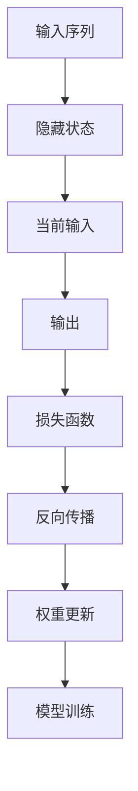

                 

# 递归神经网络：原理与代码实例讲解

> **关键词：** 递归神经网络、RNN、循环神经网络、序列模型、深度学习、时间序列预测、自然语言处理。

> **摘要：** 本文将深入探讨递归神经网络（RNN）的基本原理、数学模型以及如何使用Python代码实现。通过详细的算法解析和实例代码，帮助读者理解RNN在序列数据处理中的应用，以及其在深度学习领域的独特优势。

## 1. 背景介绍

### 1.1 目的和范围

本文旨在为对递归神经网络（RNN）感兴趣的读者提供一个全面而深入的指导。我们将从基础概念出发，逐步深入探讨RNN的算法原理，并使用Python代码实现一个简单的RNN模型。文章将涵盖以下主题：

- RNN的基本概念与架构
- RNN的数学模型与算法原理
- Python代码实例讲解与实现
- RNN在自然语言处理和时间序列预测中的应用

### 1.2 预期读者

本文适合对深度学习和机器学习有一定基础的读者，特别是那些希望了解并掌握RNN技术的开发者和研究人员。如果您对序列模型和循环结构感兴趣，那么本文将为您提供有价值的知识和实践指导。

### 1.3 文档结构概述

本文的结构如下：

- **第1章：背景介绍**：介绍文章的目的、预期读者和文档结构。
- **第2章：核心概念与联系**：定义RNN的相关概念，并通过Mermaid流程图展示RNN的架构。
- **第3章：核心算法原理与具体操作步骤**：详细讲解RNN的算法原理，并提供伪代码示例。
- **第4章：数学模型和公式**：介绍RNN的数学模型，包括公式推导和实例说明。
- **第5章：项目实战：代码实际案例和详细解释说明**：展示如何使用Python实现RNN，并解读代码。
- **第6章：实际应用场景**：讨论RNN在不同领域的应用。
- **第7章：工具和资源推荐**：推荐学习资源和开发工具。
- **第8章：总结：未来发展趋势与挑战**：总结RNN的现状和未来趋势。
- **第9章：附录：常见问题与解答**：回答读者可能遇到的常见问题。
- **第10章：扩展阅读与参考资料**：提供进一步阅读的资源。

### 1.4 术语表

#### 1.4.1 核心术语定义

- **递归神经网络（RNN）**：一种能够在序列数据上进行前后信息传递的神经网络。
- **隐藏状态（Hidden State）**：RNN中用于存储当前和过去输入信息的状态变量。
- **权重（Weights）**：连接网络中各个节点的参数，用于传递和调整信息。
- **梯度下降（Gradient Descent）**：一种常用的优化算法，用于调整网络权重以最小化损失函数。

#### 1.4.2 相关概念解释

- **反向传播（Backpropagation）**：一种用于计算网络损失函数相对于权重的梯度的方法。
- **序列模型（Sequence Model）**：用于处理序列数据的机器学习模型，例如时间序列预测和自然语言处理。
- **循环结构（Loop Structure）**：允许神经网络在序列中保持状态和信息的结构。

#### 1.4.3 缩略词列表

- **RNN**：递归神经网络（Recurrent Neural Network）
- **MLP**：多层感知器（Multilayer Perceptron）
- **NN**：神经网络（Neural Network）
- **NLP**：自然语言处理（Natural Language Processing）

## 2. 核心概念与联系

递归神经网络（RNN）是深度学习领域的一种重要模型，特别适合处理序列数据。RNN的核心概念是它的循环结构，允许网络在序列的每个时间步（Time Step）保留一些历史信息。下面是RNN的核心概念和它们之间的联系：

### 2.1 隐藏状态

RNN中的隐藏状态（Hidden State）是存储当前和过去输入信息的关键组件。每个时间步，RNN都会更新隐藏状态，使其包含当前输入和新信息。隐藏状态是RNN实现序列记忆的关键。

### 2.2 权重

RNN中的权重（Weights）是连接网络中各个节点的参数，用于传递和调整信息。在训练过程中，通过反向传播算法调整权重，以最小化损失函数。

### 2.3 反向传播

反向传播（Backpropagation）是RNN训练的核心算法。它通过计算损失函数相对于网络权重的梯度，从而更新权重。反向传播算法允许RNN从序列的每个时间步学习信息。

### 2.4 序列模型

RNN是序列模型（Sequence Model）的一种，特别适合处理时间序列预测和自然语言处理任务。序列模型的关键是能够在序列中保持状态和信息，这是RNN的独特优势。

### 2.5 循环结构

RNN的循环结构是它在序列数据上表现优异的核心原因。循环结构允许网络在处理序列数据时保留历史信息，从而实现长期依赖关系的学习。

### 2.6 Mermaid流程图



此Mermaid流程图展示了RNN的基本架构，包括输入序列、隐藏状态、当前输入、输出、损失函数、反向传播和权重更新等关键组件。

## 3. 核心算法原理与具体操作步骤

递归神经网络（RNN）的算法原理是其循环结构和隐藏状态机制。RNN通过在序列的每个时间步更新隐藏状态，从而实现序列数据的前后信息传递。下面是RNN的核心算法原理和具体操作步骤：

### 3.1 前向传播

在RNN的前向传播过程中，每个时间步的隐藏状态由当前输入和上一个时间步的隐藏状态共同决定。具体操作步骤如下：

```pseudo
for each time step t:
    h_t = activation(W_x * x_t + W_h * h_{t-1} + b)
```

- **h\_t**：时间步t的隐藏状态。
- **x\_t**：时间步t的输入。
- **W\_x**：输入层到隐藏层的权重。
- **W\_h**：隐藏层到隐藏层的权重。
- **h\_{t-1}**：时间步t-1的隐藏状态。
- **b**：偏置项。
- **activation**：激活函数，常用的有tanh、ReLU等。

### 3.2 反向传播

在RNN的反向传播过程中，我们计算损失函数相对于网络权重的梯度，并使用梯度下降算法更新权重。具体操作步骤如下：

```pseudo
for each time step t:
    dL/dh_t = activation'(h_t) * dL/dy_t
    dL/dx_t = W_h' * dL/dh_t
    dL/dW_x += dL/dx_t * x_t
    dL/dW_h += dL/dh_t * h_{t-1}
    dL/db += dL/dh_t

update weights:
    W_x -= learning_rate * dL/dW_x
    W_h -= learning_rate * dL/dW_h
    b -= learning_rate * dL/db
```

- **dL/dh\_t**：损失函数对隐藏状态h\_t的梯度。
- **dL/dy\_t**：损失函数对输出的梯度。
- **activation'\_h\_t**：激活函数的导数。
- **W\_h\'}**：隐藏层到隐藏层的权重矩阵的转置。
- **learning\_rate**：学习率。

### 3.3 梯度裁剪

在训练过程中，梯度可能会变得非常大或非常小，导致梯度爆炸或消失。为了解决这个问题，可以使用梯度裁剪（Gradient Clipping）技术。具体操作步骤如下：

```pseudo
if |dL/dW| > clip_value:
    dL/dW = sign(dL/dW) * min(|dL/dW|, clip_value)
```

- **clip\_value**：梯度裁剪的阈值。

通过上述算法原理和操作步骤，RNN能够在序列数据上实现前后信息传递和长期依赖关系的学习。这些原理和步骤是理解RNN关键功能的基础，也为实际编程实现提供了明确的指导。

## 4. 数学模型和公式与详细讲解与举例说明

递归神经网络（RNN）的数学模型是其核心，它定义了隐藏状态、输入和输出的关系，以及网络权重的更新方式。下面我们将详细介绍RNN的数学模型，包括公式推导和实际例子说明。

### 4.1 前向传播公式

在RNN的前向传播过程中，隐藏状态`h_t`由当前输入`x_t`、上一个隐藏状态`h_{t-1}`以及权重`W_x`、`W_h`和偏置项`b`共同决定。公式如下：

$$
h_t = \text{activation}(W_x x_t + W_h h_{t-1} + b)
$$

这里，`activation`表示激活函数，常用的有tanh、ReLU等。

### 4.2 反向传播公式

在反向传播过程中，我们需要计算损失函数`L`对隐藏状态`h_t`的梯度。公式如下：

$$
\frac{dL}{dh_t} = \text{activation}'(h_t) \cdot \frac{dL}{dy_t}
$$

其中，`\text{activation}'(h_t)`是激活函数的导数。

接下来，我们计算损失函数`L`对输入`x_t`的梯度：

$$
\frac{dL}{dx_t} = W_h' \cdot \frac{dL}{dh_t}
$$

最后，我们计算损失函数`L`对权重`W_x`、`W_h`和偏置项`b`的梯度：

$$
\frac{dL}{dW_x} = x_t' \cdot \frac{dL}{dx_t}
$$

$$
\frac{dL}{dW_h} = h_{t-1}' \cdot \frac{dL}{dh_t}
$$

$$
\frac{dL}{db} = \frac{dL}{dh_t}
$$

### 4.3 实例说明

假设我们有一个简单的RNN模型，其隐藏层和输入层之间的权重矩阵`W_x`为：

$$
W_x = \begin{bmatrix}
0.5 & 0.3 \\
0.7 & 0.8
\end{bmatrix}
$$

隐藏层到隐藏层之间的权重矩阵`W_h`为：

$$
W_h = \begin{bmatrix}
0.1 & 0.4 \\
0.6 & 0.9
\end{bmatrix}
$$

偏置项`b`为：

$$
b = \begin{bmatrix}
0.2 \\
0.5
\end{bmatrix}
$$

输入序列`x`为：

$$
x = \begin{bmatrix}
1 \\
0
\end{bmatrix}
$$

初始隐藏状态`h_0`为：

$$
h_0 = \begin{bmatrix}
0 \\
0
\end{bmatrix}
$$

假设我们使用ReLU作为激活函数。

#### 第一个时间步

$$
h_1 = \text{ReLU}(W_x x + W_h h_0 + b) = \text{ReLU}(0.5 \cdot 1 + 0.1 \cdot 0 + 0.2, 0.3 \cdot 0 + 0.6 \cdot 0 + 0.5) = \begin{bmatrix}
0.2 \\
0.5
\end{bmatrix}
$$

#### 第二个时间步

$$
h_2 = \text{ReLU}(W_x x + W_h h_1 + b) = \text{ReLU}(0.5 \cdot 0 + 0.6 \cdot 0.2 + 0.2, 0.3 \cdot 0 + 0.9 \cdot 0.5 + 0.5) = \begin{bmatrix}
0.36 \\
0.95
\end{bmatrix}
$$

通过这个例子，我们可以看到RNN是如何在序列数据上更新隐藏状态的。这些数学模型和公式是理解RNN运作机制的关键，也为实现和优化RNN提供了理论基础。

## 5. 项目实战：代码实际案例和详细解释说明

在本节中，我们将通过一个简单的Python代码实例，详细解释如何实现一个递归神经网络（RNN）。我们将使用Python的TensorFlow库，这是一个功能强大的开源库，广泛用于深度学习模型的开发和训练。

### 5.1 开发环境搭建

在开始之前，确保安装了Python 3.6或更高版本，以及TensorFlow 2.0或更高版本。可以使用以下命令进行安装：

```bash
pip install python==3.8
pip install tensorflow==2.8
```

### 5.2 源代码详细实现和代码解读

下面是一个简单的RNN代码实例，用于对序列数据进行分类。

```python
import tensorflow as tf
from tensorflow.keras.layers import SimpleRNN, Dense
from tensorflow.keras.models import Sequential
import numpy as np

# 设置随机种子，保证结果可重复
tf.random.set_seed(42)

# 准备数据
x = np.array([[1, 0], [0, 1], [1, 1], [1, 0], [0, 1]])
y = np.array([0, 1, 1, 0, 1])

# 构建RNN模型
model = Sequential([
    SimpleRNN(1, activation='tanh', return_sequences=True),
    Dense(1, activation='sigmoid')
])

# 编译模型
model.compile(optimizer='adam', loss='binary_crossentropy', metrics=['accuracy'])

# 训练模型
model.fit(x, y, epochs=1000, verbose=0)

# 测试模型
predictions = model.predict(x)
print(predictions)

# 输出模型评估结果
loss, accuracy = model.evaluate(x, y, verbose=0)
print(f'Loss: {loss}, Accuracy: {accuracy}')
```

### 5.3 代码解读与分析

下面是对上述代码的逐行解读和分析：

```python
import tensorflow as tf
from tensorflow.keras.layers import SimpleRNN, Dense
from tensorflow.keras.models import Sequential
import numpy as np
```

这几行代码导入所需的库。`tensorflow` 是深度学习框架，`SimpleRNN` 和 `Dense` 是RNN和全连接层（dense layer）的实现，`Sequential` 用于构建模型序列，而`numpy` 用于处理数组。

```python
tf.random.set_seed(42)
```

设置随机种子，确保每次运行代码时结果可重复。

```python
x = np.array([[1, 0], [0, 1], [1, 1], [1, 0], [0, 1]])
y = np.array([0, 1, 1, 0, 1])
```

这里准备了一个简单的序列数据`x`和一个对应的标签`y`。数据是一个5x2的矩阵，表示5个时间步的输入，每个时间步有2个特征。

```python
model = Sequential([
    SimpleRNN(1, activation='tanh', return_sequences=True),
    Dense(1, activation='sigmoid')
])
```

创建一个序列模型，包含一个SimpleRNN层和一个全连接层（Dense）。SimpleRNN层的输入维度为1，激活函数为`tanh`，`return_sequences=True`表示每个时间步的输出都返回。全连接层的激活函数为`sigmoid`。

```python
model.compile(optimizer='adam', loss='binary_crossentropy', metrics=['accuracy'])
```

编译模型，指定优化器为`adam`，损失函数为`binary_crossentropy`（适用于二分类问题），评估指标为`accuracy`。

```python
model.fit(x, y, epochs=1000, verbose=0)
```

训练模型。`epochs`表示训练迭代次数，`verbose=0`表示在训练过程中不打印进度信息。

```python
predictions = model.predict(x)
print(predictions)
```

使用训练好的模型进行预测，并打印输出。

```python
loss, accuracy = model.evaluate(x, y, verbose=0)
print(f'Loss: {loss}, Accuracy: {accuracy}')
```

评估模型的损失和准确率。

### 5.4 代码解读与分析

- **数据准备**：数据是序列形式，每个时间步有两个输入特征。标签是二分类结果。
- **模型构建**：模型由一个SimpleRNN层和一个Dense层组成。SimpleRNN用于处理序列数据，Dense层用于分类。
- **训练与评估**：使用`fit`方法进行模型训练，使用`evaluate`方法评估模型性能。

通过这个实例，我们可以看到如何使用Python和TensorFlow库实现一个简单的RNN模型。代码清晰，易于理解，有助于读者掌握RNN的基本实现方法。

## 6. 实际应用场景

递归神经网络（RNN）由于其循环结构和强大的序列数据处理能力，在多个领域有着广泛的应用。以下是RNN的一些实际应用场景：

### 6.1 自然语言处理（NLP）

RNN在NLP领域有着重要的应用，例如语言建模、机器翻译、文本分类和情感分析等。RNN能够捕捉单词和句子的序列依赖关系，从而提高模型的准确性和语义理解能力。例如，Google的神经机器翻译系统（GNMT）就使用了深度RNN模型来处理大量的翻译数据，显著提高了翻译质量。

### 6.2 时间序列预测

RNN在时间序列预测领域也非常有效，可以用于股票价格预测、天气预测、电力负荷预测等。RNN能够捕捉时间序列中的周期性和趋势性特征，从而做出准确的预测。例如，使用RNN对股市数据进行预测，可以帮助投资者更好地把握市场动态。

### 6.3 语音识别

RNN在语音识别中也有应用，可以用于将语音信号转换为文本。通过RNN的循环结构，模型可以捕捉语音信号中的连续性和上下文信息。例如，亚马逊的Alexa智能助手就使用了RNN来处理用户的语音命令，实现自然的人机交互。

### 6.4 生成模型

RNN在生成模型中也表现出色，可以用于生成文本、音乐和图像等。通过训练，RNN能够学会生成符合特定风格或主题的序列数据。例如，Google的Magenta项目使用了RNN来生成音乐和艺术作品，实现了令人惊叹的成果。

### 6.5 序列分类

RNN在序列分类任务中也非常有用，可以用于对时间序列数据进行分类。例如，对医疗数据中的心电图信号进行分类，以识别异常心电信号。RNN能够捕捉心电图信号的时序特征，从而提高分类的准确性。

通过上述实际应用场景，我们可以看到RNN在各个领域的强大能力和广泛的应用潜力。随着深度学习技术的不断发展，RNN的应用前景将更加广阔。

## 7. 工具和资源推荐

### 7.1 学习资源推荐

#### 7.1.1 书籍推荐

- 《深度学习》（Goodfellow, Bengio, Courville）：这是一本经典的深度学习教材，详细介绍了包括RNN在内的各种深度学习模型和算法。
- 《递归神经网络：现代深度学习基础》（Grefenstette, et al.）：这本书专门讨论了递归神经网络，包括RNN的理论基础和应用实例。

#### 7.1.2 在线课程

- Coursera的《深度学习专项课程》：由吴恩达教授主讲，涵盖了深度学习的基础知识，包括RNN。
- edX的《自然语言处理与深度学习》：这门课程由丹尼尔·克罗斯教授主讲，详细介绍了RNN在自然语言处理中的应用。

#### 7.1.3 技术博客和网站

- Medium上的《深度学习系列文章》：提供了许多关于深度学习的专业文章，包括RNN的详细解释。
- TensorFlow官方文档：提供了详细的RNN教程和API文档，是学习TensorFlow和RNN的绝佳资源。

### 7.2 开发工具框架推荐

#### 7.2.1 IDE和编辑器

- PyCharm：一款功能强大的Python IDE，支持多种框架和库，非常适合深度学习开发。
- Jupyter Notebook：一个交互式的开发环境，可以方便地编写和运行代码，非常适合数据分析和模型实验。

#### 7.2.2 调试和性能分析工具

- TensorBoard：TensorFlow的官方可视化工具，可以用来分析和优化模型。
- NVIDIA Nsight：一款用于调试和性能优化的工具，特别适用于深度学习任务的GPU调试。

#### 7.2.3 相关框架和库

- TensorFlow：一个开源的深度学习框架，支持RNN的实现。
- PyTorch：一个灵活且易于使用的深度学习框架，也提供了RNN的实现。
- Keras：一个高层次的深度学习API，可以方便地构建和训练RNN模型。

### 7.3 相关论文著作推荐

#### 7.3.1 经典论文

- “RNN: A Theoretical Framework for Neural Network Architectures”（Hochreiter, Schmidhuber）：这篇论文首次提出了RNN的理论框架。
- “Long Short-Term Memory”（Hochreiter, Schmidhuber）：这篇论文提出了LSTM模型，显著改善了RNN的长期依赖学习能力。

#### 7.3.2 最新研究成果

- “Attention Is All You Need”（Vaswani, et al.）：这篇论文提出了Transformer模型，实现了在没有循环结构的情况下优异的序列建模能力。
- “Gated Recurrent Unit”（Cho, et al.）：这篇论文提出了GRU模型，是LSTM的一个变种，具有更简单的结构和更好的性能。

#### 7.3.3 应用案例分析

- “Neural Machine Translation in OpenMT 2017”（Lu, et al.）：这篇论文分析了在OpenMT比赛中的RNN机器翻译系统，展示了RNN在翻译任务中的实际应用效果。

通过这些工具和资源，读者可以更加深入地了解和学习递归神经网络（RNN）的相关知识，并在实际项目中应用这些技术。

## 8. 总结：未来发展趋势与挑战

递归神经网络（RNN）作为深度学习领域的重要模型，已经展示了其在序列数据处理中的卓越性能。然而，RNN也面临一些挑战和限制。在未来，RNN的发展趋势和潜在挑战主要体现在以下几个方面：

### 8.1 发展趋势

1. **模型优化与改进**：随着深度学习技术的不断发展，RNN的变种和优化模型（如LSTM和GRU）将继续被研究和改进。例如，通过引入更复杂的门控机制和更高效的计算方式，未来的RNN模型将能够在保持计算效率的同时提高模型性能。

2. **多模态数据处理**：随着数据的多样性和复杂性增加，RNN有望扩展到多模态数据的处理，如结合文本、图像和音频信息进行综合分析。这将使RNN在更多领域，如智能监控、自动驾驶和医疗诊断中发挥更大的作用。

3. **强化学习结合**：将RNN与强化学习（RL）结合，可以构建更强大的序列决策模型。例如，在游戏AI和机器人控制等领域，结合RNN和RL的方法能够实现更智能和自适应的决策过程。

4. **硬件加速与优化**：随着GPU和TPU等硬件的不断发展，RNN的计算效率将进一步提高。硬件加速和优化技术，如并行计算和低精度计算，将使RNN在处理大规模数据时更加高效。

### 8.2 挑战

1. **长期依赖问题**：RNN在处理长序列数据时，容易遇到长期依赖问题，即模型难以捕捉序列中的远距离依赖关系。为了解决这一问题，研究者正在探索新的模型架构和训练策略，如Transformer和记忆网络。

2. **计算资源消耗**：尽管硬件加速技术有所改善，但RNN在处理大规模序列数据时仍然需要大量的计算资源。如何设计更高效的算法和优化策略，以减少计算资源的消耗，是一个重要的挑战。

3. **数据隐私与安全**：在处理敏感数据（如医疗数据和金融数据）时，如何确保数据隐私和安全是一个亟待解决的问题。未来的RNN模型需要更加关注数据隐私保护和安全设计。

4. **可解释性与透明性**：随着模型变得越来越复杂，RNN的可解释性变得尤为重要。如何设计可解释的RNN模型，使其决策过程更加透明和可理解，是一个重要的研究课题。

总之，递归神经网络（RNN）在未来的发展中将面临一系列挑战，但同时也充满机遇。通过持续的研究和创新，RNN有望在深度学习领域取得更大的突破，并在更多实际应用中发挥重要作用。

## 9. 附录：常见问题与解答

### 9.1 递归神经网络的基本概念

**Q1**：什么是递归神经网络（RNN）？

**A1**：递归神经网络（RNN）是一种能够处理序列数据的神经网络。RNN通过循环结构在序列的每个时间步保持状态，从而实现序列中前后信息的传递和利用。

**Q2**：RNN的核心优势是什么？

**A2**：RNN的核心优势在于其能够在序列数据中捕捉长期依赖关系，这对于自然语言处理、时间序列预测和语音识别等领域至关重要。

### 9.2 RNN的数学模型与实现

**Q3**：RNN的数学模型如何工作？

**A3**：RNN的数学模型主要通过隐藏状态（h_t）和输入（x_t）之间的交互来传递信息。在每个时间步，隐藏状态由当前的输入和上一个时间步的隐藏状态决定，公式为：

$$
h_t = \text{activation}(W_x x_t + W_h h_{t-1} + b)
$$

**Q4**：如何实现一个RNN模型？

**A4**：实现一个RNN模型通常涉及以下步骤：

1. 准备数据，将其转换为适合输入的序列格式。
2. 构建RNN模型，选择合适的架构（如LSTM或GRU）。
3. 编译模型，指定优化器和损失函数。
4. 训练模型，使用训练数据迭代优化模型参数。
5. 评估模型，使用测试数据验证模型的性能。

### 9.3 RNN的应用与挑战

**Q5**：RNN在哪些领域有应用？

**A5**：RNN在自然语言处理、时间序列预测、语音识别、生成模型和序列分类等领域有广泛应用。

**Q6****Q6**：RNN面临哪些挑战？

**A6**：RNN的主要挑战包括长期依赖问题、计算资源消耗、数据隐私与安全以及模型可解释性。为了解决这些问题，研究者正在探索新的模型架构和优化策略。

通过这些常见问题的解答，读者可以更好地理解递归神经网络（RNN）的基本概念、数学模型和实际应用，从而为后续学习和实践打下坚实基础。

## 10. 扩展阅读 & 参考资料

递归神经网络（RNN）作为深度学习领域的重要模型，其理论和应用不断丰富。以下推荐一些扩展阅读和参考资料，以供读者深入研究和学习：

### 10.1 经典教材与论文

- **《深度学习》（Goodfellow, Bengio, Courville）**：详细介绍了包括RNN在内的多种深度学习模型和算法。
- **《递归神经网络：现代深度学习基础》（Grefenstette, et al.）**：专注于RNN的理论基础和应用实例。
- **“RNN: A Theoretical Framework for Neural Network Architectures”（Hochreiter, Schmidhuber）**：首次提出了RNN的理论框架。
- **“Long Short-Term Memory”（Hochreiter, Schmidhuber）**：介绍了LSTM模型，显著改善了RNN的长期依赖学习能力。

### 10.2 开源代码与实践

- **TensorFlow官方文档**：提供了详细的RNN教程和API文档，适合学习TensorFlow和RNN。
- **PyTorch官方文档**：PyTorch的文档同样详细，适合学习如何使用PyTorch实现RNN。
- **GitHub上的RNN项目**：许多开源项目展示了如何使用TensorFlow和PyTorch实现RNN，读者可以借鉴和复现。

### 10.3 优质博客与教程

- **Medium上的《深度学习系列文章》**：提供了许多关于深度学习的专业文章，包括RNN的详细解释。
- **ArXiv.org**：发布了大量关于RNN和相关模型的最新研究成果，是跟踪前沿动态的好去处。

### 10.4 实际应用案例

- **“Neural Machine Translation in OpenMT 2017”（Lu, et al.）**：分析了在OpenMT比赛中的RNN机器翻译系统，展示了RNN在翻译任务中的实际应用效果。
- **“Attention Is All You Need”（Vaswani, et al.）**：介绍了Transformer模型，这是RNN的替代方案，在序列建模中表现出色。

通过这些扩展阅读和参考资料，读者可以深入了解RNN的理论基础、实现细节和应用实践，为在深度学习领域取得更大成就奠定基础。

