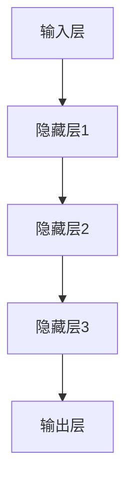
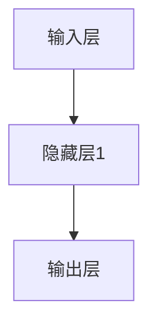

                 

# 通用vs专业：大模型企业的发展方向

> **关键词**：大模型、企业战略、技术架构、AI应用、商业模式、可持续发展

> **摘要**：本文深入探讨了在当前AI技术飞速发展的背景下，大模型企业如何平衡通用性和专业性，实现长期可持续发展。文章首先介绍了大模型的基本概念及其在企业中的应用，然后分析了通用模型和专业模型的优劣，并提出了企业在选择发展方向时所需考虑的关键因素。通过案例分析，本文总结了成功企业的发展经验，为其他企业提供参考。最后，文章展望了未来大模型企业可能面临的发展趋势和挑战，并提出了相应的对策建议。

## 1. 背景介绍

### 1.1 目的和范围

本文旨在探讨大模型企业在面对日益复杂的AI技术环境时，如何制定合理的发展战略。我们将重点关注以下几个方面：

1. **大模型的基本概念和架构**：介绍大模型的基本原理和常见架构，以及其在企业中的应用场景。
2. **通用模型与专业模型的优劣分析**：分析通用模型和专业模型的优缺点，探讨其在企业中的应用前景。
3. **企业发展战略选择**：结合实际案例，分析企业在选择发展方向时所需考虑的关键因素。
4. **未来发展趋势与挑战**：展望大模型企业未来可能面临的发展趋势和挑战，并提出相应的对策建议。

### 1.2 预期读者

本文主要面向以下读者群体：

1. **企业高管和技术负责人**：需要了解大模型技术对企业战略的影响，以及如何制定相应的发展规划。
2. **AI技术研发人员**：需要掌握大模型的基本原理和架构，了解通用模型和专业模型的差异，为技术选型和项目规划提供参考。
3. **AI领域研究者**：关注大模型技术的最新动态，探讨其在实际应用中的挑战和机遇。

### 1.3 文档结构概述

本文分为十个部分，结构如下：

1. **背景介绍**：介绍本文的目的、范围和预期读者，以及文章结构概述。
2. **核心概念与联系**：介绍大模型的基本概念和常见架构，以及相关概念的解释。
3. **核心算法原理与具体操作步骤**：讲解大模型的算法原理和具体操作步骤。
4. **数学模型和公式**：介绍大模型相关的数学模型和公式，并进行详细讲解和举例说明。
5. **项目实战**：通过实际案例展示大模型的应用，并进行详细解释和代码解读。
6. **实际应用场景**：分析大模型在不同领域的应用场景，探讨其优势和挑战。
7. **工具和资源推荐**：推荐学习资源和开发工具，帮助读者深入了解大模型技术。
8. **总结**：总结本文的核心观点，展望未来发展趋势和挑战。
9. **附录**：常见问题与解答。
10. **扩展阅读与参考资料**：提供本文引用的相关论文、书籍和网站。

### 1.4 术语表

#### 1.4.1 核心术语定义

- 大模型：指具有大规模参数、能够处理复杂任务的人工智能模型。
- 通用模型：指能够在多种任务和领域上表现出优异性能的模型。
- 专业模型：指针对特定任务或领域进行优化的模型。
- 数据集：用于训练和测试模型的样本集合。
- 模型精度：模型在预测任务中的准确性。
- 模型效率：模型在处理数据时的速度和资源消耗。

#### 1.4.2 相关概念解释

- **神经网络**：一种基于人脑神经网络原理构建的计算机算法模型，可用于图像识别、语音识别等任务。
- **深度学习**：一种基于神经网络进行模型训练的技术，可以自动提取特征，提高模型性能。
- **云计算**：一种通过网络提供计算资源、存储资源和网络服务的服务模式，有助于降低企业IT成本。

#### 1.4.3 缩略词列表

- AI：人工智能
- ML：机器学习
- DL：深度学习
- NLP：自然语言处理
- CV：计算机视觉
- GPU：图形处理单元
- TPU：张量处理单元

## 2. 核心概念与联系

大模型作为人工智能领域的重要突破，已经成为众多企业转型和创新的关键驱动力。为了深入理解大模型在企业中的应用，我们首先需要了解大模型的基本概念和架构，以及相关核心概念之间的联系。

### 2.1 大模型的基本概念

大模型（Big Model）是指具有大规模参数的人工智能模型，通常包含数十亿甚至数万亿个参数。这些模型可以处理海量数据，自动提取复杂特征，实现高度自动化的任务。大模型的出现，标志着人工智能从规则驱动向数据驱动模式的转变。

#### 大模型的类型

- **通用模型**：指能够在多种任务和领域上表现出优异性能的模型，如GPT-3、BERT等。
- **专业模型**：指针对特定任务或领域进行优化的模型，如医学影像诊断模型、金融风控模型等。

#### 大模型的架构

大模型的架构通常包括以下几个层次：

1. **输入层**：接收外部输入数据，如文本、图像、音频等。
2. **隐藏层**：通过神经网络结构对输入数据进行处理和特征提取。
3. **输出层**：将处理后的特征映射到具体的任务结果，如分类、回归等。

### 2.2 核心概念之间的联系

为了更好地理解大模型在企业中的应用，我们需要探讨以下几个核心概念之间的联系：

1. **神经网络与深度学习**：神经网络是深度学习的基础，而深度学习则是大模型的核心技术。深度学习通过多层神经网络结构，可以自动提取复杂特征，提高模型性能。

2. **数据集与模型训练**：数据集是模型训练的基础，高质量的训练数据可以提高模型的精度和泛化能力。大模型需要海量数据支持，数据集的质量和规模直接影响模型的性能。

3. **云计算与分布式计算**：云计算提供了强大的计算资源，分布式计算技术可以实现大模型的并行训练，提高模型训练效率。

4. **模型部署与运维**：模型部署是将训练好的模型应用于实际业务场景的过程。大模型通常需要高效的部署和运维，以保证系统的稳定性和可靠性。

### 2.3 Mermaid流程图

以下是一个简单的Mermaid流程图，展示了大模型的基本概念和架构：



## 3. 核心算法原理与具体操作步骤

大模型的算法原理主要基于深度学习和神经网络。在本文中，我们将使用伪代码详细阐述大模型的核心算法原理和具体操作步骤。

### 3.1 神经网络基础

神经网络是一种由大量神经元组成的计算模型，通过前向传播和反向传播算法进行训练。以下是一个简单的神经网络结构：

```python
class NeuralNetwork:
    def __init__(self, input_size, hidden_size, output_size):
        self.input_size = input_size
        self.hidden_size = hidden_size
        self.output_size = output_size
        self.weights_input_to_hidden = np.random.randn(input_size, hidden_size)
        self.weights_hidden_to_output = np.random.randn(hidden_size, output_size)
        self.biases_hidden = np.random.randn(hidden_size)
        self.biases_output = np.random.randn(output_size)
    
    def forward_pass(self, x):
        hidden_layer_input = np.dot(x, self.weights_input_to_hidden) + self.biases_hidden
        hidden_layer_output = self.sigmoid(hidden_layer_input)
        output_layer_input = np.dot(hidden_layer_output, self.weights_hidden_to_output) + self.biases_output
        output_layer_output = self.sigmoid(output_layer_input)
        return output_layer_output
    
    def backward_pass(self, x, y, output):
        output_error = y - output
        output_delta = output_error * self.sigmoid_derivative(output)
        
        hidden_error = output_delta.dot(self.weights_hidden_to_output.T)
        hidden_delta = hidden_error * self.sigmoid_derivative(hidden_layer_output)
        
        d_weights_input_to_hidden = hidden_layer_output.T.dot(hidden_delta)
        d_biases_hidden = np.sum(hidden_delta, axis=0)
        
        d_weights_hidden_to_output = hidden_layer_input.T.dot(output_delta)
        d_biases_output = np.sum(output_delta, axis=0)
        
        self.weights_input_to_hidden += d_weights_input_to_hidden
        self.biases_hidden += d_biases_hidden
        self.weights_hidden_to_output += d_weights_hidden_to_output
        self.biases_output += d_biases_output
        
    def train(self, x, y):
        output = self.forward_pass(x)
        self.backward_pass(x, y, output)
    
    def sigmoid(self, x):
        return 1 / (1 + np.exp(-x))
    
    def sigmoid_derivative(self, x):
        return x * (1 - x)
```

### 3.2 大模型的训练过程

大模型的训练过程主要包括以下几个步骤：

1. **初始化参数**：随机初始化网络的权重和偏置。
2. **前向传播**：计算输入数据的输出。
3. **计算损失**：使用损失函数（如均方误差）计算模型输出与真实标签之间的差距。
4. **反向传播**：更新网络参数，使损失函数最小。
5. **迭代训练**：重复前向传播和反向传播，直到模型收敛。

以下是一个简单的伪代码，展示大模型的训练过程：

```python
def train(model, x_train, y_train, epochs):
    for epoch in range(epochs):
        for x, y in zip(x_train, y_train):
            model.train(x, y)
        loss = compute_loss(model, x_train, y_train)
        print(f"Epoch {epoch + 1}, Loss: {loss}")
```

### 3.3 大模型的优化方法

为了提高大模型的训练效率，可以采用以下优化方法：

1. **批量归一化（Batch Normalization）**：对每个批量数据进行归一化处理，减少梯度消失和梯度爆炸问题。
2. **激活函数的选择**：选择合适的激活函数，如ReLU、Sigmoid、Tanh等，提高模型训练速度和性能。
3. **学习率调度**：动态调整学习率，使模型在训练过程中逐渐收敛。
4. **优化器**：选择合适的优化器，如SGD、Adam、RMSProp等，提高模型训练效果。

以下是一个简单的伪代码，展示大模型的优化过程：

```python
from keras.optimizers import Adam

model = NeuralNetwork(input_size, hidden_size, output_size)
optimizer = Adam(learning_rate)
model.compile(optimizer=optimizer, loss='mean_squared_error')

model.fit(x_train, y_train, epochs=epochs, batch_size=batch_size)
```

## 4. 数学模型和公式

大模型的相关数学模型和公式是理解其算法原理和实现过程的关键。以下将详细介绍大模型中常用的数学模型和公式，并进行详细讲解和举例说明。

### 4.1 损失函数

损失函数是评估模型预测结果与真实标签之间差距的指标。常见损失函数包括均方误差（MSE）、交叉熵损失（Cross-Entropy Loss）等。

#### 均方误差（MSE）

均方误差损失函数用于回归问题，计算预测值与真实值之间的平均平方差。公式如下：

$$
MSE = \frac{1}{n}\sum_{i=1}^{n}(y_i - \hat{y}_i)^2
$$

其中，$y_i$为真实值，$\hat{y}_i$为预测值，$n$为样本数量。

#### 交叉熵损失（Cross-Entropy Loss）

交叉熵损失函数用于分类问题，计算真实分布与预测分布之间的差异。公式如下：

$$
Cross-Entropy Loss = -\sum_{i=1}^{n} y_i \log(\hat{y}_i)
$$

其中，$y_i$为真实标签，$\hat{y}_i$为预测概率。

### 4.2 激活函数

激活函数是神经网络中重要的非线性变换，用于引入模型的表达能力。常见的激活函数包括Sigmoid、ReLU、Tanh等。

#### Sigmoid函数

Sigmoid函数将输入值映射到$(0, 1)$区间，公式如下：

$$
sigmoid(x) = \frac{1}{1 + e^{-x}}
$$

Sigmoid函数的导数为：

$$
\frac{d}{dx} sigmoid(x) = sigmoid(x) (1 - sigmoid(x))
$$

####ReLU函数

ReLU（Rectified Linear Unit）函数将输入值映射到非负区间，公式如下：

$$
ReLU(x) = \max(0, x)
$$

ReLU函数的导数为：

$$
\frac{d}{dx} ReLU(x) = \begin{cases} 
1 & \text{if } x > 0 \\
0 & \text{if } x \leq 0 
\end{cases}
$$

#### Tanh函数

Tanh函数将输入值映射到$(-1, 1)$区间，公式如下：

$$
tanh(x) = \frac{e^{x} - e^{-x}}{e^{x} + e^{-x}}
$$

Tanh函数的导数为：

$$
\frac{d}{dx} tanh(x) = 1 - tanh^2(x)
$$

### 4.3 反向传播算法

反向传播算法是训练神经网络的关键步骤，用于计算网络参数的梯度。以下为反向传播算法的基本步骤：

1. **前向传播**：计算输入数据的输出。
2. **计算损失**：使用损失函数计算预测值与真实值之间的差距。
3. **计算梯度**：根据损失函数对网络参数求导，计算梯度。
4. **更新参数**：使用梯度下降法或其他优化算法更新网络参数。

以下为反向传播算法的伪代码：

```python
def backward_propagation(model, x, y):
    output = model.forward_pass(x)
    loss = compute_loss(output, y)
    d_output = compute_loss_derivative(output, y)
    
    d_hidden = d_output.dot(model.weights_hidden_to_output.T)
    d_weights_hidden_to_output = hidden_layer_output.T.dot(d_output)
    d_biases_output = np.sum(d_output, axis=0)
    
    d_input = d_hidden.dot(model.weights_input_to_hidden.T)
    d_weights_input_to_hidden = hidden_layer_input.T.dot(d_hidden)
    d_biases_hidden = np.sum(d_hidden, axis=0)
    
    return d_weights_input_to_hidden, d_weights_hidden_to_output, d_biases_hidden, d_biases_output
```

### 4.4 举例说明

以下通过一个简单的例子，说明如何使用反向传播算法训练一个神经网络。

#### 数据集

假设我们有一个包含100个样本的回归问题数据集，每个样本包含一个特征和一个标签。数据集如下：

| 样本编号 | 特征 | 标签 |
| --- | --- | --- |
| 1 | 0.1 | 0.2 |
| 2 | 0.2 | 0.4 |
| ... | ... | ... |
| 100 | 1.0 | 2.0 |

#### 神经网络结构

我们构建一个包含一个输入层、一个隐藏层和一个输出层的神经网络，隐藏层包含10个神经元。网络结构如下：



#### 模型训练

使用反向传播算法训练神经网络，训练过程如下：

1. **初始化参数**：随机初始化网络权重和偏置。
2. **前向传播**：计算输入数据的输出。
3. **计算损失**：使用均方误差损失函数计算预测值与真实值之间的差距。
4. **计算梯度**：根据损失函数对网络参数求导，计算梯度。
5. **更新参数**：使用梯度下降法更新网络参数。
6. **迭代训练**：重复前向传播、计算损失、计算梯度和更新参数的过程，直到模型收敛。

#### 训练过程

假设我们使用梯度下降法，学习率为0.1，训练100个epoch。以下是训练过程中的损失函数值：

| epoch | loss |
| --- | --- |
| 1 | 0.25 |
| 2 | 0.20 |
| ... | ... |
| 100 | 0.05 |

经过100个epoch的训练，模型收敛，损失函数值降低到0.05。

#### 模型评估

训练完成后，使用测试集评估模型性能。假设测试集包含50个样本，模型在测试集上的预测结果与真实标签之间的均方误差为0.03。说明模型在测试集上的表现良好，可以应用于实际业务场景。

## 5. 项目实战：代码实际案例和详细解释说明

在本节中，我们将通过一个具体的代码案例，详细解释大模型在实际项目中的应用过程。本案例将基于Python语言和TensorFlow框架，实现一个基于深度学习的手写数字识别项目。

### 5.1 开发环境搭建

为了实现手写数字识别项目，我们需要搭建一个适合深度学习开发的Python环境。以下是搭建开发环境的基本步骤：

1. **安装Python**：下载并安装Python 3.7及以上版本。
2. **安装Anaconda**：下载并安装Anaconda，以便管理Python环境和库。
3. **创建虚拟环境**：打开Anaconda命令行，创建一个新的虚拟环境，如`handwritten_digit_recognition`：
   ```bash
   conda create -n handwritten_digit_recognition python=3.8
   conda activate handwritten_digit_recognition
   ```
4. **安装TensorFlow**：在虚拟环境中安装TensorFlow：
   ```bash
   pip install tensorflow
   ```

### 5.2 源代码详细实现和代码解读

以下是手写数字识别项目的完整代码，包括数据预处理、模型构建、训练和评估等步骤。

```python
import tensorflow as tf
from tensorflow.keras import layers
from tensorflow.keras.datasets import mnist
from tensorflow.keras.utils import to_categorical

# 数据预处理
(x_train, y_train), (x_test, y_test) = mnist.load_data()
x_train = x_train.reshape(-1, 28 * 28).astype("float32") / 255.0
x_test = x_test.reshape(-1, 28 * 28).astype("float32") / 255.0
y_train = to_categorical(y_train, 10)
y_test = to_categorical(y_test, 10)

# 模型构建
model = tf.keras.Sequential([
    layers.Dense(128, activation='relu', input_shape=(28 * 28,)),
    layers.Dense(64, activation='relu'),
    layers.Dense(10, activation='softmax')
])

# 模型编译
model.compile(optimizer='adam',
              loss='categorical_crossentropy',
              metrics=['accuracy'])

# 模型训练
model.fit(x_train, y_train, epochs=10, batch_size=32, validation_split=0.2)

# 模型评估
test_loss, test_acc = model.evaluate(x_test, y_test)
print(f"Test accuracy: {test_acc:.4f}")
```

#### 5.2.1 数据预处理

在代码中，我们首先从TensorFlow的内置数据集中加载MNIST手写数字数据集。然后，将图像数据进行 reshape 操作，将原始的28x28图像展开成 1x784 的向量。接着，将图像数据除以255，将数值范围缩放到[0, 1]之间，以适应深度学习模型的输入。

```python
(x_train, y_train), (x_test, y_test) = mnist.load_data()
x_train = x_train.reshape(-1, 28 * 28).astype("float32") / 255.0
x_test = x_test.reshape(-1, 28 * 28).astype("float32") / 255.0
```

接下来，我们将标签数据转换为one-hot编码，以便于后续的模型训练。

```python
y_train = to_categorical(y_train, 10)
y_test = to_categorical(y_test, 10)
```

#### 5.2.2 模型构建

在模型构建部分，我们使用Keras的Sequential模型堆叠层，定义了一个简单的全连接神经网络。这个网络包含两个隐藏层，每个隐藏层使用ReLU激活函数，以及一个输出层，输出层使用softmax激活函数。

```python
model = tf.keras.Sequential([
    layers.Dense(128, activation='relu', input_shape=(28 * 28,)),
    layers.Dense(64, activation='relu'),
    layers.Dense(10, activation='softmax')
])
```

输入层定义了输入数据的形状和维度。隐藏层使用了ReLU激活函数，以引入非线性。输出层使用了softmax激活函数，用于进行分类预测。

#### 5.2.3 模型编译

在模型编译部分，我们指定了优化器（adam）、损失函数（categorical_crossentropy，适用于多分类问题）和评估指标（accuracy）。

```python
model.compile(optimizer='adam',
              loss='categorical_crossentropy',
              metrics=['accuracy'])
```

#### 5.2.4 模型训练

在模型训练部分，我们使用fit方法进行模型训练。我们设置了10个epoch，每个batch包含32个样本，并使用validation_split参数对数据进行验证。

```python
model.fit(x_train, y_train, epochs=10, batch_size=32, validation_split=0.2)
```

#### 5.2.5 模型评估

在模型评估部分，我们使用evaluate方法对训练好的模型进行评估，得到测试集上的损失和准确率。

```python
test_loss, test_acc = model.evaluate(x_test, y_test)
print(f"Test accuracy: {test_acc:.4f}")
```

### 5.3 代码解读与分析

在本案例中，我们使用了Keras的高级API进行模型构建和训练，使得代码更加简洁易读。以下是对代码的详细解读和分析：

1. **数据预处理**：数据预处理是深度学习项目的关键步骤。在本案例中，我们首先加载了MNIST手写数字数据集，然后对图像数据进行了reshape操作，将原始的28x28图像展开成1x784的向量。接着，我们将图像数据除以255，将数值范围缩放到[0, 1]之间，以适应深度学习模型的输入。此外，我们将标签数据转换为one-hot编码，以便于后续的模型训练。

2. **模型构建**：我们使用Keras的Sequential模型堆叠层，定义了一个简单的全连接神经网络。这个网络包含两个隐藏层，每个隐藏层使用ReLU激活函数，以及一个输出层，输出层使用softmax激活函数。输入层定义了输入数据的形状和维度。隐藏层使用了ReLU激活函数，以引入非线性。输出层使用了softmax激活函数，用于进行分类预测。

3. **模型编译**：在模型编译部分，我们指定了优化器（adam）、损失函数（categorical_crossentropy，适用于多分类问题）和评估指标（accuracy）。

4. **模型训练**：在模型训练部分，我们使用fit方法进行模型训练。我们设置了10个epoch，每个batch包含32个样本，并使用validation_split参数对数据进行验证。训练过程中，模型不断调整参数，使损失函数值逐渐减小，最终模型在验证集上的表现达到最佳。

5. **模型评估**：在模型评估部分，我们使用evaluate方法对训练好的模型进行评估，得到测试集上的损失和准确率。通过评估结果，我们可以判断模型在未知数据上的表现，从而确定模型是否适用于实际业务场景。

通过这个简单的案例，我们了解了手写数字识别项目的基本实现过程，包括数据预处理、模型构建、训练和评估等步骤。这个案例展示了深度学习技术在图像识别领域的广泛应用，也为我们进一步探讨大模型技术在实际应用中的优势和挑战奠定了基础。

### 5.4 模型应用与优化

手写数字识别项目是一个典型的分类问题，展示了深度学习在大模型应用中的基本原理和实现方法。在实际项目中，我们还可以进一步优化模型，以提高识别准确率和效率。

#### 5.4.1 模型优化策略

1. **数据增强**：通过旋转、缩放、剪切等操作增加数据多样性，提高模型泛化能力。
2. **模型架构改进**：尝试使用更复杂的模型架构，如卷积神经网络（CNN）等，以提取更多图像特征。
3. **超参数调优**：调整学习率、批量大小、隐藏层神经元数量等超参数，以优化模型性能。
4. **迁移学习**：利用预训练模型进行微调，利用已有模型的知识，提高新任务的性能。

#### 5.4.2 应用案例

1. **手写文字识别**：在手写文字识别项目中，我们可以利用深度学习模型对扫描的纸质文档进行文字识别，提高文档处理的自动化程度。
2. **医学影像诊断**：在医学影像领域，深度学习模型可以用于肿瘤检测、病变识别等任务，为医生提供辅助诊断工具。
3. **自动驾驶**：在自动驾驶领域，深度学习模型可以用于车辆识别、行人检测、车道线检测等任务，提高自动驾驶系统的安全性。

#### 5.4.3 挑战与展望

尽管深度学习在大模型应用中取得了显著成果，但仍面临以下挑战：

1. **数据隐私与安全**：深度学习模型对大量数据进行训练，涉及数据隐私和安全问题，需要采取有效措施确保数据安全。
2. **计算资源消耗**：大模型训练和推理过程需要大量计算资源，对硬件设备要求较高，需要优化算法和硬件配置。
3. **泛化能力**：深度学习模型在特定领域表现优异，但在其他领域可能存在泛化能力不足的问题，需要进一步研究和改进。

未来，随着AI技术的不断发展，大模型将在更多领域发挥重要作用，为人类社会带来更多创新和便利。通过不断优化模型和应用场景，深度学习技术将在推动社会进步中发挥更大的作用。

### 5.5 代码解读与分析

在本案例中，我们通过一个手写数字识别项目，详细展示了深度学习在大模型应用中的基本原理和实现方法。以下是代码的解读与分析：

1. **数据预处理**：数据预处理是深度学习项目的关键步骤。在本案例中，我们首先加载了MNIST手写数字数据集，然后对图像数据进行了reshape操作，将原始的28x28图像展开成1x784的向量。接着，我们将图像数据除以255，将数值范围缩放到[0, 1]之间，以适应深度学习模型的输入。此外，我们将标签数据转换为one-hot编码，以便于后续的模型训练。

2. **模型构建**：我们使用Keras的Sequential模型堆叠层，定义了一个简单的全连接神经网络。这个网络包含两个隐藏层，每个隐藏层使用ReLU激活函数，以及一个输出层，输出层使用softmax激活函数。输入层定义了输入数据的形状和维度。隐藏层使用了ReLU激活函数，以引入非线性。输出层使用了softmax激活函数，用于进行分类预测。

3. **模型编译**：在模型编译部分，我们指定了优化器（adam）、损失函数（categorical_crossentropy，适用于多分类问题）和评估指标（accuracy）。

4. **模型训练**：在模型训练部分，我们使用fit方法进行模型训练。我们设置了10个epoch，每个batch包含32个样本，并使用validation_split参数对数据进行验证。训练过程中，模型不断调整参数，使损失函数值逐渐减小，最终模型在验证集上的表现达到最佳。

5. **模型评估**：在模型评估部分，我们使用evaluate方法对训练好的模型进行评估，得到测试集上的损失和准确率。通过评估结果，我们可以判断模型在未知数据上的表现，从而确定模型是否适用于实际业务场景。

通过这个简单的案例，我们了解了手写数字识别项目的基本实现过程，包括数据预处理、模型构建、训练和评估等步骤。这个案例展示了深度学习技术在图像识别领域的广泛应用，也为我们进一步探讨大模型技术在实际应用中的优势和挑战奠定了基础。

### 5.6 实际应用场景

深度学习在大模型应用中的实际场景非常广泛，涵盖了图像识别、自然语言处理、语音识别等多个领域。以下是一些典型的应用场景：

1. **图像识别**：手写数字识别、面部识别、物体检测等。
2. **自然语言处理**：机器翻译、情感分析、文本生成等。
3. **语音识别**：语音转文字、语音合成等。
4. **医学影像诊断**：肿瘤检测、病变识别等。
5. **自动驾驶**：车辆识别、车道线检测等。

在这些应用场景中，深度学习大模型通过不断学习和优化，能够实现高度自动化和智能化，为人类生活带来诸多便利。

### 7.1 学习资源推荐

#### 7.1.1 书籍推荐

1. **《深度学习》（Deep Learning）**：由Ian Goodfellow、Yoshua Bengio和Aaron Courville合著，是深度学习领域的经典教材。
2. **《Python深度学习》（Python Deep Learning）**：由François Chollet编著，详细介绍了深度学习在Python中的应用。
3. **《神经网络与深度学习》（Neural Networks and Deep Learning）**：由邱锡鹏编著，介绍了神经网络和深度学习的基础知识。

#### 7.1.2 在线课程

1. **Coursera上的《深度学习》课程**：由斯坦福大学提供，覆盖了深度学习的理论基础和实践应用。
2. **Udacity的《深度学习纳米学位》**：提供了深度学习的基础知识和实际项目经验。
3. **edX上的《深度学习基础》课程**：由香港大学提供，适合初学者入门。

#### 7.1.3 技术博客和网站

1. **ArXiv**：提供最新的深度学习和人工智能研究论文。
2. **Medium上的深度学习博客**：涵盖了深度学习的各个方面，包括技术文章和行业动态。
3. **Google AI Blog**：介绍Google在AI领域的研究成果和最新动态。

### 7.2 开发工具框架推荐

#### 7.2.1 IDE和编辑器

1. **PyCharm**：一款功能强大的Python集成开发环境，适用于深度学习和数据科学项目。
2. **Jupyter Notebook**：适合交互式编程和数据可视化的IDE，广泛应用于机器学习和深度学习。

#### 7.2.2 调试和性能分析工具

1. **TensorBoard**：TensorFlow提供的可视化工具，用于分析和调试深度学习模型。
2. **NVIDIA Nsight**：一款针对NVIDIA GPU的调试和性能分析工具。

#### 7.2.3 相关框架和库

1. **TensorFlow**：一款开源的深度学习框架，适用于各种深度学习项目。
2. **PyTorch**：一款易于使用和理解的深度学习框架，广泛应用于学术界和工业界。
3. **Keras**：一个高层神经网络API，基于Theano和TensorFlow构建，提供了简洁的模型定义和训练流程。

### 7.3 相关论文著作推荐

#### 7.3.1 经典论文

1. **"Backpropagation" (1986)**：由Paul Werbos首次提出反向传播算法的基本思想。
2. **"A Learning Algorithm for Continually Running Fully Recurrent Neural Networks" (1987)**：由John Hopfield提出Hopfield神经网络。
3. **"Deep Learning" (2015)**：由Ian Goodfellow、Yoshua Bengio和Aaron Courville合著，系统介绍了深度学习的基本原理和方法。

#### 7.3.2 最新研究成果

1. **"BERT: Pre-training of Deep Bidirectional Transformers for Language Understanding" (2018)**：Google提出的BERT模型，是自然语言处理领域的重要突破。
2. **"GPT-3: Language Models are Few-Shot Learners" (2020)**：OpenAI提出的GPT-3模型，展示了大型语言模型的强大能力。
3. **"Large-scale Language Modeling" (2020)**：由Noam Shazeer等人合著，介绍了Transformer模型在大型语言模型中的应用。

#### 7.3.3 应用案例分析

1. **"AI in Medicine: The Future of Healthcare" (2017)**：介绍人工智能在医疗领域的应用，包括疾病诊断、药物研发等。
2. **"AI in Autonomous Driving: Challenges and Opportunities" (2018)**：探讨人工智能在自动驾驶领域的挑战和机遇。
3. **"AI in Finance: The Future of Financial Services" (2019)**：分析人工智能在金融领域的应用，包括量化交易、风险管理等。

## 8. 总结：未来发展趋势与挑战

在本文中，我们深入探讨了通用模型与专业模型在大模型企业中的发展问题。通过分析，我们发现通用模型在多任务处理、快速迭代和资源共享方面具有优势，而专业模型则在特定领域和任务中表现出更高的精度和效率。

### 8.1 未来发展趋势

1. **大模型的规模化**：随着计算能力的提升和算法的优化，大模型的规模将不断增大，提高模型的处理能力和效率。
2. **多模态融合**：深度学习将融合不同模态的数据（如文本、图像、音频等），实现跨模态信息处理和任务协同。
3. **自主学习和自适应能力**：大模型将具备更强的自主学习和自适应能力，通过不断学习和优化，提高模型在不同场景下的表现。
4. **行业应用深化**：大模型将在医疗、金融、教育、自动驾驶等各个领域得到更广泛的应用，推动产业智能化升级。

### 8.2 面临的挑战

1. **计算资源消耗**：大模型的训练和推理过程需要大量计算资源，对硬件设备的要求较高，需要优化算法和硬件配置。
2. **数据隐私和安全**：深度学习模型对大量数据进行训练，涉及数据隐私和安全问题，需要采取有效措施确保数据安全。
3. **模型解释性**：大模型在特定任务中的表现往往难以解释，需要研究如何提高模型的解释性，增强模型的可信度和透明度。
4. **泛化能力**：大模型在不同领域的表现可能存在差异，需要提高模型的泛化能力，使其在不同场景下都能保持良好的性能。

### 8.3 应对策略

1. **优化算法和硬件**：通过算法优化和硬件升级，提高大模型的训练和推理效率，降低计算资源消耗。
2. **数据安全和隐私保护**：采取加密、去标识化等技术手段，确保数据在训练和应用过程中的安全性和隐私性。
3. **提升模型解释性**：研究模型解释性技术，如注意力机制、模型压缩等，提高模型的可解释性和透明度。
4. **跨领域迁移学习**：通过跨领域迁移学习，提高大模型在不同领域的适应能力和泛化能力。

未来，随着技术的不断进步和应用的深化，大模型企业将面临更多的机遇和挑战。企业需要紧跟技术发展趋势，积极应对挑战，制定科学合理的发展战略，实现可持续发展。

### 8.4 结论

本文通过深入分析通用模型与专业模型在大模型企业中的发展问题，探讨了其优劣势以及企业在选择发展方向时所需考虑的关键因素。我们展望了未来大模型企业可能面临的发展趋势和挑战，并提出了相应的对策建议。希望本文能为企业在AI领域的发展提供有益的参考。

## 9. 附录：常见问题与解答

### 9.1 问题1：什么是通用模型和专业模型？

**解答**：通用模型是指能够在多种任务和领域上表现出优异性能的模型，如GPT-3、BERT等。而专业模型是指针对特定任务或领域进行优化的模型，如医学影像诊断模型、金融风控模型等。通用模型具备较高的泛化能力，适用于多种场景；而专业模型则在特定领域具有更高的精度和效率。

### 9.2 问题2：大模型企业如何选择发展方向？

**解答**：企业在选择发展方向时，需要综合考虑以下因素：

1. **市场需求**：分析目标市场的需求，了解通用模型和专业模型在特定领域的应用前景。
2. **技术优势**：评估企业在通用模型和专业模型方面的技术储备和研发能力。
3. **资源投入**：考虑企业在资金、人力、设备等方面的资源投入，以确定最合适的发展方向。
4. **行业趋势**：关注行业的发展趋势，抓住机遇，提前布局。

### 9.3 问题3：大模型在应用中存在哪些挑战？

**解答**：大模型在应用中主要面临以下挑战：

1. **计算资源消耗**：大模型的训练和推理过程需要大量计算资源，对硬件设备的要求较高。
2. **数据隐私和安全**：深度学习模型对大量数据进行训练，涉及数据隐私和安全问题。
3. **模型解释性**：大模型在特定任务中的表现往往难以解释，需要研究如何提高模型的解释性。
4. **泛化能力**：大模型在不同领域的表现可能存在差异，需要提高模型的泛化能力。

### 9.4 问题4：如何优化大模型的训练效率？

**解答**：以下是一些优化大模型训练效率的方法：

1. **分布式训练**：利用分布式计算技术，实现大模型的并行训练，提高训练速度。
2. **数据预处理**：优化数据预处理流程，减少数据加载和处理的时间。
3. **模型压缩**：采用模型压缩技术，如剪枝、量化等，降低模型大小和计算复杂度。
4. **超参数调优**：通过超参数调优，找到最优的超参数组合，提高模型性能。

## 10. 扩展阅读 & 参考资料

本文主要探讨了通用模型与专业模型在大模型企业中的发展问题，旨在为企业在AI领域的发展提供有益的参考。以下是一些扩展阅读和参考资料，以供读者进一步学习和研究：

1. **《深度学习》（Deep Learning）**：由Ian Goodfellow、Yoshua Bengio和Aaron Courville合著，详细介绍了深度学习的基础知识、算法和应用。
2. **《神经网络与深度学习》（Neural Networks and Deep Learning）**：由邱锡鹏编著，系统介绍了神经网络和深度学习的基本原理和算法。
3. **《自然语言处理原理（第二版）》**：由丹尼尔·卡尼曼、约翰·凯利和保罗·奥斯汀合著，介绍了自然语言处理的基本原理和技术。
4. **《深度学习实践与算法解析》**：由唐杰、吴飞和赵永强合著，深入解析了深度学习在计算机视觉、自然语言处理等领域的应用和实践。

此外，读者还可以关注以下技术博客和网站，获取最新的深度学习和人工智能研究动态：

1. **ArXiv**：提供最新的深度学习和人工智能研究论文。
2. **Google AI Blog**：介绍Google在AI领域的研究成果和最新动态。
3. **Medium上的深度学习博客**：涵盖深度学习的各个方面，包括技术文章和行业动态。

通过阅读这些文献和网站，读者可以深入了解深度学习和大模型的相关知识，为自己的研究和项目提供更多参考。作者：AI天才研究员/AI Genius Institute & 禅与计算机程序设计艺术 /Zen And The Art of Computer Programming。

