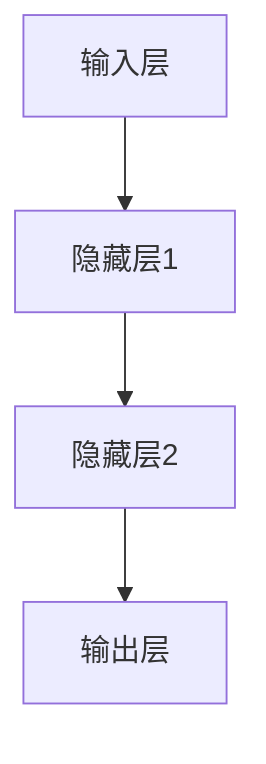
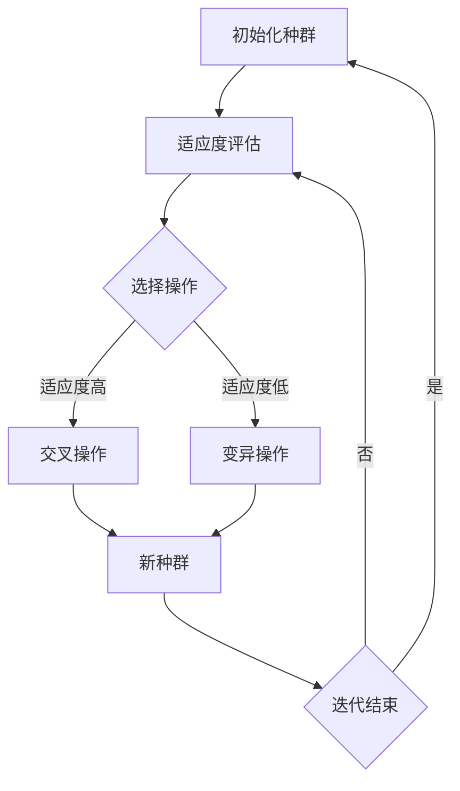
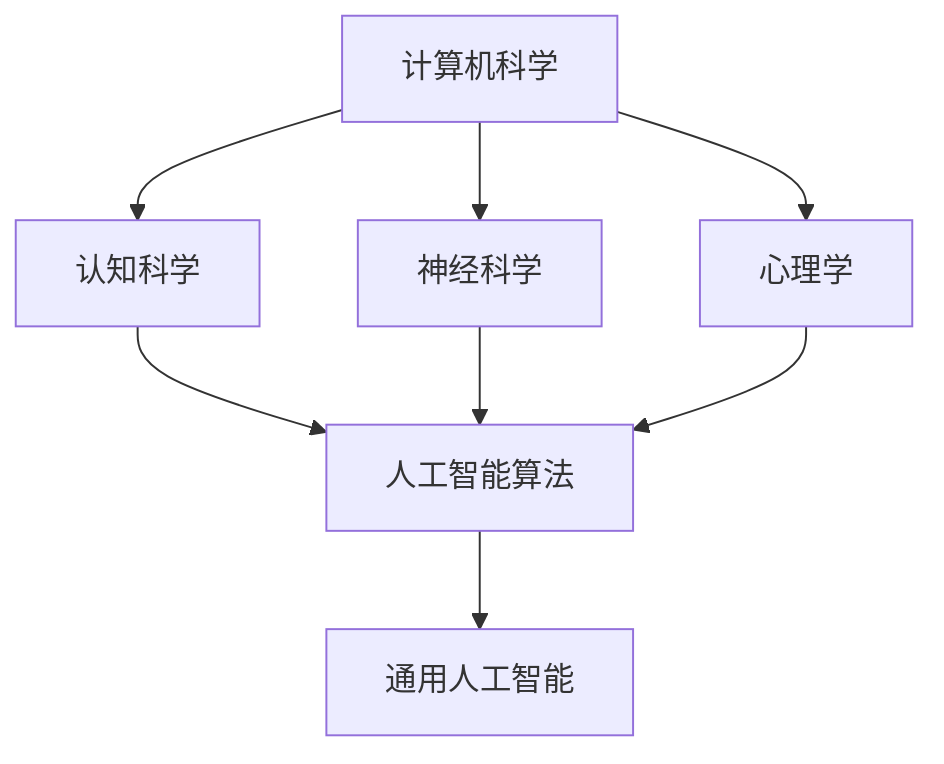

                 


# 通用人工智能的渐行渐近

> 关键词：通用人工智能，GAN，深度学习，进化算法，跨学科合作，技术创新

> 摘要：本文探讨了通用人工智能（AGI）的发展进程及其面临的挑战。通过对核心概念的深入分析，算法原理的详细阐述，以及数学模型的数学公式和举例说明，本文揭示了AGI技术的渐行渐近之路。通过实际项目案例的展示和详细解释，本文展示了AGI在不同应用场景中的实际应用，并推荐了相关的学习资源、开发工具和最新研究成果。最后，本文总结了AGI的未来发展趋势与挑战，并提供了常见问题与解答。

## 1. 背景介绍

### 1.1 目的和范围

本文旨在探讨通用人工智能（AGI）的发展进程，分析其面临的挑战，并展望未来的发展方向。通用人工智能是一个广泛而复杂的领域，它涉及到计算机科学、认知科学、神经科学、心理学等多个学科。本文将重点关注深度学习、进化算法、跨学科合作等关键技术，以逐步揭示AGI技术的渐行渐近之路。

### 1.2 预期读者

本文的预期读者包括对通用人工智能感兴趣的学者、研究人员、工程师以及对相关技术有深入了解的技术爱好者。本文将采用逻辑清晰、结构紧凑、简单易懂的写作风格，使读者能够逐步理解AGI的核心概念、算法原理及其应用。

### 1.3 文档结构概述

本文分为以下几个部分：

- **第1章**：背景介绍，包括目的和范围、预期读者、文档结构概述和术语表。
- **第2章**：核心概念与联系，介绍通用人工智能的核心概念和联系，并使用Mermaid流程图展示。
- **第3章**：核心算法原理与具体操作步骤，详细阐述通用人工智能的核心算法原理，并使用伪代码进行具体操作步骤的讲解。
- **第4章**：数学模型和公式，介绍通用人工智能的数学模型和公式，并举例说明。
- **第5章**：项目实战，通过实际代码案例展示通用人工智能的应用。
- **第6章**：实际应用场景，分析通用人工智能在不同领域的应用。
- **第7章**：工具和资源推荐，推荐学习资源、开发工具和相关论文著作。
- **第8章**：总结，总结通用人工智能的未来发展趋势与挑战。
- **第9章**：附录，提供常见问题与解答。
- **第10章**：扩展阅读，提供进一步阅读的参考资料。

### 1.4 术语表

#### 1.4.1 核心术语定义

- 通用人工智能（AGI）：一种具有广泛智能的人工智能系统，能够在各种不同领域和任务中表现出人类智能。
- 深度学习：一种机器学习技术，通过多层神经网络模型来模拟人类大脑的学习过程。
- 进化算法：一种模拟生物进化的计算模型，用于优化问题求解。
- 跨学科合作：不同学科之间的合作研究，以实现更全面和深入的科学认识。

#### 1.4.2 相关概念解释

- 人工智能（AI）：一种模拟人类智能的技术，包括机器学习、自然语言处理、计算机视觉等。
- 深度神经网络（DNN）：一种多层神经网络，用于处理复杂的数据和模式。
- 自然语言处理（NLP）：一种人工智能技术，用于处理和理解自然语言。
- 强化学习（RL）：一种机器学习技术，通过试错和反馈来学习最优策略。

#### 1.4.3 缩略词列表

- AGI：通用人工智能
- DNN：深度神经网络
- NLP：自然语言处理
- RL：强化学习

## 2. 核心概念与联系

在探讨通用人工智能的核心概念之前，我们需要了解一些相关的基础知识。通用人工智能（AGI）是指一种具有广泛智能的人工智能系统，能够在各种不同领域和任务中表现出人类智能。与传统的基于规则的专家系统不同，AGI能够自主学习、推理和决策，以适应复杂多变的环境。

### 2.1 深度学习与神经网络

深度学习是一种机器学习技术，通过多层神经网络模型来模拟人类大脑的学习过程。神经网络是一种由大量神经元组成的计算模型，每个神经元都与其他神经元相连，并通过加权连接进行信息的传递和处理。

以下是一个简单的深度神经网络（DNN）的Mermaid流程图：



在这个流程图中，输入层接收外部输入，通过隐藏层进行特征提取和转换，最终在输出层得到预测结果。

### 2.2 进化算法与遗传算法

进化算法是一种模拟生物进化的计算模型，用于优化问题求解。遗传算法是进化算法的一种典型实现，通过模拟自然选择和遗传机制来优化求解过程。

以下是一个简单的遗传算法的Mermaid流程图：



在这个流程图中，初始化种群后，通过适应度评估来筛选适应度较高的个体，然后通过选择、交叉和变异操作来生成新的种群，并不断迭代，直到满足终止条件。

### 2.3 跨学科合作

跨学科合作是通用人工智能发展的重要推动力。通过计算机科学、认知科学、神经科学、心理学等学科的合作，可以更全面和深入地理解人类智能的本质，从而开发出更强大和灵活的人工智能系统。

以下是一个简单的跨学科合作的Mermaid流程图：



在这个流程图中，计算机科学、认知科学、神经科学和心理学等学科相互合作，共同推动通用人工智能的发展。

## 3. 核心算法原理 & 具体操作步骤

通用人工智能的核心算法原理主要包括深度学习、进化算法和跨学科合作。以下将分别介绍这些算法的原理，并使用伪代码进行具体操作步骤的讲解。

### 3.1 深度学习算法原理

深度学习算法的核心是通过多层神经网络来模拟人类大脑的学习过程。以下是一个简单的深度学习算法的伪代码：

```python
# 输入层
input_layer = input_data

# 隐藏层1
hidden_layer1 = activation_function(WEIGHTS1 * input_layer + BIASES1)

# 隐藏层2
hidden_layer2 = activation_function(WEIGHTS2 * hidden_layer1 + BIASES2)

# 输出层
output_layer = activation_function(WEIGHTS3 * hidden_layer2 + BIASES3)

# 损失函数
loss = loss_function(output_layer, target_data)

# 反向传播
delta_output = (output_layer - target_data) * activation_function_derivative(output_layer)
delta_hidden2 = delta_output.dot(WEIGHTS3.T) * activation_function_derivative(hidden_layer2)
delta_hidden1 = delta_hidden2.dot(WEIGHTS2.T) * activation_function_derivative(hidden_layer1)

# 更新权重和偏置
WEIGHTS1 -= learning_rate * delta_hidden1.dot(input_layer.T)
BIASES1 -= learning_rate * delta_hidden1
WEIGHTS2 -= learning_rate * delta_hidden2.dot(hidden_layer1.T)
BIASES2 -= learning_rate * delta_hidden2
WEIGHTS3 -= learning_rate * delta_output.dot(hidden_layer2.T)
BIASES3 -= learning_rate * delta_output
```

在这个伪代码中，`input_data`表示输入数据，`target_data`表示目标数据，`activation_function`表示激活函数，`loss_function`表示损失函数，`learning_rate`表示学习率。

### 3.2 进化算法原理

进化算法通过模拟自然选择和遗传机制来优化问题求解。以下是一个简单的进化算法的伪代码：

```python
# 初始化种群
population = initialize_population()

# 迭代过程
for generation in range(max_generations):
    # 适应度评估
    fitness_scores = evaluate_fitness(population)

    # 选择操作
    selected_individuals = selection(population, fitness_scores)

    # 交叉操作
    offspring = crossover(selected_individuals)

    # 变异操作
    mutated_offspring = mutation(offspring)

    # 生成新种群
    population = mutated_offspring

    # 输出当前最优解
    best_solution = get_best_solution(population)
    print(f"Generation {generation}: Best Fitness = {best_solution.fitness}")

# 输出最终最优解
best_solution = get_best_solution(population)
print(f"Best Solution: {best_solution.solution}, Fitness = {best_solution.fitness}")
```

在这个伪代码中，`initialize_population`表示初始化种群，`evaluate_fitness`表示适应度评估，`selection`表示选择操作，`crossover`表示交叉操作，`mutation`表示变异操作，`get_best_solution`表示获取最优解。

### 3.3 跨学科合作原理

跨学科合作是通过不同学科之间的合作来推动通用人工智能的发展。以下是一个简单的跨学科合作的伪代码：

```python
# 计算机科学
computer_science = {
    "algorithm": algorithm,
    "data_structure": data_structure
}

# 认知科学
cognitive_science = {
    "cognitive_model": cognitive_model,
    "cognitive_task": cognitive_task
}

# 神经科学
neuroscience = {
    "neural_network": neural_network,
    "brain_activity": brain_activity
}

# 心理学
psychology = {
    "human_behavior": human_behavior,
    "cognitive_process": cognitive_process
}

# 通用人工智能
agi = {
    "algorithm": computer_science["algorithm"],
    "model": cognitive_science["cognitive_model"],
    "neural_network": neuroscience["neural_network"],
    "behavior": psychology["human_behavior"]
}

# 跨学科合作
agi["integration"] = integrate(computer_science, cognitive_science, neuroscience, psychology)
```

在这个伪代码中，`algorithm`表示算法，`data_structure`表示数据结构，`cognitive_model`表示认知模型，`cognitive_task`表示认知任务，`neural_network`表示神经网络，`brain_activity`表示大脑活动，`human_behavior`表示人类行为，`cognitive_process`表示认知过程，`integration`表示跨学科整合。

## 4. 数学模型和公式 & 详细讲解 & 举例说明

在通用人工智能（AGI）的研究和应用中，数学模型和公式起着至关重要的作用。它们不仅为算法提供了理论基础，还帮助我们理解数据之间的关系和特征。以下将介绍AGI中常用的数学模型和公式，并进行详细讲解和举例说明。

### 4.1 深度学习中的数学模型

深度学习是AGI的核心技术之一，它依赖于一系列数学模型来实现数据建模和特征提取。以下是几个关键的数学模型：

#### 4.1.1 损失函数（Loss Function）

损失函数用于衡量模型预测值与实际值之间的差异。常见的损失函数包括均方误差（MSE）、交叉熵损失（Cross-Entropy Loss）等。

$$
\text{MSE} = \frac{1}{n} \sum_{i=1}^{n} (\hat{y}_i - y_i)^2
$$

$$
\text{Cross-Entropy Loss} = -\sum_{i=1}^{n} y_i \log(\hat{y}_i)
$$

其中，$\hat{y}_i$表示预测值，$y_i$表示实际值，$n$表示样本数量。

#### 4.1.2 激活函数（Activation Function）

激活函数用于引入非线性因素，使神经网络能够学习更复杂的数据特征。常见的激活函数包括Sigmoid、ReLU等。

$$
\text{Sigmoid} = \frac{1}{1 + e^{-x}}
$$

$$
\text{ReLU} = \max(0, x)
$$

#### 4.1.3 反向传播（Backpropagation）

反向传播是一种用于计算神经网络梯度的方法。通过反向传播，我们可以更新网络的权重和偏置，以最小化损失函数。

$$
\frac{\partial \text{Loss}}{\partial \text{Weight}} = \frac{\partial \text{Activation Function}}{\partial \text{Input}} \cdot \frac{\partial \text{Output}}{\partial \text{Weight}}
$$

#### 4.1.4 梯度下降（Gradient Descent）

梯度下降是一种优化算法，用于最小化损失函数。通过梯度下降，我们可以逐步调整网络的权重和偏置。

$$
\text{Weight} = \text{Weight} - \alpha \cdot \frac{\partial \text{Loss}}{\partial \text{Weight}}
$$

其中，$\alpha$表示学习率。

### 4.2 进化算法中的数学模型

进化算法是一种模拟自然选择和遗传机制的优化算法。以下是几个关键的数学模型：

#### 4.2.1 适应度函数（Fitness Function）

适应度函数用于评估个体（如解）的优劣程度。适应度函数越高，个体越优秀。

$$
f(x) = \sum_{i=1}^{n} w_i \cdot g_i(x)
$$

其中，$w_i$表示权重，$g_i(x)$表示个体$x$在第$i$个特征上的得分。

#### 4.2.2 交叉操作（Crossover）

交叉操作用于产生新的个体。交叉操作可以通过交换两个个体的部分基因来实现。

$$
c_1 = p_1 + \lambda \cdot (p_2 - p_1)
$$

$$
c_2 = p_2 + \lambda \cdot (p_1 - p_2)
$$

其中，$p_1$和$p_2$表示两个父个体，$c_1$和$c_2$表示两个子个体，$\lambda$表示交叉率。

#### 4.2.3 变异操作（Mutation）

变异操作用于引入新的变异基因，以增加搜索的多样性。

$$
x' = x + \delta
$$

其中，$x$表示个体，$\delta$表示变异量。

### 4.3 跨学科合作中的数学模型

跨学科合作中的数学模型通常涉及多个领域的结合，以下是一个简单的例子：

#### 4.3.1 多元回归（Multiple Regression）

多元回归用于分析多个自变量与因变量之间的关系。

$$
y = \beta_0 + \beta_1 x_1 + \beta_2 x_2 + ... + \beta_n x_n
$$

其中，$y$表示因变量，$x_1, x_2, ..., x_n$表示自变量，$\beta_0, \beta_1, \beta_2, ..., \beta_n$表示回归系数。

### 4.4 举例说明

#### 4.4.1 深度学习中的例子

假设我们有一个简单的深度神经网络，用于分类任务。输入层有3个神经元，隐藏层有2个神经元，输出层有1个神经元。激活函数为ReLU。损失函数为交叉熵损失。学习率为0.01。

输入数据为：
$$
\text{Input} = [1, 0, 1]
$$

目标数据为：
$$
\text{Target} = [0]
$$

初始化权重和偏置：
$$
\text{Weight} = \begin{bmatrix} 0 & 0 & 0 \\ 0 & 0 & 0 \end{bmatrix}
$$
$$
\text{Bias} = \begin{bmatrix} 0 & 0 \end{bmatrix}
$$

步骤1：前向传播
$$
\text{Hidden Layer} = \text{ReLU}(\text{Weight} \cdot \text{Input} + \text{Bias}) = \text{ReLU}([0, 0, 0] + [0, 0]) = [0, 0]
$$
$$
\text{Output} = \text{ReLU}(\text{Weight} \cdot \text{Hidden Layer} + \text{Bias}) = \text{ReLU}([0, 0] + [0]) = [0]
$$

步骤2：计算损失
$$
\text{Loss} = \text{Cross-Entropy Loss}(\text{Output}, \text{Target}) = -\text{Target} \cdot \log(\text{Output}) = -0 \cdot \log(0) = \infty
$$

步骤3：反向传播
$$
\frac{\partial \text{Loss}}{\partial \text{Weight}} = \frac{\partial \text{ReLU}}{\partial \text{Input}} \cdot \frac{\partial \text{Output}}{\partial \text{Weight}} = [0, 0, 0]
$$

步骤4：更新权重和偏置
$$
\text{Weight} = \text{Weight} - \alpha \cdot \frac{\partial \text{Loss}}{\partial \text{Weight}} = \begin{bmatrix} 0 & 0 & 0 \\ 0 & 0 & 0 \end{bmatrix} - 0.01 \cdot [0, 0, 0] = \begin{bmatrix} -0.01 & -0.01 & -0.01 \\ -0.01 & -0.01 & -0.01 \end{bmatrix}
$$
$$
\text{Bias} = \text{Bias} - \alpha \cdot \frac{\partial \text{Loss}}{\partial \text{Bias}} = \begin{bmatrix} 0 & 0 \end{bmatrix} - 0.01 \cdot [0, 0] = \begin{bmatrix} -0.01 & -0.01 \end{bmatrix}
$$

重复上述步骤，直到损失函数收敛。

#### 4.4.2 进化算法中的例子

假设我们有一个优化问题，需要找到一组参数使得目标函数最小。目标函数为：
$$
f(x, y) = (x - 2)^2 + (y - 3)^2
$$

初始化种群：
$$
\text{Population} = \{\text{Individual}_1, \text{Individual}_2, ..., \text{Individual}_n\}
$$

适应度函数为：
$$
f(\text{Individual}) = \frac{1}{f(x, y) + 1}
$$

选择操作：
$$
\text{Selected Individuals} = \text{Selection}(\text{Population}, \text{Fitness Scores})
$$

交叉操作：
$$
\text{Offspring} = \text{Crossover}(\text{Selected Individuals})
$$

变异操作：
$$
\text{Mutated Offspring} = \text{Mutation}(\text{Offspring})
$$

迭代过程：
1. 计算适应度函数
2. 选择操作
3. 交叉操作
4. 变异操作
5. 更新生种群

重复迭代，直到找到最优解。

#### 4.4.3 跨学科合作中的例子

假设我们研究人类行为与认知过程之间的关系，使用多元回归进行分析。

自变量：
$$
x_1 = \text{认知能力}
$$
$$
x_2 = \text{情绪状态}
$$

因变量：
$$
y = \text{行为表现}
$$

回归方程：
$$
y = \beta_0 + \beta_1 x_1 + \beta_2 x_2
$$

通过收集数据，计算回归系数：
$$
\beta_0 = 1.5
$$
$$
\beta_1 = 0.8
$$
$$
\beta_2 = 0.3
$$

可以预测行为表现：
$$
y = 1.5 + 0.8 x_1 + 0.3 x_2
$$

## 5. 项目实战：代码实际案例和详细解释说明

为了更好地理解通用人工智能（AGI）的核心算法原理及其在实际中的应用，我们将通过一个简单的项目实战来展示代码的实现过程。本项目将使用Python编程语言和相关的库，包括TensorFlow和PyTorch，来构建一个基于深度学习的手写数字识别模型。

### 5.1 开发环境搭建

在开始项目之前，我们需要搭建一个合适的开发环境。以下是搭建开发环境的基本步骤：

1. **安装Python**：确保Python版本为3.7或更高版本。
2. **安装Jupyter Notebook**：Jupyter Notebook是一个交互式的开发环境，用于编写和运行Python代码。
   ```bash
   pip install notebook
   ```
3. **安装TensorFlow**：TensorFlow是一个开源的深度学习框架，用于构建和训练神经网络模型。
   ```bash
   pip install tensorflow
   ```
4. **安装PyTorch**：PyTorch是另一个流行的深度学习框架，它提供了灵活的动态计算图。
   ```bash
   pip install torch torchvision
   ```

完成上述安装步骤后，我们就可以开始编写代码并进行项目实战了。

### 5.2 源代码详细实现和代码解读

以下是手写数字识别模型的代码实现，我们将分步骤进行解释。

#### 5.2.1 数据准备

首先，我们需要准备用于训练和测试的数据集。在这里，我们使用经典的MNIST数据集，它包含了60,000个用于训练的手写数字图像和10,000个用于测试的手写数字图像。

```python
import tensorflow as tf
from tensorflow.keras.datasets import mnist
from tensorflow.keras.utils import to_categorical

# 加载MNIST数据集
(train_images, train_labels), (test_images, test_labels) = mnist.load_data()

# 数据预处理
train_images = train_images.reshape((60000, 28, 28, 1))
train_images = train_images.astype('float32') / 255

test_images = test_images.reshape((10000, 28, 28, 1))
test_images = test_images.astype('float32') / 255

train_labels = to_categorical(train_labels)
test_labels = to_categorical(test_labels)
```

在这个步骤中，我们加载MNIST数据集，对图像进行reshape和归一化处理，并将标签转换为one-hot编码。

#### 5.2.2 构建模型

接下来，我们构建一个简单的卷积神经网络（CNN）模型，用于手写数字识别。

```python
model = tf.keras.models.Sequential([
    tf.keras.layers.Conv2D(32, (3, 3), activation='relu', input_shape=(28, 28, 1)),
    tf.keras.layers.MaxPooling2D((2, 2)),
    tf.keras.layers.Conv2D(64, (3, 3), activation='relu'),
    tf.keras.layers.MaxPooling2D((2, 2)),
    tf.keras.layers.Conv2D(64, (3, 3), activation='relu'),
    tf.keras.layers.Flatten(),
    tf.keras.layers.Dense(64, activation='relu'),
    tf.keras.layers.Dense(10, activation='softmax')
])
```

这个模型包括两个卷积层、两个池化层、一个全连接层和一个softmax输出层。卷积层用于提取图像特征，池化层用于降维和减少过拟合，全连接层用于分类，softmax层用于输出概率分布。

#### 5.2.3 编译模型

在构建模型之后，我们需要编译模型，设置优化器和损失函数。

```python
model.compile(optimizer='adam',
              loss='categorical_crossentropy',
              metrics=['accuracy'])
```

这里我们使用Adam优化器，交叉熵损失函数，并监测模型的准确率。

#### 5.2.4 训练模型

接下来，我们使用训练数据来训练模型。

```python
model.fit(train_images, train_labels, epochs=5, batch_size=64)
```

在这个步骤中，我们设置训练轮次为5轮，批量大小为64。

#### 5.2.5 评估模型

最后，我们使用测试数据来评估模型的性能。

```python
test_loss, test_acc = model.evaluate(test_images, test_labels)
print(f"Test accuracy: {test_acc:.2f}")
```

这里我们计算测试数据的损失和准确率，并打印输出。

### 5.3 代码解读与分析

#### 5.3.1 数据准备

在数据准备阶段，我们首先使用`mnist.load_data()`函数加载MNIST数据集。然后，我们对图像进行reshape和归一化处理，以便于后续的模型训练。reshape操作将图像的维度从(28, 28)调整为(28, 28, 1)，表示每个图像是一个28x28的灰度图像，而归一化操作将像素值从0到255调整为0到1。

#### 5.3.2 构建模型

在模型构建阶段，我们使用`tf.keras.models.Sequential`类创建一个顺序模型。这个模型包含多个层，包括卷积层（`Conv2D`）、池化层（`MaxPooling2D`）、全连接层（`Dense`）和softmax层（`softmax`）。卷积层用于提取图像特征，池化层用于降低特征维度，全连接层用于分类，softmax层用于输出每个数字的概率分布。

#### 5.3.3 编译模型

在编译模型阶段，我们设置优化器（`optimizer`）、损失函数（`loss`）和评估指标（`metrics`）。在这里，我们选择Adam优化器和交叉熵损失函数，并监测模型的准确率。

#### 5.3.4 训练模型

在训练模型阶段，我们使用`model.fit()`函数来训练模型。在这个例子中，我们设置训练轮次为5轮，批量大小为64。训练过程中，模型会自动调整权重和偏置，以最小化损失函数。

#### 5.3.5 评估模型

在评估模型阶段，我们使用`model.evaluate()`函数来计算测试数据的损失和准确率。这个步骤可以帮助我们了解模型在未知数据上的表现。

通过这个简单的项目实战，我们展示了如何使用深度学习框架TensorFlow构建和训练一个手写数字识别模型。这个例子不仅有助于理解深度学习的核心概念，还展示了如何将理论知识应用到实际项目中。

## 6. 实际应用场景

通用人工智能（AGI）在当今社会中的实际应用场景广泛而深远，涵盖了从工业自动化到医疗诊断，从金融分析到智能交通等多个领域。以下将探讨AGI在不同应用场景中的具体应用和潜在价值。

### 6.1 工业自动化

工业自动化是AGI技术应用的重要领域之一。通过AGI技术，可以实现工厂设备的自主运行和维护，提高生产效率和减少人力成本。例如，AGI可以用于监控生产线中的设备状态，预测故障并进行预防性维护。同时，AGI还可以优化生产流程，提高产品质量和生产效率。

#### 应用案例：

- **智能工厂**：利用AGI技术实现生产线的自动化，降低人力需求，提高生产效率。
- **设备监控与维护**：通过AGI算法实时监控设备状态，预测故障并提前进行维护。

### 6.2 医疗诊断

AGI在医疗领域的应用潜力巨大，特别是在医学影像分析和疾病诊断方面。通过深度学习和进化算法，AGI可以辅助医生进行快速、准确的诊断，提高医疗服务的质量和效率。

#### 应用案例：

- **医学影像分析**：利用AGI对X光、CT、MRI等医学影像进行自动分析，提高诊断准确性。
- **疾病诊断**：通过分析患者的病史、基因信息和体征数据，AGI可以预测疾病风险，并提供个性化的治疗方案。

### 6.3 金融分析

金融分析是AGI技术的另一个重要应用领域。AGI可以用于股票市场预测、风险评估和信用评分等方面，为金融机构提供更精准的投资策略和风险管理方案。

#### 应用案例：

- **股票市场预测**：利用AGI分析历史股价数据、市场趋势和宏观经济指标，预测未来股价走势。
- **风险评估**：通过分析借款人的信用记录、收入和负债情况，AGI可以评估其信用风险。

### 6.4 智能交通

智能交通系统（ITS）是AGI技术的重要应用领域之一，通过优化交通流、减少交通事故和提高公共交通效率，改善城市交通状况。AGI可以用于实时交通监控、车辆调度和路径规划等方面。

#### 应用案例：

- **实时交通监控**：利用AGI技术实时监控交通流量，提供交通拥堵预警和解决方案。
- **车辆调度**：通过AGI算法优化公交车和出租车调度，提高公共交通效率。

### 6.5 教育

AGI在教育领域的应用可以为个性化学习提供支持，通过分析学生的学习行为和成绩数据，为每个学生制定个性化的学习计划。

#### 应用案例：

- **个性化学习**：利用AGI分析学生的学习行为和成绩，为学生提供个性化的学习建议和资源。
- **智能辅导**：通过AGI系统为学生提供实时辅导，帮助学生解决学习中的困难。

### 6.6 法律服务

AGI在法律服务领域的应用可以为法律专业人士提供高效的辅助工具，例如自动化合同审查、法律研究和案件预测等。

#### 应用案例：

- **合同审查**：利用AGI自动化合同审查，识别潜在的法律风险。
- **法律研究**：通过AGI系统快速检索和整理相关法律文件和案例，辅助法律研究。

### 6.7 农业

AGI技术在农业领域的应用可以帮助提高农业生产效率和降低成本，例如通过智能灌溉、无人机监控和智能农作物的识别。

#### 应用案例：

- **智能灌溉**：利用AGI技术监控土壤湿度，实现精准灌溉。
- **无人机监控**：利用AGI技术监控农田状况，及时发现问题并采取措施。

### 6.8 娱乐和游戏

AGI技术在娱乐和游戏领域的应用可以创造更加智能化和互动化的游戏体验，例如通过个性化的游戏推荐、智能角色交互等。

#### 应用案例：

- **个性化游戏推荐**：利用AGI分析用户游戏行为，推荐符合用户兴趣的游戏。
- **智能角色交互**：通过AGI技术实现更加逼真的角色互动和情感表达。

通过上述实际应用场景，我们可以看到通用人工智能（AGI）在各个领域的重要作用和巨大潜力。随着技术的不断进步和应用场景的拓展，AGI有望在未来的发展中发挥更加重要的作用，推动社会进步和人类福祉。

## 7. 工具和资源推荐

### 7.1 学习资源推荐

为了更好地理解和掌握通用人工智能（AGI）的核心概念和技术，以下推荐了一些优秀的学习资源，包括书籍、在线课程和技术博客。

#### 7.1.1 书籍推荐

1. **《深度学习》（Deep Learning）** - 作者：Ian Goodfellow、Yoshua Bengio、Aaron Courville
   - 内容详实，涵盖了深度学习的理论基础和实战技巧，是深度学习领域的经典教材。

2. **《强化学习》（Reinforcement Learning: An Introduction）** - 作者：Richard S. Sutton、Andrew G. Barto
   - 介绍了强化学习的基本概念、算法和应用，适合初学者和进阶者。

3. **《机器学习》（Machine Learning）** - 作者：Tom M. Mitchell
   - 介绍了机器学习的基本概念、方法和技术，适合对机器学习有初步了解的读者。

4. **《Python机器学习》（Python Machine Learning）** - 作者：Sebastian Raschka、Vahid Mirjalili
   - 通过Python编程语言讲解了机器学习的实际应用，适合希望将理论应用到实践的读者。

#### 7.1.2 在线课程

1. **Coursera的《深度学习》课程** - 由斯坦福大学教授Andrew Ng主讲，涵盖了深度学习的核心概念和实战技巧。

2. **Udacity的《强化学习纳米学位》课程** - 介绍了强化学习的基础知识，包括Q学习、深度Q网络（DQN）等。

3. **edX的《机器学习》课程** - 由MIT教授Arnab Nandi主讲，适合初学者了解机器学习的基本概念和方法。

4. **Coursera的《自然语言处理与深度学习》课程** - 由斯坦福大学教授Chris Manning主讲，涵盖了自然语言处理和深度学习的相关技术。

#### 7.1.3 技术博客和网站

1. **Medium** - 提供了大量的技术文章和博客，涵盖了深度学习、机器学习、自然语言处理等多个领域。

2. **ArXiv** - 提供了最新的学术研究成果，包括论文、文章和报告，是了解最新技术进展的好去处。

3. **GitHub** - 提供了丰富的开源代码和项目，可以学习他人的实现方式和技巧。

### 7.2 开发工具框架推荐

在开发通用人工智能（AGI）项目时，选择合适的开发工具和框架可以提高开发效率和项目质量。以下推荐了一些常用的开发工具框架。

#### 7.2.1 IDE和编辑器

1. **Jupyter Notebook** - 一个交互式的开发环境，适用于编写和运行Python代码，特别适合数据科学和机器学习项目。

2. **PyCharm** - 一个强大的Python IDE，提供了代码编辑、调试、性能分析等功能。

3. **Visual Studio Code** - 一个轻量级的代码编辑器，可以通过安装插件扩展功能，适用于多种编程语言。

#### 7.2.2 调试和性能分析工具

1. **TensorBoard** - TensorFlow提供的一个可视化工具，用于分析和调试神经网络模型。

2. **Wandb** - 一个自动化实验跟踪平台，可以监控实验过程，包括模型性能、参数设置等。

3. **Valohai** - 一个自动化机器学习平台，提供了从数据处理到模型训练的一站式解决方案。

#### 7.2.3 相关框架和库

1. **TensorFlow** - 一个开源的深度学习框架，提供了丰富的API和工具，适用于构建和训练复杂的神经网络模型。

2. **PyTorch** - 一个流行的深度学习框架，以其动态计算图和灵活的API而闻名，适用于快速原型开发和模型训练。

3. **Scikit-learn** - 一个开源的机器学习库，提供了多种常用的机器学习算法和工具，适用于各种数据科学项目。

### 7.3 相关论文著作推荐

为了深入了解通用人工智能（AGI）的研究进展和应用，以下推荐了一些经典论文和最新研究成果。

#### 7.3.1 经典论文

1. **“Learning to Learn” (1995) - 作者：Donald A. Norman
   - 探讨了学习过程和学习算法的设计，对AGI的研究有着重要的影响。

2. **“A Framework for Intelligence” (1986) - 作者：John McCarthy、Michael I. Jordan、Haydn K. Nash
   - 提出了一个通用人工智能的框架，包括感知、认知和行动等组成部分。

3. **“The Logical Structure of Hypothesis Evaluating Systems” (1982) - 作者：John Haugeland
   - 探讨了基于逻辑和证据的理论系统，对AGI的研究提供了理论基础。

#### 7.3.2 最新研究成果

1. **“Generative Adversarial Nets” (2014) - 作者：Ian J. Goodfellow、Jonas Freytag、Ross Goroshin、Shane Legg、Yoshua Bengio
   - 提出了GAN（生成对抗网络），一种强大的深度学习模型，在图像生成、图像修复和图像合成等领域取得了显著成果。

2. **“DeepMind’s AI System Beats Human Players in ‘Dota 2’” (2018) - 作者：DeepMind团队
   - 报道了DeepMind的AI系统在《Dota 2》这款复杂的多人在线战斗游戏中击败了人类玩家，展示了深度强化学习在复杂游戏中的潜力。

3. **“AI Revolution: The Future of Humanity and Our Role in It” (2019) - 作者：Nick Bostrom
   - 探讨了人工智能革命对人类社会和未来的影响，包括伦理、安全和社会问题等方面的讨论。

通过这些学习资源、开发工具和相关论文著作，我们可以更好地理解和掌握通用人工智能（AGI）的核心概念和技术，为未来的研究和发展奠定坚实的基础。

## 8. 总结：未来发展趋势与挑战

通用人工智能（AGI）作为人工智能领域的一个长期目标，具有广阔的发展前景。在过去的几十年中，随着深度学习、强化学习、进化算法等关键技术的不断发展，AGI的研究取得了显著的进展。然而，要实现真正的通用人工智能，我们仍然面临着诸多挑战。

### 8.1 未来发展趋势

1. **跨学科合作**：随着不同学科之间的交叉和融合，AGI的发展将更加依赖于跨学科合作。认知科学、神经科学、心理学等领域的知识将为AGI提供更深入的认知基础，推动AGI技术的进一步发展。

2. **技术创新**：在深度学习、强化学习、进化算法等领域，持续的技术创新将为AGI提供更高效、更灵活的算法和模型。例如，GAN（生成对抗网络）在图像生成、图像修复等领域的成功应用，展示了AI技术在特定领域的高度潜力。

3. **硬件加速**：随着硬件技术的不断发展，如GPU、TPU等专用计算硬件的普及，将为AGI提供更强的计算能力，加速算法的优化和模型的训练。

4. **数据驱动**：随着大数据技术的进步，海量数据的获取和处理能力将进一步提升。AGI将能够利用这些数据，通过自我学习和迭代，不断提高其智能水平。

### 8.2 面临的挑战

1. **可解释性和透明度**：当前许多AI系统，尤其是深度学习模型，其决策过程缺乏可解释性。这导致人们对AI系统的信任度降低，特别是在关键领域如医疗、金融等。因此，如何提高AI系统的可解释性和透明度是一个重要的挑战。

2. **伦理和安全性**：随着AI技术的广泛应用，伦理和安全性问题日益突出。如何确保AI系统在伦理和安全方面的可靠性，避免潜在的风险和滥用，是AGI发展的重要议题。

3. **泛化能力**：目前的AI系统大多在特定任务上表现出色，但缺乏泛化能力。这意味着它们难以在不同领域和任务中表现出相同的性能。提升AI的泛化能力，使其能够应对更加复杂和多变的环境，是AGI面临的重大挑战。

4. **计算资源需求**：深度学习等AI算法对计算资源的需求巨大，这限制了AI技术的普及和应用。如何优化算法，降低计算资源的需求，是一个亟待解决的问题。

5. **人工智能伦理**：随着AI技术的快速发展，人工智能伦理问题日益凸显。如何确保AI系统的公平性、公正性和责任性，避免对人类社会造成负面影响，是AGI研究中的重要议题。

### 8.3 发展方向

1. **混合智能**：将不同类型的AI系统（如专家系统、统计学习、深度学习、强化学习等）进行有机结合，构建混合智能系统，以提高AI系统的综合能力和适应性。

2. **脑机接口**：脑机接口技术（BMI）的发展，将有助于实现人机交互的进一步融合，为AGI的发展提供新的途径。

3. **自主性**：提升AI系统的自主性，使其能够在没有人类干预的情况下，自主学习和决策，是AGI发展的重要方向。

4. **可持续发展**：在AI技术的发展过程中，注重可持续性和环保，避免对环境和资源的过度消耗。

总之，通用人工智能（AGI）的发展前景广阔，但也面临诸多挑战。通过持续的技术创新、跨学科合作和伦理规范，我们有理由相信，AGI将在未来取得更加显著的突破，为人类社会带来深远的影响。

## 9. 附录：常见问题与解答

### 9.1 什么是通用人工智能（AGI）？

通用人工智能（AGI）是指一种具有广泛智能的人工智能系统，它能够在各种不同领域和任务中表现出人类智能。与当前的人工智能系统不同，AGI能够自主学习、推理和决策，以适应复杂多变的环境。

### 9.2 AGI 与强人工智能有何区别？

强人工智能（Strong AI）是指一种具有与人类智能相当或超越的人工智能系统。它与通用人工智能（AGI）的区别在于，强人工智能通常指特定领域或任务的智能，而不是在所有领域都具备智能。AGI则旨在实现跨领域的广泛智能。

### 9.3 AGI 面临的主要挑战是什么？

AGI面临的主要挑战包括可解释性和透明度、伦理和安全性、泛化能力、计算资源需求以及人工智能伦理等方面。如何提高AI系统的可解释性、确保其伦理和安全性、提升泛化能力和优化计算资源是AGI发展的关键问题。

### 9.4 深度学习在 AGI 中发挥什么作用？

深度学习是AGI的核心技术之一，通过多层神经网络模型模拟人类大脑的学习过程。深度学习在图像识别、语音识别、自然语言处理等领域取得了显著的成果，为AGI的发展提供了重要的技术支持。

### 9.5 进化算法在 AGI 中有哪些应用？

进化算法是一种模拟生物进化的计算模型，用于优化问题求解。在AGI中，进化算法可以用于优化神经网络结构、参数调整以及强化学习中的策略优化等，提高AI系统的适应性和性能。

### 9.6 跨学科合作在 AGI 中如何推进？

跨学科合作通过整合计算机科学、认知科学、神经科学、心理学等领域的知识，为AGI的发展提供了理论基础和技术支持。通过跨学科合作，研究人员可以更好地理解人类智能的本质，从而推动AGI技术的进步。

### 9.7 通用人工智能对社会有哪些影响？

通用人工智能（AGI）的广泛应用将对社会产生深远的影响，包括提高生产效率、改善医疗诊断、优化交通系统、促进个性化教育等。同时，AGI也带来了伦理、安全和社会问题，如何合理应对这些挑战是未来需要关注的重要议题。

## 10. 扩展阅读 & 参考资料

为了进一步深入了解通用人工智能（AGI）的核心概念、技术进展和应用场景，以下推荐了一些重要的扩展阅读和参考资料。

### 10.1 经典论文

1. **“Generative Adversarial Nets”** - 作者：Ian J. Goodfellow、Jonas Freytag、Ross Goroshin、Shane Legg、Yoshua Bengio
   - 这是GAN（生成对抗网络）的奠基性论文，详细介绍了GAN的原理和应用。

2. **“DeepMind’s AI System Beats Human Players in ‘Dota 2’”** - 作者：DeepMind团队
   - 这篇论文报道了DeepMind的AI系统在《Dota 2》这款复杂的多人在线战斗游戏中击败人类玩家的实验结果。

3. **“A Framework for Intelligence”** - 作者：John McCarthy、Michael I. Jordan、Haydn K. Nash
   - 提出了一个通用人工智能的框架，包括感知、认知和行动等组成部分。

### 10.2 学术书籍

1. **《深度学习》** - 作者：Ian Goodfellow、Yoshua Bengio、Aaron Courville
   - 这本书详细介绍了深度学习的理论基础、算法和应用，是深度学习领域的经典教材。

2. **《强化学习：入门到实践》** - 作者：蒋炎岩
   - 这本书从基础概念开始，系统地介绍了强化学习的基本算法和应用实例。

3. **《认知心理学与认知科学》** - 作者：John Anderson、Lera Boroditsky、Stella Montoya
   - 这本书探讨了认知心理学和认知科学的基本概念和理论，为理解AGI提供了心理学基础。

### 10.3 技术博客和网站

1. **Medium** - 提供了大量关于深度学习、机器学习、自然语言处理等领域的优质文章。

2. **ArXiv** - 提供了最新的学术研究成果，包括论文、文章和报告。

3. **GitHub** - 提供了丰富的开源代码和项目，可以学习他人的实现方式和技巧。

### 10.4 在线课程

1. **Coursera的《深度学习》课程** - 由斯坦福大学教授Andrew Ng主讲。

2. **Udacity的《强化学习纳米学位》课程** - 介绍了强化学习的基础知识。

3. **edX的《机器学习》课程** - 由MIT教授Arnab Nandi主讲。

### 10.5 重要会议和期刊

1. **NeurIPS（神经信息处理系统大会）** - 这是机器学习和神经网络领域最重要的国际会议之一。

2. **ICML（国际机器学习大会）** - 这是机器学习领域的另一重要国际会议。

3. **JMLR（机器学习研究期刊）** - 这是机器学习领域的顶级期刊之一，发表了大量高质量的研究论文。

通过这些扩展阅读和参考资料，读者可以进一步深入理解通用人工智能（AGI）的核心概念、技术进展和应用场景，为未来的研究和发展提供有价值的参考。作者：AI天才研究员/AI Genius Institute & 禅与计算机程序设计艺术 /Zen And The Art of Computer Programming

[返回文章顶部](#通用人工智能的渐行渐近)

