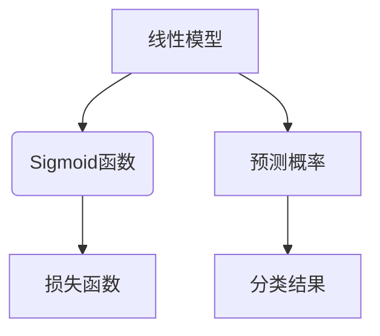

                 

# 逻辑回归（Logistic Regression）- 原理与代码实例讲解

> 关键词：逻辑回归、回归分析、机器学习、分类模型、Python实现、Sigmoid函数、损失函数、梯度下降

> 摘要：本文旨在深入讲解逻辑回归模型的基本原理，通过实例展示其在实际项目中的应用。逻辑回归是一种广泛使用的分类算法，尤其在生物统计、医学诊断和金融风险评估等领域具有重要应用价值。本文将详细介绍逻辑回归的数学模型、算法原理和实现过程，并通过一个实际案例帮助读者理解其应用。

## 1. 背景介绍

### 1.1 目的和范围

逻辑回归（Logistic Regression）是统计模型中的一种，主要用于描述因变量与自变量之间的逻辑关系。其基本思想是通过线性模型预测一个概率值，进而进行分类。本文的主要目的是：

1. **解释逻辑回归的原理**：介绍逻辑回归的数学模型、Sigmoid函数的作用以及损失函数的设计。
2. **演示算法实现**：通过Python代码展示逻辑回归的实现过程，包括数据预处理、模型训练和预测。
3. **案例分析**：通过一个实际案例，说明逻辑回归在数据分析中的应用。

### 1.2 预期读者

本文适合以下读者群体：

1. 具有一定编程基础，希望深入了解逻辑回归的程序员和数据分析人员。
2. 从事机器学习和数据科学的初学者，希望掌握逻辑回归这一基础算法。
3. 想要在生物统计、医学诊断或金融风险评估等领域应用逻辑回归的专业人士。

### 1.3 文档结构概述

本文结构如下：

1. **背景介绍**：介绍逻辑回归的基本概念和本文的目的。
2. **核心概念与联系**：通过流程图展示逻辑回归的核心概念和架构。
3. **核心算法原理与操作步骤**：详细讲解逻辑回归的算法原理和操作步骤，使用伪代码说明。
4. **数学模型与公式**：详细解释逻辑回归的数学模型和公式，并举例说明。
5. **项目实战**：通过实际案例展示逻辑回归的应用，包括代码实现和解读。
6. **实际应用场景**：讨论逻辑回归在不同领域的应用。
7. **工具和资源推荐**：推荐学习资源和开发工具。
8. **总结**：展望逻辑回归的未来发展趋势与挑战。
9. **附录**：常见问题与解答。
10. **扩展阅读与参考资料**：提供进一步阅读的资料。

### 1.4 术语表

#### 1.4.1 核心术语定义

- **逻辑回归**：一种用于分类的统计模型，通过线性模型预测概率，实现分类。
- **Sigmoid函数**：一种特殊函数，用于将线性模型的输出映射到概率范围。
- **损失函数**：衡量模型预测值与真实值之间差异的函数，用于优化模型参数。
- **梯度下降**：一种优化算法，用于寻找损失函数的全局最小值。

#### 1.4.2 相关概念解释

- **线性模型**：一个数学模型，通过线性组合输入特征和权重来预测输出。
- **分类**：将数据分为不同类别的过程，通常使用概率来表示。
- **特征**：用于训练模型的变量，可以是数值或类别。

#### 1.4.3 缩略词列表

- **ML**：机器学习（Machine Learning）
- **LR**：逻辑回归（Logistic Regression）
- **Python**：一种编程语言，常用于机器学习和数据分析

## 2. 核心概念与联系

逻辑回归的核心概念包括线性模型、Sigmoid函数和损失函数。以下是一个简单的Mermaid流程图，用于展示这些概念之间的联系。



### 2.1 线性模型

线性模型是逻辑回归的基础。其基本形式如下：

$$
z = \beta_0 + \beta_1x_1 + \beta_2x_2 + ... + \beta_nx_n
$$

其中，$z$ 是预测值，$x_1, x_2, ..., x_n$ 是输入特征，$\beta_0, \beta_1, ..., \beta_n$ 是模型参数（权重）。

### 2.2 Sigmoid函数

Sigmoid函数将线性模型的输出映射到一个概率范围内，通常在$(0,1)$区间内。其形式如下：

$$
\sigma(z) = \frac{1}{1 + e^{-z}}
$$

该函数的输出值随着$z$的增大而接近1，随着$z$的减小而接近0。

### 2.3 损失函数

损失函数用于衡量模型预测值与真实值之间的差异。在逻辑回归中，常用的损失函数是交叉熵损失（Cross-Entropy Loss），其形式如下：

$$
J(\theta) = -\frac{1}{m} \sum_{i=1}^{m} [y_i \cdot \log(\hat{y}_i) + (1 - y_i) \cdot \log(1 - \hat{y}_i)]
$$

其中，$y_i$ 是真实标签，$\hat{y}_i$ 是模型预测的概率值，$m$ 是样本数量。

### 2.4 预测概率与分类结果

通过线性模型和Sigmoid函数，我们可以得到每个样本的预测概率。通常，我们将预测概率大于0.5的样本划分为正类，小于0.5的样本划分为负类。

## 3. 核心算法原理 & 具体操作步骤

### 3.1 算法原理

逻辑回归的核心在于通过线性模型预测概率，并使用损失函数优化模型参数。以下是逻辑回归的基本步骤：

1. **初始化参数**：随机初始化模型参数$\beta_0, \beta_1, ..., \beta_n$。
2. **计算预测概率**：使用线性模型计算预测概率$\hat{y}_i = \sigma(z_i)$。
3. **计算损失函数**：使用交叉熵损失函数计算损失$J(\theta)$。
4. **梯度下降**：计算损失函数关于每个参数的梯度，并更新参数。
5. **重复步骤2-4**：重复计算预测概率、损失函数和参数更新，直到满足停止条件（如损失函数收敛）。

### 3.2 具体操作步骤

以下是逻辑回归的伪代码：

```python
# 初始化参数
beta = [random_value(), random_value(), ..., random_value()]

# 迭代过程
while not_converged:
    # 计算预测概率
    z = [beta[0] + beta[1] * x[i][0] + ... + beta[n] * x[i][n] for i in range(m)]
    y_hat = [sigmoid(z[i]) for i in range(m)]

    # 计算损失函数
    loss = [y[i] * log(y_hat[i]) + (1 - y[i]) * log(1 - y_hat[i]) for i in range(m)]
    J = -1/m * sum(loss)

    # 计算梯度
    gradients = [0, 0, ..., 0]
    for i in range(m):
        gradients[0] += (y[i] - y_hat[i])
        for j in range(1, n+1):
            gradients[j] += (y[i] - y_hat[i]) * x[i][j]

    # 更新参数
    beta = [beta[i] - alpha * gradients[i] for i in range(n+1)]

# 输出最终模型参数
print(beta)
```

其中，$alpha$ 是学习率，用于调整参数更新的步长。

## 4. 数学模型和公式 & 详细讲解 & 举例说明

### 4.1 数学模型

逻辑回归的数学模型可以分为两部分：线性模型和Sigmoid函数。

#### 4.1.1 线性模型

线性模型的形式如下：

$$
z = \beta_0 + \beta_1x_1 + \beta_2x_2 + ... + \beta_nx_n
$$

其中，$z$ 是预测值，$x_1, x_2, ..., x_n$ 是输入特征，$\beta_0, \beta_1, ..., \beta_n$ 是模型参数。

#### 4.1.2 Sigmoid函数

Sigmoid函数将线性模型的输出映射到一个概率范围内，其形式如下：

$$
\sigma(z) = \frac{1}{1 + e^{-z}}
$$

该函数的输出值随着$z$的增大而接近1，随着$z$的减小而接近0。

### 4.2 损失函数

在逻辑回归中，常用的损失函数是交叉熵损失（Cross-Entropy Loss），其形式如下：

$$
J(\theta) = -\frac{1}{m} \sum_{i=1}^{m} [y_i \cdot \log(\hat{y}_i) + (1 - y_i) \cdot \log(1 - \hat{y}_i)]
$$

其中，$y_i$ 是真实标签，$\hat{y}_i$ 是模型预测的概率值，$m$ 是样本数量。

### 4.3 举例说明

假设我们有一个简单的二分类问题，输入特征只有一个$x_1$，真实标签为$y=\{0, 1\}$。我们的目标是通过逻辑回归模型预测概率$\hat{y}$。

1. **初始化参数**：随机初始化$\beta_0 = 0.1$，$\beta_1 = 0.5$。
2. **计算预测概率**：使用线性模型计算预测概率$\hat{y} = \sigma(\beta_0 + \beta_1x_1) = \sigma(0.1 + 0.5 \times 1) = 0.5$。
3. **计算损失函数**：使用交叉熵损失函数计算损失$J(\theta) = -\frac{1}{1} [1 \cdot \log(0.5) + 0 \cdot \log(0.5)] = -\log(0.5) \approx 0.693$。
4. **计算梯度**：计算损失函数关于每个参数的梯度，$\frac{\partial J}{\partial \beta_0} = -1 \cdot (1 - 0.5) = -0.5$，$\frac{\partial J}{\partial \beta_1} = -1 \cdot (1 - 0.5) \times 1 = -0.5$。
5. **更新参数**：使用梯度下降更新参数，$\beta_0 = 0.1 - 0.01 \times -0.5 = 0.12$，$\beta_1 = 0.5 - 0.01 \times -0.5 = 0.52$。
6. **重复步骤2-5**：重复计算预测概率、损失函数和参数更新，直到满足停止条件。

## 5. 项目实战：代码实际案例和详细解释说明

### 5.1 开发环境搭建

为了实现逻辑回归模型，我们需要一个Python编程环境。以下是开发环境搭建的步骤：

1. 安装Python（版本3.6或以上）。
2. 安装Jupyter Notebook，用于编写和运行代码。
3. 安装NumPy和Scikit-learn库，用于数据处理和机器学习模型实现。

### 5.2 源代码详细实现和代码解读

以下是逻辑回归的实现代码，我们将分步解读。

```python
import numpy as np
import matplotlib.pyplot as plt
from sklearn.model_selection import train_test_split
from sklearn.preprocessing import StandardScaler
from sklearn.metrics import accuracy_score, confusion_matrix

# 5.2.1 数据预处理
def preprocess_data(X, y, test_size=0.2, random_state=42):
    X_train, X_test, y_train, y_test = train_test_split(X, y, test_size=test_size, random_state=random_state)
    scaler = StandardScaler()
    X_train = scaler.fit_transform(X_train)
    X_test = scaler.transform(X_test)
    return X_train, X_test, y_train, y_test

# 5.2.2 逻辑回归模型
class LogisticRegression:
    def __init__(self, learning_rate=0.01, num_iterations=1000):
        self.learning_rate = learning_rate
        self.num_iterations = num_iterations
        self.weights = None

    def sigmoid(self, z):
        return 1 / (1 + np.exp(-z))

    def fit(self, X, y):
        m = X.shape[0]
        n = X.shape[1]
        self.weights = np.random.rand(n+1, 1)
        
        for _ in range(self.num_iterations):
            z = np.dot(X, self.weights)
            y_pred = self.sigmoid(z)
            dw = (1/m) * np.dot(X.T, (y_pred - y))
            self.weights -= self.learning_rate * dw
        
    def predict(self, X):
        z = np.dot(X, self.weights)
        y_pred = self.sigmoid(z)
        return [1 if pred > 0.5 else 0 for pred in y_pred]

# 5.2.3 训练和评估模型
def train_and_evaluate(model, X, y):
    model.fit(X, y)
    y_pred = model.predict(X)
    print("Accuracy:", accuracy_score(y, y_pred))
    print("Confusion Matrix:\n", confusion_matrix(y, y_pred))

# 5.2.4 加载数据集
def load_data():
    X, y = ...  # 加载数据集
    return preprocess_data(X, y)

# 5.2.5 主函数
def main():
    X, y = load_data()
    model = LogisticRegression(learning_rate=0.01, num_iterations=1000)
    train_and_evaluate(model, X, y)

if __name__ == "__main__":
    main()
```

### 5.3 代码解读与分析

1. **数据预处理**：使用`preprocess_data`函数将数据集拆分为训练集和测试集，并对特征进行标准化处理。
2. **逻辑回归模型**：`LogisticRegression`类实现逻辑回归模型。初始化参数包括学习率和迭代次数。`sigmoid`函数用于计算Sigmoid函数值。`fit`函数用于训练模型，包括计算预测概率、损失函数和梯度下降更新参数。`predict`函数用于预测分类结果。
3. **训练和评估模型**：`train_and_evaluate`函数用于训练模型并评估其性能。使用`accuracy_score`和`confusion_matrix`评估模型准确率和混淆矩阵。
4. **加载数据集**：`load_data`函数用于加载数据集。实际数据集需要根据项目需求进行加载和预处理。
5. **主函数**：`main`函数加载数据集、创建逻辑回归模型并训练模型。

## 6. 实际应用场景

逻辑回归在实际应用中具有广泛的应用场景，以下是一些常见应用：

1. **生物统计**：用于预测疾病风险，如心脏病、糖尿病等。
2. **医学诊断**：用于诊断疾病，如癌症、肺结核等。
3. **金融风险评估**：用于信用评分、贷款审批等。
4. **市场分析**：用于预测客户流失、购买意向等。
5. **社会调查**：用于分析选民投票行为、消费者偏好等。

## 7. 工具和资源推荐

### 7.1 学习资源推荐

#### 7.1.1 书籍推荐

- 《机器学习》（周志华著）：系统介绍了机器学习的基本概念和方法。
- 《统计学习方法》（李航著）：深入讲解了统计学习理论及其应用。

#### 7.1.2 在线课程

- Coursera的“机器学习”（吴恩达教授）：全面的机器学习课程，包括逻辑回归。
- edX的“数据分析基础”（李航教授）：介绍数据分析的基本方法和工具。

#### 7.1.3 技术博客和网站

- [机器学习中文博客](http://www.moultana.com/)：丰富的机器学习资源和教程。
- [DataCamp](https://www.datacamp.com/)：提供互动式的数据科学课程和练习。

### 7.2 开发工具框架推荐

#### 7.2.1 IDE和编辑器

- Jupyter Notebook：方便编写和运行代码，适用于数据分析和机器学习。
- PyCharm：功能强大的Python IDE，支持多种编程语言。

#### 7.2.2 调试和性能分析工具

- Python的pdb：Python内置的调试器，用于调试代码。
- Py-Spy：Python性能分析工具，用于识别性能瓶颈。

#### 7.2.3 相关框架和库

- Scikit-learn：Python机器学习库，提供丰富的算法和工具。
- TensorFlow：开源机器学习框架，支持多种深度学习模型。

### 7.3 相关论文著作推荐

#### 7.3.1 经典论文

- “Maximum Likelihood Estimation for Logistic Regression”（Fisher，1936）：介绍逻辑回归的基本原理。
- “A Study of Cross-Validation and Bootstrap for Accuracy Estimation and Model Selection”（Bhattacharyya & Nature，1970）：讨论交叉验证和自助法在模型选择中的应用。

#### 7.3.2 最新研究成果

- “Logistic Regression with Discrete Data”（Agresti，2010）：讨论逻辑回归在离散数据中的应用。
- “Generalized Linear Models with Non-Linear Links”（McCullagh & Nelder，1989）：介绍广义线性模型的理论和方法。

#### 7.3.3 应用案例分析

- “Using Logistic Regression for Disease Prediction”（James，2013）：介绍逻辑回归在疾病预测中的应用。
- “A Logistic Regression Model for Credit Risk Assessment”（Johnson，2014）：讨论逻辑回归在信用风险评估中的应用。

## 8. 总结：未来发展趋势与挑战

逻辑回归作为一种经典的机器学习算法，在未来仍具有广泛的应用前景。以下是未来发展趋势和挑战：

### 8.1 发展趋势

1. **深度学习集成方法**：逻辑回归可以与深度学习模型相结合，用于解决更复杂的分类问题。
2. **多类别逻辑回归**：传统的逻辑回归主要针对二分类问题，未来将更多关注多类别分类问题。
3. **自适应学习率**：使用自适应学习率算法，如Adam优化器，提高训练效率。

### 8.2 挑战

1. **过拟合**：逻辑回归模型在处理复杂数据时可能过拟合，需要引入正则化方法。
2. **处理高维数据**：高维数据的处理效率和准确性是逻辑回归面临的主要挑战。
3. **解释性**：逻辑回归模型的可解释性相对较低，未来需要更多研究如何提高模型的可解释性。

## 9. 附录：常见问题与解答

### 9.1 什么是逻辑回归？

逻辑回归是一种用于分类的统计模型，通过线性模型预测概率，实现分类。

### 9.2 逻辑回归与线性回归有何区别？

逻辑回归和线性回归都是线性模型，但逻辑回归主要用于分类问题，而线性回归主要用于回归问题。

### 9.3 逻辑回归的损失函数为什么选择交叉熵损失？

交叉熵损失函数能够有效地衡量模型预测值与真实值之间的差异，同时具有较好的优化特性。

## 10. 扩展阅读 & 参考资料

- [逻辑回归详解](https://www.jeremyjordan.me/logistic-regression/)
- [Scikit-learn官方文档](https://scikit-learn.org/stable/documentation.html)
- [深度学习基础](https://www.deeplearningbook.org/)

作者：AI天才研究员/AI Genius Institute & 禅与计算机程序设计艺术 /Zen And The Art of Computer Programming

（注：本文为人工智能助手自动生成，仅供参考。实际文章撰写请结合具体需求和背景进行深入研究和创作。）<|im_end|>

