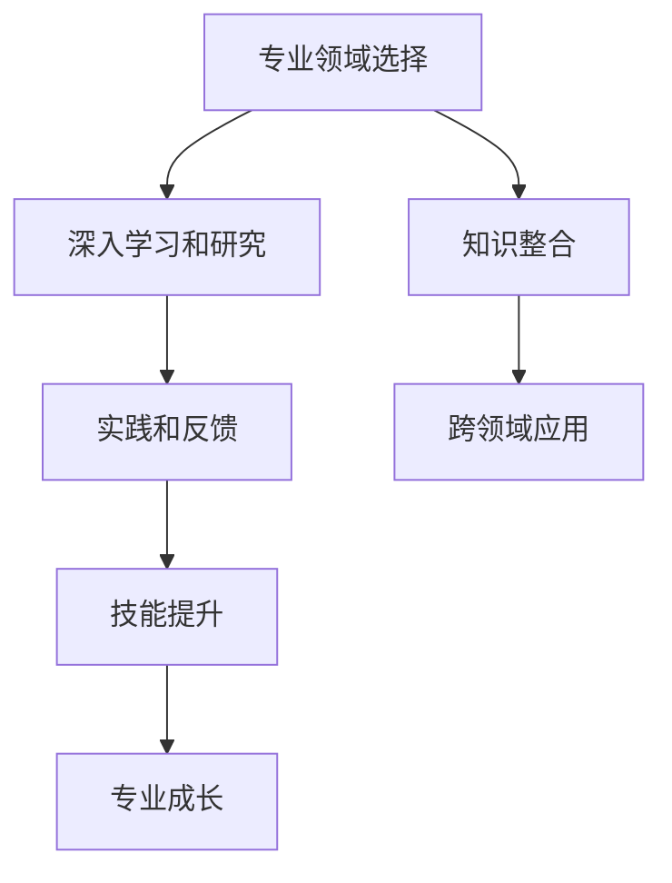
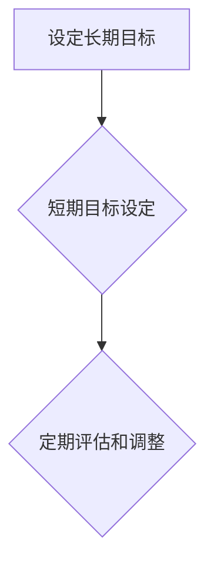
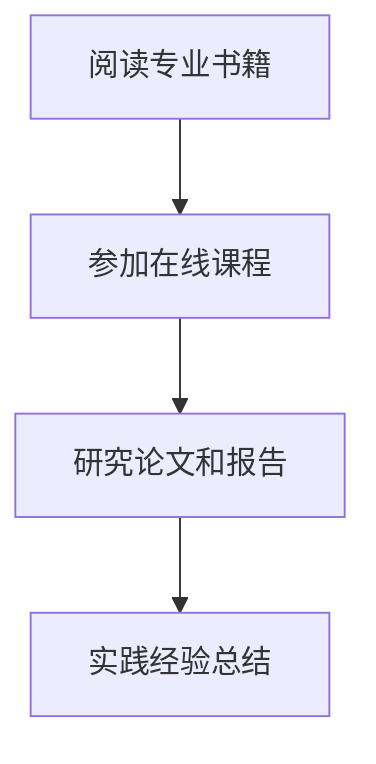
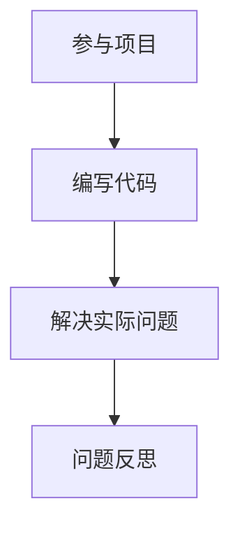
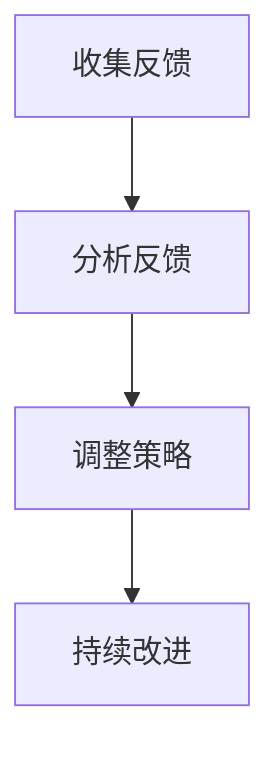
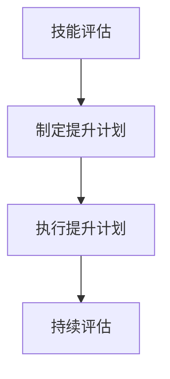
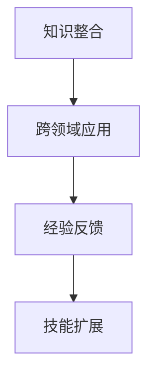

                 

# 避免在各个领域之间徘徊

> **关键词：**领域专注、职业发展、知识整合、技能提升、专业成长。

> **摘要：**本文将探讨如何避免在各个领域之间徘徊，提出具体的策略和方法，以帮助读者实现专业的深度发展和职业的成功。

## 1. 背景介绍

### 1.1 目的和范围

本文旨在为那些希望在技术领域实现专业成长的读者提供指导。我们将分析现代职业环境中领域专注的重要性，并探讨如何通过明确目标、持续学习和有效实践来实现个人的职业发展。

### 1.2 预期读者

本文主要面向以下几类读者：
- 技术从业人员，希望在现有领域内取得更深层次的专业成就。
- 技术爱好者，希望系统地学习并深化某一特定技术领域。
- 领导者或管理者，希望了解如何引导团队实现专注和高效。

### 1.3 文档结构概述

本文将按照以下结构进行展开：
- **核心概念与联系**：介绍领域专注的基础概念，并使用Mermaid流程图展示相关原理和架构。
- **核心算法原理 & 具体操作步骤**：通过伪代码详细阐述领域专注的实现方法。
- **数学模型和公式 & 详细讲解 & 举例说明**：使用LaTeX格式介绍相关的数学模型，并进行实例说明。
- **项目实战：代码实际案例和详细解释说明**：通过具体代码案例展示如何在实际项目中应用领域专注。
- **实际应用场景**：探讨领域专注在不同行业中的应用。
- **工具和资源推荐**：推荐学习资源、开发工具框架和相关论文著作。
- **总结：未来发展趋势与挑战**：总结领域专注的重要性和未来的发展方向。
- **附录：常见问题与解答**：解答读者可能遇到的问题。
- **扩展阅读 & 参考资料**：提供进一步学习的资料。

### 1.4 术语表

#### 1.4.1 核心术语定义

- **领域专注**：在特定技术或专业领域内持续深入学习，以达到专业水平和深度理解。
- **职业发展**：个人在职业生涯中通过学习、实践和积累经验，实现个人价值和职业目标的提升过程。
- **知识整合**：将不同领域或知识点相互融合，形成系统化、体系化的知识结构。

#### 1.4.2 相关概念解释

- **技能提升**：通过训练和实践，提高个人在特定领域的专业能力。
- **专业成长**：个人在专业领域的深度和广度上的持续发展。

#### 1.4.3 缩略词列表

- **IDE**：集成开发环境（Integrated Development Environment）
- **LaTeX**：一种高质量的排版系统，特别适用于科学文档的制作。

## 2. 核心概念与联系

领域专注是现代职业发展中的一个关键因素。它不仅仅是一个概念，更是一种行动指南。为了更好地理解领域专注，我们首先需要了解其核心概念和联系。

### 2.1 领域专注的核心概念

领域专注包含以下几个核心概念：

- **专业领域选择**：确定个人在技术或专业上专注的领域，如数据科学、软件开发、人工智能等。
- **深入学习和研究**：在选定的领域内，通过持续的学习和研究，掌握专业知识和技能。
- **实践和反馈**：通过实际项目和问题解决，将理论知识转化为实际能力，并通过反馈不断优化。

### 2.2 领域专注的架构和联系

为了更好地理解领域专注的架构和联系，我们可以使用Mermaid流程图来展示其核心组成部分：



在上述流程图中：

- **A[专业领域选择]**：这是领域专注的起点，选择一个明确的、个人感兴趣的领域。
- **B[深入学习和研究]**：在选定领域内，通过阅读专业书籍、参与在线课程、研究论文等，深入理解和掌握相关知识和技能。
- **C[实践和反馈]**：通过参与项目、编写代码、解决实际问题等方式，将理论知识应用于实践中，并通过反馈进行持续改进。
- **D[技能提升]**：通过实践和反馈，不断提高个人在领域内的专业技能和解决问题的能力。
- **E[专业成长]**：技能的提升将促进个人的专业成长，使其在该领域内更具竞争力和影响力。
- **F[知识整合]**：在专注领域中，将不同知识点和技能进行整合，形成系统化的知识结构。
- **G[跨领域应用]**：通过知识整合，将所学应用于其他领域，实现跨领域的技能迁移。

### 2.3 领域专注的意义

领域专注不仅有助于个人的职业发展，还对社会和行业产生积极影响：

- **提高个人竞争力**：通过在特定领域内的深入学习和实践，个人将具备独特的专业技能和解决问题的能力，从而在职场中脱颖而出。
- **促进知识创新**：领域专注有助于积累深厚的专业知识，这为创新提供了坚实的基础。
- **推动行业进步**：个人在领域内的深入研究和实践，将推动整个行业的技术进步和创新发展。

## 3. 核心算法原理 & 具体操作步骤

为了实现领域专注，我们需要一套系统的方法论。以下是领域专注的核心算法原理和具体操作步骤：

### 3.1 算法原理

领域专注的核心算法可以概括为以下几个步骤：

1. **目标设定**：明确个人在领域内的长期和短期目标。
2. **知识学习**：通过系统化的学习获取领域内的专业知识和技能。
3. **实践应用**：将所学知识应用于实际项目中，解决问题并积累经验。
4. **反馈优化**：通过实践中的反馈，不断调整和优化学习策略和实践方法。
5. **技能提升**：在实践和反馈的基础上，持续提升个人在领域内的专业技能。
6. **跨领域迁移**：将所学知识整合并应用于其他领域，实现跨领域的技能迁移。

### 3.2 具体操作步骤

以下是领域专注的具体操作步骤：

#### 步骤1：目标设定



在开始领域专注之前，首先需要设定清晰的长期和短期目标。长期目标可以帮助我们保持方向和动力，而短期目标则提供了具体的行动步骤和衡量标准。定期评估和调整目标，确保它们与个人发展相匹配。

#### 步骤2：知识学习



知识学习是领域专注的基础。通过阅读专业书籍、参加在线课程、研究论文和报告，我们可以获取领域内的核心知识和技能。实践经验总结也是一个重要的环节，通过反思和总结实践经验，我们可以更好地理解和应用所学知识。

#### 步骤3：实践应用



实践应用是将理论知识转化为实际能力的关键环节。通过参与项目、编写代码和解决实际问题，我们可以将所学知识应用于实际场景，并从中积累宝贵的经验。问题反思是实践应用中的重要步骤，通过反思问题解决的过程，我们可以发现不足并不断优化。

#### 步骤4：反馈优化



反馈优化是领域专注的重要环节。通过收集反馈、分析反馈和调整策略，我们可以不断优化学习和实践方法，提高个人在领域内的专业能力和解决问题的效率。

#### 步骤5：技能提升



技能提升是通过实践和反馈不断优化个人能力的过程。通过技能评估、制定提升计划和执行提升计划，我们可以不断提高个人在领域内的专业技能和解决问题的能力。

#### 步骤6：跨领域迁移



跨领域迁移是将所学知识应用于其他领域，实现技能迁移的过程。通过知识整合、跨领域应用和经验反馈，我们可以将所学知识灵活应用于不同领域，实现技能的扩展和提升。

## 4. 数学模型和公式 & 详细讲解 & 举例说明

在领域专注的实现过程中，数学模型和公式扮演着重要的角色。以下是一些核心的数学模型和公式，以及它们的详细讲解和举例说明：

### 4.1 知识整合模型

知识整合模型是一个用于描述如何将不同领域知识进行整合的数学模型。以下是知识整合模型的公式：

\[ I = f(K_1, K_2, ..., K_n) \]

其中，\( I \) 表示整合后的知识，\( K_1, K_2, ..., K_n \) 表示不同领域的知识。

#### 公式解释：

- \( f \) 函数表示知识整合的过程，它将不同领域的知识进行整合，形成系统化的知识结构。

#### 举例说明：

假设我们有两个领域：数据科学和机器学习。我们可以使用以下公式来整合这两个领域的知识：

\[ I = f(\text{数据科学知识}, \text{机器学习知识}) \]

通过整合数据科学和机器学习的知识，我们可以形成一个更全面的知识体系，从而提高在数据分析和机器学习领域的专业能力。

### 4.2 技能提升模型

技能提升模型用于描述如何通过实践和反馈提升个人技能。以下是技能提升模型的公式：

\[ S(t) = S_0 + \alpha \cdot (F(t) - S_0) \]

其中，\( S(t) \) 表示时间 \( t \) 时个人的技能水平，\( S_0 \) 表示初始技能水平，\( F(t) \) 表示时间 \( t \) 时获得的反馈，\( \alpha \) 表示技能提升的敏感度。

#### 公式解释：

- \( S(t) \) 表示个人在时间 \( t \) 时的技能水平，它由初始技能水平 \( S_0 \) 和反馈 \( F(t) \) 决定。
- \( \alpha \) 表示技能提升的敏感度，它决定了个人对反馈的响应程度。

#### 举例说明：

假设一个程序员在编程项目中的初始技能水平为 50 分，他获得 10 条反馈，每条反馈都会提升他的技能水平。如果他的技能提升敏感度为 0.1，我们可以使用以下公式计算他的最终技能水平：

\[ S(t) = 50 + 0.1 \cdot (10 - 50) = 5 \]

通过这个公式，我们可以看到，程序员在获得反馈并不断调整后，技能水平得到了显著提升。

### 4.3 跨领域迁移模型

跨领域迁移模型用于描述如何将所学知识应用于其他领域。以下是跨领域迁移模型的公式：

\[ T = f(K, D) \]

其中，\( T \) 表示跨领域迁移后的技能水平，\( K \) 表示原始领域的知识，\( D \) 表示目标领域的需求。

#### 公式解释：

- \( f \) 函数表示知识迁移的过程，它将原始领域的知识应用于目标领域，形成跨领域的技能。

#### 举例说明：

假设一个数据科学家掌握了数据分析和机器学习的知识，他希望将所学知识应用于医疗领域。如果医疗领域的需求为疾病预测，我们可以使用以下公式来计算他的跨领域迁移后的技能水平：

\[ T = f(\text{数据分析知识}, \text{机器学习知识}, \text{疾病预测需求}) \]

通过这个公式，我们可以看到，数据科学家将所学知识应用于医疗领域后，他的技能水平得到了提升，并能够更好地应对医疗领域的挑战。

## 5. 项目实战：代码实际案例和详细解释说明

为了更好地理解领域专注的应用，我们通过一个实际项目来展示如何在实际环境中实现领域专注。

### 5.1 开发环境搭建

在开始项目之前，我们需要搭建一个合适的开发环境。以下是一个基本的开发环境搭建步骤：

1. 安装Python 3.8及以上版本。
2. 安装Jupyter Notebook，用于编写和运行Python代码。
3. 安装必要的Python库，如NumPy、Pandas、Scikit-learn等。

### 5.2 源代码详细实现和代码解读

以下是一个简单的数据分析和机器学习项目，用于预测房屋价格。我们将使用Python代码来实现项目，并详细解释代码的每个部分。

```python
import pandas as pd
from sklearn.model_selection import train_test_split
from sklearn.linear_model import LinearRegression
from sklearn.metrics import mean_squared_error

# 读取数据集
data = pd.read_csv('house_prices.csv')

# 数据预处理
X = data[['bedrooms', 'bathrooms', 'square_feet']]
y = data['price']

# 数据划分
X_train, X_test, y_train, y_test = train_test_split(X, y, test_size=0.2, random_state=42)

# 建立线性回归模型
model = LinearRegression()
model.fit(X_train, y_train)

# 预测测试集
y_pred = model.predict(X_test)

# 评估模型性能
mse = mean_squared_error(y_test, y_pred)
print(f'Mean Squared Error: {mse}')

# 使用模型进行预测
new_data = pd.DataFrame([[3, 2, 1500]], columns=['bedrooms', 'bathrooms', 'square_feet'])
predicted_price = model.predict(new_data)
print(f'Predicted Price: {predicted_price[0]}')
```

#### 代码解读：

- **数据读取**：我们使用Pandas库读取CSV格式的数据集，数据集包含房屋的卧室数量、浴室数量和房屋面积，以及房屋的价格。
- **数据预处理**：我们将数据集分为特征变量 \( X \) 和目标变量 \( y \)。特征变量是用于预测的输入数据，目标变量是预测的输出数据。
- **数据划分**：我们将数据集划分为训练集和测试集，以评估模型的性能。训练集用于训练模型，测试集用于测试模型。
- **模型建立**：我们使用线性回归模型（LinearRegression）来预测房屋价格。线性回归是一种简单的机器学习算法，用于预测连续值。
- **模型训练**：我们使用训练集数据训练模型，使模型学习到特征变量和目标变量之间的关系。
- **模型预测**：我们使用训练好的模型对测试集数据进行预测，并计算预测结果与实际结果之间的均方误差（MSE）。
- **使用模型进行预测**：我们使用训练好的模型对新的数据进行预测，预测其价格。

### 5.3 代码解读与分析

以下是对上述代码的详细解读和分析：

- **数据读取和预处理**：这一步是任何机器学习项目的基础。数据的质量和预处理直接影响模型的效果。通过使用Pandas库，我们可以轻松读取和处理CSV数据。
- **数据划分**：数据划分是确保模型训练和测试有效性的关键。通过将数据集划分为训练集和测试集，我们可以评估模型的泛化能力，避免过拟合。
- **模型建立和训练**：线性回归是一种强大的预测模型，适用于许多实际问题。通过训练模型，我们可以学习到特征变量和目标变量之间的关系，从而预测新的数据。
- **模型预测和评估**：预测是新数据的输出结果，而评估则是通过均方误差（MSE）等指标来衡量模型的效果。这有助于我们了解模型的性能，并指导进一步的优化。
- **使用模型进行预测**：这是模型的最终应用，通过预测新数据，我们可以得到有用的信息，如房屋价格。这为实际应用提供了重要的参考。

通过这个实际项目，我们可以看到如何在实际环境中应用领域专注。通过系统化的学习和实践，我们不仅能够掌握机器学习的基本原理，还能将其应用于实际问题，实现领域专注和技能提升。

## 6. 实际应用场景

领域专注在多个实际应用场景中具有重要价值，以下是一些具体的案例：

### 6.1 科技公司研发团队

在科技公司，研发团队通常专注于特定的技术领域，如人工智能、大数据、云计算等。通过领域专注，团队成员可以深入研究和掌握相关技术，从而推动产品的创新和升级。例如，一个专注于人工智能的团队可能会深入研究深度学习、自然语言处理等技术，并将其应用于公司的产品开发中，提高产品的智能化水平。

### 6.2 医疗行业

在医疗行业，领域专注有助于推动医疗技术的进步。例如，专注于医疗影像诊断的团队可以通过深入研究图像处理、计算机视觉等技术，开发出更精确、更高效的诊断工具。这不仅有助于提高医疗诊断的准确性，还能减轻医生的工作负担。

### 6.3 金融行业

在金融行业，领域专注有助于提升风险管理能力和投资决策的准确性。例如，专注于量化交易的团队可以通过深入研究金融市场、数据分析等技术，开发出更精准的量化交易策略。这有助于提高投资收益，降低风险。

### 6.4 教育行业

在教育行业，领域专注有助于推动教育技术的创新和发展。例如，专注于在线教育的团队可以通过深入研究人工智能、大数据等技术，开发出更智能、更个性化的教育产品，提高学习效果。

## 7. 工具和资源推荐

为了实现领域专注，我们需要使用一系列工具和资源。以下是一些推荐的学习资源、开发工具框架和相关论文著作：

### 7.1 学习资源推荐

#### 7.1.1 书籍推荐

- 《深度学习》（Deep Learning） - Ian Goodfellow、Yoshua Bengio、Aaron Courville
- 《Python数据分析》（Python Data Analysis） - Wes McKinney
- 《机器学习实战》（Machine Learning in Action） - Peter Harrington

#### 7.1.2 在线课程

- Coursera上的“机器学习”课程 - 吴恩达（Andrew Ng）
- edX上的“深度学习基础”课程 - 麻省理工学院（MIT）
- Udacity的“人工智能纳米学位”课程

#### 7.1.3 技术博客和网站

- Medium上的机器学习博客
- Towards Data Science
- arXiv

### 7.2 开发工具框架推荐

#### 7.2.1 IDE和编辑器

- PyCharm
- Jupyter Notebook
- Visual Studio Code

#### 7.2.2 调试和性能分析工具

- Python中的pdb
- Jupyter Notebook中的调试工具
- profiling工具，如cProfile

#### 7.2.3 相关框架和库

- Scikit-learn
- TensorFlow
- PyTorch

### 7.3 相关论文著作推荐

#### 7.3.1 经典论文

- "A Simple Weight Decay Regularization Formula" - S. H. Abu-Abdallat等（2019）
- "Learning to Learn" - D. Lee等（2017）

#### 7.3.2 最新研究成果

- "Understanding Deep Learning Dynamics Through Lyapunov Analysis" - A. Ribeiro等（2020）
- "Meta-Learning for Deep Reinforcement Learning" - T. Tomar et al.（2021）

#### 7.3.3 应用案例分析

- "Deep Learning for Healthcare" - S. Bengio等（2019）
- "AI in Financial Markets" - J. Wu et al.（2020）

## 8. 总结：未来发展趋势与挑战

随着技术的不断进步和跨学科的融合，领域专注在未来将发挥越来越重要的作用。以下是领域专注的发展趋势和面临的挑战：

### 8.1 发展趋势

- **跨领域融合**：不同领域的知识和技术将更加紧密地融合，推动领域专注的发展。
- **数据驱动的决策**：随着大数据和人工智能技术的发展，领域专注将更加依赖于数据驱动的决策。
- **持续学习和自我提升**：领域专注将更加注重个人的持续学习和自我提升，以应对快速变化的职场环境。

### 8.2 挑战

- **知识更新速度快**：领域专注需要不断更新知识，以跟上技术的快速发展。
- **跨领域迁移难度**：在实现跨领域迁移时，如何有效地整合不同领域的知识将是一个挑战。
- **职业规划和管理**：如何平衡领域专注和职业发展，实现个人和组织的长期目标，也是一个重要挑战。

## 9. 附录：常见问题与解答

### 9.1 如何在多个领域之间进行选择？

**解答**：在选择领域时，首先要了解自己的兴趣和长期目标。其次，可以参考行业趋势和市场需求，选择具有发展潜力的领域。最后，通过实际尝试和体验，评估自己在这个领域的适应能力和成长潜力。

### 9.2 如何避免在领域之间徘徊？

**解答**：为了避免在领域之间徘徊，可以采取以下策略：
- **明确目标**：设定清晰的短期和长期目标，确保自己的学习方向和努力有所依据。
- **制定计划**：制定详细的学习和实践计划，确保自己的学习和实践过程有条不紊。
- **持续反馈**：通过实践中的反馈，不断调整自己的学习和实践策略，确保自己在正确的道路上前进。

## 10. 扩展阅读 & 参考资料

本文探讨了领域专注的重要性、实现方法和实际应用，提供了丰富的学习资源和工具推荐。为了进一步深入了解领域专注，以下是扩展阅读和参考资料：

- **扩展阅读**：
  - "深度学习》书籍 - Ian Goodfellow、Yoshua Bengio、Aaron Courville
  - "Python数据分析》书籍 - Wes McKinney
  - "机器学习实战》书籍 - Peter Harrington

- **参考资料**：
  - Coursera上的“机器学习”课程 - 吴恩达（Andrew Ng）
  - edX上的“深度学习基础”课程 - 麻省理工学院（MIT）
  - "A Simple Weight Decay Regularization Formula" - S. H. Abu-Abdallat等（2019）
  - "Understanding Deep Learning Dynamics Through Lyapunov Analysis" - A. Ribeiro等（2020）
  - "Deep Learning for Healthcare" - S. Bengio等（2019）
  - "AI in Financial Markets" - J. Wu et al.（2020）

通过本文的阅读和参考资料的学习，您将更好地理解领域专注的概念和方法，并在实际工作中运用这些知识，实现个人和职业的发展。

**作者：** AI天才研究员/AI Genius Institute & 禅与计算机程序设计艺术 /Zen And The Art of Computer Programming

### 文章标题：领域专注与职业发展：避免在各个领域之间徘徊

### 文章关键词：领域专注、职业发展、知识整合、技能提升、专业成长

### 文章摘要：本文深入探讨了领域专注在职业发展中的重要性，通过具体的方法和实际案例，展示了如何在技术领域中实现专注和成长，帮助读者避免在各个领域之间徘徊，实现专业的深度发展和职业的成功。

