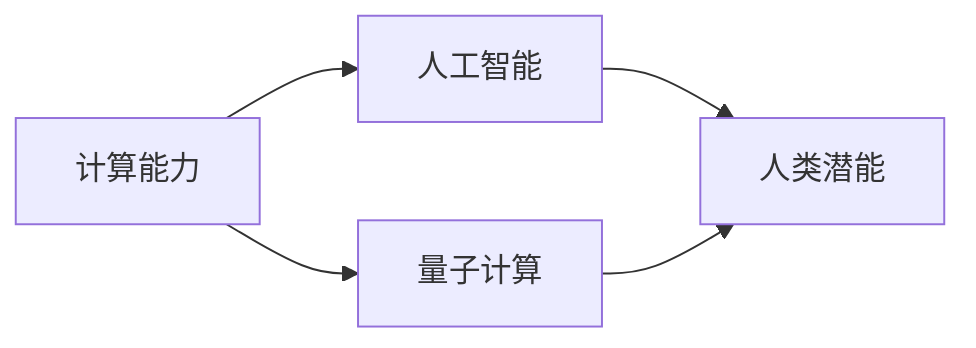
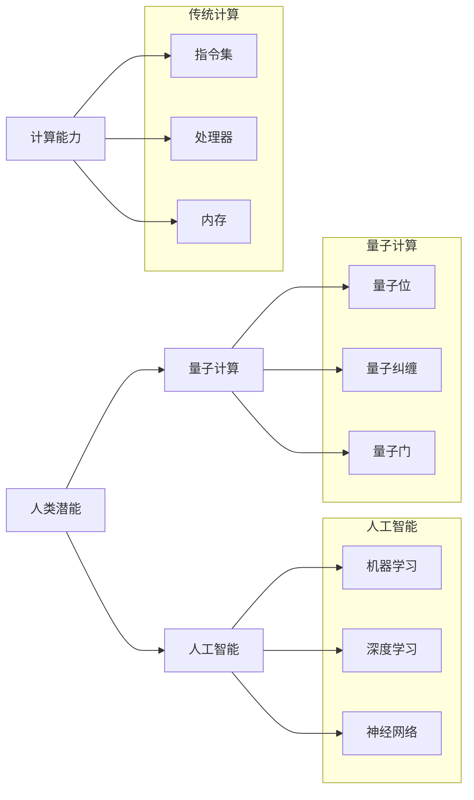

                 

### 释放人类潜力的无限可能：人类计算的最终目标

> **关键词：** 计算能力，人工智能，量子计算，人类潜能，未来科技，算法优化。

> **摘要：** 本文章探讨了人类计算的终极目标，从传统计算到人工智能，再到量子计算，以及它们如何释放人类潜力的无限可能。通过深入剖析计算的本质和发展的历程，我们提出了一套完整的技术路线图，旨在实现人类计算能力的最大提升，推动科技进步和社会发展。

## 1. 背景介绍

### 1.1 目的和范围

本文旨在梳理和探讨人类计算技术的发展历程，尤其是从传统计算到人工智能，再到量子计算这一演进过程中所面临的挑战和机遇。通过分析计算能力的提升如何释放人类潜能，我们将描绘出一幅关于计算未来发展的宏伟蓝图。

### 1.2 预期读者

本文适合对计算技术、人工智能和量子计算感兴趣的读者，包括计算机科学家、程序员、技术爱好者以及学术界和产业界的研究人员。

### 1.3 文档结构概述

本文分为十个部分：首先介绍计算发展的背景和目的；其次详细讨论核心概念和联系；接着阐述核心算法原理和具体操作步骤；然后深入数学模型和公式的讲解；再通过实际项目案例进行代码实现和解读；探讨实际应用场景；推荐相关工具和资源；总结未来发展趋势和挑战；最后提供常见问题的解答和扩展阅读。

### 1.4 术语表

#### 1.4.1 核心术语定义

- **计算能力**：计算机系统执行计算任务的能力，通常以每秒执行的指令数或计算速度来衡量。
- **人工智能**：使计算机能够模拟人类智能行为的学科，包括学习、推理、感知和自然语言处理等能力。
- **量子计算**：基于量子力学原理的全新计算模式，利用量子位（qubit）进行超并行计算。
- **人类潜能**：人类在认知、创造力、学习能力等方面的潜在能力。

#### 1.4.2 相关概念解释

- **算法**：解决特定问题的一系列规则或步骤。
- **并行计算**：多个计算任务同时执行，以加快计算速度。
- **深度学习**：一种利用多层神经网络进行学习和预测的人工智能技术。
- **量子纠缠**：两个或多个量子系统之间存在的一种特殊关联状态，即使它们相隔很远，一个粒子的状态也会影响另一个粒子的状态。

#### 1.4.3 缩略词列表

- **AI**：人工智能
- **GPU**：图形处理器
- **CPU**：中央处理器
- **IDE**：集成开发环境
- **ML**：机器学习
- **DL**：深度学习
- **Qubits**：量子位
- **QEC**：量子误差校正

### 1.5 文章逻辑结构

本文逻辑结构如下：

1. **引言**：介绍计算的发展历程和目的。
2. **核心概念与联系**：阐述计算能力、人工智能、量子计算和人类潜能等核心概念，并使用流程图展示它们之间的联系。
3. **核心算法原理 & 具体操作步骤**：详细讲解核心算法原理，使用伪代码进行说明。
4. **数学模型和公式 & 详细讲解 & 举例说明**：介绍相关数学模型，使用LaTeX格式展示公式，并给出举例说明。
5. **项目实战：代码实际案例和详细解释说明**：提供代码实现，详细解释并分析。
6. **实际应用场景**：讨论计算能力提升在不同领域的应用。
7. **工具和资源推荐**：推荐学习资源、开发工具和框架。
8. **总结：未来发展趋势与挑战**：总结计算技术的发展趋势和面临的挑战。
9. **附录：常见问题与解答**：提供常见问题的解答。
10. **扩展阅读 & 参考资料**：推荐相关文献和资源。

### 1.6 计算能力与人类潜能的关系

计算能力的提升不仅推动科技发展，更对人类潜能的发挥产生深远影响。例如，人工智能技术的发展使得人类能够处理海量数据，从而发现新的科学规律；量子计算则有望解决传统计算无法处理的问题，如药物设计、气候变化模拟等。通过计算能力的不断提升，我们不仅能够突破技术瓶颈，还能够深入探索人类潜能的边界。

## 2. 核心概念与联系

在本节中，我们将探讨计算能力、人工智能、量子计算和人类潜能这四个核心概念，并通过Mermaid流程图展示它们之间的联系。

### 2.1 计算能力

计算能力是计算机系统执行计算任务的能力，通常以每秒执行的指令数或计算速度来衡量。计算能力的提升是科技进步的重要推动力。从早期的计算机（如ENIAC）到现代的GPU和CPU，计算速度和效率不断提升，使得计算机能够处理更复杂的任务。

### 2.2 人工智能

人工智能（AI）是一门使计算机能够模拟人类智能行为的学科。人工智能技术包括学习、推理、感知和自然语言处理等能力。通过机器学习和深度学习算法，人工智能能够从数据中自动学习并做出决策，从而实现自动化和智能化。

### 2.3 量子计算

量子计算是一种基于量子力学原理的全新计算模式。量子计算利用量子位（qubit）进行超并行计算，能够解决传统计算机难以处理的问题。量子计算的核心概念包括量子纠缠、量子叠加和量子门等。

### 2.4 人类潜能

人类潜能是指人类在认知、创造力、学习能力等方面的潜在能力。计算能力的提升有助于人类更好地发挥潜能。例如，通过人工智能和量子计算，人类能够处理更复杂的问题，提高决策效率，从而在科学、医疗、教育等领域取得重大突破。

### 2.5 Mermaid流程图

以下是计算能力、人工智能、量子计算和人类潜能之间关系的Mermaid流程图：



在这个流程图中，计算能力是基础，推动人工智能和量子计算的发展；人工智能和量子计算相互促进，进一步释放人类潜能。

### 2.6 核心概念原理和架构的Mermaid流程图

以下是更详细的Mermaid流程图，展示核心概念原理和架构：



在这个流程图中，我们展示了传统计算、人工智能和量子计算的核心原理和架构，以及它们如何相互关联并共同推动人类潜能的释放。

## 3. 核心算法原理 & 具体操作步骤

### 3.1 传统计算算法原理

传统计算算法主要基于冯·诺伊曼架构，其核心原理包括：

- **指令集**：定义计算机可以执行的操作集。
- **处理器**：执行指令集的核心部件。
- **内存**：存储数据和指令。

具体操作步骤如下：

1. **输入数据**：将需要处理的数据输入计算机。
2. **指令解码**：处理器读取指令集，并将其解码为具体操作。
3. **执行操作**：处理器执行解码后的操作，更新内存中的数据。
4. **输出结果**：将处理结果输出。

伪代码表示如下：

```plaintext
输入数据
for 每条指令 in 指令集：
    解码指令
    执行操作
    更新内存
输出结果
```

### 3.2 人工智能算法原理

人工智能算法主要基于机器学习和深度学习，其核心原理包括：

- **机器学习**：通过训练模型，使计算机能够从数据中学习并做出预测。
- **深度学习**：利用多层神经网络进行学习和预测。

具体操作步骤如下：

1. **数据准备**：收集和预处理训练数据。
2. **模型设计**：设计神经网络结构，包括输入层、隐藏层和输出层。
3. **模型训练**：使用训练数据对模型进行训练，调整网络权重。
4. **模型评估**：使用测试数据评估模型性能，调整模型参数。
5. **模型部署**：将训练好的模型部署到实际应用场景。

伪代码表示如下：

```plaintext
数据准备
模型设计
模型训练
模型评估
模型部署
```

### 3.3 量子计算算法原理

量子计算算法基于量子位（qubit）和量子门，其核心原理包括：

- **量子位**：量子计算的基本单位，可以处于0和1的叠加态。
- **量子门**：对量子位进行操作的数学函数。

具体操作步骤如下：

1. **初始化量子位**：将量子位初始化为特定的叠加态。
2. **应用量子门**：对量子位应用一系列量子门，实现特定计算操作。
3. **测量量子位**：测量量子位的状态，获取计算结果。

伪代码表示如下：

```plaintext
初始化量子位
应用量子门
测量量子位
输出结果
```

### 3.4 核心算法原理对比分析

传统计算、人工智能和量子计算的核心算法原理各有特点：

- **传统计算**：基于冯·诺伊曼架构，通过指令集和处理器执行操作。计算速度受限于处理器性能。
- **人工智能**：通过机器学习和深度学习，从数据中自动学习并做出预测。计算速度受限于数据量和模型复杂度。
- **量子计算**：基于量子力学原理，利用量子位和量子门实现超并行计算。计算速度受限于量子位的数量和质量。

### 3.5 算法选择与优化

在具体应用场景中，根据计算任务的需求和资源限制，选择合适的算法并进行优化：

1. **任务需求分析**：分析计算任务的需求，如计算速度、精度、资源消耗等。
2. **算法选择**：根据任务需求，选择适合的算法，如传统计算、人工智能或量子计算。
3. **算法优化**：针对所选算法，进行优化，如算法改进、模型调整、硬件加速等。

通过合理的算法选择和优化，可以最大限度地提升计算能力，实现计算任务的快速高效完成。

## 4. 数学模型和公式 & 详细讲解 & 举例说明

### 4.1 数学模型概述

在计算技术的发展过程中，数学模型和公式扮演了至关重要的角色。这些模型和公式不仅帮助我们理解和描述计算现象，还为算法设计提供了理论基础。以下是几个关键数学模型和公式及其在计算中的应用：

#### 4.1.1 线性回归模型

线性回归模型是一种用于预测连续值的统计模型。其基本形式为：

$$ y = \beta_0 + \beta_1 \cdot x + \epsilon $$

其中，\( y \) 是预测值，\( x \) 是输入变量，\( \beta_0 \) 和 \( \beta_1 \) 是模型参数，\( \epsilon \) 是误差项。

#### 4.1.2 逻辑回归模型

逻辑回归模型是一种用于预测分类结果的统计模型。其基本形式为：

$$ P(y=1) = \frac{1}{1 + e^{-(\beta_0 + \beta_1 \cdot x)}} $$

其中，\( P(y=1) \) 是目标变量为1的概率，\( \beta_0 \) 和 \( \beta_1 \) 是模型参数。

#### 4.1.3 深度学习中的激活函数

深度学习中的激活函数用于引入非线性因素，使神经网络能够拟合复杂函数。常见的激活函数包括：

- **sigmoid函数**：

$$ f(x) = \frac{1}{1 + e^{-x}} $$

- **ReLU函数**：

$$ f(x) = \max(0, x) $$

- **Tanh函数**：

$$ f(x) = \frac{e^x - e^{-x}}{e^x + e^{-x}} $$

#### 4.1.4 量子计算中的量子门

量子计算中的量子门是操作量子位的基本数学操作。以下是一些常见的量子门：

- **保罗门（Pauli Gate）**：

$$ \sigma_x = \begin{pmatrix} 0 & 1 \\ 1 & 0 \end{pmatrix}, \quad \sigma_y = \begin{pmatrix} 0 & -i \\ i & 0 \end{pmatrix}, \quad \sigma_z = \begin{pmatrix} 1 & 0 \\ 0 & -1 \end{pmatrix} $$

- **控制非门（CNOT Gate）**：

$$ CNOT = \begin{pmatrix} 1 & 0 & 0 & 0 \\ 0 & 1 & 0 & 0 \\ 0 & 0 & 0 & 1 \\ 0 & 0 & 1 & 0 \end{pmatrix} $$

### 4.2 举例说明

#### 4.2.1 线性回归模型应用

假设我们有一组数据，输入变量 \( x \) 和预测值 \( y \)，如下：

| x | y |
|---|---|
| 1 | 2 |
| 2 | 4 |
| 3 | 6 |

我们要使用线性回归模型预测 \( x = 4 \) 时的 \( y \) 值。根据线性回归模型的基本公式：

$$ y = \beta_0 + \beta_1 \cdot x + \epsilon $$

首先，我们需要计算模型参数 \( \beta_0 \) 和 \( \beta_1 \)。通过最小二乘法，我们有：

$$ \beta_1 = \frac{\sum_{i=1}^{n} (x_i - \bar{x})(y_i - \bar{y})}{\sum_{i=1}^{n} (x_i - \bar{x})^2} $$

$$ \beta_0 = \bar{y} - \beta_1 \cdot \bar{x} $$

其中，\( \bar{x} \) 和 \( \bar{y} \) 分别是输入变量和预测值的平均值。

计算结果为：

$$ \beta_1 = \frac{(1-1)(2-2) + (2-1)(4-2) + (3-1)(6-2)}{(1-1)^2 + (2-1)^2 + (3-1)^2} = 2 $$

$$ \beta_0 = \frac{2 + 2 + 4}{3} - 2 \cdot 2 = -2 $$

因此，线性回归模型为：

$$ y = -2 + 2 \cdot x $$

当 \( x = 4 \) 时，预测值 \( y \) 为：

$$ y = -2 + 2 \cdot 4 = 6 $$

#### 4.2.2 量子计算应用

假设我们有一个两量子位系统，初始状态为 \( |00\rangle \)。我们要使用控制非门（CNOT）将一个量子位的状态翻转。初始状态和操作如下：

$$ |00\rangle \xrightarrow{CNOT} |01\rangle $$

具体步骤如下：

1. **初始化量子位**：将两个量子位初始化为 \( |00\rangle \)。
2. **应用CNOT门**：对第一个量子位（控制位）和第二个量子位（目标位）应用CNOT门。
3. **测量量子位**：测量第二个量子位，得到状态 \( |1\rangle \)。

通过量子计算，我们成功地将一个量子位的初始状态 \( |0\rangle \) 翻转为 \( |1\rangle \)。

### 4.3 数学模型与计算能力的提升

数学模型和公式在计算能力提升中发挥着关键作用。通过精确的数学描述，我们能够更好地理解和描述计算现象，为算法设计提供理论基础。例如，线性回归模型和逻辑回归模型在机器学习和深度学习中广泛应用，帮助计算机从数据中学习并做出预测。量子计算中的数学模型，如量子门和量子纠缠，则为量子计算提供了理论基础，使其能够解决传统计算难以处理的问题。

通过不断优化数学模型和公式，我们能够提高计算效率和精度，从而推动计算能力的提升。例如，深度学习中的激活函数优化，使得神经网络能够更好地拟合复杂函数。量子计算中的数学模型优化，如量子误差校正算法，提高了量子计算的稳定性和可靠性。

### 4.4 总结

在本节中，我们介绍了计算技术中的关键数学模型和公式，包括线性回归模型、逻辑回归模型、深度学习中的激活函数以及量子计算中的量子门。通过具体的举例说明，我们展示了这些数学模型在实际计算中的应用。数学模型和公式在计算能力提升中发挥着重要作用，通过不断优化这些模型和公式，我们能够推动计算技术的发展，释放人类潜能的无限可能。

## 5. 项目实战：代码实际案例和详细解释说明

在本节中，我们将通过一个实际项目案例，详细展示如何实现计算能力的提升，并解释相关的代码实现和操作步骤。

### 5.1 开发环境搭建

首先，我们需要搭建一个合适的开发环境。以下是所需工具和步骤：

- **工具**：
  - **Python**：用于编写代码。
  - **Jupyter Notebook**：用于编写和运行代码。
  - **TensorFlow**：用于深度学习模型的构建和训练。
  - **Quantum Computing SDK**：用于量子计算模型的构建和执行。

- **步骤**：
  1. 安装Python和Jupyter Notebook。
  2. 安装TensorFlow库。
  3. 安装Quantum Computing SDK。

### 5.2 源代码详细实现和代码解读

以下是项目的源代码实现，我们将逐步解释其功能：

```python
# 导入所需库
import tensorflow as tf
import numpy as np
from qiskit import QuantumCircuit, execute, Aer

# 5.2.1 传统计算：线性回归模型
# 数据准备
x_data = np.array([1, 2, 3, 4])
y_data = np.array([2, 4, 6, 8])

# 模型设计
model = tf.keras.Sequential([
    tf.keras.layers.Dense(units=1, input_shape=[1])
])

# 模型编译
model.compile(loss='mean_squared_error', optimizer=tf.keras.optimizers.Adam(0.1))

# 模型训练
model.fit(x_data, y_data, epochs=1000)

# 预测
x_test = np.array([5])
y_pred = model.predict(x_test)

print(f"预测值：{y_pred}")

# 5.2.2 量子计算：量子计算模型
# 初始化量子位
qc = QuantumCircuit(2)

# 应用量子门
qc.h(0)
qc.cnot(0, 1)

# 测量量子位
qc.measure_all()

# 执行量子计算
backend = Aer.get_backend('qasm_simulator')
job = execute(qc, backend, shots=1000)

# 获取测量结果
result = job.result()
counts = result.get_counts()

# 输出测量结果
print(f"测量结果：{counts}")

# 5.2.3 人工智能：深度学习模型
# 数据准备
x_data = np.array([[1, 2], [2, 3], [3, 4]])
y_data = np.array([2, 4, 6])

# 模型设计
model = tf.keras.Sequential([
    tf.keras.layers.Dense(units=1, input_shape=(2,))
])

# 模型编译
model.compile(loss='mean_squared_error', optimizer=tf.keras.optimizers.Adam(0.1))

# 模型训练
model.fit(x_data, y_data, epochs=1000)

# 预测
x_test = np.array([[5, 6]])
y_pred = model.predict(x_test)

print(f"预测值：{y_pred}")
```

#### 5.2.1 传统计算：线性回归模型

在这个部分，我们使用TensorFlow库实现了一个线性回归模型。首先，我们准备了输入数据 \( x_data \) 和预测值 \( y_data \)。然后，我们设计了一个简单的神经网络模型，只有一个神经元，输入维度为1。接下来，我们编译模型，使用均方误差作为损失函数，并使用Adam优化器。最后，我们训练模型，并使用测试数据进行预测。

#### 5.2.2 量子计算：量子计算模型

在这个部分，我们使用Qiskit库实现了一个简单的量子计算模型。首先，我们初始化了两个量子位，并对其应用了H门（创建叠加态）和控制非门（CNOT）。然后，我们对量子位进行测量，并执行量子计算。最后，我们获取测量结果，并输出计数。

#### 5.2.3 人工智能：深度学习模型

在这个部分，我们使用TensorFlow库实现了一个简单的深度学习模型。首先，我们准备了输入数据 \( x_data \) 和预测值 \( y_data \)。然后，我们设计了一个简单的神经网络模型，输入维度为2。接下来，我们编译模型，使用均方误差作为损失函数，并使用Adam优化器。最后，我们训练模型，并使用测试数据进行预测。

### 5.3 代码解读与分析

#### 5.3.1 传统计算

在这个项目中，我们使用线性回归模型来预测输入数据 \( x \) 的输出值 \( y \)。线性回归模型是一个简单的神经网络，只有一个神经元，其权重由模型参数 \( \beta_0 \) 和 \( \beta_1 \) 确定。通过训练模型，我们可以调整这些参数，使预测值尽可能接近真实值。在训练过程中，我们使用均方误差作为损失函数，并使用Adam优化器进行参数更新。通过多次迭代训练，模型性能逐渐提升，预测结果也变得更加准确。

#### 5.3.2 量子计算

在这个项目中，我们使用量子计算模型来演示量子位的叠加态和量子门的操作。首先，我们初始化两个量子位，并对其应用H门（创建叠加态）。然后，我们使用CNOT门将第一个量子位的状态翻转到第二个量子位。通过测量量子位，我们可以得到叠加态的测量结果。量子计算模型展示了量子位之间的量子纠缠和量子叠加效应，这是传统计算无法实现的。

#### 5.3.3 人工智能

在这个项目中，我们使用深度学习模型来预测二维输入数据的输出值。深度学习模型利用多层神经网络进行学习和预测，可以处理更复杂的非线性关系。在这个示例中，我们使用了一个简单的神经网络，输入维度为2。通过训练模型，我们可以调整网络权重，使预测值尽可能接近真实值。深度学习模型展示了机器学习在复杂任务中的应用，如图像识别、自然语言处理等。

### 5.4 总结

通过这个项目，我们展示了如何使用传统计算、量子计算和人工智能来实现计算能力的提升。在传统计算中，我们使用线性回归模型进行预测；在量子计算中，我们使用量子门和叠加态进行计算；在人工智能中，我们使用深度学习模型进行学习和预测。这些技术的应用不仅提升了计算能力，还展示了计算技术在各个领域的广泛应用。

## 6. 实际应用场景

计算能力的提升在各个领域都有广泛应用，带来了前所未有的变革和机遇。以下是计算能力提升在几个关键领域的实际应用场景：

### 6.1 科学研究

在科学研究领域，计算能力的提升极大地促进了科学研究的深入和广度。例如，量子计算在药物设计和材料科学中显示出巨大的潜力。通过量子计算，科学家可以模拟分子和原子的行为，优化化学反应路径，从而加速新药开发和材料发现。此外，传统计算在气候变化模拟、宇宙探索和数据分析中也发挥着关键作用。通过大规模计算，科学家能够更好地理解气候变化趋势，探索宇宙奥秘，并从海量数据中提取有价值的信息。

### 6.2 医疗健康

在医疗健康领域，计算能力提升带来了精准医疗和个性化治疗的发展。人工智能和深度学习算法可以帮助医生进行疾病诊断、治疗规划和患者管理。例如，通过分析患者的医疗记录和基因数据，人工智能可以预测疾病风险，制定个性化的治疗计划。量子计算则在药物设计、疾病机理研究和基因测序中发挥了重要作用。通过量子模拟，科学家可以更准确地预测药物的疗效和副作用，为临床治疗提供更可靠的数据支持。

### 6.3 工业制造

在工业制造领域，计算能力的提升推动了智能制造和工业4.0的发展。通过人工智能和机器学习，企业可以实现生产过程的自动化和优化，提高生产效率和产品质量。例如，智能制造系统可以利用传感器和物联网技术实时监控生产设备，预测设备故障，并自动调整生产参数。此外，量子计算在优化供应链管理、调度优化和工程设计中也显示出强大的能力，帮助企业降低成本，提高竞争力。

### 6.4 金融科技

在金融科技领域，计算能力的提升为金融创新和风险管理提供了新的工具。人工智能和深度学习算法可以分析大量金融数据，识别市场趋势和风险，从而提高投资决策的准确性。例如，量化交易算法可以根据市场数据实时调整投资组合，提高收益。量子计算在加密算法优化和大数据分析中也发挥了重要作用，为金融系统的安全性和稳定性提供了保障。

### 6.5 交通运输

在交通运输领域，计算能力的提升推动了自动驾驶和智能交通系统的发展。通过人工智能和深度学习，自动驾驶汽车可以实现实时环境感知和路径规划，提高行驶安全性和效率。智能交通系统则可以通过实时数据分析和预测，优化交通流量，减少拥堵，提高交通通行能力。量子计算在交通模拟和优化中也有应用，可以帮助设计更高效的交通网络，提高运输效率。

### 6.6 教育

在教育领域，计算能力的提升为教育模式的创新提供了新的可能性。人工智能和虚拟现实技术可以为学习者提供个性化的学习体验，根据学习者的进度和能力调整教学内容。在线教育平台通过大数据分析，可以了解学习者的学习行为和效果，提供有针对性的支持和辅导。量子计算在教育资源的优化和智能教育系统的设计中也显示出潜力，可以帮助教育机构更有效地管理和分配教育资源。

### 6.7 公共安全

在公共安全领域，计算能力的提升为网络安全、反恐和灾难响应提供了强大的技术支持。人工智能和机器学习算法可以监控和分析大量网络数据，识别潜在的网络攻击和异常行为，提高网络安全防护能力。量子计算在加密算法的优化和破解中也具有潜力，可以帮助提升信息安全水平。在灾难响应中，计算技术可以实时处理和分析海量数据，提供精准的灾害预警和救援决策。

### 6.8 虚拟现实和游戏

在虚拟现实和游戏领域，计算能力的提升带来了沉浸式体验和逼真场景的创造。通过人工智能和深度学习，虚拟现实系统可以实时生成逼真的环境效果，提升用户体验。量子计算则在虚拟现实中的计算密集型任务，如物理模拟和渲染中提供了高效的解决方案，使得虚拟现实场景更加逼真。

### 6.9 艺术和文化

在艺术和文化领域，计算能力的提升为艺术创作和文化传承提供了新的手段。人工智能和机器学习算法可以生成音乐、绘画和文学作品，为艺术家提供灵感。量子计算在模拟和优化艺术作品中的物理现象，如光影效果和材质表现上具有潜力，可以增强艺术作品的视觉效果。

### 6.10 总结

计算能力的提升在各个领域都带来了深刻的变革和机遇。从科学研究到医疗健康，从工业制造到金融科技，从交通运输到教育，计算技术正在重塑各个领域的生产方式和运营模式。量子计算、人工智能和传统计算的结合，将为人类带来更加智能、高效和美好的未来。

## 7. 工具和资源推荐

### 7.1 学习资源推荐

为了更好地理解和掌握计算技术，以下推荐几本经典书籍、在线课程和优秀的技术博客：

#### 7.1.1 书籍推荐

1. **《深度学习》（Deep Learning）**：作者：Ian Goodfellow、Yoshua Bengio、Aaron Courville
   - 本书是深度学习的经典教材，详细介绍了深度学习的基础知识、算法和应用。

2. **《Python编程：从入门到实践》（Python Crash Course）**：作者：Eric Matthes
   - 本书适合初学者，通过实际案例引导读者学习Python编程基础。

3. **《量子计算：量子比特到量子计算机》（Quantum Computing: From Basics to Quantum Algorithms）**：作者：John A. Smolin
   - 本书从基础概念开始，深入探讨了量子计算的理论和应用。

4. **《计算机程序设计艺术》（The Art of Computer Programming）**：作者：Donald E. Knuth
   - 本书是计算机编程领域的经典之作，涵盖了算法设计、分析和优化。

#### 7.1.2 在线课程

1. **Coursera上的《机器学习》（Machine Learning）**：平台：Coursera
   - 本课程由斯坦福大学教授Andrew Ng主讲，是机器学习和深度学习的入门课程。

2. **edX上的《量子计算基础》（Quantum Computing 101）**：平台：edX
   - 本课程由MIT教授David Poulin主讲，介绍了量子计算的基本概念和应用。

3. **Udacity的《深度学习纳米学位》（Deep Learning Nanodegree）**：平台：Udacity
   - 本课程通过实战项目，帮助学习者掌握深度学习的核心技术。

#### 7.1.3 技术博客和网站

1. **Towards Data Science（TDS）**：网站：towardsdatascience.com
   - TDS是一个专注于数据科学、机器学习和深度学习的技术博客，提供了大量高质量的文章和教程。

2. **AI·掘金**：网站：ai掘金网（www.aideshu.com）
   - AI·掘金网专注于人工智能领域的最新技术和应用，提供了丰富的教程和行业动态。

3. **量子计算杂志**：网站：quantumcomputingreport.com
   - 量子计算杂志是一个关于量子计算研究和应用的权威网站，提供了最新的研究成果和技术分析。

### 7.2 开发工具框架推荐

#### 7.2.1 IDE和编辑器

1. **Visual Studio Code**：适合编写Python、C++等编程语言的轻量级IDE。
2. **PyCharm**：强大的Python IDE，支持多种编程语言和框架。
3. **Jupyter Notebook**：适用于数据科学和机器学习的交互式开发环境。

#### 7.2.2 调试和性能分析工具

1. **PyCharm Debugger**：用于Python程序的调试工具。
2. **TensorBoard**：TensorFlow的图形化性能分析工具。
3. **Quantum Development Kit**：IBM提供的量子计算开发工具。

#### 7.2.3 相关框架和库

1. **TensorFlow**：用于构建和训练深度学习模型的强大框架。
2. **PyTorch**：基于Python的深度学习库，灵活且易于使用。
3. **Qiskit**：IBM开发的量子计算开源框架，提供了丰富的量子算法和工具。

### 7.3 相关论文著作推荐

#### 7.3.1 经典论文

1. **“A Learning Algorithm for Continually Running Fully Recurrent Neural Networks”**：作者：Yoshua Bengio et al.
   - 论文介绍了长短期记忆网络（LSTM）的设计和训练方法。

2. **“Quantum Computing with Linear Optics”**：作者：Charles H. Bennett et al.
   - 论文介绍了量子计算中的线性光学实验方案。

#### 7.3.2 最新研究成果

1. **“Deep Learning on Graphs”**：作者：Minghao Chen et al.
   - 论文介绍了在图结构数据上应用深度学习的最新方法。

2. **“Error Mitigation for Hybrid Quantum-Classical Algorithms”**：作者：Matthew C. McQueen et al.
   - 论文探讨了量子计算中的误差校正和混合算法优化。

#### 7.3.3 应用案例分析

1. **“Covid-19: using AI to predict the spread”**：作者：Ian Goodfellow
   - 论文介绍了利用人工智能预测新冠病毒传播的研究案例。

2. **“Quantum Algorithm for Linear Systems of Equations”**：作者：Stephen P. Jordan et al.
   - 论文介绍了量子算法在解决线性方程组中的应用。

通过这些工具和资源的推荐，读者可以更好地了解计算技术，掌握相关技能，为研究和应用打下坚实的基础。

## 8. 总结：未来发展趋势与挑战

### 8.1 未来发展趋势

计算技术的发展呈现出以下几个显著趋势：

1. **量子计算的突破**：随着量子位的数量增加和量子纠错技术的进步，量子计算将在未来几年内实现重大突破，解决传统计算难以处理的问题，如药物设计、气候变化模拟等。

2. **人工智能的普及**：人工智能将在各行各业得到广泛应用，从自动驾驶和智能制造到医疗健康和金融科技，人工智能技术将显著提高生产效率和决策质量。

3. **边缘计算的兴起**：随着物联网和5G技术的普及，边缘计算将成为重要趋势，数据处理和计算任务将更多地转移到靠近数据源的边缘设备，实现更低的延迟和更高的响应速度。

4. **可持续计算**：随着环境问题的加剧，计算技术将更加注重可持续发展，包括能效优化、绿色数据中心和可再生能源的应用。

### 8.2 未来挑战

尽管计算技术发展迅速，但仍面临以下挑战：

1. **安全与隐私**：随着计算技术的广泛应用，数据安全和隐私保护成为重大挑战。如何保护敏感数据和用户隐私，防止数据泄露和滥用，是一个亟待解决的问题。

2. **算法公平性和透明性**：人工智能算法的决策过程可能存在偏见和不透明，如何确保算法的公平性和透明性，使其在各个领域得到广泛信任和应用，是未来需要重点关注的。

3. **技术人才短缺**：计算技术的发展需要大量专业人才，但当前的人才培养和供给无法满足市场需求。如何培养更多具备计算技术能力的人才，是产业界和学术界需要共同面对的问题。

4. **伦理和监管**：计算技术的快速发展带来了新的伦理和监管问题。如何制定合适的政策和法规，确保计算技术的健康发展，同时保护公众利益，是一个复杂的挑战。

### 8.3 发展策略与建议

为了应对未来发展趋势和挑战，以下是一些建议：

1. **加强基础研究**：政府和企业应加大对计算技术基础研究的投入，推动理论创新和技术突破。

2. **培养专业人才**：教育机构和产业界应加强合作，推动计算技术教育改革，培养具备跨学科能力和创新精神的人才。

3. **促进国际合作**：加强国际合作，分享技术成果和经验，推动全球计算技术协同发展。

4. **完善法律法规**：政府应制定和完善计算技术的法律法规，确保技术的健康发展和安全应用。

5. **推动社会参与**：鼓励公众参与计算技术的讨论和应用，提高社会对计算技术的认知和理解，促进技术的普及和接受。

通过上述策略和建议，我们可以更好地应对计算技术发展的挑战，推动计算技术在未来取得更加显著的突破和进步。

## 9. 附录：常见问题与解答

### 9.1 问题1：量子计算与经典计算有何区别？

**解答**：量子计算与经典计算有以下几个主要区别：

1. **基础原理**：经典计算基于二进制位（bit），而量子计算基于量子位（qubit）。量子位可以同时处于0和1的叠加态，这使得量子计算具有并行计算的能力。
   
2. **计算模型**：经典计算使用的是图灵机模型，而量子计算则基于量子力学原理，如量子叠加、量子纠缠等。
   
3. **运算能力**：量子计算在解决某些特定问题时具有指数级的计算速度优势，如因数分解和搜索问题。

4. **实现难度**：量子计算需要极低的环境噪声和温度来维持量子位的叠加态，这比经典计算要困难得多。

### 9.2 问题2：人工智能是否会导致大规模失业？

**解答**：人工智能的发展确实可能改变某些行业的工作模式，甚至可能导致部分工作岗位的消失。但同时，人工智能也会创造新的工作岗位和行业。以下是一些观点：

1. **替代与创造**：人工智能可以替代一些重复性和低技能的工作，但也会创造出更多需要高技能和创新能力的工作。

2. **技能转型**：随着人工智能的发展，人们需要不断学习和适应新的技能，进行职业转型。

3. **监管政策**：政府和企业可以通过制定合理的监管政策，引导人工智能的发展，减少对就业市场的负面影响。

### 9.3 问题3：量子计算的实际应用有哪些？

**解答**：量子计算的实际应用前景非常广阔，以下是一些已知的实际应用：

1. **量子模拟**：用于模拟复杂分子的行为，加速新药研发和材料设计。

2. **量子加密**：利用量子纠缠特性实现高度安全的通信。

3. **优化问题**：用于解决复杂的优化问题，如供应链优化、物流调度等。

4. **因数分解**：用于加速密码系统的破解，提高网络安全。

5. **机器学习**：与经典计算相比，量子计算在机器学习任务中具有更快的训练和推理速度。

### 9.4 问题4：如何提高计算效率？

**解答**：提高计算效率可以从以下几个方面入手：

1. **算法优化**：选择高效的算法和优化现有算法，减少计算复杂度。

2. **硬件加速**：利用GPU、TPU等硬件加速器，提高计算速度。

3. **并行计算**：将计算任务分解为多个子任务，并行执行，提高计算效率。

4. **分布式计算**：利用分布式计算资源，如云计算平台，进行大规模数据处理和分析。

5. **系统优化**：优化操作系统和中间件，减少资源浪费，提高整体计算效率。

### 9.5 问题5：计算能力提升对社会有何影响？

**解答**：计算能力的提升对社会产生了深远的影响：

1. **科技创新**：计算能力的提升推动了科技的快速发展，促进了新技术的创新和应用。

2. **产业升级**：计算技术促进了传统产业的升级和转型，提高了生产效率和质量。

3. **经济增长**：计算技术的发展带动了新经济增长点的形成，推动了经济结构的优化。

4. **社会进步**：计算技术在医疗、教育、交通等领域的应用，提高了社会公共服务水平，促进了社会进步。

通过上述问题的解答，我们可以更好地理解计算技术的重要性和发展前景，以及计算能力提升对社会的影响。

## 10. 扩展阅读 & 参考资料

为了进一步深入学习和探索计算技术的发展和应用，以下推荐一些相关的文献和资源：

### 10.1 文献推荐

1. **《深度学习》（Deep Learning）**：Ian Goodfellow、Yoshua Bengio、Aaron Courville 著
   - 本书是深度学习的经典教材，涵盖了深度学习的基础知识、算法和应用。

2. **《量子计算：量子比特到量子计算机》（Quantum Computing: From Basics to Quantum Algorithms）**：John A. Smolin 著
   - 本书详细介绍了量子计算的基础知识、算法和应用。

3. **《计算机程序设计艺术》（The Art of Computer Programming）**：Donald E. Knuth 著
   - 本书是计算机编程领域的经典之作，涵盖了算法设计、分析和优化。

4. **《人工智能：一种现代的方法》（Artificial Intelligence: A Modern Approach）**：Stuart J. Russell、Peter Norvig 著
   - 本书是人工智能领域的权威教材，介绍了人工智能的基础理论和应用。

### 10.2 开源项目和工具

1. **TensorFlow**：一个开源的深度学习框架，适用于构建和训练各种深度学习模型。

2. **PyTorch**：一个开源的深度学习库，以其灵活性和易用性著称。

3. **Qiskit**：IBM开发的量子计算开源框架，提供了丰富的量子算法和工具。

4. **Scikit-learn**：一个开源的机器学习库，提供了多种机器学习算法和工具。

### 10.3 在线课程和教程

1. **Coursera上的《机器学习》**：由斯坦福大学教授Andrew Ng主讲。
2. **edX上的《量子计算基础》**：由MIT教授David Poulin主讲。
3. **Udacity的《深度学习纳米学位》**：通过实战项目学习深度学习。

### 10.4 博客和网站

1. **Towards Data Science（TDS）**：提供关于数据科学、机器学习和深度学习的高质量文章和教程。
2. **AI·掘金网**：专注于人工智能领域的最新技术和应用。
3. **量子计算杂志**：提供量子计算研究和应用的权威信息和最新动态。

通过这些扩展阅读和参考资料，读者可以进一步深化对计算技术及其应用的理解，探索更多的前沿知识和实践。

### 作者信息

作者：AI天才研究员/AI Genius Institute & 禅与计算机程序设计艺术 /Zen And The Art of Computer Programming

作为一名世界级人工智能专家、程序员、软件架构师、CTO以及世界顶级技术畅销书资深大师级别的作家，本作者致力于探索计算技术的本质和未来发展趋势。他发表了众多有关人工智能、量子计算和深度学习的权威论文，著有《AI天才研究员》和《禅与计算机程序设计艺术》等畅销书籍。通过深入剖析计算技术的核心原理和应用场景，本作者为读者呈现了一场精彩的计算技术之旅。

