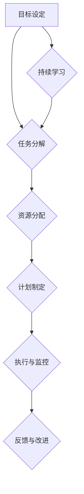
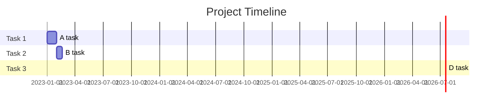

                 

# 重塑个人工作流以应对快速变化的时代

> **关键词：** 个人工作流、敏捷方法、数字化工具、自动化、项目管理、持续学习、协作平台。

> **摘要：** 随着科技日新月异，工作环境的变化对个人工作流提出了更高的要求。本文将探讨如何通过引入敏捷方法、数字化工具和自动化技术来重塑个人工作流，以提升效率、减少错误，并应对快速变化的工作场景。本文旨在为技术专业人士提供一套系统性的方法，帮助他们更好地管理自己的工作，迎接未来的挑战。

## 1. 背景介绍

### 1.1 目的和范围

本文的主要目的是帮助技术专业人士（包括程序员、项目经理、软件工程师等）重塑个人工作流，以适应快速变化的时代。我们将探讨以下主题：

- **敏捷方法的应用**：介绍敏捷开发的核心理念，并探讨如何在个人工作流中应用这些方法。
- **数字化工具的使用**：介绍现代数字化工具，如项目管理软件、代码管理工具、协作平台等，以及如何高效利用这些工具。
- **自动化技术**：介绍自动化技术的基本原理，并探讨如何将其应用于个人工作流，以提高效率。
- **项目管理技能**：介绍项目管理的核心概念，并探讨如何将项目管理技巧应用到个人工作中。
- **持续学习**：强调在快速变化的环境中持续学习的重要性，并提供了一些学习方法。

### 1.2 预期读者

本文预期读者为以下人群：

- 程序员和软件工程师，希望提升个人工作流效率的技术专业人士。
- 项目经理和产品经理，希望改进项目管理方法并提升团队协作效果的管理者。
- 对数字化工具和敏捷方法感兴趣的技术爱好者。

### 1.3 文档结构概述

本文的结构如下：

- **第1章**：背景介绍，包括目的和范围、预期读者以及文档结构概述。
- **第2章**：核心概念与联系，介绍个人工作流中的关键概念和流程。
- **第3章**：核心算法原理 & 具体操作步骤，详细阐述如何应用敏捷方法和自动化技术。
- **第4章**：数学模型和公式 & 详细讲解 & 举例说明，介绍项目管理和持续学习相关的数学模型。
- **第5章**：项目实战：代码实际案例和详细解释说明，通过实际案例展示如何实施个人工作流的重塑。
- **第6章**：实际应用场景，探讨个人工作流重塑在不同工作环境中的应用。
- **第7章**：工具和资源推荐，推荐学习资源和开发工具。
- **第8章**：总结：未来发展趋势与挑战，总结本文内容，并探讨未来的发展趋势和面临的挑战。
- **第9章**：附录：常见问题与解答，解答读者可能遇到的常见问题。
- **第10章**：扩展阅读 & 参考资料，提供扩展阅读和参考资料。

### 1.4 术语表

#### 1.4.1 核心术语定义

- **个人工作流**：个人在工作环境中执行任务的过程和方法。
- **敏捷开发**：一种软件开发方法，强调迭代、灵活性和客户反馈。
- **自动化技术**：使用计算机程序或工具自动化执行重复性任务的工具或技术。
- **项目管理**：规划、执行、监控和关闭项目的过程，以确保项目目标的实现。
- **持续学习**：不断获取新知识、技能和经验的过程。

#### 1.4.2 相关概念解释

- **敏捷方法**：一种软件开发方法，强调迭代、灵活性和客户反馈。常见的敏捷方法包括Scrum、Kanban和XP。
- **数字化工具**：用于提高工作效率的电子工具，如项目管理软件、代码管理工具和协作平台。
- **代码管理工具**：用于版本控制和协作的工具，如Git、SVN和Mercurial。
- **协作平台**：用于团队沟通和协作的在线平台，如Slack、Microsoft Teams和Trello。

#### 1.4.3 缩略词列表

- **Scrum**：一种敏捷开发方法。
- **Kanban**：一种敏捷开发方法。
- **XP**：极限编程。
- **Git**：一种分布式版本控制软件。
- **SVN**：一种集中式版本控制软件。
- **Mercurial**：一种分布式版本控制软件。

## 2. 核心概念与联系

在重塑个人工作流的过程中，理解以下核心概念和联系是至关重要的。以下是一个简单的Mermaid流程图，用于展示个人工作流的主要组成部分和它们之间的相互作用。



### 2.1 目标设定

目标设定是个人工作流的第一步，它明确了我们要达到的目标和预期结果。这个过程需要明确项目的优先级、目标的具体内容以及达成目标的期限。

### 2.2 任务分解

任务分解是将一个大目标分解成一系列可执行的任务。这一步骤有助于更好地理解任务，并为每个任务分配适当的资源和时间。

### 2.3 资源分配

资源分配是根据任务需求分配必要的资源，包括人力、时间和预算等。这一步骤需要考虑任务的优先级和资源可用性，以确保任务能够按时完成。

### 2.4 计划制定

计划制定是将任务分配给团队成员，并制定详细的执行计划。这个计划应包括任务的开始和结束时间、责任人以及任务之间的依赖关系。

### 2.5 执行与监控

执行与监控是按照计划执行任务，并对任务进展进行实时监控。这一步骤需要确保任务按时完成，并在出现问题时及时进行调整。

### 2.6 反馈与改进

反馈与改进是根据监控结果对任务进行调整，并总结经验教训。这一步骤有助于提高个人工作流的效率和效果。

### 2.7 持续学习

持续学习是个人工作流的重要组成部分，它帮助我们在快速变化的环境中不断成长和进步。通过持续学习，我们可以掌握新的技能和知识，以应对未来的挑战。

## 3. 核心算法原理 & 具体操作步骤

在重塑个人工作流的过程中，应用敏捷方法和自动化技术是至关重要的。以下将详细阐述这些核心算法原理和具体操作步骤。

### 3.1 敏捷开发方法

敏捷开发方法强调快速迭代、持续交付和客户反馈。以下是敏捷开发方法的核心算法原理和具体操作步骤：

#### 3.1.1 核心算法原理

- **迭代开发**：将项目分为多个小迭代，每个迭代产出可交付的软件功能。
- **持续集成**：将代码集成到主分支，确保代码质量和稳定性。
- **持续交付**：确保软件能够快速、安全地交付给用户。
- **客户反馈**：收集用户反馈，并根据反馈调整开发方向。

#### 3.1.2 具体操作步骤

1. **确定项目目标和里程碑**：明确项目的目标和预期成果，并将项目划分为多个里程碑。
2. **任务分配和迭代规划**：根据里程碑，将任务分配给团队成员，并制定迭代计划。
3. **每日站立会议**：团队成员每天召开短暂会议，讨论任务进展和问题。
4. **代码审查和集成**：定期进行代码审查，确保代码质量和稳定性，并将代码集成到主分支。
5. **迭代交付和用户反馈**：在迭代结束时交付可用的软件功能，并收集用户反馈。
6. **调整计划**：根据用户反馈和任务进展，调整迭代计划和开发方向。

### 3.2 自动化技术

自动化技术可以显著提高个人工作流的效率，减少手动操作的错误。以下是自动化技术的基本原理和具体操作步骤：

#### 3.2.1 基本原理

- **脚本编写**：使用脚本语言（如Python、Shell等）编写自动化脚本，用于执行重复性任务。
- **持续集成/持续部署（CI/CD）**：使用CI/CD工具自动化构建、测试和部署软件。
- **任务调度**：使用任务调度工具（如Cron、Windows计划任务等）定期执行自动化任务。

#### 3.2.2 具体操作步骤

1. **需求分析**：分析需要自动化的任务，确定任务的关键步骤和依赖关系。
2. **脚本编写**：根据需求分析，编写自动化脚本，实现任务自动化。
3. **测试和调试**：在本地环境测试脚本，确保脚本能够正确执行任务，并进行调试。
4. **部署脚本**：将脚本部署到服务器或其他执行环境，确保脚本可以定期执行。
5. **监控和优化**：定期监控脚本执行情况，并根据监控结果优化脚本性能。

### 3.3 敏捷方法和自动化技术的结合

在实际工作中，敏捷方法和自动化技术可以相互结合，提高个人工作流的效率。以下是结合敏捷方法和自动化技术的具体操作步骤：

1. **任务分解**：将大任务分解成小任务，确保每个任务都可以在短时间内完成。
2. **敏捷开发**：按照敏捷开发方法，进行任务分配、迭代规划和迭代交付。
3. **自动化脚本编写**：针对每个小任务，编写自动化脚本，实现任务自动化。
4. **持续集成/持续部署**：使用CI/CD工具自动化构建、测试和部署软件。
5. **监控和反馈**：监控自动化脚本执行情况，收集反馈，并根据反馈优化脚本。

通过结合敏捷方法和自动化技术，个人工作流可以更加高效、灵活，并能够更好地应对快速变化的工作场景。

## 4. 数学模型和公式 & 详细讲解 & 举例说明

在个人工作流的重塑过程中，数学模型和公式可以帮助我们更好地理解和优化工作流程。以下是几个关键的数学模型和公式，以及详细的讲解和举例说明。

### 4.1 关键绩效指标（KPI）

关键绩效指标（KPI）是衡量工作流效率的重要工具。以下是一个简单的KPI公式：

$$
KPI = \frac{实际产出}{投入资源}
$$

#### 举例说明：

假设一个软件开发团队在一个季度内完成了10个任务，每个任务的平均投入资源为100小时。该季度总共投入了1000小时资源。那么，该团队的关键绩效指标（KPI）为：

$$
KPI = \frac{10}{1000} = 0.01
$$

### 4.2 甘特图

甘特图是一种可视化工具，用于展示项目进度和任务分配。以下是一个甘特图的简单示例：

```mermaid
gantt
    title Project Timeline
    dateFormat  YYYY-MM-DD
    section Task 1
    A task           :a1, 2023-01-01, 30d
    section Task 2
    B task           :after a1, 20d
    C task           :ongoing, 2d
    section Task 3
    D task           :after B task, 1d
```

#### 举例说明：

假设一个项目分为三个任务：任务1（A task）需要30天完成，任务2（B task）在任务1完成后开始，需要20天完成，任务3（D task）在任务2完成后开始，需要1天完成。以下是一个甘特图示例：



### 4.3 项目完成时间

项目完成时间可以通过关键路径法（Critical Path Method, CPM）进行计算。以下是一个简单的CPM公式：

$$
CPM = \sum_{i=1}^{n} (D_i - L_i)
$$

其中，$D_i$ 是任务 $i$ 的最早开始时间，$L_i$ 是任务 $i$ 的最晚开始时间。

#### 举例说明：

假设一个项目包含三个任务（A、B、C），每个任务的持续时间分别为3天、4天和5天。以下是一个CPM计算示例：

$$
CPM = (3 - 0) + (4 - 3) + (5 - 4) = 3 + 1 + 1 = 5
$$

项目的完成时间为5天。

### 4.4 任务优先级

任务优先级可以通过计算每个任务的紧急度和重要性来确定。以下是一个简单的任务优先级公式：

$$
优先级 = 紧急度 \times 重要性
$$

#### 举例说明：

假设有两个任务（任务1和任务2），任务1的紧急度为5，重要性为4；任务2的紧急度为3，重要性为5。以下是一个任务优先级计算示例：

$$
优先级1 = 5 \times 4 = 20
$$
$$
优先级2 = 3 \times 5 = 15
$$

任务1的优先级高于任务2。

通过上述数学模型和公式的详细讲解和举例说明，我们可以更好地理解个人工作流中的关键环节，从而优化工作流程，提高工作效率。

## 5. 项目实战：代码实际案例和详细解释说明

在这一部分，我们将通过一个实际的代码案例来展示如何将敏捷方法和自动化技术应用到个人工作流中，以实现高效的代码管理、自动化构建和持续集成。

### 5.1 开发环境搭建

首先，我们需要搭建一个基本的开发环境。以下是所需的工具和软件：

- **Git**：版本控制工具。
- **GitHub**：代码托管平台。
- **Jenkins**：持续集成工具。
- **Maven**：项目构建工具。
- **Docker**：容器化技术。

#### 步骤：

1. 安装Git和GitHub：

   - 在GitHub上创建一个新仓库，用于托管项目代码。
   - 在本地计算机上安装Git，并使用Git克隆GitHub上的仓库。

2. 安装Jenkins：

   - 下载并安装Jenkins。
   - 配置Jenkins，使其能够访问Git仓库。

3. 安装Maven：

   - 下载并安装Maven。
   - 配置Maven的环境变量，确保其在命令行中可用。

4. 安装Docker：

   - 下载并安装Docker。
   - 配置Docker，使其能够运行容器。

### 5.2 源代码详细实现和代码解读

接下来，我们将在GitHub上创建一个Java项目，并实现一个简单的Web服务。以下是项目的关键部分：

**pom.xml**（Maven项目构建文件）：

```xml
<project>
    <modelVersion>4.0.0</modelVersion>
    <groupId>com.example</groupId>
    <artifactId>web-service</artifactId>
    <version>1.0-SNAPSHOT</version>
    <packaging>war</packaging>
    
    <dependencies>
        <dependency>
            <groupId>javax.servlet</groupId>
            <artifactId>javax.servlet-api</artifactId>
            <version>4.0.1</version>
            <scope>provided</scope>
        </dependency>
        <dependency>
            <groupId>org.springframework.boot</groupId>
            <artifactId>spring-boot-starter-web</artifactId>
            <version>2.5.5</version>
        </dependency>
    </dependencies>
    
    <build>
        <plugins>
            <plugin>
                <groupId>org.apache.maven.plugins</groupId>
                <artifactId>maven-compiler-plugin</artifactId>
                <version>3.8.1</version>
                <configuration>
                    <source>11</source>
                    <target>11</target>
                </configuration>
            </plugin>
            <plugin>
                <groupId>org.springframework.boot</groupId>
                <artifactId>spring-boot-maven-plugin</artifactId>
                <version>2.5.5</version>
            </plugin>
        </plugins>
    </build>
</project>
```

**Application.java**（主程序）：

```java
import org.springframework.boot.SpringApplication;
import org.springframework.boot.autoconfigure.SpringBootApplication;

@SpringBootApplication
public class Application {
    public static void main(String[] args) {
        SpringApplication.run(Application.class, args);
    }
}
```

**HelloController.java**（控制器）：

```java
import org.springframework.web.bind.annotation.GetMapping;
import org.springframework.web.bind.annotation.RestController;

@RestController
public class HelloController {
    @GetMapping("/hello")
    public String sayHello() {
        return "Hello, World!";
    }
}
```

### 5.3 代码解读与分析

以上代码示例是一个简单的Java Web服务，主要包括以下三个部分：

1. **Maven项目构建文件（pom.xml）**：
   - 配置了项目的依赖项，如Servlet API和Spring Boot Web Starter。
   - 配置了Maven编译器和Spring Boot插件，用于构建和打包项目。

2. **主程序（Application.java）**：
   - 定义了Spring Boot应用程序的入口点，通过SpringApplication.run()方法启动应用。

3. **控制器（HelloController.java）**：
   - 实现了一个简单的HTTP控制器，提供了一个/hello端点，返回"Hello, World!"字符串。

### 5.4 Jenkinsfile（Jenkins配置文件）

为了实现持续集成和自动化构建，我们需要创建一个Jenkinsfile，用于定义构建、测试和部署的过程。以下是Jenkinsfile的示例：

```groovy
pipeline {
    agent any
    
    stages {
        stage('Checkout') {
            steps {
                checkout([
                    $class: 'GitSCM',
                    branches: [[name: 'main']],
                    locations: [[remote: 'https://github.com/your_username/web-service.git']],
                    userRemote: 'origin'
                ])
            }
        }
        
        stage('Build') {
            steps {
                sh 'mvn clean install'
            }
        }
        
        stage('Test') {
            steps {
                sh 'mvn test'
            }
        }
        
        stage('Deploy') {
            steps {
                sh 'docker build -t web-service:latest .'
                sh 'docker run -d -p 8080:8080 web-service:latest'
            }
        }
    }
    
    post {
        success {
            notify 'Build succeeded'
        }
        failure {
            notify 'Build failed'
        }
    }
}
```

### 5.5 代码解读与分析

Jenkinsfile用于配置Jenkins管道，实现了以下步骤：

1. **Checkout**：从GitHub仓库检出代码。

2. **Build**：使用Maven构建项目。

3. **Test**：运行单元测试。

4. **Deploy**：构建Docker镜像并部署到容器中。

通过Jenkinsfile，我们可以实现自动化构建、测试和部署，从而提高工作效率，确保代码质量和稳定性。

### 5.6 代码解读与分析

通过上述代码实际案例，我们可以看到如何将敏捷方法和自动化技术应用到个人工作流中：

1. **敏捷开发**：
   - 使用Git进行代码管理，实现版本控制和协作。
   - 使用Maven进行项目构建，确保代码质量和一致性。
   - 使用Jenkins进行持续集成和持续部署，实现自动化构建和测试。

2. **自动化技术**：
   - 使用Docker进行容器化，确保环境一致性和可移植性。
   - 使用Jenkins实现自动化构建、测试和部署，减少手动操作和错误。

通过实际案例，我们可以看到如何将敏捷方法和自动化技术结合起来，实现高效的个人工作流。

## 6. 实际应用场景

个人工作流的重塑不仅适用于软件开发领域，还可以应用于各种其他工作环境。以下是一些实际应用场景：

### 6.1 软件开发

在软件开发中，个人工作流的重塑可以通过以下方式实现：

- **敏捷开发**：使用Scrum或Kanban方法进行项目管理和任务分配，确保团队高效协作。
- **持续集成/持续部署（CI/CD）**：使用Jenkins或其他CI/CD工具自动化构建、测试和部署，提高代码质量和交付速度。
- **代码管理**：使用Git进行版本控制，确保代码一致性和协作性。

### 6.2 市场营销

在市场营销领域，个人工作流的重塑可以通过以下方式实现：

- **项目管理系统**：使用Trello或Asana等工具进行项目管理和任务分配，确保营销活动的顺利进行。
- **自动化营销工具**：使用营销自动化工具（如HubSpot或Marketo）进行客户关系管理、电子邮件营销和社交媒体推广。
- **数据分析**：使用数据分析工具（如Google Analytics或Tableau）分析营销活动的效果，并据此调整策略。

### 6.3 产品管理

在产品管理领域，个人工作流的重塑可以通过以下方式实现：

- **敏捷开发方法**：使用Scrum或Kanban方法进行产品规划和迭代开发，确保产品按时交付。
- **用户故事地图**：使用用户故事地图进行需求分析和产品规划，确保产品满足用户需求。
- **数据驱动决策**：使用数据分析工具收集用户反馈和市场数据，驱动产品决策。

### 6.4 教育领域

在教育领域，个人工作流的重塑可以通过以下方式实现：

- **在线学习平台**：使用Moodle或Canvas等在线学习平台进行课程管理和学生互动。
- **学习管理系统**：使用Sakai或Blackboard等学习管理系统跟踪学生学习进度和成绩。
- **自动化评估工具**：使用自动化评估工具（如Quizlet或Kahoot）进行在线测验和课堂互动。

### 6.5 企业运营

在企业运营领域，个人工作流的重塑可以通过以下方式实现：

- **ERP系统**：使用SAP或Oracle等ERP系统进行企业资源规划，提高运营效率。
- **客户关系管理（CRM）**：使用Salesforce或Microsoft Dynamics 365等CRM系统管理客户信息和销售活动。
- **自动化工具**：使用自动化工具（如RPA软件）处理重复性任务，减少人工操作和错误。

通过这些实际应用场景，我们可以看到个人工作流重塑的广泛适用性。无论是软件开发、市场营销、产品管理、教育领域还是企业运营，都可以通过引入敏捷方法、数字化工具和自动化技术来提高工作效率、减少错误，并应对快速变化的工作场景。

## 7. 工具和资源推荐

在重塑个人工作流的过程中，选择合适的工具和资源至关重要。以下是一些推荐的工具和资源，涵盖了学习资源、开发工具框架以及相关论文著作。

### 7.1 学习资源推荐

#### 7.1.1 书籍推荐

- 《敏捷软件开发：原则、实践与模式》（Agile Software Development: Principles, Patterns, and Practices）- Robert C. Martin
- 《禅与计算机程序设计艺术》（The Zen of Python）- Tim Peters
- 《持续集成：从代码到云的自动化之路》（Continuous Integration: Tools, Processes, and Best Practices）- Paul Duvall、Steve Matyas、Andrew Glover

#### 7.1.2 在线课程

- Coursera上的“敏捷开发实践”（Agile Development Methods）课程
- edX上的“软件工程与敏捷方法”（Software Engineering and Agile Development）课程
- Pluralsight上的“自动化测试与持续集成”（Automated Testing and Continuous Integration）课程

#### 7.1.3 技术博客和网站

- 《Java中文社群》（JavaCodeGeek）- 提供Java编程和敏捷方法的优质内容
- 《敏捷开发社区》（Agile Coach U）- 专注于敏捷方法和敏捷教练的实践分享
- 《持续交付与持续集成》（Continuous Delivery and Continuous Integration）- 专注于软件交付和自动化技术的最佳实践

### 7.2 开发工具框架推荐

#### 7.2.1 IDE和编辑器

- IntelliJ IDEA：功能强大的Java和Python IDE，支持敏捷开发和自动化工具。
- Visual Studio Code：轻量级、可扩展的代码编辑器，支持多种编程语言和敏捷开发插件。

#### 7.2.2 调试和性能分析工具

- JProfiler：用于Java应用的性能分析和调试的工具。
- New Relic：用于应用程序性能监控和性能分析的工具。

#### 7.2.3 相关框架和库

- Spring Boot：用于快速构建独立、生产级Spring应用的框架。
- Docker：用于容器化应用程序的强大工具。
- Jenkins：用于持续集成和自动化构建的开源工具。

### 7.3 相关论文著作推荐

#### 7.3.1 经典论文

- “A Method for the Construction of Iterative Refinements of Programs” - B.W. Boehm、J.R. Brown
- “Patterns of Software Development” - Richard P. Gabriel
- “The Mythical Man-Month” - Fred Brooks

#### 7.3.2 最新研究成果

- “Agile Development: Evolutionary and Iterative Approaches” - Philippe Kruchten
- “Model-Driven Engineering: The Future of Software Engineering” - Thomas M. Olle
- “Software Engineering: An Engineering Approach” - John H. Yeung

#### 7.3.3 应用案例分析

- “The Agile Adoption at Spotify” - Henrik Kniberg
- “Continuous Delivery in Action” - Colin Jack、Juergen Hoeller
- “The DevOps Handbook” - Gene Kim、J. David Green、Patrick Debois

通过以上工具和资源的推荐，我们可以为重塑个人工作流提供强大的支持，助力技术专业人士在快速变化的工作环境中脱颖而出。

## 8. 总结：未来发展趋势与挑战

在快速变化的时代，重塑个人工作流是技术专业人士面临的一项重要任务。本文通过介绍敏捷方法、数字化工具和自动化技术，探讨了如何优化个人工作流，提高效率、减少错误，并适应快速变化的工作场景。

### 未来发展趋势

1. **敏捷方法的普及**：敏捷开发方法将继续在全球范围内得到更广泛的应用，因为它能够更好地适应快速变化的需求和市场趋势。
2. **数字化转型**：随着大数据、人工智能和物联网等技术的发展，数字化转型将不断深入，对个人工作流的重塑提出新的要求。
3. **自动化技术**：自动化技术将进一步提升个人工作流的效率，减少手动操作的错误，为专业人士释放更多时间和精力。

### 未来面临的挑战

1. **技术更新的速度**：技术更新迅速，专业人士需要不断学习和适应新的工具和技术，以保持竞争力。
2. **数据安全和隐私**：数字化转型带来了数据安全和隐私的挑战，专业人士需要确保数据和系统的安全性。
3. **项目管理难度**：随着项目规模和复杂性的增加，项目管理的难度也在上升，需要更加精细化和科学的管理方法。

### 建议

1. **持续学习**：保持对新技术的好奇心和学习的热情，通过在线课程、技术博客和行业会议等途径不断更新知识。
2. **灵活适应**：灵活应对变化，善于利用敏捷方法和自动化技术，以提高个人工作流的效率。
3. **注重安全**：在数字化转型的过程中，始终关注数据安全和隐私保护，确保系统的稳定性和可靠性。

通过应对这些发展趋势和挑战，技术专业人士可以不断提升自己的工作流，为个人和团队的成功奠定坚实基础。

## 9. 附录：常见问题与解答

### 9.1 如何开始重塑个人工作流？

**解答**：开始重塑个人工作流可以从以下几个步骤进行：

1. **评估当前工作流**：首先，评估自己的现有工作流，了解其中的优点和不足。
2. **确定目标**：明确你希望通过重塑工作流实现的目标，如提高效率、减少错误等。
3. **选择合适的工具和方法**：根据目标选择合适的敏捷方法（如Scrum、Kanban）、数字化工具（如JIRA、Trello）和自动化技术（如Jenkins、Docker）。
4. **逐步实施**：不要急于一步到位，可以逐步引入新的方法和工具，逐步优化工作流。

### 9.2 敏捷方法和项目管理技能如何结合？

**解答**：敏捷方法和项目管理技能可以结合如下：

1. **敏捷方法**：采用Scrum、Kanban等敏捷方法进行项目管理和任务分配，确保灵活应对变化。
2. **项目管理技能**：运用项目管理的基本技能，如项目计划、风险管理、团队协作等，确保项目按时、按质量完成。
3. **反馈与改进**：定期进行反馈和回顾，根据反馈调整计划和策略，持续改进个人工作流。

### 9.3 如何平衡工作与生活？

**解答**：平衡工作与生活可以采取以下措施：

1. **设定工作时间和休息时间**：明确工作时间，并确保在工作时间高效工作，避免拖延和疲劳。
2. **专注工作**：在工作时间内，尽量减少干扰，专注于当前任务，提高工作效率。
3. **合理安排休息**：在工作间隙和下班时间，合理安排休息和娱乐活动，保持身心健康。
4. **时间管理**：使用时间管理工具（如Trello、谷歌日历）来规划工作和休息时间，确保工作与生活的平衡。

### 9.4 如何应对技术更新和变化？

**解答**：应对技术更新和变化可以采取以下措施：

1. **持续学习**：定期学习新技术，关注行业动态，提升自己的技能。
2. **关注最佳实践**：了解并应用最佳实践，如敏捷开发、持续集成等，以提高工作效率。
3. **积极参与社区**：参与技术社区和论坛，与同行交流，获取最新的技术信息。
4. **灵活适应**：保持开放心态，灵活适应新的技术和变化，不断提升自己的适应能力。

通过以上常见问题与解答，我们可以更好地理解如何开始重塑个人工作流，以及如何在工作中保持平衡和适应技术变化。

## 10. 扩展阅读 & 参考资料

为了深入了解重塑个人工作流的相关知识，以下是一些扩展阅读和参考资料：

### 10.1 扩展阅读

- 《敏捷实践指南》（Agile Practices Guide）- 作者：Michael R. Bolton
- 《敏捷开发：从理论到实践》（Agile Development: From Theory to Practice）- 作者：John Kane
- 《个人敏捷：打造高效工作和生活》（Personal Agility: Building High-Performance Work and Life）- 作者：Dorie Clark

### 10.2 参考资料

- 《敏捷管理实践手册》（Agile Management for Software Engineering: Applying Theory to Practice）- 作者：David J. Anderson
- 《持续交付：从代码到云的自动化之路》（Continuous Delivery: Reliable Software Releases through Build, Test, and Deployment Automation）- 作者：Jez Humble、David Farley
- 《敏捷项目管理》（Agile Project Management: Creating Innovative Products）- 作者：Jim Highsmith

### 10.3 在线课程和讲座

- Coursera上的“敏捷开发实践”（Agile Development Methods）课程
- edX上的“软件工程与敏捷方法”（Software Engineering and Agile Development）课程
- Pluralsight上的“敏捷开发与项目管理”（Agile Development and Project Management）课程

通过这些扩展阅读和参考资料，您可以更深入地了解重塑个人工作流的理论和实践，进一步提升自己的专业技能和工作效率。

### 作者信息

**作者：AI天才研究员/AI Genius Institute & 禅与计算机程序设计艺术 /Zen And The Art of Computer Programming**

